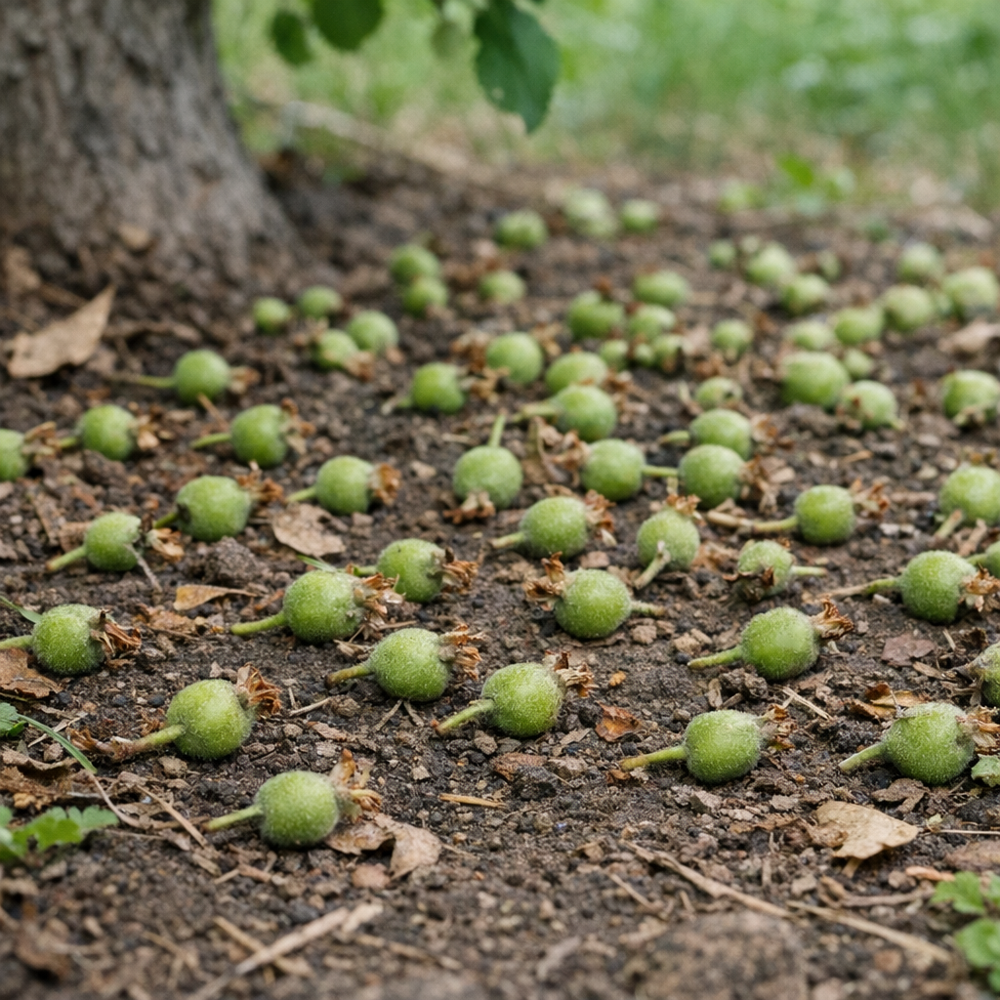
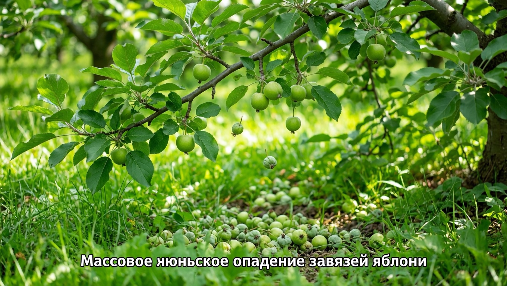
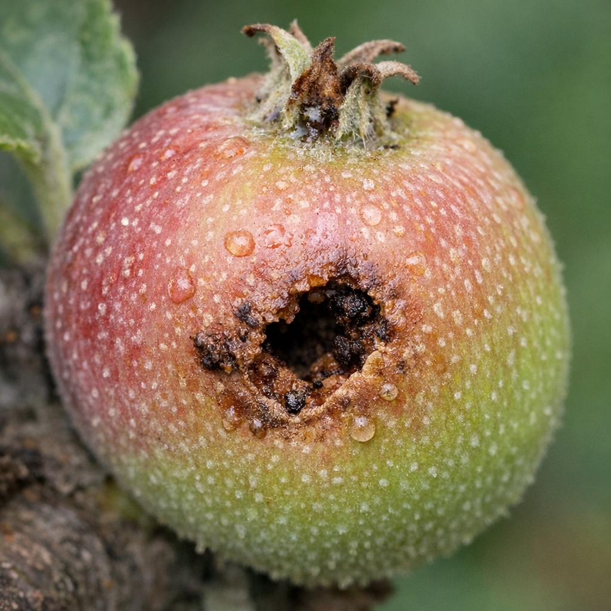
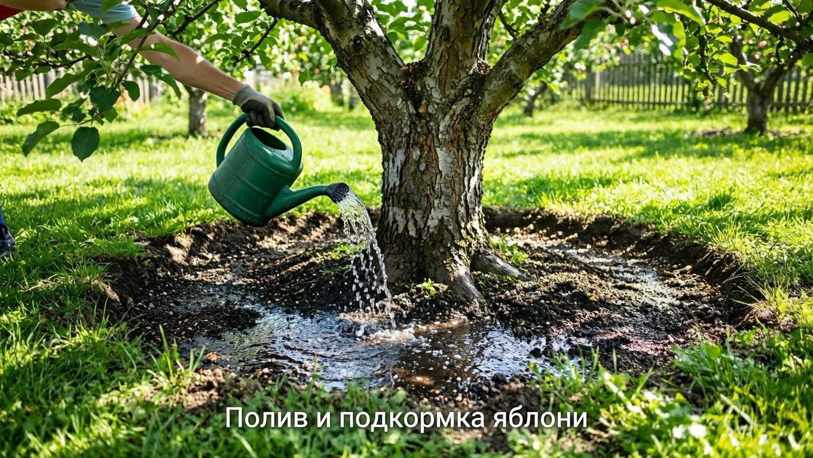
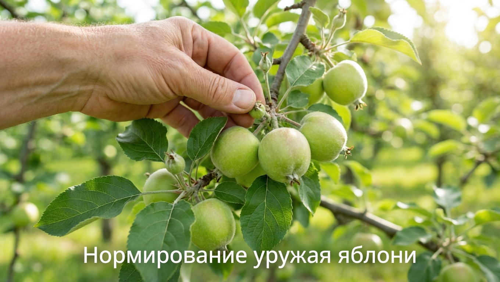
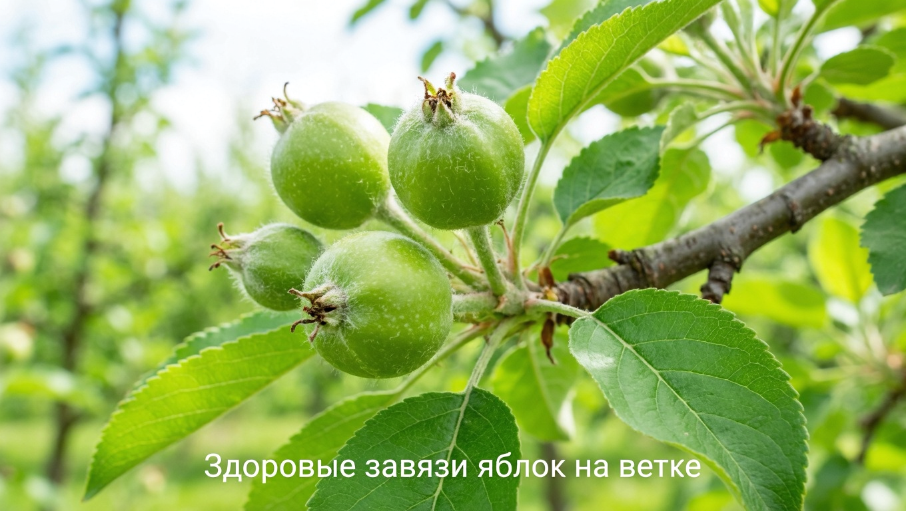

Весной яблоня цвела пышно, завязалось множество маленьких яблочек — а в начале лета они вдруг начали массово осыпаться под дерево. Знакомая картина, которая пугает многих садоводов: кажется, что урожай пропадает. На самом деле частичное опадение завязей у яблони — естественный процесс, но иногда оно становится избыточным, и тогда нужно искать причину. В этой статье разберём, почему опадают завязи у яблони, когда это норма, а когда проблема, и что делать, чтобы сохранить урожай.

## 🍎 Опадение завязей — это нормально?

Прежде всего важно понять: **яблоня всегда сбрасывает часть завязей, и это нормально**. Дерево при цветении закладывает гораздо больше плодов, чем способно прокормить, а затем избавляется от лишних, слабых и неопылённых — это естественное самонормирование.

Особенно заметен этот процесс в начале лета — так называемое **июньское опадение**, когда яблоня разом сбрасывает много мелких завязей. В норме может опасть большая часть завязей — иногда до 80–90%, — и оставшихся вполне достаточно для хорошего урожая. Так дерево само регулирует нагрузку, чтобы не истощиться и вырастить полноценные, а не мелкие плоды. Поэтому умеренное опадение — не повод для тревоги. Похожим образом ведут себя и другие культуры — например, по схожим причинам [опадают завязи у помидоров](https://mir-doma.pro/opadayut-zavyazi-u-pomidorov/).

## ⚠️ Когда опадение становится проблемой

Бить тревогу стоит, если завязи осыпаются **массово** и на дереве почти не остаётся плодов. Это уже сигнал, что яблоня испытывает стресс или страдает от вредителей и болезней. Разберём основные причины избыточного опадения.

## 🔍 Причины избыточного опадения завязей

### Недостаток влаги

Засуха — одна из главных причин. В сухую жаркую погоду яблоне не хватает воды, и она сбрасывает завязи, чтобы выжить. Взрослому дереву нужно много влаги, особенно в период налива плодов. Молодые и недавно посаженные яблони страдают от засухи ещё сильнее, потому что их корни залегают неглубоко.

### Нехватка питания

На бедной почве, при дефиците калия, фосфора и других элементов дереву просто не хватает сил выкормить плоды, и оно сбрасывает лишние завязи. Дисбаланс питания сказывается на урожае напрямую. При этом избыток азота тоже вреден: дерево гонит листву в ущерб плодам, поэтому во второй половине лета упор делают на калий и фосфор.

### Вредители

Яблонная плодожорка, пилильщик и цветоед повреждают завязи изнутри: червивые и подъеденные плоды опадают раньше времени. Если под деревом много падалицы с ходами и червоточинами, дело почти наверняка во вредителях. Плодожорка откладывает яйца, и гусеница вгрызается в завязь, повреждая семенную камеру, — такой плод не удерживается на ветке и опадает.

### Болезни

Парша и плодовая гниль поражают завязи и молодые плоды, из-за чего они деформируются и опадают. На таких плодах видны пятна, трещины или загнивание. Парша особенно активна в сырую погоду, поэтому во влажные годы опадение из-за болезней усиливается — важна профилактика.

### Плохое опыление

Если рядом нет подходящего сорта-опылителя, а в период цветения стояла холодная дождливая погода и не летали пчёлы, часть цветков осталась неопылённой. Неопылённые завязи развиваются слабо и вскоре опадают. Многие сорта яблонь самобесплодны, то есть не способны завязать плоды от собственной пыльцы, поэтому им обязательно нужен сорт-опылитель поблизости.

### Перегрузка и погодные стрессы

При очень обильном цветении дерево сбрасывает избыток завязей само — ему не выкормить всё. Усугубляют опадение погодные стрессы: жара, засуха, резкие перепады, а также возвратные весенние заморозки, повредившие цветки.

## ✅ Что делать, чтобы сохранить завязи

Когда причина ясна, помочь дереву несложно:

1. **Поливайте в засуху.** Взрослой яблоне нужен глубокий обильный полив, особенно в сухую погоду и в период налива плодов. Приствольный круг полезно замульчировать, чтобы влага держалась дольше. Поливать лучше редко, но обильно, промачивая почву на глубину залегания корней, а не слегка смачивать поверхность.
2. **Подкормите калием и фосфором.** Летом дереву нужны калийно-фосфорные удобрения для завязывания и налива плодов; избытка азота избегают. О питании растений — в статье о [летних подкормках](https://mir-doma.pro/letnie-podkormki-ovoshchey/).
3. **Боритесь с вредителями.** От плодожорки помогают ловчие пояса на стволах, феромонные ловушки, своевременные обработки и обязательный сбор падалицы, чтобы гусеницы не расползались. Принципы борьбы с вредителями те же, что и с [тлёй](https://mir-doma.pro/kak-izbavitsya-ot-tli/) и другими насекомыми.
4. **Защищайте от болезней.** Профилактические обработки от парши и уборка поражённых плодов сдерживают распространение болезней.
5. **Обеспечьте опыление.** Посадите рядом 2–3 сорта яблонь, цветущих одновременно, — они опыляют друг друга и повышают завязываемость.

6. **Нормируйте урожай.** При сильной перегрузке часть завязей прореживают вручную — так оставшиеся плоды будут крупнее, а дерево не истощится.

## 🛡️ Профилактика

Чтобы завязи не осыпались, за яблоней ухаживают весь сезон:

- регулярно поливайте в засушливые периоды;
- поддерживайте питание, особенно калий и фосфор;
- вовремя обрабатывайте от вредителей и болезней, вешайте ловчие пояса;
- убирайте падалицу, чтобы не плодились вредители;
- сажайте сорта-опылители для хорошего завязывания;
- проводите санитарную обрезку для здоровой, проветриваемой кроны;
- весной по возможности защищайте цветущее дерево от возвратных заморозков.

## ❓ Частые вопросы

### Почему яблоня сбрасывает завязи?

Частично — это норма (июньское самонормирование), когда дерево избавляется от лишних и неопылённых завязей. Избыточный сброс вызывают засуха, нехватка калия и фосфора, вредители (плодожорка), болезни (парша), плохое опыление и погодные стрессы. Нужно определить причину и устранить её.

### Что такое июньское опадение завязей?

Это естественный процесс, когда в начале лета яблоня разом сбрасывает часть мелких завязей, оставляя столько плодов, сколько сможет прокормить. Опасть может большая часть завязей — это нормально, и оставшихся хватает для хорошего урожая. Тревожиться стоит лишь при массовом сбросе почти всех плодов.

### Как понять, что завязи опадают из-за вредителей?

Если опавшие завязи и плоды червивые, с ходами, червоточинами или подъедены изнутри, причина — вредители, чаще всего яблонная плодожорка или пилильщик. В этом случае помогают ловчие пояса, феромонные ловушки, обработки и обязательный сбор падалицы.

### Нужно ли поливать яблоню, чтобы не опадали завязи?

Да, в засушливую погоду полив критически важен: без достаточной влаги дерево сбрасывает завязи. Взрослой яблоне нужен глубокий обильный полив, а приствольный круг полезно мульчировать, чтобы влага держалась дольше.

### Почему опадают завязи, если яблоня цвела обильно?

Обильное цветение не гарантирует урожай: дерево не может выкормить все завязавшиеся плоды и часть сбрасывает само. Кроме того, при плохом опылении (нет сорта-опылителя, холодная погода в цветение) многие цветки не опыляются, и такие завязи опадают.

### Сколько завязей должно остаться на яблоне?

Точного числа нет — дерево само оставляет столько плодов, сколько способно выкормить. Если завязей слишком много, часть прореживают вручную, оставляя по одному-два плода в каждом пучке, — тогда яблоки будут крупнее, а ветви не сломаются под нагрузкой.

### Опадают завязи у молодой яблони — почему?

У молодых деревьев опадение часто связано с тем, что они ещё не окрепли и сбрасывают плоды, чтобы направить силы на рост. Также причиной бывают засуха (у молодых поверхностные корни), нехватка питания или подмерзание цветков весной. Молодой яблоне особенно важны полив и уход.

### Как повысить завязываемость яблони?

Посадите рядом несколько сортов-опылителей, цветущих в одно время, обеспечьте полив и калийно-фосфорное питание, защищайте дерево от вредителей и болезней и привлекайте пчёл. Комплексный уход заметно повышает количество завязавшихся и сохранившихся плодов.

## Заключение

Опадение завязей у яблони частично естественно — так дерево оставляет ровно столько плодов, сколько сможет выкормить. Но если завязи осыпаются массово, причина обычно в засухе, нехватке питания, вредителях, болезнях или плохом опылении. Наладьте полив и подкормку, защитите дерево от плодожорки и парши, посадите сорта-опылители — и яблоня сохранит завязи и порадует хорошим урожаем. Главное — вовремя определить причину и ухаживать за садом весь сезон. И помните: если опало умеренное количество завязей, а на дереве осталось достаточно плодов, — беспокоиться не о чем, это яблоня сама позаботилась о будущем урожае.

А вы сталкивались с опаданием завязей у яблони? Делитесь опытом в комментариях и подписывайтесь, чтобы не пропустить новые статьи о саде и уходе за плодовыми деревьями.
