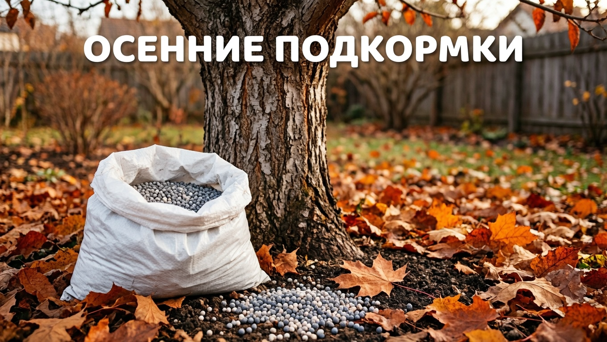
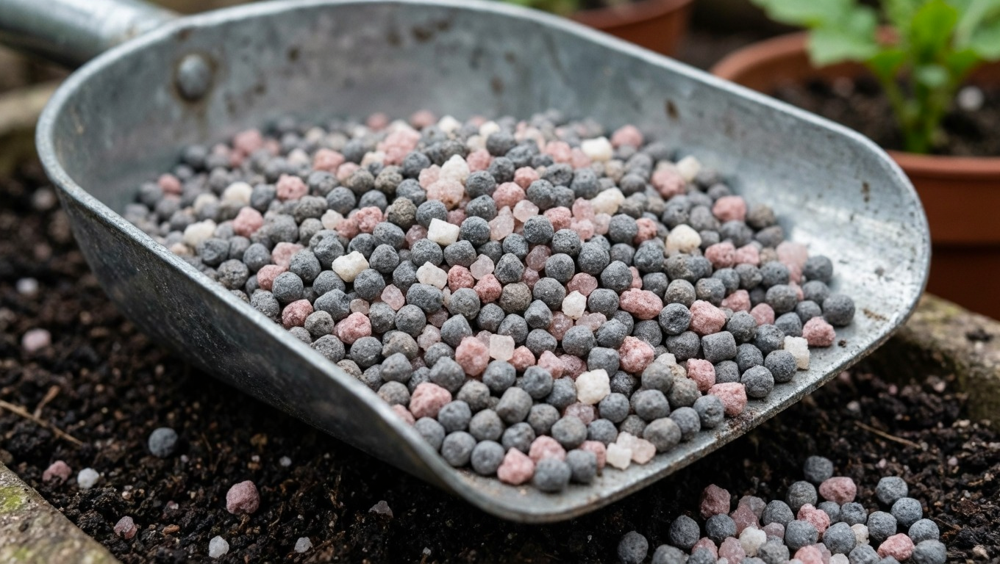
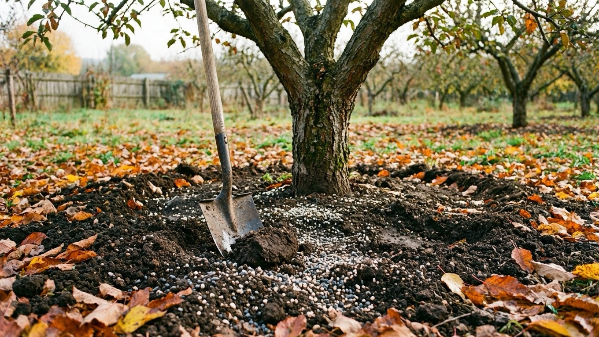
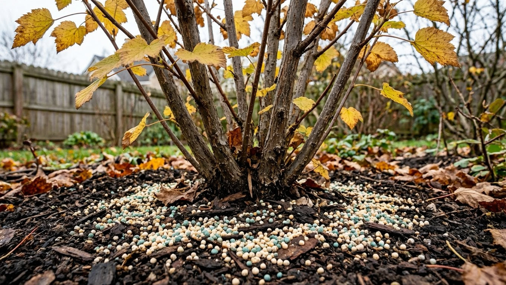
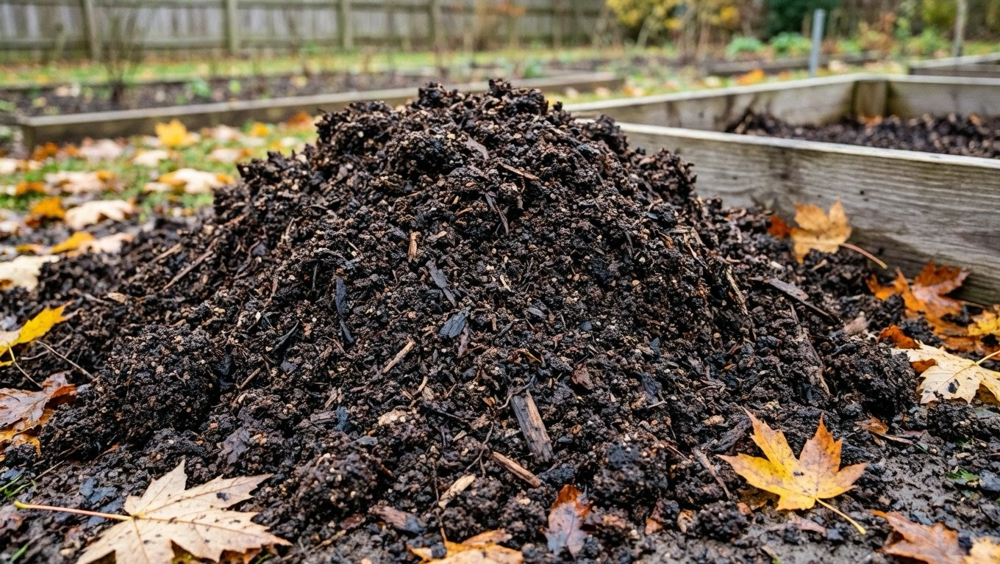
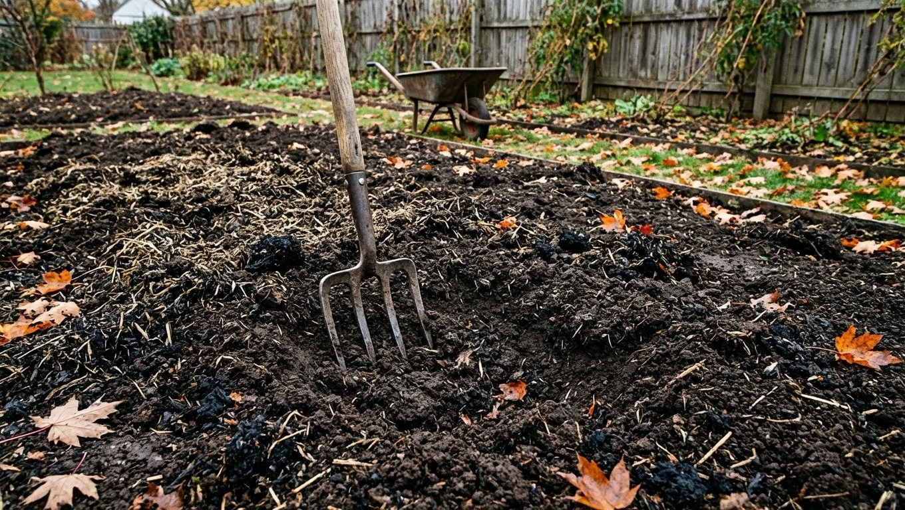

Осенняя подкормка решает не сиюминутную задачу урожая, а куда более важную — помогает растениям **пережить зиму и заложить урожай будущего года**. Осенью меняется и набор удобрений: азот, который весь сезон гнал зелень, теперь под запретом, а на первый план выходят фосфор и калий. Разберём, чем удобрять сад, огород и цветник под зиму, зачем убирают азот и когда вносить осенние подкормки.

## 🍂 Зачем подкармливать осенью

Осенняя подкормка работает на будущее:

- **укрепляет корни** — растение уходит в зиму сильным и лучше переносит морозы;
- **помогает вызреть побегам** — невызревшие мягкие ветви вымерзают, вызревшие зимуют спокойно;
- **закладывает урожай следующего года** — цветочные почки формируются с осени;
- **восстанавливает почву** — за сезон растения вынесли из неё питание, осенью его возвращают;
- **даёт удобрениям время раствориться** — к весне питание будет уже доступно корням.

Проще говоря, весной мы кормим растение, чтобы оно росло, а осенью — чтобы оно перезимовало и было с чего стартовать весной.

## 🚫 Почему осенью убирают азот

Это главное правило осенней подкормки. **Азот стимулирует рост зелени и молодых побегов** — а перед зимой это последнее, что нужно:

- новые побеги не успевают вызреть и вымерзают;
- растение тратит силы на рост вместо подготовки к покою;
- у многолетников снижается зимостойкость.

Поэтому с конца лета азотные удобрения (мочевину, аммиачную селитру, свежий навоз) из подкормок убирают. Последний раз азот дают ещё летом — как это делать в сезон, разбирали в статье про [летние подкормки овощей](https://mir-doma.pro/letnie-podkormki-ovoshchey/).

## 🧪 Чем подкормить: фосфор и калий

Осенью растениям нужны два элемента:

- **Фосфор** — развивает корневую систему, помогает растению укорениться и окрепнуть.
- **Калий** — повышает зимостойкость, помогает побегам вызреть и накопить сахара, которые работают как «антифриз».

Конкретные удобрения:

- **суперфосфат** (двойной суперфосфат) — основной источник фосфора;
- **сульфат калия (сернокислый калий)** — калий без хлора, безопасный для растений;
- **осенние комплексные удобрения** с пометкой «осень» / «осеннее» — уже сбалансированы (много фосфора и калия, азота почти нет), самый простой вариант;
- **древесная зола** — природный источник калия и микроэлементов, вносят под перекопку.

## 🌳 Чем подкормить плодовые деревья осенью

Деревья подкармливают после сбора урожая, в сентябре-октябре:

- под перекопку приствольного круга вносят **суперфосфат и сульфат калия** (по инструкции на упаковке, с учётом возраста дерева);
- полезно добавить **перепревший перегной или компост** — он и питает, и мульчирует, и улучшает почву;
- **золу** рассыпают по приствольному кругу и слегка заделывают;
- азот и свежий навоз — под запретом.

Совмещайте подкормку с остальными осенними работами: обработкой, побелкой, влагозарядковым поливом — всё это собрано в статье про [подготовку сада к зиме](https://mir-doma.pro/podgotovka-sada-k-zime/). Если осенью досаживаете деревья, стартовое питание закладывают прямо в посадочную яму — см. [посадку плодовых деревьев осенью](https://mir-doma.pro/posadka-plodovyh-derevev-osenyu/).

## 🫐 Чем подкормить ягодные кусты

Смородина, крыжовник, малина закладывают урожай будущего года именно осенью:

- вносят **фосфорно-калийные удобрения** под кусты, заделывая в почву;
- хорошо отзываются на **перегной и золу**;
- у малины подкормку совмещают с вырезанием отплодоносивших побегов;
- смородину и крыжовник подкармливают после сбора ягод и обрезки.

Как правильно обрезать кусты осенью, чтобы урожай был больше, — в статьях про [обрезку смородины](https://mir-doma.pro/obrezka-smorodiny/) и [обрезку малины](https://mir-doma.pro/obrezka-maliny/).

## 🥕 Чем подкормить грядки и почву

Освободившиеся грядки готовят к следующему сезону:

- под осеннюю перекопку вносят **перепревший навоз, компост или перегной** — за зиму органика «дозреет» и весной почва будет плодородной;
- **свежий навоз** осенью допустим только под глубокую перекопку пустых грядок (не под растения) — за зиму он перепреет;
- добавляют **фосфорно-калийные** удобрения и золу;
- под **подзимние посадки** (чеснок, лук) грядку заправляют заранее, без свежего навоза — как сажать, в статье про [чеснок под зиму](https://mir-doma.pro/chesnok-pod-zimu/);
- полезен посев **сидератов** (горчица, рожь, фацелия) — их заделывают в почву, и они работают как зелёное удобрение.

## 🌹 Чем подкормить цветы и розы

Многолетники и розы тоже готовят к зиме:

- **фосфорно-калийные** удобрения помогают им окрепнуть и заложить цветочные почки;
- азотные подкормки прекращают ещё в конце лета;
- под розы вносят суперфосфат и калий — это повышает их зимостойкость перед укрытием.

Полный сезонный уход за розами, включая осеннюю подготовку, — в статье про [розы: посадку и уход](https://mir-doma.pro/rozy-posadka-i-uhod/), а как укрыть кусты после подкормки — в материале про [укрытие роз на зиму](https://mir-doma.pro/ukrytie-roz-na-zimu/).

## 🗓️ Когда вносить осенние подкормки

- **август — сентябрь** — подкормка многолетников, роз, ягодных кустов (успеть до холодов, чтобы питание усвоилось);
- **сентябрь — октябрь** — плодовые деревья после сбора урожая;
- **октябрь, под перекопку** — заправка пустых грядок органикой и минералкой на весну;
- главное — внести **до устойчивых холодов**, пока корни ещё работают и почва не промёрзла.

Сухие удобрения вносят под неглубокую заделку и полив, а в дождливую осень полив не нужен — влаги хватает.

## ❌ Частые ошибки

- **Внесли азот осенью** — растения гонят зелень вместо подготовки к зиме, побеги вымерзают.
- **Свежий навоз под растения** — обжигает корни; осенью его дают только под перекопку пустых грядок.
- **Подкормили слишком поздно** — по мёрзлой земле удобрение не усвоится.
- **Хлористый калий вместо сульфата** — хлор вредит многим культурам; берут калий без хлора.
- **Передозировка** — «щедрая» подкормка вредит не меньше нехватки; дозы по инструкции.

## ❓ Частые вопросы

**Чем подкормить сад осенью?**
Фосфорно-калийными удобрениями — суперфосфатом и сульфатом калия — или готовым осенним комплексным удобрением. Плодовые деревья и кусты подкармливают после сбора урожая, дополняя перегноем и золой. Азот осенью не вносят.

**Почему осенью нельзя вносить азот?**
Азот стимулирует рост молодых побегов, которые не успевают вызреть и вымерзают зимой. Осенью растению нужно готовиться к покою, а не расти, поэтому азотные удобрения убирают ещё в конце лета.

**Какие удобрения вносить под зиму?**
Фосфор (суперфосфат) и калий (сульфат калия) из минеральных, а из органики — перепревший перегной, компост и золу. Готовые смеси с пометкой «осеннее» уже сбалансированы под сезон.

**Когда вносить осенние подкормки?**
Многолетники, розы и кусты — в августе-сентябре, плодовые деревья — в сентябре-октябре после урожая, заправку грядок органикой — под октябрьскую перекопку. Главное — успеть до устойчивых холодов.

**Можно ли вносить навоз осенью?**
Свежий навоз — только под глубокую перекопку пустых грядок, где за зиму он перепреет. Под растения и в подзимние посадки свежий навоз не вносят — он обжигает корни. Перепревший перегной безопасен.

**Чем подкормить розы и цветы перед зимой?**
Фосфорно-калийными удобрениями (суперфосфат и сульфат калия) — они повышают зимостойкость и помогают заложить цветочные почки. Азот прекращают давать ещё в конце лета, до укрытия.

---

Осенняя подкормка — это вклад в следующий сезон: фосфор укрепляет корни, калий готовит растения к морозам, а органика восстанавливает почву. Запомнить просто: осенью убираем азот и делаем ставку на фосфор и калий, внося всё до устойчивых холодов. Остальные осенние дела в саду — обработка, побелка, укрытие — собраны в статье про [подготовку сада к зиме](https://mir-doma.pro/podgotovka-sada-k-zime/).
