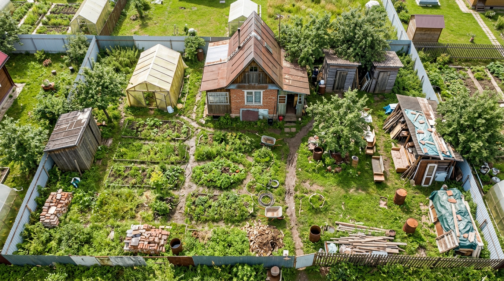
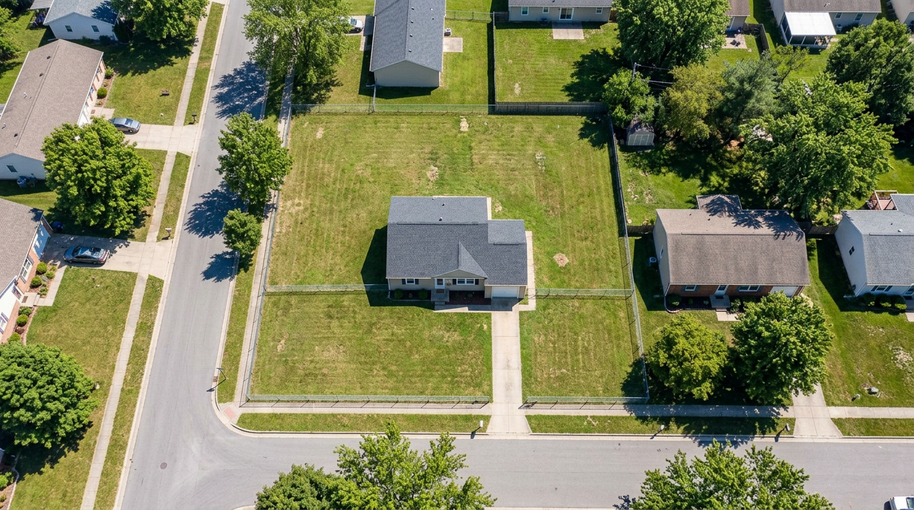
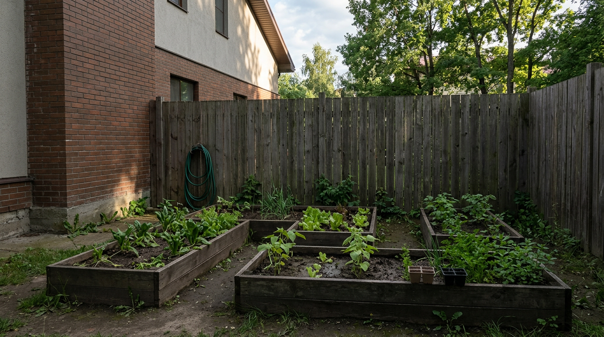
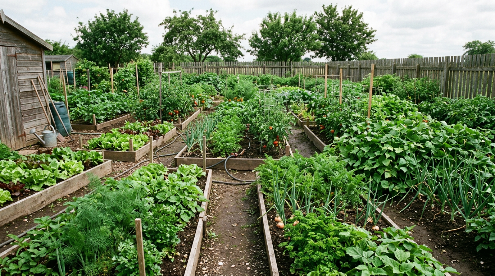
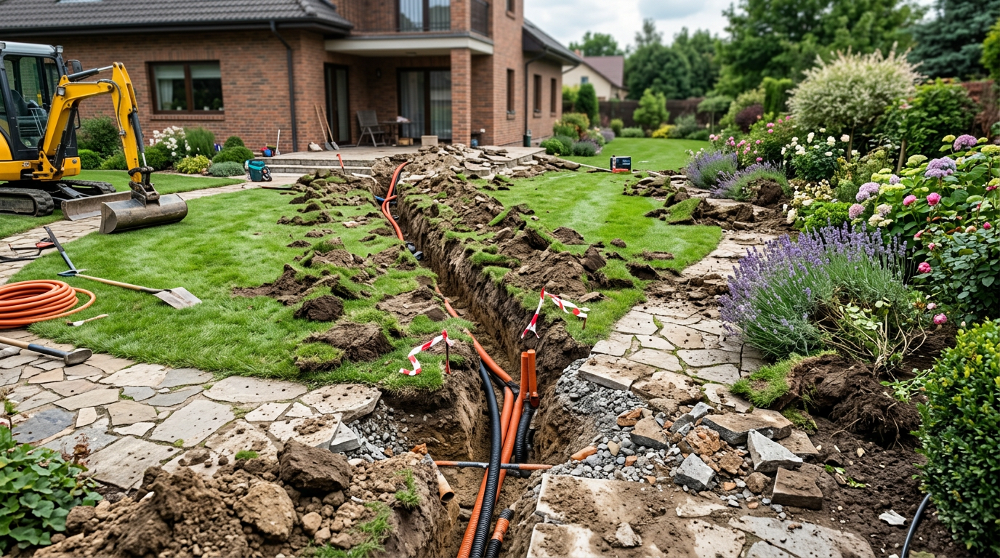
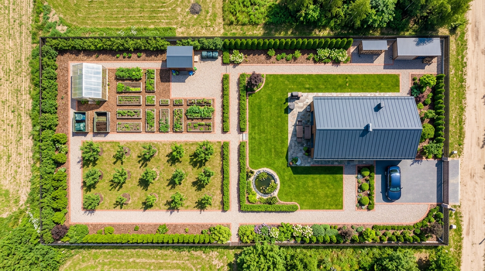

Планировка участка — тот случай, когда ошибки обходятся особенно дорого: перенести дом, выкопать заново коммуникации или передвинуть баню после стройки практически невозможно или очень затратно. Поэтому ошибки лучше предусмотреть заранее, ещё на бумаге. В этой статье собрали самые частые ошибки планировки дачного участка и рассказали, как их избежать, чтобы участок получился удобным, красивым и без дорогих переделок.

Это статья из цикла о планировке. Как сделать всё правильно, подробно разобрано в основной статье — [планировка участка 10 соток](https://mir-doma.pro/planirovka-uchastka-10-sotok/), а здесь — о том, чего избегать.

## 🧭 Почему ошибки планировки так дорого обходятся

Главная особенность планировки в том, что её результат закрепляется надолго. Дом, баня, гараж, проложенные трубы и дорожки — это капитальные объекты, которые потом не сдвинуть. Если зоны расположены неудобно, грядки оказались в тени, а машине негде встать, жить с этим придётся годами. Поэтому потраченное на план время окупается сторицей. Разберём, какие ошибки встречаются чаще всего.

## ❌ Главные ошибки планировки

### Стихийная застройка без плана

Самая частая ошибка — строить и сажать без общего плана, «по ходу». В результате участок превращается в хаотичный набор грядок и построек, которые мешают друг другу. Всегда начинайте с плана всего участка на бумаге. Даже простая схема в масштабе помогает увидеть, что куда поместится, и избежать большинства дальнейших ошибок.

### Дом не на своём месте

Дом, поставленный в центре участка, дробит землю на неудобные куски и съедает полезную площадь. Обычно дом размещают ближе к въезду и северной границе — так остаётся цельное солнечное пространство для сада и отдыха. Ещё одна частая ошибка — не учесть ориентацию: жилые комнаты лучше выводить окнами на юг и восток, а не на север.

### Огород в тени

Грядки, затенённые домом, забором или деревьями, дают скудный урожай. Огород размещают на самой солнечной, южной стороне, а высокие деревья и постройки — так, чтобы они не отбрасывали тень на грядки.

### Не учли стороны света и розу ветров

Если не определить стороны света, легко ошибиться с размещением всего: грядки окажутся в тени, жилые комнаты — на север, а зона отдыха — на продуваемом месте. Анализ освещённости и ветров — первый шаг планировки.

### Забыли про зону отдыха

Участок, целиком занятый грядками, быстро утомляет — отдохнуть негде. Всегда оставляйте место для отдыха: беседку, газон, площадку для барбекю. Это превращает дачу из «места работы» в место, где приятно проводить время.

### Не предусмотрели коммуникации

Если проложить воду, электричество и канализацию после благоустройства, придётся вскрывать готовые дорожки и газон. Сети планируют заранее, ещё на генплане. Заодно сразу выбирают место для [септика](https://mir-doma.pro/septik-dlya-dachi/) по санитарным нормам.

### Хаотичное расположение построек

Сарай, теплица, баня и беседка, расставленные без плана, создают беспорядок и неудобство. Постройки группируют по зонам и связывают дорожками — подробнее в статье о [зонировании участка](https://mir-doma.pro/zonirovanie-uchastka-10-sotok/).

### Нарушение норм и отступов

Несоблюдение отступов от границ и расстояний между постройками приводит к спорам с соседями и проблемам с оформлением. Нормы (расстояния от дома, бани, построек до границ и колодца) учитывают с самого начала.

### Не продумали въезд и парковку

Машине нужно где-то заехать, встать и развернуться. Если не предусмотреть подъезд и парковку у въезда, потом придётся жертвовать другими зонами. Об этом важно помнить и при [планировке участка под строительство](https://mir-doma.pro/planirovka-uchastka-10-sotok-pod-stroitelstvo/), когда нужен ещё и заезд для техники.

### Проигнорировали воду и дренаж

Дом или погреб в низине, отсутствие дренажа на участке с высоким уровнем грунтовых вод — это подтопления и сырость. Рельеф и воду учитывают при размещении построек и предусматривают отвод воды. Дом и погреб ставят на возвышении, а для низин и участков с высокой водой заранее планируют дренаж и ливневые канавы.

### Слишком плотная застройка

Желание уместить максимум приводит к тесноте: постройки впритык, нет проходов, не осталось места под будущую баню или гараж. Оставляйте свободное пространство и резерв — участок должен «дышать». Немного газона и свободного места всегда лучше, чем втиснутые впритык постройки и грядки, между которыми тяжело пройти.

## ✅ Как избежать ошибок планировки

Избежать большинства ошибок помогает простой подход:

1. **Начните с плана** участка в масштабе на бумаге или в программе.
2. **Проанализируйте участок** — стороны света, рельеф, грунт, уровень воды, въезд.
3. **Разделите на зоны** с учётом солнца и удобных связей.
4. **Разместите дом** у въезда и северной границы, грядки — на солнце, отдых — в тихом уголке.
5. **Заложите коммуникации и дорожки** заранее.
6. **Соблюдайте нормы** отступов и оставьте резерв места под будущее.

Нарисуйте несколько вариантов и выберите лучший — это куда дешевле, чем переделывать готовый участок.

## 🛡️ Краткий чек-лист правильной планировки

- есть общий план всего участка;
- дом у въезда, не затеняет участок;
- грядки на солнечной стороне;
- учтены стороны света и роза ветров;
- предусмотрена зона отдыха;
- коммуникации заложены заранее;
- постройки сгруппированы по зонам;
- соблюдены нормы и отступы;
- продуманы въезд и парковка;
- учтён рельеф и отвод воды;
- оставлен резерв свободного места.

## ❓ Частые вопросы

### Какие самые частые ошибки при планировке участка?

Самые распространённые — отсутствие общего плана, дом в центре или без учёта сторон света, огород в тени, забытая зона отдыха, не заложенные заранее коммуникации, хаотичные постройки и нарушение норм отступов. Большинства из них легко избежать, начав с плана участка на бумаге.

### Где нельзя размещать дом на участке?

Не стоит ставить дом в центре участка — он дробит землю и съедает площадь. Также не размещают дом так, чтобы он затенял будущий сад и огород или чтобы жилые комнаты выходили только на север. Обычно дом ставят у въезда и северной границы.

### Почему нельзя сажать огород в тени?

В тени дома, забора или деревьев растениям не хватает солнца, и урожай получается скудным. Овощам нужно солнечное, открытое весь день место — поэтому грядки размещают на южной стороне, а высокие объекты не должны на них падать тенью.

### Что будет, если не заложить коммуникации заранее?

Если проложить воду, электричество и канализацию после того, как сделаны дорожки, газон и посадки, всё это придётся вскрывать и перекапывать. Поэтому трассы всех сетей продумывают на генплане ещё до благоустройства участка.

### Нужно ли оставлять свободное место на участке?

Да, обязательно. Плотная застройка «впритык» делает участок тесным и неудобным, а ещё не оставляет резерва под будущие постройки — баню, гараж, теплицу. Немного свободного пространства и газона делают участок просторнее и удобнее.

### Как избежать ошибок при планировке участка?

Начните с плана участка в масштабе, проанализируйте стороны света, рельеф и грунт, разделите участок на зоны, разместите дом и грядки с учётом солнца, заложите коммуникации заранее и соблюдайте нормы отступов. Нарисуйте несколько вариантов и выберите самый удобный.

## Заключение

Ошибки планировки дачного участка дороги тем, что их сложно исправить: дом, коммуникации и постройки остаются на годы. Но почти все типичные промахи — стихийная застройка, дом не на месте, огород в тени, забытые коммуникации и зона отдыха — легко предотвратить, если начать с плана и анализа участка. Продумайте зонирование, учтите стороны света и нормы, заложите сети заранее и оставьте резерв места — и ваш участок будет удобным и красивым без дорогих переделок. Помните золотое правило: один час с карандашом над планом экономит недели работы и немалые деньги на земле. А как сделать всё правильно с нуля — в основной статье о [планировке участка 10 соток](https://mir-doma.pro/planirovka-uchastka-10-sotok/).

А какие ошибки планировки встречались вам? Делитесь опытом в комментариях и подписывайтесь, чтобы не пропустить новые статьи о планировке и обустройстве дачи.
