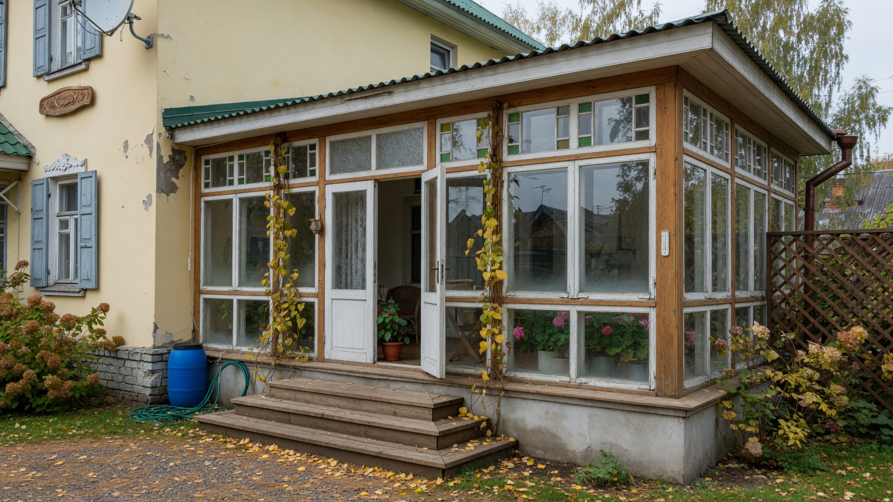
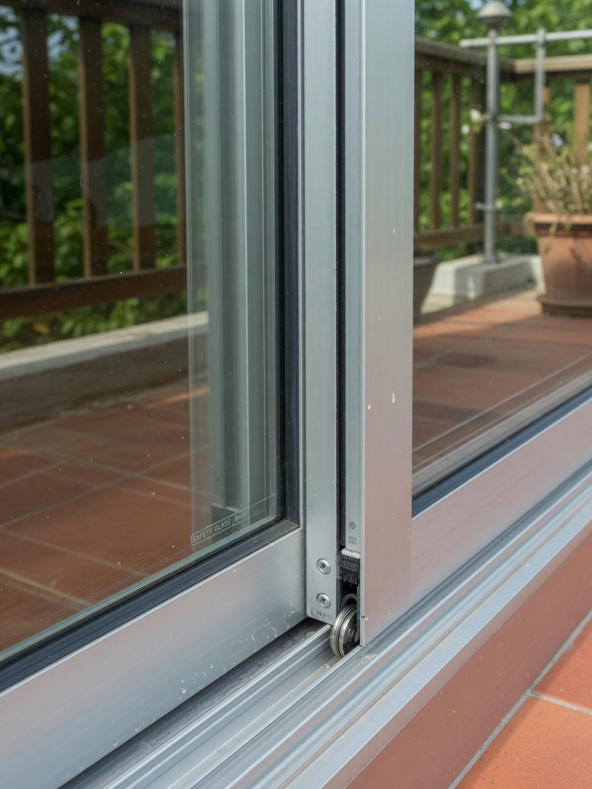
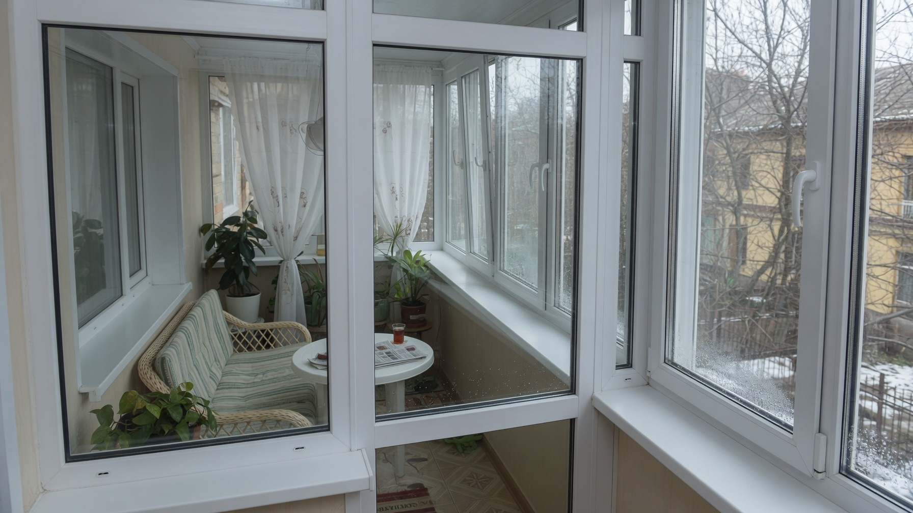
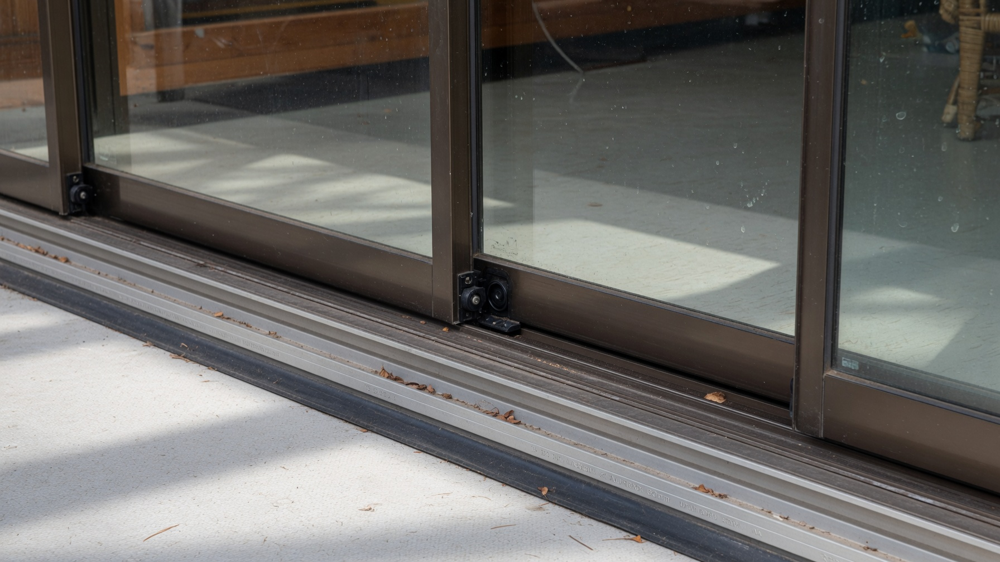
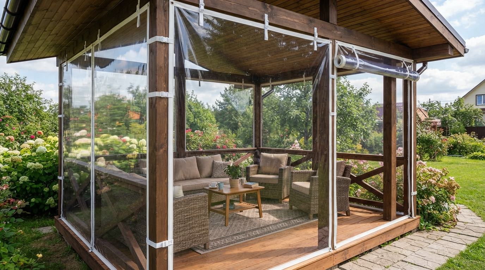
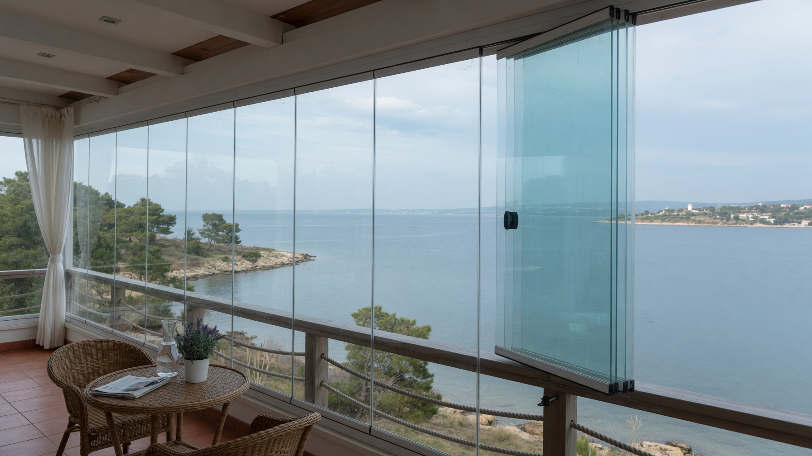

Остекление — самая дорогая часть веранды и решение, которое переделать почти невозможно. И главная ошибка здесь не в выборе профиля, а в том, что **тёплое остекление ставят на веранду, которую никогда не будут отапливать**: деньги уходят втрое больше, а результат тот же, что от холодного алюминия. Разберём четыре системы по параметрам, из чего складывается смета, когда тёплое остекление действительно нужно и что зимой происходит с раздвижными створками.

## 🧭 Главный вопрос: зачем вам остекление

От честного ответа зависит бюджет — разница между вариантами кратная.

**Задача «защитить от ветра, дождя, пыли и снега»** — веранда остаётся холодной, но становится пригодной для использования в межсезонье, там не мокнет мебель и не наметает снег. Этого достигает **холодное остекление**, и оно дешевле в разы.

**Задача «сделать полноценную тёплую комнату»** — веранда становится частью дома, здесь можно сидеть зимой. Нужно **тёплое остекление**, но само по себе оно не работает: понадобятся утеплённые стены, пол, потолок и источник тепла. Без этого стеклопакеты не спасут.

**Задача «прикрыть на сезон недорого»** — есть бюджетные решения вроде мягких окон, о них в конце статьи.

Разница в цене между холодным и тёплым остеклением обычно **в два-три раза**, поэтому вопрос стоит решить до того, как вызывать замерщика.

## ⚖️ Четыре системы: сравнение

| Параметр | Холодный алюминий | Тёплый ПВХ | Раздвижное | Безрамное |
|---|---|---|---|---|
| **Теплоизоляция** | Минимальная (+3–5 °C к улице) | Высокая, держит тепло | Зависит от профиля, обычно низкая | Практически нет |
| **Нагрузка на основание** | Низкая | **Высокая** | Низкая–средняя | Средняя |
| **Обслуживание зимой** | Простое | Простое | **Проблемное: обледенение** | Простое |
| **Сложность монтажа** | Средняя | Высокая | Средняя | Только специалисты |
| **Обзор** | Профили в поле зрения | Профили широкие | Средний | **Максимальный** |
| **Относительная цена** | Низкая | **Высокая** | Средняя | Высокая |

**Холодный алюминий** — рабочая лошадка дачной веранды. Тонкий профиль без терморазрыва, одинарное стекло. Внутри теплее улицы на несколько градусов — этого хватает, чтобы веранда стала сухой и не продуваемой. Лёгкий, не нагружает основание, стоит недорого.

**Тёплый ПВХ** — многокамерный профиль со стеклопакетом, тот же, что в доме. Реально удерживает тепло, но и весит соответственно. Оправдан только при отоплении.

**Раздвижные системы** — створки едут по направляющим, а не распахиваются внутрь. Экономят место, удобны на узкой веранде. Бывают и холодные алюминиевые, и тёплые. Главный нюанс — зимнее поведение (см. ниже).

**Безрамное остекление** — закалённые стёкла без вертикальных профилей, створки сдвигаются и разворачиваются вдоль стены. Даёт панорамный вид, но по теплу это **всегда холодный вариант**: герметичность минимальная, от мороза не спасает.

## 🎯 Когда холодного остекления достаточно

Холодное остекление — правильный выбор, если:

- **веранда не отапливается** и вы не планируете это менять;
- нужно **продлить сезон** — комфортно с апреля по октябрь, а не только летом;
- веранда используется как **тамбур, кладовая, место для сушки** или летняя столовая;
- **дом дачный, сезонный**, зимой вы там не живёте;
- **основание старое или лёгкое** — столбчатый фундамент, деревянная обвязка;
- **бюджет ограничен**, и лучше вложиться в утепление дома, чем в стеклопакеты на холодной пристройке.

**Когда деньги на тёплое остекление выброшены:**

- стены, пол и потолок веранды **не утеплены** — тепло уйдёт через них, стеклопакеты не помогут;
- **нет источника тепла** — удерживать нечего;
- веранда **открыта в холодный дом**, который сам не топится зимой;
- поставили тёплое остекление, но **дверь в дом осталась старой** и продувается.

Логика та же, что и с утеплением стен: сначала тепловой контур целиком, потом окна. Как собрать этот контур, разобрано в статье про то, [чем утеплить веранду изнутри](https://mir-doma.pro/chem-uteplit-verandu-iznutri/).

## 🏗️ Нужно ли усиливать основание

Вопрос, который всплывает уже после заказа, — и это дорого.

**Тёплое ПВХ-остекление тяжёлое.** Армированный профиль плюс двухкамерный стеклопакет дают вес, который в разы превышает холодный алюминий с одинарным стеклом. На большой веранде разница набегает существенная.

**Когда нужно оценивать несущую способность:**

- веранда стоит на **столбчатом фундаменте** или на кирпичных столбиках;
- основание **старое**, есть трещины или перекос;
- под верандой **деревянная обвязка**, которая уже прогибается;
- планируется **сплошное остекление в пол** по всему периметру.

**Что делать:** до заказа конструкций показать веранду специалисту, который оценит фундамент и обвязку. Иногда достаточно усилить обвязку или добавить опорные столбы, иногда требуется полноценный ремонт основания — и тогда бюджет меняется принципиально. Как понять, что с фундаментом проблемы, разобрано в статье про [ремонт фундамента и замену венцов](https://mir-doma.pro/remont-fundamenta-i-venczov/).

**Хорошая новость:** холодный алюминий по весу сопоставим с обычными деревянными рамами, и для него усиление обычно не требуется.

## ❄️ Что происходит с раздвижными системами зимой

Это то, о чём не рассказывают в салонах, а дачники узнают в первую же зиму.

**Обледенение направляющих.** Нижний профиль раздвижной системы — это открытый жёлоб, в который попадают снег, дождевая вода и конденсат. При минусе всё это замерзает, и створки перестают двигаться. Дёргать их в таком состоянии нельзя: можно сорвать ролики или погнуть профиль.

**Примерзание роликов и щёток.** Уплотнительные щётки набирают влагу и примерзают к профилю. Створка либо не идёт, либо идёт с усилием, вырывая щётки.

**Скопление снега в жёлобе.** На открытой веранде снег задувает прямо в направляющие.

**Что с этим делать:**

- **регулярно вычищать нижний профиль** от снега, льда и мусора — щёткой, а не металлом;
- **не применять силу**, если створка не идёт: сначала отогреть или очистить;
- на зиму **оставить нужные створки в рабочем положении**, а остальные не трогать до весны;
- выбирать системы, где **направляющая приподнята** или имеет дренажные отверстия;
- в регионах с суровой зимой рассмотреть **распашные створки** вместо раздвижных — они переносят мороз спокойнее.

Раздвижные системы отлично работают с весны по осень и удобны на узкой веранде, где распахнутая створка мешает. Просто нужно понимать, что зимой они требуют внимания.

## 💰 Из чего складывается стоимость

Конкретные цены зависят от региона, производителя и сезона и быстро меняются, поэтому важнее понимать структуру сметы — она позволит проверить любое предложение.

**Составляющие:**

1. **Конструкции** — считаются за квадратный метр остекления. На цену влияют система (алюминий или ПВХ), тип открывания, стеклопакет, фурнитура.
2. **Замер и доставка** — иногда включены, иногда отдельной строкой.
3. **Демонтаж старого остекления**, если оно есть.
4. **Подготовка проёмов** — выравнивание, усиление обвязки, изготовление опорных стоек.
5. **Монтаж** — за метр или за конструкцию.
6. **Сопутствующее:** отливы, откосы, подоконники, москитные сетки, нащельники. Набегает заметно.
7. **Усиление основания**, если требуется — самая непредсказуемая статья.

**Где чаще всего переплачивают:**

- **тёплое остекление на неотапливаемой веранде** — главная переплата, разница в разы при нулевом результате;
- **двухкамерные стеклопакеты**, когда стены не утеплены — тепло всё равно уходит через них;
- **дорогая фурнитура** на створках, которые открывают дважды в год;
- **панорамное остекление в пол** без оценки нагрузки — потом добавляются расходы на усиление;
- **заказ по телефону без замера** — итог всегда отличается от предварительного расчёта.

**Практический совет:** запрашивайте смету **с разбивкой по позициям**, а не итоговой суммой. Так видно, за что именно вы платите и что можно убрать. И сравнивайте не «цену за метр», а полную стоимость под ключ — в неё у разных подрядчиков входит разное.

## 🪟 Бюджетная альтернатива: мягкие окна

Если капитальное остекление не по бюджету или веранда используется сезонно, есть промежуточное решение — **мягкие окна из прозрачной ПВХ-плёнки** на люверсах и ремешках.

- **закрывают от ветра, дождя и снега**, продлевают сезон;
- **стоят в разы дешевле** любого капитального остекления;
- **не нагружают основание** — крепятся к каркасу;
- **снимаются на зиму** или остаются;
- служат несколько сезонов, со временем мутнеют;
- **на морозе становятся жёсткими** — сворачивать и складывать их при минусе нельзя, плёнка трескается.

Это честный вариант «дёшево и быстро» для летней веранды, но полноценным остеклением он не является: ни тепла, ни герметичности мягкие окна не дают. Что ещё можно сделать с сезонной верандой, разобрано в статье про [летнюю веранду на даче](https://mir-doma.pro/letnyaya-veranda-na-dache/).

## ❌ Частые ошибки

- **Поставили тёплое остекление на неутеплённую веранду** — переплата без результата.
- **Не оценили нагрузку на фундамент** — основание просело под весом конструкций.
- **Выбрали раздвижные створки в суровом климате** без понимания зимних нюансов.
- **Сэкономили на монтаже** — щели по периметру сводят на нет любой профиль.
- **Забыли про отливы и водоотвод** — вода затекает под конструкцию.
- **Не предусмотрели проветривание** — летом на застеклённой веранде становится жарко, нужны открывающиеся створки или форточки.
- **Заказали без замера** — конструкции не встали в проём.
- **Оставили старую дверь в дом** — тёплая веранда теряет смысл, если из дома в неё дует.

## ❓ Частые вопросы

**Холодное или тёплое остекление веранды — что выбрать?**
Холодное, если веранда не отапливается: оно защитит от ветра, дождя и снега и обойдётся в два-три раза дешевле. Тёплое имеет смысл только тогда, когда веранда утеплена целиком и в ней есть источник тепла.

**Насколько теплее становится с холодным остеклением?**
Обычно на несколько градусов выше уличной температуры — примерно на 3–5 °C. Этого достаточно, чтобы веранда была сухой и непродуваемой, но зимой там всё равно минус.

**Нужно ли усиливать фундамент под остекление?**
Под холодный алюминий обычно нет — он лёгкий. Под тёплое ПВХ-остекление оценка нужна, особенно если веранда стоит на столбчатом фундаменте, старой обвязке или планируется сплошное остекление в пол.

**Что зимой с раздвижными окнами?**
Направляющие обледеневают, ролики и уплотнительные щётки примерзают, в нижний профиль набивается снег. Створки в таком состоянии нельзя двигать силой — сначала очистить или отогреть. Нижний жёлоб нужно регулярно чистить.

**Сколько стоит остеклить веранду?**
Смета складывается из конструкций (за м²), монтажа, подготовки проёмов, отливов и откосов, а иногда и усиления основания. Разница между холодным и тёплым вариантом — в два-три раза. Запрашивайте смету с разбивкой по позициям, а не итоговой суммой.

**Можно ли остеклить веранду своими руками?**
Мягкие окна и простые холодные конструкции небольшого размера — реально. Тёплое ПВХ-остекление и безрамные системы монтируют специалисты: там важны точность замера, герметичность узлов и работа с тяжёлыми элементами.

**Помогут ли мягкие окна вместо остекления?**
Они защитят от ветра, дождя и снега и продлят сезон, но тепла не дадут и герметичности тоже. Это сезонное бюджетное решение, а не замена капитальному остеклению.

---

Остекление веранды сводится к одному честному вопросу: будете ли вы её отапливать. Если нет — холодный алюминий закроет задачу за разумные деньги и не нагрузит фундамент. Если да — тёплое остекление имеет смысл только в связке с утеплённым контуром и источником тепла, иначе это дорогая витрина.

**Куда идти дальше:**

- Тёплое остекление работает только на утеплённой веранде — как собрать контур, с расчётом толщины и пирогом стены: [чем утеплить веранду изнутри](https://mir-doma.pro/chem-uteplit-verandu-iznutri/).
- Если веранда остаётся холодной, важнее правильно подобрать отделку, которая переживёт мороз: [отделка холодной веранды внутри](https://mir-doma.pro/otdelka-holodnoy-verandy/).
- Пол на застеклённой веранде тоже требует морозостойких материалов — с расчётом в калькуляторе: [пол на холодной веранде](https://mir-doma.pro/pol-na-holodnoy-verande/).
- А общий разбор всех работ по веранде — стены, потолок, пол и материалы: [внутренняя отделка веранды](https://mir-doma.pro/vnutrennyaya-otdelka-verandy/).
