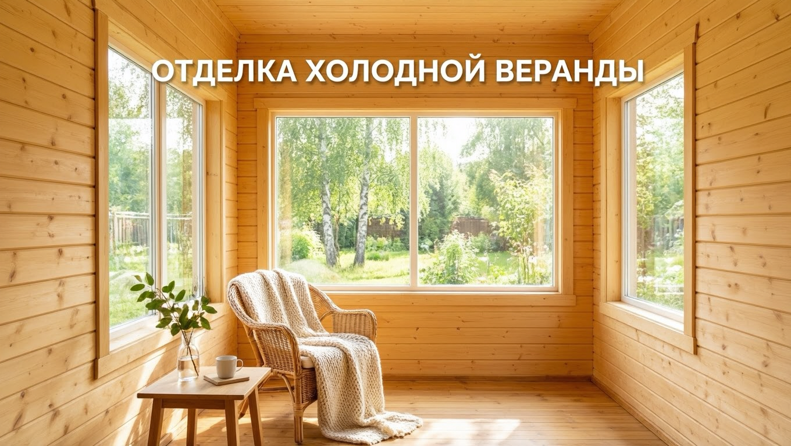
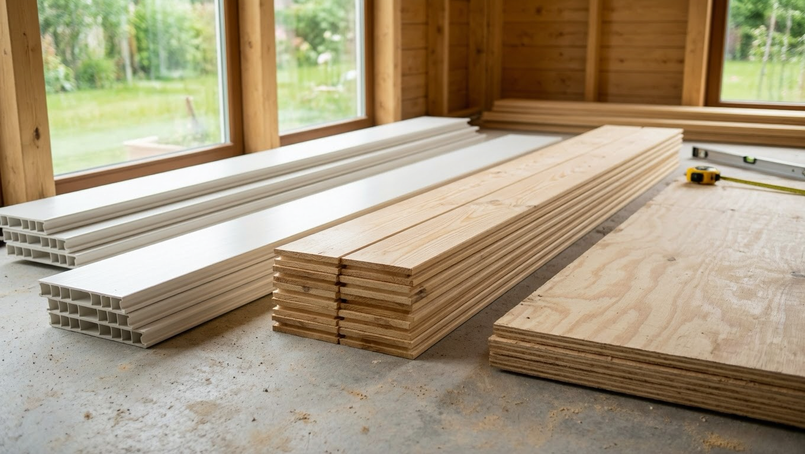
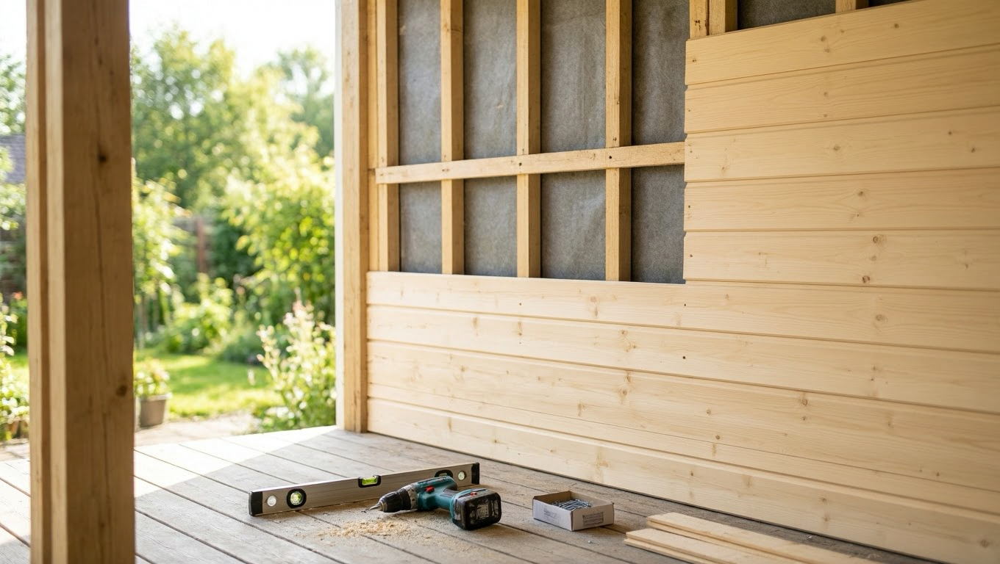

Холодная веранда — это неотапливаемая пристройка, которая зимой промерзает, а весной и осенью живёт в постоянных перепадах температуры и влажности. Именно поэтому отделывать её как жилую комнату нельзя: обычные материалы здесь коробит, ведёт и покрывает плесенью уже за пару сезонов. В этой статье разберём, чем обшить холодную веранду внутри своими руками, какие материалы не боятся сырости и мороза и как избежать главной проблемы неотапливаемых помещений — конденсата.

Это статья из цикла о веранде. Общие принципы обустройства разобраны в основной статье — [как обустроить веранду](https://mir-doma.pro/kak-obustroit-verandu/), а здесь сосредоточимся именно на внутренней отделке холодной, неотапливаемой веранды.

## ❄️ Особенности холодной веранды

Прежде чем выбирать материал, важно понять, в каких условиях он будет работать. У неотапливаемой веранды три врага отделки:

- **Перепады температуры.** За сутки воздух может прогреться днём и уйти в минус ночью. Материал постоянно расширяется и сжимается — если он к этому не готов, появляются щели, трещины и вздутия.
- **Влажность и конденсат.** Тёплый влажный воздух, попадая на холодные поверхности, оседает каплями. Отсюда сырость, разбухание и плесень.
- **Промерзание зимой.** Не всякий материал переносит цикл «заморозка — оттаивание» без потери вида и прочности.

Вывод простой: для холодной веранды подходят только материалы, устойчивые к влаге и температурным колебаниям. Всё «нежное» — обычный гипсокартон, бумажные обои, МДФ-панели, ламинат на стены — сюда не годится.

## 🧱 Как выбрать материал для отделки

Главный критерий — не красота и не цена, а **стойкость к перепадам и сырости**. По этому принципу материалы делятся на «подходящие» и «нет».

| Материал | Холодная веранда | Почему |
|---|---|---|
| Вагонка, евровагонка (дерево) | ✅ да | Дышит, переносит перепады, легко обновляется |
| Блок-хаус, имитация бруса | ✅ да | То же дерево, солиднее вид |
| ПВХ / пластиковые панели | ✅ да | Не боятся влаги, дёшево, быстро |
| Влагостойкая фанера, ОСБ-3 | ✅ да | Прочно, как основа или бюджетный вариант |
| Обычный гипсокартон | ❌ нет | Разбухает и крошится от сырости |
| Бумажные обои | ❌ нет | Отходят, плесневеют |
| МДФ-панели, ламинат на стены | ❌ нет | Вздуваются от влаги и мороза |

Самый популярный и оправданный выбор — **деревянная вагонка**: она недорогая, экологичная, хорошо переносит неотапливаемые условия и в любой момент обновляется пропиткой или краской.

## 🪵 Чем обшить стены холодной веранды

Разберём рабочие варианты подробнее.

**Деревянная вагонка** — классика для веранды. Берите камерной сушки (влажность 12–15%), иначе после монтажа её поведёт. Для неотапливаемого помещения лучше сорт АВ или В — он дешевле, а мелкие сучки на даче смотрятся уместно. Технология монтажа на обрешётку и кляймеры подробно разобрана в отдельной статье про [отделку стен вагонкой](https://mir-doma.pro/otdelka-sten-vagonkoy/) — для веранды она та же.

**Блок-хаус и имитация бруса** — та же древесина, но фактурнее: блок-хаус имитирует бревно, имитация бруса даёт ровную «брусовую» стену. Дороже вагонки, зато вид солиднее.

**ПВХ-панели (пластик)** — самый бюджетный и быстрый путь. Пластик вообще не боится влаги, моется, монтируется за день. Минус — на морозе дешёвый пластик становится хрупким, поэтому берите морозостойкие панели и не бейте их зимой.

**Влагостойкая фанера и ОСБ-3** — практичный вариант, часто как основа под покраску или как самостоятельная «дачно-лофтовая» отделка. Плиты прочные, держат перепады, их можно красить.

Чего на стенах холодной веранды **избегать**: обычного гипсокартона (нужен хотя бы влагостойкий, и то с оговорками), бумажных обоев, МДФ и настенного ламината — всё это влага и мороз выведут из строя за сезон-два.

## ⬆️ Отделка потолка

Потолок на холодной веранде отделывают теми же материалами, что и стены, — чаще всего вагонкой или ПВХ-панелями. Это логично: одинаковая фактура стен и потолка делает пространство цельным. Крепят так же — на обрешётку из бруска. Если сверху холодный чердак или скат крыши, оставьте между обшивкой и кровлей вентиляционный зазор, чтобы влага не скапливалась и дерево не гнило.

## ⬇️ Отделка пола

Пол на веранде принимает на себя грязь, влагу и перепады, поэтому материалы нужны стойкие:

- **Террасная доска (ДПК)** — древесно-полимерный композит, не боится воды и мороза, приятный на вид.
- **Керамогранит или уличная плитка** — самый долговечный вариант, но пол будет холодным на ощупь.
- **Влагостойкий ламинат 33–34 класса** — компромисс, если хочется «тепла» дерева; обычный ламинат для холода не годится.
- **Крашеная или пропитанная доска** — простой дачный вариант, требует обновления раз в несколько лет.

О том, как правильно устроить и утеплить пол снизу, если веранда стоит на холодном основании, полезно почитать в статье про [утепление дачного дома](https://mir-doma.pro/kak-uteplit-dachnyy-dom/).

## 🌡️ Нужно ли утеплять холодную веранду

Здесь кроется главная ошибка. Многие утепляют холодную веранду минватой под обшивку, надеясь сделать её теплее, — и получают обратный эффект. **Утепление без отопления не греет, а копит конденсат:** влага оседает внутри пирога, утеплитель намокает, дерево под ним гниёт.

Поэтому есть только два честных пути:

1. **Оставить веранду холодной** — просто аккуратно обшить стойкими к сырости материалами, без утеплителя. Это правильный выбор, если веранда используется в тёплый сезон.
2. **Утеплять только вместе с отоплением** — если хотите пользоваться верандой круглый год, тогда нужен полноценный «пирог» с пароизоляцией плюс источник тепла (обогреватель, тёплый пол). Тогда это уже не холодная, а тёплая веранда.

Половинчатый вариант «утеплил, но не топлю» — худший из всех.

## 💨 Пароизоляция и вентиляция против конденсата

Даже без утепления с холодной верандой нужно грамотно обращаться, чтобы не завёлся конденсат и плесень:

- Оставляйте **вентзазор** между обшивкой и стеной (обрешётка как раз его создаёт) — дерево должно проветриваться с изнанки.
- Обеспечьте **проветривание** самой веранды: открывающиеся окна или форточки выгоняют сырой воздух.
- Обрабатывайте деревянные элементы **антисептиком** до монтажа — это защита от грибка в самых уязвимых местах.

## 🔨 Пошаговая обшивка вагонкой

Коротко порядок работ для холодной веранды (детали монтажа — в статье про [отделку вагонкой](https://mir-doma.pro/otdelka-sten-vagonkoy/)):

1. **Подготовка.** Очистить стены, обработать деревянные части антисептиком, дать просохнуть.
2. **Обрешётка.** Набить бруски 20–40 мм — они создают ровную плоскость и вентзазор. Шаг 40–60 см.
3. **Монтаж вагонки.** Крепить на кляймеры, вести от угла, контролировать вертикаль/горизонт уровнем. Оставлять зазор 5–10 мм от пола и потолка на температурные подвижки дерева.
4. **Финиш.** Покрыть защитным составом (см. ниже).

## 🎨 Защита и финиш

Дерево на неотапливаемой веранде обязательно защищают — иначе оно посереет и начнёт тянуть влагу. Подойдут:

- **Антисептик-грунт** — база от грибка и синевы.
- **Масло или воск** — сохраняют фактуру дерева, легко обновляются.
- **Лак для наружных/неотапливаемых работ** — прочная плёнка, брать эластичный, «уличный».
- **Краска (акриловая, алкидная для улицы)** — если хочется цвета в духе прованса или сканди.

Идеи по стилю и цвету холодной веранды можно подсмотреть в статье про [дизайн веранды](https://mir-doma.pro/dizayn-verandy-na-dache/).

## ❓ Частые вопросы

**Чем обшить холодную веранду внутри недорого?**
Самые бюджетные варианты — ПВХ-панели и деревянная вагонка сорта В. Оба переносят сырость и перепады, монтируются своими руками на обрешётку.

**Можно ли использовать гипсокартон на холодной веранде?**
Обычный — нельзя, разбухнет. Влагостойкий ГКЛ теоретически можно, но в неотапливаемом помещении с перепадами он тоже рискованный: лучше вагонка, пластик или влагостойкая фанера.

**Нужно ли утеплять неотапливаемую веранду?**
Если не планируете её отапливать — нет. Утепление без отопления копит конденсат и приводит к сырости и гниению. Утеплять имеет смысл только вместе с источником тепла.

**Боится ли вагонка мороза?**
Нет, сухая деревянная вагонка спокойно переносит промерзание. Главное — использовать материал камерной сушки и защитить его пропиткой, тогда его не поведёт.

**Чем отделать пол на холодной веранде?**
Влагостойкими покрытиями: террасной доской (ДПК), керамогранитом, влагостойким ламинатом 33–34 класса или крашеной доской. Обычный ламинат и паркет для холода не подходят.

**На веранде появляется конденсат — что делать?**
Обеспечить проветривание (открывающиеся окна), оставить вентзазор за обшивкой и не утеплять веранду без отопления. Конденсат — почти всегда следствие плохой вентиляции или «глухого» утепления.

---

Холодная веранда служит долго, если отделывать её честно: стойкими к сырости и морозу материалами, с вентзазором и проветриванием, без «глухого» утепления. Проще всего обшить её вагонкой или пластиком своими руками. А идеи оформления и обустройства — в основной статье [как обустроить веранду](https://mir-doma.pro/kak-obustroit-verandu/) и в материале про [летнюю веранду](https://mir-doma.pro/letnyaya-veranda-na-dache/).
