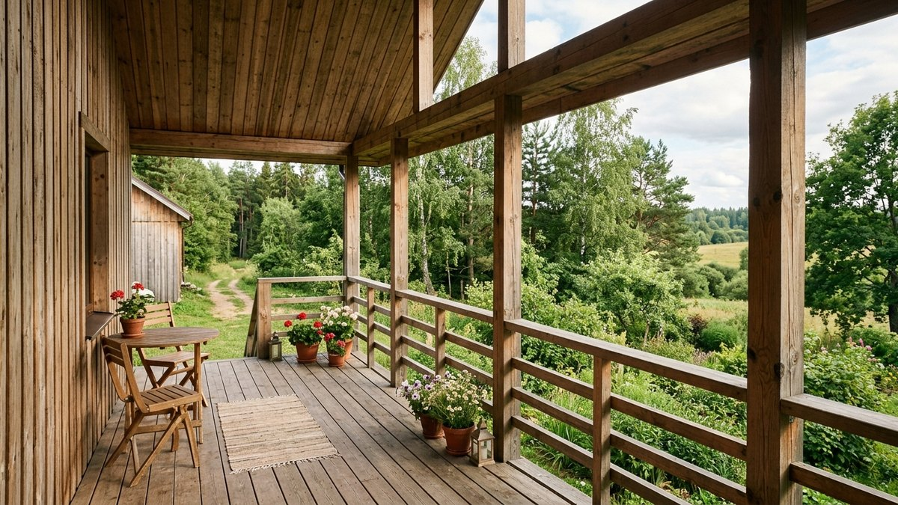
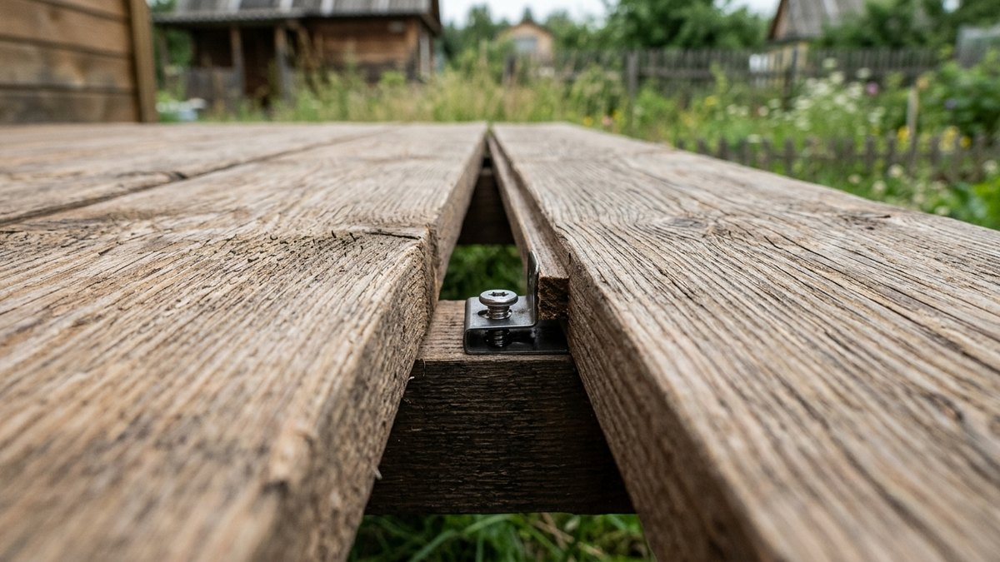
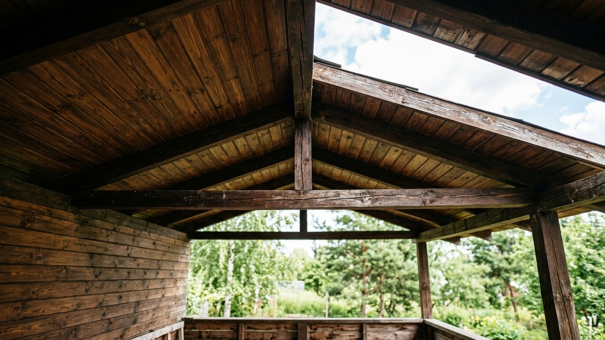
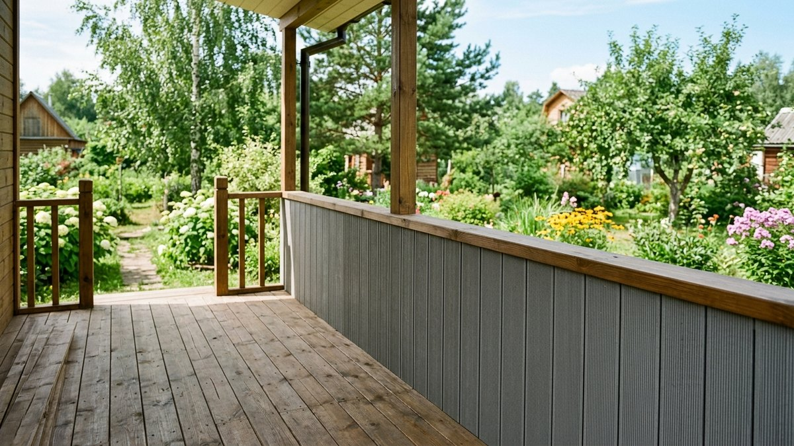
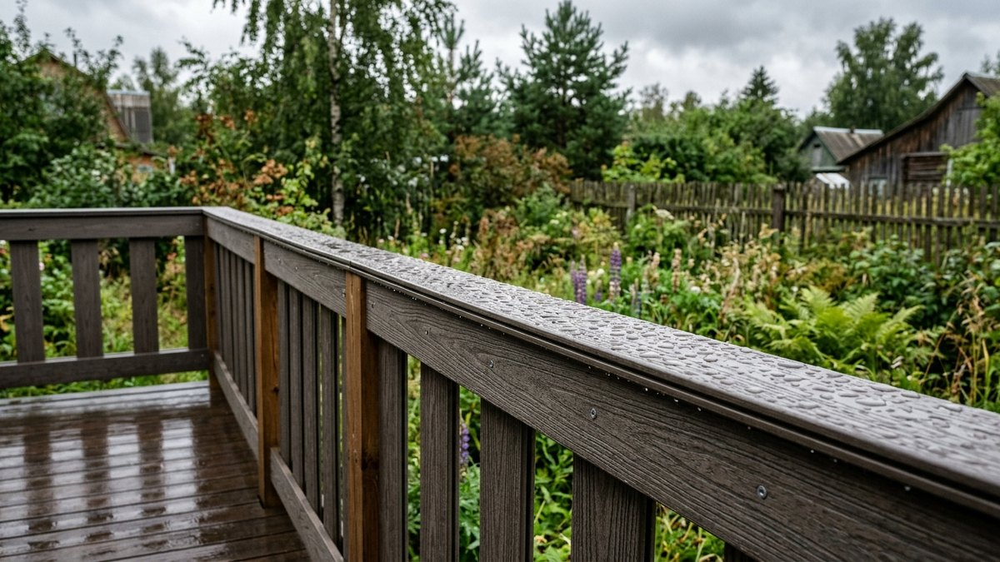
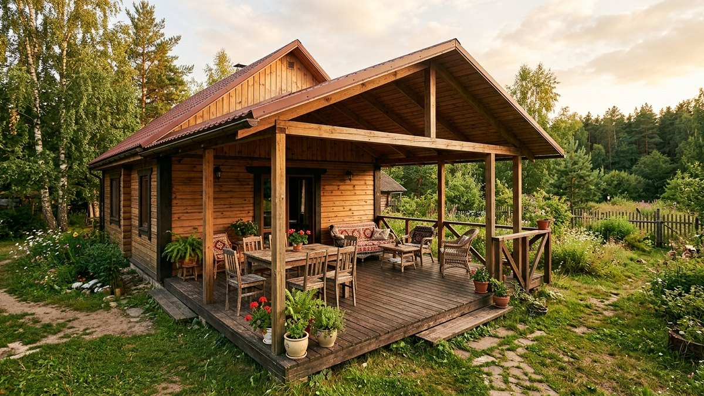

# Отделка открытой террасы: чем обшить стены и потолок под открытым небом

Открытая терраса — не веранда и не беседка: у неё нет остекления и часто нет
даже сплошных стен, только пол под навесом и, может быть, невысокий парапет
или ограждение. Материал здесь работает в куда более жёстких условиях, чем
на закрытой веранде: прямой дождь под углом, полное солнце без защиты
остеклением, перепад температур от +40 летом до −30 зимой и никакой
пароизоляции — конструкция должна дышать, а не запирать влагу. В статье
разберём, чем обшить стены и потолок именно открытой террасы, что точно
сгниёт или рассохнется за один сезон и как посчитать материал с запасом.

## Чем открытая терраса отличается от веранды

Разница не в названии, а в защите от осадков. У [закрытой веранды](https://mir-doma.pro/chem-obshit-verandu-vnutri/)
есть остекление или хотя бы сплошные стены — воздух внутри не продувается
насквозь, а влага не попадает на отделку напрямую. Открытая терраса такой
защиты не имеет: косой дождь достаёт стены на 1,5–2 метра от края навеса,
а солнце светит на обшивку весь день без преград. Поэтому материалы,
которые нормально стоят на закрытой веранде — гипсокартон, МДФ, обычная
вагонка без пропитки, — на открытой террасе покоробятся или заплесневеют
за один сезон. Если у вас терраса частично застеклена или будет застеклена
позже, смотрите [остекление веранды](https://mir-doma.pro/osteklenie-verandy/) —
там другой набор материалов и другая логика утепления. А если под открытой
конструкцией имеется в виду навес для машины или мангала, а не пристройка к
дому — там своя специфика крепежа и нагрузок, разобрана в статье
[чем обшить навес изнутри](https://mir-doma.pro/chem-obshit-naves-iznutri/).

## Что должна выдержать обшивка

- **Прямую воду.** Не капли конденсата, а дождь и мокрый снег, которые
  задувает ветром.
- **Ультрафиолет.** Незащищённое дерево на солнце сереет и растрескивается
  за 1–2 года без периодической обработки.
- **Перепад температур и влажности без пароизоляции.** Открытая конструкция
  не запирает пар — материал должен переносить намокание и высыхание сотни
  раз за сезон, не разбухая необратимо.
- **Точечные нагрузки.** Парапеты и ограждения на террасе должны выдерживать
  вес человека, облокотившегося сбоку.

## Чем обшить стены открытой террасы

### Террасная доска (декинг) как обшивка стен

Декинг — не только для пола: его же профиль (рифлёный или гладкий) часто
используют вертикально, как обшивку парапета или частичных стен. Материал —
термоясень, лиственница или ДПК (древесно-полимерный композит). ДПК не гниёт
вообще, но на солнце нагревается сильнее дерева и слегка выцветает в первый
год, дальше цвет стабилизируется.

### Планкен

Планкен — узкая профилированная доска (прямой или скошенный профиль) для
вертикальной или горизонтальной обшивки с вентиляционным зазором между
ламелями. Для открытой террасы берут планкен из лиственницы или термодерева —
оба переносят прямое намокание без гниения при правильном зазоре для стока
воды и проветривания.

### Что нельзя использовать

Гипсокартон (любой, включая влагостойкий — он рассчитан на конденсат, а не
на прямой дождь), МДФ и ПВХ-панели без наружного класса защиты, обычную
вагонку без пропитки маслом или защитным составом для открытых конструкций.
Все эти материалы разбирает статья [чем обшить веранду внутри](https://mir-doma.pro/chem-obshit-verandu-vnutri/) —
там же таблица, что подходит для закрытых помещений, а что нет.

## Чем обшить потолок открытой террасы

Потолок (подшивка кровли навеса) страдает от воды и УФ меньше стен, но
получает основную ветровую нагрузку и перепад температур сверху. Рабочие
варианты:

- **Вагонка из лиственницы или термодерева** — та же логика, что для стен:
  естественная стойкость к влаге без обработки, только зазоры для стока.
- **Софит (виниловая или металлическая подшивочная панель)** — перфорированный
  софит с вентиляционными отверстиями не задерживает конденсат под навесом,
  подходит и для стен свесов кровли.
- **Термодерево** — древесина, прошедшая термообработку при 180–212°C.
  Дороже обычной вагонки, но не рассыхается и не темнеет десятилетиями без
  пропитки.

Обычную сосновую вагонку без обработки для потолка открытой террасы брать не
стоит: она темнеет и начинает трескаться после первой же зимы под открытым
небом. Если терраса застеклена или речь о закрытой веранде — там другой
набор материалов и обязателен вентиляционный зазор, смотрите
[потолок на веранде](https://mir-doma.pro/potolok-na-verande/).

## Пол на открытой террасе — коротко

Пол на открытой террасе делают с уклоном 1–2% на отвод воды и зазором
2–3 мм между досками декинга для стока и вентиляции снизу. Это отдельная
тема с отдельным набором требований к лагам и гидроизоляции основания —
подробный разбор в статье [чем застелить пол на веранде под крышей](https://mir-doma.pro/chem-zastelit-pol-na-verande-pod-kryshey/).

## Крепёж и обработка: на чём всё это держится

- **Крепёж только нержавеющий или оцинкованный (горячее цинкование,
  не гальваника).** Обычный крепёж ржавеет за один сезон и оставляет
  потёки на светлом дереве.
- **Скрытый крепёж (кляймеры) для декинга и планкена** — без сквозных
  отверстий в лицевой доске вода не попадает в древесину через крепёж.
- **Пропитка маслом для террас** раз в 1–2 года для лиственницы и
  термодерева — не обязательна для стойкости, но сохраняет цвет и
  замедляет естественное посерение.
- **Вентиляционный зазор 3–8 мм** между ламелями и от стены до обшивки —
  без него влага не уходит и материал темнеет пятнами даже стойких пород.

## Как посчитать материал: с запасом на подрезку

Запас зависит от способа монтажа: горизонтальная обшивка вдоль стены без
углов и проёмов — запас 7%, вертикальная обшивка с подрезкой по стойкам и
углам — 10%, диагональная раскладка — 15%. Возьмите площадь стен и потолка
под обшивку, умножьте на коэффициент запаса, а затем разделите на площадь
одной доски (длина × ширина) — так получится число досок к закупке.

### Калькулятор материала для обшивки террасы

<!-- wp:html -->

<h3 class="md-ot__title">Калькулятор материала для обшивки открытой террасы</h3>

Считает площадь с запасом на подрезку и число досок планкена или декинга.

<label class="md-ot__f">Площадь стен под обшивку, м²<input type="number" id="otWalls" value="12" min="0" max="500" step="0.1"></label>
<label class="md-ot__f">Площадь потолка под обшивку, м²<input type="number" id="otCeil" value="8" min="0" max="500" step="0.1"></label>
<label class="md-ot__f">Способ монтажа
<select id="otMount">
<option value="7">Горизонтально вдоль, без углов — запас 7%</option>
<option value="10" selected>Вертикально с подрезкой по стойкам — запас 10%</option>
<option value="15">По диагонали — запас 15%</option>
</select></label>
<label class="md-ot__f">Длина доски, м<input type="number" id="otLen" value="3" min="0.5" max="6" step="0.1"></label>
<label class="md-ot__f">Ширина доски, мм<input type="number" id="otWid" value="100" min="30" max="300" step="1"></label>
<label class="md-ot__f">Цена за 1 м² материала, ₽ (необязательно)<input type="number" id="otPrice" value="" min="0" max="50000" step="1" placeholder="0"></label>

Площадь без запаса<b id="otAreaRaw">20,0 м²</b>

Площадь с запасом<b id="otAreaFin">22,0 м²</b>

Досок нужно<b id="otBoards">74 шт</b>

Стоимость материала<b id="otCost">—</b>

Число досок округлено вверх. Крепёж (кляймеры, саморезы) и пропитку считайте отдельно по факту выбранного материала.

<button type="button" id="otCopy" class="md-ot__btn md-ot__btn--main">Скопировать результат</button>
<a id="otVk" class="md-ot__btn md-ot__btn--vk" href="#" target="_blank" rel="noopener noreferrer">Поделиться ВКонтакте</a>
<a id="otTg" class="md-ot__btn md-ot__btn--tg" href="#" target="_blank" rel="noopener noreferrer">Поделиться в Telegram</a>
<button type="button" id="otShareNative" class="md-ot__btn" hidden>Поделиться…</button>
<button type="button" id="otPrint" class="md-ot__btn">Печать</button>

<!-- /wp:html -->

## Порядок работ

1. Обработайте каркас (стойки, обрешётку) антисептиком — он скрыт под
   обшивкой и не досягаем для повторной обработки после монтажа.
2. Оставьте вентиляционный зазор между обшивкой и стеной или каркасом —
   3–8 мм в зависимости от материала.
3. Монтируйте декинг или планкен на скрытый крепёж (кляймеры), обычную
   вагонку и термодерево — на оцинкованные или нержавеющие гвозди/саморезы.
4. На потолке начинайте от края навеса к стене, чтобы стыки не задерживали
   воду при косом дожде.
5. После монтажа нанесите масло для террас на лиственницу и термодерево —
   защита от посерения, не от гниения (последнее эти породы переносят и без
   пропитки).

## Частые ошибки

- **Гипсокартон или ПВХ-панели интерьерного класса на открытой террасе.**
  Через один сезон дождей и УФ материал коробится, желтеет или разбухает.
- **Обычный чёрный крепёж вместо оцинкованного или нержавеющего.** Ржавые
  потёки на светлом дереве не отмываются, только шлифовка или замена доски.
- **Отделка без вентиляционного зазора.** Даже стойкая к влаге порода
  начинает темнеть пятнами, если вода не может стечь и высохнуть.
- **Копирование решения с закрытой веранды.** То, что стоит под остеклением
  десятилетиями, на открытой террасе сгнивает или коробится за один-два года —
  это разные условия эксплуатации, не вариации одной темы.

## Частые вопросы

### Можно ли обшить открытую террасу вагонкой без пропитки

Нет, обычная сосновая вагонка без защитной пропитки для открытых конструкций
темнеет и трескается уже после первой зимы под прямыми осадками. Нужна
порода с естественной стойкостью (лиственница, термодерево) или регулярная
обработка маслом для террас.

### Чем отличается декинг для пола от декинга для стен

Профиль тот же (рифлёный или гладкий), разница в монтаже: на полу доска
несёт нагрузку и укладывается с уклоном на сток воды, на стене работает
только на защиту от осадков и крепится вертикально или горизонтально без
нагрузки на проход.

### Нужна ли пароизоляция для стен открытой террасы

Нет. Пароизоляция нужна там, где есть отопление и разница температур внутри
и снаружи — на открытой неотапливаемой террасе конструкция должна свободно
дышать и просыхать, пароизоляция здесь только задержит влагу внутри.

### Можно ли использовать ДПК (древесно-полимерный композит) для обшивки стен

Да, ДПК не гниёт и не рассыхается, подходит и для стен, и для потолка. Из
минусов — сильнее нагревается на солнце, чем натуральное дерево, и в первый
год слегка выцветает, дальше цвет стабилизируется.

### Как часто нужно обновлять пропитку на открытой террасе

Масло для террас на лиственнице и термодереве обновляют раз в 1–2 года — это
не критично для сохранности материала, а нужно для внешнего вида: без
обновления дерево естественно сереет от УФ.

