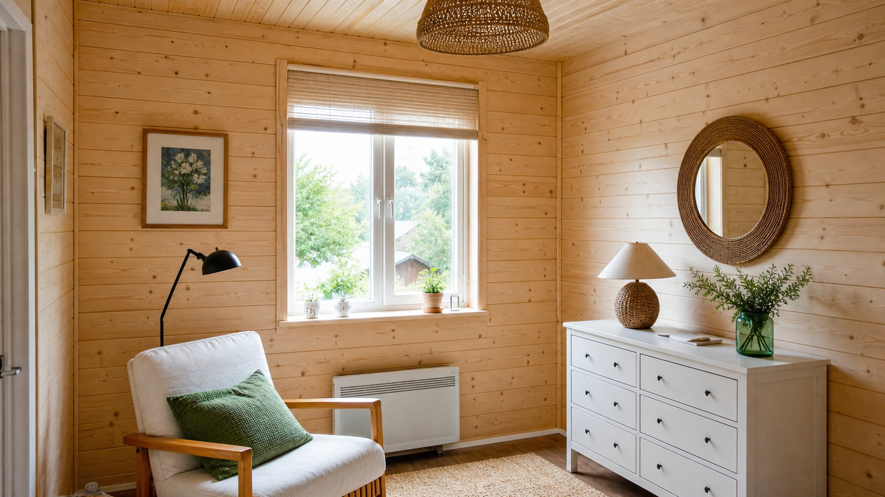
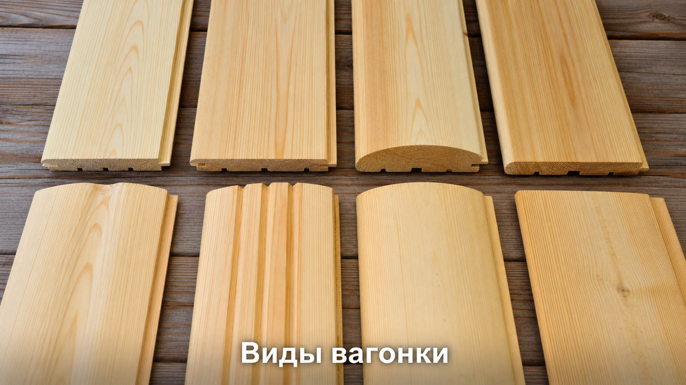
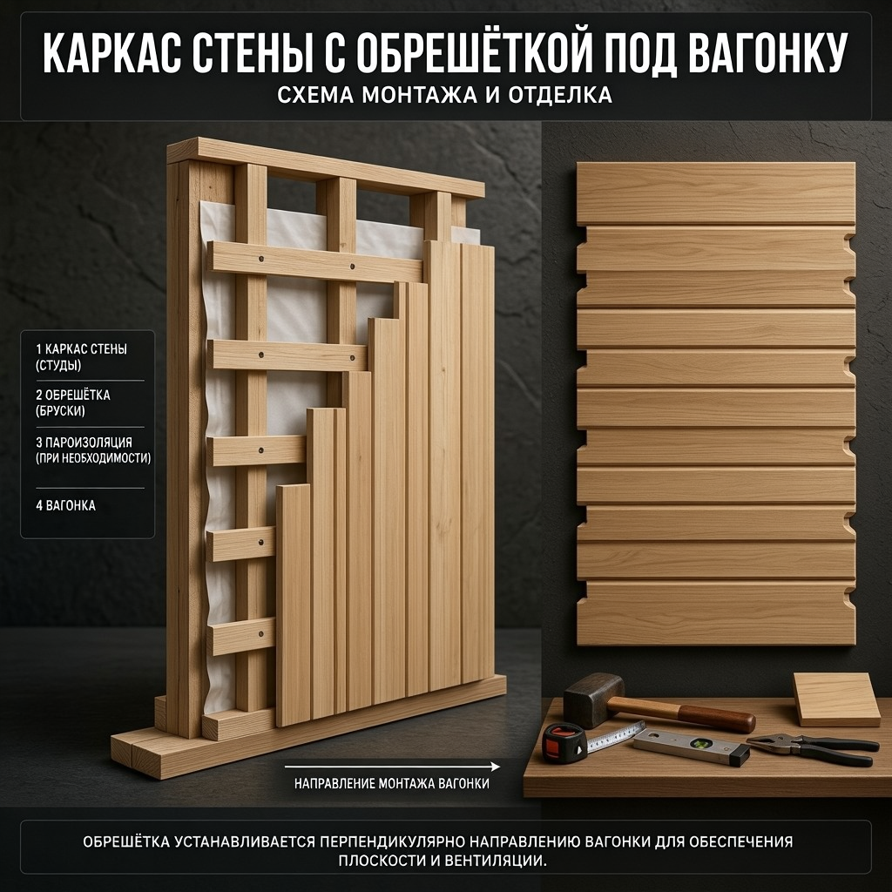
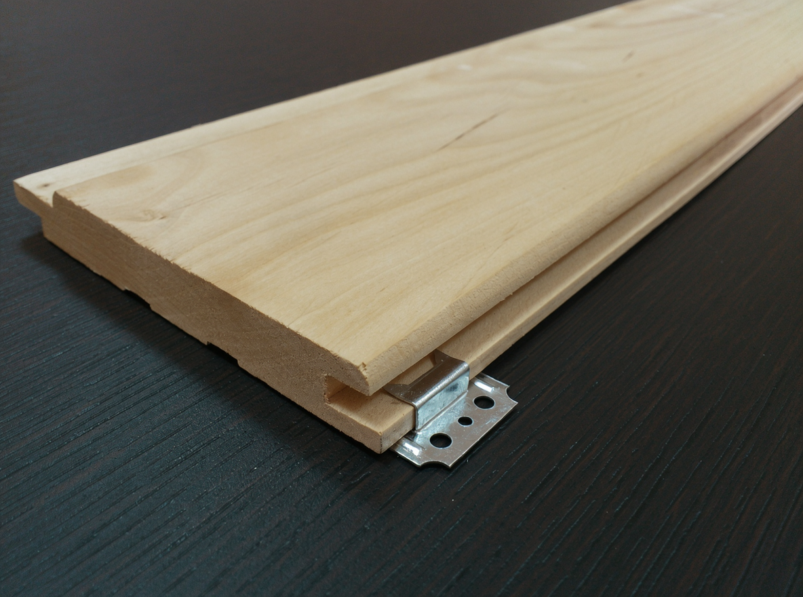
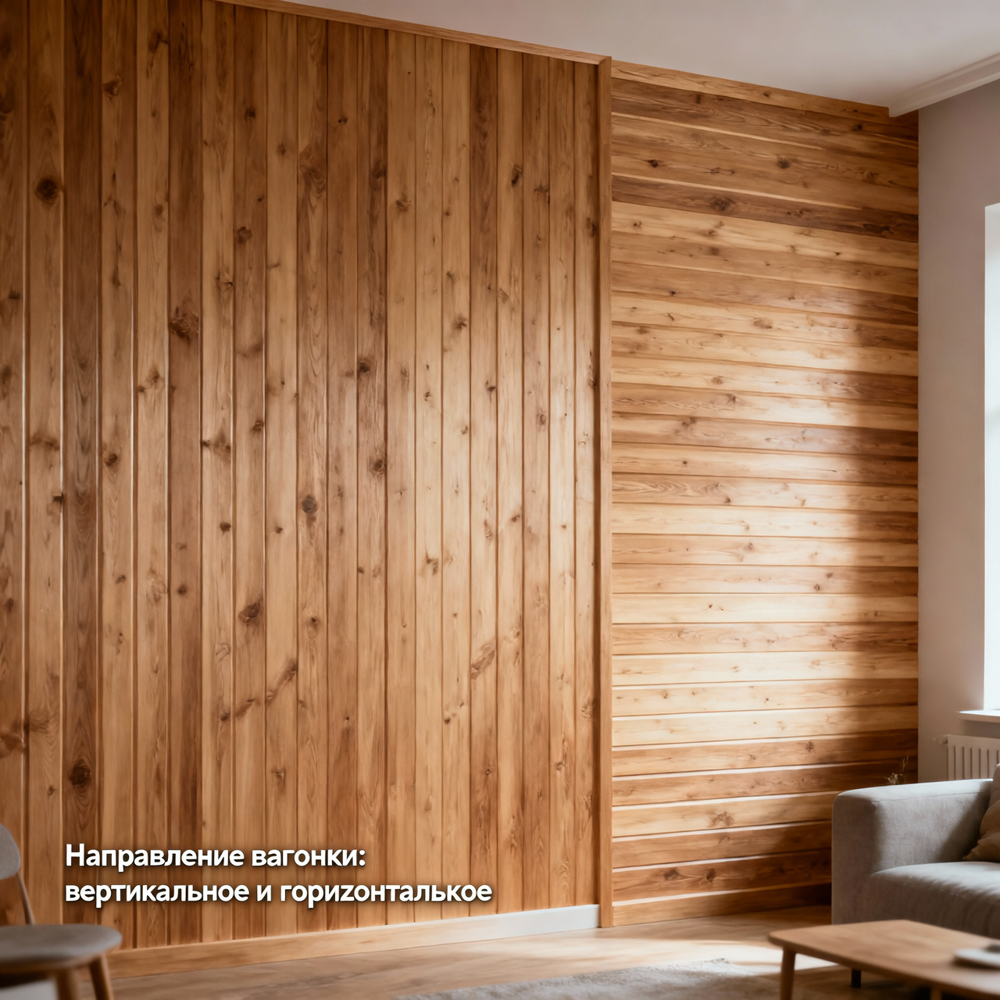
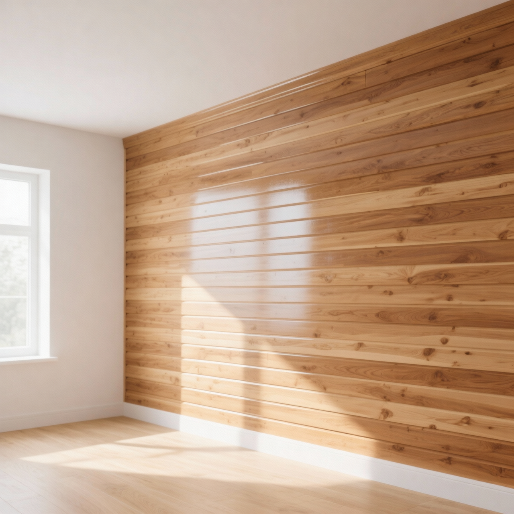

Вагонка — один из самых любимых материалов для отделки дачи: она натуральная, тёплая, уютная и отлично скрывает неровности стен. Обшить стены вагонкой вполне реально своими руками — нужен несложный инструмент, ровная обрешётка и немного аккуратности. В этой статье разберём отделку стен вагонкой: какие бывают виды вагонки, как сделать обрешётку, смонтировать доски на кляймеры и защитить готовую поверхность, а также каких ошибок избегать.

## 🪵 Чем хороша вагонка

Вагонка популярна в дачной отделке не случайно:

- **Натуральность и уют** — дерево создаёт тёплую, «живую» атмосферу.
- **Скрывает неровности** — обрешётка и доски прячут кривые стены без штукатурки.
- **Тепло- и звукоизоляция** — под вагонку в обрешётку можно уложить утеплитель.
- **Экологичность** — натуральное дерево дышит и не выделяет вредных веществ.
- **Ремонтопригодность** — повреждённую доску легко заменить.
- **Не требует «мокрых» работ** — обшивку ведут без штукатурки, грязи и долгого высыхания.

Именно поэтому вагонкой обшивают и комнаты, и веранды, и бани, и потолки. Это ещё и отличный способ [обновить старую дачу](https://mir-doma.pro/kak-obnovit-staruyu-dachu/) — обшивка мгновенно освежает потрёпанные стены.

## 📋 Виды вагонки

Вагонка различается по профилю, материалу и классу качества.

**По профилю:**

- **Обычная и евровагонка** — с выраженным замком шип-паз; у евровагонки более глубокий паз и вентканавки на обороте.
- **Штиль** — без выступающей полочки, поверхность выглядит ровной, почти сплошной.
- **Софтлайн** — со скруглённой фаской.
- **Блок-хаус и имитация бруса** — имитируют бревно или брус.

**По материалу:** сосна — недорогая и ароматная, для сухих жилых комнат; липа, осина и ольха — для бань и парных, потому что не нагреваются и не выделяют смолу; лиственница и кедр — влагостойкие, прочные и красивые, но дороже. Выбор материала зависит от того, где будет использоваться вагонка.

**По классу качества:** Экстра (высший, без сучков), А, В и С — чем ниже класс, тем больше сучков и дефектов и тем дешевле материал.

## 🧰 Что понадобится

Для работы приготовьте:

- **Материалы:** вагонка, бруски для обрешётки, крепёж (кляймеры, гвоздики или саморезы), при необходимости утеплитель и пароизоляция, уголки и плинтусы для отделки стыков.
- **Инструменты:** шуруповёрт, ножовка или электролобзик, молоток, строительный уровень, рулетка, угольник, стусло для запила углов.

## 🪜 Подготовка и обрешётка

Перед монтажом вагонке дают «привыкнуть» к помещению — распакованные доски оставляют в нём на несколько дней, чтобы они приняли его влажность и температуру. Если пропустить этот шаг, после укладки дерево ссохнется или разбухнет, и появятся щели либо коробление.

Затем делают обрешётку:

1. **Набейте бруски** обрешётки перпендикулярно будущему направлению вагонки, с шагом 40–60 см, строго по уровню.
2. **Выровняйте плоскость** — под бруски при необходимости подкладывают клинья, чтобы стена получилась ровной.
3. **Уложите утеплитель и пароизоляцию** в обрешётку, если это наружная стена или баня; оставьте вентиляционный зазор. Обшивка вагонкой хорошо сочетается с [утеплением дома](https://mir-doma.pro/kak-uteplit-dachnyy-dom/): в одной конструкции решаются сразу две задачи — тепло и красивая отделка.

Ровная обрешётка — основа всей отделки: по кривой обрешётке ровно вагонку не уложить.

## 🔨 Монтаж вагонки

Когда обрешётка готова, приступают к обшивке:

1. **Выберите направление.** Вертикальная вагонка зрительно поднимает потолок, горизонтальная — расширяет комнату.

2. **Установите первую доску** строго по уровню — от неё зависит ровность всей стены. Её крепят от угла, шипом или пазом в сторону угла.
3. **Крепите вагонку.** Самый аккуратный способ — кляймеры (скобы), которые вставляют в паз и прибивают к обрешётке: крепёж получается скрытым. Также используют мелкие гвоздики или саморезы, которые забивают под углом в паз. Толстую вагонку и имитацию бруса иногда крепят и через лицевую сторону саморезами с последующей маскировкой шляпок.
4. **Стыкуйте доски** шип в паз, плотно подбивая каждую следующую через брусок, чтобы не повредить замок.
5. **Оставьте небольшие зазоры** у пола и потолка на температурное расширение дерева.
6. **Закройте углы и стыки** декоративными уголками и плинтусами.

Последнюю доску обычно приходится подрезать вдоль по ширине — её аккуратно распиливают и заводят на место, закрывая стык уголком или плинтусом.

## 🎨 Финишная отделка

Чтобы вагонка служила долго и красиво выглядела, её покрывают защитным составом:

- **Лак, масло или воск** — сохраняют естественный вид дерева и защищают его.
- **Краска** — если нужен цвет; светлая крашеная вагонка особенно хороша в интерьере [в стиле прованс](https://mir-doma.pro/interer-dachi-provans/).
- **Антисептик и антипирен** — защищают от гнили, плесени и повышают огнестойкость.
- **Специальные составы для влажных помещений и бань** — там нужна особая защита.

Перед покрытием вагонку при необходимости шлифуют, чтобы поверхность была гладкой.

## 🛡️ Частые ошибки

- **Не акклиматизировали вагонку.** После укладки сырое дерево ссыхается, появляются щели. Дайте ему отлежаться.
- **Кривая обрешётка или первая доска.** Все последующие доски пойдут криво. Всё выставляют по уровню.
- **Нет вентзазора и пароизоляции.** Дерево отсыревает и гниёт, особенно на наружных стенах и в бане.
- **Сосна в парилке.** Она смолит и нагревается — для бань берут липу или осину.
- **Нет зазоров на расширение.** Без них вагонку может «повести». Оставляйте зазоры у пола и потолка.
- **Не обработали дерево.** Без защиты вагонка темнеет, а во влажных местах гниёт.

## ❓ Частые вопросы

### Как крепить вагонку к стене?

Сначала делают ровную обрешётку из брусков, а затем крепят к ней вагонку. Самый аккуратный способ — кляймеры: скобы вставляют в паз доски и прибивают к обрешётке, крепёж остаётся скрытым. Также используют мелкие гвоздики или саморезы, забивая их под углом в паз.

### Нужна ли обрешётка под вагонку?

Да, обрешётка практически всегда нужна: она выравнивает стену, создаёт вентиляционный зазор и служит основой для крепления вагонки. В неё же удобно уложить утеплитель. Без обрешётки ровно обшить стену и обеспечить вентиляцию не получится.

### Как расположить вагонку — вертикально или горизонтально?

Это дело вкуса и задачи: вертикальная вагонка зрительно поднимает потолок и делает комнату выше, горизонтальная — расширяет помещение. На выбор влияют и особенности комнаты, и желаемый эффект. Технология монтажа в обоих случаях схожая.

### Какая вагонка лучше для дачи?

Для жилых комнат и веранд подойдёт недорогая сосновая вагонка, для бань и влажных помещений — липа, осина или ольха, которые не нагреваются и не смолят, а для влагостойкости — лиственница. Класс качества (Экстра, А, В, С) выбирают по бюджету и требованиям к внешнему виду.

### Чем покрыть вагонку внутри дома?

Вагонку покрывают лаком, маслом или воском, чтобы сохранить вид дерева, либо краской, если нужен цвет. Дополнительно её обрабатывают антисептиком от гнили и плесени, а во влажных помещениях и банях используют специальные составы. Это защищает дерево и продлевает срок службы отделки.

### Что такое кляймеры для вагонки?

Кляймеры — это небольшие металлические скобы для скрытого крепления вагонки. Их вставляют в паз доски и прибивают или прикручивают к обрешётке, а следующая доска закрывает крепёж. В результате на поверхности не видно гвоздей и саморезов, а отделка выглядит аккуратно.

### Нужно ли утеплять стену под вагонкой?

Наружные стены и стены бани под вагонкой утеплять желательно: в обрешётку укладывают утеплитель и пароизоляцию, оставляя вентзазор. Для внутренних перегородок в тёплом доме утепление не обязательно, но обрешётка с зазором для вентиляции нужна в любом случае.

### Можно ли обшить стены вагонкой своими руками?

Да, это одна из самых доступных для новичка отделок. Главное — сделать ровную обрешётку, правильно выставить первую доску по уровню и аккуратно стыковать доски шип в паз. С несложным инструментом и терпением обшить стену вагонкой вполне по силам самостоятельно.

## Заключение

Отделка стен вагонкой своими руками — задача посильная даже для новичка, если действовать по технологии: дать вагонке акклиматизироваться, сделать ровную обрешётку, выставить первую доску по уровню, крепить доски на кляймеры и покрыть готовую поверхность защитным составом. Выберите подходящий вид вагонки под помещение, не забудьте про вентзазор и обработку дерева — и стены станут тёплыми, уютными и красивыми на долгие годы. Такая отделка преобразит и комнату, и веранду, и баню, придав даче настоящий деревенский уют. А главное — с ней справится любой хозяин, ведь ничего сложного в обшивке вагонкой нет, нужны лишь ровная обрешётка, уровень и аккуратность.

А где вы использовали вагонку на даче? Делитесь опытом в комментариях и подписывайтесь, чтобы не пропустить новые статьи об отделке и ремонте.
