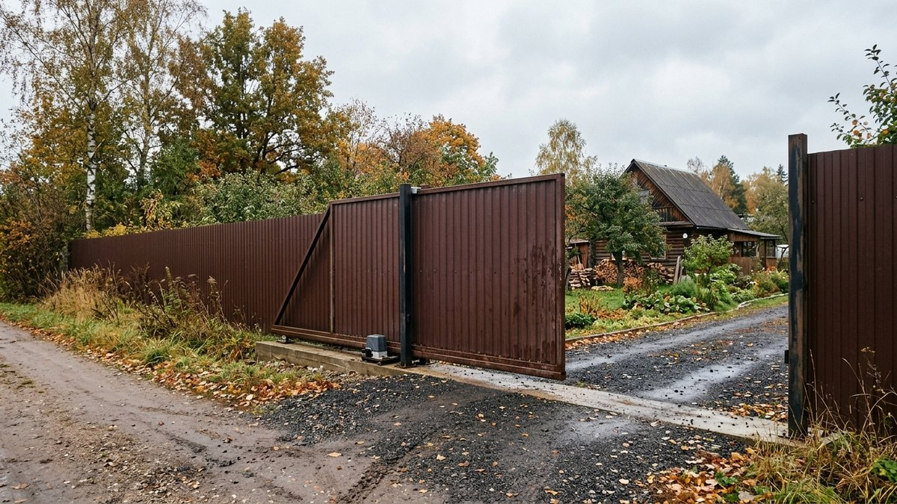
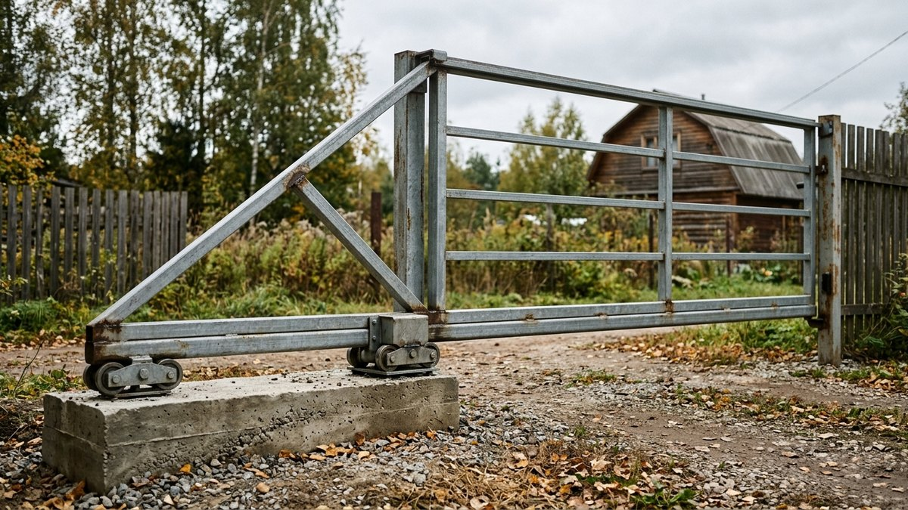
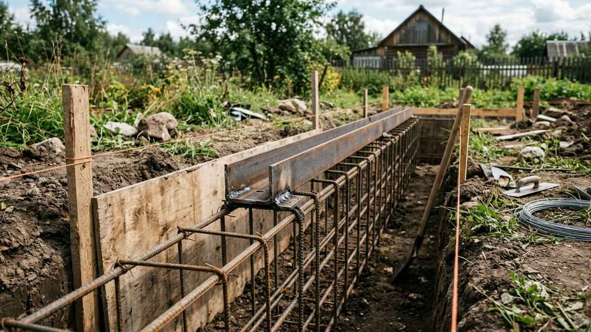
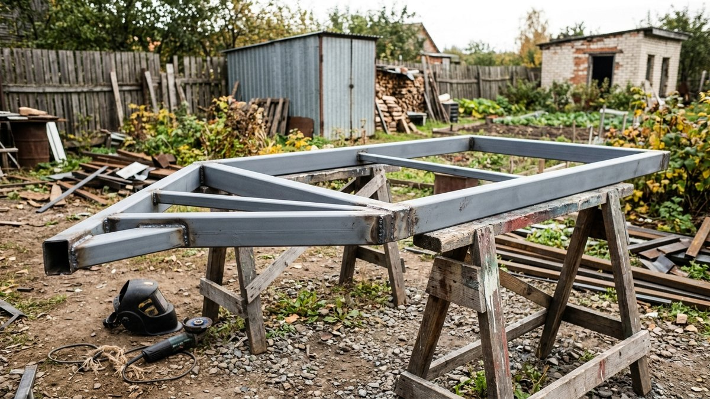
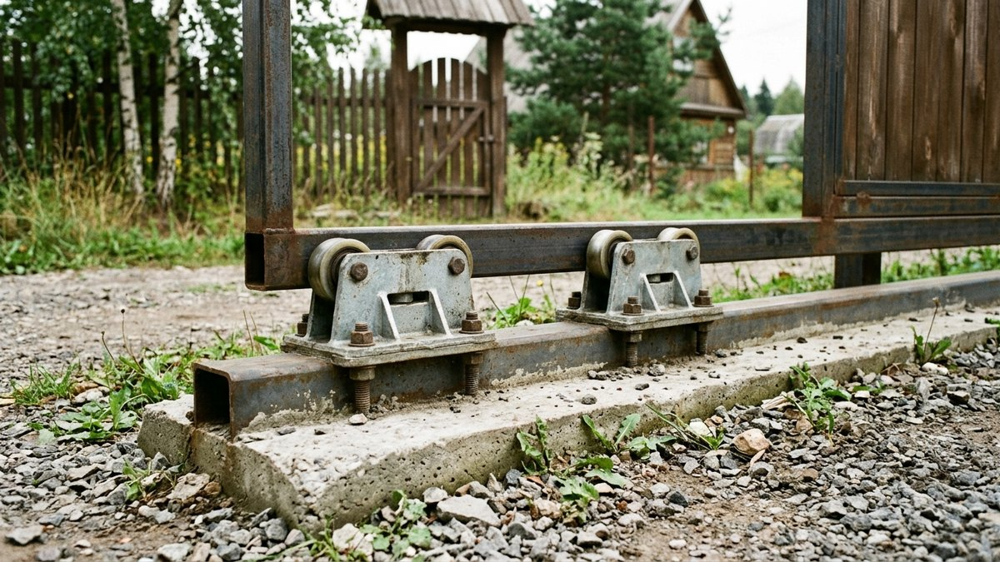
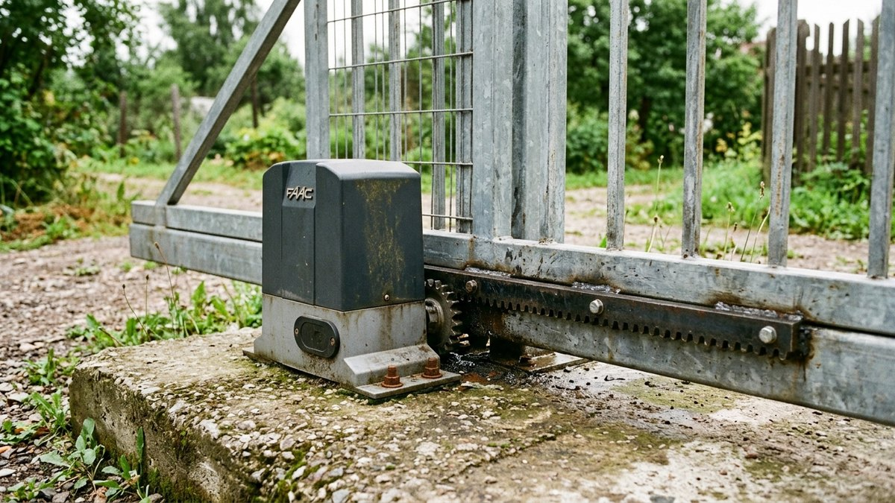

# Откатные ворота своими руками: пошаговая инструкция с расчётом противовеса и фундамента

Откатные ворота своими руками собирают чаще, чем кажется. Готовый
комплект фурнитуры продаётся под любой вес, а раму из профильной трубы
можно сварить за выходные. Ворота не требуют места для распахивания, не
боятся снега перед створкой, а привод к ним ставится в любой момент.
Но ошибка в фундаменте или противовесе даёт перекос через одну зиму, и
переделать его можно только целиком. Ниже — как устроены консольные
ворота, порядок работ от закладной до регулировки роликов и
калькулятор. Он посчитает длину створки, вес, класс комплекта и бетон
на фундамент.

## Как устроены консольные откатные ворота

Створка не катится по рельсу на земле, а висит на двух роликовых
опорах, закреплённых сбоку от проёма. Поэтому снег и мусор ей не
мешают. Из чего состоит конструкция:

- **Створка** — рама из профильной трубы с обшивкой. Она длиннее проёма
  за счёт **противовеса (консоли)** — хвоста, который уравновешивает
  створку, когда она закрыта.
- **Направляющая балка** — профиль с прорезью снизу, приваренный по всей
  длине створки. Внутри неё катятся ролики.
- **Две роликовые опоры (тележки)** — стоят на закладной сбоку от проёма
  и держат весь вес ворот.
- **Закладная** — швеллер, забетонированный в фундамент. На неё
  приваривают или прикручивают опоры.
- **Концевой ролик** и **заглушка балки** — на конце балки, для плавного
  заезда на ловитель.
- **Нижний ловитель** — на приёмном столбе, принимает концевой ролик и
  снимает нагрузку с консоли в закрытом положении.
- **Верхний ловитель** и **верхний упор с роликами** — не дают створке
  раскачиваться от ветра.

Распашные ворота устроены проще и обходятся дешевле. Если места для
распахивания хватает, сравните варианты по статье [ворота для дачи
своими руками](https://mir-doma.pro/vorota-dlya-dachi-svoimi-rukami/):
там разобраны распашные деревянные створки.

## Размеры: противовес, откатная зона, проём

| Параметр | Как считать | Пример для проёма 4 м |
|---|---|---|
| Противовес | 40–50% ширины проёма | 1,6–2 м |
| Длина створки | Проём + противовес | 5,6–6 м |
| Откатная зона вдоль забора | Длина створки + 0,3–0,5 м | 6–6,5 м |
| Длина закладной | Около половины проёма | 2 м |
| Высота створки | Как у забора, обычно 1,8–2,2 м | 2 м |

Откатную зону проверьте до покупки комплекта. Вдоль забора с этой
стороны не должно быть деревьев, столбов освещения, колодца или уклона:
створка поедет над землёй на высоте 5–10 см.

Ширину проёма берут не меньше 3,5–4 м для легковой машины. Если к
участку будет заезжать грузовик со стройматериалами или ассенизатор,
делайте 4,5–5 м. Узкий проём потом не расширишь без переделки
фундамента.

## Комплект фурнитуры: как выбрать по весу

Комплекты продают по максимальному весу створки и ширине проёма.
Ориентиры:

| Класс комплекта | Вес створки | Проём | Сечение балки |
|---|---|---|---|
| Лёгкий | до 300–400 кг | до 4–5 м | около 60×55 мм |
| Средний | до 500–800 кг | до 6–7 м | около 70×60 мм |
| Тяжёлый | до 1200–2000 кг | до 9–12 м | около 90×85 мм |

Точное сечение и толщину стенки балки смотрите в паспорте комплекта: у
разных производителей они отличаются. Берите комплект с запасом по весу
не меньше 30%. Зимой на створку налипает снег, а сварщики почти всегда
кладут металла больше, чем в расчёте.

Для дачи с проёмом 4 м и обшивкой из профнастила обычно хватает лёгкого
комплекта: створка весит 120–200 кг. Калькулятор ниже покажет вес именно
вашей створки.

## Калькулятор откатных ворот

<!-- wp:html -->

  
Откатные ворота: размеры, вес, комплект, бетон

  <label class="md-calc__label" for="mdOvW">Ширина проёма, м</label>
  <input type="number" id="mdOvW" class="md-calc__input" min="2" step="0.1" value="4">
  <label class="md-calc__label" for="mdOvH">Высота створки, м</label>
  <input type="number" id="mdOvH" class="md-calc__input" min="1" step="0.1" value="2">
  <label class="md-calc__label" for="mdOvC">Противовес, % от проёма</label>
  <select id="mdOvC" class="md-calc__input">
    <option value="0.4">40% (минимум)</option>
    <option value="0.5" selected>50% (надёжнее)</option>
  </select>
  <label class="md-calc__label" for="mdOvM">Обшивка</label>
  <select id="mdOvM" class="md-calc__input">
    <option value="4.6" selected>Профнастил 0,45 мм</option>
    <option value="5.4">Профнастил 0,5–0,55 мм</option>
    <option value="9">Металлический штакетник</option>
    <option value="12">Доска 20 мм</option>
  </select>
  <label class="md-calc__label" for="mdOvF">Глубина промерзания (глубина фундамента), м</label>
  <input type="number" id="mdOvF" class="md-calc__input" min="0.5" step="0.1" value="1.4">
  
Заполните поля

<!-- /wp:html -->

Вес считается для рамы из трубы 60×40 мм с обрешёткой 40×20 мм и
направляющей балкой лёгкого класса. Если раму варите из более толстой
трубы или добавляете декоративные элементы, прибавьте их вес.

## Шаг 1. Фундамент под закладную

От фундамента зависит всё остальное: если закладная поведёт или
просядет, ролики начнут клинить, и створка откатится сама.

1. **Разметьте фундамент** с той стороны проёма, куда будет отъезжать
   створка. Длина — около половины проёма, ширина — 40–50 см.
2. **Выкопайте траншею ниже глубины промерзания**: в средней полосе это
   1,2–1,5 м. Мелкий фундамент зимой выдавит пучением, и закладная уйдёт
   из уровня.
3. **Сварите каркас** из арматуры 12–14 мм: четыре продольных прутка и
   поперечные хомуты через 30–40 см. Верх каркаса приварите к швеллеру
   полками вниз, так чтобы стенка швеллера стала верхней плоскостью.
4. **Выставьте швеллер** точно в уровень, вровень с дорожным покрытием
   или на 1–2 см выше.
5. **Если планируете привод**, положите в траншею гофру для кабеля от
   дома до места привода. Потом проложить её без вскрытия бетона не
   получится.
6. **Залейте бетон** не ниже класса B20 (М250), уплотните его глубинным
   вибратором или штыкованием.
7. **Выдержите бетон.** Монтировать опоры можно через 2 недели в тёплую
   погоду, а полную прочность бетон набирает к 28 дням.

На пучинистых и болотистых грунтах вместо ленты делают закладную на
двух-трёх винтовых или буронабивных сваях. Нагрузка от ворот
сосредоточенная, и сваи держат её не хуже. Как выбрать тип опор под
свой грунт, разобрано в статье [какой фундамент выбрать для
дома](https://mir-doma.pro/kakoy-fundament-vybrat-dlya-doma/): логика
выбора для ворот та же.

## Шаг 2. Столбы

- **Опорный столб** со стороны отката. Ролики стоят не на нём, а на
  закладной, поэтому столб несёт только верхний упор: хватит трубы
  80×80×3 мм.
- **Приёмный столб** с нижним и верхним ловителями. Он принимает удар
  створки при закрывании, его делают из трубы 80×80 или 100×100 мм и
  бетонируют на глубину промерзания.

Если забор из профнастила ставится одновременно с воротами, удобно
бетонировать все столбы за один заход. Шаг столбов, глубину и крепление
лаг разбирали в статье [забор из профнастила своими
руками](https://mir-doma.pro/zabor-iz-profnastila-svoimi-rukami/).

## Шаг 3. Рама створки

1. **Соберите раму на ровной площадке**: на козлах или выставленных в
   уровень брусках. На кривой земле раму поведёт, и балка не войдёт в
   ролики ровно.
2. **Периметр** — профтруба 60×40×2 мм. Нижняя труба идёт по всей длине
   створки вместе с противовесом.
3. **Противовес** делают треугольным: нижняя труба плюс диагональ к
   верху ближней к проёму стойки. Так он легче, но не теряет жёсткости.
4. **Обрешётка** под обшивку — труба 40×20 мм, две-три горизонтали по
   высоте полотна.
5. **Варите прихватками** по диагонали, проверяя углы. Диагонали рамы
   должны совпадать с точностью до 3–5 мм. Только потом проварите швы
   полностью, чередуя стороны, чтобы металл не повело.
6. **Приварите направляющую балку** к нижней трубе прерывистым швом по
   5–7 см с шагом 30–40 см, прорезью вниз. Балку и раму выставляйте по
   натянутому шнуру.
7. **Зачистите швы, загрунтуйте и покрасьте** раму до обшивки. Потом
   зазоры за профнастилом уже не прокрасить.

## Шаг 4. Установка и регулировка

1. **Поставьте роликовые опоры** на закладную, не приваривая. Первая
   стоит в 15–20 см от проёма, вторая — у дальнего конца закладной с
   отступом 10–15 см. Чем дальше опоры друг от друга, тем устойчивее
   створка. Точные расстояния указаны в инструкции к комплекту.
2. **Наденьте створку балкой на ролики** вдвоём или втроём. Створка
   лёгкого класса весит 150–200 кг, поднимать её в одиночку опасно.
3. **Выставьте створку по уровню** регулировочными винтами опор, затем
   закройте её до приёмного столба. Концевой ролик должен входить в
   нижний ловитель без удара, с небольшим подъёмом.
4. **Прихватите опоры к закладной**, проверьте ход створки несколько раз
   и только потом приварите опоры окончательно или затяните болты.
5. **Установите верхний ловитель и верхний упор** с роликами на опорном
   столбе. Створка должна идти без люфта, но и без заклинивания.
6. **Обшейте створку** профнастилом или штакетником. Саморезы ставьте в
   нижнюю волну, через одну.

Правильно отрегулированная створка весом 200 кг откатывается одной
рукой. Если её приходится толкать двумя или она откатывается сама,
опоры стоят не в уровень.

## Привод и калитка

Привод к откатным воротам ставят на закладную или отдельную площадку
рядом с опорами. Вдоль балки приваривают или прикручивают зубчатую
рейку. Привод подбирают по весу створки с тем же запасом 30%. Кабель
питания лучше заложить ещё на этапе фундамента.

Калитку в полотне откатных ворот не делают: рама теряет жёсткость.
Её ставят отдельно рядом с воротами. Как сделать калитку в том же
стиле, что и забор, разобрано в статье [калитка своими
руками](https://mir-doma.pro/kalitka-svoimi-rukami/).

## Частые ошибки

- **Мелкий фундамент.** Закладную выдавливает пучением, ролики уходят из
  уровня. Ворота клинит каждую весну и осень.
- **Короткий противовес** «чтобы влезло». Створка клюёт носом, ролики и
  балка изнашиваются за пару сезонов.
- **Комплект впритык по весу.** Снег и лёд на створке зимой добавляют
  десятки килограммов, и подшипники роликов не выдерживают.
- **Балку приварили сплошным швом.** Её ведёт от нагрева, и ролики идут
  с усилием.
- **Обшили, потом покрасили раму.** Ржавчина начинается под профнастилом,
  где её не видно.
- **Нет гофры под кабель.** Чтобы поставить привод, приходится резать
  тротуар или тянуть кабель по воздуху.

## Частые вопросы

### Как сделать откатные ворота своими руками

Залейте фундамент с закладным швеллером ниже глубины промерзания,
поставьте столбы, сварите раму из профтрубы 60×40 с противовесом 40–50%
ширины проёма, приварите направляющую балку, поставьте створку на
роликовые опоры, отрегулируйте и обшейте профнастилом.

### Какой длины должен быть противовес у откатных ворот

40–50% ширины проёма. Для проёма 4 м это 1,6–2 м, и вся створка выходит
длиной 5,6–6 м. Короче делать нельзя: створка будет клевать носом в
открытом положении.

### Какой фундамент нужен для откатных ворот

Ленточный под закладной швеллер №16–20, длиной около половины проёма,
шириной 40–50 см и глубиной ниже промерзания грунта. Бетон не ниже B20,
внутри — арматурный каркас из прутка 12–14 мм, приваренный к швеллеру.

### Сколько места нужно для откатных ворот

Вдоль забора нужна свободная зона длиной в створку плюс 30–50 см: при
проёме 4 м это 6–6,5 м. В этой зоне не должно быть деревьев, столбов и
перепадов высоты.

### Сколько весят откатные ворота из профнастила

Створка для проёма 4 м высотой 2 м с рамой из трубы 60×40 и обшивкой
из профнастила 0,45 мм весит около 150–200 кг вместе с балкой. Для
такой створки подходит лёгкий комплект фурнитуры с допуском до 400 кг.
