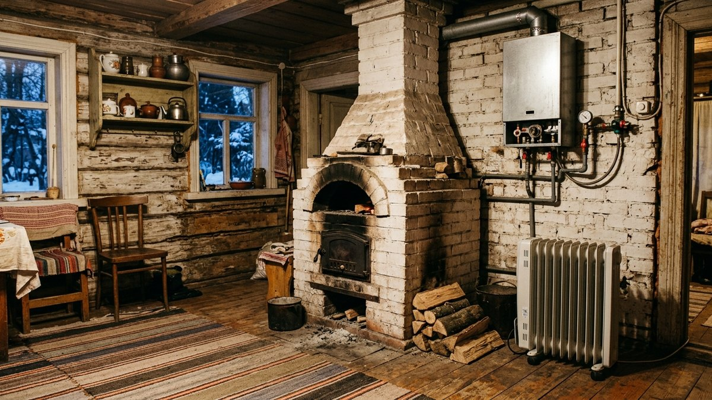
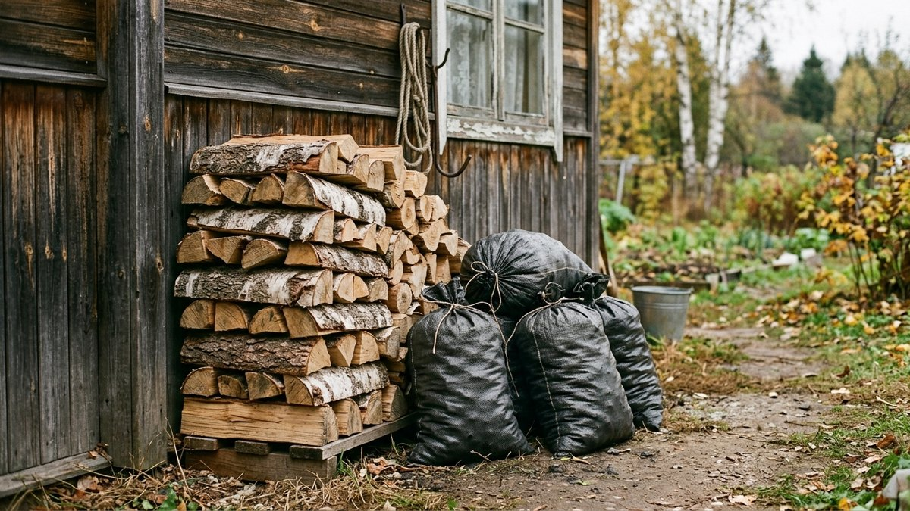
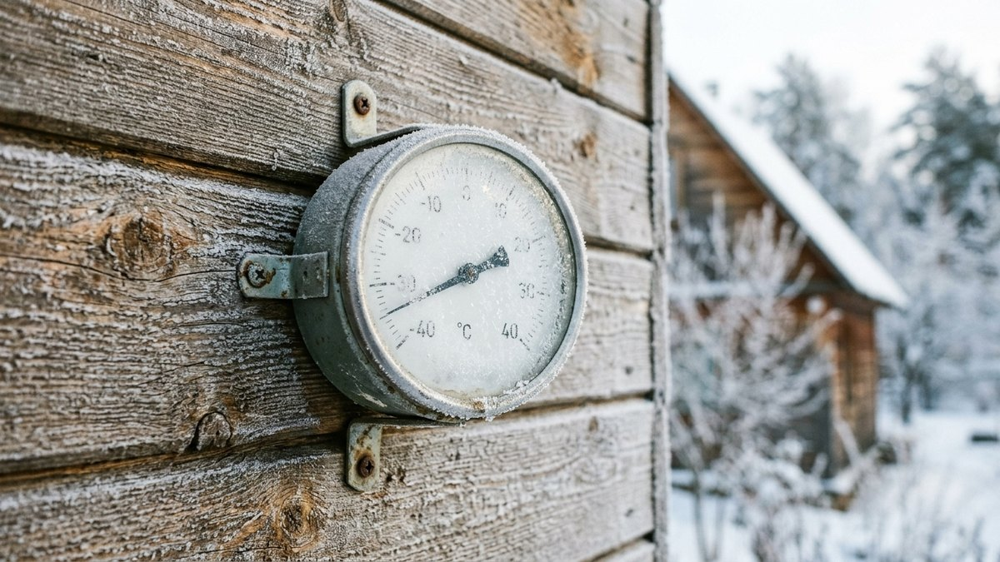
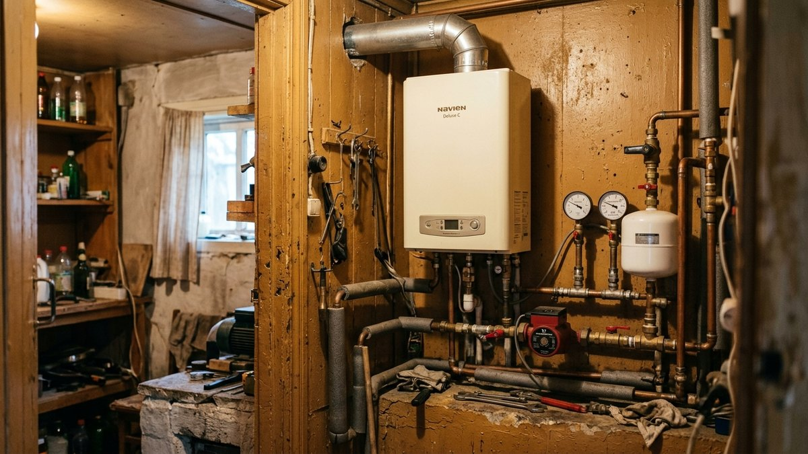
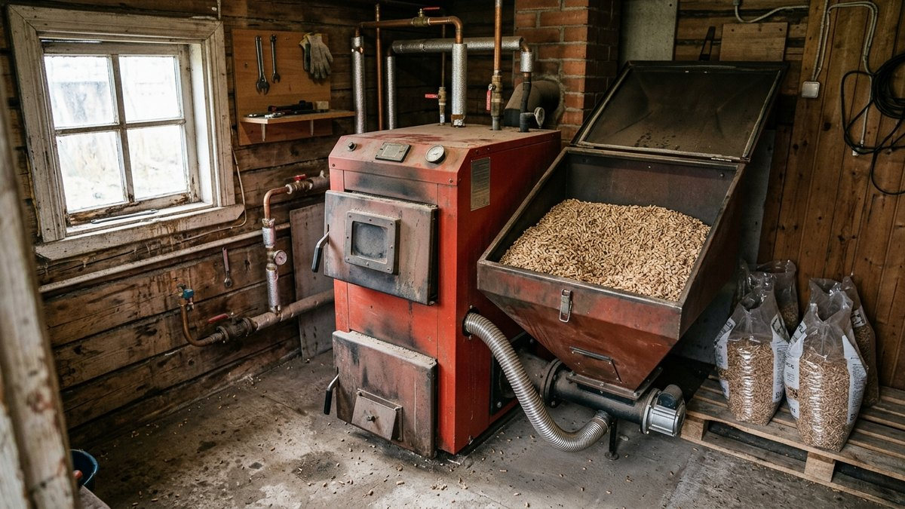
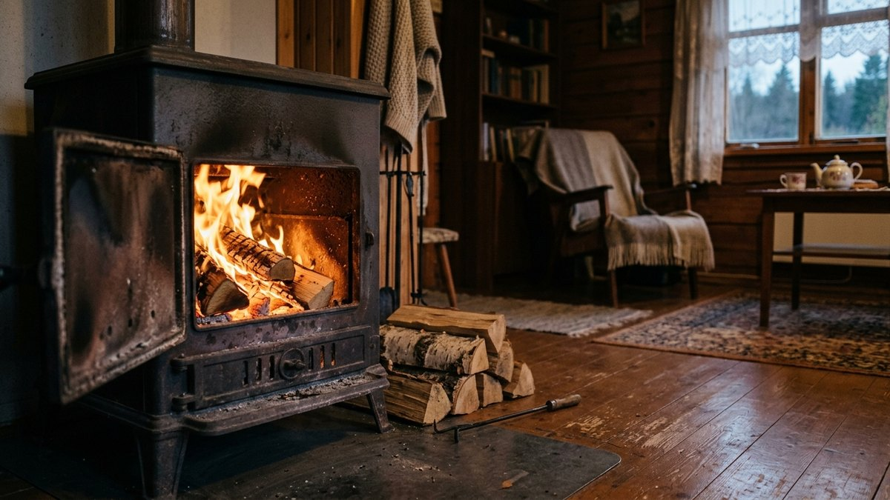

На сайте уже разобраны печи, котлы, электроотопление и тёплый пол по отдельности — у каждого свои плюсы и монтаж. Здесь — прямое сравнение по деньгам: сколько стоит киловатт тепла на разном топливе и во сколько обойдётся протопить дачу за сезон. В конце — калькулятор под площадь и утепление вашего дома.

## Как вообще сравнивать разное топливо

Дрова, газ и электричество продаются в разных единицах — кубометрах, литрах, киловаттах. Чтобы сравнить их честно, все виды топлива переводят в цену за **киловатт-час полезного тепла** — то есть уже с поправкой на КПД котла или печи и типичные потери. Это и есть главное число для сравнения: чем оно меньше, тем дешевле отопление при равном комфорте.

## Цена киловатта тепла по видам топлива

| Топливо | ₽/кВт·ч тепла | Комментарий |
|---|---|---|
| Магистральный газ | 0,6–0,9 | вне конкуренции там, где есть труба |
| Дрова | 1,5–2,5 | сильно зависит от региона и способа заготовки |
| Уголь | 1,8–2,8 | дешевле дров при покупке, но грязнее в обслуживании |
| Пеллеты | 2,5–3,5 | удобство автоматической подачи стоит денег |
| Сжиженный газ (баллон/ёмкость) | 4–6 | дорого, берут при отсутствии альтернатив |
| Электричество, ночной тариф | 2,5–3,5 | выгодно только при двухтарифном счётчике и греющих приборах с накоплением |
| Электричество, обычный тариф | 5–6 | самое дорогое из распространённых вариантов |

Подробный расчёт мощности и расходов именно для электричества — в статье [электроотопление дачи: расчёт и расходы](https://mir-doma.pro/elektricheskoe-otoplenie-dachi/); для сравнения газового, электрического и твердотопливного котла — в статье [котёл для дачи](https://mir-doma.pro/kotel-dlya-dachi/).

## Сколько тепла нужно дому

Расход зависит не только от площади, но и от утепления — это главный множитель, который меняет итоговую сумму в разы:

- **Дом без утепления** — около 150–200 кВт·ч на м² в год для средней полосы.
- **Дом со стандартным утеплением** — 80–120 кВт·ч на м² в год.
- **Хорошо утеплённый дом** — 40–70 кВт·ч на м² в год.

Разница между неутеплённым и хорошо утеплённым домом — в 3–4 раза по расходу тепла. Прежде чем считать, что выгоднее топить, обычно выгоднее утеплить — расчёт сметы в статье [сколько стоит утеплить дачный дом](https://mir-doma.pro/skolko-stoit-uteplit-dachnyy-dom/).

## Калькулятор: во сколько обойдётся сезон отопления

Укажите площадь дома, уровень утепления и вид топлива — калькулятор посчитает расход тепла за сезон и стоимость.

<!-- wp:html -->

<h3 class="md-ot__title">Калькулятор стоимости отопления</h3>

Ориентир по средней полосе; для своего региона и типа дома цифры могут отличаться на 20–30%.

<label class="md-ot__f">Площадь дома, м²<input type="number" id="otArea" value="60" min="10" max="1000" step="1"></label>
<label class="md-ot__f">Утепление дома
<select id="otIns">
<option value="175">Не утеплён — 175 кВт·ч/м² в год</option>
<option value="100" selected>Стандартное — 100 кВт·ч/м² в год</option>
<option value="55">Хорошее — 55 кВт·ч/м² в год</option>
</select></label>
<label class="md-ot__f">Вид топлива
<select id="otFuel">
<option value="0.75">Магистральный газ — 0,75 ₽/кВт·ч</option>
<option value="2" selected>Дрова — 2 ₽/кВт·ч</option>
<option value="2.3">Уголь — 2,3 ₽/кВт·ч</option>
<option value="3">Пеллеты — 3 ₽/кВт·ч</option>
<option value="5">Сжиженный газ — 5 ₽/кВт·ч</option>
<option value="3">Электричество, ночной тариф — 3 ₽/кВт·ч</option>
<option value="5.5">Электричество, обычный тариф — 5,5 ₽/кВт·ч</option>
</select></label>
<label class="md-ot__f">Доля года с отоплением, %<input type="number" id="otShare" value="100" min="10" max="100" step="5"></label>

Тепла нужно за сезон<b id="otKwh">0 кВт·ч</b>

Стоимость сезона<b id="otCost">—</b>

«Доля года с отоплением» — если топите не весь сезон, а только по выходным или часть месяцев, уменьшите процент.

<button type="button" id="otCopy" class="md-ot__btn md-ot__btn--main">Скопировать результат</button>
<a id="otVk" class="md-ot__btn md-ot__btn--vk" href="#" target="_blank" rel="noopener noreferrer">Поделиться ВКонтакте</a>
<a id="otTg" class="md-ot__btn md-ot__btn--tg" href="#" target="_blank" rel="noopener noreferrer">Поделиться в Telegram</a>
<button type="button" id="otPrint" class="md-ot__btn">Печать</button>

<!-- /wp:html -->

## Что выбрать не только по цене

Дешевле всего по деньгам — не всегда удобнее в быту:

- **Магистральный газ** — вне конкуренции по цене, но есть не везде: проверьте, подведена ли труба к участку или к посёлку.
- **Дрова** — дёшево и привычно, но требуют постоянного участия: протопку, закупку и хранение запаса на сезон.
- **Пеллеты и уголь** — компромисс: автоматическая подача (для пеллет) снижает участие человека, но требует котла нужного типа.
- **Электричество** — самое дорогое, зато самое удобное: не требует топлива на участке, легко автоматизируется термостатом, не даёт дыма и золы.

## Частые ошибки

- **Сравнивать цену топлива, а не цену киловатта тепла.** Кубометр дров дешевле баллона газа, но энергии в нём тоже меньше — сравнение только по цене за единицу вводит в заблуждение.
- **Не учитывать КПД оборудования.** Старая печь или котёл с низким КПД съедает больше топлива на то же количество тепла — модернизация оборудования иногда выгоднее смены топлива.
- **Отапливать неутеплённый дом дорогим топливом.** Электричество в непротопленном доме без утепления — самый быстрый способ получить счёт на десятки тысяч за сезон.
- **Не учитывать резервный источник.** При отключении газа или света дом без резерва (печь, генератор) может разморозиться за одну холодную ночь.

## Частые вопросы

### Что дешевле всего отапливать дачу?

Магистральный газ, если он подведён к участку — цена киловатта тепла в 5–8 раз ниже электричества. Если газа нет, следующие по цене — дрова и уголь.

### Выгодно ли отапливать дачу электричеством?

По деньгам — нет, это самый дорогой распространённый вариант. Но по удобству и отсутствию альтернатив (нет газа, дрова негде хранить) электричество часто остаётся единственным практичным выбором для дома выходного дня.

### Что дешевле: дрова или пеллеты?

Дрова дешевле при самостоятельной заготовке или покупке у местных поставщиков. Пеллеты дороже, но экономят время за счёт автоматической подачи в котёл — компромисс между ценой и удобством.

### Как сильно утепление снижает расходы на отопление?

В 2–4 раза при переходе от неутеплённого дома к хорошо утеплённому — это самый весомый фактор экономии, весомее выбора топлива.

### Можно ли комбинировать источники отопления?

Да, и это частая практика: печь или котёл как основной источник плюс электрообогреватели для локального догрева отдельных комнат — так не переплачивают за отопление всего дома ради одной используемой комнаты.

### Сколько стоит протопить дачу 60 м² за сезон?

При стандартном утеплении (100 кВт·ч/м² в год) это 6000 кВт·ч тепла за сезон: на газе — около 4500–5400 ₽, на дровах — около 12000 ₽, на электричестве по обычному тарифу — около 33000 ₽. Посчитайте точнее под свой дом по калькулятору выше.
