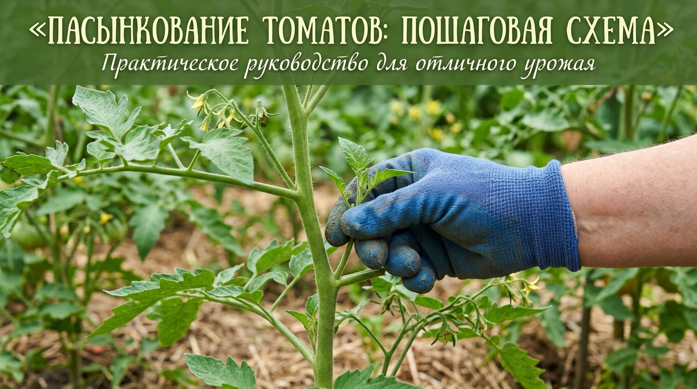
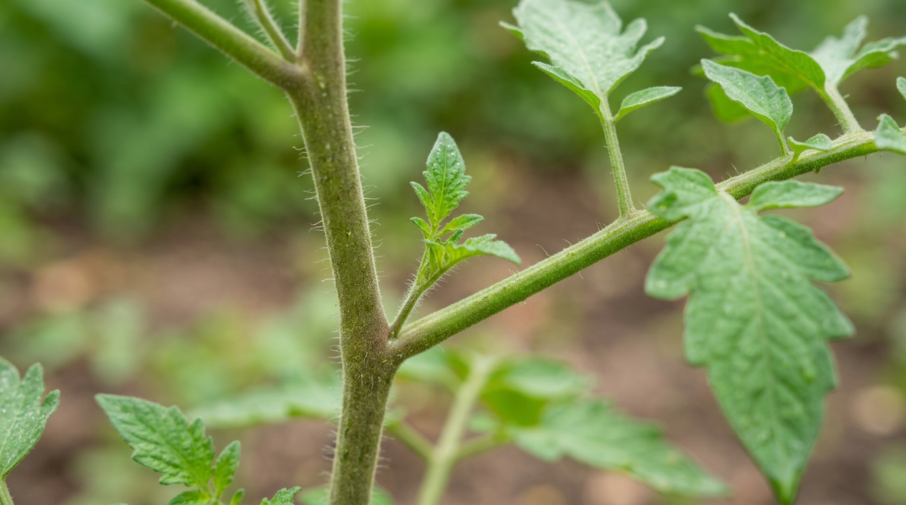
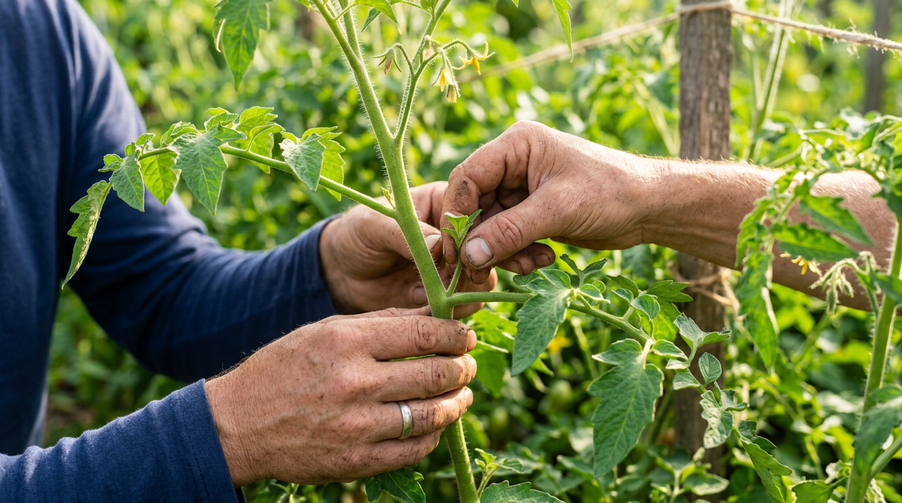
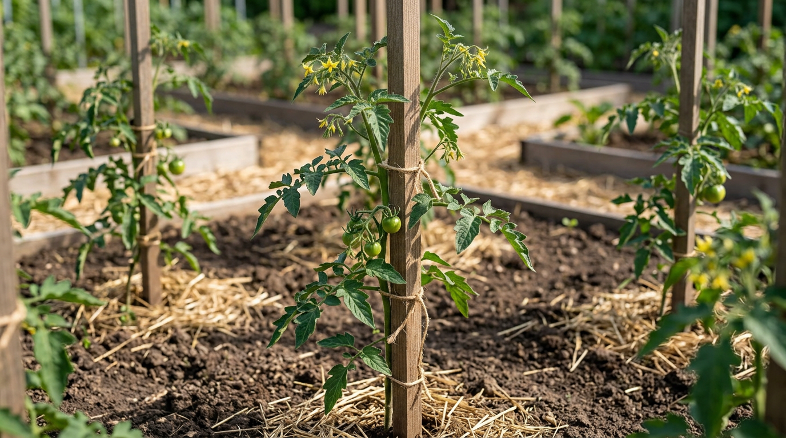
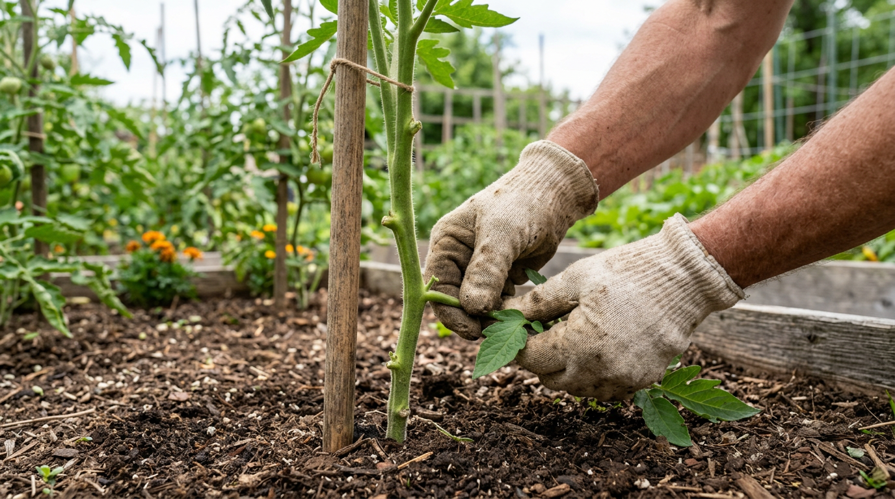
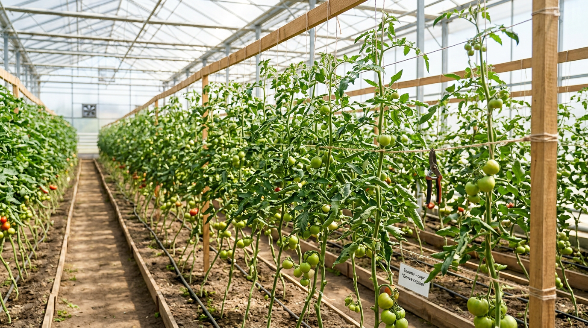

Помидоры — культура благодарная, но капризная: оставь куст без присмотра, и он погонит десятки боковых побегов, превращаясь в густые заросли, где много зелени и мало плодов. Чтобы силы растения уходили в урожай, а не в ботву, томаты пасынкуют. Это одна из ключевых летних работ, от которой напрямую зависит, сколько и каких помидоров вы соберёте. В этой статье разберём, что такое пасынкование помидоров, какие сорта нужно пасынковать, а какие нет, как это делать правильно и пошагово — от первого пасынка до прищипки верхушки в конце сезона.

## 🍅 Что такое пасынок и зачем пасынковать

Чтобы понять смысл процедуры, сначала разберёмся с тем, что именно мы удаляем.

### Что такое пасынок

Пасынок — это боковой побег, который вырастает в пазухе листа, то есть в том месте, где лист отходит от основного стебля. Если его не трогать, он быстро превращается в полноценную ветку со своими листьями, цветами и пасынками второго порядка. В итоге один куст разрастается в плотный «куст-джунгли». Важно не путать пасынок с плодовой кистью: пасынок всегда растёт из пазухи между стеблем и листом, а кисть с цветами — прямо со стебля, отдельно от листьев.

### Зачем пасынковать помидоры

Может показаться, что чем пышнее куст, тем больше урожай, — но с томатами всё наоборот. Каждый лишний побег тянет на себя воду и питание, которые могли бы пойти в плоды. Удаление лишних побегов даёт сразу несколько важных эффектов:

- **Больше сил на урожай.** Растение не тратит ресурсы на наращивание лишней зелени и направляет их в формирование и налив плодов.
- **Крупнее и слаще плоды.** На правильно сформированном кусте помидоры получаются крупнее и вкуснее, чем на загущённом.
- **Раньше созревание.** Без лишней ботвы плоды наливаются и краснеют быстрее — это особенно важно в регионах с коротким летом.
- **Меньше болезней.** Прореженный куст лучше проветривается и быстрее просыхает после дождя, а это главная профилактика [фитофторы](https://mir-doma.pro/fitoftora-na-pomidorah/) и других грибковых болезней.

Именно из-за последнего пункта пасынкование — не просто способ повысить урожай, но и часть защиты томатов от болезней.

## 🌱 Какие помидоры нужно пасынковать, а какие нет

Это первый и главный вопрос, потому что подход зависит от типа куста. Ошибиться здесь — значит либо загубить урожай лишним удалением, либо получить непролазные заросли.

### Индетерминантные (высокорослые)

Эти сорта растут практически бесконечно, вытягиваясь до 1,5–2 метров и выше, и закладывают кисти по всей длине. Их пасынкуют **обязательно и регулярно**, иначе куст превратится в неуправляемые джунгли. Чаще всего их формируют в один стебель.

### Детерминантные (среднерослые)

Рост таких кустов ограничен — они сами останавливаются после закладки нескольких кистей. Их пасынкуют **умеренно**, формируя в два-три стебля, чтобы получить больше плодовых кистей, но не загущать растение.

### Штамбовые и супердетерминантные (низкорослые)

Компактные ранние сорта с крепким стеблем часто можно **вообще не пасынковать** или ограничиться удалением самых нижних пасынков. Они невысокие, рано отдают урожай, и лишнее вмешательство им не нужно. Всегда проверяйте описание сорта на упаковке — там обычно прямо указано, нуждается ли он в пасынковании и в сколько стеблей его вести. Если упаковки под рукой нет, ориентируйтесь на поведение куста: если он активно тянется вверх и гонит много пасынков — это индетерминантный тип, и формировка ему нужна; если рано «остановился» и сформировал крепкую низкую кочку — это детерминантный или штамбовый сорт.

## ✂️ Как правильно пасынковать: пошагово

Сама процедура несложная, но в ней есть нюансы, от которых зависит здоровье растения.

### Когда начинать и как часто

Первое пасынкование проводят, когда боковые побеги отрастут до 3–5 см — такие пасынки легко удаляются и оставляют маленькую ранку. Затем процедуру повторяют регулярно, примерно раз в 7–10 дней, не давая пасынкам перерастать. Чем чаще вы осматриваете кусты, тем меньше травмируете растение: удалить маленький побег куда безопаснее, чем выламывать толстую ветку. В разгар лета, когда томаты растут особенно бурно, осматривать кусты стоит даже чаще — раз в неделю пасынки успевают перерасти. Заведите привычку проходить по грядкам с осмотром во время полива, чтобы не пропустить новые побеги.

### Техника удаления

Небольшие пасынки проще всего **выламывать руками**: возьмите побег двумя пальцами у основания и отведите в сторону — он легко отломится. Важный приём — оставлять **пенёк длиной 1–2 см**, а не выламывать заподлицо. Из этой точки новый пасынок уже не вырастет, а ранка получится аккуратной. Толстые переросшие пасынки лучше срезать ножом или ножницами, а не выламывать — иначе можно содрать кору со стебля и сильно травмировать растение. Срез делают чуть выше основания, тоже оставляя короткий пенёк. После удаления крупных пасынков ранке дают подсохнуть и не поливают куст по листьям в этот день.

### Главные правила

- **Пасынкуйте утром, в сухую погоду** — за день ранка подсохнет и затянется, снизив риск инфекции.
- **Дезинфицируйте инструмент** между растениями, если режете ножницами: через срез легко переносятся вирусы.
- **Не пасынкуйте больные растения** обычным порядком — их обрабатывают в последнюю очередь, чтобы не разнести болезнь по здоровым кустам.
- **Удаляйте пасынки, а не листья и кисти** — не перепутайте побег в пазухе с плодовой кистью.
- **Начинайте со здоровых кустов** и только потом переходите к подозрительным — так вы не перенесёте болезнь с больного растения на здоровое.

## 🌿 Формирование куста: в один, два или три стебля

Пасынкование — это часть формирования куста. От того, сколько стеблей вы оставите, зависит и количество, и размер плодов.

### В один стебель

Оставляют только главный стебель, удаляя **все** боковые пасынки. Куст получается высоким и компактным, плоды крупные и созревают рано. Это классический способ для индетерминантных томатов, особенно в теплице, где важно экономить место и держать посадки хорошо проветриваемыми. Минус один: общее число кистей на кусте ограничено, зато каждый плод получает максимум питания. Именно так выращивают большинство тепличных томатов на шпалере.

### В два стебля

Кроме главного стебля оставляют один сильный пасынок — обычно тот, что растёт под первой цветочной кистью (он самый мощный). Все остальные пасынки удаляют. Так на кусте больше плодовых кистей, но плоды чуть мельче. Хороший вариант для детерминантных сортов и для открытого грунта, где есть место для более раскидистого куста. Оба стебля подвязывают отдельно и дальше пасынкуют каждый так же, как главный, — то есть удаляют все новые боковые побеги, оставляя только эти два проводника.

### В три стебля

Оставляют главный стебель и два сильных нижних пасынка. Куст даёт максимум кистей, но требует много места, хорошего питания и надёжной подвязки. Подходит для низкорослых сортов в открытом грунте и для крупноплодных детерминантных томатов. Важно не увлекаться: если оставить больше трёх стеблей, куст загущается, плоды мельчают и созревают позже, а риск болезней растёт. Три стебля — разумный максимум для большинства сортов.

Ориентироваться удобно по таблице:

| Тип томата | Сколько стеблей | Пасынкование |
|------------|-----------------|--------------|
| Индетерминантные (высокие) | 1 стебель | Обязательно, регулярно |
| Детерминантные (средние) | 2–3 стебля | Умеренно |
| Штамбовые, супердетерминантные | Без формировки | Минимально или не нужно |

Любой сформированный куст обязательно **подвязывают** к опоре или шпалере — под весом наливающихся плодов незакреплённый стебель ломается.

## 🌱 Что делать с удалёнными пасынками

Удалённые пасынки не обязательно выбрасывать — из них легко получить дополнительную рассаду. Крупный здоровый пасынок (10–15 см) ставят в банку с водой, и через 7–10 дней он даёт корни, после чего его высаживают в грунт. Такие растения зацветают позже основных, но в южных регионах и в теплице вполне успевают дать урожай — это бесплатный способ увеличить количество кустов во второй половине лета. Мелкие пасынки отправляют в компост: они отлично перепревают. А вот пасынки с больных растений ни укоренять, ни класть в компост нельзя — их уничтожают, чтобы не разносить инфекцию.

Такой способ особенно выручает, если часть рассады погибла или вы хотите размножить понравившийся сорт. Укоренённые пасынки полностью повторяют материнское растение, в отличие от семян, которые у гибридов (F1) свойства не сохраняют. Для скорости пасынки можно ставить на укоренение не в воду, а сразу во влажный грунт в притенённом месте.

## 🍃 Удаление нижних листьев

Помимо пасынков, у томатов постепенно убирают и нижние листья. Делают это по мере роста куста и созревания нижних кистей: когда плоды на кисти начали наливаться, листья ниже неё уже не нужны. Удаление нижних листьев улучшает проветривание у земли, ускоряет прогрев почвы и не даёт каплям с листьев разносить инфекцию.

Действуйте без фанатизма: за один раз убирайте не больше 1–3 листьев с куста, чтобы не вызвать у растения стресс. Сначала удаляют пожелтевшие и лежащие на земле листья, затем — здоровые ниже первой плодоносящей кисти. Верхние листья, питающие наливающиеся плоды, не трогают. Этот приём, как и пасынкование, работает на снижение риска грибковых болезней. Особенно важно убирать листья, которые лежат на земле или касаются её, — именно через них чаще всего поднимается инфекция из почвы. Срез или облом делают чисто, не оставляя длинных черешков, в которых может застаиваться влага.

## 🏠 Пасынкование в теплице и открытом грунте

В теплице томаты растут активнее и гуще, воздух застаивается, поэтому пасынковать там нужно особенно дисциплинированно — обычно формируя кусты в один стебель и не допуская загущения. Регулярное проветривание теплицы в сочетании с пасынкованием — лучшая защита от болезней в замкнутом пространстве.

В открытом грунте кусты обдуваются ветром и просыхают быстрее, поэтому здесь можно позволить формировку в два-три стебля, особенно для невысоких сортов. Но и тут переросшие заросли вредны: они дольше держат влагу после дождя и провоцируют фитофтору. Если вы выращиваете и [помидоры](https://mir-doma.pro/kogda-sazhat-pomidory-na-rassadu-v-2026/), и [перец](https://mir-doma.pro/kogda-sazhat-perets-na-rassadu/), учтите, что перец пасынкуют иначе и гораздо умереннее — у него своя агротехника.

Отдельно стоит сказать про загущённость посадок. Даже идеально сформированные кусты не дадут результата, если посажены слишком тесно: они затеняют друг друга и плохо проветриваются. Соблюдайте рекомендованное расстояние между растениями — для высокорослых сортов это обычно 50–60 см, для низких — 35–40 см. Пасынкование и правильная схема посадки работают в паре.

## 💧 Уход за томатами после формировки

Пасынкование и удаление листьев — это стресс для растения, поэтому грамотный уход помогает кусту быстрее восстановиться и направить силы в плоды. Поливайте томаты под корень, не смачивая листья и стебель, желательно тёплой водой в первой половине дня. После начала плодоношения растению особенно нужны калий и фосфор — они отвечают за налив и вкус плодов, тогда как избыток азота, наоборот, гонит ботву и провоцирует новые пасынки. По мере роста подвязывайте стебли к опоре, распределяя кисти так, чтобы они не лежали на земле и хорошо освещались. Регулярный осмотр после каждой формировки помогает вовремя заметить и новые пасынки, и первые признаки болезней. Не совмещайте пасынкование с обильным поливом в один день: растению проще залечить ранку, когда ткани не перенасыщены влагой. И не пасынкуйте сразу после подкормки азотом — на таком фоне куст особенно активно гонит новые побеги.

## 📋 Прищипка верхушки в конце сезона

Ближе к концу лета, примерно за месяц–полтора до устойчивого похолодания, у индетерминантных томатов прищипывают (удаляют) верхушку главного стебля над последней сформировавшейся кистью. Этот приём называют вершкованием. Смысл в том, чтобы растение перестало расти вверх и завязывать новые плоды, которые всё равно не успеют вызреть, и направило все силы на налив уже имеющихся. Заодно с этим удаляют поздние цветочные кисти и мелкие завязи. Прищипка верхушки заметно ускоряет созревание последнего урожая и помогает собрать его до прихода холодов и осенней волны болезней. После вершкования на кусте оставляют 2–3 листа над последней кистью — они продолжают питать наливающиеся плоды. В теплице эту операцию обычно проводят чуть позже, чем в открытом грунте, потому что сезон там длиннее.

## ⚠️ Частые ошибки при пасынковании

Несколько типичных промахов сводят на нет всю пользу процедуры:

- **Запускают кусты.** Если выламывать переросшие толстые пасынки, растение получает большую рану и сильный стресс. Пасынкуйте регулярно, пока побеги маленькие.
- **Выламывают пасынок заподлицо.** Без пенька из той же пазухи быстро вырастает новый побег. Оставляйте 1–2 см.
- **Пасынкуют в жару или дождь.** Влажная ранка дольше не заживает и становится воротами для инфекции. Работайте утром в сухую погоду.
- **Не дезинфицируют ножницы.** Через срез вирусы переходят с больного куста на здоровые.
- **Путают пасынок с плодовой кистью.** Удалив кисть, вы лишаетесь будущего урожая. Помните: пасынок растёт из пазухи листа.
- **Обрывают слишком много листьев разом.** Резкое оголение куста — стресс для растения. Убирайте по 1–3 листа за раз.

## ❓ Частые вопросы

### Обязательно ли пасынковать помидоры?

Зависит от сорта. Высокорослые (индетерминантные) томаты пасынковать необходимо, иначе они превратятся в заросли с мелкими плодами. Низкорослые штамбовые сорта часто можно не пасынковать вовсе. Тип сорта всегда указан на упаковке семян.

### Когда начинать пасынковать помидоры?

Как только боковые побеги в пазухах листьев отрастут до 3–5 см, обычно через 2–3 недели после высадки рассады. Дальше пасынкуют регулярно, раз в 7–10 дней, не давая побегам перерастать.

### Что будет, если не пасынковать помидоры?

Высокорослый куст разрастётся в густые заросли, силы уйдут в ботву, плоды получатся мелкими и созреют поздно, а загущение спровоцирует болезни. Для низкорослых сортов отказ от пасынкования менее критичен.

### В сколько стеблей формировать помидоры?

Индетерминантные обычно ведут в один стебель, детерминантные — в два-три. В теплице чаще формируют в один стебель ради экономии места и хорошего проветривания, в открытом грунте для невысоких сортов допустимы два-три стебля.

### Нужно ли удалять нижние листья у помидоров?

Да, по мере созревания нижних кистей. Это улучшает проветривание и снижает риск болезней. Главное — не удалять больше 1–3 листьев за раз и не трогать листья, питающие наливающиеся плоды.

### Как часто нужно пасынковать помидоры за лето?

В среднем раз в 7–10 дней на протяжении всего сезона активного роста. В жаркую погоду, когда кусты растут быстрее, осматривать их стоит чаще, чтобы пасынки не перерастали. Прекращают пасынкование ближе к концу сезона, вместе с прищипкой верхушки.

### Влияет ли пасынкование на вкус помидоров?

Косвенно — да. На правильно сформированном кусте плоды получают больше питания и солнца, поэтому наливаются крупнее, слаще и равномернее окрашиваются. На загущённом кусте плоды мельче, дольше зреют и чаще бывают водянистыми.

### Чем лучше пасынковать — руками или ножницами?

Маленькие пасынки удобнее и безопаснее выламывать руками: ранка получается аккуратной, и не нужен инструмент, который пришлось бы дезинфицировать. Ножницы или нож берут только для толстых переросших побегов. Если режете инструментом, протирайте его дезинфицирующим раствором между кустами.

### Можно ли пасынковать помидоры в жару?

Лучше не стоит. В сильную жару растение и так испытывает стресс, а свежая ранка на солнце дольше заживает. Пасынкуйте рано утром в нежаркую сухую погоду — за день ранка успеет затянуться.

### Когда прищипывать верхушку у помидоров?

Примерно за месяц–полтора до устойчивого похолодания, чтобы растение направило силы на налив уже завязавшихся плодов, а не на новый рост. Прищипывают верхушку главного стебля над последней сформировавшейся кистью.

## Заключение

Пасынкование — несложная, но очень важная летняя работа, которая во многом определяет урожай томатов. Главное — понять тип своего сорта: высокорослые кусты ведут в один стебель и пасынкуют регулярно, средние формируют в два-три, а компактные штамбовые можно почти не трогать. Удаляйте пасынки маленькими, утром и с пеньком, постепенно убирайте нижние листья для проветривания, а в конце сезона прищипните верхушку. Эти простые приёмы дадут вам более крупные, сладкие и ранние помидоры — и заметно меньше болезней на грядке.

А как вы формируете свои томаты — в один стебель или оставляете больше? Делитесь опытом в комментариях и подписывайтесь, чтобы не пропустить новые статьи о выращивании овощей.
