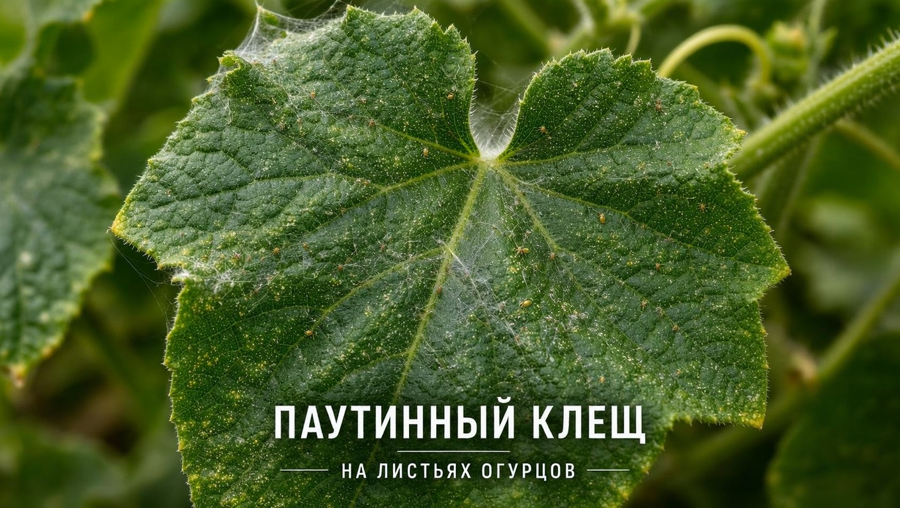
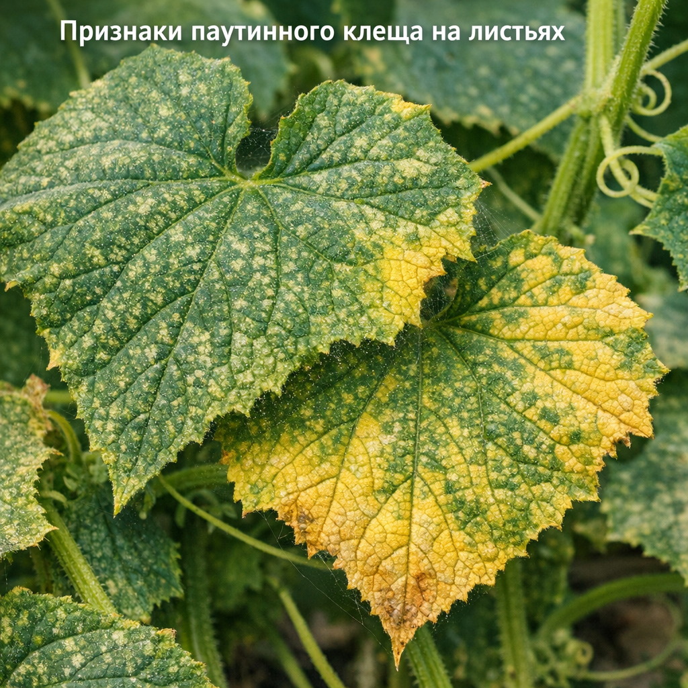
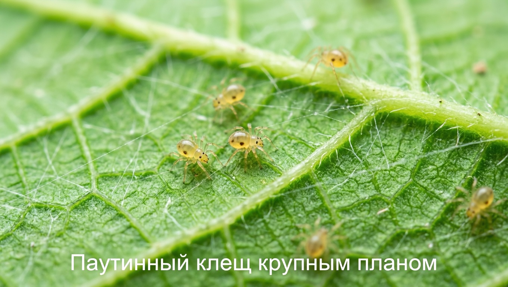
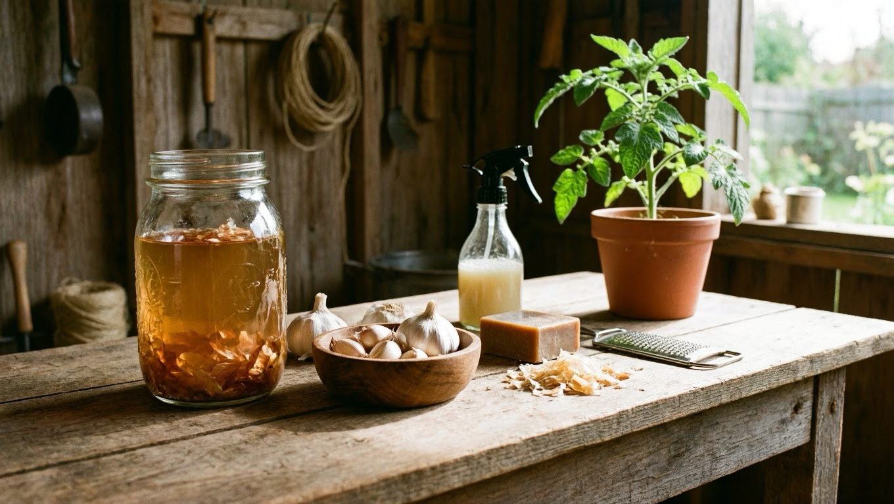
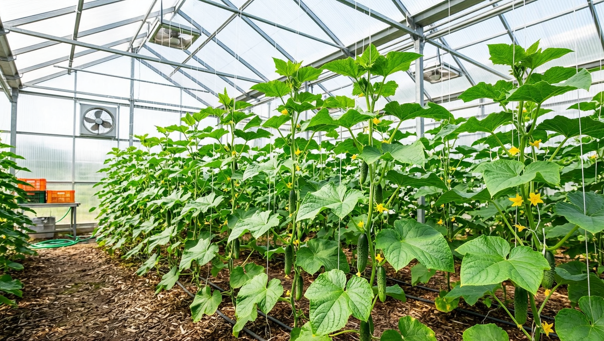

В жаркое сухое лето огурцы в теплице нередко атакует паутинный клещ — крохотный, почти незаметный вредитель, способный за считаные недели погубить целые посадки. Листья покрываются светлыми точками, желтеют, сохнут, а снизу появляется тонкая паутинка. Коварство клеща в том, что обычные средства от насекомых на него не действуют, и многие огородники теряют время. В этой статье разберём, как распознать паутинного клеща на огурцах, откуда он берётся и как от него избавиться народными, биологическими и химическими средствами.

## 🕷️ Кто такой паутинный клещ

Паутинный клещ — это крошечный (меньше миллиметра) паукообразный вредитель, а не насекомое. Он селится на нижней стороне листьев, прокалывает их и высасывает сок. Из-за этого:

- растение слабеет, отстаёт в росте и хуже плодоносит;
- повреждённые листья желтеют, сохнут и опадают;
- при сильном заражении посадки затягивает паутиной, и растения гибнут.

Одна самка откладывает сотни яиц, а в жару новое поколение появляется каждую неделю — вот почему клещ так быстро захватывает теплицу, если его вовремя не остановить.

Клещ невероятно быстро размножается в жару, а ещё переносит вирусные болезни, поэтому бороться с ним нужно как можно раньше. Как и в случае с другими вредителями — [тлёй](https://mir-doma.pro/kak-izbavitsya-ot-tli/) или [слизнями](https://mir-doma.pro/slizni-na-ogorode/), — успех зависит от того, насколько рано замечена проблема.

## 🔍 Признаки паутинного клеща

Заметить клеща непросто из-за размеров, но поражение выдают характерные признаки:

- **Светлые точки-проколы** на листьях, которые сливаются в мраморный, обесцвеченный рисунок.
- **Пожелтение и усыхание** листьев, начиная с нижних (важно не спутать с другими причинами, по которым [желтеют листья у огурцов](https://mir-doma.pro/zhelteyut-listya-u-ogurtsov/)).
- **Тонкая паутинка** на нижней стороне листьев, в пазухах и на верхушках побегов.
- **Мелкие движущиеся точки** на изнанке листа — это сами клещи, которых видно в лупу.

Осматривать нужно именно нижнюю сторону листьев — там клещ и прячется. На ранней стадии заметны только светлые точки, и именно в этот момент бороться проще всего; паутина появляется уже при сильном заражении, когда клещей очень много.

## 🌡️ Почему появляется паутинный клещ

Клещ обожает жару и сухость, поэтому чаще всего появляется:

- **в жаркую сухую погоду** — оптимальные для него условия;
- **в теплице**, где воздух особенно сухой и горячий;
- **при заносе** с рассадой, сорняками, инвентарём или ветром;
- **на ослабленных растениях** и в загущённых посадках.

Понимание условий подсказывает и профилактику: клещ не любит влажность и чистоту. Особенно уязвимы огурцы в закрытых душных теплицах в разгар лета — там для клеща создаются идеальные условия, поэтому теплицы осматривают чаще всего.

## 🛡️ Как избавиться от паутинного клеща

Бороться с клещом нужно комплексно и обязательно повторно — за одну обработку его не вывести.

### Механические меры и влажность

Сильно поражённые листья обрывают и уничтожают. Клещ не выносит высокой влажности, поэтому растения опрыскивают водой и повышают влажность воздуха. Но в теплице с этим важно не переусердствовать: избыток сырости провоцирует грибковые болезни, например [мучнистую росу](https://mir-doma.pro/muchnistaya-rosa-na-ogurtsah/). Нужен баланс — влажность против клеща, но с проветриванием против грибка. Хорошо помогает опрыскивание листьев снизу прохладной водой и поддержание умеренной влажности воздуха при регулярном проветривании.

### Народные средства

При слабом поражении помогают домашние настои:

- **Настой чеснока или луковой шелухи** — им опрыскивают растения, особенно снизу.
- **Мыльный раствор** (хозяйственное или зелёное мыло) — обмывают листья.
- **Настой одуванчика или тысячелистника.**
- **Спиртовой или нашатырный раствор** для протирания листьев на небольших посадках.

Обрабатывают обязательно нижнюю сторону листьев, где сидит клещ, и повторяют несколько раз.

### Биопрепараты и химические акарициды

Если поражение сильное, применяют специальные средства:

- **Биопрепараты** (на основе полезных бактерий и грибов) — эффективны и относительно безопасны.
- **Химические акарициды** — препараты именно против клещей. Важно: **обычные инсектициды на паутинного клеща не действуют**, потому что он не насекомое, — нужны акарициды или инсектоакарициды.

Любую обработку повторяют 2–3 раза с интервалом (яйца клеща выживают после первой), а препараты чередуют, чтобы клещ не привыкал. Применяют их строго по инструкции, в перчатках и средствах защиты, а плоды после обработки не собирают в течение указанного в инструкции срока ожидания.

## 🌿 Профилактика

Предупредить клеща проще, чем вывести:

- поддерживайте оптимальную влажность и проветривайте теплицу, не допуская жары и сухости;
- убирайте сорняки и растительные остатки, где зимует клещ;
- осенью дезинфицируйте теплицу и обеззараживайте почву;
- регулярно осматривайте нижнюю сторону листьев, чтобы заметить вредителя вовремя;
- не загущайте посадки и не заносите заражённую рассаду;
- новые растения первое время держите отдельно и осматривайте, прежде чем подсаживать к остальным.

## 🛡️ Частые ошибки

- **Обычные инсектициды.** Они не берут клеща — он не насекомое. Нужны акарициды.
- **Обработка только сверху.** Клещ сидит снизу листа, поэтому обрабатывают именно изнанку.
- **Одна обработка.** После неё выживают яйца, и клещ возвращается. Нужно 2–3 обработки.
- **Не чередуют препараты.** Клещ быстро привыкает к одному средству. Их меняют.
- **Запустили заражение.** На поздней стадии с паутиной бороться намного сложнее. Действуйте при первых признаках.

## ❓ Частые вопросы

### Как понять, что на огурцах паутинный клещ?

О заражении говорят светлые точки и мраморность на листьях, их пожелтение и усыхание, а также тонкая паутинка на нижней стороне листьев и верхушках. Сами клещи — мельчайшие движущиеся точки на изнанке листа, заметные в лупу. Осматривать нужно именно нижнюю сторону.

### Почему обычные средства от насекомых не помогают от клеща?

Потому что паутинный клещ — не насекомое, а паукообразное, и инсектициды на него не действуют. Против него применяют специальные препараты — акарициды или инсектоакарициды. Это главная причина, по которой борьба часто оказывается безуспешной.

### Как избавиться от паутинного клеща народными средствами?

При слабом поражении опрыскивают растения настоем чеснока, луковой шелухи или одуванчика, обмывают листья мыльным раствором и повышают влажность воздуха. Обрабатывают обязательно нижнюю сторону листьев и повторяют несколько раз. При сильном заражении переходят к биопрепаратам и акарицидам.

### Боится ли паутинный клещ влажности?

Да, паутинный клещ не любит высокую влажность и предпочитает сухой жаркий воздух. Поэтому опрыскивание водой и повышение влажности сдерживают его. Но в теплице важно соблюдать баланс, чтобы избыточная сырость не спровоцировала грибковые болезни.

### Сколько раз обрабатывать огурцы от клеща?

Обработку повторяют 2–3 раза с интервалом в несколько дней, потому что после первой погибают взрослые особи, но выживают яйца. Препараты при этом чередуют, чтобы у клеща не выработалась устойчивость. Одной обработки для избавления от клеща недостаточно.

### Опасны ли огурцы, поражённые паутинным клещом?

Сам клещ для человека не опасен, но сильно поражённые растения дают меньше урожая, а плоды мельчают. Огурцы с таких кустов можно есть, тщательно вымыв, но если проводились химические обработки, важно выдержать срок ожидания, указанный на препарате.

### Появится ли клещ снова после обработки?

Может, если сохранились условия для него (жара и сухость) или остались невыведенные особи и яйца. Поэтому обработку повторяют несколько раз, наводят порядок в теплице и осенью её дезинфицируют. Профилактика и своевременный осмотр не дают клещу вернуться.

### Как не допустить паутинного клеща в теплице?

Поддерживайте влажность и проветривайте теплицу, не допуская жары и сухости, убирайте сорняки и растительные остатки, осенью дезинфицируйте теплицу, не загущайте посадки и регулярно осматривайте листья снизу. Чистая, проветриваемая и не пересушенная теплица клещу не по нраву.

## Заключение

Паутинный клещ на огурцах опасен своей незаметностью и скоростью размножения, но при раннем обнаружении с ним вполне можно справиться. Осматривайте нижнюю сторону листьев, при первых признаках обрывайте поражённые листья, повышайте влажность и обрабатывайте растения — народными средствами при слабом заражении и акарицидами при сильном, помня, что обычные инсектициды тут бесполезны. Обработки повторяйте и чередуйте, а лучше не допускайте клеща вовсе, поддерживая в теплице влажность и чистоту. Тогда огурцы останутся здоровыми и урожайными. Главное правило борьбы с клещом простое: чем раньше замечен вредитель, тем легче и быстрее удастся его победить.

А вы боролись с паутинным клещом на огурцах? Делитесь опытом в комментариях и подписывайтесь, чтобы не пропустить новые статьи о защите урожая.
