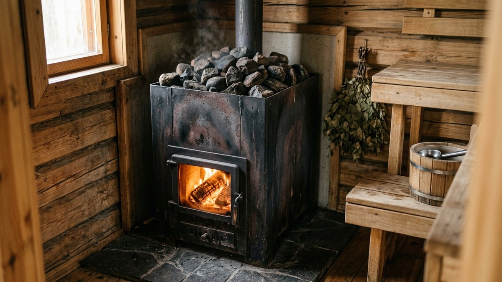
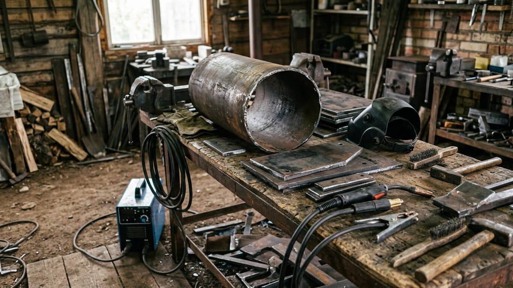
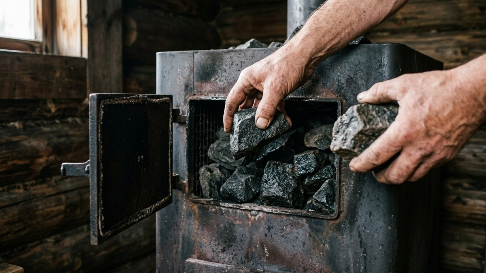
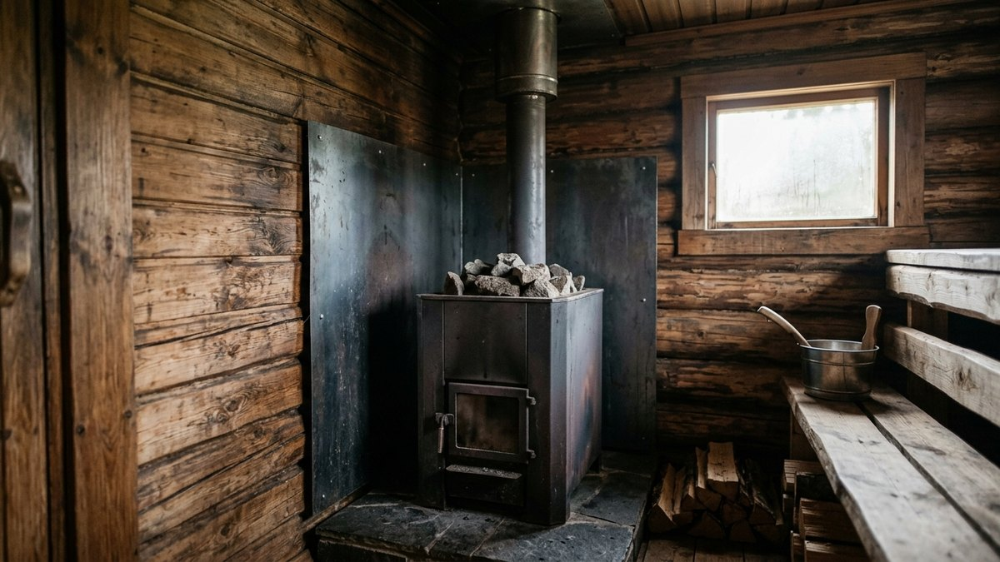
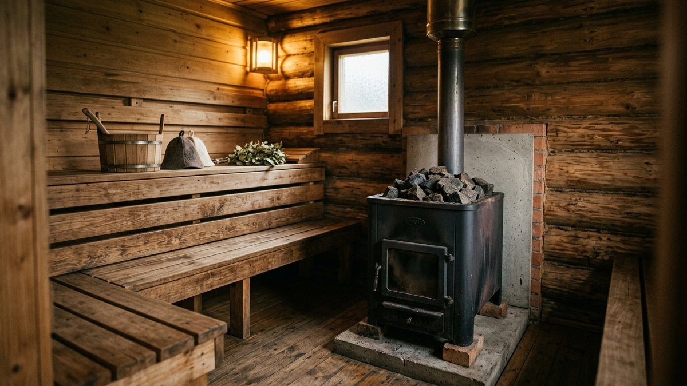
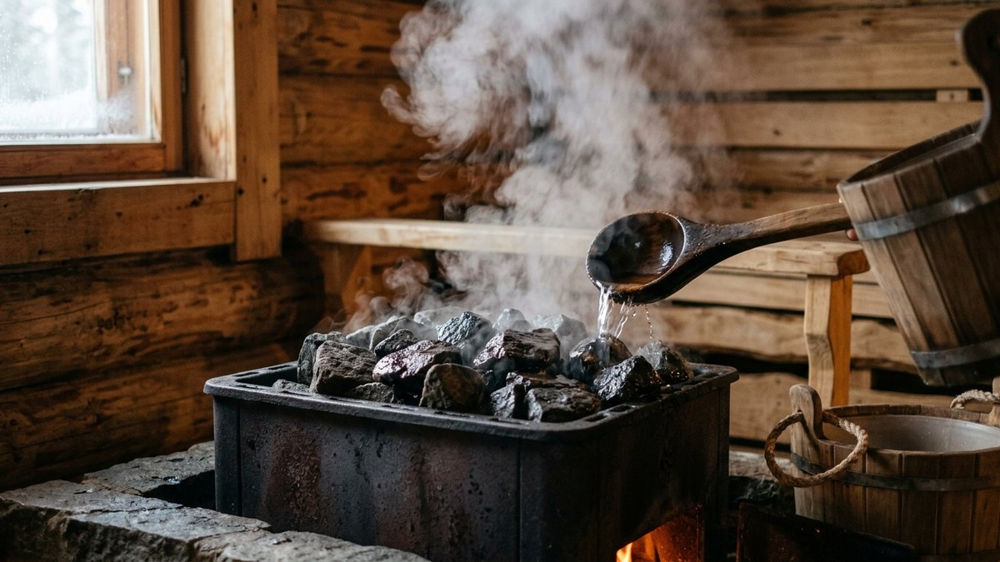

# Печь для бани своими руками из металла: конструкция и сборка

Банная печь-каменка — не то же самое, что печь для отопления дома: ей нужно
держать камни для пара, безопасно работать в условиях высокой влажности и
при этом быстро прогревать небольшой объём парной. Сварить такую печь из
трубы или листового металла своими руками дешевле, чем купить готовую, если
есть навык сварки и понимание конструкции. Разберём саму конструкцию,
какой металл брать и как посчитать камни под объём парной.

## Из чего состоит банная печь

- **Топка** — камера сгорания дров, обычно из трубы диаметром 400–500 мм
  или согнутого листового металла.
- **Зольник** — нижний отсек под колосниковой решёткой, куда падает зола;
  через его дверцу же регулируется подача воздуха на горение.
- **Каменка** — бак или решётка для камней над топкой. Открытая каменка —
  камни лежат открыто сверху, воздух прогревается быстро, пар мягкий.
  Закрытая — камни в отдельном кожухе с дверцей, пар получается плотным
  и сухим при плескании воды через дверцу, жар держится дольше после
  протопки.
- **Дымоход** — патрубок и труба для отвода дыма, с разделкой через
  кровлю или стену с соблюдением пожарных отступов.
- **Бак для воды (опционально)** — встроенный сбоку от топки или выносной,
  подключённый трубкой к теплообменнику в стенке топки.

## Какой металл брать

- **Топка и корпус** — сталь от 4–6 мм. Тоньше 3 мм прогорает за один-два
  сезона активной топки, особенно в зоне прямого контакта с пламенем.
- **Каменка (кожух под камни)** — жаропрочная сталь тех же толщин, не
  оцинкованная сталь: цинковое покрытие при сильном нагреве выделяет пары,
  опасные для дыхания в закрытом помещении парной.
- **Бак для воды** — нержавеющая сталь, если бак встроенный и контактирует
  с топочными газами через теплообменник — обычная сталь там быстро
  корродирует от постоянного контакта с горячей водой и паром.
- **Дымоход** — сталь с термостойким покрытием или нержавейка, обычный
  чёрный металл на дымоходе прогорает от постоянного конденсата и высоких
  температур отходящих газов.

## Расчёт камней по объёму парной

### Калькулятор массы камней

<!-- wp:html -->

<h3 class="md-pb__title">Калькулятор массы камней для каменки</h3>

Считает объём парной и рекомендуемую массу камней по типу каменки.

<label class="md-pb__f">Площадь парной, м²<input type="number" id="pbArea" value="6" min="1" max="40" step="0.5"></label>
<label class="md-pb__f">Высота потолка, м<input type="number" id="pbHeight" value="2.2" min="1.8" max="3" step="0.05"></label>
<label class="md-pb__f">Тип каменки
<select id="pbType">
<option value="20">Открытая — 20 кг на 1 м³</option>
<option value="30" selected>Закрытая — 30 кг на 1 м³</option>
</select></label>

Объём парной<b id="pbVolume">13,2 м³</b>

Масса камней<b id="pbStones">396 кг</b>

Расчёт ориентировочный, по общепринятому правилу кг камней на м³ парной. Точный объём каменки уточняйте по паспорту конкретной топки.

<button type="button" id="pbCopy" class="md-pb__btn md-pb__btn--main">Скопировать результат</button>
<a id="pbVk" class="md-pb__btn md-pb__btn--vk" href="#" target="_blank" rel="noopener noreferrer">Поделиться ВКонтакте</a>
<a id="pbTg" class="md-pb__btn md-pb__btn--tg" href="#" target="_blank" rel="noopener noreferrer">Поделиться в Telegram</a>
<button type="button" id="pbShareNative" class="md-pb__btn" hidden>Поделиться…</button>
<button type="button" id="pbPrint" class="md-pb__btn">Печать</button>

<!-- /wp:html -->

## Сборка печи пошагово

1. Вырезать и приварить дно топки, оставив проём под зольниковую дверцу.
2. Установить колосниковую решётку между топкой и зольником — она должна
   выниматься для чистки золы и замены при прогорании.
3. Приварить дверцы топки и зольника с плотным прилеганием — щели снижают
   контроль тяги и повышают риск угара.
4. Сварить и закрепить кожух каменки над топкой — для закрытой каменки
   предусмотреть дверцу для плескания воды на камни и отверстия для
   выхода пара.
5. Приварить патрубок дымохода в верхней части каменки или сбоку, в
   зависимости от выбранной схемы движения дымовых газов.
6. При необходимости вварить теплообменник под бак для воды — трубу или
   регистр в стенке топки, контактирующую с самым горячим участком
   пламени.
7. Проверить швы на герметичность первой протопкой на улице, до установки
   печи в парную — угар через непроваренный шов в закрытом помещении
   опасен.

## Требования пожарной безопасности

Отступ от печи до горючих стен и мебели — не менее 50 см без защитного
экрана и от 30 см с экраном из негорючего материала. Пол под печью и
разделка дымохода через кровлю или стену — по тем же принципам, что и для
печи отопления дома, с той же разбивкой на противопожарные отступы и
изоляцию: подробно разобрано в статье [печь для
дачи](https://mir-doma.pro/pech-dlya-dachi/), хотя сами конструкции
печей разные.

## Частые ошибки

- **Металл тоньше 4 мм на топку.** Прогорает уже через один-два сезона
  активной эксплуатации, особенно в зоне контакта с открытым пламенем.
- **Оцинкованная сталь на кожухе каменки.** При сильном нагреве цинковое
  покрытие выделяет вредные пары — опасно в закрытом помещении парной.
- **Топка слишком большого объёма под маленькую парную.** Перегревает
  помещение и пережигает дрова впустую — размер топки подбирают под
  реальный объём парной, а не по принципу «больше — лучше».
- **Отсутствие зольника и колосниковой решётки.** Без них горение
  неполное, тяга нестабильная, а зола скапливается прямо в топке.
- **Случайный камень вместо проверенной породы.** Расчёт массы камней
  выше не работает, если засыпать каменку случайным колотым булыжником —
  он трескается в разы быстрее, разбор пород и на что смотреть при выборе —
  в статье [какие камни для банной печи](https://mir-doma.pro/kakie-kamni-dlya-bannoy-pechi/).

## Частые вопросы

### Чем банная печь отличается от печи для дома

Банная печь-каменка держит камни и создаёт пар, рассчитана на быстрый
разогрев небольшого влажного помещения. Печь для дома работает на
равномерный долгий обогрев сухого жилого пространства без функции пара.

### Какой толщины металл нужен для печи бани

От 4 мм для стенок топки, тоньше 3 мм прогорает за один-два сезона
активной топки. Кожух каменки — та же толщина, жаропрочная сталь без
оцинковки.

### Открытая или закрытая каменка лучше для бани

Закрытая держит жар дольше и даёт более сухой плотный пар при поливе воды
через дверцу — популярнее для классической русской бани. Открытая быстрее
прогревает воздух в парной, но пар мягче и не такой стойкий.

### Сколько камней нужно на банную печь

Ориентировочно 20 кг на 1 м³ парной для открытой каменки и 30 кг на 1 м³
для закрытой — посчитайте по своим размерам в калькуляторе выше, точный
объём каменки уточняйте по паспорту топки, если она куплена частично
готовой.

