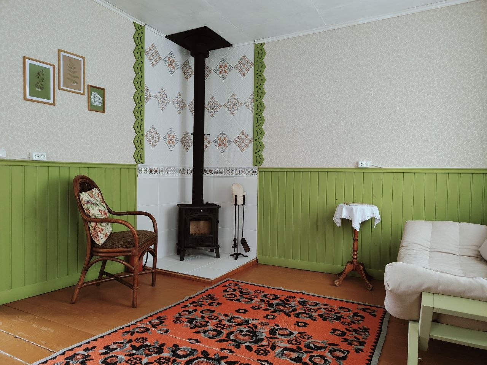
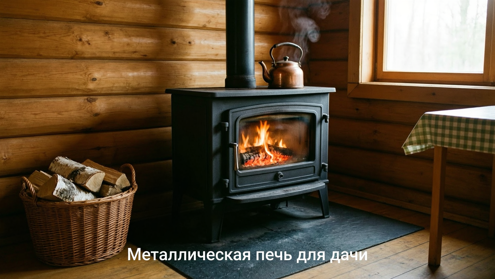
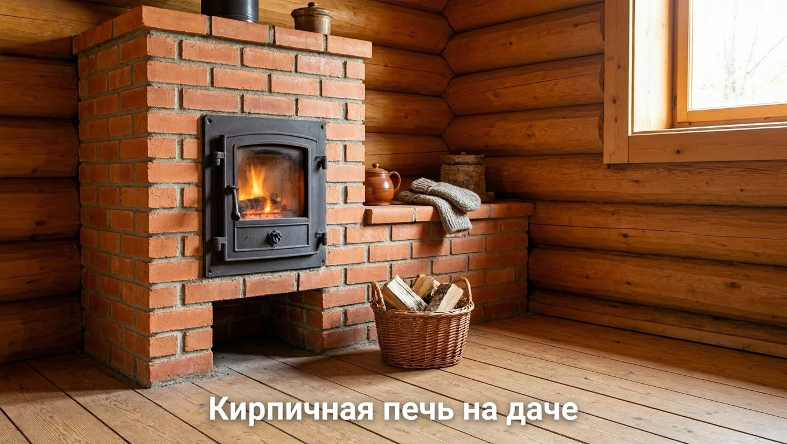
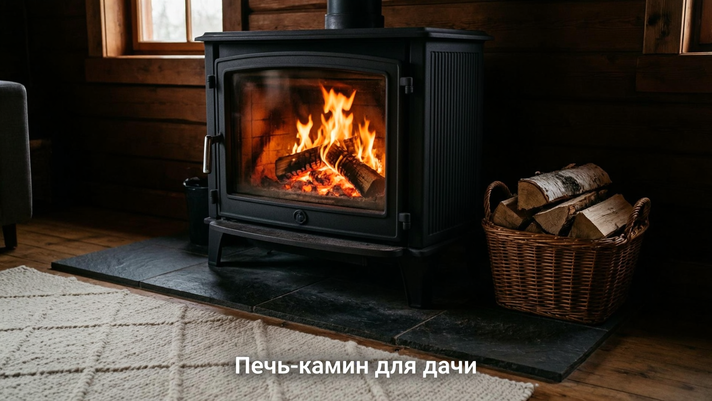
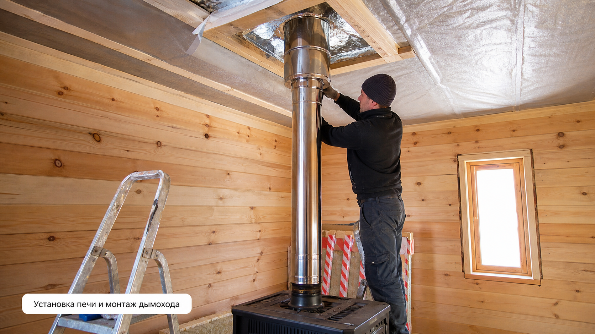
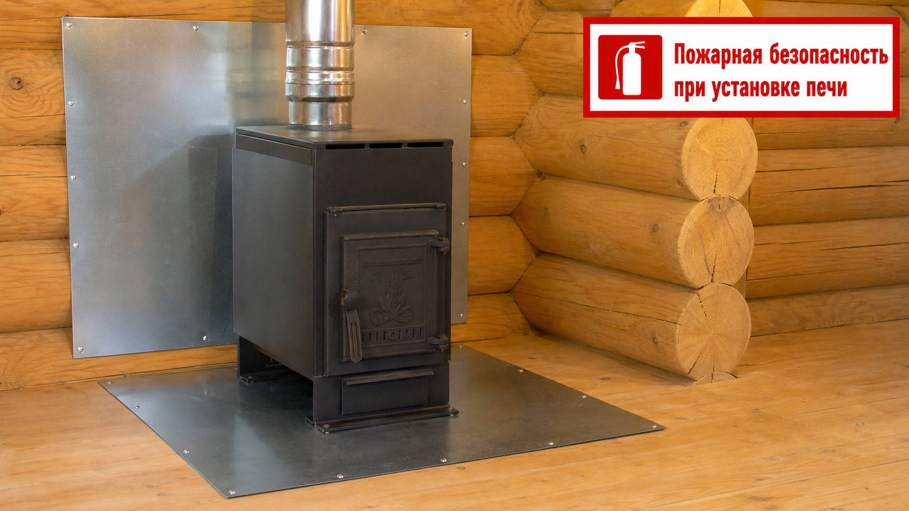

Печь на даче — это и тепло, и уют, и независимость от электричества, а часто ещё и возможность приготовить еду. С хорошей печью на даче комфортно и прохладным летним вечером, и в межсезонье, и даже зимой. Но выбор печей велик: металлические и кирпичные, простые буржуйки и красивые печи-камины. Чтобы не ошибиться, нужно учесть площадь дома, режим проживания и бюджет. В этой статье разберём, какую печь выбрать для дачи, чем отличаются разные виды, как установить печь с дымоходом и обеспечить пожарную безопасность.

## 🔥 Зачем нужна печь на даче

Печь решает сразу несколько задач:

- **Отопление** — согревает дом в холода без привязки к электричеству и газу.
- **Независимость** — работает на дровах, которые всегда доступны.
- **Уют** — живой огонь создаёт особую атмосферу.
- **Готовка** — многие печи оснащены варочной панелью и духовкой.

Особенно печь выручает там, где нет газа и случаются перебои с электричеством, — то есть на большинстве дач.

## 🧩 Виды печей для дачи

Печи различаются по материалу и назначению — у каждой свои плюсы.

### Металлическая дровяная печь

Самый популярный для дачи вариант: буржуйки, конвекционные печи (типа булерьяна), печи с варочной панелью. Они **быстро нагревают** помещение, недорого стоят и легко устанавливаются. Минус — так же быстро остывают, когда прогорают дрова. Идеальны для дач, куда приезжают на выходные и нужно быстро прогреть дом. Конвекционные модели вроде булерьяна экономичнее обычной буржуйки: они дольше держат тепло и расходуют меньше дров за счёт особой конструкции с воздушными каналами.

### Кирпичная печь

Классическая теплоёмкая печь: долго нагревается, но и долго — часами — отдаёт тепло. Она подходит для **постоянного или длительного проживания**. Минусы — высокая цена, необходимость отдельного фундамента и работы опытного печника. Зато такая печь создаёт мягкое, комфортное тепло и не пересушивает воздух, а при желании её оснащают лежанкой, варочной плитой и духовкой.

### Печь-камин

Чугунная или стальная печь с дверцей-стеклом сочетает обогрев и эстетику камина: и греет, и радует видом живого огня. Отличный выбор, если важна не только функция, но и уют в интерьере. Через стеклянную дверцу видно живой огонь, а по эффективности такая печь заметно превосходит открытый камин, который больше греет улицу, чем дом.

### Электрические и газовые обогреватели

Если на даче стабильное электричество или подведён газ, для отопления используют электрические конвекторы, обогреватели или газовые котлы. Они удобны и не требуют дров, но зависят от коммуникаций.

## 📊 Как выбрать печь

Подбирая печь, ориентируйтесь на несколько факторов:

- **Площадь и объём дома** — мощность печи подбирают под размер отапливаемых помещений, с запасом.
- **Режим проживания** — для наездов на выходные лучше быстрая металлическая печь, для постоянного проживания — теплоёмкая кирпичная или котёл.
- **Топливо** — дрова, уголь, электричество или газ в зависимости от доступности. Дрова — самый распространённый и автономный вариант для дачи, не зависящий от коммуникаций.
- **Нужна ли готовка** — если да, выбирают печь с варочной панелью или духовкой.
- **Бюджет** — металлическая печь дешевле, кирпичная дороже из-за материалов и работы печника.

Утеплённому дому нужна печь меньшей мощности, поэтому отопление удобно планировать вместе с [утеплением дачного дома](https://mir-doma.pro/kak-uteplit-dachnyy-dom/) — так тепло не будет уходить впустую.

## 🛠️ Установка печи и дымоход

Правильный монтаж — залог безопасной и эффективной работы печи:

- **Основание.** Печь ставят на негорючее основание: металлический лист, плитку или кирпичную площадку. Кирпичной печи нужен отдельный фундамент.
- **Размещение.** Печь располагают так, чтобы она равномерно прогревала помещение, с безопасными расстояниями до стен и мебели. Часто печь ставят так, чтобы одна печь обогревала сразу несколько комнат — например, у стены между ними.
- **Дымоход.** Это важнейший элемент: он должен обеспечивать хорошую тягу и выводиться выше конька крыши. Места прохода дымохода через стены, перекрытия и крышу оборудуют противопожарной разделкой. Через кровлю дымоход выводят с соблюдением герметичности — принципы прохода через крышу схожи с монтажом [кровли из профнастила](https://mir-doma.pro/krysha-iz-profnastila-svoimi-rukami/).

Хорошая тяга — залог того, что дым уходит в трубу, а не в помещение, поэтому дымоходу уделяют особое внимание.

## 🛡️ Пожарная безопасность

Печь — источник открытого огня, и безопасность здесь на первом месте:

- **Негорючий пол** под печью и предтопочный лист перед дверцей защищают от выпавших углей.
- **Защита стен** — экран из металла или кирпичная кладка, если печь стоит близко к стене.
- **Противопожарные разделки и отступки** в местах прохода дымохода через конструкции обязательны.
- **Искрогаситель** на трубе предотвращает вылет искр на крышу.
- **Регулярная чистка дымохода** от сажи — скопившаяся сажа может воспламениться.
- **Не оставляйте топящуюся печь без присмотра** и следите за исправностью дымохода — неисправная тяга грозит отравлением угарным газом.

Соблюдение этих правил делает печь безопасной. Угарный газ не имеет запаха, поэтому исправный дымоход и вентиляция — вопрос жизни, а не только комфорта.

## 🔧 Уход за печью

Чтобы печь служила долго и безопасно, за ней ухаживают:

- регулярно чистят дымоход от сажи (обычно перед сезоном и по мере необходимости);
- вовремя убирают золу из зольника;
- проверяют тягу и герметичность дымохода;
- используют сухие дрова — они дают больше тепла и меньше сажи;
- не топят печь бытовым мусором и пластиком — это вредит дымоходу и здоровью.

## 🛡️ Частые ошибки

- **Печь не по площади.** Слабая печь не прогреет дом, слишком мощная — перетопит. Мощность подбирают под объём помещений.
- **Горючее основание и стены рядом.** Причина пожаров. Нужны негорючий пол и защита стен.
- **Плохой дымоход и тяга.** Дым идёт в дом, есть риск отравления угарным газом. Дымоходу уделяют максимум внимания.
- **Не чистят дымоход.** Сажа накапливается и может загореться. Чистят регулярно.
- **Нет противопожарной разделки.** В местах прохода трубы через перекрытия и крышу разделка обязательна.

## ❓ Частые вопросы

### Какую печь выбрать для дачи?

Для дачи, куда приезжают на выходные, лучше металлическая дровяная печь — она быстро нагревает дом. Для постоянного проживания подойдёт теплоёмкая кирпичная печь или котёл, которые долго держат тепло. Если важен уют, выбирают печь-камин с дверцей-стеклом. Выбор зависит от площади дома, режима проживания и бюджета.

### Какая печь быстрее греет — металлическая или кирпичная?

Металлическая печь нагревается и отдаёт тепло гораздо быстрее кирпичной, но так же быстро остывает после прогорания дров. Кирпичная печь долго прогревается, зато потом много часов держит тепло. Поэтому металлическая удобна для коротких визитов, а кирпичная — для длительного проживания.

### Как рассчитать мощность печи для дачи?

Мощность подбирают под объём отапливаемых помещений с запасом, учитывая утепление дома и климат. Чем больше площадь и хуже утепление, тем мощнее нужна печь. В характеристиках печей обычно указывают, на какую площадь они рассчитаны, — на это и ориентируются.

### Нужен ли фундамент под печь?

Тяжёлой кирпичной печи нужен отдельный фундамент, так как она много весит. Лёгкой металлической печи достаточно негорючего основания — металлического листа, плитки или кирпичной площадки на прочном полу. Это указывают в требованиях к конкретной модели.

### Как обеспечить пожарную безопасность печи?

Установите печь на негорючее основание, положите предтопочный лист, защитите близкие стены экраном или кирпичом, сделайте противопожарные разделки в местах прохода дымохода и поставьте искрогаситель. Регулярно чистите дымоход от сажи и не оставляйте топящуюся печь без присмотра.

### Можно ли готовить на дачной печи?

Да, многие печи для дачи оснащены варочной панелью, а некоторые — и духовкой. На такой печи удобно готовить, кипятить воду и подогревать еду, что особенно ценно при отключении электричества. Если готовка важна, выбирайте модель с варочной поверхностью.

### Как часто чистить дымоход печи?

Дымоход чистят от сажи как минимум раз в сезон, перед началом отопительного периода, а при активной топке — чаще. Скопившаяся сажа ухудшает тягу и может загореться, поэтому за состоянием дымохода следят регулярно, а от сырых дров, дающих много сажи, отказываются.

### Почему печь дымит в помещение?

Чаще всего из-за плохой тяги: засорённого или неправильно смонтированного дымохода, недостаточной его высоты, сырых дров или отсутствия притока воздуха. Дымящая печь опасна отравлением угарным газом, поэтому причину устраняют сразу: проверяют и чистят дымоход, обеспечивают тягу и приток воздуха.

## Заключение

Печь для дачи выбирают исходя из площади дома, режима проживания и бюджета: для выходных — быструю металлическую, для постоянной жизни — теплоёмкую кирпичную, для уюта — печь-камин. Но какой бы ни была печь, главное — правильный монтаж с хорошим дымоходом и строгое соблюдение пожарной безопасности: негорючее основание, защита стен, разделки и регулярная чистка. Тогда печь станет надёжным и безопасным источником тепла, а на даче будет уютно в любую погоду. А в паре с хорошим утеплением дома она обеспечит комфорт даже в сильные морозы и позволит бывать на даче круглый год.

А какая печь топится на вашей даче? Делитесь опытом в комментариях и подписывайтесь, чтобы не пропустить новые статьи об отоплении и обустройстве дома.
