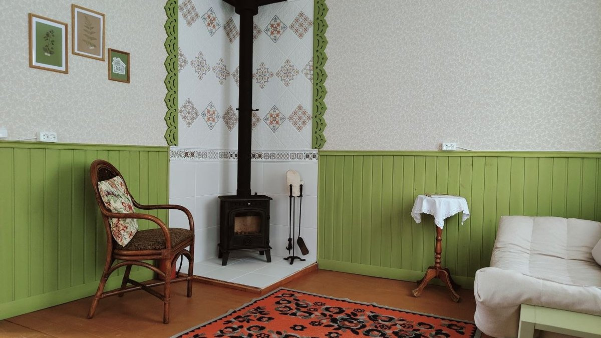
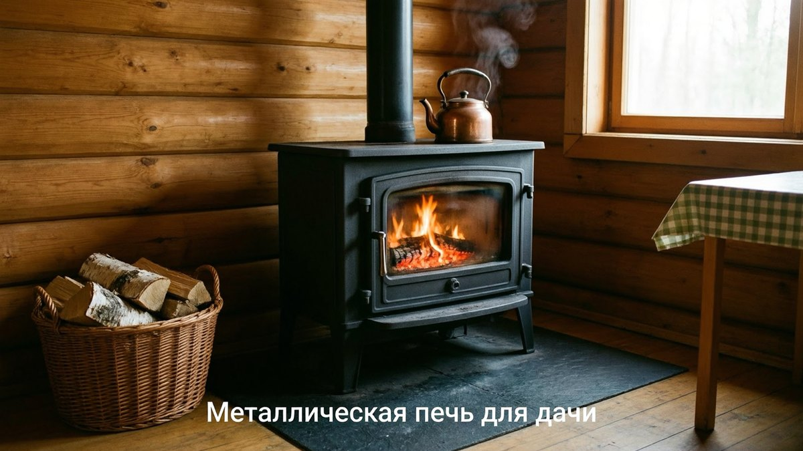
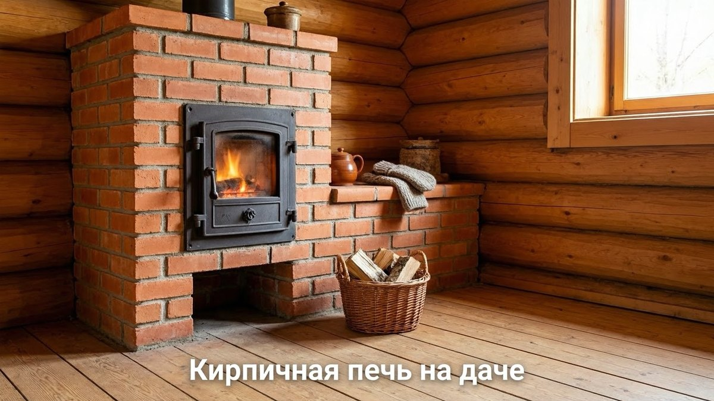
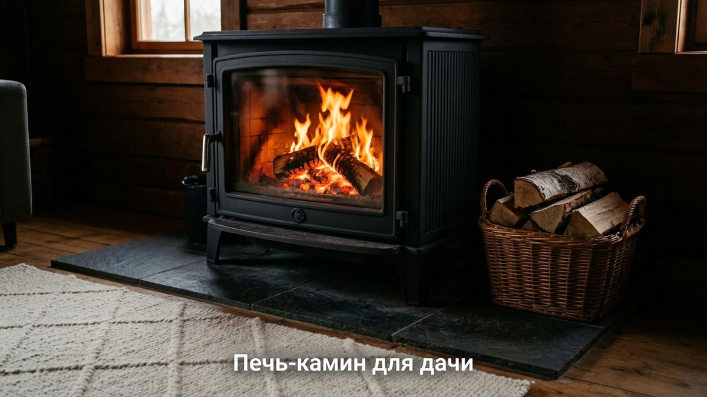
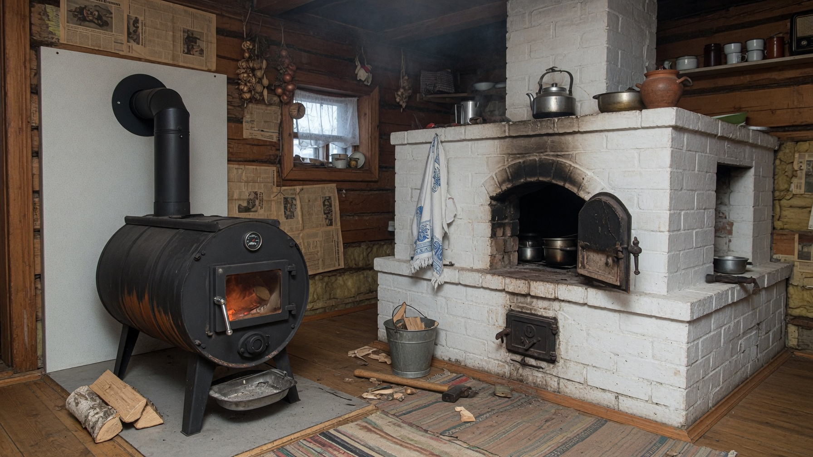
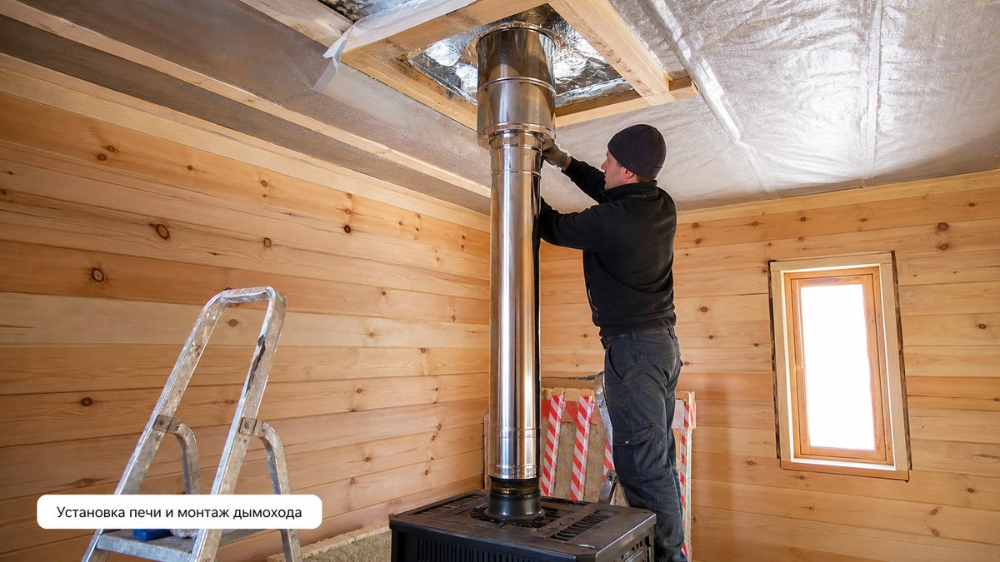
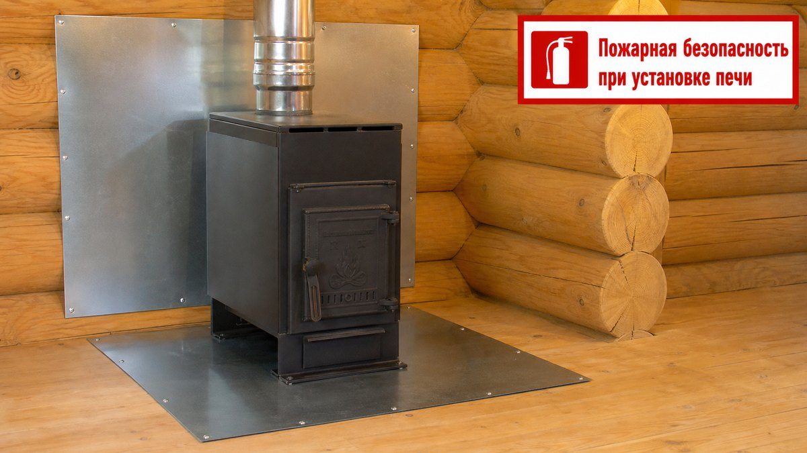

Печь на даче — это и тепло, и уют, и независимость от электричества, а часто ещё и возможность приготовить еду. С хорошей печью на даче комфортно и прохладным летним вечером, и в межсезонье, и даже зимой. Но выбор печей велик: металлические и кирпичные, простые буржуйки и красивые печи-камины. Чтобы не ошибиться, нужно учесть площадь дома, режим проживания и бюджет. В этой статье разберём, какую печь выбрать для дачи, чем отличаются разные виды, как установить печь с дымоходом и обеспечить пожарную безопасность.

## 🔥 Зачем нужна печь на даче

Печь решает сразу несколько задач:

- **Отопление** — согревает дом в холода без привязки к электричеству и газу.
- **Независимость** — работает на дровах, которые всегда доступны.
- **Уют** — живой огонь создаёт особую атмосферу.
- **Готовка** — многие печи оснащены варочной панелью и духовкой.

Особенно печь выручает там, где нет газа и случаются перебои с электричеством, — то есть на большинстве дач.

## 🧩 Виды печей для дачи

Печи различаются по материалу и назначению — у каждой свои плюсы.

### Металлическая дровяная печь

Самый популярный для дачи вариант: буржуйки, конвекционные печи (типа булерьяна), печи с варочной панелью. Они **быстро нагревают** помещение, недорого стоят и легко устанавливаются. Минус — так же быстро остывают, когда прогорают дрова. Идеальны для дач, куда приезжают на выходные и нужно быстро прогреть дом. Конвекционные модели вроде булерьяна экономичнее обычной буржуйки: они дольше держат тепло и расходуют меньше дров за счёт особой конструкции с воздушными каналами.

### Кирпичная печь

Классическая теплоёмкая печь: долго нагревается, но и долго — часами — отдаёт тепло. Она подходит для **постоянного или длительного проживания**. Минусы — высокая цена, необходимость отдельного фундамента и работы опытного печника. Зато такая печь создаёт мягкое, комфортное тепло и не пересушивает воздух, а при желании её оснащают лежанкой, варочной плитой и духовкой.

### Печь-камин

Чугунная или стальная печь с дверцей-стеклом сочетает обогрев и эстетику камина: и греет, и радует видом живого огня. Отличный выбор, если важна не только функция, но и уют в интерьере. Через стеклянную дверцу видно живой огонь, а по эффективности такая печь заметно превосходит открытый камин, который больше греет улицу, чем дом.

### Электрические и газовые обогреватели

Если на даче стабильное электричество или подведён газ, для отопления используют электрические конвекторы, обогреватели или газовые котлы. Они удобны и не требуют дров, но зависят от коммуникаций.

## 📊 Как выбрать печь

Подбирая печь, ориентируйтесь на несколько факторов:

- **Площадь и объём дома** — мощность печи подбирают под размер отапливаемых помещений, с запасом.
- **Режим проживания** — для наездов на выходные лучше быстрая металлическая печь, для постоянного проживания — теплоёмкая кирпичная или котёл.
- **Топливо** — дрова, уголь, электричество или газ в зависимости от доступности. Дрова — самый распространённый и автономный вариант для дачи, не зависящий от коммуникаций.
- **Нужна ли готовка** — если да, выбирают печь с варочной панелью или духовкой.
- **Бюджет** — металлическая печь дешевле, кирпичная дороже из-за материалов и работы печника.

Утеплённому дому нужна печь меньшей мощности, поэтому отопление удобно планировать вместе с [утеплением дачного дома](https://mir-doma.pro/kak-uteplit-dachnyy-dom/) — так тепло не будет уходить впустую.

## ⚖️ Сравнение печей: что выбрать

Чтобы не сравнивать типы по описаниям, сведём главное в таблицу:

| Печь | Скорость нагрева | Держит тепло | Площадь обогрева | Цена | Монтаж |
|---|---|---|---|---|---|
| **Буржуйка** | 15–30 мин | 2–4 часа | до 30 м² | Самая низкая | Своими руками |
| **Конвекционная (булерьян)** | 20–30 мин | 6–10 часов | 40–100 м² | Средняя | Своими руками |
| **Чугунная печь** | 30–40 мин | 5–8 часов | 40–80 м² | Выше средней | Своими руками |
| **Печь-камин** | 30–40 мин | 4–8 часов | 40–80 м² | Выше средней | Своими руками |
| **Кирпичная печь** | 1,5–3 часа | 12–24 часа | 40–100 м² | Самая высокая | Только печник |

Логика простая: **чем быстрее печь нагревается, тем быстрее остывает.** Металл отдаёт тепло сразу, но и остывает вместе с прогоранием дров. Кирпич часами набирает тепло, зато потом греет всю ночь без подкладывания.

**Что из этого следует для выбора:**

- **Приезжаете на выходные** → буржуйка или конвекционная печь: пришли, растопили, через полчаса тепло.
- **Живёте неделями или постоянно** → кирпичная: одна протопка держит тепло сутки, не нужно вставать ночью.
- **Хотите и тепло, и живой огонь** → печь-камин.
- **Большой дом, нужна автономность** → конвекционная печь типа булерьяна: греет большую площадь и экономит дрова.
- **Нужна готовка** → печь с варочной панелью (есть и у металлических, и у кирпичных).

## 📐 Какой мощности нужна печь

Мощность подбирают по объёму отапливаемого помещения. Базовый ориентир:

> **1 кВт мощности на 10 м² площади** при потолках до 3 м — то же правило, что и для другого отопления.

Дому 50 м² нужна печь примерно на 5 кВт, 80 м² — на 8 кВт. Поправки те же: плохо утеплённый дом требует в полтора-два раза больше, северный регион — на треть больше.

Важный нюанс, специфичный именно для печей: **печь греет неравномерно**. Комната, где она стоит, будет заметно теплее дальних. Поэтому при выборе смотрят не только на площадь, но и на планировку: если дом разделён на несколько закрытых комнат, одна печь их не прогреет — нужна либо разводка тёплого воздуха, либо дополнительные обогреватели в дальних помещениях.

Брать печь «с большим запасом» тоже плохо: избыточную печь топят вполсилы, а это ведёт к неполному сгоранию дров, саже в дымоходе и конденсату.

## 💰 Сколько стоит печь для дачи

Как и с утеплением, цена самой печи — лишь часть расходов. Полный бюджет складывается из четырёх частей:

1. **Сама печь.** Буржуйка — самый бюджетный вход, конвекционные и чугунные заметно дороже, кирпичная — отдельная история (см. ниже).
2. **Дымоход.** Часто оказывается сопоставим по цене с самой печью, а иногда и дороже её: нужен сэндвич-дымоход нужного диаметра, проходные узлы через перекрытие и кровлю, зонт, крепления.
3. **Основание и защита.** Негорючий лист или плитка под печь, защита стен экраном, разделка в местах прохода.
4. **Монтаж.** Металлическую печь реально поставить самому, кирпичную — только печник, и его работа обычно **стоит дороже материалов**.

**Отдельно про кирпичную печь.** Она дороже металлической в разы, и не только из-за кирпича: нужен **отдельный фундамент** (обычная печь весит больше тонны, на дощатый пол её не поставить) и работа опытного печника. Заказывать её имеет смысл на этапе строительства дома — встроить в готовый дом сложнее и дороже.

**Где экономят разумно:** берут металлическую печь и ставят её сами, выбирают простую модель без стекла и изысков. **Где экономить нельзя:** на дымоходе и противопожарной разделке — это прямой риск пожара, а не статья бюджета.

Конкретные цены сильно зависят от региона и модели и быстро меняются, поэтому ориентируйтесь на соотношение: **закладывайте на дымоход и обвязку примерно столько же, сколько на саму печь**.

## 🛠️ Установка печи и дымоход

Правильный монтаж — залог безопасной и эффективной работы печи:

- **Основание.** Печь ставят на негорючее основание: металлический лист, плитку или кирпичную площадку. Кирпичной печи нужен отдельный фундамент.
- **Размещение.** Печь располагают так, чтобы она равномерно прогревала помещение, с безопасными расстояниями до стен и мебели. Часто печь ставят так, чтобы одна печь обогревала сразу несколько комнат — например, у стены между ними.
- **Дымоход.** Это важнейший элемент: он должен обеспечивать хорошую тягу и выводиться выше конька крыши. Места прохода дымохода через стены, перекрытия и крышу оборудуют противопожарной разделкой. Через кровлю дымоход выводят с соблюдением герметичности — принципы прохода через крышу схожи с монтажом [кровли из профнастила](https://mir-doma.pro/krysha-iz-profnastila-svoimi-rukami/).

Хорошая тяга — залог того, что дым уходит в трубу, а не в помещение, поэтому дымоходу уделяют особое внимание.

## 🛡️ Пожарная безопасность

Печь — источник открытого огня, и безопасность здесь на первом месте:

- **Негорючий пол** под печью и предтопочный лист перед дверцей защищают от выпавших углей.
- **Защита стен** — экран из металла или кирпичная кладка, если печь стоит близко к стене.
- **Противопожарные разделки и отступки** в местах прохода дымохода через конструкции обязательны.
- **Искрогаситель** на трубе предотвращает вылет искр на крышу.
- **Регулярная чистка дымохода** от сажи — скопившаяся сажа может воспламениться.
- **Не оставляйте топящуюся печь без присмотра** и следите за исправностью дымохода — неисправная тяга грозит отравлением угарным газом.

Соблюдение этих правил делает печь безопасной. Угарный газ не имеет запаха, поэтому исправный дымоход и вентиляция — вопрос жизни, а не только комфорта.

Те же принципы отступов и разделки дымохода действуют и для печи-каменки в
бане, хотя устройство самой печи там другое — подробнее в статье [как
построить баню на даче](https://mir-doma.pro/kak-postroit-banyu-na-dache/).

## 🔧 Уход за печью

Чтобы печь служила долго и безопасно, за ней ухаживают:

- регулярно чистят дымоход от сажи (обычно перед сезоном и по мере необходимости);
- вовремя убирают золу из зольника;
- проверяют тягу и герметичность дымохода;
- используют сухие дрова — они дают больше тепла и меньше сажи;
- не топят печь бытовым мусором и пластиком — это вредит дымоходу и здоровью.

## 🛡️ Частые ошибки

- **Печь не по площади.** Слабая печь не прогреет дом, слишком мощная — перетопит. Мощность подбирают под объём помещений.
- **Горючее основание и стены рядом.** Причина пожаров. Нужны негорючий пол и защита стен.
- **Плохой дымоход и тяга.** Дым идёт в дом, есть риск отравления угарным газом. Дымоходу уделяют максимум внимания.
- **Не чистят дымоход.** Сажа накапливается и может загореться. Чистят регулярно.
- **Нет противопожарной разделки.** В местах прохода трубы через перекрытия и крышу разделка обязательна.

## ❓ Частые вопросы

### Какую печь выбрать для дачи?

Для дачи, куда приезжают на выходные, лучше металлическая дровяная печь — она быстро нагревает дом. Для постоянного проживания подойдёт теплоёмкая кирпичная печь или котёл, которые долго держат тепло. Если важен уют, выбирают печь-камин с дверцей-стеклом. Выбор зависит от площади дома, режима проживания и бюджета.

### Какая печь быстрее греет — металлическая или кирпичная?

Металлическая печь нагревается и отдаёт тепло гораздо быстрее кирпичной, но так же быстро остывает после прогорания дров. Кирпичная печь долго прогревается, зато потом много часов держит тепло. Поэтому металлическая удобна для коротких визитов, а кирпичная — для длительного проживания.

### Сколько стоит печь для дачи?

Цена самой печи — лишь часть бюджета. К ней добавляются дымоход (нередко сопоставим по стоимости с печью), негорючее основание и защита стен, а также монтаж. Металлическую печь можно поставить самому, кирпичную кладёт печник, и его работа обычно дороже материалов. Практический ориентир: закладывайте на дымоход и обвязку примерно столько же, сколько на саму печь.

### Как рассчитать мощность печи для дачи?

Базовый ориентир — 1 кВт на 10 м² площади при потолках до 3 м: дому 50 м² нужна печь около 5 кВт. Плохо утеплённый дом требует в полтора-два раза больше, северный регион — на треть. Учтите и планировку: печь греет неравномерно, и в закрытые дальние комнаты тепло само не дойдёт.

### Нужен ли фундамент под печь?

Тяжёлой кирпичной печи нужен отдельный фундамент, так как она много весит. Лёгкой металлической печи достаточно негорючего основания — металлического листа, плитки или кирпичной площадки на прочном полу. Это указывают в требованиях к конкретной модели.

### Как обеспечить пожарную безопасность печи?

Установите печь на негорючее основание, положите предтопочный лист, защитите близкие стены экраном или кирпичом, сделайте противопожарные разделки в местах прохода дымохода и поставьте искрогаситель. Регулярно чистите дымоход от сажи и не оставляйте топящуюся печь без присмотра.

### Можно ли готовить на дачной печи?

Да, многие печи для дачи оснащены варочной панелью, а некоторые — и духовкой. На такой печи удобно готовить, кипятить воду и подогревать еду, что особенно ценно при отключении электричества. Если готовка важна, выбирайте модель с варочной поверхностью.

### Как часто чистить дымоход печи?

Дымоход чистят от сажи как минимум раз в сезон, перед началом отопительного периода, а при активной топке — чаще. Скопившаяся сажа ухудшает тягу и может загореться, поэтому за состоянием дымохода следят регулярно, а от сырых дров, дающих много сажи, отказываются.

### Почему печь дымит в помещение?

Чаще всего из-за плохой тяги: засорённого или неправильно смонтированного дымохода, недостаточной его высоты, сырых дров или отсутствия притока воздуха. Дымящая печь опасна отравлением угарным газом, поэтому причину устраняют сразу: проверяют и чистят дымоход, обеспечивают тягу и приток воздуха.

## Заключение

Выбор печи сводится к одному вопросу: как часто вы бываете на даче. Приезжаете на выходные — берите металлическую, она даст тепло через полчаса. Живёте подолгу — кирпичная окупится тем, что греет сутки с одной протопки. И помните про бюджет целиком: дымоход и обвязка стоят примерно столько же, сколько сама печь, а экономить на них нельзя.

**Куда идти дальше:**

- Печь греет неравномерно, и в неутеплённом доме тепло уходит быстрее, чем прогорают дрова. Начните с теплового контура — [утепление дачного дома](https://mir-doma.pro/kak-uteplit-dachnyy-dom/) снижает нужную мощность печи в полтора-два раза.
- Хотите прогреть весь дом радиаторами, а не одну комнату, — это уже задача для [котла с системой водяного отопления](https://mir-doma.pro/kotel-dlya-dachi/).
- Нужно тепло в дальних комнатах, куда печь не достаёт, — их проще догреть [электрообогревателями](https://mir-doma.pro/elektricheskoe-otoplenie-dachi/) или [тёплым полом](https://mir-doma.pro/teplyy-pol-na-dache/).

А какая печь топится на вашей даче? Делитесь опытом в комментариях и подписывайтесь, чтобы не пропустить новые статьи об отоплении и обустройстве дома.
