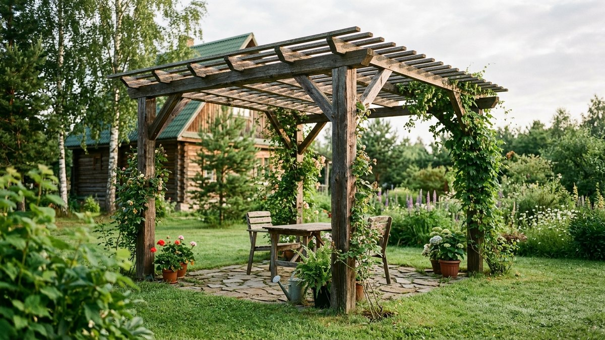
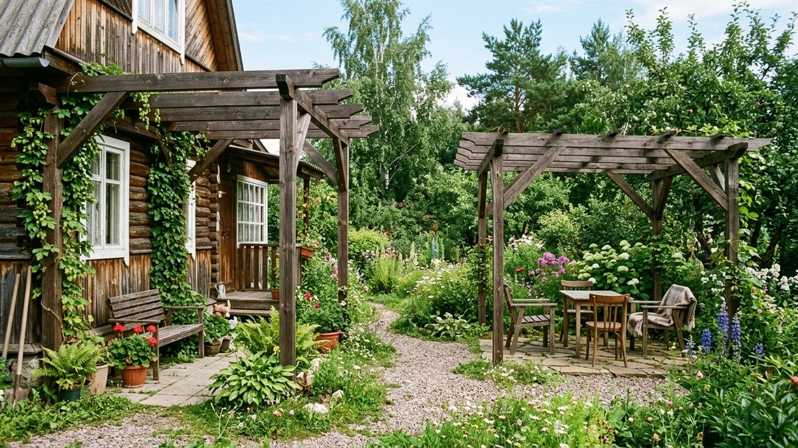
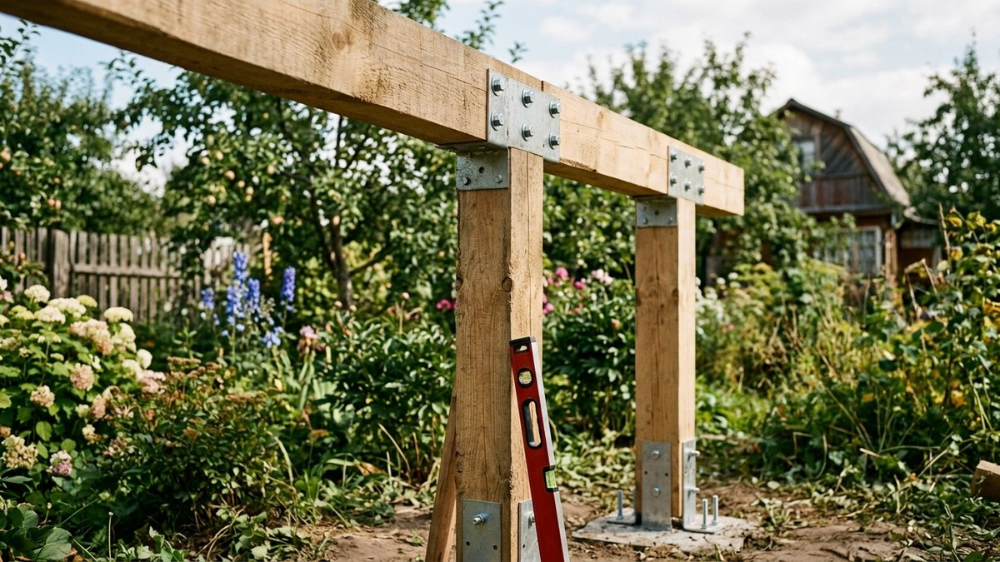
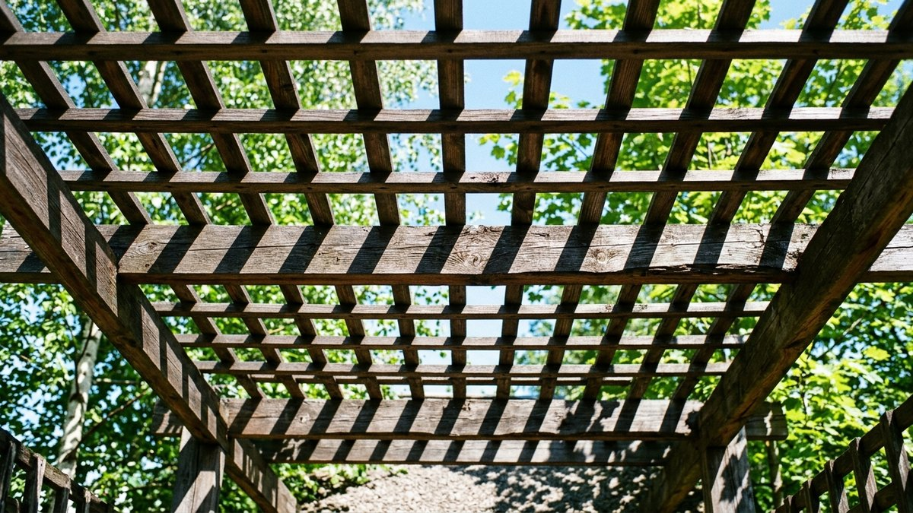
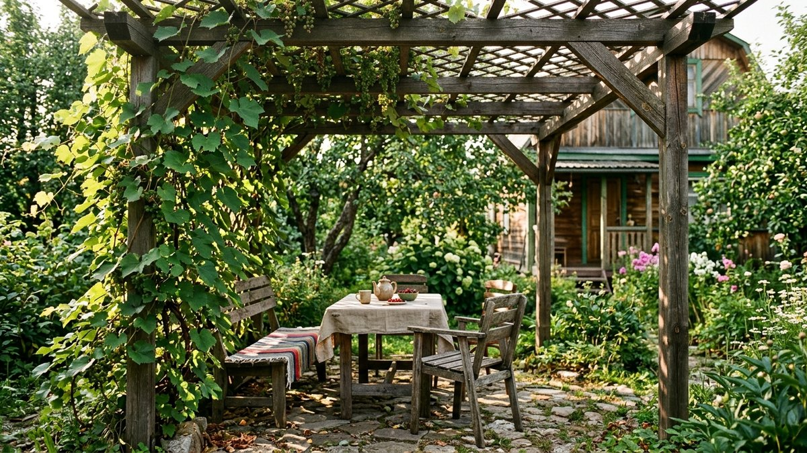
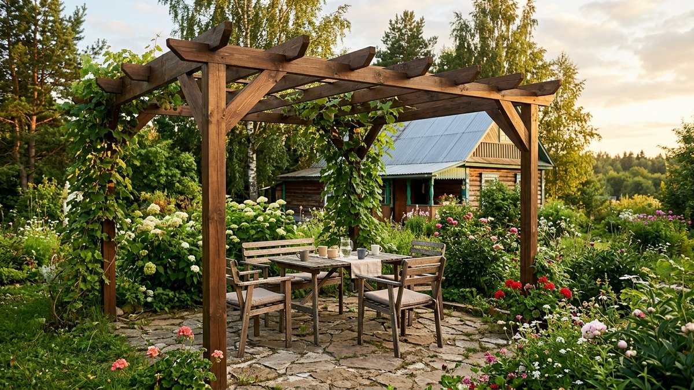

Пергола — это лёгкий каркас из вертикальных опор и решётчатого верха, который
даёт узорную тень и служит опорой для вьющихся растений. В отличие от беседки
у неё нет стен и сплошной крыши, поэтому пергола обходится в разы дешевле и
собирается своими руками за один-два выходных. В статье — виды пергол,
расчёт размеров и пошаговая сборка каркаса.

*Пергола на дачном участке*

## Чем пергола отличается от беседки

Беседка — это отдельная постройка со стенами или сплошной обрешёткой и
крышей, которая защищает от дождя. Пергола — открытый каркас без стен: она
создаёт полутень и оплетается растениями, но от дождя не спасает. Если нужна
именно защищённая от осадков зона отдыха, стоит присмотреться к [беседке
своими руками](https://mir-doma.pro/besedka-svoimi-rukami/) — там разобраны
чертежи закрытых конструкций. Пергола же чаще ставится над зоной отдыха,
дорожкой или патио как декоративный элемент, а не полноценное укрытие.

## Виды перголы

- **Пристенная** — одной стороной крепится к стене дома или веранды, вторая
  опирается на столбы. Экономит материал и хорошо смотрится как продолжение
  фасада.
- **Отдельно стоящая** — четыре и более опор, ставится как самостоятельный
  элемент над зоной отдыха или столом.
- **Тоннельная (арочная)** — серия одинаковых секций вдоль дорожки, под
  ней высаживают вьющиеся растения так, чтобы со временем получился зелёный
  тоннель.
- **Козырёк над входом** — компактная форма для входной группы или крыльца.

*Пристенная и отдельно стоящая пергола*

## Материалы и расчёт размеров

Для дачной перголы чаще берут брус 100×100 мм для опор и доску 40×100 мм для
поперечных балок верха — металл и профильная труба используются реже, но
служат дольше и не требуют пропитки антисептиком.

Высоту опор делают не меньше 2,2–2,4 м, чтобы под перголой было комфортно
стоять и проходить. Шаг между опорами — 2–2,5 м: реже ставить не стоит, иначе
верхние балки провиснут под весом вьющихся растений и снега. Размер под
конкретную зону отсчитывают от площадки, которую нужно накрыть — стол со
скамейками, патио или дорожку — и добавляют по 30–40 см с каждой стороны.

## Инструменты

Шуруповёрт или дрель, ножовка или циркулярная пила, уровень, рулетка, бур или
лопата под столбы, струбцины для фиксации балок при сборке.

## Пошаговая сборка

1. **Разметьте расположение опор** колышками и шнуром, проверьте диагонали
   прямоугольника — они должны быть равны, иначе конструкция перекосится.
2. **Установите опоры.** Ямы под столбы копают на глубину 60–80 см, на дно
   насыпают щебень для дренажа, столб выставляют по уровню и бетонируют.
   Дайте бетону схватиться минимум 3–5 дней.
3. **Соедините опоры продольными балками** (прогонами) по верху — их крепят
   к столбам металлическими уголками и болтами, не гвоздями: конструкция
   держит вес растений и должна выдерживать ветровую нагрузку.

*Установка опор и монтаж продольных балок перголы*

4. **Уложите поперечные балки решётки** сверху с шагом 20–40 см — чем чаще
   шаг, тем плотнее тень. Крепят их врубкой или металлическими крепежами
   сверху продольных балок.
5. **Обработайте древесину антисептиком** и покрасьте или покройте лаком —
   до монтажа это делать проще, чем после сборки.

*Решётчатый верх перголы*

## Что посадить рядом с перголой

Перголу задумывают именно как опору для вьющихся растений: девичий виноград
и хмель быстро дают плотную зелёную крышу, клематис и плетистая роза —
декоративное цветение, виноград — ещё и урожай в придачу. Растения высаживают
у основания опор и по мере роста подвязывают к решётке верха.

*Пергола, оплетённая девичьим виноградом*

## Частые ошибки

- **Опоры без бетонирования** — лёгкая на вид пергола парусит на ветру не
  меньше забора, и вкопанные без бетона столбы со временем расшатываются.
- **Слишком большой шаг между опорами** — верхние балки провисают под весом
  разросшихся растений и мокрого снега зимой.
- **Крепление гвоздями вместо болтов и уголков** — на ветровой нагрузке
  гвозди со временем расшатываются, и решётка начинает скрипеть и шататься.
- **Древесина без антисептика** — на открытом воздухе необработанный брус
  темнеет и трескается уже за один сезон.

*Готовая пергола на дачном участке*

## Частые вопросы

### Пергола или беседка — что лучше для дачи

Зависит от задачи: беседка со стенами и крышей защищает от дождя и подходит
для застолий в любую погоду, пергола дешевле, легче и лучше вписывается в
ландшафт как декоративный элемент с зеленью. Многие ставят и то, и другое —
беседку для посиделок, перголу над дорожкой или патио.

### Из чего лучше сделать перголу — дерево или металл

Дерево дешевле, проще в обработке своими руками и выглядит уютнее, но требует
антисептика и периодического ухода. Металлический каркас служит дольше и не
боится влаги, но сборка сложнее без сварки, а конструкция выглядит более
строго.

### Нужен ли фундамент под перголу

Полноценный фундамент не нужен — достаточно точечного бетонирования опор на
глубину 60–80 см. Лёгкие переносные перголы иногда ставят на бетонные блоки
без заглубления, но такая конструкция менее устойчива к ветру.

### Как закрепить перголу к дому

Пристенную перголу крепят к стене металлическим кронштейном или несущей
балкой на анкерных болтах — важно попасть в прочный участок стены (в брус,
кирпич или бетон), а не в облицовку.

### Какого размера делать перголу для дачи

Ориентируйтесь на площадку, которую нужно накрыть: под стол со скамейками
обычно достаточно 3×3–3×4 м, над дорожкой ширину делают по ширине самой
дорожки плюс 40–60 см с каждой стороны.

### Чем покрыть перголу от дождя

Классическая пергола не рассчитана на защиту от дождя — это решётчатая
конструкция для полутени. Если нужна защита от осадков, поверх решётки
натягивают тканевый тент или поликарбонат, но тогда конструкция по сути
превращается в навес и требует более прочного каркаса.
