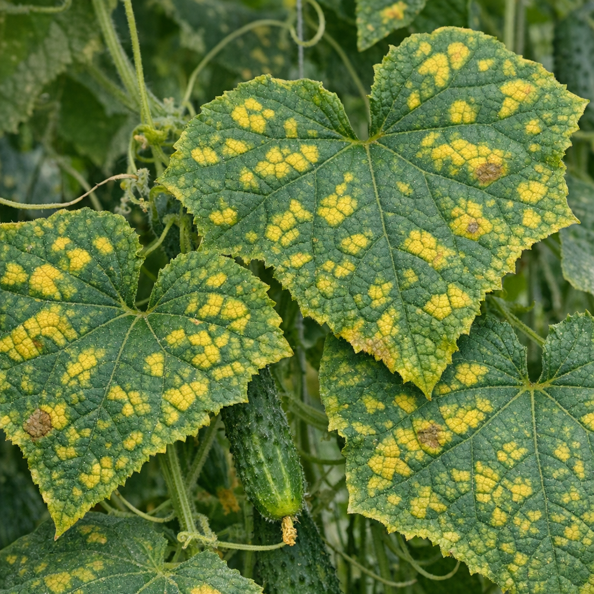
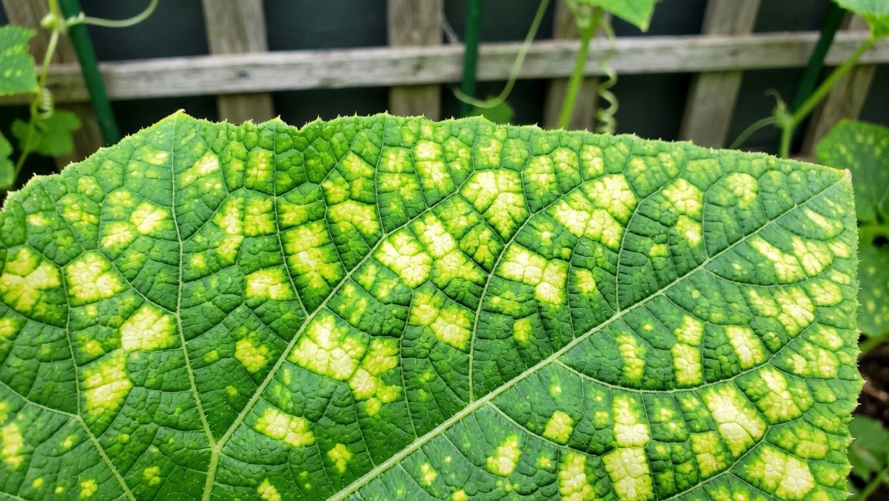
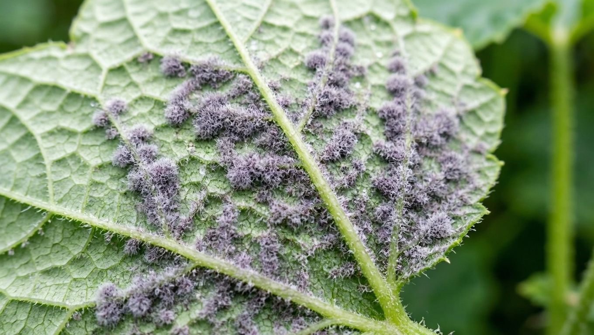
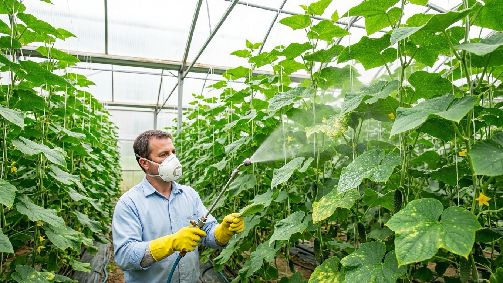
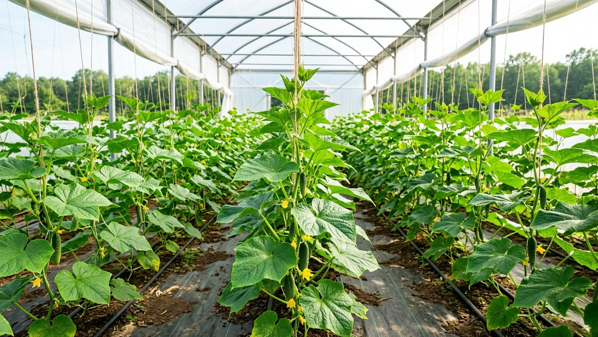
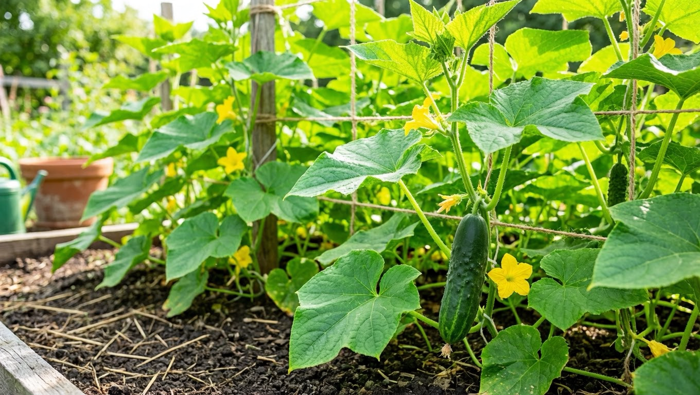

Пероноспороз, или ложная мучнистая роса, — одна из самых опасных болезней огурцов: за считаные дни она способна погубить, казалось бы, здоровые посадки. На листьях появляются жёлтые пятна, снизу — серый налёт, и вскоре растение остаётся без листвы. Многие путают эту болезнь с настоящей мучнистой росой и лечат не тем, теряя время. В этой статье разберём, как распознать пероноспороз огурцов, чем он отличается от мучнистой росы, чем его лечить и как не допустить.

## 🍃 Что такое пероноспороз

Пероноспороз — грибковое заболевание, поражающее листья огурцов (а также других тыквенных). Его называют ложной мучнистой росой. Болезнь развивается очень быстро, особенно в прохладную влажную погоду, и за несколько дней способна оставить кусты без листьев, а значит, и без урожая — ведь без здоровой листвы огурцы не наливаются.

Опасность пероноспороза именно в скорости: промедление с лечением часто стоит всего урожая, поэтому важно распознать болезнь при первых признаках. Возбудитель сохраняется в растительных остатках и почве и при благоприятных условиях мгновенно активизируется, заражая соседние растения.

## 🔍 Признаки пероноспороза

Распознать ложную мучнистую росу помогают характерные симптомы:

- **Жёлтые угловатые пятна** на верхней стороне листьев, ограниченные жилками, — лист выглядит будто в мозаичной «сетке».
- **Серо-фиолетовый или серый налёт** на нижней стороне листа под пятнами, особенно заметный во влажную погоду и по утрам.

- **Пятна буреют и сливаются**, лист засыхает, скручивается и крошится.
- **Оголение куста** — вскоре от листьев остаются только черешки. Важно не спутать начало болезни с другими причинами, по которым [желтеют листья у огурцов](https://mir-doma.pro/zhelteyut-listya-u-ogurtsov/).

Осматривать нужно и нижнюю сторону листьев — именно там виден характерный налёт. Болезнь обычно начинается с нижних, более старых листьев и быстро поднимается вверх по кусту, поэтому первые жёлтые пятна у основания растения — тревожный сигнал.

## 🆚 Чем пероноспороз отличается от мучнистой росы

Это две разные болезни, и путать их нельзя, потому что и лечат их по-разному:

- **Настоящая [мучнистая роса](https://mir-doma.pro/muchnistaya-rosa-na-ogurtsah/)** — белый мучнистый налёт (как рассыпанная мука) на верхней стороне листьев.
- **Ложная мучнистая роса (пероноспороз)** — жёлтые пятна на верхней стороне и серый налёт на нижней.

Проще говоря: белый налёт сверху — настоящая мучнистая роса, жёлтые пятна с серым налётом снизу — ложная. От правильного определения зависит выбор средств: препараты и приёмы против этих двух болезней различаются, и лечение «наугад» лишь теряет драгоценное время.

## 🌡️ Причины пероноспороза

Болезнь провоцируют сырость и прохлада:

- **высокая влажность** — роса, туманы, затяжные дожди, конденсат в теплице;
- **полив холодной водой дождеванием**, особенно на ночь;
- **резкие перепады температур** день–ночь;
- **загущённые посадки** и плохое проветривание;
- **занос спор** ветром, водой, с растительными остатками.

По сути, чем прохладнее и сырее, тем выше риск, поэтому пероноспороз часто вспыхивает во второй половине лета с росами и похолоданием. Ослабленные болезнью растения заодно становятся лёгкой добычей для вредителей — [паутинного клеща](https://mir-doma.pro/pautinnyy-kleshch-na-ogurtsah/) и [белокрылки](https://mir-doma.pro/belokrylka-v-teplitse/).

## 🛡️ Лечение пероноспороза

При первых признаках действуют быстро и комплексно:

1. **Уберите поражённые листья** и уничтожьте их, чтобы болезнь не распространялась.
2. **Снизьте влажность.** Прекратите полив на несколько дней, активно проветривайте теплицу, чтобы подсушить растения.
3. **Обработайте фунгицидами.** При слабом поражении применяют биопрепараты, при сильном — химические фунгициды, в том числе медьсодержащие. Обрабатывают обязательно и нижнюю сторону листьев.
4. **Повторяйте обработки** с интервалом по инструкции — за один раз болезнь не остановить.

Народные средства (молочная сыворотка, зольный настой) при ложной мучнистой росе малоэффективны как лечение и годятся скорее для профилактики. Химические препараты применяют строго по инструкции, соблюдая срок ожидания до сбора плодов. Обработки эффективнее проводить в сухую погоду и в первой половине дня, чтобы препарат успел подсохнуть на листьях, а не смылся росой.

## 🌿 Профилактика

Предупредить пероноспороз куда проще, чем вылечить:

- выбирайте **устойчивые к болезни гибриды** огурцов;
- **проветривайте теплицу**, не допуская высокой влажности и конденсата;
- **поливайте тёплой водой под корень утром**, а не дождеванием и не на ночь;
- **не загущайте посадки** — так они лучше просыхают и проветриваются;
- соблюдайте **севооборот** и убирайте растительные остатки, где сохраняются споры;
- осенью **дезинфицируйте теплицу**, а в сезон проводите профилактические обработки биопрепаратами.

## 🛡️ Частые ошибки

- **Путают с настоящей мучнистой росой.** Из-за этого применяют не те средства. Определяйте болезнь по симптомам.
- **Поливают холодной водой сверху.** Это создаёт идеальные условия для болезни. Поливайте тёплой водой под корень.
- **Не проветривают теплицу.** Сырость и конденсат ускоряют развитие пероноспороза. Проветривайте регулярно.
- **Запаздывают с лечением.** Болезнь развивается за дни, поэтому медлить нельзя. Действуйте при первых пятнах.
- **Оставляют поражённые листья и остатки.** Они разносят инфекцию. Убирайте и уничтожайте их.

## ❓ Частые вопросы

### Как отличить пероноспороз от мучнистой росы на огурцах?

При настоящей мучнистой росе на верхней стороне листьев появляется белый мучнистый налёт, похожий на рассыпанную муку. При пероноспорозе (ложной мучнистой росе) сверху видны жёлтые угловатые пятна, а снизу под ними — серый налёт. Белый налёт сверху — настоящая, жёлтые пятна с серым налётом снизу — ложная мучнистая роса.

### Чем лечить пероноспороз огурцов?

При первых признаках убирают поражённые листья, снижают влажность и проветривают теплицу, а затем обрабатывают растения фунгицидами: биопрепаратами при слабом поражении и химическими, в том числе медьсодержащими, при сильном. Обрабатывают и нижнюю сторону листьев, повторяя процедуры по инструкции.

### Почему появляется ложная мучнистая роса на огурцах?

Главные причины — высокая влажность и прохлада: роса, туманы, дожди, конденсат в теплице, полив холодной водой дождеванием, резкие перепады температур и загущённые посадки. В таких условиях споры быстро прорастают и заражают листья, поэтому болезнь часто вспыхивает во второй половине лета.

### Как быстро развивается пероноспороз?

Очень быстро: при благоприятных для болезни условиях (сырость и прохлада) поражение способно охватить весь куст за несколько дней, оставив от листьев только черешки. Именно поэтому лечение начинают при первых же пятнах, не дожидаясь массового поражения.

### Помогают ли народные средства от ложной мучнистой росы?

Как самостоятельное лечение народные средства (молочная сыворотка, зольный настой, йодно-молочные растворы) при пероноспорозе малоэффективны — болезнь слишком агрессивна. Их применяют скорее для профилактики и укрепления растений, а при появлении симптомов используют био- и химические фунгициды.

### Можно ли есть огурцы с заболевших растений?

Сами плоды пероноспороз напрямую не поражает, и огурцы с больных кустов употреблять можно, вымыв их. Но если проводились химические обработки, важно выдержать указанный на препарате срок ожидания. Стоит учитывать, что больное растение даёт меньше плодов, и они мельче.

### Как предотвратить пероноспороз огурцов?

Выбирайте устойчивые гибриды, проветривайте теплицу и не допускайте сырости, поливайте тёплой водой под корень по утрам, не загущайте посадки, соблюдайте севооборот, убирайте растительные остатки и дезинфицируйте теплицу осенью. Профилактические обработки биопрепаратами дополнительно снижают риск.

### Передаётся ли пероноспороз другим растениям?

Пероноспороз огурцов поражает тыквенные культуры — кабачки, тыкву, дыню, арбуз, поэтому с больных огурцов болезнь может перейти на них. На растения других семейств (томаты, капусту) этот возбудитель не переходит, но там бывают свои виды ложной мучнистой росы. Больные остатки в любом случае убирают.

## Заключение

Пероноспороз, или ложная мучнистая роса, опасен своей скоростью, но при раннем обнаружении с ним можно справиться. Главное — не спутать его с настоящей мучнистой росой: при пероноспорозе сверху листа жёлтые пятна, а снизу серый налёт. Заметив первые симптомы, уберите поражённые листья, снизьте влажность, проветрите теплицу и обработайте растения фунгицидами, не забывая про изнанку листьев. А ещё лучше не допускать болезни вовсе — выбирать устойчивые сорта, поливать тёплой водой под корень и проветривать посадки. Тогда огурцы останутся здоровыми и урожайными. Помните: при пероноспорозе решают часы, а не дни, поэтому регулярный осмотр посадок — лучшая страховка урожая.

А вы сталкивались с ложной мучнистой росой на огурцах? Делитесь опытом в комментариях и подписывайтесь, чтобы не пропустить новые статьи о защите урожая.
