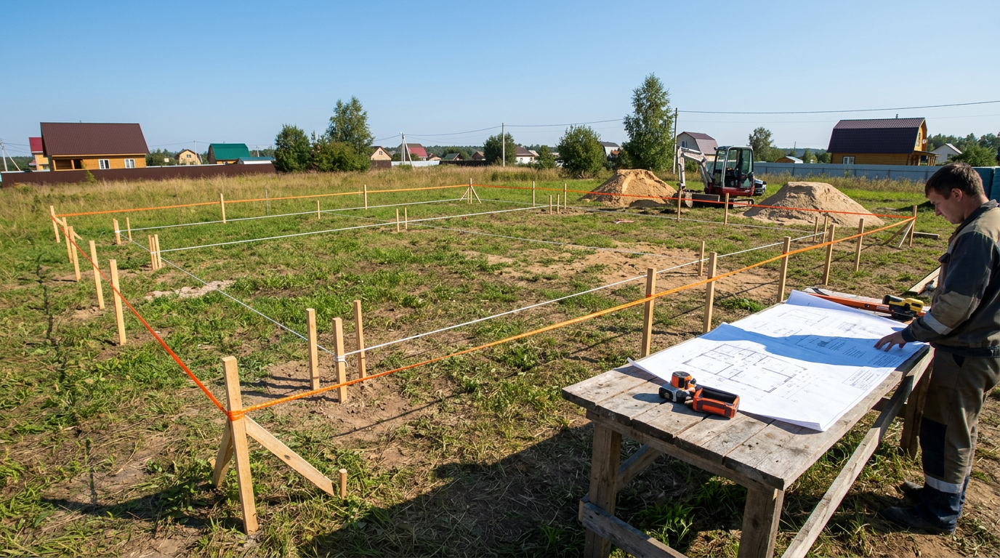
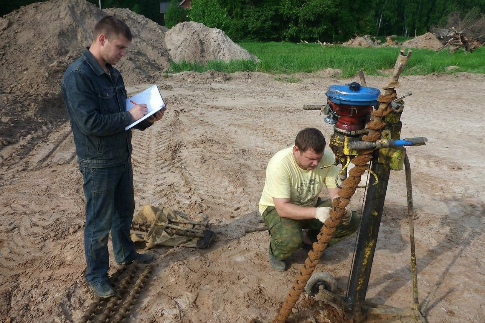
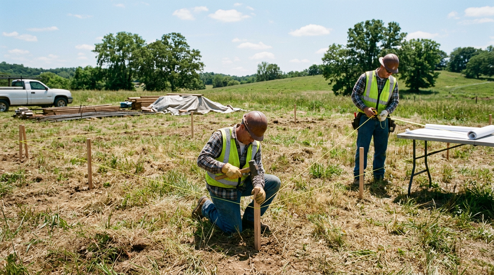
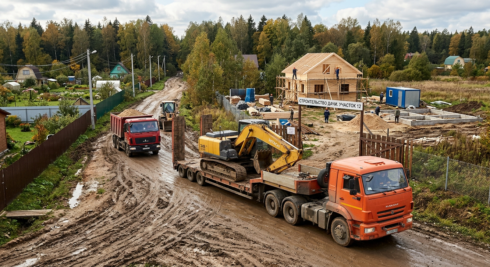
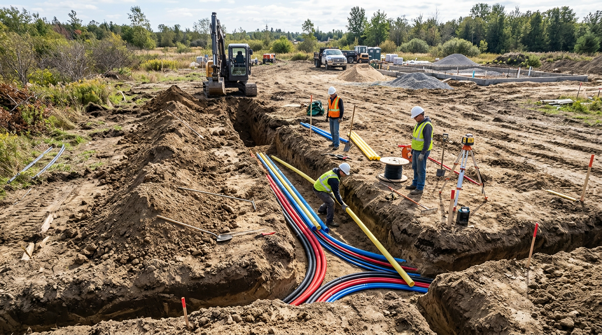
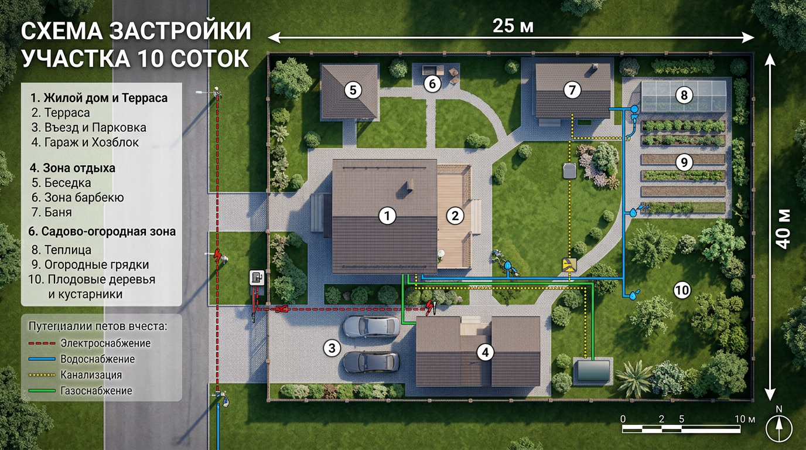

Когда участок куплен под строительство дома, велик соблазн поскорее начать копать котлован. Но именно на этапе планировки закладывается удобство всей будущей жизни на участке: где встанет дом, как к нему подъедет техника, где пройдут коммуникации и останется ли место под баню, гараж и сад. Ошибки планировки потом исправить очень дорого. В этой статье разберём планировку участка 10 соток под строительство дома: как проанализировать участок, где разместить дом, что предусмотреть для стройки и коммуникаций и в каком порядке всё делать.

Это статья из цикла о планировке. Общие принципы зонирования разобраны в основной статье — [планировка участка 10 соток](https://mir-doma.pro/planirovka-uchastka-10-sotok/), а здесь сосредоточимся на этапе подготовки к стройке.

## 📐 С чего начать: анализ участка

Перед планировкой пустой участок нужно внимательно изучить — от его особенностей зависит и расположение дома, и тип фундамента.

- **Грунт и геология.** От типа грунта зависит выбор фундамента. На пучинистых и слабых грунтах нужны особые решения, поэтому грунт стоит исследовать заранее. Простейший способ — выкопать пробные шурфы или заказать геологию: это недорого по сравнению с переделкой треснувшего фундамента.
- **Уровень грунтовых вод.** Высокая вода влияет на возможность подвала, погреба и требует дренажа.
- **Рельеф.** Уклоны и низины определяют расположение дома, отвод воды и необходимость планировки участка.
- **Стороны света.** Дом ориентируют так, чтобы жилые комнаты выходили на солнечную сторону, а участок не оказался в тени.
- **Подъезд и коммуникации.** Сразу оценивают, откуда заедет техника и где точки подключения воды, электричества и канализации.

## 🏠 Где разместить дом

Дом обычно ставят **ближе к въезду и к северной границе** участка — так он не затеняет будущий сад и зону отдыха, а большая часть земли остаётся солнечной. При этом соблюдают отступы: примерно 5 метров от улицы (красной линии) и не менее 3 метров от границ с соседями.

Важно правильно сориентировать дом по сторонам света: жилые комнаты и большие окна выводят на юг и восток — там больше света и тепла, а технические помещения, котельную и кладовые — на северную сторону. Продумайте и вид из окон: приятнее, когда они смотрят в сад, а не на хозблок или забор. Учтите и розу ветров — вход и террасу лучше расположить с подветренной, защищённой стороны, чтобы их не продувало.

## 🚜 Подъезд для техники и стройплощадка

На этапе стройки участок — это рабочая площадка, и это нужно учесть в планировке.

- **Подъезд для техники.** К месту стройки должна свободно заезжать тяжёлая техника — бетономешалка, манипулятор, самосвал. Заранее продумайте проезд с твёрдым основанием, чтобы машины не вязли.
- **Площадка под материалы.** Нужно сухое доступное место для складирования кирпича, блоков, пиломатериалов, не мешающее работам.
- **Бытовка и временные удобства.** На время стройки ставят бытовку, временный туалет, подводят воду и электричество.

Эту «строительную» логистику закладывают так, чтобы она не противоречила будущему благоустройству — например, подъезд к стройке потом станет дорожкой к гаражу.

## 🔌 Коммуникации: продумать заранее

Инженерные сети планируют до благоустройства — перекапывать готовый участок с дорожками и газоном дорого и обидно. Лучше один раз продумать трассы всех сетей на генплане, чем потом вскрывать уже уложенную плитку. Заранее продумывают:

- **Водоснабжение** — скважина, колодец или ввод центральной воды, разводка по участку и к дому.
- **Электричество** — ввод от столба, разводка к дому и будущим постройкам, освещение.
- **Канализацию** — [септик](https://mir-doma.pro/septik-dlya-dachi/) или другую автономную систему, расположенную по санитарным нормам.
- **Газ** (если есть возможность подключения) — ввод и разводку.
- **Дренаж и ливневую канализацию** — особенно на участках с уклоном и высоким уровнем грунтовых вод.

## 🗺️ Зонирование с прицелом на будущее

Даже если сейчас вы строите только дом, планировать стоит сразу весь участок — иначе потом окажется, что для бани, гаража или сада не осталось удобного места. Зарезервируйте зоны:

- **жилую** — дом, въезд, парковка (у улицы);
- **зону отдыха** — будущая беседка, баня, площадка (в глубине);
- **садово-огородную** — сад и грядки (на солнечной стороне);
- **хозяйственную** — сарай, компост (в углу).

Если планируется много построек, полезно сразу прикинуть их расположение — об этом подробно в статье о [планировке участка с баней, гаражом и бассейном](https://mir-doma.pro/planirovka-uchastka-10-sotok-s-baney-garazhom/). А для вытянутых участков — в статье о [планировке узкого участка](https://mir-doma.pro/planirovka-uzkogo-uchastka-10-sotok/).

## 📏 Нормы и отступы при застройке

При строительстве соблюдают нормы, иначе возможны проблемы с оформлением и споры с соседями. Ориентировочно:

- дом — от 5 метров от улицы и не менее 3 метров от соседней границы;
- хозпостройки — около 1 метра от границы;
- между жилыми домами на соседних участках — противопожарные разрывы (зависят от материала стен);
- высокие деревья — 4 метра, кустарники — 1 метр от границы.

Точные значения зависят от действующих норм (СП 53.13330, СанПиН) и местных правил, поэтому их обязательно уточняют до начала стройки.

## 🛠️ Порядок действий

Планировку участка под строительство удобно вести по шагам:

1. **Изучите участок** — грунт, уровень воды, рельеф, стороны света.
2. **Сделайте проект дома и генплан участка** с расположением всех зон и построек.
3. **Разметьте участок** и вынесите оси дома в натуру.
4. **Подведите временные коммуникации** и обустройте стройплощадку с подъездом.
5. **Заложите постоянные коммуникации** там, где это удобно сделать до стройки.
6. **Стройте дом**, а затем поэтапно реализуйте остальные зоны.

## 🛡️ Частые ошибки

- **Дом без учёта сторон света.** Окна на север и тень на весь участок — частая ошибка. Ориентируйте дом по солнцу.
- **Забыли про подъезд техники.** Без удобного проезда стройка встанет или обойдётся дороже.
- **Не предусмотрели коммуникации.** Прокладка сетей по готовому участку — это перекопанное благоустройство.
- **Застроили всё сразу.** Без резерва места не останется для бани, гаража и сада.
- **Проигнорировали грунт и воду.** Это приводит к проблемам с фундаментом и сыростью.
- **Нарушили отступы.** Чревато спорами с соседями и сложностями с документами.

## ❓ Частые вопросы

### С чего начать планировку участка под строительство?

С анализа участка: изучите грунт, уровень грунтовых вод, рельеф и стороны света, оцените подъезд и точки подключения коммуникаций. Затем сделайте проект дома и генплан с расположением всех зон, и только потом приступайте к разметке и стройке.

### Где разместить дом на участке под строительство?

Дом ставят ближе к въезду и северной границе, чтобы он не затенял участок, с отступами около 5 метров от улицы и 3 метров от соседей. Жилые комнаты ориентируют на юг и восток, технические помещения — на север. Точные отступы уточняют по действующим нормам.

### Что предусмотреть для строительной техники?

Заранее продумайте свободный подъезд с твёрдым основанием, по которому проедет тяжёлая техника, и сухую площадку для складирования материалов. На время стройки также понадобятся бытовка, временный туалет, вода и электричество.

### Какие коммуникации планировать до стройки?

Водоснабжение (скважина, колодец или ввод воды), электричество, канализацию (септик), при возможности газ, а также дренаж и ливнёвку. Сети закладывают до благоустройства, иначе потом придётся перекапывать готовый участок.

### Нужно ли исследовать грунт перед стройкой?

Да, это важный шаг: от типа грунта и уровня грунтовых вод зависит выбор фундамента. На слабых и пучинистых грунтах без правильного решения фундамент трескается. Простые пробные шурфы или геологическое исследование обходятся куда дешевле, чем переделка основания дома.

### Нужно ли планировать весь участок, если строю только дом?

Да, обязательно. Даже если сейчас вы строите только дом, генплан составляют на весь участок, резервируя места под баню, гараж, сад и отдых. Иначе позже окажется, что для них не осталось удобного места или они мешают друг другу.

## Заключение

Планировка участка 10 соток под строительство дома начинается задолго до котлована — с анализа грунта, рельефа и сторон света и с продуманного генплана всего участка. Разместите дом у въезда с учётом солнца и норм, предусмотрите подъезд для техники и стройплощадку, заранее заложите коммуникации и зарезервируйте места под будущие постройки. Такой подход избавит от дорогих переделок и сделает участок удобным на годы вперёд. Больше о принципах зонирования — в основной статье о [планировке участка 10 соток](https://mir-doma.pro/planirovka-uchastka-10-sotok/).

А вы планируете стройку на своём участке? Делитесь вопросами и опытом в комментариях и подписывайтесь, чтобы не пропустить новые статьи о планировке и строительстве.
