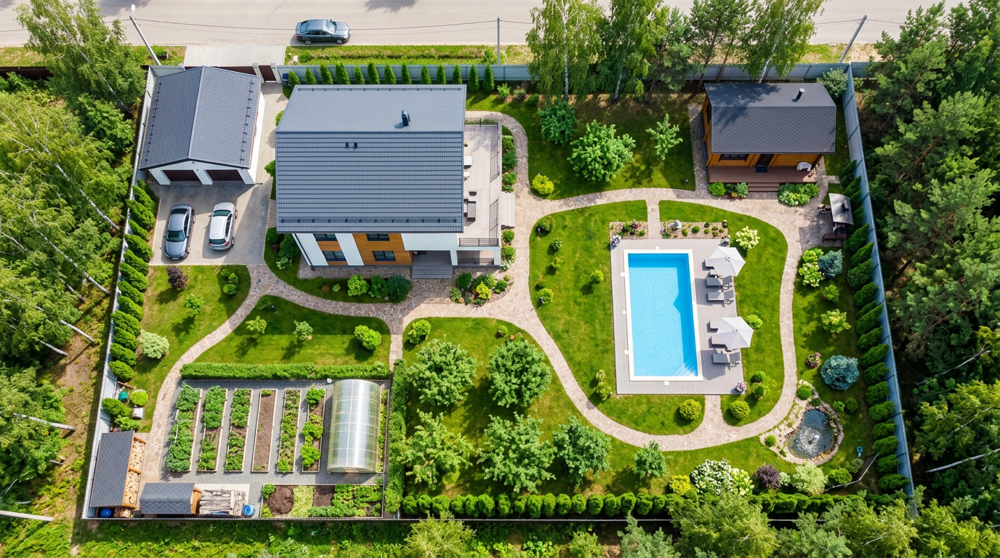
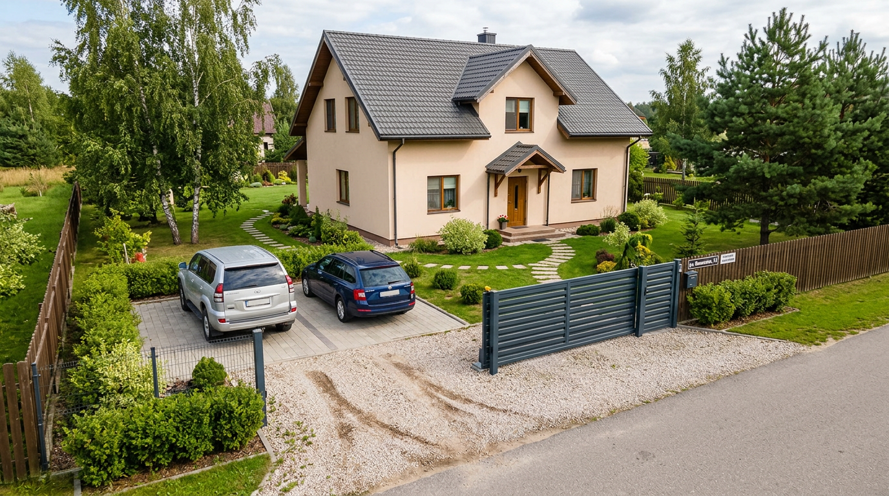
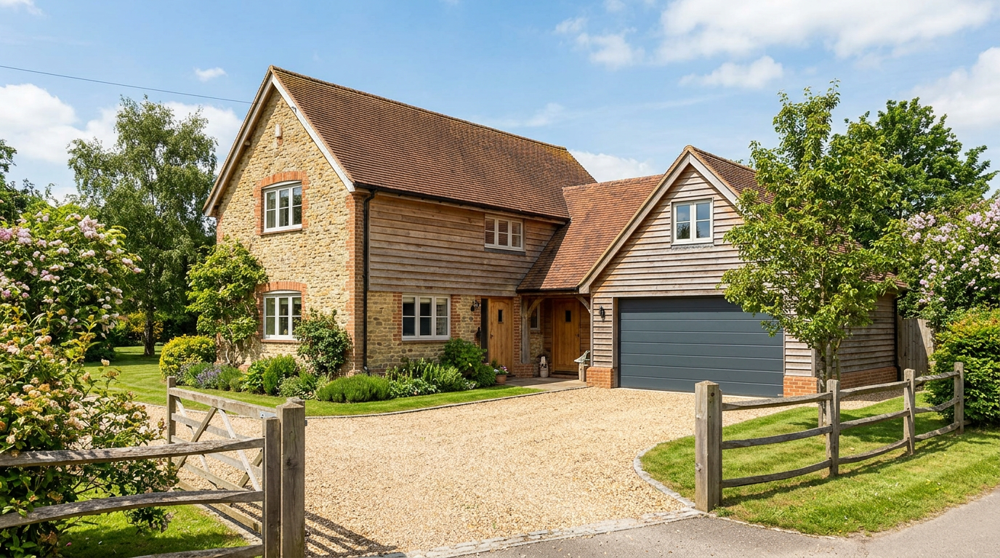
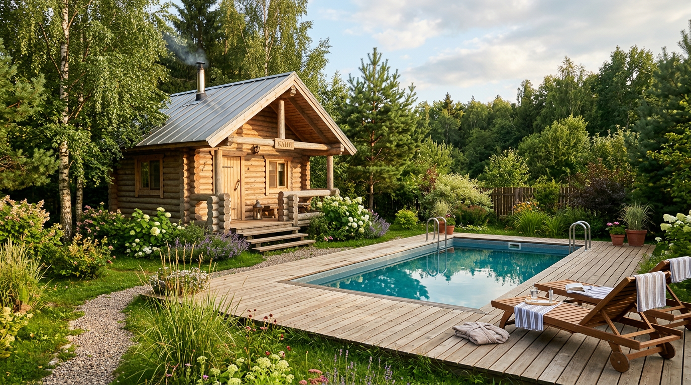
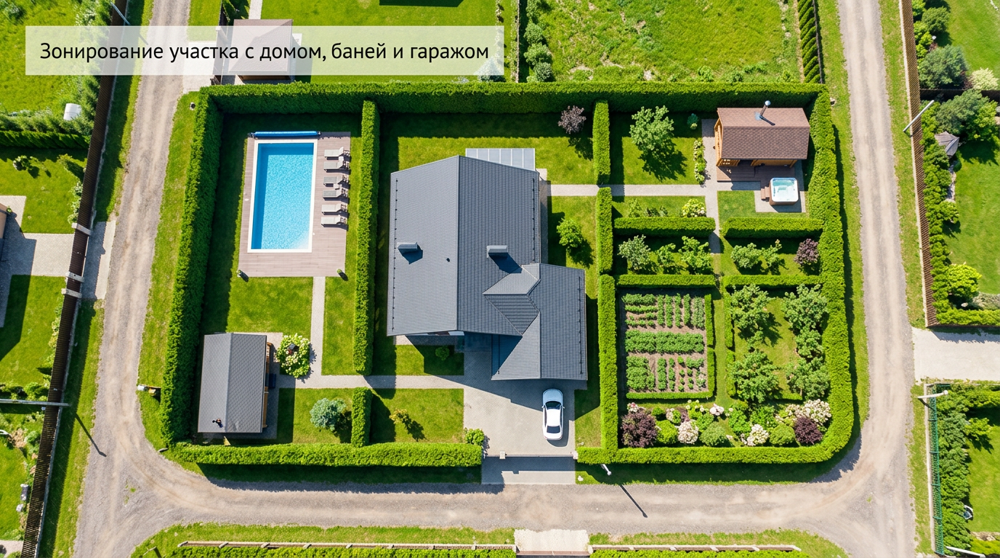
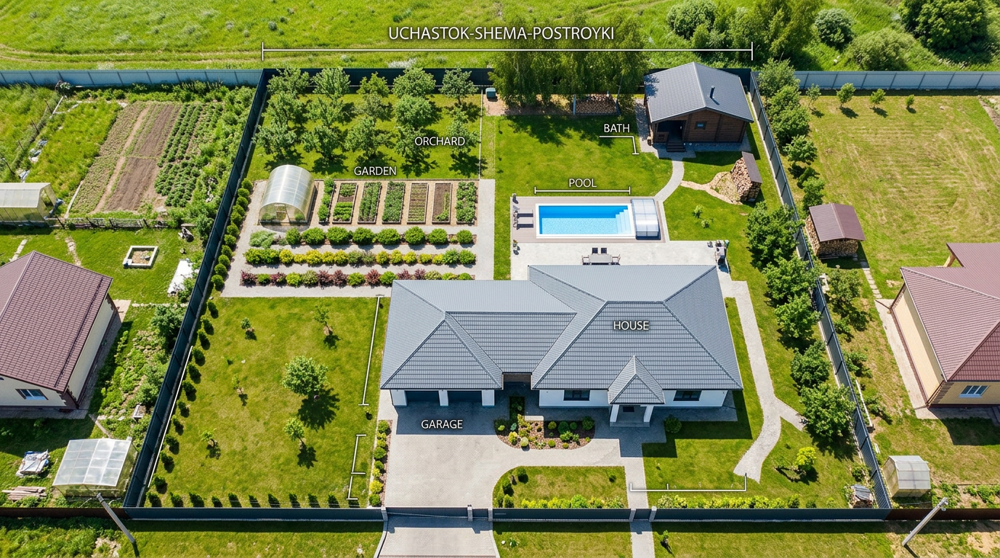

Дом, баня, гараж да ещё и бассейн — список построек серьёзный, и кажется, что для всего этого нужен большой участок. На самом деле всё перечисленное вполне реально разместить и на стандартных 10 сотках, если планировать с умом. Главное — грамотно сгруппировать постройки по зонам и не нарушить нормы и удобство. В этой статье разберём планировку участка 10 соток с домом, баней, гаражом и бассейном: как уместить все объекты, где их лучше расположить и как зонировать пространство, чтобы участок остался удобным и просторным.

Это статья из цикла о планировке. Общие принципы зонирования разобраны в основной статье — [планировка участка 10 соток](https://mir-doma.pro/planirovka-uchastka-10-sotok/), а здесь сосредоточимся на участке с большим числом построек.

## 📐 Реально ли уместить всё на 10 сотках

10 соток — это 1000 м². Дом, гараж, баня и бассейн с площадками займут лишь часть этой площади, а остальное останется под сад, отдых и проходы. Уместить всё реально, если:

- **группировать постройки** по функциям, а не разбрасывать по участку;
- **использовать компактные решения** — например, гараж, пристроенный к дому, или баню, совмещённую с зоной бассейна;
- **продумать связи и проходы** заранее, чтобы между объектами было удобно перемещаться.

Ориентировочно дом с гаражом занимают 15–20% участка, баня с бассейном и зоной отдыха — 15–20%, сад и огород — 40–50%, остальное приходится на дорожки и проходы. Если же огород вам не нужен, освободившееся место можно отдать под газон, цветники и более просторную зону отдыха — тогда даже с бассейном участок будет ощущаться свободным.

## 🏠 Дом и гараж: зона у въезда

Дом и гараж логично объединить в одну зону у въезда, со стороны улицы. Так подъездная дорожка получается короткой и не «режет» весь участок.

Гараж размещают одним из трёх способов:

- **Пристроенный к дому** — самый экономичный по месту вариант, к тому же из дома удобно попадать в гараж.
- **Встроенный** в цокольный этаж или объём дома — экономит площадь полностью.
- **Отдельно стоящий** у ворот — если важно вынести машину и шум от неё за пределы дома.

Перед домом и гаражом оставляют площадку для парковки и разворота — для одной машины достаточно около 3×6 метров, для двух места нужно больше. Дом ставят примерно в 5 метрах от улицы, гараж и постройки — около 1 метра от боковой границы. Подъезд к гаражу делают по возможности прямым и коротким, чтобы он не занимал лишнюю площадь.

## 🧖 Баня и бассейн: зона отдыха в глубине

Баню и бассейн логично объединить в единую банно-рекреационную зону и разместить в глубине участка, подальше от въезда. Это удобно и функционально: после бани приятно окунуться в бассейн, а вся зона отдыха собрана в одном месте. К тому же воду, электричество и слив тогда подводят к одной точке участка, а не тянут коммуникации в разные углы — это заметно дешевле и проще.

При размещении бани соблюдают нормы: противопожарный разрыв от жилого дома (обычно от 8 метров), около 1 метра от границы соседа и санитарное расстояние от колодца. Баня — постройка с водой, поэтому заранее продумывают отвод стоков — [септик](https://mir-doma.pro/septik-dlya-dachi/) или дренаж.

**Бассейн** размещают на солнечном, защищённом от ветра месте, подальше от крупных деревьев — иначе листья и мусор будут постоянно засорять воду, а корни могут повредить чашу. Рядом делают площадку для отдыха и шезлонгов. Бассейн бывает каркасным (сезонным, дешевле) или стационарным (капитальным); для обоих нужны подвод воды, слив и электричество для фильтрации. Каркасный удобен тем, что на зиму его убирают, освобождая место, а стационарный требует более серьёзных земляных и инженерных работ, но служит долго и выглядит солиднее.

## 🗺️ Зонирование участка с постройками

Когда построек много, хаотичное расположение быстро превращает участок в загромождённое пространство. Поэтому особенно важно сгруппировать постройки в логичные зоны и связать их дорожками:

- **Входная зона** — дом, гараж, парковка (у въезда).
- **Зона отдыха** — баня, бассейн, беседка, площадка для барбекю (в глубине).
- **Садово-огородная зона** — грядки, теплица, плодовые деревья (на солнечной стороне).
- **Хозяйственная зона** — сарай, компост (в незаметном углу).

Зоны разделяют живыми изгородями и цветниками, а связывают удобными [садовыми дорожками](https://mir-doma.pro/sadovye-dorozhki-svoimi-rukami/). Если участок узкий и вытянутый, зоны располагают последовательно — об этом подробнее в статье о [планировке узкого участка с домом и баней](https://mir-doma.pro/planirovka-uzkogo-uchastka-10-sotok/).

## 🛠️ Пример планировки

Удачный вариант для 10 соток выглядит так: у въезда — дом с пристроенным гаражом и парковкой перед ними. За домом — зона отдыха с беседкой, переходящая в банно-рекреационную зону с баней и бассейном в глубине участка, на солнечном месте. Вдоль солнечной стороны — сад и компактный огород с теплицей. В дальнем углу, за баней, — небольшой хозблок. Все зоны связаны дорожками, по периметру — забор с озеленением для приватности.

Такая схема позволяет разместить все постройки, сохранив место для сада и свободного пространства.

## 🛡️ Частые ошибки

- **Бассейн под деревьями.** Листья и мусор будут засорять воду, а корни — угрожать чаше. Ставьте бассейн на открытом солнечном месте.
- **Баня вплотную к дому.** Нарушает противопожарные нормы — выдерживайте разрыв от 8 метров.
- **Всё впритык.** Без проходов между постройками участок становится тесным и неудобным. Оставляйте место для перемещения.
- **Забыли про подъезд к гаражу.** Машине нужна площадка для въезда и разворота — её планируют заранее.
- **Не продумали коммуникации.** К бане и бассейну заранее подводят воду, электричество и слив, иначе потом придётся всё перекапывать.

## ❓ Частые вопросы

### Можно ли разместить дом, баню, гараж и бассейн на 10 сотках?

Да, всё это реально уместить на 10 сотках при грамотной планировке. Постройки группируют по зонам: дом с гаражом — у въезда, баня с бассейном — в зоне отдыха в глубине, а сад и огород — на солнечной стороне. Компактные решения, вроде пристроенного гаража, экономят место.

### Где разместить гараж на участке?

Гараж размещают у въезда, со стороны улицы, чтобы подъезд был коротким. Его делают пристроенным к дому (экономит место и удобно входить), встроенным или отдельно стоящим у ворот. От боковой границы выдерживают около 1 метра.

### Где поставить баню и бассейн на участке?

Баню и бассейн удобно объединить в зону отдыха в глубине участка. Баню ставят с противопожарным разрывом от дома (от 8 метров), а бассейн — на солнечном, защищённом от ветра месте подальше от крупных деревьев. К обоим заранее подводят воду, слив и электричество.

### Сколько места занимает бассейн на участке?

Зависит от типа: каркасный сезонный бассейн с площадкой займёт несколько квадратных метров, стационарный — больше, плюс зона вокруг для отдыха. На 10 сотках бассейн вполне размещается в зоне отдыха рядом с баней без ущерба для сада.

### Нужно ли разрешение на баню, гараж и бассейн?

Требования зависят от типа построек и местных правил: капитальные строения с фундаментом обычно требуют оформления, а лёгкие (каркасный бассейн, некапитальный навес) — нет. Перед началом стройки уточните актуальные нормы и порядок согласования в своём регионе.

### Как зонировать участок с большим количеством построек?

Постройки группируют по функциям: входная зона (дом, гараж), зона отдыха (баня, бассейн, беседка), садово-огородная и хозяйственная зоны. Зоны разделяют изгородями и связывают дорожками. Группировка избавляет участок от хаоса и экономит место.

## Заключение

Планировка участка 10 соток с домом, баней, гаражом и бассейном — задача вполне выполнимая, если группировать постройки по зонам и продумывать связи между ними. Дом с гаражом размещают у въезда, баню с бассейном объединяют в зону отдыха в глубине, а сад и огород выносят на солнечную сторону. Соблюдайте нормы и заранее планируйте коммуникации — и даже на стандартных 10 сотках поместится всё необходимое, а участок останется удобным и просторным. Ключ к успеху один: сначала продуманная схема на бумаге, и только потом стройка. Больше о принципах зонирования — в основной статье о [планировке участка 10 соток](https://mir-doma.pro/planirovka-uchastka-10-sotok/).

А что из построек вы планируете на своём участке? Делитесь планами в комментариях и подписывайтесь, чтобы не пропустить новые статьи о планировке и обустройстве дачи.
