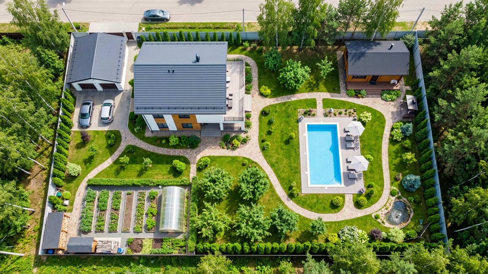
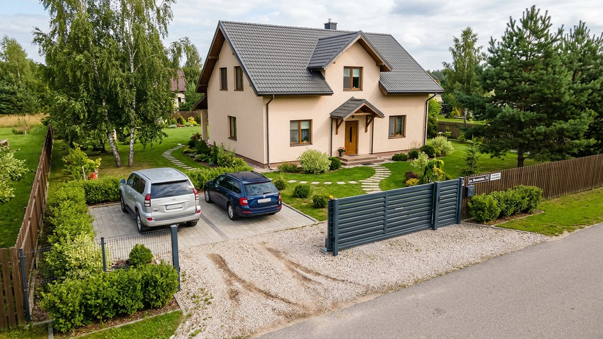
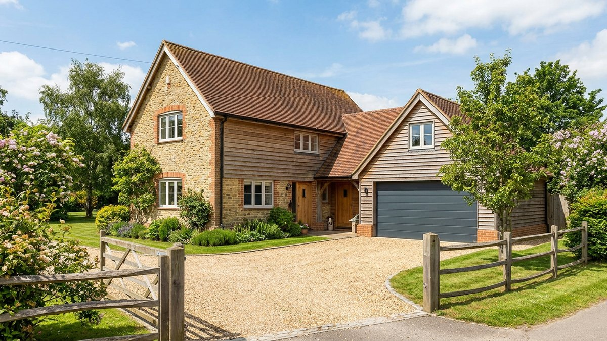
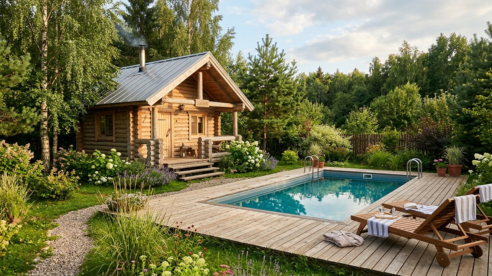
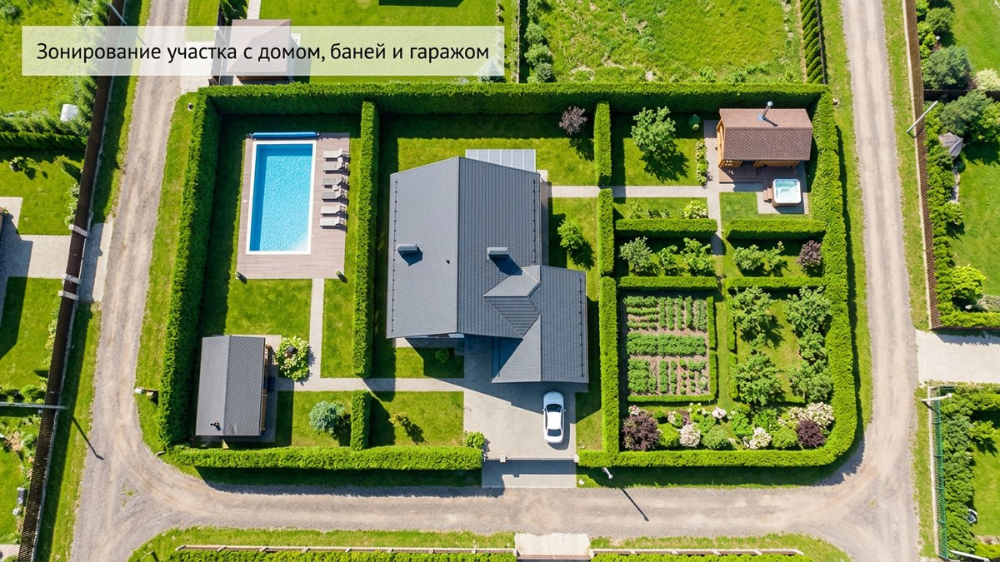
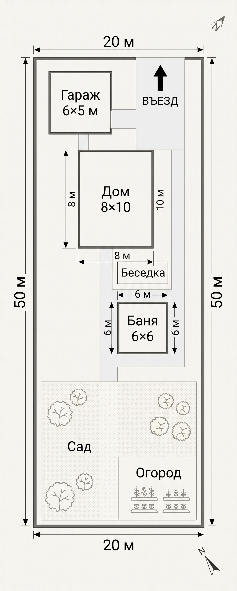
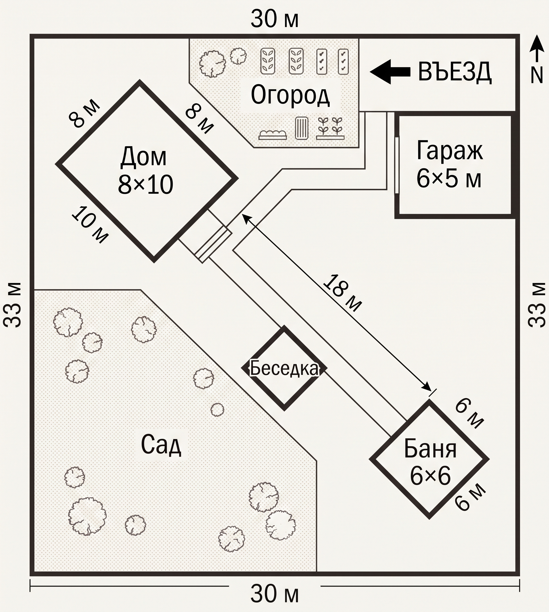
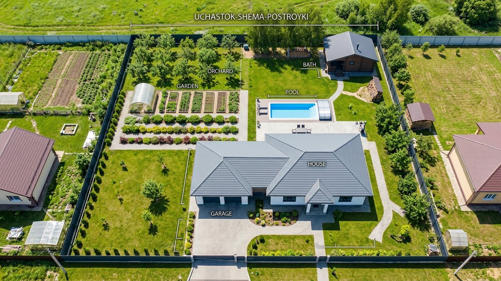
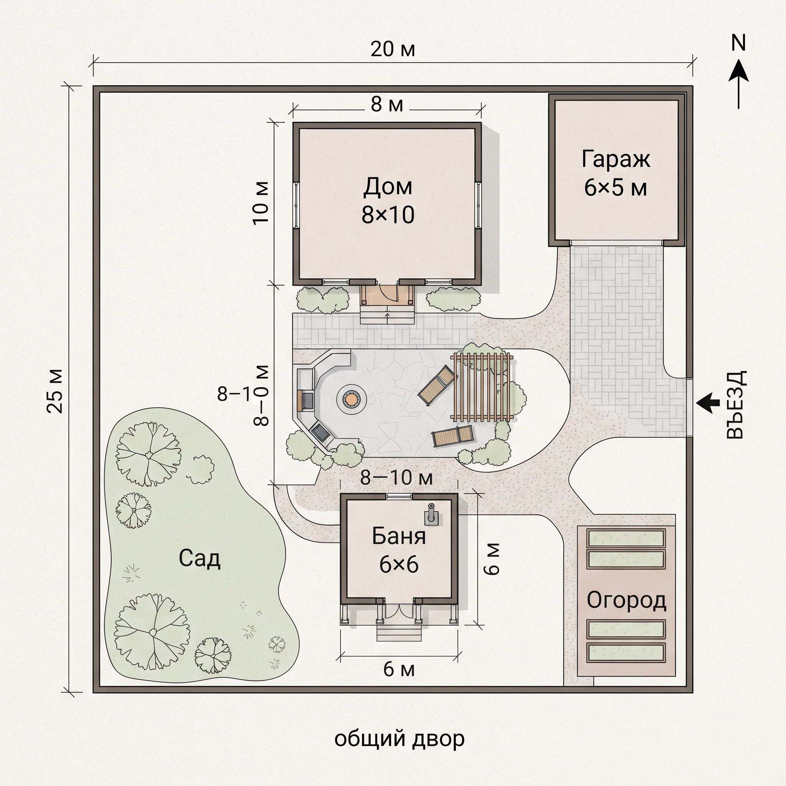

Дом, баня, гараж да ещё и бассейн — список построек серьёзный, и кажется, что для всего этого нужен большой участок. На самом деле всё перечисленное вполне реально разместить и на стандартных 10 сотках, если планировать с умом. Главное — грамотно сгруппировать постройки по зонам и не нарушить нормы и удобство. В этой статье разберём планировку участка 10 соток с домом, баней, гаражом и бассейном: как уместить все объекты, где их лучше расположить и как зонировать пространство, чтобы участок остался удобным и просторным.

Это статья из цикла о планировке. Общие принципы зонирования разобраны в основной статье — [планировка участка 10 соток](https://mir-doma.pro/planirovka-uchastka-10-sotok/), а здесь сосредоточимся на участке с большим числом построек.

## 📐 Реально ли уместить всё на 10 сотках

10 соток — это 1000 м². Дом, гараж, баня и бассейн с площадками займут лишь часть этой площади, а остальное останется под сад, отдых и проходы. Уместить всё реально, если:

- **группировать постройки** по функциям, а не разбрасывать по участку;
- **использовать компактные решения** — например, гараж, пристроенный к дому, или баню, совмещённую с зоной бассейна;
- **продумать связи и проходы** заранее, чтобы между объектами было удобно перемещаться.

Ориентировочно дом с гаражом занимают 15–20% участка, баня с бассейном и зоной отдыха — 15–20%, сад и огород — 40–50%, остальное приходится на дорожки и проходы. Если же огород вам не нужен, освободившееся место можно отдать под газон, цветники и более просторную зону отдыха — тогда даже с бассейном участок будет ощущаться свободным.

## 🏠 Дом и гараж: зона у въезда

Дом и гараж логично объединить в одну зону у въезда, со стороны улицы. Так подъездная дорожка получается короткой и не «режет» весь участок.

Гараж размещают одним из трёх способов:

- **Пристроенный к дому** — самый экономичный по месту вариант, к тому же из дома удобно попадать в гараж.
- **Встроенный** в цокольный этаж или объём дома — экономит площадь полностью.
- **Отдельно стоящий** у ворот — если важно вынести машину и шум от неё за пределы дома.

Перед домом и гаражом оставляют площадку для парковки и разворота — для одной машины достаточно около 3×6 метров, для двух места нужно больше. Дом ставят примерно в 5 метрах от улицы, гараж и постройки — около 1 метра от боковой границы. Подъезд к гаражу делают по возможности прямым и коротким, чтобы он не занимал лишнюю площадь.

## 🧖 Баня и бассейн: зона отдыха в глубине

Баню и бассейн логично объединить в единую банно-рекреационную зону и разместить в глубине участка, подальше от въезда. Это удобно и функционально: после бани приятно окунуться в бассейн, а вся зона отдыха собрана в одном месте. К тому же воду, электричество и слив тогда подводят к одной точке участка, а не тянут коммуникации в разные углы — это заметно дешевле и проще.

При размещении бани соблюдают нормы: противопожарный разрыв от жилого дома (обычно от 8 метров), около 1 метра от границы соседа и санитарное расстояние от колодца. Баня — постройка с водой, поэтому заранее продумывают отвод стоков — [септик](https://mir-doma.pro/septik-dlya-dachi/) или дренаж.

**Бассейн** размещают на солнечном, защищённом от ветра месте, подальше от крупных деревьев — иначе листья и мусор будут постоянно засорять воду, а корни могут повредить чашу. Рядом делают площадку для отдыха и шезлонгов. Бассейн бывает каркасным (сезонным, дешевле) или стационарным (капитальным); для обоих нужны подвод воды, слив и электричество для фильтрации. Каркасный удобен тем, что на зиму его убирают, освобождая место, а стационарный требует более серьёзных земляных и инженерных работ, но служит долго и выглядит солиднее.

## 🗺️ Зонирование участка с постройками

Когда построек много, хаотичное расположение быстро превращает участок в загромождённое пространство. Поэтому особенно важно сгруппировать постройки в логичные зоны и связать их дорожками:

- **Входная зона** — дом, гараж, парковка (у въезда).
- **Зона отдыха** — баня, бассейн, беседка, площадка для барбекю (в глубине).
- **Садово-огородная зона** — грядки, теплица, плодовые деревья (на солнечной стороне).
- **Хозяйственная зона** — сарай, компост (в незаметном углу).

Зоны разделяют живыми изгородями и цветниками, а связывают удобными [садовыми дорожками](https://mir-doma.pro/sadovye-dorozhki-svoimi-rukami/). Если участок узкий и вытянутый, зоны располагают последовательно — об этом подробнее в статье о [планировке узкого участка с домом и баней](https://mir-doma.pro/planirovka-uzkogo-uchastka-10-sotok/).

## 🏡 Дом и баня на участке 10 соток: три рабочие схемы

Связка «дом + баня» — самый частый запрос при планировании, и решается он не на глаз, а от двух ограничений: **противопожарного расстояния** и **удобства пути от дома до парилки зимой**.

**Базовые размеры, от которых считают.** Участок 10 соток — это 1000 м², обычно нарезка 25×40, 20×50 или 30×33 метра. Типовое наполнение:

| Объект | Габариты | Площадь |
|---|---|---|
| Дом | 8×10 м | 80 м² |
| Баня | 4×6 или 6×6 м | 24–36 м² |
| Гараж | 4×6 м | 24 м² |
| Зона отдыха с беседкой | 5×6 м | 30 м² |
| Хозблок, сарай | 3×4 м | 12 м² |
| Теплица | 3×6 м | 18 м² |
| Дорожки и парковка | — | 80–120 м² |
| **Итого застройка** | | **270–320 м²** |
| **Остаётся под сад и огород** | | **680–730 м²** |

То есть даже с полным набором построек **две трети участка остаются свободными** — 10 соток для связки «дом + баня» более чем достаточно.

**Ключевые расстояния:**

- **от дома до бани — от 8 м** (пожарная норма, особенно для бани с дровяной печью);
- **от бани до забора — от 1 м**, при этом скат крыши направляют на свой участок;
- **от бани до колодца или скважины — от 8 м**, слив обязательно в дренаж или септик;
- **от дома до красной линии улицы — от 5 м**, до забора соседей — от 3 м.

Полный разбор нормативов — в статье про [расстояние от дома до бани, забора и построек](https://mir-doma.pro/rasstoyanie-ot-doma-do-bani-zabora/).

### Схема 1. Линейная — для узкого участка (20×50 м)

Дом ставят у въезда, баню — в дальнем конце, связывая их дорожкой вдоль одной стороны.

- **у въезда:** парковка, гараж, дом (отступ 5 м от улицы);
- **середина:** зона отдыха и беседка, сад;
- **в глубине:** баня, за ней хозблок и компост.

**Плюс:** зоны не пересекаются, от бани не видно улицы. **Минус:** длинный путь от дома до бани — зимой чистить дорожку метров тридцать. Как решать проблемы узкой формы, разобрано в статье про [планировку узкого участка](https://mir-doma.pro/planirovka-uzkogo-uchastka-10-sotok/).

### Схема 2. Диагональная — для квадратного участка (30×33 м)

Дом в одном углу у въезда, баня — в противоположном дальнем, между ними по диагонали сад и зона отдыха.

- расстояние между постройками получается максимальным — 8 м набираются с запасом;
- обе постройки удалены от соседских границ;
- центр участка остаётся свободным под сад и газон.

**Плюс:** самое комфортное разнесение зон. **Минус:** дорожка идёт по диагонали через участок и «режет» его.

### Схема 3. Компактная — с общей зоной отдыха

Дом и баня стоят на расстоянии 8–10 м **фасадами друг к другу**, а пространство между ними становится единой зоной отдыха: терраса, мангальная площадка, беседка.

- путь от дома до бани минимальный — 10 секунд зимой;
- одна освещённая площадка обслуживает обе постройки;
- экономится место: не нужны две отдельные зоны отдыха.

**Плюс:** самый удобный сценарий для семьи, которая парится регулярно. **Минус:** требует точного соблюдения 8 метров и продуманного слива из бани, чтобы не топило площадку.

**Какую выбрать:** для узкого участка — линейная, для квадратного и редких банных дней — диагональная, для тех, кто топит баню каждую неделю — компактная.

## 📋 Проект участка 10 соток с домом и баней: порядок действий

Прежде чем расставлять постройки, соберите исходные данные — иначе придётся переделывать на бумаге по пять раз:

1. **Начертите участок в масштабе** с точными размерами, границами и въездом. Проще всего на миллиметровке в масштабе 1:100 или в бесплатном онлайн-планировщике.
2. **Отметьте стороны света** — от них зависит, где будет тень и куда выходят окна.
3. **Отметьте запретные зоны** — отступы от улицы, забора и соседских построек. После этого станет видно, где строить в принципе можно.
4. **Разместите дом** — он первый, от него отсчитывается всё остальное. Как выбрать место по солнцу, уклону и въезду, разобрано в статье про [расположение дома на участке](https://mir-doma.pro/raspolozhenie-doma-na-uchastke/).
5. **Впишите баню** по одной из трёх схем выше, проверив 8 метров от дома и 8 метров от источника воды.
6. **Добавьте гараж и парковку** у въезда.
7. **Разметьте зону отдыха** между домом и баней или рядом с баней.
8. **Оставшееся отдайте саду и огороду** — с южной стороны от дома, чтобы не оказались в тени.
9. **Проложите дорожки** по фактическим маршрутам, а не по красивым линиям.

**Совет из практики:** вырежьте постройки из бумаги в том же масштабе и подвигайте их по плану. Это займёт полчаса и покажет то, чего не видно в голове, — например, что баня загораживает солнце огороду или что дорожка к ней проходит через грядки.

Удачный вариант для 10 соток выглядит так: у въезда — дом с пристроенным гаражом и парковкой перед ними. За домом — зона отдыха с беседкой, переходящая в банно-рекреационную зону с баней и бассейном в глубине участка, на солнечном месте. Вдоль солнечной стороны — сад и компактный огород с теплицей. В дальнем углу, за баней, — небольшой хозблок. Все зоны связаны дорожками, по периметру — забор с озеленением для приватности.

Такая схема позволяет разместить все постройки, сохранив место для сада и свободного пространства.

## 🛡️ Частые ошибки

- **Бассейн под деревьями.** Листья и мусор будут засорять воду, а корни — угрожать чаше. Ставьте бассейн на открытом солнечном месте.
- **Баня вплотную к дому.** Нарушает противопожарные нормы — выдерживайте разрыв от 8 метров.
- **Всё впритык.** Без проходов между постройками участок становится тесным и неудобным. Оставляйте место для перемещения.
- **Забыли про подъезд к гаражу.** Машине нужна площадка для въезда и разворота — её планируют заранее.
- **Не продумали коммуникации.** К бане и бассейну заранее подводят воду, электричество и слив, иначе потом придётся всё перекапывать.

## ❓ Частые вопросы

### Как разместить дом и баню на участке 10 соток?

По одной из трёх схем: **линейной** (дом у въезда, баня в глубине — для узкого участка), **диагональной** (дом и баня в противоположных углах — для квадратного) или **компактной** (фасадами друг к другу на 8–10 м с общей зоной отдыха между ними). Обязательное условие в любой схеме — не менее 8 метров между домом и баней.

### Поместятся ли дом и баня на 10 сотках?

Легко. Дом 8×10 м, баня 6×6 м, гараж, беседка и хозблок вместе с дорожками занимают около 270–320 м² из 1000 — то есть **две трети участка остаются свободными** под сад, огород и газон. Проблема на 10 сотках обычно не в нехватке места, а в неудачной расстановке.

### С чего начать проект участка 10 соток с домом и баней?

Начертите участок в масштабе, отметьте стороны света и запретные зоны (отступы от улицы, забора, соседских построек). Затем разместите дом — от него отсчитывается всё остальное, потом баню с соблюдением 8 метров, гараж у въезда и зону отдыха между постройками. Оставшееся отдайте саду и огороду.

### Можно ли разместить дом, баню, гараж и бассейн на 10 сотках?

Да, всё это реально уместить на 10 сотках при грамотной планировке. Постройки группируют по зонам: дом с гаражом — у въезда, баня с бассейном — в зоне отдыха в глубине, а сад и огород — на солнечной стороне. Компактные решения, вроде пристроенного гаража, экономят место.

### Где разместить гараж на участке?

Гараж размещают у въезда, со стороны улицы, чтобы подъезд был коротким. Его делают пристроенным к дому (экономит место и удобно входить), встроенным или отдельно стоящим у ворот. От боковой границы выдерживают около 1 метра.

### Где поставить баню и бассейн на участке?

Баню и бассейн удобно объединить в зону отдыха в глубине участка. Баню ставят с противопожарным разрывом от дома (от 8 метров), а бассейн — на солнечном, защищённом от ветра месте подальше от крупных деревьев. К обоим заранее подводят воду, слив и электричество.

### Сколько места занимает бассейн на участке?

Зависит от типа: каркасный сезонный бассейн с площадкой займёт несколько квадратных метров, стационарный — больше, плюс зона вокруг для отдыха. На 10 сотках бассейн вполне размещается в зоне отдыха рядом с баней без ущерба для сада.

### Нужно ли разрешение на баню, гараж и бассейн?

Требования зависят от типа построек и местных правил: капитальные строения с фундаментом обычно требуют оформления, а лёгкие (каркасный бассейн, некапитальный навес) — нет. Перед началом стройки уточните актуальные нормы и порядок согласования в своём регионе.

### Как зонировать участок с большим количеством построек?

Постройки группируют по функциям: входная зона (дом, гараж), зона отдыха (баня, бассейн, беседка), садово-огородная и хозяйственная зоны. Зоны разделяют изгородями и связывают дорожками. Группировка избавляет участок от хаоса и экономит место.

## Заключение

Планировка участка 10 соток с домом, баней, гаражом и бассейном — задача вполне выполнимая, если группировать постройки по зонам и продумывать связи между ними. Дом с гаражом размещают у въезда, баню с бассейном объединяют в зону отдыха в глубине, а сад и огород выносят на солнечную сторону. Соблюдайте нормы и заранее планируйте коммуникации — и даже на стандартных 10 сотках поместится всё необходимое, а участок останется удобным и просторным. Ключ к успеху один: сначала продуманная схема на бумаге, и только потом стройка. Больше о принципах зонирования — в основной статье о [планировке участка 10 соток](https://mir-doma.pro/planirovka-uchastka-10-sotok/).

**Куда идти дальше:**

- Баню и гараж нельзя ставить где угодно: минимальные расстояния до дома, забора и колодца собраны в статье про [нормы расстояний](https://mir-doma.pro/rasstoyanie-ot-doma-do-bani-zabora/).
- С дома начинается вся планировка — как выбрать для него место по солнцу, уклону и въезду: [расположение дома на участке](https://mir-doma.pro/raspolozhenie-doma-na-uchastke/).
- И проверьте себя по списку [частых ошибок планировки](https://mir-doma.pro/oshibki-planirovki-uchastka/), пока постройки только на бумаге.

А что из построек вы планируете на своём участке? Делитесь планами в комментариях и подписывайтесь, чтобы не пропустить новые статьи о планировке и обустройстве дачи.
