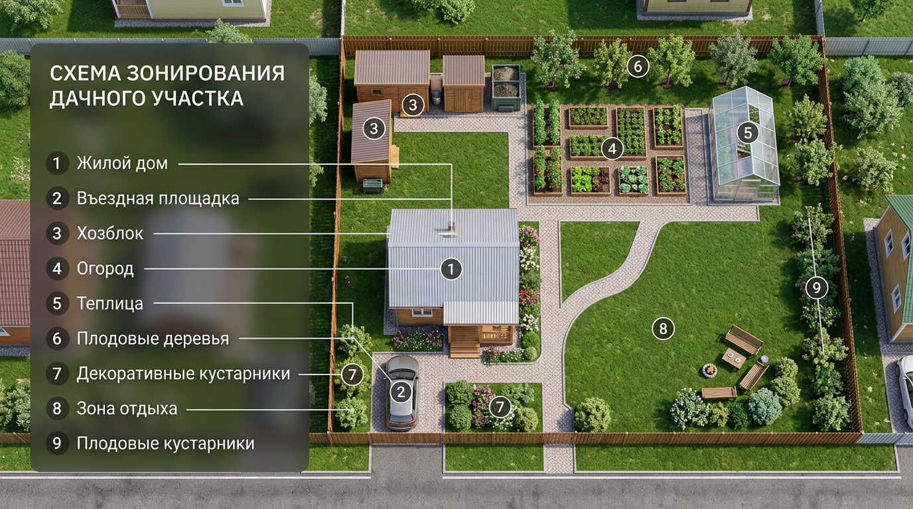
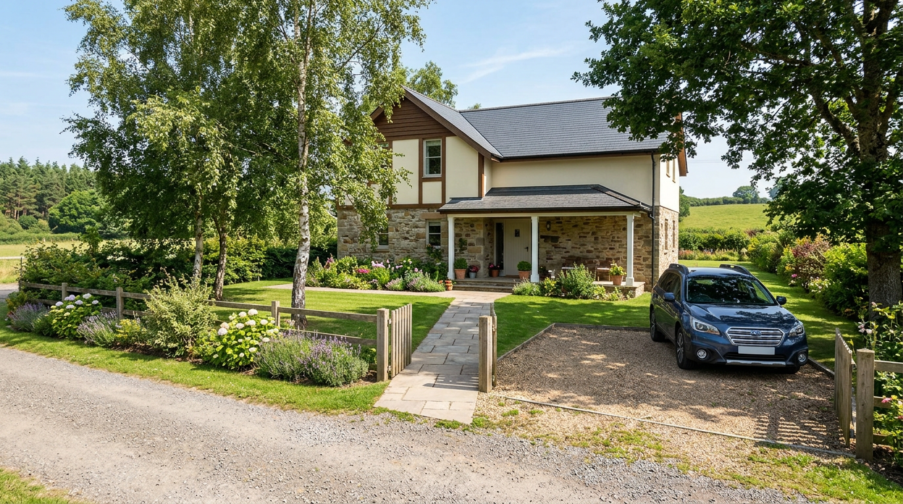
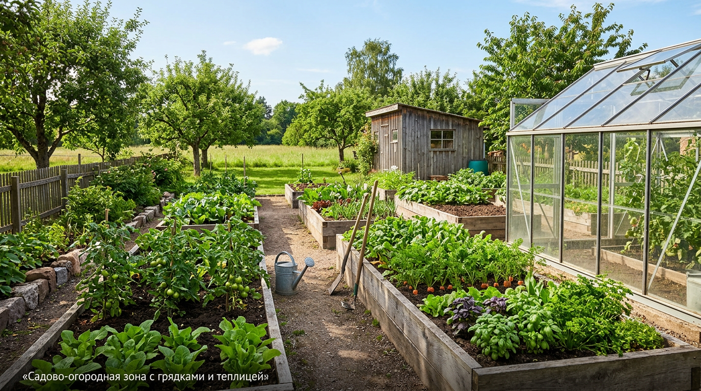
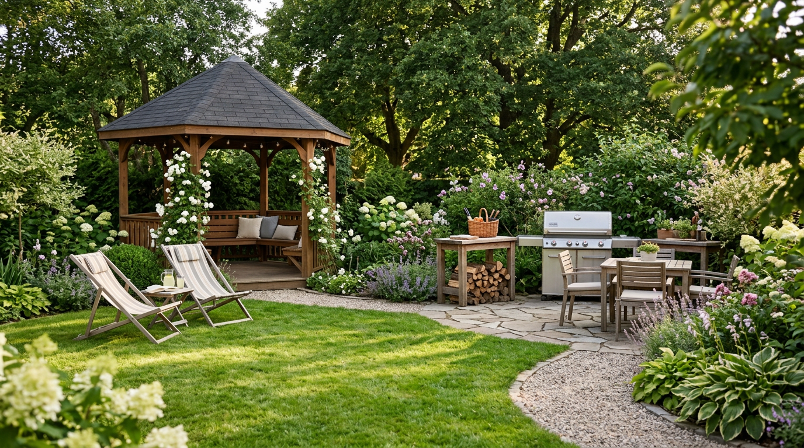
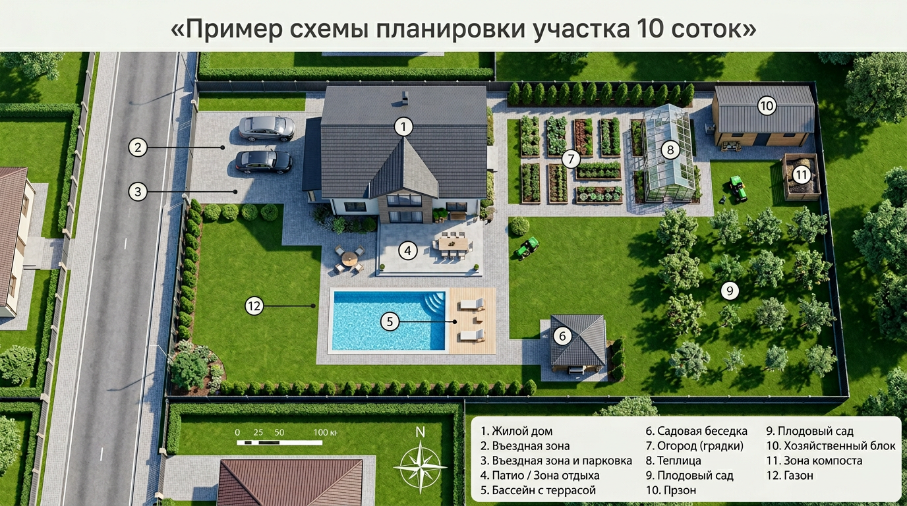

Участок в 10 соток — золотая середина: места хватает и для дома, и для сада с огородом, и для уютной зоны отдыха, но всё нужно грамотно распределить, чтобы ничего не теснилось и не пустовало. От правильной планировки зависит, будет ли участок удобным и красивым или превратится в нагромождение построек и грядок. В этой статье разберём, как спланировать участок 10 соток: с чего начать, на какие зоны его разделить, где разместить дом, сад, огород и место для отдыха, а также покажем примеры зонирования и частые ошибки.

## 📐 С чего начать планировку

Прежде чем рисовать план, нужно изучить сам участок. От его особенностей зависит расположение всех зон.

- **Форма участка.** 10 соток (1000 м²) бывают прямоугольными, квадратными или узкими и вытянутыми — для каждой формы своя логика зонирования.
- **Стороны света.** Определите, где север и юг. Это ключевой момент: огород и сад должны быть на солнечной стороне, а дом не должен затенять грядки.
- **Рельеф.** Учтите уклоны и низины — в них скапливается вода, и это влияет на расположение построек и дренажа.
- **Грунт и грунтовые воды.** Высокий уровень воды важен для выбора места под фундамент, погреб и колодец.
- **Существующие объекты.** Взрослые деревья, постройки, въезд и точки подключения коммуникаций тоже задают планировку.

- **Роза ветров.** Полезно знать, с какой стороны чаще дует ветер: с подветренной стороны размещают зону отдыха, а хозпостройки и компост — так, чтобы запахи не шли к дому.

Лучше всего начертить план участка на бумаге или в простой программе в масштабе и расставлять зоны прямо на схеме — так сразу видно, что куда поместится. Удобно вырезать из бумаги фигурки дома, теплицы, беседки в масштабе и двигать их по плану, подбирая лучшее расположение, прежде чем что-то строить на земле.

## 🧭 Основные зоны участка

Любой участок делят на функциональные зоны. На 10 сотках обычно выделяют пять основных:

- **Жилая зона** — дом с входной группой и местом для парковки.
- **Хозяйственная зона** — сарай, гараж, дровник, компост, иногда баня.
- **Садово-огородная зона** — грядки, теплица, плодовые деревья и кустарники.
- **Зона отдыха** — беседка, мангал, газон, детская площадка.
- **Въездная зона** — ворота, калитка, площадка перед домом.

Грамотное зонирование — это когда зоны не мешают друг другу, удобно связаны дорожками и расположены с учётом солнца и розы ветров. Состав и размер зон зависят от того, как вы используете участок: для кого-то главное — большой огород, для кого-то — газон и барбекю, а кому-то нужны и баня, и гараж, и грядки. Поэтому планировку всегда подстраивают под свой образ жизни.

## 📊 Как распределить площадь

Чёткой формулы нет — всё зависит от ваших приоритетов (огород или отдых). Но для ориентира можно опираться на примерные пропорции.

| Зона | Доля площади | Примерно на 10 сотках |
|------|--------------|------------------------|
| Дом и въезд | 10–20% | 100–200 м² |
| Сад и огород | 40–60% | 400–600 м² |
| Зона отдыха | 10–15% | 100–150 м² |
| Хозяйственная зона | 10–15% | 100–150 м² |

Если для вас в приоритете урожай, увеличивайте долю сада и огорода; если отдых — расширяйте зону отдыха и газон за счёт грядок.

## 🗺️ Принципы зонирования: где что разместить

Есть несколько проверенных правил, которые делают участок удобным.

### Жилая зона

Дом обычно ставят ближе к въезду и к северной границе участка — так он не затеняет сад и огород, а большая часть земли остаётся солнечной. По нормам дом размещают на расстоянии около 5 метров от улицы (красной линии) и не менее 3 метров от границы с соседним участком. Перед домом оставляют место для парковки и входной площадки. Удобно, когда от ворот к дому ведёт короткая прямая дорожка, а вход хорошо просматривается. Если планируете гараж или навес для машины, их размещают рядом с въездом, чтобы не тянуть подъездную площадку через весь участок.

### Садово-огородная зона

Грядки и теплицу размещают на самом солнечном, южном или юго-восточном участке земли, открытом для света весь день. Высокие плодовые деревья сажают так, чтобы они не затеняли грядки, — обычно с северной стороны или вдоль северной границы. Огород и сад удобно объединять в один блок, отделяя его от зоны отдыха, — так грязные работы не пересекаются с местом для гостей. Грядки делают такой ширины, чтобы до середины было удобно дотянуться (около 80–100 см), с проходами между ними. [Теплицу](https://mir-doma.pro/teplitsa-iz-polikarbonata-svoimi-rukami/) ставят по длинной оси с запада на восток для равномерного освещения. Не забудьте про удобный полив — например, [капельную систему](https://mir-doma.pro/kapelnyy-poliv-svoimi-rukami/).

### Зона отдыха

Место для отдыха располагают в тихом, защищённом от ветра уголке — часто за домом или рядом с ним, подальше от хозяйственной зоны. Здесь ставят [беседку](https://mir-doma.pro/besedka-svoimi-rukami/), мангал, разбивают газон или детскую площадку. Хорошо, когда зона отдыха не просматривается с улицы и отделена от грядок живой изгородью или кустарником.

### Хозяйственная зона

Сарай, компост, дровник и туалет выносят в дальний, наименее заметный угол участка, желательно с подветренной стороны и за домом. По санитарным нормам компост, туалет и септик располагают на расстоянии от колодца и дома, поэтому их планируют в первую очередь. Хорошо, когда хозяйственная зона скрыта от глаз — её отгораживают живой изгородью, шпалерой с вьющимися растениями или декоративным экраном. Баню, если она есть, размещают на стыке хозяйственной зоны и зоны отдыха, ближе к воде.

## 💧 Коммуникации и озеленение

Помимо зон, на плане сразу продумывают инженерные сети и озеленение — переделывать их потом дорого.

- **Вода и полив.** Заранее спланируйте, где будет колодец или скважина, как пройдут трубы и где удобно подключить полив грядок.
- **Электричество.** Продумайте разводку к дому, хозпостройкам, освещению дорожек и зоны отдыха.
- **Водоотведение.** Дренаж и ливневые канавы особенно важны на участках с уклоном и высоким уровнем грунтовых вод.
- **Озеленение.** Деревья и кустарники не только украшают, но и зонируют участок, защищают от ветра и пыли. Высокие деревья сажают с северной стороны и подальше от дома и грядок.

Продуманные коммуникации и зелёные насаждения делают участок не только красивым, но и по-настоящему удобным в быту.

## 🌿 Планировка участков разной формы

Форма участка определяет подход к зонированию.

- **Прямоугольный участок** — самый удобный. Дом ставят у въезда, за ним последовательно размещают зону отдыха, а в глубине — сад и огород; зоны идут «лентами».
- **Квадратный участок** — даёт свободу: дом смещают в один угол, а остальное пространство гибко делят на зоны, например по диагонали.
- **Узкий и длинный участок** — самый сложный. Чтобы он не выглядел коридором, его делят поперёк на несколько зон, используют извилистые дорожки, разные уровни и живые изгороди, зрительно разбивающие длину. Этот случай подробно разобран в статье о [планировке узкого участка 10 соток с домом и баней](https://mir-doma.pro/planirovka-uzkogo-uchastka-10-sotok/).
- **Участок с уклоном** — требует террасирования: склон разбивают на горизонтальные террасы с подпорными стенками, а дом ставят в самой высокой и сухой части.

Если участок неправильной формы (например, угловой или Г-образный), его тоже делят на функциональные зоны, обыгрывая особенности конфигурации — в «выступах» удобно размещать зону отдыха или сад.

## 📋 Порядок планировки: пошагово

Чтобы ничего не упустить, планируйте участок в таком порядке:

1. **Замерьте участок** и начертите его план в масштабе, отметив стороны света, въезд и существующие объекты.
2. **Разместите дом** — обычно у въезда и северной границы.
3. **Определите хозяйственную зону** и санитарные объекты (компост, септик, туалет) с учётом норм.
4. **Выделите садово-огородную зону** на солнечной стороне.
5. **Найдите место для отдыха** — в тихом защищённом уголке.
6. **Проложите дорожки**, связывающие все зоны удобными маршрутами.
7. **Продумайте коммуникации, забор и озеленение.**

Такой порядок — от главного к деталям — помогает не упустить важное и получить сбалансированный участок.

## 💡 Примеры зонирования 10 соток

Готовых «правильных» планировок не бывает — всё зависит от приоритетов семьи. Но удобно отталкиваться от трёх типовых сценариев:

1. **Для садовода-огородника.** Дом и парковка у въезда (~15%), максимум площади под сад, огород и теплицу (~60%), небольшая зона отдыха у дома (~10%), хозблок в дальнем углу (~15%). Упор на урожай.
2. **Для отдыха.** Дом у въезда, просторная зона отдыха с беседкой, мангалом и газоном (~25%), декоративный сад и небольшие грядки (~40%), хоззона компактная. Упор на комфорт и красоту.
3. **Универсальный (баланс).** Дом и въезд (~15%), сад-огород (~45%), полноценная зона отдыха (~20%), хозяйственная зона с баней (~20%). Подходит большинству семей.

В любом сценарии зоны связывают удобными [садовыми дорожками](https://mir-doma.pro/sadovye-dorozhki-svoimi-rukami/), а по периметру ставят [забор](https://mir-doma.pro/zabor-iz-profnastila-svoimi-rukami/). Больше готовых схем — в статье о [зонировании участка 10 соток](https://mir-doma.pro/zonirovanie-uchastka-10-sotok/), а если планируете баню, гараж и бассейн — в статье о [планировке участка с этими постройками](https://mir-doma.pro/planirovka-uchastka-10-sotok-s-baney-garazhom/).

## 🛠️ Частые ошибки планировки

Чтобы не переделывать участок, избегайте типичных промахов — подробный разбор в статье об [ошибках планировки дачного участка](https://mir-doma.pro/oshibki-planirovki-uchastka/):

- **Не учли стороны света.** Огород в тени дома или деревьев даёт скудный урожай. Сначала определите солнечную сторону.
- **Дом в центре участка.** Так теряется полезная площадь и участок дробится на неудобные куски. Дом обычно ставят ближе к въезду.
- **Забыли про въезд и парковку.** Машине нужно где-то встать, и об этом думают заранее.
- **Хаотичные постройки.** Сарай, теплица и беседка, расставленные без плана, создают беспорядок. Сначала схема — потом стройка.
- **Нет зоны отдыха.** Участок только из грядок быстро утомляет. Оставьте место для отдыха.
- **Игнор санитарных норм.** Несоблюдение отступов от границ и расстояний между постройками приводит к конфликтам с соседями и проблемам с оформлением.
- **Узкие или неудобные дорожки.** Если маршруты между зонами неудобны, по участку тяжело ходить и возить тачку. Дорожки планируют сразу.
- **Всё впритык.** Желание уместить максимум приводит к тесноте. Лучше оставить немного свободного пространства и газона — участок будет дышать.

## ❓ Частые вопросы

### Что нужно разместить на участке 10 соток?

Стандартный набор: жилой дом с парковкой, садово-огородная зона (грядки, теплица, плодовые деревья), зона отдыха (беседка, мангал, газон) и хозяйственная зона (сарай, компост, иногда баня и гараж). На 10 сотках всё это размещается комфортно при грамотном зонировании.

### Сколько это — 10 соток?

10 соток — это 1000 квадратных метров, например участок 25×40 или 20×50 метров. Это средний по размеру участок, на котором комфортно размещаются дом, сад, огород и зона отдыха.

### С чего начать планировку участка?

С анализа: определите форму участка, стороны света, рельеф, уровень грунтовых вод и расположение въезда. Затем начертите план в масштабе и расставьте на нём зоны — жилую, садово-огородную, отдыха и хозяйственную, учитывая солнце и удобные связи между ними.

### Где на участке разместить дом?

Дом обычно ставят ближе к въезду и северной границе, чтобы он не затенял сад и огород. По нормам — около 5 метров от улицы и не менее 3 метров от соседнего участка. Точные отступы стоит уточнить по действующим правилам (СП 53.13330) и местным нормам.

### Где лучше расположить огород и грядки?

На самой солнечной, южной или юго-восточной части участка, открытой для света весь день. Грядки и теплицу не должны затенять дом, забор и высокие деревья, поэтому высокие посадки размещают с северной стороны.

### Как спланировать узкий участок?

Узкий вытянутый участок делят поперёк на несколько зон, чтобы он не выглядел коридором. Помогают извилистые дорожки, живые изгороди, разделяющие пространство, и разные по назначению уголки вдоль участка. Так длина зрительно дробится и участок кажется просторнее.

### Как зонировать участок?

Участок делят на функциональные зоны: жилую (дом, въезд), садово-огородную, зону отдыха и хозяйственную. Зоны разделяют дорожками, живыми изгородями, перепадами высот или декоративными элементами, а размещают с учётом сторон света, удобства и санитарных норм.

### Нужен ли ландшафтный дизайнер для участка 10 соток?

Не обязательно. Спланировать 10 соток вполне можно самостоятельно, если изучить участок, продумать зоны и начертить план. Дизайнер пригодится для сложного рельефа, нестандартной формы или если хочется готового профессионального проекта, но базовое зонирование под силу любому хозяину.

### Какие нормы отступов учитывать при планировке?

Ориентировочно: дом — 5 м от улицы и 3 м от соседней границы; хозпостройки — около 1 м от границы; высокие деревья — 4 м, средние — 2 м, кустарники — 1 м от границы; туалет, компост и септик — на санитарном расстоянии от колодца и домов. Конкретные значения зависят от действующих норм и местных правил, поэтому их уточняют перед стройкой.

## 📚 Статьи цикла о планировке

Эта статья — основа цикла о планировке участка. Отдельные случаи разобраны подробнее:

- [Планировка узкого участка 10 соток с домом и баней](https://mir-doma.pro/planirovka-uzkogo-uchastka-10-sotok/)
- [Планировка участка 10 соток с домом, баней, гаражом и бассейном](https://mir-doma.pro/planirovka-uchastka-10-sotok-s-baney-garazhom/)
- [Планировка участка 10 соток под строительство дома](https://mir-doma.pro/planirovka-uchastka-10-sotok-pod-stroitelstvo/)
- [Зонирование участка 10 соток: схемы и примеры](https://mir-doma.pro/zonirovanie-uchastka-10-sotok/)
- [Ошибки планировки дачного участка](https://mir-doma.pro/oshibki-planirovki-uchastka/)
- [Расстояние от дома до бани, забора и построек: нормы](https://mir-doma.pro/rasstoyanie-ot-doma-do-bani-zabora/)
- [Как расположить дом на участке 10 соток: стороны света, уклон, отступы](https://mir-doma.pro/raspolozhenie-doma-na-uchastke/)

## Заключение

Планировка участка 10 соток — это в первую очередь продуманное зонирование с учётом сторон света и удобных связей между зонами. Начните с анализа участка и схемы на бумаге, разделите землю на жилую, садово-огородную зоны, зону отдыха и хозяйственную, разместите дом у въезда, грядки — на солнце, а отдых — в тихом уголке. Свяжите всё дорожками и не забудьте про нормы отступов. Такой подход превратит обычные 10 соток в удобный, красивый и функциональный участок, на котором будет приятно и работать, и отдыхать. И помните: лучше потратить время на план на бумаге, чем потом переносить уже построенное — ошибки планировки исправлять долго и дорого.

А как устроен ваш участок — что бы вы изменили в планировке? Делитесь идеями в комментариях и подписывайтесь, чтобы не пропустить новые статьи об обустройстве дачи.
