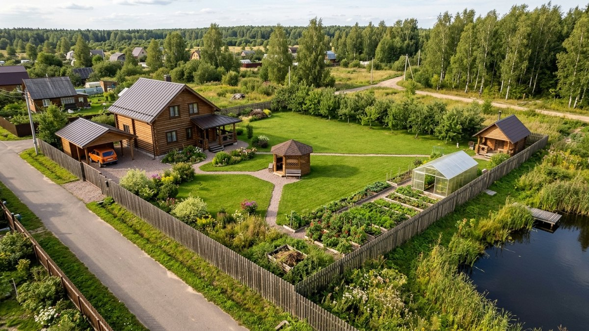
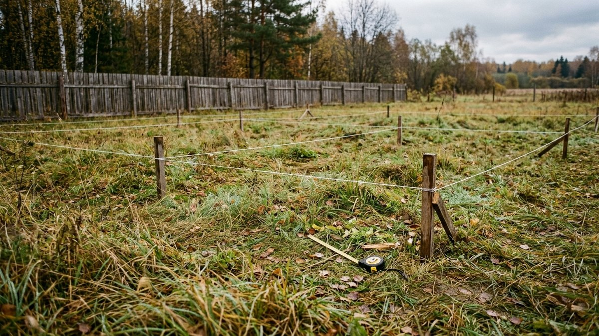
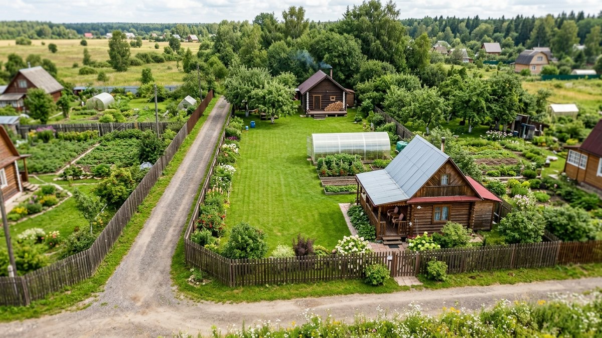
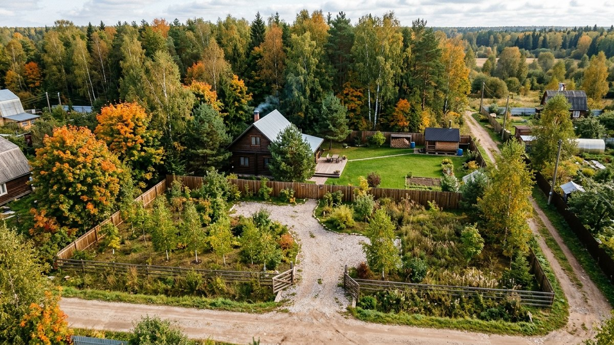
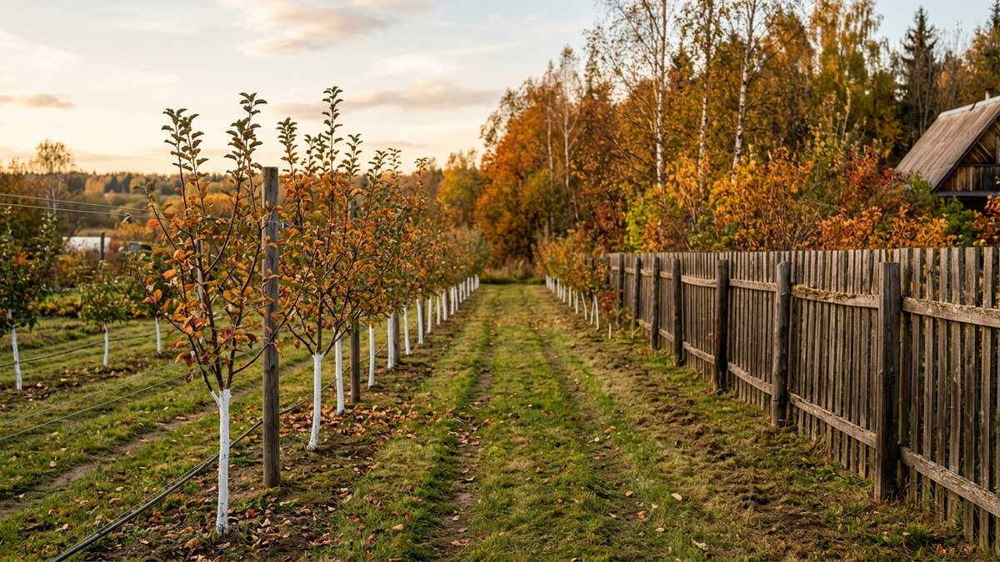
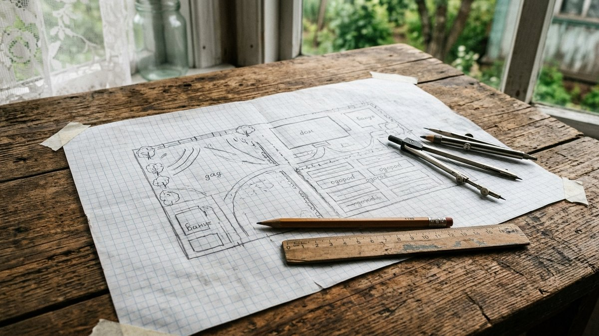

# Планировка участка 15 соток: схемы под дачу и ПМЖ, расчёт площади

Планировка участка 15 соток устроена иначе, чем на шести или десяти.
Места хватает на дом, баню, гараж, теплицы, сад и огород сразу, и
отказываться ни от чего не приходится. Ошибаются здесь в другом: дом
ставят посередине, сад сажают где попало, и через пять лет полторы
тысячи метров оказываются разрезаны на неудобные куски. Ниже — как
распределить площадь под дачу и под постоянное проживание, три схемы
под типичную форму участка и калькулятор. Он покажет, сколько земли
останется под огород и газон после всех построек.

## Что меняется на 15 сотках

Пятнадцать соток — это 1500 м². В посёлках и ИЖС их чаще всего
нарезают в виде прямоугольника 30×50 м. Встречаются вытянутые участки
25×60 м и почти квадратные 38×40 м. От формы зависит, какая схема
подойдёт, об этом ниже.

Главное отличие от небольших участков — отступы почти не мешают.
На шести сотках полоса 5 м вдоль улицы и по 3 м от соседей решают,
куда вообще встанет дом. Как с этим справляются, разобрано в статье
[планировка участка 6 соток](https://mir-doma.pro/planirovka-uchastka-6-sotok/).
На 15 сотках эти же отступы занимают меньше десятой части земли.
Поэтому задача меняется: не «как всё уместить», а «как не растащить
постройки по участку».

Что становится возможным только с такой площадью:

- **Баня у воды в глубине участка**, с купелью или прудом, на 15–25 м
  от дома, а не на минимальных 8 м.
- **Гараж или навес на две машины** у въезда, отдельно от жилой зоны.
- **Настоящий сад**: 10–15 плодовых деревьев на полукарликовых подвоях,
  а не три яблони вдоль забора.
- **Септик и скважина на нормативном расстоянии** друг от друга без
  ухищрений. Это важно, если дом нужен для постоянного проживания.

## Сколько земли отдать под каждую зону

Удобно сначала решить, зачем участок: для отдыха, для огорода или
для жизни круглый год. От этого зависит, сколько земли уйдёт под
каждую зону. Ниже — ориентиры, проценты от 1500 м²:

| Зона | Дача для отдыха | Огородная дача | ПМЖ с семьёй |
|---|---|---|---|
| Дом, крыльцо, терраса | 8–10% (120–150 м²) | 6–8% (90–120 м²) | 10–14% (150–210 м²) |
| Хозяйственная: гараж, сарай, баня, компост | 8–10% | 10–12% | 12–15% |
| Сад и огород | 20–30% | 50–60% | 25–35% |
| Отдых: газон, беседка, площадка | 35–45% | 12–18% | 25–30% |
| Дорожки, въезд, парковка | 8–10% | 6–8% | 10–12% |

Если сомневаетесь, какой вариант ваш, начните с огородной дачи. Грядки
и газон легко переделать в зону отдыха за один сезон. Обратно на это
уйдут годы: под газоном земля уплотняется, и её приходится заново
перекапывать и удобрять.

Для ПМЖ площадь под дорожки и парковку растёт не случайно. Зимой
нужно чистить въезд и дорожку к дому, сюда же приезжает машина для
откачки септика, а гостей и курьеров кто-то должен встречать у
ворот. Всё это легче, когда гараж и въезд стоят у улицы, а не в
глубине участка.

## Нормы расстояний: что важно именно здесь

Ориентиры — по СП 53.13330 для садовых участков. Для ИЖС свои
правила, их задают правила землепользования поселения. Проверьте
действующую редакцию для своего участка.

- **Дом** — от 3 м до границы с соседом, от 5 м до улицы.
- **Баня, гараж, сарай** — от 1 м до границы с соседом.
- **Дом — баня, душ, туалет** — от 8 м.
- **Скважина или колодец — септик, туалет, компост** — от 20 м.
- **Деревья** — высокие от 4 м до границы, средние от 2 м, кустарники
  от 1 м.

На 15 сотках все эти расстояния выдерживаются без труда. Одно исключение
— пара «скважина и септик». На участке 30×50 м их разводят в
противоположные углы, иначе 20 м не набрать. Решать это нужно в самом
начале, до того как ставят дом: септик подключают к выпуску канализации
из дома, и он должен стоять со стороны, удобной для подъезда
ассенизатора. Как выбрать септик и сколько ему нужно места, разобрано в
статье [септик для дачи](https://mir-doma.pro/septik-dlya-dachi/), а
полная таблица расстояний между постройками — в статье [расстояние от
дома до бани и забора](https://mir-doma.pro/rasstoyanie-ot-doma-do-bani-zabora/).

## Три схемы под форму участка

### Схема 1. Прямоугольник 30×50 м: дом у улицы, баня в глубине

Самая частая нарезка и самая удобная для планировки. Участок делится
на три полосы по глубине:

1. **Передние 15 м.** Въезд, гараж или навес, дом с террасой. Дом
   стоит в 5–6 м от улицы и в 3 м от одной из боковых границ.
   Это даёт широкую свободную полосу с другой стороны.
2. **Средние 15–20 м.** Зона отдыха с газоном и беседкой, за ней
   теплицы. Теплицы ставят коньком с севера на юг, чтобы солнце
   освещало обе стороны.
3. **Дальние 15 м.** Баня с прудом или купелью, сад, компост и хозблок.
   Баня оказывается в 25–30 м от дома, и дым, шум и гости не мешают
   спящим.

Огород в такой схеме кладут вдоль южной или западной границы через
весь участок, полосой шириной 6–8 м. Сад — в дальней полосе и вдоль
северной границы, тогда деревья не затеняют грядки. Чтобы через пять лет не мешать
соседям, держитесь норм из раздела выше.

### Схема 2. Вытянутый участок 25×60 м: цепочка зон

Шестьдесят метров в глубину превращают участок в коридор. Длинная
дорожка от ворот до бани кажется скучной и бесконечной. Решение —
разбить глубину на 4–5 «комнат» по 10–15 м и отделить их друг от друга
шпалерой, кустарником или аркой: въезд и дом, газон для отдыха,
огород с теплицей, сад, баня в самом конце.

Дорожку ведут не по центру, а вдоль одной стороны, с плавными
поворотами у переходов между зонами. Приёмы для вытянутых участков,
включая зрительное расширение, подробно разобраны в статье [планировка
узкого участка](https://mir-doma.pro/planirovka-uzkogo-uchastka-10-sotok/).
Для 25 м ширины они работают так же, просто «комнаты» получаются
больше.

### Схема 3. Почти квадрат 38×40 м: дом в глубине, сад у улицы

На квадратном участке дом можно отнести в глубину на 12–15 м. Перед
ним остаётся передний сад или газон с подъездной дорожкой, а за домом
— закрытая от улицы зона отдыха. Такой вариант любят для ПМЖ: с улицы
не видно террасы и детской площадки, а шум машин глушат деревья.

Баню в такой схеме ставят в дальнем углу по диагонали от дома, огород
и теплицы — вдоль южной стороны, хозблок и компост — в другом дальнем
углу, за кустарником. Минус схемы — длинный въезд. На 12–15 м дорожки
для машины уйдёт заметно больше щебня, а зимой — больше уборки снега.
Как устроить подъезд, который не размоет и не продавит машиной,
описано в статье [дорожка из щебня своими
руками](https://mir-doma.pro/dorozhka-iz-shchebnya-svoimi-rukami/).

## Калькулятор: сколько земли останется под огород и отдых

Введите размеры участка и что хотите поставить. Калькулятор проверит,
встанет ли дом с отступами, и сколько метров между домом и баней
получится, если ставить их в линию. Ещё он покажет, сколько земли
займут постройки, сад и дорожки и что останется под огород, газон и
отдых. Сад считается с площадью питания 4×4 м на дерево на
полукарликовом подвое и 2 м² на куст.

<!-- wp:html -->

  
Калькулятор планировки участка: бюджет площади

  <label class="md-calc__label" for="md15W">Ширина участка (вдоль улицы), м</label>
  <input type="number" id="md15W" class="md-calc__input" min="10" step="0.5" value="30">
  <label class="md-calc__label" for="md15L">Глубина участка, м</label>
  <input type="number" id="md15L" class="md-calc__input" min="10" step="0.5" value="50">
  <label class="md-calc__label" for="md15H">Дом (с террасой)</label>
  <select id="md15H" class="md-calc__input">
    <option value="8x8">8×8 м</option>
    <option value="10x10" selected>10×10 м</option>
    <option value="10x12">10×12 м</option>
    <option value="12x12">12×12 м</option>
  </select>
  <label class="md-calc__label" for="md15B">Баня</label>
  <select id="md15B" class="md-calc__input">
    <option value="0">Без бани</option>
    <option value="4x5" selected>4×5 м</option>
    <option value="6x6">6×6 м с террасой</option>
  </select>
  <label class="md-calc__label" for="md15G">Машина</label>
  <select id="md15G" class="md-calc__input">
    <option value="0">Без гаража и навеса</option>
    <option value="18">Навес на 1 машину, 3×6 м</option>
    <option value="36" selected>Навес на 2 машины, 6×6 м</option>
    <option value="48">Гараж 6×8 м</option>
  </select>
  <label class="md-calc__label" for="md15T">Теплиц 3×6 м, шт.</label>
  <input type="number" id="md15T" class="md-calc__input" min="0" step="1" value="1">
  <label class="md-calc__label" for="md15F">Плодовых деревьев, шт.</label>
  <input type="number" id="md15F" class="md-calc__input" min="0" step="1" value="10">
  <label class="md-calc__label" for="md15K">Ягодных кустов, шт.</label>
  <input type="number" id="md15K" class="md-calc__input" min="0" step="1" value="15">
  
Введите размеры участка

<!-- /wp:html -->

## Сад на 15 сотках: где и сколько деревьев

Полутора тысяч метров хватает на настоящий сад, но и ошибки в нём
обходятся дороже всего. Дерево сажают на 20–30 лет, и пересадить
взрослую яблоню нельзя. Три правила:

- **Сад — у северной или северо-восточной границы.** Тень от деревьев
  падает на свой забор и хозяйственную зону, а не на грядки и теплицы.
- **Площадь питания с запасом.** Яблоне и груше на полукарликовом
  подвое нужно около 4×4 м, на сильнорослом — 6×6 м. Вишне и сливе —
  3×3 м. Десять деревьев на полукарликах займут 160 м², это чуть больше
  десятой части участка.
- **Ряды с севера на юг.** Деревья в таком ряду меньше затеняют друг
  друга, а между рядами можно косить траву.

Сажать лучше осенью, в октябре, или ранней весной до распускания
почек. Как выбрать саженцы, выкопать яму и не загубить дерево в первую
зиму, разобрано в статье [посадка плодовых деревьев
осенью](https://mir-doma.pro/posadka-plodovyh-derevev-osenyu/).

## Порядок планировки: что решить до первого колышка

1. **Снимите план участка в масштабе 1:100 или 1:200** на миллиметровке
   или в бесплатной программе. Отметьте стороны света, уклон, низины,
   где стоит вода весной, существующие деревья и столбы.
2. **Определите точку въезда.** От неё зависят гараж, дорожки и место
   септика, к которому должна подъезжать машина.
3. **Поставьте пару «скважина — септик»** с расстоянием не меньше 20 м.
   Скважину — выше по уклону.
4. **Поставьте дом.** Учтите отступы, вид из окон и тень от дома на
   участок: весной и осенью тень в полдень ложится к северу на полторы
высоты дома, а в утренние и вечерние часы — гораздо длиннее.
5. **Разместите баню и хозблок**, проверив расстояния до дома и
   соседей.
6. **Выделите огород и теплицы** на самом солнечном месте.
7. **Посадите сад**: сначала деревья, потом кустарник.
8. **Проведите дорожки** по фактическим маршрутам. Летом посмотрите,
   где протоптаны тропинки, и мостите именно их.

Если участок только выбираете, многое из этого списка можно проверить
ещё до покупки: уклон, низины, подъезд и место под скважину. Что
смотреть на просмотре, разобрано в статье [как выбрать земельный
участок для дачи](https://mir-doma.pro/kak-vybrat-zemelnyy-uchastok-dlya-dachi/).

## Частые ошибки

- **Дом посередине участка.** Он делит 1500 м² на два куска по
  600–700 м², и ни один не получается цельным. Дом прижимают к улице
  или к одной стороне.
- **Баня у самого дома «чтобы было близко».** На 15 сотках баню можно
  унести на 20–30 м, к воде и подальше от спален. Тогда дым и вечерние
  гости не будут мешать.
- **Септик без подъезда.** Длина шланга у ассенизатора ограничена, и
  если септик стоит в глубине участка, откачка дорожает или становится
  невозможной. Ставьте септик ближе к проезду и заранее уточните длину
  шланга у местной службы откачки.
- **Сад вперемешку с огородом.** Через пять лет деревья затеняют грядки,
  а корни уходят под теплицу.
- **Дорожки до того, как поняли маршруты.** Плитку кладут по чертежу, а
  ходят напрямик через газон.
- **Всё и сразу.** На 15 сотках не нужно строить всё в первый год.
  Оставьте место под будущие баню и гараж, разметьте его и засейте
  газоном.

## Частые вопросы

### Как распределить 15 соток земли

Ориентир для дачи: 8–10% под дом, около 10% под хозяйственные
постройки и баню, 20–60% под сад и огород в зависимости от того, сколько
вы хотите выращивать, остальное — отдых и дорожки. Для ПМЖ больше места
уходит под дом, въезд и парковку.

### Какой размер участка 15 соток

1500 м². Самые частые нарезки — 30×50 м, 25×60 м и почти квадрат
38×40 м. Схема планировки зависит от формы больше, чем от площади.

### Где лучше поставить дом на участке 15 соток

Ближе к улице: в 5–6 м от неё и в 3 м от одной боковой границы. Так
короче въезд, дешевле подвести коммуникации, а за домом остаётся
цельный кусок земли под сад, огород и отдых. На квадратном участке дом
можно отнести в глубину, чтобы закрыть зону отдыха от улицы.

### Можно ли на 15 сотках разместить дом, баню и гараж

Да, с большим запасом. Даже дом 10×12 м, баня 6×6 м и гараж 6×8 м
занимают вместе меньше 15% площади. Калькулятор в статье покажет,
сколько останется под огород и отдых.

### Сколько плодовых деревьев можно посадить на 15 сотках

Обычно 10–15 деревьев на полукарликовых подвоях и 15–20 ягодных
кустов. Такой сад займёт 200–300 м² и оставит достаточно места под
огород и газон.

## Итог

На 15 сотках главное — не уместить, а не растащить. Начните с пары
«скважина — септик» и въезда, прижмите дом к улице, баню унесите в
глубину, сад посадите у северной границы, огород — на самое солнечное
место. Проверьте свой вариант в калькуляторе: если после всех
построек под огород и отдых остаётся больше половины участка, планировка
удачная.
