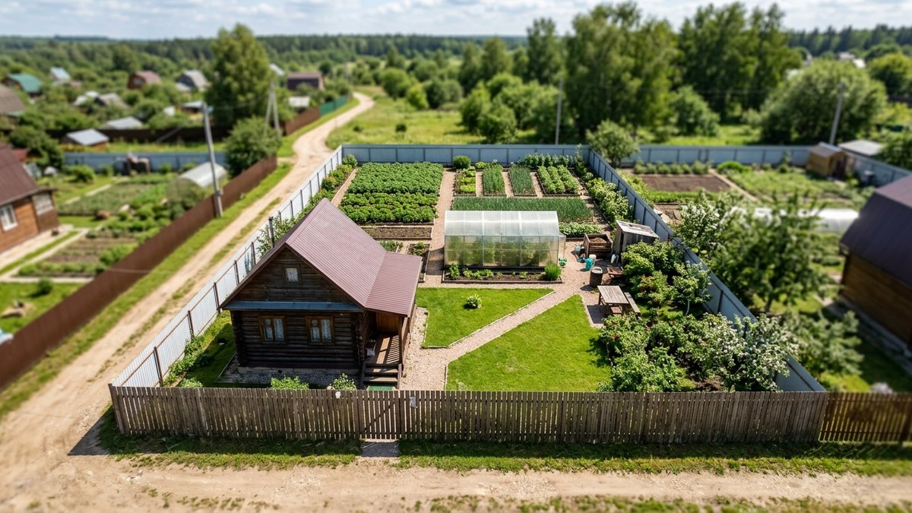
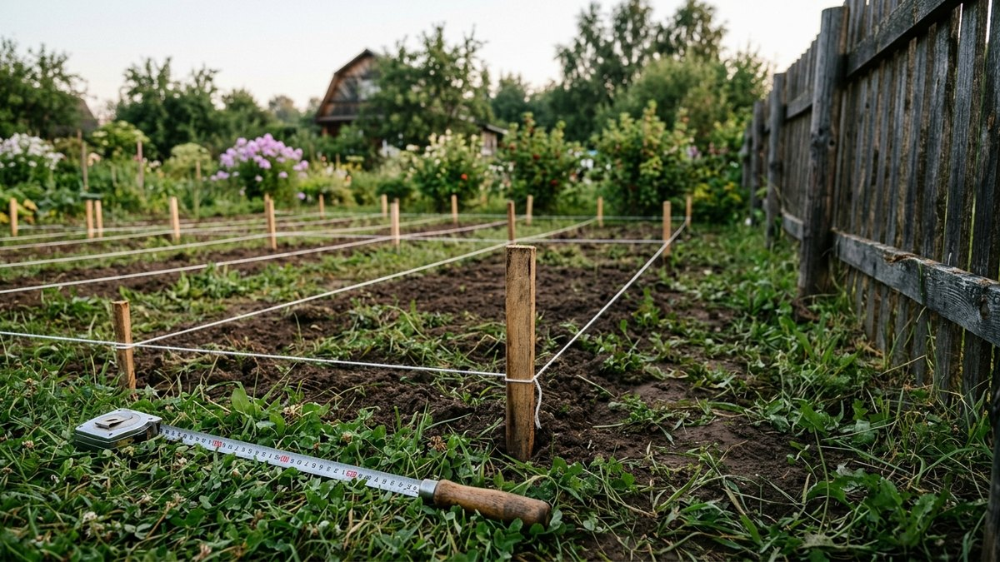
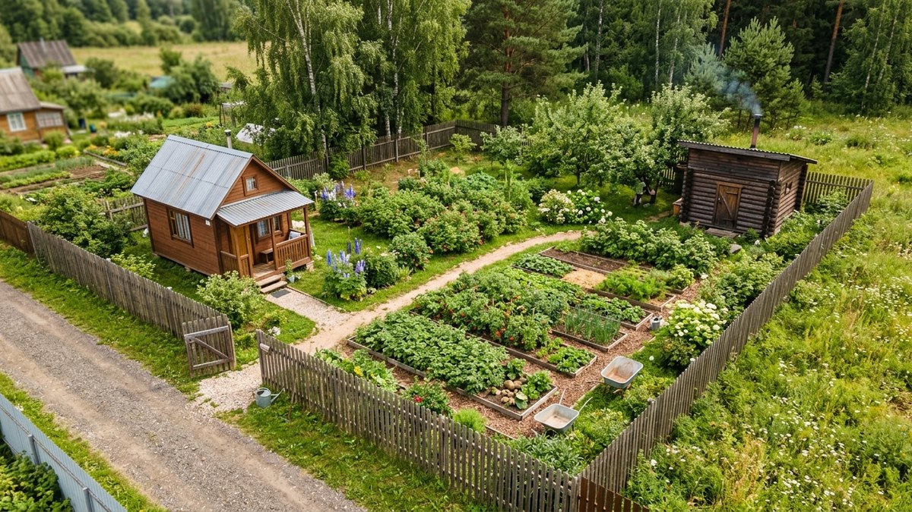
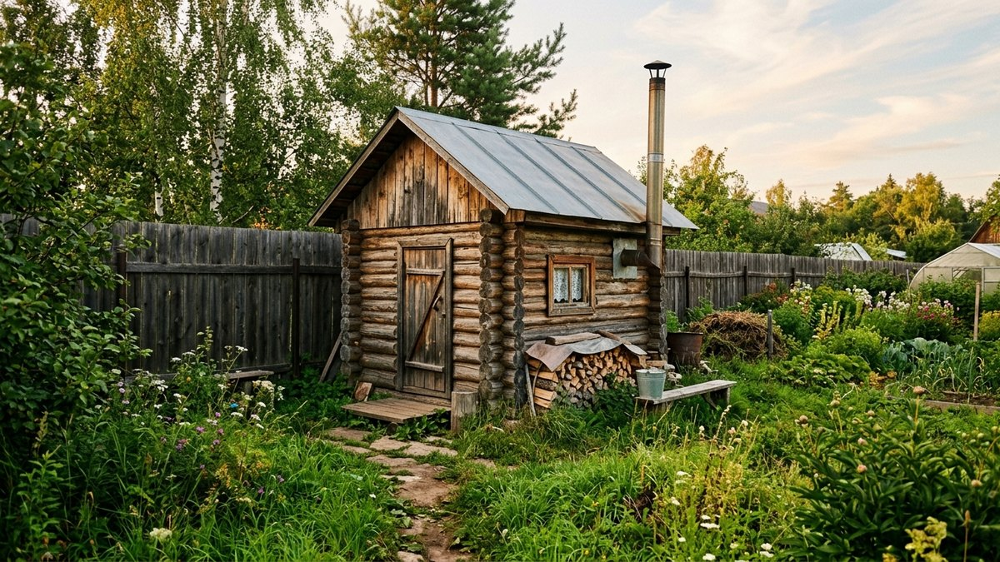
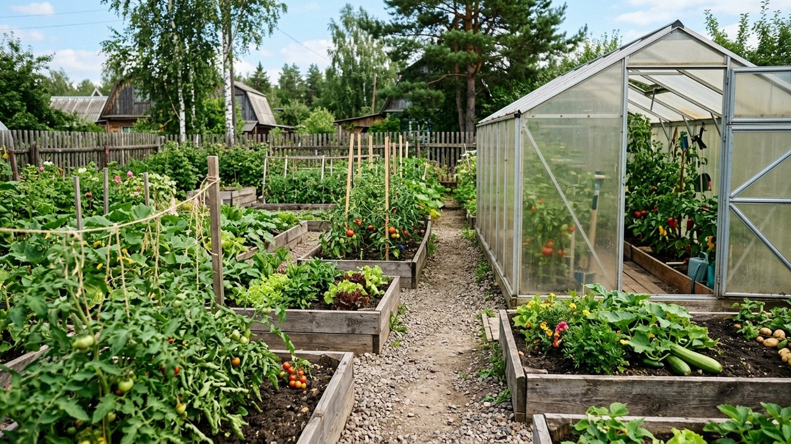
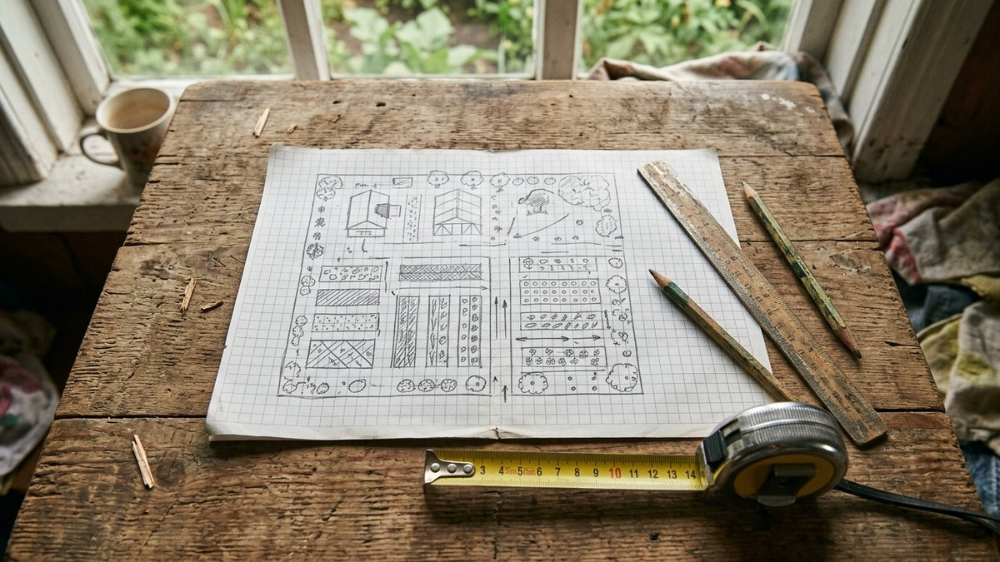

# Планировка участка 6 соток: что реально поместится и 3 рабочие схемы

Планировка участка 6 соток — это задача не на красоту, а на
арифметику. На 600 м² каждый отступ от забора и каждый метр между
домом и баней съедают заметную долю земли, а ошибка в первом колышке
потом стоит переноса постройки. Разберём, что реально помещается на
шести сотках, как форма участка меняет схему, и дадим калькулятор:
вводите размеры своего участка и сразу видите, влезает ли отдельная
баня с положенными 8 метрами от дома и сколько земли останется под
огород.

## Что помещается на 6 сотках: честная раскладка

Шесть соток — это 600 м². Типичная нарезка в СНТ — 20×30 м, реже
15×40 м (узкий участок) или 24×25 м (почти квадрат). Площадь одна,
а возможности у этих трёх участков разные, об этом ниже.

Сначала площадь. Типовой набор для дачи на шести сотках:

| Объект | Габариты | Площадь |
|---|---|---|
| Дом | 6×6 или 8×8 м | 36–64 м² |
| Баня | 3×4 м | 12 м² |
| Теплица | 3×6 м | 18 м² |
| Хозблок или сарай | 2×3 м | 6 м² |
| Площадка под машину | 3×6 м | 18 м² |
| Дорожки | — | 40–60 м² |
| **Итого застройка** | | **130–180 м²** |
| **Остаётся под сад, огород, отдых** | | **420–470 м²** |

По площади всё помещается с запасом: даже с полным набором построек
под огород и сад остаётся больше двух третей участка. Проблема
шести соток не в площади, а в **отступах**. Нормы расстояний от
границ и между постройками одинаковы для 6 и для 20 соток, и на
маленьком участке они съедают непропорционально много.

Для сравнения: на 10 сотках тот же набор построек занимает около
30% участка, и размещение там почти не ограничено. Разбор с баней,
гаражом и бассейном — в статье
[планировка участка 10 соток с баней и гаражом](https://mir-doma.pro/planirovka-uchastka-10-sotok-s-baney-garazhom/).
На шести сотках свобода заканчивается раньше, поэтому считать нужно
до покупки материалов.

## Отступы, которые съедают участок

Ориентиры по СП 53.13330 (своды правил для садоводческих
территорий). Точные значения для своего СНТ проверьте в действующей
редакции и в правилах землепользования поселения:

- **Дом** — 5 м от улицы, 3 м от границы с соседом.
- **Хозпостройки, баня, теплица** — около 1 м от границы с соседом.
- **Дом — баня** — от 8 м, если баня стоит отдельно.
- **Колодец или скважина — туалет, компост** — от 8 м.
- **Деревья** — высокие 4 м от границы, средние 2 м, кустарник 1 м.

Посчитаем, что это значит для участка 20×30 м. Полоса 5 м вдоль улицы
под дом не годится, это 100 м², шестая часть участка. Правда, её
можно отдать под парковку, цветник и въезд. Ещё по 3 м с боков: для
дома остаётся полоса шириной 14 м. На 10 сотках такие потери почти
незаметны, на шести они определяют, куда вообще можно поставить дом.

Где дом выгоднее всего ставить по сторонам света и почему его обычно
прижимают к одной стороне, а не ставят по центру, разобрано в статье
[расположение дома на участке](https://mir-doma.pro/raspolozhenie-doma-na-uchastke/).
Для 6 соток вывод тот же, но жёстче: дом по центру делит участок на
два неудобных куска, и ни один из них не годится под огород.

## Три схемы под форму участка

### Схема 1. Участок 20×30 м: дом у улицы, огород в глубине

Самая распространённая нарезка и самая простая схема.

- **У улицы** — дом, прижатый к одной боковой границе (3 м) и
  отступивший 5 м от улицы. Перед домом парковка 3×6 м.
- **Середина** — зона отдыха с беседкой или террасой, от неё дорожка
  в глубину.
- **Глубина** — огород и теплица на солнечной стороне, хозблок и
  компост в дальнем углу.
- **Баня** — в дальнем углу напротив дома, по диагонали.

С домом 6×6 м от его угла до бани 3×4 в противоположном дальнем углу
получается около 15 м, так что 8 метров выдерживаются с большим
запасом. С домом 8×8 м выходит около 13 м — тоже с запасом.

### Схема 2. Узкий участок 15×40 м: цепочка зон

Узкий участок нельзя делить «лево/право», только «ближе/дальше».
Зоны выстраиваются цепочкой: дом у улицы, за ним отдых, дальше огород,
в конце хоззона и баня.

Главная сложность — ширина. После 3-метровых отступов от соседей для
дома остаётся 9 м, поэтому дом 8×8 встаёт почти впритык, а 6×8
(узкой стороной к улице) заметно свободнее. Баня на узком участке
выносится в глубину, и 8 метров набираются легко: у узкого участка
длины в избытке. Приёмы для вытянутых участков — дорожка вдоль одной
стороны, зоны-«комнаты», зрительное расширение — подробно разобраны
в статье [планировка узкого участка](https://mir-doma.pro/planirovka-uzkogo-uchastka-10-sotok/).
Они работают и на шести сотках.

### Схема 3. Почти квадрат 24×25 м: диагональ

Квадратный участок самый удобный для зонирования и самый коварный для
бани: глубины мало, 8 метров «в линию» от дома набрать трудно.
Решение — диагональ. Дом в переднем углу, баня в дальнем
противоположном. Даже при доме 8×8 м расстояние по диагонали между
ближайшими углами построек выходит около 11 м.

Середину участка при такой схеме занимает зона отдыха и огород, а
дорожка от дома к бане идёт по диагонали. Её удобно совместить с
главной садовой дорожкой, как устроить её без луж и провалов, описано
в статье [садовые дорожки своими руками](https://mir-doma.pro/sadovye-dorozhki-svoimi-rukami/).

## Калькулятор: что поместится на вашем участке

Калькулятор проверяет главное ограничение шести соток — встанет ли
отдельная баня в 8 м от дома — сразу тремя способами: в линию по
глубине, рядом по ширине и по диагонали. Заодно он считает, сколько
земли останется под огород и сад. Отступы заложены из раздела выше:
5 м от улицы и 3 м от соседей для дома, 1 м от границы для бани.

<!-- wp:html -->

  
Калькулятор планировки: влезет ли баня и сколько останется под огород

  <label class="md-calc__label" for="md6W">Ширина участка (вдоль улицы), м</label>
  <input type="number" id="md6W" class="md-calc__input" min="8" step="0.5" value="20">
  <label class="md-calc__label" for="md6L">Глубина участка, м</label>
  <input type="number" id="md6L" class="md-calc__input" min="10" step="0.5" value="30">
  <label class="md-calc__label" for="md6H">Дом</label>
  <select id="md6H" class="md-calc__input">
    <option value="6x6">6×6 м</option>
    <option value="6x8">6×8 м (узкой стороной к улице)</option>
    <option value="8x8" selected>8×8 м</option>
    <option value="9x9">9×9 м</option>
  </select>
  <label class="md-calc__label" for="md6B">Баня</label>
  <select id="md6B" class="md-calc__input">
    <option value="0">Без бани</option>
    <option value="3x4" selected>Отдельная 3×4 м</option>
    <option value="4x6">Отдельная 4×6 м</option>
  </select>
  <label class="md-calc__label" for="md6G">Теплица 3×6 м</label>
  <select id="md6G" class="md-calc__input">
    <option value="1" selected>Да</option>
    <option value="0">Нет</option>
  </select>
  
Введите размеры участка

<!-- /wp:html -->

Числа в калькуляторе — прикидка до выхода на участок, а не проект.
Он не учитывает колодец, септик и деревья соседей. Разметку всё равно
делайте шнуром и колышками на месте, до заказа фундамента.

## Баня на 6 сотках: восемь метров решают всё

Отдельно стоящую баню от дома отделяют 8 м: баня пожароопасна и даёт
много влаги. На десяти сотках это просто условие, на шести — главное
ограничение всей планировки. Если калькулятор показал, что 8 м не
набираются, есть три честных выхода:

1. **Уменьшить одну из построек.** Баня 3×4 м вместо 4×6 часто
   решает проблему, а парилке на 2–3 человека больше и не нужно.
2. **Диагональ вместо линии.** На квадратном участке это даёт 3–4
   лишних метра без всяких затрат.
3. **Баня, пристроенная к дому или под одной крышей.** Разрыв 8 м
   касается отдельно стоящих построек. Пристроенная баня — часть дома,
   но к ней свои требования: противопожарная стена, дымоход по
   нормам, хорошая вентиляция. Этот вариант лучше обсудить с тем, кто
   будет делать проект.

Ещё одна деталь, о которой на маленьком участке забывают: слив из
бани. Стоки нельзя пускать в грунт рядом с колодцем, и на шести сотках
8 м от бани до колодца тоже ограничивают выбор места. Куда отводить
воду и когда нужен септик, разобрано в статье
[септик для дачи](https://mir-doma.pro/septik-dlya-dachi/).

## Огород и сад на шести сотках

Из 400 с лишним свободных метров под грядки обычно уходит 250–300 м²,
остальное — сад, проходы и отдых. Этого хватает на картошку для
семьи из двух-трёх человек, грядки с зеленью и овощами и теплицу, но
не на всё сразу в полном объёме. Практичный подход — меньше площадь,
выше отдача:

- **Грядки-короба** вместо рядков на плоской земле: проходы узкие,
  земля прогревается раньше, сорняков меньше.
- **Теплица на самом солнечном месте**, торцами на север и юг, не в
  тени дома.
- **Плодовые деревья по периметру**, с отступами от соседской границы
  (4 м для высоких, 2 м для средних). Колоновидные яблони занимают
  минимум места и подходят для маленьких участков.
- **Кустарники вдоль забора**, 1 м от границы. Смородина и малина
  одновременно работают как живая изгородь.

Типичные промахи зонирования — огород в тени дома, туалет рядом с
колодцем, дорожки, которые ведут не туда, — собраны в статье
[ошибки планировки участка](https://mir-doma.pro/oshibki-planirovki-uchastka/).
На шести сотках каждая из них обходится дороже, потому что переносить
что-то некуда.

## Порядок планировки: от бумаги к колышкам

1. **Снимите точные размеры участка** и отметьте стороны света, въезд,
   колодец или скважину, соседские постройки у границы.
2. **Нарисуйте план в масштабе** — на миллиметровке или в любой
   программе. 1 клетка = 1 м.
3. **Нанесите запретные полосы**: 5 м от улицы, 3 м от соседей для
   дома, 8 м от колодца для туалета и компоста.
4. **Поставьте дом** — от него отсчитывается всё остальное.
5. **Впишите баню** по одной из схем выше и проверьте 8 м.
6. **Разместите теплицу и огород** на солнечной стороне, хозблок и
   компост в дальнем углу.
7. **Проложите дорожки** по кратчайшим маршрутам: дом — туалет, дом —
   баня, дом — теплица.
8. **Перенесите план на участок** шнуром и колышками и пройдите его
   ногами до начала стройки.

Если участок ещё только выбираете, проверьте его до покупки: форма,
уклон, подъезд и выделенная мощность электричества влияют на
планировку сильнее, чем кажется по объявлению. Чек-лист проверки —
в статье [как выбрать земельный участок для дачи](https://mir-doma.pro/kak-vybrat-zemelnyy-uchastok-dlya-dachi/).

## Частые ошибки

- **Дом в центре участка.** Делит 600 м² на два неудобных куска, ни
  один не годится под огород.
- **Планировка без учёта соседских построек.** Отступы считаются от
  границы, но свет и тень — от реального соседского дома и сарая.
- **Баня «на глаз».** Сэкономленные 2–3 метра превращаются в
  нарушение, которое всплывает при регистрации или в споре с соседом.
- **Теплица в тени дома.** На маленьком участке соблазн поставить её
  «куда влезет» велик, но теплица в тени бесполезна.
- **Нет места под машину.** Парковку планируют сразу, иначе машина
  встаёт на газон или в проезд.

## Частые вопросы

### Какой дом можно построить на 6 сотках

По площади — практически любой разумный дачный: 6×6, 8×8, даже 9×9 м
с мансардой. Ограничивают отступы: на участке шириной 15 м после 3 м
с каждой стороны остаётся 9 м под дом. Максимальный процент застройки
задают правила землепользования конкретного поселения, их стоит
проверить до проекта.

### Можно ли на 6 сотках поставить дом и баню

Да, на большинстве участков. Отдельная баня требует 8 м от дома, и на
20×30 и 15×40 это набирается легко. На квадратном участке —
по диагонали. Если не набирается никак, остаётся баня, пристроенная к
дому.

### Сколько места остаётся под огород на 6 сотках

С домом, баней, теплицей, хозблоком, парковкой и дорожками — обычно
400–470 м², из них под грядки 250–300 м², остальное — сад и отдых. Точно под ваши размеры посчитает калькулятор выше.

### Как расположить дом на участке 6 соток

Прижать к одной боковой границе (3 м) и отступить 5 м от улицы. Так
вся глубина и одна сторона участка остаются единым куском под сад и
огород. Солнечную сторону оставляйте за огородом и теплицей, а не за
глухой стеной дома.

### Где ставить туалет и компост на маленьком участке

В дальнем углу, не ближе 8 м от колодца или скважины (своего и
соседского), с подветренной стороны от дома.

## Итог

Шесть соток вмещают полноценную дачу с домом, баней, теплицей и
огородом. Ограничивает не площадь, а отступы. Поэтому планировка на
маленьком участке начинается с расчёта: запретные полосы, дом у одной
границы, баня по диагонали или в глубине, огород на солнце. Проверьте
свои размеры калькулятором, нарисуйте план в масштабе и только потом
выходите с колышками. Общие принципы зонирования для участков побольше —
в статье [планировка участка 10 соток](https://mir-doma.pro/planirovka-uchastka-10-sotok/).
