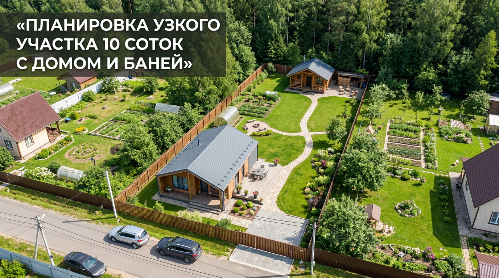
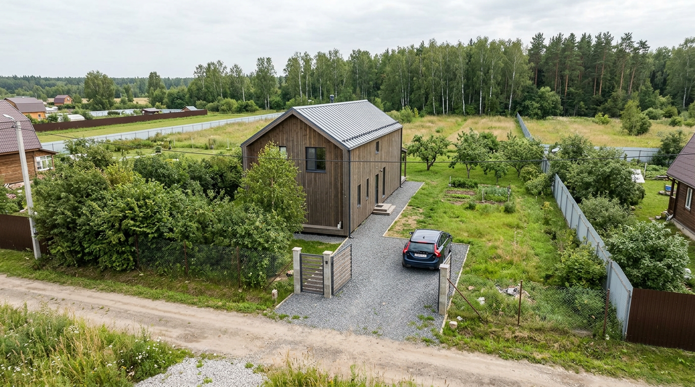
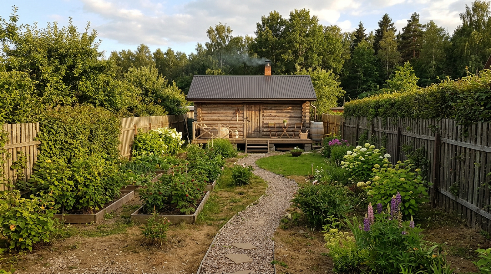
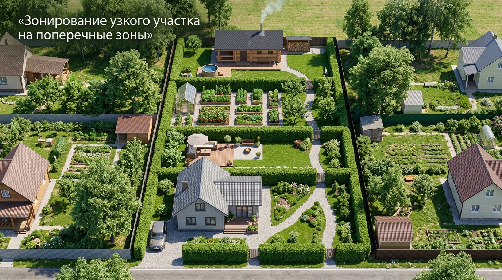
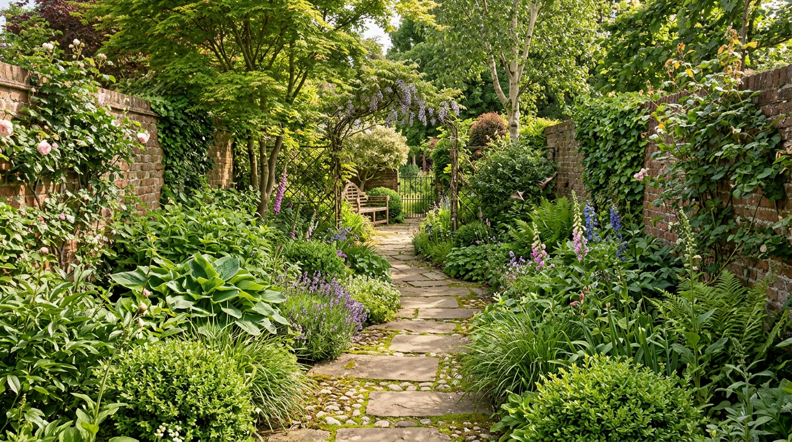
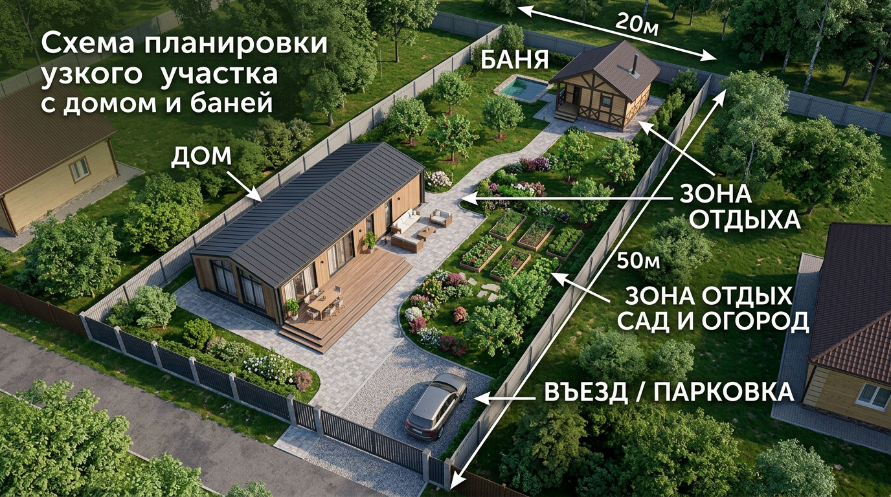

Узкий вытянутый участок 10 соток — частый случай в дачных посёлках, и спланировать его сложнее, чем квадратный: нужно разместить и дом, и баню, и зоны отдыха так, чтобы участок не превратился в длинный неуютный коридор. Но при правильном подходе даже узкая полоса земли становится удобной и красивой. В этой статье разберём планировку узкого участка 10 соток с домом и баней: где их лучше поставить, как зонировать вытянутое пространство, какие приёмы зрительно расширяют участок и какие нормы учесть.

Это одна из статей цикла о планировке: общие принципы зонирования подробно разобраны в основной статье — [планировка участка 10 соток](https://mir-doma.pro/planirovka-uchastka-10-sotok/), а здесь сосредоточимся именно на узкой форме.

## 📐 Особенности узкого участка

Узким обычно называют участок, у которого ширина в 2–3 раза меньше длины — например, 15×66 или 20×50 метров при тех же 10 сотках. У такой формы есть свои сложности:

- **Эффект коридора** — вытянутое пространство кажется тесным и длинным.
- **Сложно разместить постройки** так, чтобы они не загораживали друг друга и свет.
- **Узкий въезд** ограничивает маневрирование машины.
- **Соседи близко** с двух длинных сторон, поэтому важна приватность.

Зато у узкого участка есть и плюс: его легко разделить на последовательные зоны и создать ощущение «путешествия» по саду от одной зоны к другой. К тому же узкие участки часто дешевле, а при грамотной планировке ничем не уступают квадратным по удобству.

## 🏠 Где разместить дом

Дом на узком участке обычно ставят **у одного из торцов — со стороны въезда**, ближе к улице. Это освобождает остальную, бо́льшую часть земли под сад, зону отдыха и баню. Дом разворачивают узкой стороной к улице, вытягивая вдоль участка, — так он занимает меньше драгоценной ширины.

Важно соблюсти отступы: дом размещают примерно в 5 метрах от улицы и не менее 3 метров от боковых границ. На узком участке выдержать боковые отступы особенно важно, ведь ширина и так ограничена. Если позволяет ширина, гараж или навес для машины пристраивают к дому со стороны въезда — так не приходится тянуть подъездную дорожку вглубь участка, отнимая место у сада.

## 🧖 Где поставить баню

Баню на узком участке логично разместить **в глубине, у дальнего торца**, противоположного дому. Тогда участок получает две «опорные точки» — дом у входа и баню в глубине, а между ними располагаются сад и зона отдыха. Такое разнесение удобно и функционально: шумные и «мокрые» процессы в бане не мешают дому, а путь к бане через сад становится приятной частью отдыха.

Баню можно поставить отдельно или объединить с зоной отдыха — рядом с ней удобно сделать террасу, купель или место для барбекю. При размещении бани учитывают нормы: расстояние от бани до жилого дома (часто от 8 метров по противопожарным требованиям), до границы соседа (около 1 метра от стены) и до колодца. Баня — постройка с водой, поэтому заранее продумывают отведение стоков, например [септик](https://mir-doma.pro/septik-dlya-dachi/) или дренаж.

## 🗺️ Как зонировать узкий участок

Главный приём для узкого участка — **делить его поперёк на несколько зон**, идущих одна за другой. Так длинная полоса превращается в череду уютных пространств, а не в один коридор.

Типичная последовательность зон от въезда:

1. **Въездная зона и дом** — у улицы, с парковкой.
2. **Зона отдыха** — за домом, в тихом уголке (беседка, газон, мангал).
3. **Садово-огородная зона** — в середине или ближе к солнечной стороне.
4. **Баня и хозяйственная зона** — в глубине, у дальнего торца.

Зоны отделяют друг от друга живыми изгородями, перголами, шпалерами или цветниками — так каждая зона воспринимается отдельной «комнатой» сада. Переходя из одной в другую, человек не видит весь участок сразу, и тот перестаёт восприниматься как длинный коридор — в этом и состоит главный секрет планировки вытянутой земли.

## 🌿 Приёмы, которые расширяют узкий участок

Чтобы участок не казался коридором, дизайнеры используют несколько хитростей:

- **Извилистые дорожки** вместо прямых — они «ломают» длину и ведут взгляд плавно.
- **Поперечные акценты** — клумбы, арки, перголы поперёк участка зрительно сокращают длину.
- **Разные уровни** — приподнятые грядки, террасы, ступени добавляют объём.
- **Живые изгороди и кулисы** из растений делят пространство и скрывают границы.
- **Круглые и квадратные элементы** — газон, площадка, клумба округлой формы уравновешивают вытянутость.

Эти приёмы вместе создают ощущение простора там, где его, казалось бы, нет. Подробнее о покрытии для маршрутов — в статье о [садовых дорожках](https://mir-doma.pro/sadovye-dorozhki-svoimi-rukami/).

## 📏 Нормы и отступы

При планировке узкого участка нормы соблюдать особенно важно — ширина ограничена, и ошибки приводят к спорам с соседями. Ориентировочно:

- дом — от 5 метров от улицы и не менее 3 метров от боковых границ;
- баня — от 8 метров от жилого дома (противопожарный разрыв) и около 1 метра от границы;
- хозпостройки — около 1 метра от границы участка;
- высокие деревья — 4 метра, кустарники — 1 метр от границы.

Точные значения зависят от действующих норм (СП, СанПиН) и местных правил, поэтому их обязательно уточняют перед стройкой.

## 🛠️ Пример планировки узкого участка с домом и баней

Для участка 20×50 метров удачное решение выглядит так: у въезда — дом, вытянутый вдоль участка, с парковкой перед ним. За домом — зона отдыха с беседкой и газоном, отделённая живой изгородью. В средней части — сад и компактный огород с грядками. В глубине, у дальнего торца, — баня с небольшой террасой и хозблок. Через весь участок ведёт извилистая дорожка, связывающая зоны и зрительно сглаживающая длину. По периметру — забор, вдоль него — посадки для приватности.

Такая схема разбивает узкую полосу на четыре комфортные зоны и делает участок удобным и уютным. Если баня нужна с гаражом или бассейном, их тоже размещают в глубине рядом с зоной отдыха, объединяя в единый банно-рекреационный блок.

## 🛡️ Частые ошибки

- **Прямая дорожка через весь участок.** Она подчёркивает длину и усиливает эффект коридора — лучше извилистая.
- **Все постройки вдоль одной стороны.** Это делает участок ещё уже визуально; зоны лучше чередовать поперёк.
- **Игнор отступов.** На узком участке нарушение боковых отступов почти неизбежно ведёт к конфликтам с соседями.
- **Нет приватности.** Близкие соседи с двух сторон требуют живых изгородей или забора с озеленением.
- **Баня вплотную к дому.** Нарушает противопожарные нормы — выдерживайте разрыв.

## ❓ Частые вопросы

### Как разместить дом и баню на узком участке?

Дом ставят у въезда, со стороны улицы, вытянув его вдоль участка, а баню — в глубине, у дальнего торца. Так участок получает две опорные точки, а между ними размещаются зона отдыха и сад. Между домом и баней выдерживают противопожарный разрыв (обычно от 8 метров).

### Как зонировать узкий вытянутый участок?

Узкий участок делят поперёк на последовательные зоны: въезд с домом, зона отдыха, сад-огород, баня и хозблок в глубине. Зоны отделяют живыми изгородями и перголами, а связывают извилистой дорожкой — так длинная полоса превращается в череду уютных пространств.

### Как зрительно расширить узкий участок?

Помогают извилистые дорожки вместо прямых, поперечные акценты (арки, клумбы, перголы), разные уровни и террасы, живые изгороди-кулисы и округлые элементы — газон или площадка. Эти приёмы «ломают» длину и создают ощущение простора.

### На каком расстоянии ставить баню от дома?

Обычно баню размещают не ближе 8 метров от жилого дома из противопожарных соображений, около 1 метра от границы соседнего участка и на санитарном расстоянии от колодца. Точные нормы зависят от действующих правил, их уточняют перед строительством.

### Какие размеры у узкого участка 10 соток?

Узким считается участок, у которого длина в 2–3 раза больше ширины. При площади 10 соток (1000 м²) это, например, 20×50 или 15×66 метров. Чем сильнее вытянут участок, тем важнее грамотное поперечное зонирование.

### Где сделать огород на узком участке?

Огород и грядки размещают на самой солнечной части участка, чаще в средней зоне или ближе к южной стороне, чтобы их не затеняли дом, баня и забор. На узком участке удобны компактные приподнятые грядки вдоль дорожки.

## Заключение

Планировка узкого участка 10 соток с домом и баней — задача решаемая, если использовать главный приём: делить вытянутое пространство поперёк на последовательные зоны. Дом ставят у въезда, баню — в глубине, между ними размещают отдых и сад, а извилистые дорожки, живые изгороди и поперечные акценты избавляют участок от эффекта коридора. Соблюдайте отступы и приватность — и узкая полоса земли станет удобным, красивым и уютным участком, ничем не уступающим квадратному. Больше о принципах зонирования — в основной статье о [планировке участка 10 соток](https://mir-doma.pro/planirovka-uchastka-10-sotok/).

А как устроен ваш узкий участок? Делитесь решениями в комментариях и подписывайтесь, чтобы не пропустить новые статьи о планировке и обустройстве дачи.
