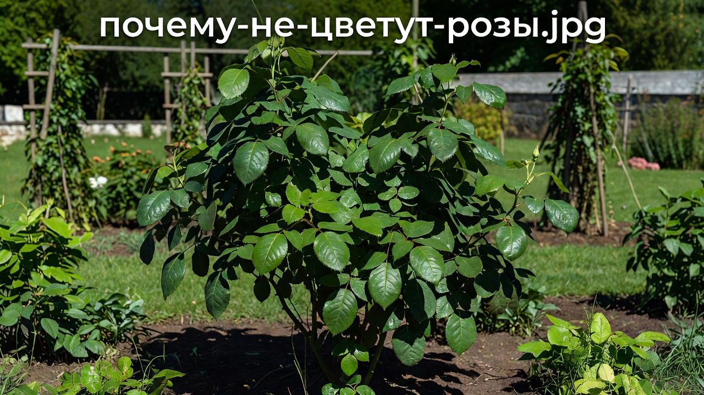
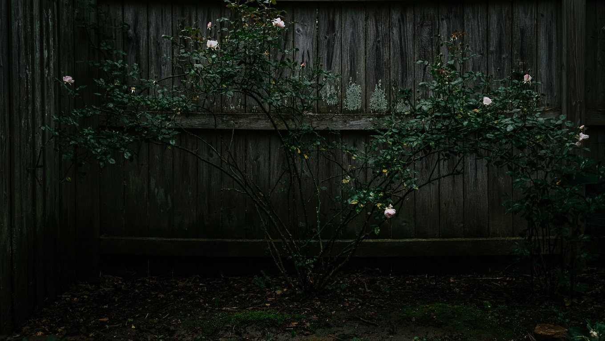
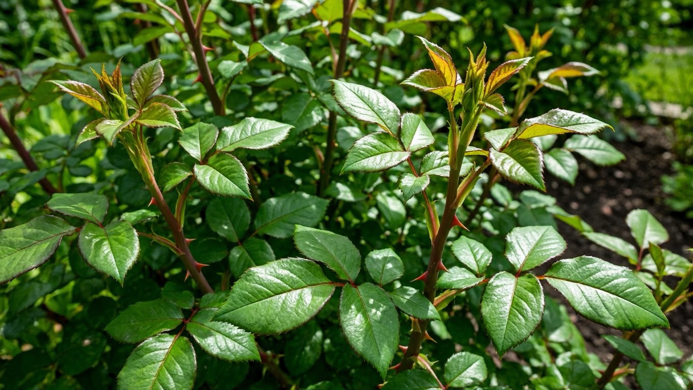
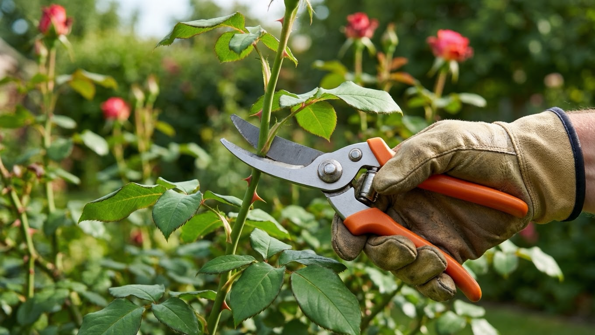
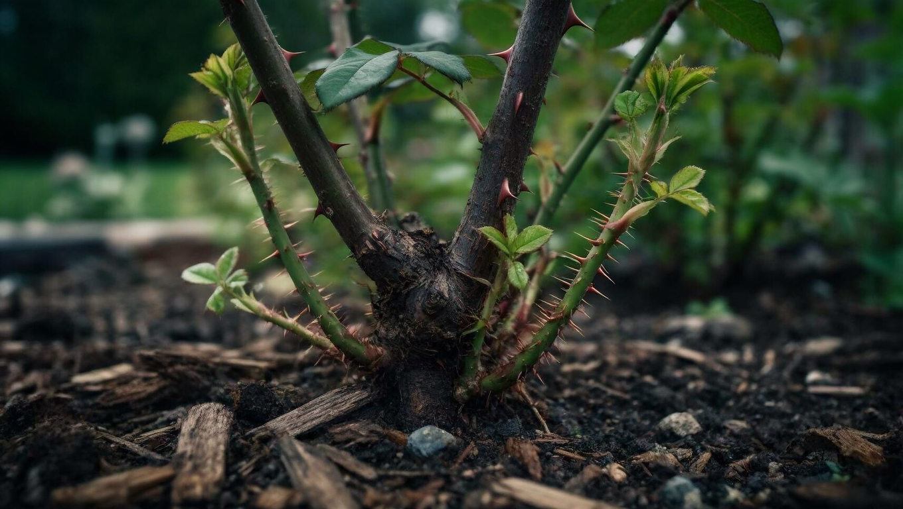
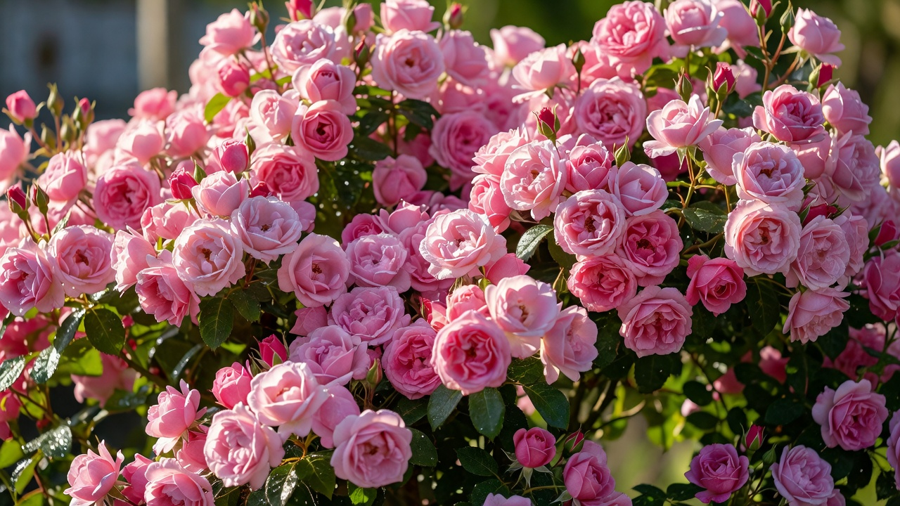

Роза растёт, наращивает пышную зелень, а цветов всё нет — знакомая и обидная ситуация. Причин у отсутствия цветения несколько, и почти все они устранимы: чаще дело не в самом кусте, а в условиях и уходе. Разберём, почему не цветут розы и что делать, чтобы куст перестал «жировать» листвой и наконец покрылся бутонами.

## 🌹 Почему роза не цветёт: главные причины

Если роза здорова, но не цветёт, виновата одна из типичных причин: мало солнца, перекорм азотом, отсутствие или неправильная обрезка, ошибки посадки, дикая поросль от подвоя или ослабление куста болезнями. Разберём каждую и что с ней делать.

## ☀️ Розе не хватает солнца

Самая частая причина. Роза — светолюбивое растение, ей нужно **минимум 5–6 часов прямого солнца** в день. В тени и полутени куст вытягивается, наращивает листву, но почти не закладывает бутоны. Если роза посажена под деревом, у забора или с северной стороны дома, скудное цветение почти неизбежно. Решение — пересадить куст на солнечное место (осенью или ранней весной) или проредить затеняющие ветви соседних растений.

## 🍽️ Перекорм азотом и нехватка питания

Вторая классическая ошибка — избыток азота. Азотные удобрения и свежий навоз гонят мощную зелёную массу **в ущерб цветению**: куст «жирует» — крупные листья, толстые побеги, а бутонов нет. Для цветения розе нужны фосфор и калий. Что делать:

- прекратить азотные подкормки (особенно во второй половине лета);
- перейти на фосфорно-калийные удобрения, которые стимулируют бутонизацию.

Обратная ситуация — полное истощение почвы, когда розу вообще не кормят, — тоже мешает цветению. Нужен баланс; общие принципы питания растений разбирали в статье про [летние подкормки](https://mir-doma.pro/letnie-podkormki-ovoshchey/).

## ✂️ Нет обрезки или неправильная обрезка

Без обрезки куст загущается, стареет и цветёт всё слабее. Многие сорта цветут на молодых побегах текущего или прошлого года, поэтому старые ветви нужно вовремя убирать. Но опасна и обратная крайность — слишком сильная или неправильная обрезка, когда срезают побеги, на которых закладывались бутоны (частая ошибка с плетистыми розами, цветущими на прошлогодних плетях). Решение — освоить правильную обрезку по группе розы: убирать сухое и старое, но не срезать под ноль то, что должно зацвести.

## 🌱 Ошибки посадки

Иногда причина заложена ещё при посадке:

- **Неправильное заглубление прививки.** Слишком глубокая или, наоборот, оголённая прививка ослабляет куст и задерживает цветение. Место прививки должно быть заглублено примерно на 3–5 см.
- **Молодой куст.** В первый год после посадки роза часто наращивает корни и не цветёт или цветёт слабо — это нормально, дайте ей год окрепнуть.
- **Неудачное место** — сквозняк, застой воды, бедная почва — тоже сказываются на цветении.

Как правильно посадить розу и ухаживать за ней, подробно разобрали в основной статье — [розы: посадка и уход](https://mir-doma.pro/rozy-posadka-i-uhod/).

## 🌿 Дикая поросль от подвоя

Отдельный случай — когда «роза выродилась в шиповник». Большинство сортовых роз привиты на подвой шиповника. Если из-под земли, **ниже места прививки**, пошли дикие побеги и их не удалять, шиповник постепенно глушит культурный сорт — куст растёт, но цветёт мелкими простыми цветками шиповника или не цветёт вовсе. Отличить поросль легко: у неё тонкие побеги, мелкие светлые листья (часто 7 листочков) и обилие шипов. Такую поросль вырезают у самого основания, отгребая землю до корня, а не просто срезают на уровне почвы.

## 🐛 Болезни и вредители ослабляют куст

Ослабленная роза тратит силы на выживание, а не на цветение. Болезни (чёрная пятнистость, мучнистая роса) и вредители (тля, паутинный клещ) угнетают куст, и первый их признак — пожелтение и опадение листьев. Почему желтеет листва и что делать, разбирали отдельно: [почему желтеют листья у роз](https://mir-doma.pro/zhelteyut-listya-u-roz/). Здоровый, не поражённый вредителями куст цветёт куда охотнее.

## 🎯 Что делать: по шагам

Чтобы вернуть розе цветение, действуйте по порядку:

1. **Проверьте освещение** — если куст в тени, запланируйте пересадку на солнце.
2. **Пересмотрите подкормки** — уберите азот, добавьте фосфор и калий.
3. **Наладьте обрезку** — уберите старое и загущающее, но не срезайте побеги с бутонами.
4. **Осмотрите основание** — вырежьте дикую поросль от подвоя.
5. **Проверьте здоровье** — вылечите болезни и вредителей.
6. **Дайте время** — молодому кусту нужен год-два, чтобы выйти на полное цветение.

## 🕰️ Когда ждать цветения

Иногда роза «не цветёт» просто потому, что ещё не время:

- **После посадки** молодой куст выходит на полноценное цветение обычно на второй год — в первый сезон он наращивает корни.
- **Повторноцветущие розы** (чайно-гибридные, флорибунда, многие современные сорта) цветут волнами за сезон. Если куст отцвёл и стоит без бутонов — возможно, он просто набирает силы к следующей волне.
- **Однократно цветущие** сорта (часть плетистых и парковых) цветут раз за сезон, обычно в июне-июле. Вне этого окна бутонов не будет — и это норма, а не проблема.
- **После пересадки или сильной обрезки** цветение закономерно сдвигается — кусту нужно восстановиться.

Поэтому, прежде чем «лечить» розу, уточните тип и сорт: возможно, куст цветёт ровно так, как ему положено.

## ❓ Частые вопросы

**Почему роза не цветёт в первый год?**
Это нормально: молодой куст сначала наращивает корни и побеги. Полноценное цветение обычно приходит на второй год после посадки.

**Почему роза даёт только листья и не цветёт?**
Чаще всего от избытка азота (куст «жирует») или нехватки солнца. Уберите азотные подкормки, перейдите на фосфор и калий и убедитесь, что розе хватает света.

**Почему плетистая роза не цветёт?**
Частая причина — неправильная обрезка: у многих плетистых роз бутоны закладываются на прошлогодних плетях, и если срезать их весной, цветения не будет. Такие розы обрезают щадяще.

**Что делать, если роза растёт, но не цветёт?**
Проверить по порядку: солнце, азот в подкормках, обрезку, дикую поросль от подвоя и здоровье куста. Обычно причина в одном из этих пунктов.

**Почему роза «превратилась в шиповник»?**
Это разросшаяся дикая поросль подвоя, которую не удаляли. Побеги шиповника из-под прививки нужно вырезать у самого корня, иначе они заглушат сортовую розу.

**Чем подкормить розу, чтобы она зацвела?**
Фосфорно-калийными удобрениями — они стимулируют закладку бутонов. Азот в этот период исключают, иначе куст будет наращивать листву вместо цветов.

---

Отсутствие цветения — почти всегда решаемая проблема: дайте розе солнце, правильное питание и обрезку, уберите дикую поросль — и куст отблагодарит вас бутонами. А полный уход за розой от посадки до зимовки собран в основной статье [розы: посадка и уход](https://mir-doma.pro/rozy-posadka-i-uhod/).
