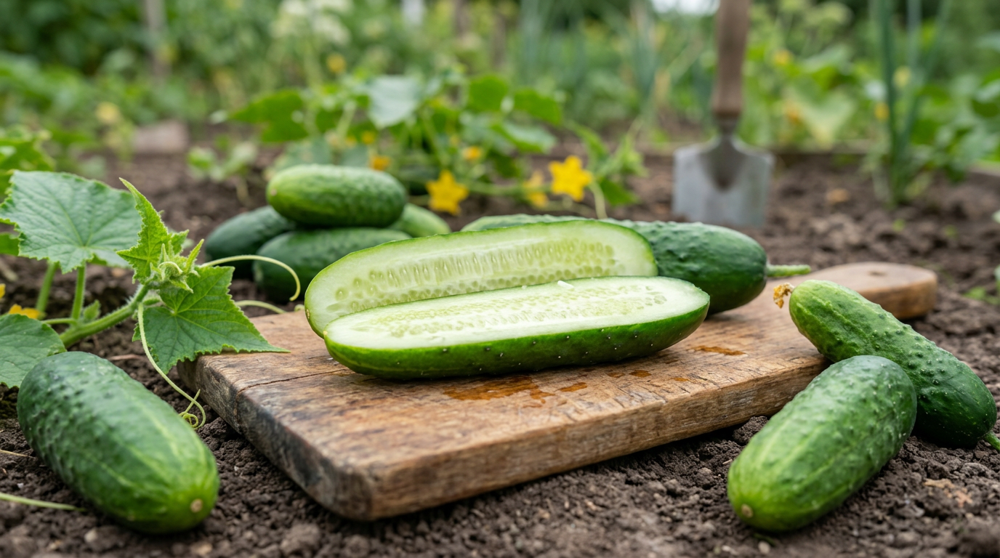
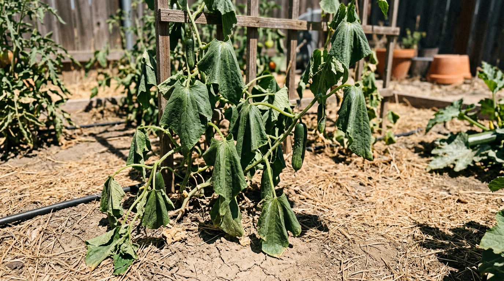
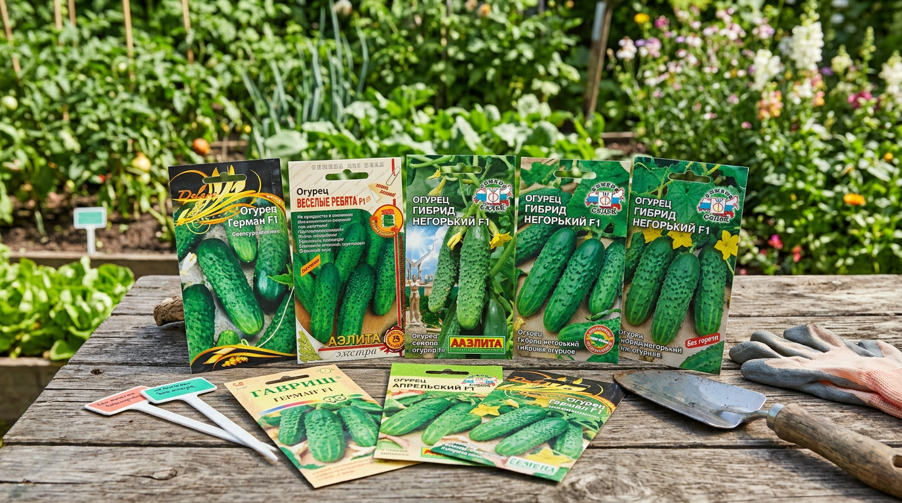
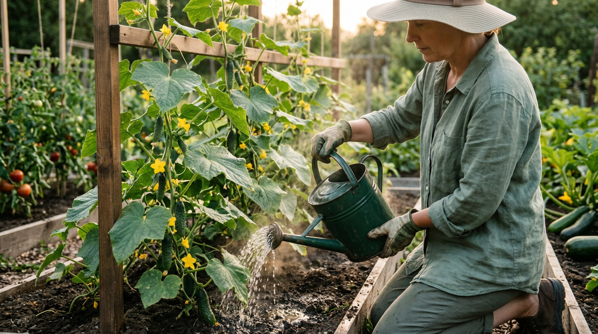
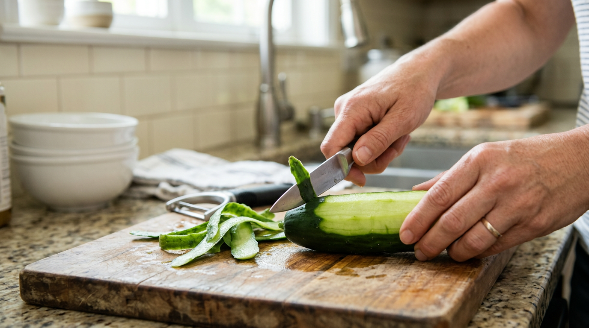
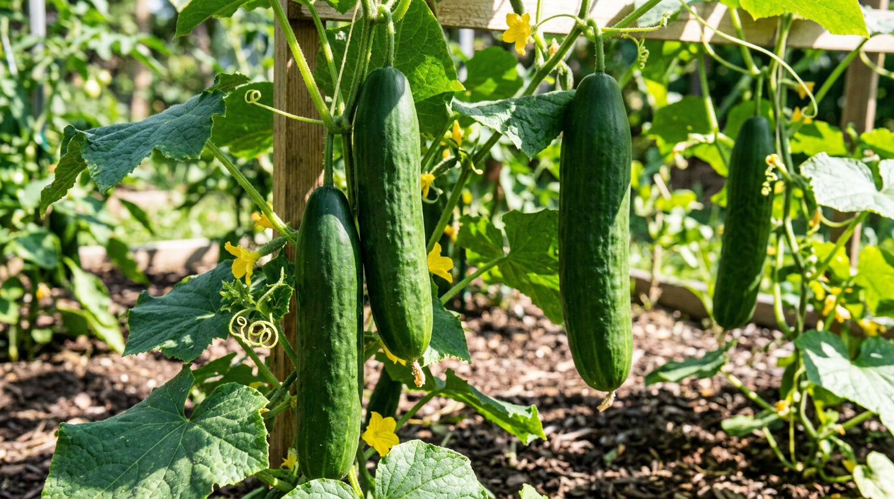

Сорвал свежий огурец с грядки, откусил — а он горчит. Знакомо? Горечь огурцов — частая и обидная проблема: вроде бы кусты здоровые, плодов много, а есть их неприятно. Хорошая новость в том, что горечь почти всегда вызвана понятными причинами, которые можно устранить, а из уже горьких огурцов горечь несложно убрать. В этой статье разберём, почему огурцы горчат, что провоцирует горечь, как от неё избавиться и что сделать, чтобы следующий урожай был сладким и хрустящим.

## 🥒 Почему огурцы горчат: дело в кукурбитацине

За горечь огурцов отвечает особое вещество — **кукурбитацин**. Это природное соединение, которое растение вырабатывает как защиту от вредителей и неблагоприятных условий. В небольшом количестве кукурбитацин есть в любом огурце, но обычно его так мало, что вкус остаётся сладким.

Проблема начинается, когда растение испытывает **стресс**. В ответ на неблагоприятные условия огурец резко увеличивает выработку кукурбитацина, и плоды становятся горькими. Больше всего этого вещества накапливается в кожуре и в части плода у плодоножки — поэтому горчит чаще именно «хвостик» и шкурка.

Важно знать: кукурбитацин не вреден для здоровья, более того, в медицине его даже считают полезным в малых дозах. Так что горький огурец не опасен — просто невкусен. А вот понять, какой именно стресс вызвал горечь, важно, чтобы её устранить. Любопытно, что в дикой природе горечь — полезное свойство: она отпугивает животных, и растение защищает плоды. Но в огороде нам, наоборот, нужны сладкие плоды, поэтому задача — убрать стресс, заставляющий огурец «защищаться».

## 🌡️ Что провоцирует горечь

Горечь — это всегда сигнал, что огурцу некомфортно. Сам по себе один фактор редко вызывает сильную горечь — обычно она появляется, когда совпадают несколько неблагоприятных условий. Основных стрессовых факторов несколько, и часто они действуют вместе.

### Нерегулярный полив

Это причина номер один. Огурцы на 95% состоят из воды и очень чувствительны к её нехватке. При недостаточном или нерегулярном поливе, особенно с длинными перерывами и пересыханием почвы, растение испытывает сильный стресс и накапливает кукурбитацин. Полив холодной водой тоже провоцирует горечь: для теплолюбивых огурцов это двойной стресс — и холод, и шок для корней. Поэтому поливают только тёплой, отстоявшейся на солнце водой, и желательно в одно и то же время, чтобы у растения был стабильный ритм.

### Жара и перепады температур

Огурцы любят тепло, но в сильную жару (выше 30 °C), особенно в сочетании с сухим воздухом, они страдают и горчат. Так же действуют резкие перепады между дневной жарой и холодными ночами — частая ситуация в начале и в конце лета. В теплице перегрев особенно опасен: в закрытом пространстве в солнечный день температура легко поднимается выше 35 °C, и без проветривания огурцы получают сильнейший стресс.

### Недостаток света

Если огурцы растут в тени или посадки сильно загущены и листья затеняют друг друга, растению не хватает света для нормального фотосинтеза. Это тоже стресс, ведущий к горечи. Особенно часто горчат плоды на загущённых, непрореженных кустах. При этом и слишком яркое палящее солнце без притенения тоже вредит — огурцам нужен рассеянный свет, а не прямой зной целый день. Идеал для них — светло, но без перегрева.

### Бедная почва и нехватка питания

На скудной почве, при недостатке питания (особенно калия) и общем угнетении растения горечь появляется чаще. Здоровый, хорошо накормленный куст в комфортных условиях горьких плодов почти не даёт. Особенно важен для огурцов калий — при его нехватке растение слабеет и чаще горчит. А вот избыток азота, наоборот, делает кусты рыхлыми и уязвимыми к стрессу. Поэтому баланс питания напрямую влияет на вкус.

## 🧬 Сорт тоже имеет значение

Склонность к горечи во многом заложена генетически. **Старые сорта** огурцов горчат значительно чаще, особенно в стрессовых условиях. А вот большинство **современных гибридов** (на упаковке обычно стоит пометка F1) выведены генетически негорькими — они не накапливают много кукурбитацина даже при стрессе.

Поэтому если горечь — ваша постоянная проблема, при выборе семян обращайте внимание на пометки «без горечи» или «генетически негорький» в описании сорта. Это не отменяет правильного ухода, но заметно снижает риск. Тем не менее даже негорький гибрид при сильном стрессе (например, при долгой засухе) иногда может слегка горчить, так что уход важен в любом случае. Отдельно стоит сказать про семена: если вы собираете их сами с гибридов F1, потомство может «расщепиться» и дать горькие плоды. Поэтому для стабильного результата семена негорьких гибридов лучше покупать, а не заготавливать самостоятельно.

## ✅ Что делать, чтобы огурцы не горчили

Раз горечь вызвана стрессом, главная задача — обеспечить огурцам комфортные и стабильные условия:

1. **Наладьте регулярный полив.** Поливайте огурцы часто и равномерно, тёплой отстоянной водой (22–25 °C), не допуская пересыхания почвы. Это самая важная мера: одно только налаживание полива нередко полностью решает проблему горечи. Удобно использовать капельный полив — он поддерживает влажность стабильной.
2. **Мульчируйте грядки.** Слой мульчи (солома, скошенная трава, перегной) удерживает влагу, сглаживает перепады температуры почвы и защищает корни от пересыхания и перегрева — особенно ценно в жару.
3. **Притеняйте в жару.** В сильный зной притеняйте огурцы лёгкой сеткой или агроволокном, а теплицу обязательно проветривайте.
4. **Не загущайте посадки.** Соблюдайте расстояние между растениями и формируйте кусты, чтобы листья хорошо освещались.
5. **Подкармливайте сбалансированно.** Регулярные умеренные подкормки с калием поддерживают растение. О питании — в статье о [летних подкормках овощей](https://mir-doma.pro/letnie-podkormki-ovoshchey/).
6. **Собирайте урожай вовремя.** Переросшие и перезревшие огурцы горчат сильнее, поэтому снимайте плоды регулярно, не давая им перерастать.

Стабильный уход — лучший способ забыть о горечи. Огурец, которому хватает воды, тепла и света, почти всегда вырастает сладким.

## 🍽️ Как убрать горечь из уже собранных огурцов

Если огурцы уже горчат, выбрасывать их не нужно — горечь легко уменьшить или убрать:

- **Срежьте «хвостик».** Отрежьте часть плода у плодоножки (примерно 1,5–2 см) — именно там больше всего кукурбитацина. Не используйте этот же нож для остального огурца, не протерев его.
- **Очистите кожуру.** Основная горечь — в кожице, поэтому очищенный огурец почти не горчит.
- **Вымочите в холодной воде.** Замочите нарезанные или целые огурцы в холодной воде на несколько часов (можно на ночь), периодически меняя воду, — часть горечи перейдёт в воду и уйдёт.
- **Посолите.** Нарезанные огурцы можно пересыпать солью, дать постоять и слить сок — соль вытягивает горечь.
- **Используйте в засолку.** При засолке и мариновании горечь почти полностью исчезает, так что слегка горькие огурцы смело пускайте в заготовки — в банках разницы вы не почувствуете.

Эти приёмы спасают урожай, даже если часть плодов всё-таки горчит.

## 🥗 Опасна ли горечь и можно ли есть такие огурцы

Многих волнует: безопасно ли есть горькие огурцы? Ответ — да, безопасно. Кукурбитацин, который даёт горечь, не токсичен для человека в тех количествах, что накапливаются в огурцах. Более того, в медицине это вещество изучают за его полезные свойства — есть данные о противовоспалительном и общеукрепляющем действии в малых дозах.

Так что горький огурец — это вопрос вкуса, а не безопасности. Его можно есть, можно убрать горечь описанными способами, а можно пустить в засолку, где она исчезает. Выбрасывать горькие плоды точно не стоит. Единственное исключение — если огурец горчит необычно сильно и резко, с непривычным запахом: такие единичные плоды лучше не есть, но это большая редкость.

## 🛡️ Профилактика горечи

Горечь почти всегда можно предотвратить — она появляется там, где растению некомфортно. Чтобы она не возвращалась, придерживайтесь нескольких простых правил весь сезон:

- выбирайте современные негорькие гибриды (пометка F1 и «без горечи»);
- поливайте регулярно и только тёплой водой, не допуская пересыхания;
- мульчируйте почву и притеняйте растения в жару;
- не загущайте посадки и формируйте кусты для хорошего освещения;
- подкармливайте сбалансированно, не забывая про калий;
- собирайте огурцы вовремя, не давая перерастать;
- в теплице следите за проветриванием и не допускайте перегрева.

Стоит помнить, что стресс, вызывающий горечь, ослабляет огурцы и в целом — на тех же ошибках полива и ухода у них нередко [желтеют листья](https://mir-doma.pro/zhelteyut-listya-u-ogurtsov/) и развиваются болезни вроде [мучнистой росы](https://mir-doma.pro/muchnistaya-rosa-na-ogurtsah/). Поэтому стабильный уход решает сразу несколько проблем разом.

## ❓ Частые вопросы

### Можно ли есть горькие огурцы в свежем виде?

Да, можно — они безопасны. Если горечь умеренная, достаточно срезать кончик и очистить кожуру, и огурец будет приятным на вкус в салате. Сильно горькие плоды лучше пустить в засолку, где горечь полностью уходит.

### Почему огурцы горчат с куста, прямо свежие?

Свежий огурец горчит из-за накопленного кукурбитацина, который растение выработало в ответ на стресс — чаще всего нехватку воды, жару или недостаток света. Это не порча и не болезнь плода, а реакция растения на неблагоприятные условия.

### Вредны ли горькие огурцы?

Нет, горькие огурцы не вредны. Кукурбитацин, дающий горечь, безопасен для здоровья и даже считается полезным в малых количествах. Горький огурец просто невкусен, но есть его можно, а горечь несложно убрать.

### Как быстро убрать горечь из огурцов?

Самый быстрый способ — срезать часть плода у плодоножки и очистить кожуру: именно там сосредоточена горечь. Можно также замочить огурцы в холодной воде на пару часов или пересыпать нарезку солью и слить сок.

### Почему огурцы в теплице горчат?

В теплице частые причины горечи — перегрев в жару, духота, перепады дневных и ночных температур и нерегулярный полив. Наладьте проветривание, поливайте тёплой водой регулярно, притеняйте теплицу в зной — и горечь уйдёт.

### Влияет ли полив на горечь огурцов?

Да, и это главный фактор. Нерегулярный полив, пересыхание почвы и полив холодной водой — самые частые причины горечи. Стабильный полив тёплой водой по графику чаще всего полностью решает проблему, поэтому начинать всегда стоит именно с него.

### Можно ли солить и мариновать горькие огурцы?

Да, при засолке и мариновании горечь почти полностью исчезает, поэтому слегка горькие огурцы смело используйте в заготовки. На вкус готовых солений и маринадов горечь свежих плодов практически не влияет.

### Почему один огурец с куста горчит, а другой нет?

Это нормально: горечь зависит от того, в каких условиях рос конкретный плод и сколько кукурбитацина он успел накопить. Огурцы, которые наливались в период засухи или жары, горчат сильнее, а завязавшиеся в комфортных условиях — нет. Также сильнее горчат переросшие и пожелтевшие плоды.

### Горчат ли кончики огурцов сильнее?

Да, больше всего кукурбитацина накапливается в части плода у плодоножки (в «хвостике») и в кожуре. Поэтому если срезать кончик и очистить кожицу, оставшаяся мякоть обычно почти не горчит.

### Какие сорта огурцов не горчат?

Большинство современных гибридов (с пометкой F1) выведены генетически негорькими и не накапливают много кукурбитацина даже при стрессе. При выборе семян ищите в описании пометки «без горечи» или «генетически негорький».

## Заключение

Горечь огурцов — это не болезнь и не порча, а реакция растения на стресс: чаще всего на нехватку воды, жару, недостаток света или бедную почву. Чтобы огурцы были сладкими, обеспечьте им стабильный уход: регулярный полив тёплой водой, мульчу, притенение в жару, незагущённые посадки и сбалансированные подкормки. А если плоды всё же горчат, срежьте хвостик, очистите кожуру или пустите их в засолку — горечь легко убрать. Выбирайте негорькие гибриды, ухаживайте за кустами стабильно — и ваши огурцы будут радовать сладким хрустом всё лето. Главное помнить: горечь — это «крик о помощи» растения, и стоит дать огурцам воду, тепло и свет, как проблема уходит сама.

А у вас огурцы горчат и что помогает? Делитесь опытом в комментариях и подписывайтесь, чтобы не пропустить новые статьи об уходе за огородом.
