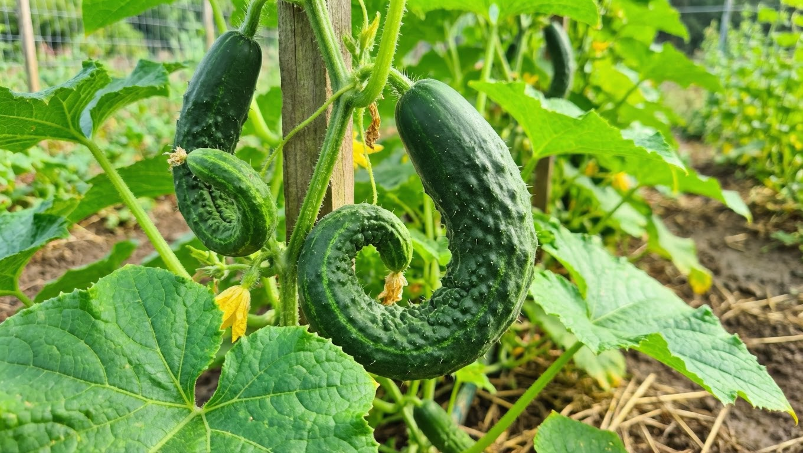
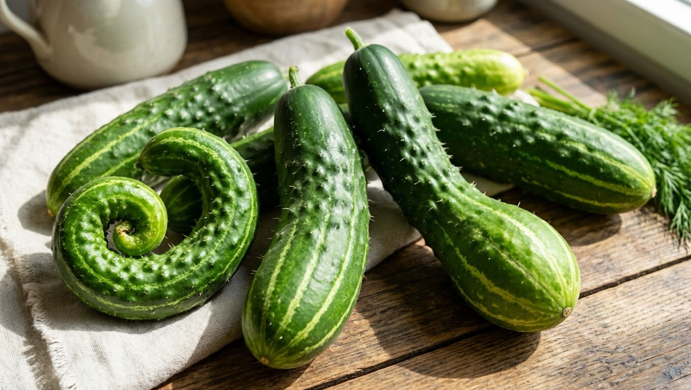
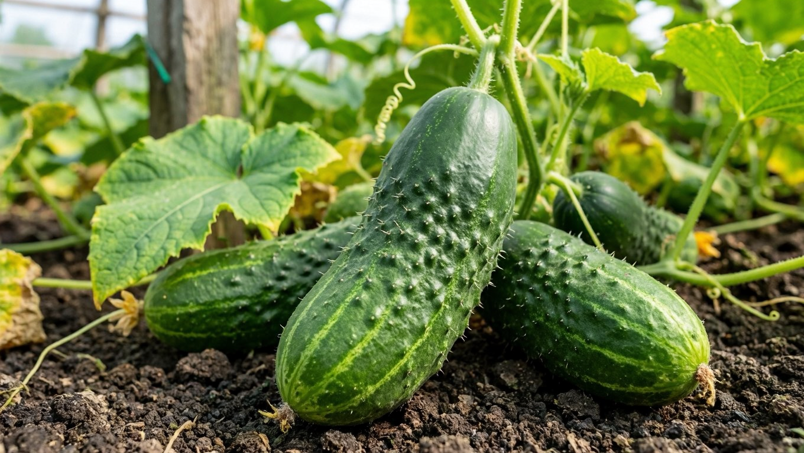
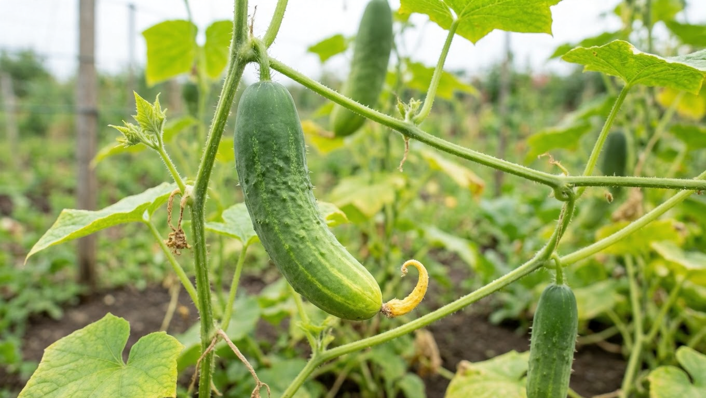
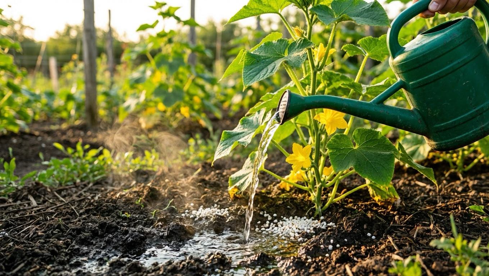
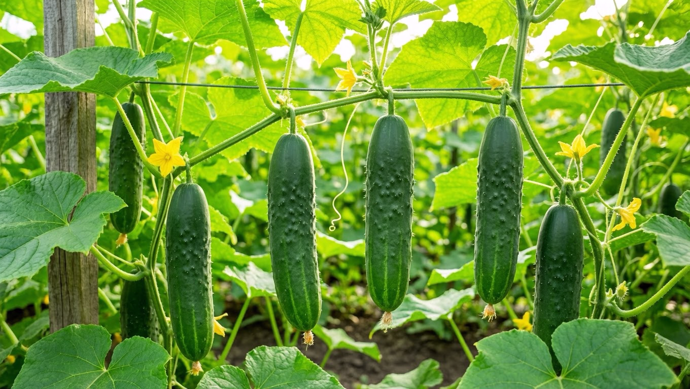

Огурцы выросли кривыми — крючком, с перетяжками или похожими на грушу? Это не сортовая особенность и не случайность: по форме искривления почти всегда можно понять, чего огурцам не хватает. Чаще всего виноваты дисбаланс питания, ошибки полива или плохое опыление. Хорошая новость в том, что причину легко определить по внешнему виду плода и исправить. В этой статье разберём, почему огурцы вырастают кривыми, как по форме понять причину и что делать, чтобы плоды были ровными и красивыми.

## 🥒 Почему огурцы растут кривыми

Искривление плодов — это реакция огурца на неблагоприятные условия. Основные причины таковы:

- **дисбаланс питания** — нехватка калия или азота;
- **ошибки полива** — нерегулярный полив, холодная вода, перепады влажности;
- **плохое опыление** — у пчёлоопыляемых сортов;
- **перепады температуры** и стресс;
- **загущённые посадки** и перерастание плодов.

Самое удобное — определить причину по форме искривления, ведь разные проблемы дают разные деформации. Часто причин несколько сразу, но форма плода почти всегда указывает на главную, и, устранив её, вы получите ровные огурцы.

## 🔍 Формы искривления и их причины

Присмотритесь к форме плода — она подскажет причину.

### Сужение у плодоножки, грушевидная форма

Если огурец толстый у носика и сужается к хвостику (плодоножке), напоминая грушу, — это верный признак **нехватки калия**. Калий отвечает за налив и форму плода, и при его дефиците огурцы деформируются именно так. Нехватка калия особенно часта во второй половине лета, при активном плодоношении и на бедных почвах, а также при перекорме азотом, который мешает усвоению калия.

### Сужение и светлый крючок у носика

Если, наоборот, огурец сужается и загибается крючком у цветочного конца (носика), а кончик светлый и тонкий, — растению не хватает **азота**. Такой светлый загнутый носик — классический признак азотного голодания. Обычно это случается в прохладную погоду, когда корни хуже усваивают азот, или на истощённой почве без подкормок.

### Перетяжки и «талия» посередине

Перетяжки и сужения в середине плода говорят о **резких перепадах температуры и поливе холодной водой**. От стресса рост плода идёт неравномерно, и появляется «талия». Особенно часто такие огурцы получаются после резкого похолодания ночью или полива ледяной водой из скважины днём в жару.

### Дуга и крючок

Дугообразные плоды и крючки часто возникают из-за **неполного опыления** у пчёлоопыляемых сортов: семена внутри развиваются неравномерно, и огурец изгибается. К искривлению приводит и механическое препятствие — когда плод упирается в лист, шпалеру или соседний огурец и растёт в обход него. Поэтому подвязка и формировка куста тоже помогают получать ровные плоды.

### Общая кривизна

Просто кривые, неровные плоды без выраженной формы — обычно результат **загущения, нерегулярного полива и перерастания**: в тесноте огурцы мешают друг другу и растут вкривь, а переросшие плоды грубеют и деформируются. Регулярный сбор урожая и разреженная посадка почти полностью снимают эту проблему.

## ✅ Что делать, чтобы огурцы были ровными

Определив причину, исправить ситуацию несложно:

1. **Сбалансируйте питание.** При нехватке калия дайте зольный настой или сульфат калия, при нехватке азота — азотную подкормку или травяной настой. Лучше использовать комплексные удобрения и чередовать подкормки, не перекармливая азотом. Подробно — в статье о [летних подкормках](https://mir-doma.pro/letnie-podkormki-ovoshchey/).
2. **Наладьте полив.** Поливайте регулярно и только тёплой, отстоянной на солнце водой под корень, без пересушки и резких перепадов влажности. Мульча помогает удерживать равномерную влажность почвы.
3. **Обеспечьте опыление.** Для пчёлоопыляемых сортов привлекайте пчёл или опыляйте вручную, а в теплице лучше выращивать партенокарпические (самоопыляемые) гибриды. О том, почему нет завязей и как помочь опылению, читайте в статье про [пустоцвет на огурцах](https://mir-doma.pro/pustotsvet-na-ogurtsah/).
4. **Не загущайте посадки** и собирайте огурцы вовремя, не давая им перерастать.
5. **Поддерживайте стабильную температуру** и проветривайте теплицу.

Уже следующие плоды после корректировки ухода будут заметно ровнее. Учтите, что уже выросшие кривые огурцы не выпрямятся — меры влияют на новые завязи, поэтому действовать лучше при первых признаках деформации.

## 🌿 Профилактика

Чтобы огурцы изначально росли ровными:

- с самого начала кормите растения сбалансированно, с достаточным калием;
- поливайте регулярно тёплой водой, мульчируйте почву;
- для теплицы выбирайте партенокарпические гибриды;
- не загущайте посадки и формируйте кусты;
- собирайте урожай каждые 1–2 дня, не допуская перерастания.

Здоровые, правильно накормленные и политые огурцы деформируются редко. Кстати, ровная форма — не единственный показатель здоровья: следите и за листьями, ведь их [пожелтение](https://mir-doma.pro/zhelteyut-listya-u-ogurtsov/) или белый налёт [мучнистой росы](https://mir-doma.pro/muchnistaya-rosa-na-ogurtsah/) тоже сигналят о проблемах.

## 🛡️ Частые ошибки

- **Перекорм азотом.** Избыток азота при нехватке калия усиливает деформацию. Соблюдайте баланс.
- **Полив холодной водой.** Вызывает перетяжки и стресс. Поливайте только тёплой водой.
- **Игнорирование опыления.** Пчёлоопыляемые сорта без опылителей дают кривые плоды. Помогайте опылению или берите партенокарпики.
- **Загущение.** В тесноте плоды искривляются. Не сажайте огурцы слишком часто.
- **Перерастание.** Переросшие огурцы деформируются и грубеют. Собирайте вовремя.

## ❓ Частые вопросы

### Почему огурцы вырастают крючком?

Крючком огурцы загибаются чаще всего из-за неполного опыления у пчёлоопыляемых сортов или нехватки азота, когда сужается и светлеет носик плода. Помогают опыление (или переход на партенокарпические гибриды) и азотная подкормка, а также регулярный тёплый полив.

### Каких элементов не хватает, если огурцы кривые?

Форма подсказывает дефицит: грушевидные плоды с сужением у плодоножки — нехватка калия, а сужение и светлый крючок у носика — нехватка азота. Поэтому кривые огурцы подкармливают калием (зола, сульфат калия) или азотом в зависимости от формы искривления.

### Почему у огурцов перетяжки посередине?

Перетяжки и «талия» в середине плода появляются из-за резких перепадов температуры и полива холодной водой. Растение развивается неравномерно, и плод перетягивается. Решение — стабильная температура, проветривание теплицы и полив только тёплой водой.

### Можно ли есть кривые огурцы?

Да, кривые огурцы совершенно съедобны, на вкус они не отличаются от ровных. Просто они менее удобны для засолки и хуже выглядят. Если же огурцы при этом горчат или грубеют, дело в других причинах ухода, которые тоже стоит устранить.

### Как сделать, чтобы огурцы росли ровными?

Кормите растения сбалансированно с достаточным количеством калия, поливайте регулярно тёплой водой под корень, обеспечьте опыление или выращивайте партенокарпические гибриды, не загущайте посадки и собирайте плоды вовремя. При таком уходе огурцы вырастают ровными и красивыми.

### Почему огурцы грушевидной формы?

Грушевидные огурцы — толстые у носика и суженные у плодоножки — растут при нехватке калия. Этот элемент отвечает за равномерный налив плода. Дайте растениям зольный настой или сульфат калия и не злоупотребляйте азотом, который мешает усвоению калия, — и форма плодов выровняется.

### Кривые огурцы — это болезнь?

Нет, искривление плодов не болезнь, а следствие дисбаланса питания, ошибок полива или плохого опыления. Болезни огурцов проявляются иначе — пятнами и налётом на листьях. Если же наряду с кривыми плодами страдают листья, стоит проверить растения и на болезни.

### Влияет ли опыление на форму огурцов?

Да, у пчёлоопыляемых сортов неполное опыление — частая причина изогнутых плодов: семена внутри развиваются неравномерно, и огурец искривляется. Поэтому таким сортам нужны опылители, а в теплице без пчёл удобнее выращивать самоопыляемые партенокарпические гибриды.

## Заключение

Кривые огурцы — это сигнал, что растению чего-то не хватает, и по форме плода легко понять, чего именно: грушевидные — калия, со светлым крючком у носика — азота, с перетяжками — тепла и правильного полива, дугой — опыления. Сбалансируйте питание, поливайте регулярно тёплой водой, обеспечьте опыление и не загущайте посадки — и огурцы станут ровными и красивыми. А кривые плоды смело используйте в пищу: на вкус они ничуть не хуже ровных. Разобравшись в причинах один раз, вы легко будете получать красивые ровные огурцы весь сезон.

А у вас вырастали кривые огурцы и в чём была причина? Делитесь опытом в комментариях и подписывайтесь, чтобы не пропустить новые статьи об уходе за огородом.
