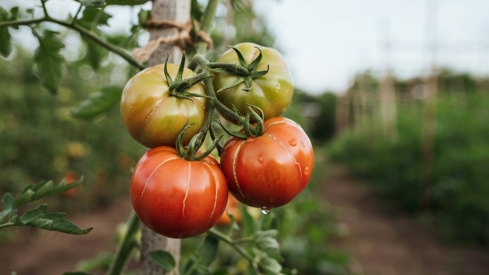
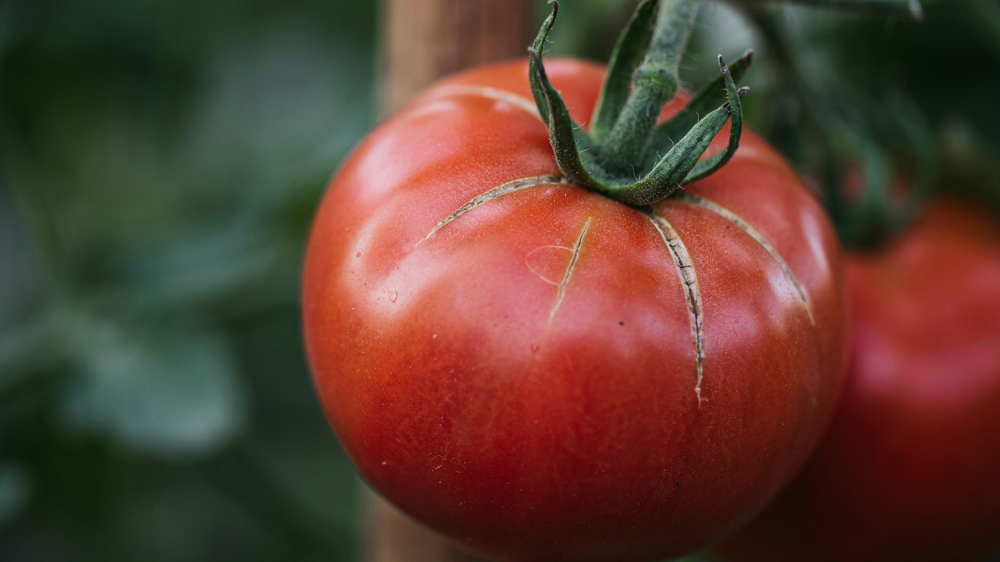
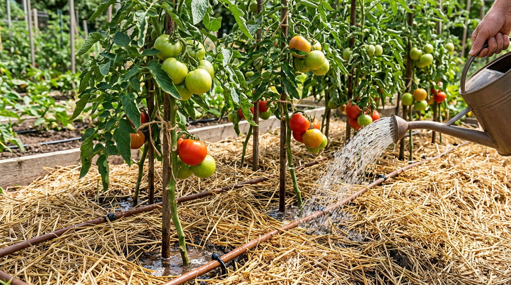
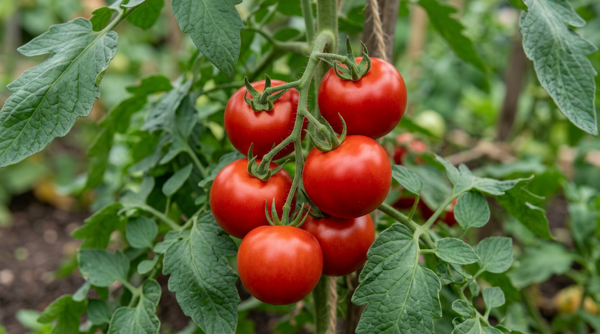

Наливающиеся помидоры вдруг покрываются трещинами прямо на кусте — обидно, ведь урожай почти созрел. Растрескивание плодов — частая проблема и в теплице, и в открытом грунте, и почти всегда у неё одна корневая причина: резкие скачки влаги. Кожица не успевает за быстро наливающейся мякотью и лопается. Хорошая новость в том, что предотвратить растрескивание несложно. В этой статье разберём, почему трескаются помидоры, что делать, чтобы этого избежать, и можно ли есть треснувшие плоды.

## 🍅 Почему трескаются помидоры

Механизм всегда один: когда мякоть плода резко идёт в рост, а кожица не успевает растягиваться, она не выдерживает и лопается. Чаще всего это происходит из-за **резкого притока влаги** — например, после засухи внезапно обильно полили или прошёл сильный дождь. Плод быстро наливается водой, и кожица трескается.

Трещины бывают двух видов: **концентрические** — кольцами вокруг плодоножки, и **радиальные** (лучевые) — расходящиеся от плодоножки. И те, и другие портят вид плодов и открывают путь инфекциям. Особенно склонны к растрескиванию крупные мясистые сорта с тонкой кожицей, а также плоды на стадии дозревания, когда кожица уже начинает размягчаться.

## 🌡️ Основные причины растрескивания

Разберём, что именно вызывает резкие скачки влаги и ослабляет кожицу.

### Неравномерный полив

Это главная причина. Когда помидоры поливают «качелями» — то пересушивают, то заливают, — плоды после засухи резко напитываются влагой и лопаются. Особенно опасен обильный полив пересохшего куста в жару. Корни резко подают воду в плоды, те стремительно наливаются — и трещина появляется буквально за несколько часов.

### Жара и перепады температуры

В жаркой теплице кожица плодов грубеет и теряет эластичность, а при последующем поливе или похолодании мякоть резко наливается, и плод трескается. Резкие перепады «жаркий день — прохладная ночь» усиливают проблему. Именно поэтому в теплице помидоры трескаются чаще, чем в открытом грунте: там сильнее перегрев и резче колебания.

### Избыток азота и нехватка питания

Перекормленные азотом кусты гонят рыхлые, склонные к растрескиванию плоды. А нехватка кальция и бора делает кожицу слабой и неэластичной, из-за чего она легче рвётся. Поэтому во второй половине лета упор в подкормках делают на калий, а не на азот. Дисбаланс питания вредит плодам так же, как при [вершинной гнили томатов](https://mir-doma.pro/vershinnaya-gnil-tomatov/), которая тоже связана с нехваткой кальция.

### Резкое пасынкование и сорт

Если разом удалить много листьев и пасынков, влага, которую они забирали, устремляется в плоды, и те лопаются. Кроме того, некоторые сорта (особенно крупноплодные и тонкокожие) склонны к растрескиванию генетически. О правильном формировании куста — в статье о [пасынковании помидоров](https://mir-doma.pro/pasynkovanie-pomidorov/).

### Перезревание на кусте

Переспелые плоды, оставленные на кусте, тоже растрескиваются: их кожица теряет прочность. Поэтому помидоры собирают вовремя.

## ✅ Что делать, чтобы помидоры не трескались

Профилактика растрескивания сводится к стабильности условий:

1. **Поливайте регулярно и равномерно.** Лучше редко, но обильно, по графику, чтобы почва была стабильно влажной без «качелей». Отлично помогает [капельный полив](https://mir-doma.pro/kapelnyy-poliv-svoimi-rukami/): он подаёт воду понемногу и постоянно, поддерживая ровную влажность без резких скачков.
2. **Мульчируйте почву.** Слой мульчи удерживает влагу и сглаживает её колебания — один из самых действенных приёмов против растрескивания. Подойдут скошенная трава, солома, перегной слоем в несколько сантиметров.
3. **Проветривайте и притеняйте теплицу.** Это убирает перегрев и резкие перепады.

4. **Сбалансируйте питание.** Не перекармливайте азотом, давайте калий и кальций для крепкой кожицы.
5. **Пасынкуйте умеренно.** Удаляйте листья и пасынки постепенно, а не всё сразу.
6. **Собирайте вовремя.** Не передерживайте плоды на кусте; можно снимать их бурыми и дозаривать — о том, [почему помидоры не краснеют](https://mir-doma.pro/pomidory-ne-krasneyut/) и как их дозарить, мы рассказывали отдельно.
7. **Выбирайте устойчивые сорта** с плотной кожицей, если растрескивание повторяется.

## ⚠️ Можно ли есть треснувшие помидоры

Свежие треснувшие помидоры без признаков гнили есть можно — на вкус они не отличаются. Но трещина — это открытая ранка, через которую внутрь попадают бактерии, грибки и насекомые, поэтому такие плоды быстро портятся. Треснувшие помидоры лучше снять с куста сразу и использовать в первую очередь — в салат, на переработку или в [заготовки](https://mir-doma.pro/pomidory-na-zimu-recepty/). Плоды с загниванием в трещине уже не едят. Если трещины появились массово, кусты стоит осмотреть и скорректировать уход, а поспевающие плоды снимать чуть раньше, дозаривая их в помещении.

## 🛡️ Частые ошибки

- **Полив «качелями».** Засуха, а потом обильный полив — прямой путь к растрескиванию. Поливайте равномерно.
- **Обильный полив в жару.** Резкий приток влаги к перегретым плодам лопает кожицу. Поливайте умеренно и притеняйте.
- **Перекорм азотом.** Даёт рыхлые склонные к трещинам плоды. Соблюдайте баланс питания.
- **Полив без мульчи.** Голая почва быстро пересыхает и создаёт перепады влажности. Мульчируйте.
- **Перезревание на кусте.** Переспелые плоды трескаются. Собирайте вовремя.

## ❓ Частые вопросы

### Почему трескаются помидоры в теплице?

Чаще всего из-за неравномерного полива и перегрева: в жаркой теплице кожица грубеет, а после обильного полива мякоть резко наливается, и плод лопается. Помогают регулярный равномерный полив, мульчирование, проветривание и притенение теплицы в жару.

### Почему помидоры трескаются при созревании?

При созревании плод активно наливается, и если в этот момент случается резкий приток влаги (полив после засухи, дождь) или перепад температуры, кожица не выдерживает и трескается. Стабильный полив и своевременный сбор урожая предотвращают проблему.

### Как поливать помидоры, чтобы не трескались?

Поливайте регулярно и равномерно — лучше реже, но обильно, промачивая почву на глубину корней, без чередования засухи и залива. Обязательно мульчируйте почву: мульча удерживает влагу и сглаживает её колебания. В жару поливают умеренно, не заливая перегретые кусты.

### Можно ли есть треснувшие помидоры?

Да, свежие треснувшие помидоры без гнили вполне съедобны и по вкусу не отличаются. Но через трещину внутрь попадают микробы, и плоды быстро портятся, поэтому их снимают сразу и используют в первую очередь. Помидоры с загниванием в трещине есть не стоит.

### Какие помидоры не трескаются?

Меньше склонны к растрескиванию сорта и гибриды с плотной прочной кожицей, а также мелкоплодные помидоры вроде черри. Но даже устойчивые сорта трескаются при резких скачках влаги, поэтому стабильный полив и уход важны в любом случае.

### Трескаются помидоры в открытом грунте — почему?

В открытом грунте главная причина — дожди после засухи: пересохшие кусты резко напитываются влагой, и плоды лопаются. Помогают мульчирование, которое сглаживает перепады, и своевременный сбор урожая. Плёночные укрытия или навесы над грядкой в дождливую погоду тоже снижают растрескивание.

### Что делать, если помидоры уже потрескались?

Треснувшие плоды снимите с куста, чтобы в трещины не попала инфекция, и используйте в первую очередь — в салат или на переработку. А чтобы новые плоды не трескались, наладьте равномерный полив, замульчируйте почву и защитите кусты от жары и перепадов.

### Влияет ли пасынкование на растрескивание помидоров?

Да, если разом удалить много листьев и пасынков, влага, которую они потребляли, устремляется в плоды, и те могут полопаться. Поэтому пасынкуют умеренно и постепенно, не оголяя куст за один раз, особенно в период налива плодов.

## Заключение

Помидоры трескаются, когда кожица не успевает за резко наливающейся мякотью, а виноваты в этом чаще всего скачки влаги — неравномерный полив, жара и перепады температуры, а также избыток азота и нехватка кальция. Чтобы плоды оставались целыми, поливайте помидоры регулярно и равномерно, мульчируйте почву, проветривайте теплицу, соблюдайте баланс питания и собирайте урожай вовремя. Свежие треснувшие плоды можно есть, но лучше сразу пускать их в переработку. Стабильный уход — и помидоры порадуют ровными, красивыми и целыми. Запомните главное: помидоры трескаются не от болезни, а от резких перемен, поэтому ровный полив и защита от жары решают проблему почти полностью.

А у вас трескались помидоры и что помогло? Делитесь опытом в комментариях и подписывайтесь, чтобы не пропустить новые статьи об уходе за огородом.
