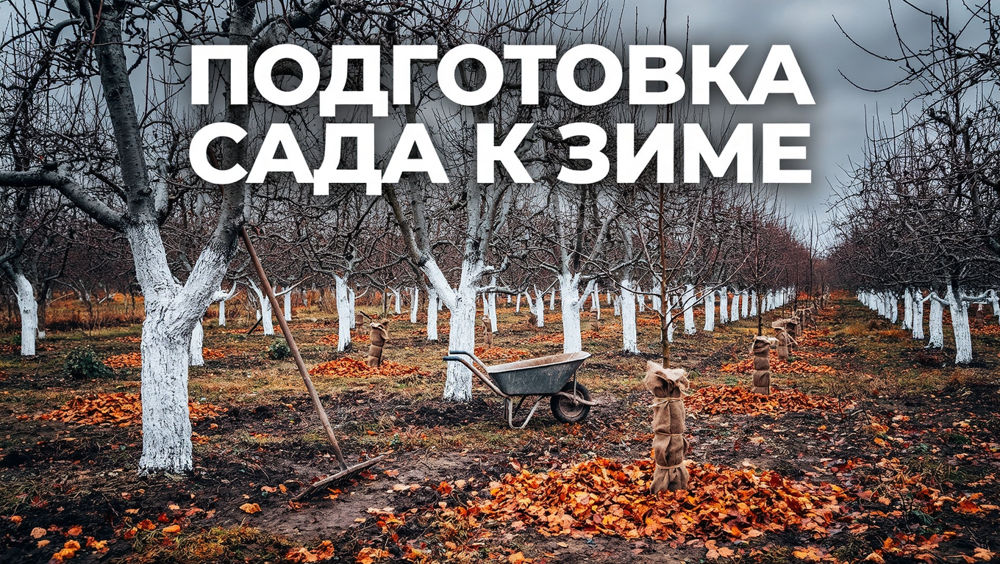
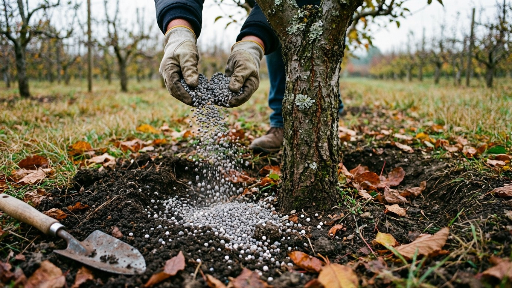
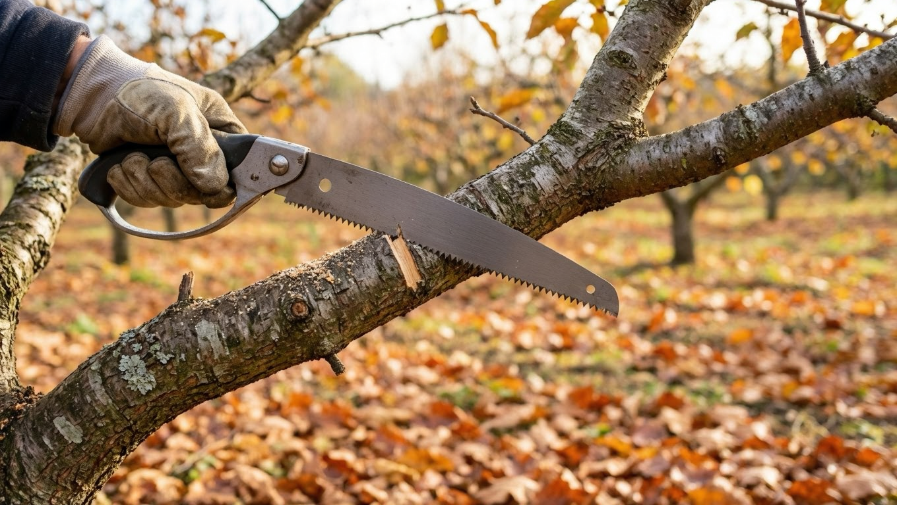
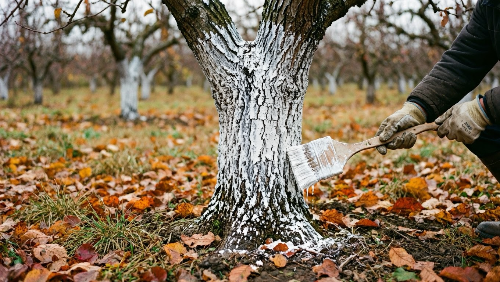
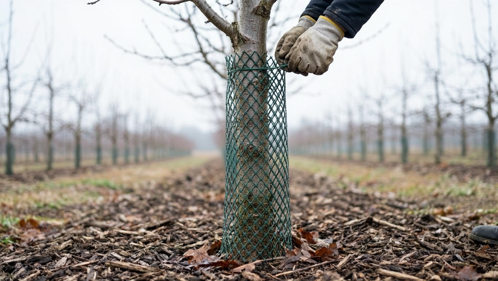
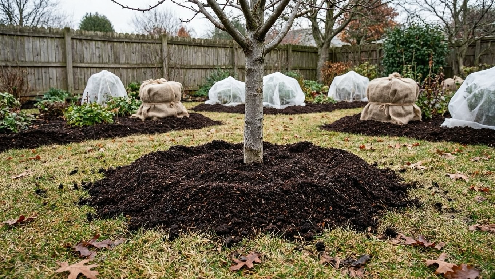

Осень — не конец дачного сезона, а закладка урожая на будущий год. От того, как вы подготовите сад к зиме, зависит, переживут ли деревья и кустарники морозы, не обгрызут ли их мыши и зайцы и как они тронутся в рост весной. Работ немного, но каждая важна. Разберём по шагам, что входит в подготовку сада к зиме — от уборки и подкормки до побелки, защиты от грызунов и укрытия.

## 🍂 Зачем готовить сад к зиме

Осенние работы решают три задачи: убирают источники болезней и вредителей, помогают деревьям накопить сил перед зимой и защищают их от вымерзания и грызунов. Пропущенная осенью мелочь — неубранная падалица, необвязанный ствол — оборачивается весной вспышкой болезней или погибшим саженцем. Поэтому подготовку к зиме делают не спеша и по порядку.

## 🧹 Уборка и санитария сада

Первое и обязательное — навести чистоту:

- собрать и убрать опавшую листву, падалицу и растительные остатки;
- снять с деревьев мумифицированные (засохшие на ветках) плоды — в них зимует инфекция;
- выполоть сорняки в приствольных кругах.

Больные листья и падалицу (парша, гнили) **не кладут в компост** — сжигают или выносят с участка, иначе возбудители перезимуют и вернутся.

## 💧 Влагозарядковый полив

Перед морозами сад обильно поливают — это влагозарядковый полив. Напитанная влагой древесина лучше переносит зиму: сухие деревья сильнее страдают от морозов и иссушающего ветра. Особенно важен такой полив для молодых деревьев и в сухую осень. Проводят его после листопада, но до устойчивых холодов, промачивая почву на глубину корней.

## 🍽️ Осенняя подкормка

Осенью сад кормят **фосфором и калием** — они повышают зимостойкость и готовят растения к покою. А вот **азот осенью исключают**: он гонит рост побегов, которые не успеют вызреть и вымерзнут. Под деревья и кустарники вносят суперфосфат и калийные удобрения или золу, заделывая в приствольный круг. Общие принципы питания растений разбирали в статье про [летние подкормки](https://mir-doma.pro/letnie-podkormki-ovoshchey/) — осенью меняется лишь состав в пользу фосфора и калия. Что именно вносить под деревья, кусты, грядки и цветы под зиму, подробно в статье про [осенние подкормки](https://mir-doma.pro/osennie-podkormki/).

## ✂️ Санитарная обрезка

Осенью проводят санитарную обрезку — удаляют сухие, больные и сломанные ветви, чтобы дерево не тратило на них силы и не служило рассадником болезней. Формирующую обрезку большинства культур лучше отложить на весну, а вот кустарники как раз обрезают осенью после плодоношения. Подробные схемы — в отдельных статьях: [обрезка малины](https://mir-doma.pro/obrezka-maliny/) и [обрезка смородины](https://mir-doma.pro/obrezka-smorodiny/). С яблоней осенью главное — санитария; почему у неё бывают проблемы с урожаем, разбирали в материале о том, [почему опадают завязи у яблони](https://mir-doma.pro/opadayut-zavyazi-u-yabloni/).

## 🎨 Как побелить деревья осенью

Побелка — это не про красоту, а про защиту. Белый ствол не перегревается на ярком зимнем и весеннем солнце, поэтому на нём не появляются морозобоины и солнечные ожоги (кора трескается именно от резких перепадов дневных и ночных температур). Белят штамб и основания скелетных ветвей садовой краской или известью с добавками осенью, после дождей. Молодым деревцам с тонкой корой вместо побелки лучше сделать обвязку — она заодно защитит от грызунов.

## 🐭 Защита от грызунов

Зимой голодные мыши и зайцы обгрызают кору молодых деревьев по кругу — такое повреждение часто губит саженец. Стволы защищают обвязкой:

- специальной сеткой или мелкой металлической сеткой от зайцев;
- еловым лапником (иглами вниз), спанбондом, капроновыми колготками — от мышей;
- рубероид или пластик оборачивают неплотно и с прокладкой, чтобы кора не подопрела.

Обвязку заводят чуть ниже уровня почвы и снимают весной. Приствольные круги притаптывают от мышиных нор, а приманки раскладывают в укрытиях.

## ❄️ Чем укрыть сад на зиму

Не всё в саду зимует одинаково. Морозостойкие взрослые деревья в укрытии не нуждаются, а вот теплолюбивые и молодые требуют внимания:

- **Приствольные круги** мульчируют торфом, перегноем или компостом — это утепляет корни и питает почву.
- **Молодые саженцы** окучивают и укрывают.
- **Розы, виноград, теплолюбивые кустарники** пригибают и укрывают лапником или укрывным материалом.

Важно не спешить: укрывают после установления лёгких морозов, иначе под преждевременным укрытием растения выпревают. Отдельного внимания требуют розы — как правильно подготовить и укрыть кусты, чтобы они не выпрели, подробно в статье про [укрытие роз на зиму](https://mir-doma.pro/ukrytie-roz-na-zimu/). А если осенью вы досаживаете сад, молодым саженцам тоже нужна защита на первую зиму — об этом в материале про [посадку плодовых деревьев осенью](https://mir-doma.pro/posadka-plodovyh-derevev-osenyu/).

## 🌿 Чем обработать сад осенью от болезней и вредителей

Осенью, после листопада, сад опрыскивают «по голым веткам» — это искореняющая обработка от зимующих стадий болезней и вредителей. Применяют раствор мочевины (карбамида) или медьсодержащие препараты, обрабатывая ветви, ствол и почву под кроной. Такая обработка резко снижает запас инфекции и весной сад стартует чистым. Заодно с садом обрабатывают и теплицу — как это сделать, разобрано в статье про [обработку теплицы осенью](https://mir-doma.pro/obrabotka-teplicy-osenyu/).

## 🗓️ Порядок и сроки работ

Чтобы ничего не забыть, примерный порядок по осени:

- **Сентябрь:** уборка листвы и падалицы, санитарная обрезка кустарников, подкормка фосфором и калием.
- **Октябрь:** влагозарядковый полив, побелка стволов, обвязка от грызунов, мульчирование.
- **Конец октября — ноябрь:** искореняющая обработка по голым веткам, укрытие теплолюбивых культур после первых морозов.

## ❌ Частые ошибки подготовки сада к зиме

Даже опытные дачники осенью спотыкаются на одном и том же:

- **Азотная подкормка осенью.** Азот гонит молодые побеги, которые не вызреют и вымерзнут. Осенью — только фосфор и калий.
- **Слишком раннее укрытие.** Под укрытием в тёплую погоду растения выпревают и подгнивают. Укрывают только после установления лёгких морозов.
- **Оставленная листва и падалица.** Это зимнее убежище для болезней и вредителей. Особенно опасно оставлять больные листья под деревьями.
- **Голый ствол без защиты.** Молодое деревце без обвязки за одну зиму могут окольцевать мыши или зайцы — и оно погибнет.
- **Пропущенный влагозарядковый полив в сухую осень.** Сухие деревья сильнее страдают от мороза и ветра.
- **Обвязка вплотную и из «глухих» материалов.** Плотный рубероид или плёнка без прокладки приводят к подопреванию коры — оборачивают неплотно и с зазором.

Если избегать этих ошибок, сад перезимует без потерь.

## ❓ Частые вопросы

**Чем обработать сад осенью от болезней и вредителей?**
После листопада сад опрыскивают «по голым веткам» — раствором мочевины (карбамида) или медьсодержащими препаратами, захватывая ветви, ствол и почву под кроной. Это уничтожает зимующие стадии болезней и вредителей, и весной сад стартует чистым.

**Чем укрыть растения в саду на зиму?**
Приствольные круги мульчируют торфом, перегноем или компостом, теплолюбивые кусты укрывают лапником или нетканым материалом, розы — воздушно-сухим укрытием. Укрывают только после установления лёгких морозов, иначе растения выпревают.

**Когда белить деревья осенью?**
После дождей и листопада, при плюсовой температуре — обычно в октябре. Побелка защищает кору от зимне-весенних солнечных ожогов и морозобоин, поэтому важно, чтобы она держалась всю зиму.

**Чем подкормить сад осенью?**
Фосфорно-калийными удобрениями (суперфосфат, калий) или золой. Азот осенью не вносят — он вызывает рост побегов, которые вымерзнут.

**Нужен ли осенний полив сада?**
Да, влагозарядковый полив повышает зимостойкость: напитанные влагой деревья лучше переносят морозы. Особенно он важен в сухую осень и для молодых посадок.

**Как защитить деревья от мышей и зайцев зимой?**
Обвязать штамбы сеткой, лапником, спанбондом или капроном, притоптать снег вокруг ствола и разложить приманки. Обвязку снимают весной.

**Когда укрывать розы и теплолюбивые растения?**
После установления лёгких устойчивых морозов, а не в тёплую осень — иначе растения выпревают под укрытием. Обычно это конец октября — ноябрь.

**Можно ли обрезать сад осенью?**
Санитарную обрезку (сухие и больные ветви) — да. Кустарники обрезают осенью после плодоношения, а формирующую обрезку деревьев лучше перенести на весну.

---

Подготовка сада к зиме — это несколько несложных, но обязательных дел, которые определяют урожай будущего года. Уберите, подкормите, защитите стволы и укройте теплолюбивое — и весной сад проснётся здоровым. Заодно осенью самое время [посадить чеснок под зиму](https://mir-doma.pro/chesnok-pod-zimu/) и заложить на хранение урожай — как это сделать правильно, в статье [как хранить овощи зимой](https://mir-doma.pro/kak-hranit-ovoshchi-zimoy/). А если дача сезонная, вместе с садом её готовят к зиме целиком — что слить, отключить и закрыть, собрано в статье про [консервацию дачи на зиму](https://mir-doma.pro/konservaciya-dachi-na-zimu/).
