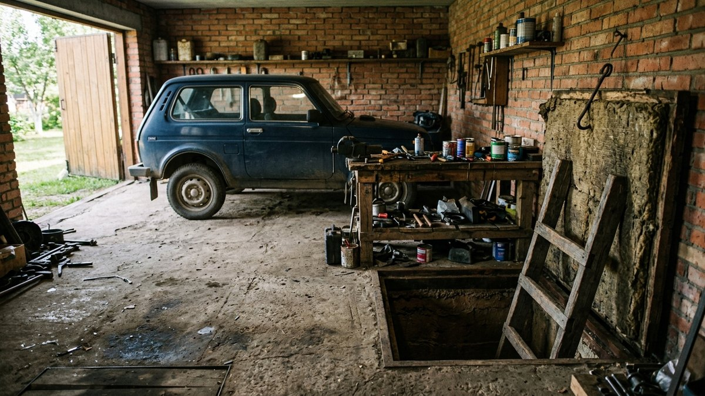
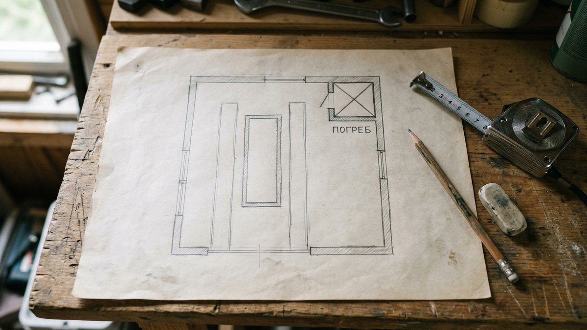
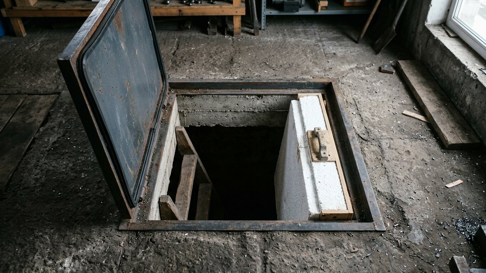
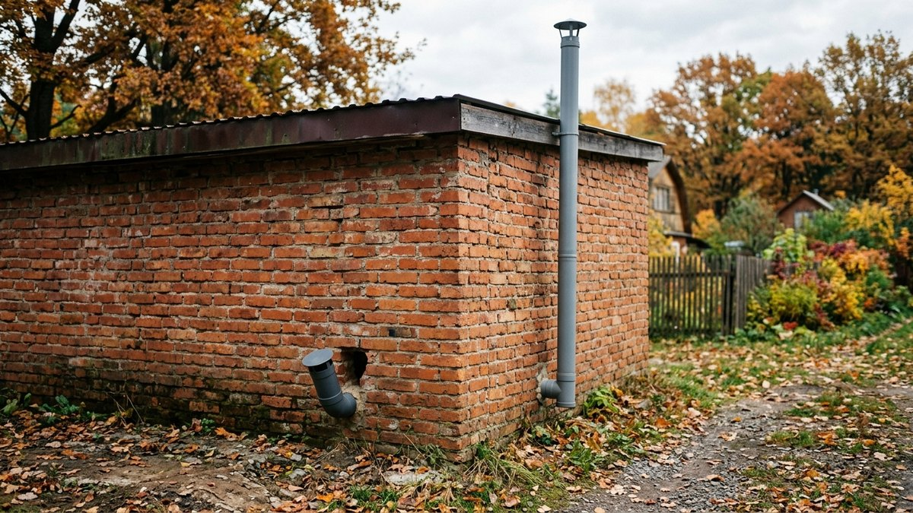
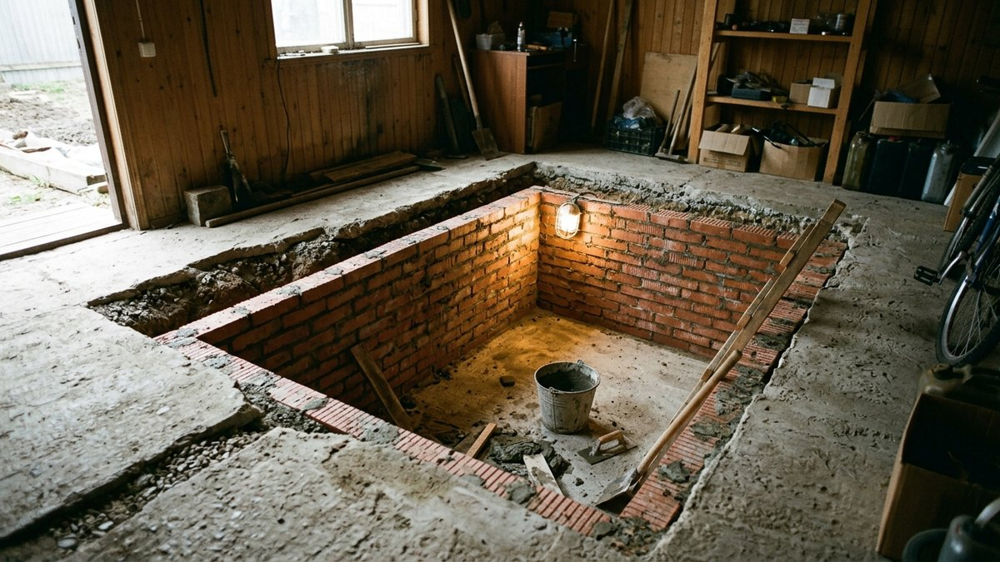
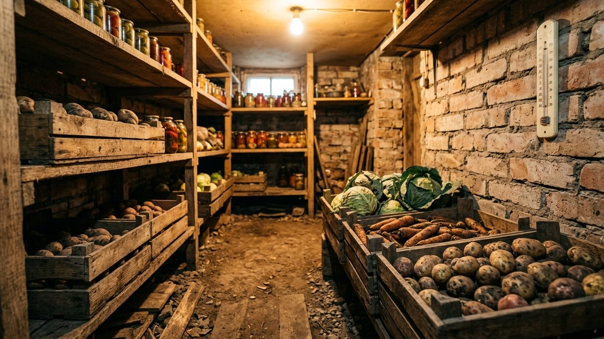

Погреб в гараже своими руками кажется простым решением: крыша уже есть,
копать можно в любую погоду, а до картошки два шага от машины. Но у
такого погреба три проблемы, которых нет у отдельно стоящего. Над ним
ездит машина весом полторы-две тонны. Гараж зимой не отапливается, и
холод идёт сверху, через пол. А в воздухе гаража всегда есть пары
бензина и выхлоп, которые тяжелее воздуха и стекают вниз. Ниже разберём,
где разместить погреб, чтобы он не мешал машине, как сделать перекрытие
и двойной люк и как провести вентиляцию, чтобы овощи не пахли бензином.
Для котлована и стен есть калькулятор.

## Можно ли копать погреб в своём гараже

В гараже на своём участке погреб — это часть постройки, отдельного
разрешения на него обычно не требуется. В гаражном кооперативе другая
ситуация: земля под боксами общая, фундаменты соседних боксов связаны,
и устав ГСК часто прямо запрещает земляные работы без согласия
правления. Прежде чем копать в кооперативе, спросите правление и
соседей по стене: если погреб подмоет фундамент соседнего бокса,
отвечать за трещины придётся вам.

Второй вопрос — грунтовые воды. Их уровень проверяют весной, в
паводок, а не летом, когда грунт сухой. Самый простой способ — пробурить
ручным садовым буром скважину на глубину 2,5–3 м в месте будущего
погреба и посмотреть, поднимется ли в ней вода за сутки.

- **Вода ниже 3 м** — строим обычный заглублённый погреб.
- **Вода на глубине 2–3 м** — погреб делают мельче (1,6–1,8 м) и с
  усиленной гидроизоляцией.
- **Вода выше 2 м** — заглублённый погреб в гараже лучше не строить.
  Альтернатива — полузаглублённый погреб или утеплённый ящик-кладовая
  у стены.

## Где разместить погреб в гараже

Главное правило: **погреб не должен быть под колёсами.** Перекрытие
можно рассчитать на вес машины, но это толстая армированная плита и
лишние деньги. Проще поставить погреб туда, где машина не ездит.

Три рабочие схемы:

1. **В углу гаража у дальней стены**, за передним бампером машины.
   Самый частый вариант: люк не мешает парковке, над погребом можно
   поставить стеллаж или верстак.
2. **Рядом с воротами, сбоку**, если гараж шире машины на 1,2 м и
   больше. Удобно заносить мешки, но зимой у ворот холоднее.
3. **Вход из смотровой ямы.** Погреб копают рядом с ямой, а лаз
   делают в её торцевой или боковой стене. Люк в полу гаража не
   нужен вообще, но яма становится частью «шлюза», и в неё тоже
   попадают выхлоп и пары бензина. Подходит, только если яму
   закрывают щитами и не используют для ремонта с открытыми
   жидкостями.

Отступ стенок погреба от фундамента гаража — не меньше 0,5–1 м.
Котлован вплотную к ленточному фундаменту ослабляет его: грунт под
подошвой начинает выдавливаться в сторону котлована.

## Из чего делать стены

Для погреба под гаражом подходят те же варианты стен, что и для
отдельно стоящего. Их цены и полную смету мы сравнивали в статье
[сколько стоит построить погреб](https://mir-doma.pro/stroitelstvo-pogreba-smeta/),
там же есть калькулятор по материалу стен. Для гаража добавляются
свои плюсы и минусы:

| Стены | Для гаража | Главный риск |
|---|---|---|
| Монолитный бетон 150 мм | лучший вариант: держит давление грунта от фундамента гаража | нужна опалубка, работа в тесноте |
| Кирпич в 1 кирпич (250 мм) | хорошо, если кладка из полнотелого керамического | силикатный кирпич размокает |
| Бетонные кольца | быстро, но нужен кран, а в готовый гараж его не завести | только если гараж ещё не построен |
| Пластиковый кессон | быстро, герметичен | всплывает при высокой воде, нужна анкеровка к бетонной плите |
| Металлический кессон | готовый, заводится через ворота | гниёт за 10–15 лет без катодной защиты |

Бетонные кольца и готовые кессоны лучше закладывать до строительства
гаража. В готовый гараж технику не завести, поэтому для него почти
всегда выбирают монолит или кирпич.

## Калькулятор котлована и стен погреба

<!-- wp:html -->

<h3 class="md-pg__title">Калькулятор погреба в гараже</h3>

Вводите внутренние размеры погреба. Котлован считается с рабочим зазором 0,3 м с каждой стороны для наружной гидроизоляции и подушкой под пол 0,25 м (щебень + бетон).

<label class="md-pg__f">Длина погреба внутри, м<input type="number" id="pgL" value="2" min="1" max="5" step="0.1"></label>
<label class="md-pg__f">Ширина погреба внутри, м<input type="number" id="pgW" value="1.5" min="1" max="5" step="0.1"></label>
<label class="md-pg__f">Высота внутри, м<input type="number" id="pgH" value="2" min="1.4" max="2.6" step="0.1"></label>
<label class="md-pg__f">Стены
<select id="pgWall">
<option value="mono" selected>Монолит 150 мм</option>
<option value="brick">Кирпич в 1 кирпич (250 мм)</option>
<option value="half">Кирпич в полкирпича (120 мм)</option>
</select></label>
<label class="md-pg__f">Запас материала, %<input type="number" id="pgRes" value="10" min="0" max="30" step="1"></label>

Грунта вынуть<b id="pgDig">—</b>

Бетон на стены<b id="pgWallQ">—</b>

Бетон на пол (100 мм)<b id="pgFloor">—</b>

Гидроизоляция снаружи<b id="pgHydro">—</b>

Полезный объём<b id="pgVol">—</b>

Кирпич — из расчёта 51 шт/м² для кладки в полкирпича и 102 шт/м² в один кирпич с учётом швов. Перекрытие и утеплитель люка считайте отдельно: их размер зависит от схемы входа.

<button type="button" id="pgCopy" class="md-pg__btn md-pg__btn--main">Скопировать результат</button>
<a id="pgVk" class="md-pg__btn md-pg__btn--vk" href="#" target="_blank" rel="noopener noreferrer">Поделиться ВКонтакте</a>
<a id="pgTg" class="md-pg__btn md-pg__btn--tg" href="#" target="_blank" rel="noopener noreferrer">Поделиться в Telegram</a>
<button type="button" id="pgShareNative" class="md-pg__btn" hidden>Поделиться…</button>
<button type="button" id="pgPrint" class="md-pg__btn">Печать</button>

<!-- /wp:html -->

## Перекрытие и двойной люк: защита от холода сверху

Отдельно стоящий погреб промерзает редко: над ним полметра грунта и
насыпь. У погреба в гараже сверху только плита перекрытия и воздух
неотапливаемого гаража, который зимой почти не теплее уличного. Поэтому
перекрытие здесь утепляют, а люк делают двойным.

**Перекрытие.** Монолитная плита 100–120 мм по несъёмной опалубке из
профлиста или готовая дорожная плита, опёртая на стены погреба не
меньше чем на 100 мм с каждой стороны. Сверху или снизу плиты —
экструдированный пенополистирол 50–100 мм. Если погреб в зоне, где
может проехать колесо, плиту делают 150 мм с двойным армированием, и
её лучше рассчитать с инженером, а не на глаз.

**Двойной люк.** Верхний люк — в уровне пола гаража, из металла
или толстой доски, с резиновым уплотнителем по периметру. Нижний —
на 30–50 см ниже, утеплённый пенополистиролом 50 мм, тоже с
уплотнителем. Между ними остаётся воздушная прослойка, которая и
держит холод. Один люк, даже утеплённый, зимой обмерзает по краям,
а конденсат с него капает прямо на полки.

## Вентиляция: только на улицу, не в гараж

Это главное отличие погреба в гараже, и на нём чаще всего ошибаются.
Если приточная труба забирает воздух из гаража, в погреб попадает всё,
что в этом воздухе есть: пары бензина и масла, выхлоп после прогрева
машины, пары растворителя. Пары бензина тяжелее воздуха и сами
стекают вниз, в любую яму. Картошка и морковь впитывают запах за
несколько недель, а скопление паров в закрытом погребе опасно.

Правильная схема:

- **Приток** — труба 100–125 мм, забор воздуха снаружи через стену
  гаража, опускается до 20–40 см от пола погреба.
- **Вытяжка** — труба того же диаметра из-под потолка погреба,
  выводится через крышу гаража выше конька или на 0,5–1 м над кровлей.
- **Обе трубы на всём протяжении внутри гаража — герметичные**, без
  отверстий и тройников. Проходы через перекрытие погреба заделывают
  монтажной пеной и герметиком.
- **Люк герметичный.** Уплотнитель на обоих люках нужен не только
  для тепла, но и чтобы воздух гаража не затягивало в погреб.

Как рассчитать диаметр труб под объём погреба и что делать, если
вентиляция не тянет, подробно разобрано в статье
[вентиляция в погребе своими руками](https://mir-doma.pro/ventilyaciya-v-pogrebe/).
В гараже схема та же, меняется только маршрут труб.

И ещё одно правило эксплуатации: не прогревайте машину в гараже с
закрытыми воротами и не держите канистры с топливом у люка.

## Порядок работ пошагово

1. **Разметить погреб** с отступом от фундамента гаража 0,5–1 м и
   вне колеи машины. Если пол гаража бетонный — вырезать проём
   алмазным диском или болгаркой по разметке.
2. **Выкопать котлован** с зазором 0,3 м с каждой стороны под
   наружную гидроизоляцию. Грунт выносить сразу: в гараже его некуда
   складировать, а каждая ходка через ворота с тачкой — десятки
   килограммов.
3. **Подготовить дно:** песок 10 см, щебень 10–15 см с трамбовкой,
   бетонная стяжка 100 мм с сеткой.
4. **Возвести стены** — залить монолит в опалубку или выложить кирпич
   на цементный раствор. Внутреннюю поверхность монолита не
   штукатурить, кирпич — расшить швы.
5. **Сделать гидроизоляцию снаружи**: обмазочная битумная мастика в два
   слоя, при высоких грунтовых водах сверху — наплавляемый рулонный
   материал. Затем засыпать пазуху глиной или грунтом с трамбовкой.
6. **Проложить вентиляцию** до перекрытия: трубы проще завести, пока
   нет плиты.
7. **Залить перекрытие** с проёмом под люк, утеплить.
8. **Собрать двойной люк**, поставить лестницу и полки. Размеры полок
   и выбор дерева мы описали в статье [про полки в погреб](https://mir-doma.pro/polki-v-pogreb-svoimi-rukami/).
9. **Просушить погреб** 1–2 месяца с открытыми люками и вентиляцией,
   перед закладкой урожая обработать. Чем и как дезинфицировать погреб
   перед закладкой — в статье [обработка погреба осенью](https://mir-doma.pro/obrabotka-pogreba-osenyu/).

## Какая температура будет в погребе зимой

Нормальный погреб держит 2–5 °C. Погреб в неотапливаемом гараже с
утеплённым перекрытием и двойным люком в средней полосе обычно держит
тот же диапазон, но в сильные морозы может опуститься до 0–1 °C у
потолка. Поэтому в таком погребе:

- **Корнеплоды хранят внизу**, у пола, где теплее, а не на верхних
  полках.
- **В мороз закрывают приточную трубу** на 2/3 заслонкой: холодный
  воздух с улицы выстужает погреб быстрее, чем через перекрытие.
- **Ставят термометр** с выносным датчиком, чтобы не спускаться лишний
  раз и не выпускать тепло.

Если гараж отапливается, картина обратная: погреб может перегреваться,
особенно если перекрытие не утеплено. Утеплитель в перекрытии нужен в
обоих случаях.

## Частые ошибки

- **Погреб под колёсами на тонкой плите.** Плита 80–100 мм без расчёта
  трескается за пару лет, трещина в перекрытии — это вода и холод.
- **Котлован вплотную к фундаменту гаража.** Грунт под лентой
  выдавливается в сторону, по стенам гаража идут трещины.
- **Приток из объёма гаража.** Овощи пахнут бензином, а в погребе
  копятся пары топлива.
- **Один люк без уплотнителя.** Зимой люк обмерзает, конденсат капает
  на урожай, а верхние полки промерзают.
- **Силикатный кирпич на стены.** Во влажном грунте он размокает и
  крошится.
- **Уровень воды проверяли летом.** Весной вода поднимается на 0,5–1 м
  выше, и новый погреб затапливает в первый же паводок.

## Частые вопросы

### Как сделать погреб в гараже своими руками

Выбрать место вне колеи машины с отступом 0,5–1 м от фундамента,
выкопать котлован, залить бетонное дно, возвести стены из монолита или
кирпича, сделать наружную гидроизоляцию, провести вентиляцию на улицу,
залить утеплённое перекрытие и поставить двойной люк. Погреб 2 × 1,5 м
вдвоём можно построить за 2–3 недели.

### Какой глубины делать погреб в гараже

Высота внутри — 1,8–2,2 м, чтобы стоять в полный рост. С учётом
подушки под пол глубина котлована получается 2,1–2,5 м от пола гаража.
Дно должно быть не меньше чем на 0,5 м выше уровня грунтовых вод в
весенний паводок.

### Почему в погребе в гараже сыро

Чаще всего из-за слабой вентиляции или отсутствия наружной
гидроизоляции. Вторая причина — конденсат на холодном люке и
перекрытии: если они не утеплены, влага из воздуха погреба оседает на
них и капает вниз. Решение — утеплить перекрытие и люк, проверить
тягу вытяжной трубы.

### Можно ли сделать погреб под смотровой ямой

Под самой ямой — нет: пришлось бы копать на 4 м и глубже, и почти
всегда ниже уровня грунтовых вод. Рабочий вариант — погреб рядом с ямой
с лазом из её торцевой стены. Но тогда яма работает как шлюз, и её
нужно закрывать щитами, чтобы воздух гаража не стекал в погреб.

### Промерзает ли погреб в холодном гараже

Промерзает, если у него один неутеплённый люк и перекрытие без
утеплителя. С двойным люком, пенополистиролом 50–100 мм на перекрытии
и прикрытым в мороз притоком погреб в средней полосе держит плюсовую
температуру всю зиму.
