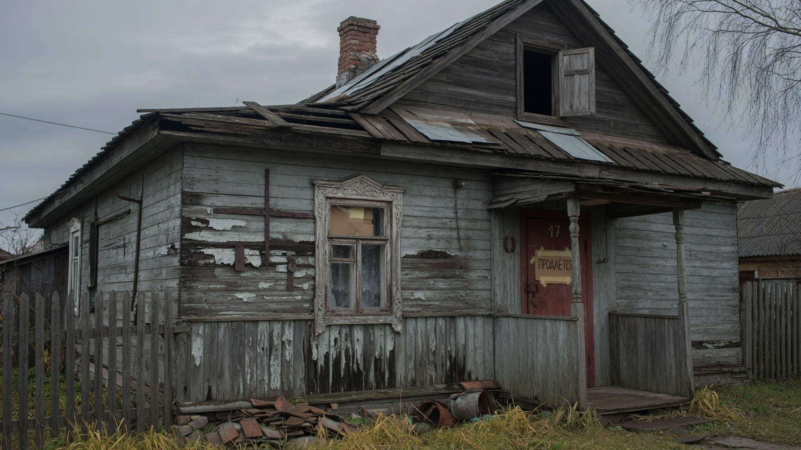
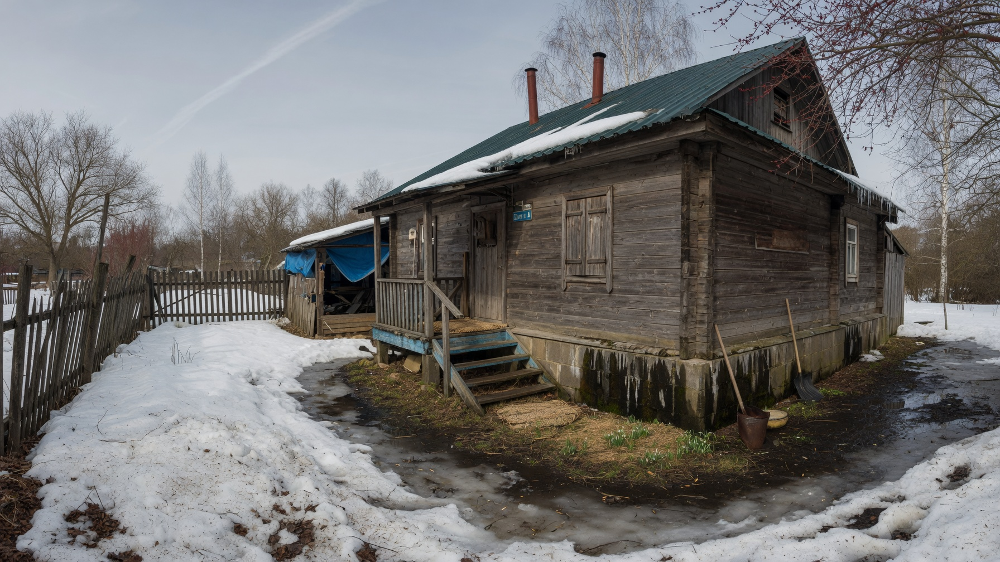
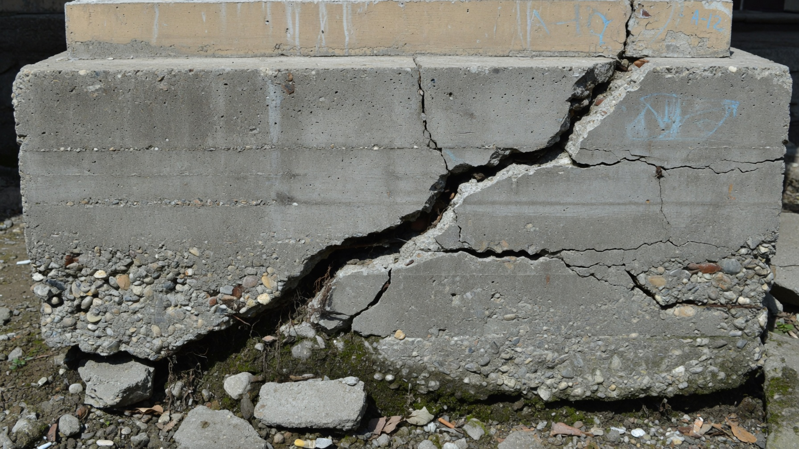
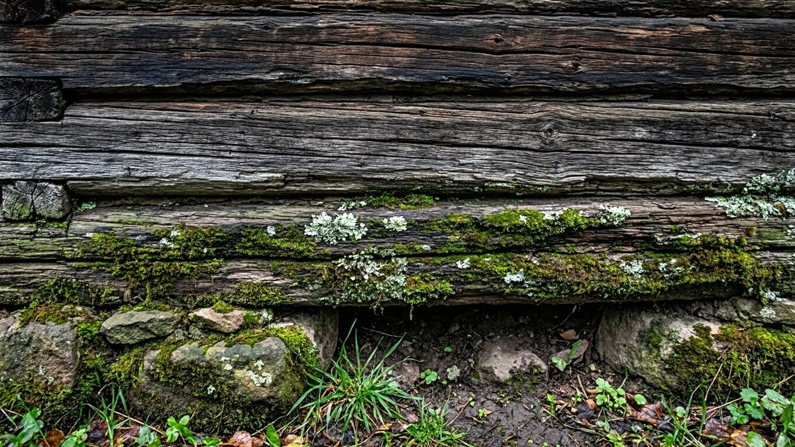
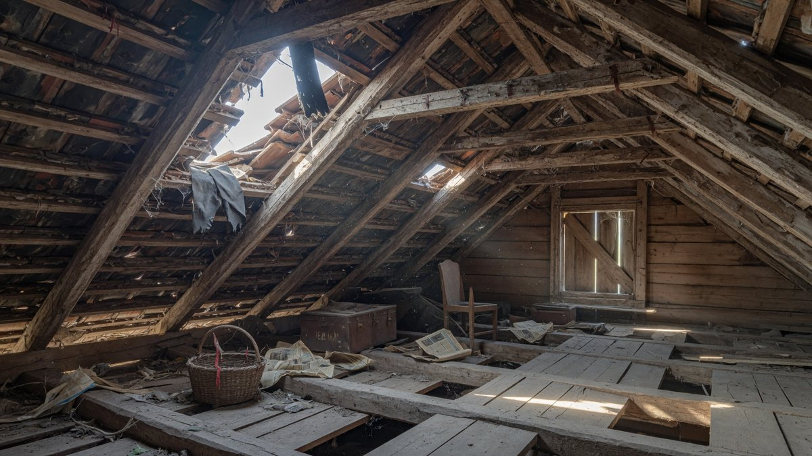
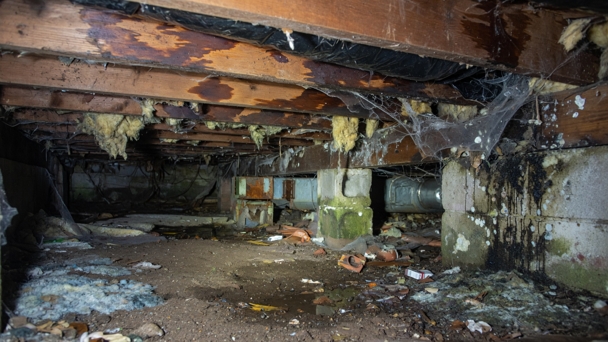
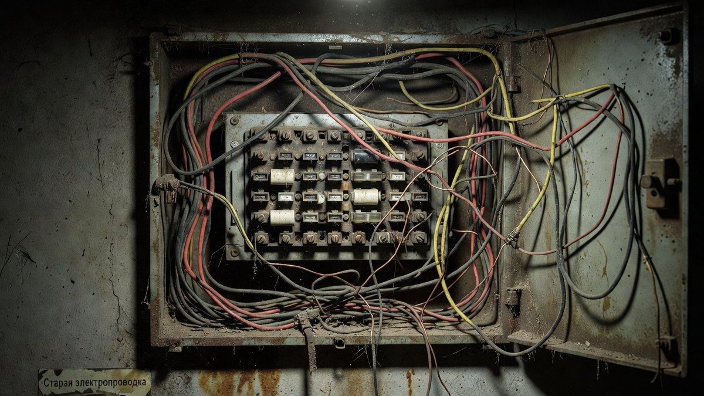

Старый дом — это всегда сделка с неизвестностью: снаружи аккуратный сайдинг, а под ним могут оказаться сгнившие венцы и фундамент, который «поехал» лет двадцать назад. Хорошая новость в том, что большинство серьёзных проблем видно при внимательном осмотре — если знать, куда смотреть и в какое время года приезжать. Разберём по шагам: когда ехать смотреть дом, что проверять в конструкциях и коммуникациях, какие документы запросить и какие признаки означают «разворачиваемся и уходим».

## 📅 Когда лучше смотреть дом: время года решает многое

Это первое, о чём стоит подумать, и почти никто об этом не думает. **Один и тот же дом в июле и в апреле выглядит по-разному** — и продавцы это прекрасно знают.

| Сезон | Что видно лучше всего | Что скрыто |
|---|---|---|
| **Ранняя весна** ⭐ | Подтопление талыми водами, уровень грунтовых вод, сырость в подполе, промерзание, плесень после зимы | Состояние участка и сада под остатками снега |
| **Осень, в дождь** ⭐ | Протечки крыши, работа водостоков, отвод воды от фундамента, сырость, запах | Многое уже пожухло, участок не в лучшем виде |
| **Зима** | Как дом держит тепло, промерзание углов, сквозняки, реальные расходы на отопление, чистят ли дорогу | Фундамент, отмостка и участок под снегом |
| **Лето** ⚠️ | Участок в лучшем виде, всё сухо и приветливо | **Почти все проблемы с влагой, промерзанием и протечками** |

**Лучшее время для покупателя — ранняя весна и дождливая осень.** Именно тогда дом показывает свои слабые места: где подтапливает, где течёт, где сыро. Лето — лучшее время для продавца: сухо, зелено, и ни одна протечка себя не проявит.

**Практическая тактика:** если дом понравился летом, попробуйте приехать ещё раз в дождь. Или хотя бы расспросите соседей, что здесь бывает весной — они расскажут больше, чем продавец.

И отдельно: **приезжайте смотреть днём, при хорошем свете**, и закладывайте на осмотр минимум пару часов. Вечерний осмотр «на бегу» с фонариком телефона — способ не увидеть ничего.

## 🎒 С чем ехать на осмотр

Возьмите с собой простой набор — он превращает поверхностный осмотр в настоящую проверку:

- **мощный фонарь** — подпол, чердак, тёмные углы;
- **шило или отвёртку** — тыкать деревянные конструкции: здоровое дерево не поддаётся, гнилое протыкается как масло;
- **строительный уровень** (или приложение в телефоне) — проверять горизонт полов и вертикаль стен;
- **шарик или круглый карандаш** — покатить по полу: сразу видно уклон;
- **рулетку** — сверить реальные размеры с документами;
- **старую одежду** — в подпол и на чердак придётся лезть;
- **блокнот или телефон** — фиксировать замечания и фотографировать.

Если дом серьёзно рассматривается — есть смысл заплатить **строительному эксперту** за независимый осмотр. Это стоит денег, но на фоне цены дома сумма небольшая, а находки эксперта часто становятся аргументом для торга и окупаются многократно.

## 🧱 Фундамент: с него начинается всё

Фундамент — самая дорогая для исправления часть. Дом с гнилым полом можно перебрать, с плохим фундаментом — почти нет.

**На что смотреть:**

- **Трещины.** Волосяные усадочные трещины — обычно не страшно. **Опасны раскрытые трещины шире 2–3 мм**, особенно расходящиеся клином или идущие через углы. Если хозяин говорит «давно не растут» — попросите показать маячки или спросите, когда появились.
- **Перекос дома.** Проверьте уровнем горизонт полов, посмотрите на линию конька и окон со стороны. Двери и окна, которые не закрываются или заедают, — типичный признак движения фундамента.
- **Разрушение материала** — крошащийся бетон, выпадающий раствор из кладки, оголённая ржавая арматура.
- **Отмостка** — есть ли она, не отошла ли от стены, куда уходит вода.
- **Продухи в подполе** — есть ли они, не заложены ли наглухо (частая причина гниения пола).
- **Высота цоколя.** Низкий цоколь означает, что снег и вода регулярно контактируют с нижними венцами.

⚠️ **Если дом на винтовых сваях** — уточните возраст и попросите посмотреть, нет ли крена; ржавые сваи меняют весь расчёт. Разница между ленточным и свайным фундаментом — в несущей способности, сроке службы и стоимости переделки — подробно разобрана в статье [какой фундамент выбрать для дачного дома](https://mir-doma.pro/kakoy-fundament-vybrat-dlya-doma/): она пригодится, чтобы понять, насколько тип фундамента вообще подходит под этот дом.

## 🪵 Стены и нижние венцы (для деревянного дома)

У деревянного дома главная зона риска — **нижние венцы и места, где дерево контактирует с влагой**.

- **Тычьте шилом** нижние брёвна по всему периметру, особенно в углах, под окнами и там, где рядом земля или пристройки. Мягкое, трухлявое дерево — гниль.
- **Простучите** — глухой звук вместо звонкого говорит о разрушении внутри.
- **Ищите тёмные пятна, грибок, белый налёт** — следы длительной сырости.
- **Проверьте венцы под верандой и крыльцом** — там сыро и продавцы туда не заглядывают.
- **Осмотрите углы изнутри** — промерзающие углы выдают себя тёмными пятнами, отслоившимися обоями, плесенью.

**Для дома из кирпича или блока:** ищите трещины в кладке (особенно диагональные — признак осадки), выкрашивание раствора, следы промерзания и высолы (белые разводы — признак постоянной влаги).

⚠️ **Свежая обшивка сайдингом или вагонкой** на старом доме — повод насторожиться и попросить вскрыть небольшой участок или заглянуть под обшивку в незаметном месте. Обшивка часто скрывает именно то, что вы ищете.

## 🏠 Крыша, чердак и перекрытия

**Обязательно поднимитесь на чердак.** Это одно из самых информативных мест в доме, и именно туда покупатели ленятся лезть.

Что смотреть:

- **Следы протечек** — тёмные подтёки на стропилах и обрешётке, пятна на утеплителе, ржавчина на гвоздях;
- **состояние стропил** — тыкайте шилом, ищите гниль и трещины, особенно у мауэрлата (там, где стропила опираются на стену);
- **грибок и плесень** — признак того, что кровля течёт или чердак не проветривается;
- **дневной свет** сквозь кровлю — очевидный, но частый признак;
- **утепление** — есть ли, не слежалось ли, не сырое ли;
- **вентиляция чердака** — есть ли продухи и слуховые окна;
- **дымоход** — трещины, разрушение кладки, следы копоти вокруг (риск пожара).

Изнутри дома посмотрите на **потолки**: жёлтые и рыжие разводы — следы протечек. Свежепокрашенный потолок в старом доме — классический способ их скрыть, обратите на это внимание.

**Перекрытия и полы:** пройдитесь по всем комнатам, прислушиваясь к прогибам и скрипу. Прокатите шарик — покажет уклон. Прогибающийся пол может означать и просто изношенные лаги, и гниль в подполе — а это разные бюджеты.

## 🕳️ Подпол и подвал: самое честное место в доме

Если дать один совет, он будет такой: **обязательно спуститесь в подпол.** Там нельзя ничего замаскировать косметикой, и он расскажет о доме больше, чем весь остальной осмотр.

Что искать:

- **запах сырости и затхлости** — чувствуется сразу;
- **влажный грунт, лужи, следы стоявшей воды** на стенах (горизонтальная граница потемнения);
- **плесень и белый пушистый налёт** (домовой грибок — серьёзная проблема);
- **состояние лаг и балок** — тыкать шилом обязательно;
- **работают ли продухи**, есть ли вентиляция;
- **следы грызунов**;
- **проходящие коммуникации** — трубы, их состояние, утепление.

**Отказ хозяина показать подпол или чердак** — сам по себе достаточная причина усомниться в доме.

## ⚡ Коммуникации: где прячутся неожиданные расходы

**Электрика.**

- Какая мощность выделена на дом (принципиальный вопрос, если планируете электроотопление или мощную технику);
- **алюминиевая проводка** старого образца — почти наверняка под замену, это ощутимая сумма и грязные работы;
- состояние щитка: есть ли автоматы и УЗО или стоят «пробки» и скрутки;
- проверьте розетки и выключатели в каждой комнате;
- есть ли заземление.

**Вода.**

- Что за источник — колодец, скважина, центральный водопровод; какая глубина, не пересыхает ли летом (спросите соседей);
- **зимний вариант водопровода** — утеплён ли ввод, есть ли возможность слить систему;
- попросите **набрать воду и посмотреть** — цвет, запах, напор. В идеале — сдать пробу на анализ;
- состояние насоса, его возраст.

Что выбрать, если источник придётся делать заново, разобрано в статье про [скважину или колодец](https://mir-doma.pro/skvazhina-ili-kolodec/).

**Канализация.**

- Что стоит: септик, выгребная яма или ничего;
- как часто откачивают, есть ли подъезд для ассенизатора;
- нет ли запаха на участке (признак проблем). Про варианты — в статье про [септик для дачи](https://mir-doma.pro/septik-dlya-dachi/).

**Отопление.**

- Чем топят и сколько это стоит **в реальности** — спрашивайте конкретные цифры за зиму;
- состояние печи и дымохода (трещины, тяга), котла и радиаторов;
- есть ли газ или возможность подключения (это сильно влияет на цену дома и на расходы);
- насколько дом вообще утеплён — от этого зависят все будущие счета.

## 📄 Документы: что запросить до задатка

Юридическая часть — то, где ошибка стоит дороже любого ремонта. Разумный минимум:

- **выписка из ЕГРН** на дом и на землю — свежая, а не годичной давности;
- **правоустанавливающие документы** — на каком основании продавец владеет (покупка, наследство, дарение, приватизация);
- **межевание** — установлены ли границы участка, совпадают ли они с фактическим забором;
- **категория земли и вид разрешённого использования** — можно ли здесь жить и прописаться;
- **все ли постройки зарегистрированы** — незарегистрированные пристройки и бани становятся вашей проблемой;
- **соответствие площади** дома и участка документам;
- **кто зарегистрирован** в доме, нет ли лиц с правом проживания;
- **обременения, аресты, залоги** — видно в выписке;
- **согласие супруга** на продажу, если объект приобретён в браке;
- **если продажа по доверенности** — отдельная проверка, это зона повышенного риска;
- **если дом недавно получен в наследство** — риск появления других наследников.

⚠️ **Важно:** это ориентировочный список, а не юридическая консультация. Перед сделкой имеет смысл привлечь юриста по недвижимости — его услуги стоят несопоставимо меньше цены дома, а рисков снимают много.

## 🌍 Участок и окружение: то, что не изменить

Дом можно отремонтировать, участок — улучшить. А вот местоположение и соседей — нет.

- **Подтопление.** Спросите прямо: заливает ли весной? Посмотрите на уровень участка относительно соседних и дороги. Признаки — следы воды на цоколе, дренажные канавы, влаголюбивые растения (осока, камыш).
- **Уровень грунтовых вод** — заглянуть в колодец, спросить соседей, посмотреть подпол.
- **Подъезд зимой.** Чистят ли дорогу, кто и за чей счёт. Прекрасный дом, к которому с декабря по март не подъехать, — распространённая история.
- **Соседи и окружение** — поговорите с ними, это лучший источник правды о доме и месте. Спросите, почему продают.
- **Что рядом** — трасса, ферма, промзона, свалка, ЛЭП, кладбище. Приезжайте в разное время суток: тихое место днём может гудеть от трассы ночью.
- **Инфраструктура** — магазины, аптека, школа, как доезжает скорая, есть ли интернет и связь (проверьте прямо на месте).
- **Стороны света и тень** — куда выходят окна, не затеняет ли участок лес или соседский дом. Про это подробно в статье про [расположение дома на участке](https://mir-doma.pro/raspolozhenie-doma-na-uchastke/).
- **Место под будущие постройки.** Если на участке нет бани, а она в планах, заранее прикиньте, хватит ли отступов от границы и соседского дома — нормы и порядок строительства разобраны в статье [как построить баню на даче](https://mir-doma.pro/kak-postroit-banyu-na-dache/).

## 🚩 Красные флаги: когда стоит насторожиться

Признаки, каждый из которых сам по себе не приговор, но требует объяснения:

- **свежий косметический ремонт** в старом доме — особенно свежая краска на потолке и в углах;
- **новая обшивка** стен и полов, скрывающая конструкции;
- **сильный запах освежителя, краски или благовоний** — часто маскируют запах сырости;
- **отказ показать подпол, чердак или дальнюю комнату**;
- **осмотр только вечером или в темноте**, торопливость показа;
- **давление и срочность** — «есть другой покупатель, вносите задаток сегодня»;
- **нежелание отвечать на прямые вопросы** о протечках, подтоплении, расходах;
- **цена заметно ниже рынка** без внятной причины;
- **дом долго не продаётся** — стоит выяснить, почему;
- **продажа по доверенности** или сразу после вступления в наследство.

## 💰 Что даёт основание для торга

Найденные недостатки — это не только повод отказаться, но и аргумент для снижения цены. Обычно торгуются за:

- гнилые венцы и необходимость подъёма дома;
- трещины и просадку фундамента;
- протекающую кровлю и изношенные стропила;
- полную замену проводки;
- отсутствие или неисправность септика;
- отсутствие нормального отопления и утепления;
- проблемы с водой (пересыхающий колодец, плохой анализ);
- незарегистрированные постройки.

Считайте не «сколько просят», а **сколько будет стоить дом после приведения в порядок**. Иногда дешёвый дом с тремя серьёзными проблемами обходится дороже, чем крепкий по адекватной цене.

## 📱 Интерактивный чек-лист: отмечайте прямо на осмотре

Полная версия проверки — 72 пункта по всем узлам дома. Отмечайте галочки прямо с телефона, пока ходите по дому: всё сохранится в браузере, даже если закроете страницу и вернётесь на следующий день. Впишите адрес объекта, добавьте заметки, а в конце отправьте отчёт себе в мессенджер одной кнопкой — удобно, когда смотрите несколько домов и через неделю уже не помните, где именно был сырой подпол.

<!-- wp:html -->

  

    <h3 class="md-cl__title">Чек-лист осмотра дома</h3>
    
Отмечайте пункты прямо на осмотре — всё сохранится в браузере на этом устройстве.

    <input type="text" id="mdAddr" class="md-cl__addr" placeholder="Адрес или название объекта (например: Иваново, ул. Лесная 12)">
    

      

      0 из 0
    

  

  

  

    <label for="mdNotes" class="md-cl__nlabel">Общие заметки по объекту</label>
    <textarea id="mdNotes" class="md-cl__textarea" rows="4" placeholder="Что смутило, о чём спросить, что уточнить у соседей, торг..."></textarea>
  

  

    <button type="button" id="mdShare" class="md-cl__btn md-cl__btn--main">Сохранить отчёт</button>
    <button type="button" id="mdCopy" class="md-cl__btn">Скопировать</button>
    <button type="button" id="mdPrint" class="md-cl__btn">Печать</button>
    <button type="button" id="mdReset" class="md-cl__btn md-cl__btn--ghost">Очистить</button>
  

  

<!-- /wp:html -->

## ✅ Краткий чек-лист: главное в 15 пунктах

Если нужна короткая версия — распечатать или держать перед глазами:

1. Приехал в подходящий сезон (весна/дождливая осень), днём, с фонарём и шилом.
2. Спустился в подпол: сырость, плесень, лаги, продухи.
3. Поднялся на чердак: протечки, стропила, утепление, дымоход.
4. Обошёл фундамент: трещины, отмостка, цоколь, перекос.
5. Проткнул шилом нижние венцы по периметру.
6. Проверил полы уровнем и шариком, послушал прогибы.
7. Открыл-закрыл все двери и окна.
8. Осмотрел потолки на предмет разводов.
9. Проверил электрощиток, розетки, мощность.
10. Набрал воду: напор, цвет, запах.
11. Выяснил про отопление и реальные расходы за зиму.
12. Обошёл участок: уклон, следы воды, дренаж.
13. Поговорил с соседями.
14. Запросил документы и проверил ЕГРН.
15. При серьёзных намерениях — пригласил эксперта и юриста.

## ❓ Частые вопросы

**В какое время года лучше покупать старый дом?**
Смотреть лучше ранней весной или дождливой осенью: тогда видны подтопление, протечки крыши и сырость в подполе. Летом дом выглядит лучше всего, и именно поэтому большинство проблем с влагой остаются незаметными.

**На что в первую очередь смотреть при покупке старого дома?**
На фундамент (трещины, перекос), нижние венцы или кладку, крышу и чердак на предмет протечек, а также подпол — там сырость и гниль видно честнее всего. Затем электрика, вода, канализация и отопление.

**Как проверить, не гнилое ли дерево в доме?**
Ткнуть шилом или отвёрткой: здоровое дерево твёрдое и не поддаётся, гнилое протыкается легко и крошится. Проверять нужно нижние венцы по периметру, лаги в подполе и стропила на чердаке, особенно в углах и у земли.

**Стоит ли покупать дом с трещиной в фундаменте?**
Зависит от трещины. Тонкие усадочные обычно не опасны, а раскрытые шире 2–3 мм, расходящиеся клином или проходящие через углы, говорят о движении фундамента. В таком случае нужна оценка специалиста — исправление фундамента самая дорогая из возможных работ.

**Какие документы проверить при покупке дома?**
Свежую выписку из ЕГРН на дом и землю, правоустанавливающие документы, межевание, категорию земли и вид разрешённого использования, зарегистрированность всех построек, отсутствие обременений и прописанных лиц. Перед сделкой лучше привлечь юриста.

**Что должно насторожить при осмотре?**
Свежий косметический ремонт и покраска потолка в старом доме, новая обшивка стен, сильный запах освежителя, отказ показать подпол или чердак, показ в темноте, спешка и давление с задатком, а также цена заметно ниже рыночной без объяснений.

**Нужен ли строительный эксперт при покупке?**
Если дом рассматривается всерьёз — да. Его услуги стоят небольшую долю от цены дома, а выявленные дефекты либо уберегут от плохой покупки, либо станут аргументом для торга и окупятся.

---

Покупка старого дома — это про внимательность, а не про удачу. Приезжайте смотреть в «неудобный» сезон, лезьте в подпол и на чердак, берите с собой шило и фонарь, разговаривайте с соседями и не спешите с задатком. Дом, который честно показывают в дождливый апрель, почти наверняка стоит того, чтобы его купить.

**Куда идти дальше:**

- Нашли трещину в фундаменте или гниль в венцах? Это ещё не приговор: как понять, опасно ли это, сколько стоит подъём дома и где искать мастеров — в статье про [ремонт фундамента и замену венцов](https://mir-doma.pro/remont-fundamenta-i-venczov/).
- Дом куплен, и предстоит приводить его в порядок — с чего начать и что делать в первую очередь, в статье про [обновление старой дачи](https://mir-doma.pro/kak-obnovit-staruyu-dachu/).
- Если при осмотре выяснилось, что дом холодный, первым делом считайте бюджет на тепловой контур: [утепление дачного дома](https://mir-doma.pro/kak-uteplit-dachnyy-dom/).
- Прогнившие полы — типичная находка в старых домах, и починить их реально своими силами: [ремонт деревянного пола](https://mir-doma.pro/remont-derevyannogo-pola/).
- А если течёт кровля, откладывать нельзя — вода быстро добирается до стропил и перекрытий: [ремонт крыши на даче](https://mir-doma.pro/remont-kryshi-na-dache/).
