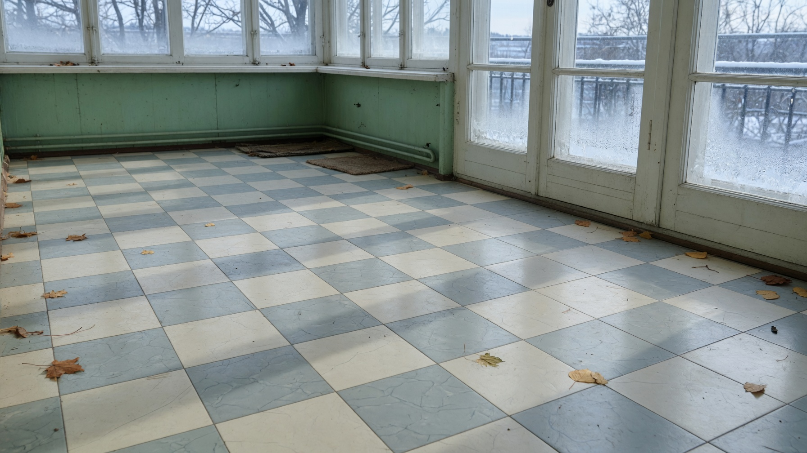
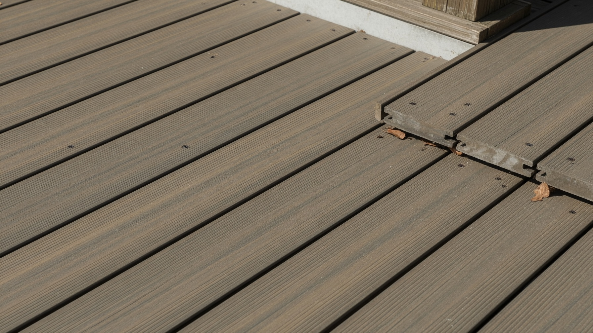
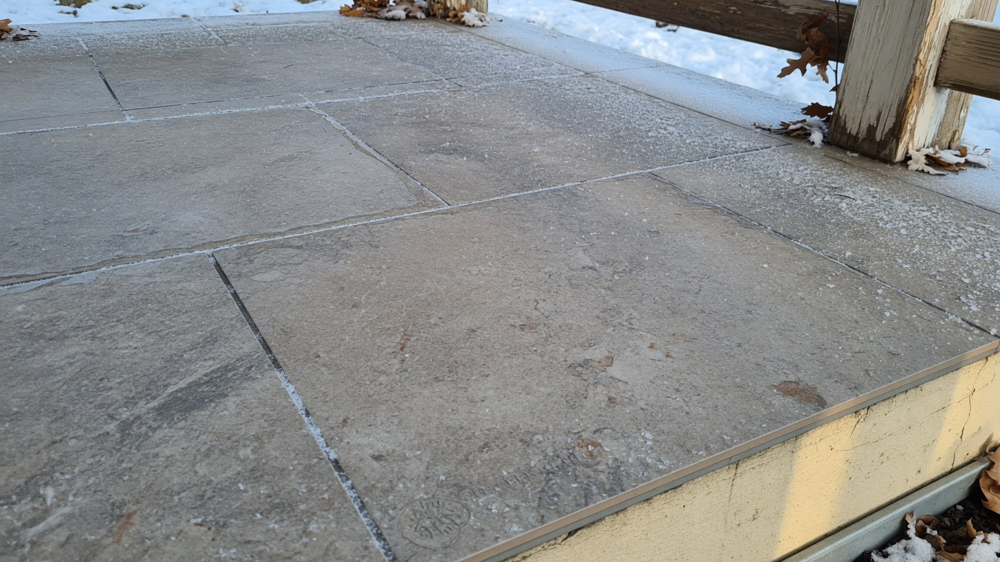
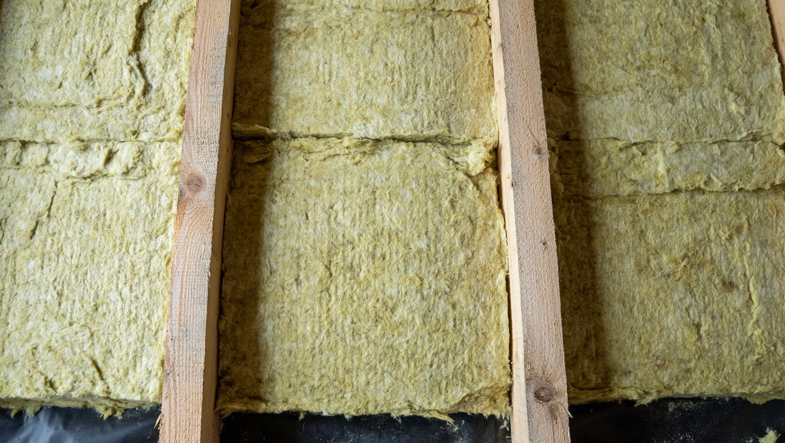
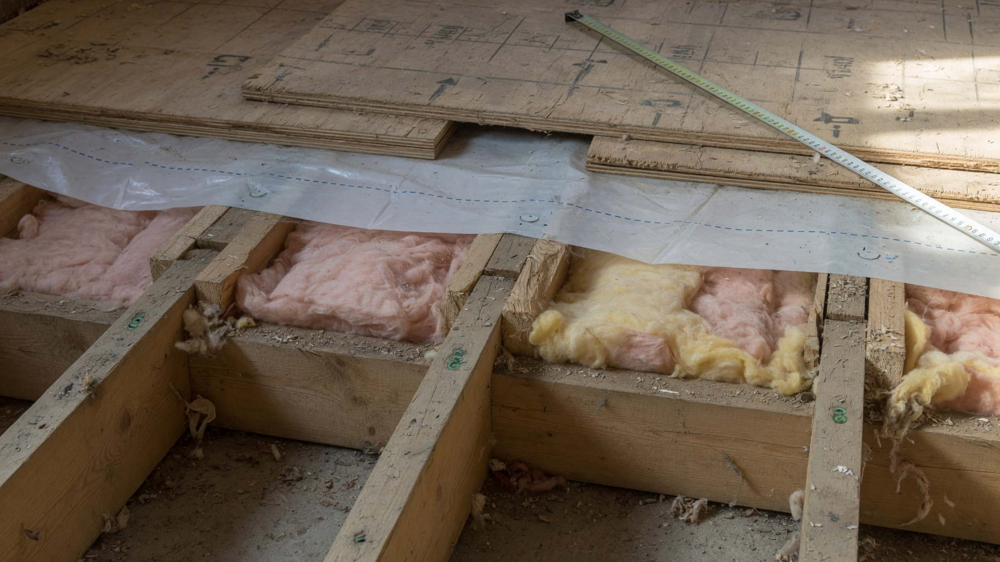
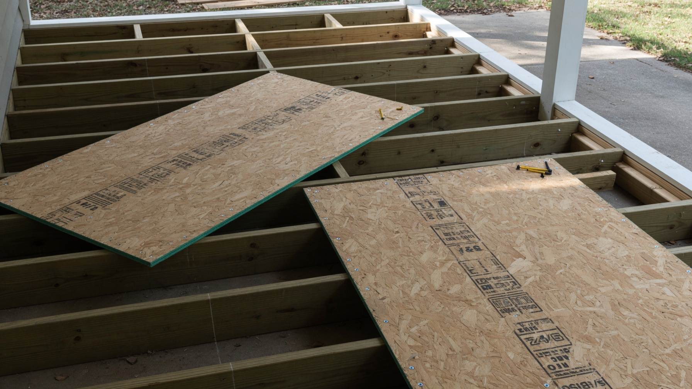

Пол на холодной веранде живёт в самых тяжёлых условиях в доме: зимой минус, весной конденсат снизу, круглый год — уличная обувь, песок и вода с зонтов. Обычный ламинат здесь вздувается за один сезон, а линолеум трескается на морозе. Разберём, какие покрытия действительно выдерживают такие условия, как собрать пирог пола по лагам и по бетону, есть ли смысл его утеплять — и посчитаем материалы прямо в статье.

## ❄️ Почему пол на веранде — особый случай

Три фактора, которых нет в комнате:

- **Переход через ноль.** За зиму материал переживает десятки циклов замерзания и оттаивания. Влага, попавшая в структуру, расширяется при замерзании и разрушает покрытие изнутри — так трескается неморозостойкая плитка и расслаивается ламинат.
- **Влага снизу.** Под верандой обычно продуваемое подполье или грунт. Если нет гидроизоляции, пол тянет влагу снизу постоянно.
- **Абразив и вода сверху.** Веранда — это тамбур: сюда заходят в уличной обуви, здесь стоят мокрые зонты и вёдра.

Отсюда требование к покрытию: **морозостойкость плюс влагостойкость**. Всё остальное — вкус и бюджет.

## 🪵 Чем застелить пол: сравнение покрытий

| Покрытие | Морозостойкость | Влагостойкость | Цена | Монтаж | Комфорт босиком |
|---|---|---|---|---|---|
| **Керамогранит** | Высокая (класс морозостойкий) | Максимальная | Средняя | Средней сложности | Холодный |
| **Террасная доска (ДПК)** | Высокая | Максимальная | Выше средней | Простой | Тёплая |
| **Доска из лиственницы** | Высокая | Высокая (с обработкой) | Выше средней | Средний | Тёплая |
| **Кварцвинил SPC** | Средняя (смотреть маркировку) | Высокая | Средняя | Простой | Средне |
| **Морозостойкий линолеум** | Средняя | Высокая | Низкая | Самый простой | Средне |
| **Обычный ламинат** | ❌ Нет | ❌ Нет | Низкая | Простой | — |
| **Паркет, ковролин** | ❌ Нет | ❌ Нет | — | — | — |

**Как выбрать под себя:**

- **надолго и без хлопот** → керамогранит. Обязательно **морозостойкий** (маркировка снежинкой) и на клей для наружных работ — обычный плиточный клей на морозе отпускает плитку;
- **тепло под ногами и простой монтаж** → террасная доска ДПК: не боится ничего, кладётся на лаги, подходит и для полуоткрытых веранд;
- **натуральное дерево** → доска из лиственницы: она смолистая и плотная, служит долго, но требует обработки маслом или лаком раз в пару лет;
- **бюджетно и быстро** → морозостойкий линолеум или кварцвинил SPC. Главное — проверить на упаковке допустимый диапазон температур, у бытовых серий он часто начинается от +5 °C.

## 🧊 Утеплять пол на холодной веранде или нет

Тот же честный ответ, что и для стен: **утеплитель не производит тепло, он только замедляет его уход.**

- **Веранда останется холодной** — утепление пола не сделает её теплее. Но смысл всё равно есть, и другой: утеплённый пол **отсекает холод и влагу снизу**, покрытие меньше страдает от перепадов, а под ногами не так морозно. Плюс если под верандой подполье, утепление снижает конденсат на нижней стороне пола.
- **Веранду будете отапливать** — утепление пола обязательно, иначе тепло уйдёт вниз. Здесь оно окупается прямо.
- **Гидроизоляция нужна в любом случае** — независимо от того, утепляете вы или нет.

**Практический вывод:** на холодной веранде утеплять пол стоит, но ждать от этого тепла не надо — это защита конструкции, а не обогрев.

 Если хочется именно тепла, нужен источник: как вариант — [тёплый пол на даче](https://mir-doma.pro/teplyy-pol-na-dache/), но он оправдан только на утеплённой веранде, которую вы отапливаете.

## 🥪 Два пирога: по лагам и по бетону

### Пирог по лагам (деревянное основание)

Самый частый случай на дачной веранде. Снизу вверх:

1. **Черновой подшив** снизу лаг (доска, ОСП) — держит утеплитель.
2. **Ветро-влагозащитная мембрана** — со стороны подполья, защищает утеплитель от влаги снизу, но выпускает пар.
3. **Утеплитель** между лагами, враспор, без щелей.
4. **Пароизоляция** — сверху утеплителя, со стороны помещения.
5. **Вентзазор 2–3 см** — контррейка по лагам (для деревянного финиша).
6. **Черновой пол** — ОСП-3 или влагостойкая фанера (под плитку и рулонные покрытия).
7. **Финишное покрытие.**

**Шаг лаг:** 50–60 см под ОСП и фанеру, до 40 см под тонкие покрытия и плитку — иначе основание играет и плитка трескается.

### Пирог по бетону

Если веранда стоит на плите или стяжке:

1. **Бетонное основание**, выровненное.
2. **Гидроизоляция** — обмазочная или рулонная.
3. **Утеплитель ЭППС** — он не боится сжатия и влаги, поэтому для пола по бетону подходит лучше минваты.
4. **Стяжка** (обычно 40–50 мм, армированная) либо сухая сборка из листов.
5. **Финишное покрытие.**

**Почему для пола по бетону ЭППС, а не минвата:** минвата сминается под нагрузкой и боится влаги снизу, а экструдированный пенополистирол держит нагрузку и не впитывает воду. Подробнее про свойства утеплителей — в статье про то, [чем утеплить веранду изнутри](https://mir-doma.pro/chem-uteplit-verandu-iznutri/).

## 🧮 Калькулятор материалов

Посчитайте, сколько чего понадобится именно на вашу веранду. Размеры материалов взяты типовые, как в строительных гипермаркетах, — но перед покупкой сверьтесь с упаковкой: у разных производителей фасовка отличается.

<!-- wp:html -->

<h3 class="md-fc__title">Калькулятор материалов для пола</h3>

Укажите размеры веранды и выберите материалы — расчёт с запасом на подрезку.

<label class="md-fc__f">Длина веранды, м<input type="number" id="fcLen" value="4" min="0.5" max="30" step="0.1"></label>
<label class="md-fc__f">Ширина веранды, м<input type="number" id="fcWid" value="3" min="0.5" max="30" step="0.1"></label>
<label class="md-fc__f">Запас на подрезку, %<input type="number" id="fcRes" value="10" min="0" max="30" step="1"></label>

Площадь пола: <b id="fcArea">12,0</b> м² &nbsp;·&nbsp; с запасом: <b id="fcAreaR">13,2</b> м²

<label class="md-fc__f">Тип основания
<select id="fcBase">
<option value="lag">По лагам (деревянное)</option>
<option value="conc">По бетону / стяжке</option>
</select></label>
<label class="md-fc__f" id="fcStepWrap">Шаг лаг, см
<select id="fcStep">
<option value="40">40 — под плитку и тонкие покрытия</option>
<option value="50">50 — универсальный</option>
<option value="60" selected>60 — под ОСП и фанеру</option>
</select></label>
<label class="md-fc__f">Утеплитель
<select id="fcIns">
<option value="none">Без утепления</option>
<option value="mv100" selected>Минвата 100 мм (1200×600, уп. 3 шт = 2,16 м²)</option>
<option value="mv50">Минвата 50 мм (1200×600, уп. 6 шт = 4,32 м²)</option>
<option value="xps50">ЭППС 50 мм (1180×580, уп. 8 шт = 5,47 м²)</option>
<option value="xps30">ЭППС 30 мм (1180×580, уп. 13 шт = 8,90 м²)</option>
</select></label>
<label class="md-fc__f">Черновой пол
<select id="fcSub">
<option value="osb" selected>ОСП-3 (2500×1250 = 3,125 м²)</option>
<option value="ply">Фанера ФСФ (1525×1525 = 2,33 м²)</option>
<option value="none">Не нужен</option>
</select></label>
<label class="md-fc__f">Финишное покрытие
<select id="fcFin">
<option value="gres" selected>Керамогранит 600×600 (4 шт/уп = 1,44 м²)</option>
<option value="dpk">Террасная доска ДПК (3000×150 = 0,45 м²)</option>
<option value="larch">Доска лиственница (3000×135 = 0,405 м²)</option>
<option value="spc">Кварцвинил SPC (уп. 2,23 м²)</option>
<option value="lino">Линолеум морозостойкий (рулон 3 м шир.)</option>
</select></label>

<h4 class="md-fc__outtitle">Что понадобится</h4><ul id="fcList" class="md-fc__list"></ul>

Размеры упаковок типовые. Перед покупкой сверьтесь с фасовкой на упаковке — у разных производителей она отличается.

<button type="button" id="fcCopy" class="md-fc__btn md-fc__btn--main">Скопировать список</button>
<button type="button" id="fcPrint" class="md-fc__btn">Распечатать</button>

<!-- /wp:html -->

## 🔨 Монтаж пола: пошагово

1. **Разобрать старый пол** и оценить состояние лаг и обвязки. Гнилые элементы меняют — по свежему полу к ним уже не подобраться. Как это делается, разобрано в статье про [ремонт деревянного пола](https://mir-doma.pro/remont-derevyannogo-pola/).
2. **Обработать антисептиком** все деревянные элементы, включая торцы и изнанку. Дать высохнуть.
3. **Проверить вентиляцию подполья** — продухи должны быть открыты и не забиты. Без проветривания пол будет гнить при любом утеплении.
4. **Подшить черновой настил** снизу лаг и уложить мембрану.
5. **Уложить утеплитель** плотно, враспор, без щелей у лаг. Плиты режут на 1–2 см шире шага лаг.
6. **Настелить пароизоляцию** сверху, с проклейкой стыков и заходом на стены 5–10 см.
7. **Смонтировать черновой пол** — ОСП-3 или влагостойкая фанера, с зазором 3–5 мм между листами и 10 мм у стен на расширение.
8. **Уложить финишное покрытие** по технологии производителя.
9. **Закрыть периметр плинтусом**, оставив компенсационный зазор.

## ❌ Частые ошибки

- **Обычный ламинат или паркет** на холодной веранде — вздуется за сезон.
- **Неморозостойкая плитка или обычный клей** — плитка отходит и трескается после первой зимы.
- **Нет гидроизоляции снизу** — пол тянет влагу из подполья, лаги гниют.
- **Минвата в полу по бетону** — сминается и намокает, лучше ЭППС.
- **Забиты продухи подполья** — сырость под полом, гниль независимо от утепления.
- **Уложили покрытие на гнилые лаги** — через год всё придётся вскрывать заново.
- **Нет компенсационных зазоров** у стен — покрытие выгибает при расширении.
- **Утеплили пол, ожидая, что станет тепло** — без источника тепла веранда не прогреется.

## ❓ Частые вопросы

**Чем застелить пол на холодной веранде?**
Морозостойким керамогранитом, террасной доской ДПК, доской из лиственницы, кварцвинилом SPC или морозостойким линолеумом. Обычный ламинат, паркет и ковролин для неотапливаемого помещения не годятся.

**Можно ли класть плитку на холодной веранде?**
Да, но только морозостойкую (маркировка снежинкой) и на клей для наружных работ. Обычный плиточный клей при перепадах температуры отпускает плитку. Основание должно быть жёстким: под плитку шаг лаг делают не больше 40 см.

**Нужно ли утеплять пол на холодной веранде?**
Утепление не сделает неотапливаемую веранду тёплой, но отсечёт холод и влагу снизу, снизит конденсат и продлит жизнь покрытию. Если веранду планируете отапливать — утепление обязательно.

**Чем утеплить пол на веранде?**
По лагам — минеральной ватой между лагами с мембраной снизу и пароизоляцией сверху. По бетону — ЭППС: он держит нагрузку и не боится влаги, в отличие от минваты.

**Какой шаг лаг делать на веранде?**
50–60 см под ОСП и фанеру, не больше 40 см под плитку и тонкие покрытия. Чем жёстче должно быть основание, тем чаще ставят лаги.

**Что стелить на пол под плитку?**
Влагостойкую фанеру ФСФ или ОСП-3 толщиной от 18 мм в два слоя вразбежку — либо делать стяжку по бетонному основанию. Основание под плитку должно быть жёстким и не играть.

**Можно ли стелить линолеум на холодной веранде?**
Только морозостойкий — обычный бытовой на морозе дубеет и трескается. Смотрите на упаковке допустимый диапазон температур эксплуатации.

---

Пол на холодной веранде упирается в два решения: выбрать морозостойкое покрытие и правильно собрать пирог с гидроизоляцией снизу. Утепление здесь работает не на тепло, а на защиту конструкции — и это нормально. Посчитайте материалы в калькуляторе выше, добавьте запас и начинайте с ревизии лаг: всё остальное делается поверх них.

**Куда идти дальше:**

- Пол — один из трёх узлов отделки: чем обшить стены и чем подшить потолок, собрано в статье про [внутреннюю отделку веранды](https://mir-doma.pro/vnutrennyaya-otdelka-verandy/).
- Если веранду решили сделать тёплой, утепление собирают по другим правилам — с расчётом толщины и пароизоляцией: [чем утеплить веранду изнутри](https://mir-doma.pro/chem-uteplit-verandu-iznutri/).
- Специфика неотапливаемого помещения — конденсат, материалы для стен, какие обои выдержат мороз: [отделка холодной веранды внутри](https://mir-doma.pro/otdelka-holodnoy-verandy/).
- А если под верандой обнаружились гнилые лаги, начинать придётся с них: [ремонт деревянного пола](https://mir-doma.pro/remont-derevyannogo-pola/).
