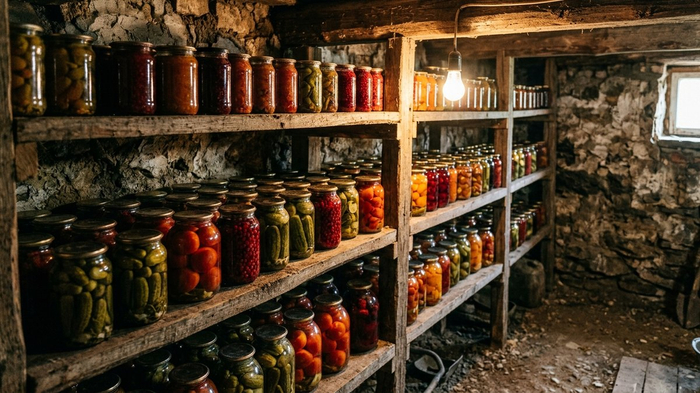
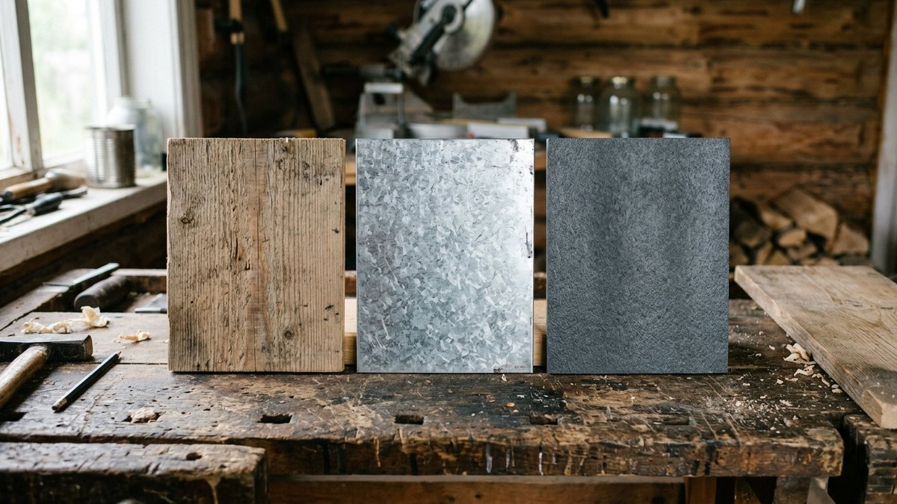
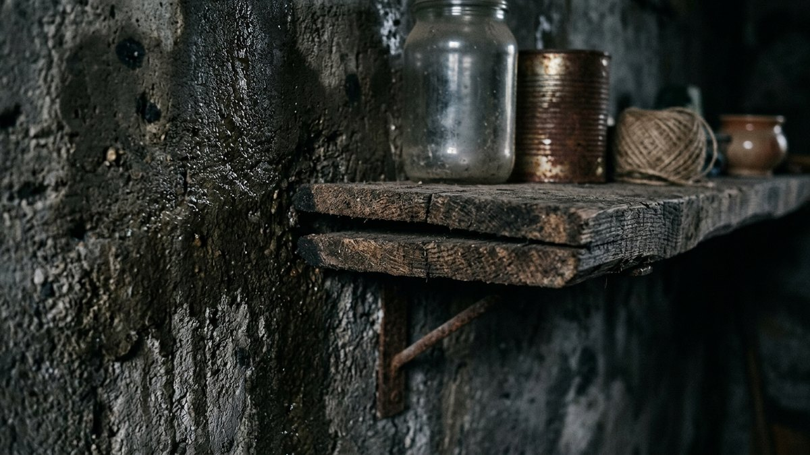
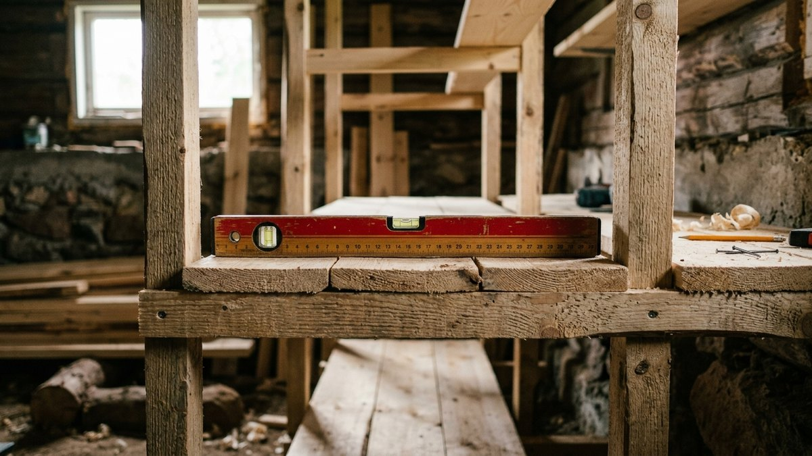
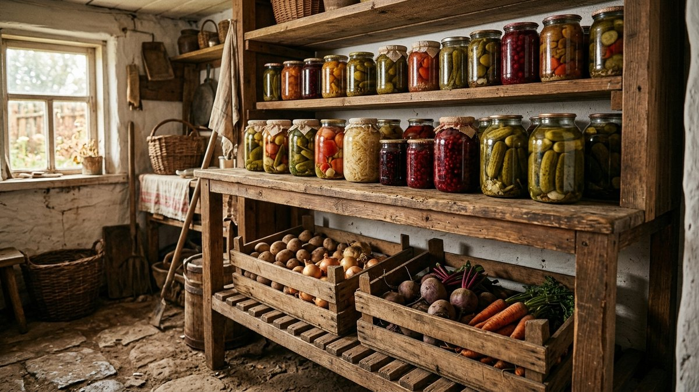
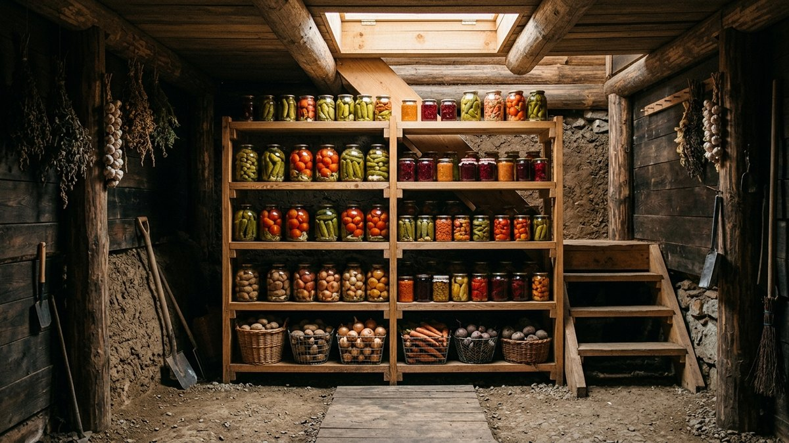

# Полки в погреб своими руками: материалы и расчёт нагрузки

Полка, собранная «на глаз» из первых попавшихся досок, — частая причина
осыпавшихся банок: без расчёта нагрузки доска прогибается под весом
трёхлитровок за один сезон, а материал, который отлично служит в сухом
сарае, в погребе гниёт или ржавеет за пару лет. Разберём, какой материал
держит сырость погреба, как посчитать нагрузку на полку и как собрать
конструкцию, которая простоит десятилетие, а не одну зиму.

## Материалы: дерево, металл, пластик

| Материал | Влагостойкость в погребе | Нагрузка | Обработка |
|---|---|---|---|
| Дерево (хвоя, лиственница) | Высокая при пропитке антисептиком | Высокая при правильном сечении | Антисептик + масло, без герметичного лака |
| Оцинкованный металл | Средняя, ржавеет от конденсата и газов | Самая высокая | Практически не требует, но уязвим к коррозии |
| Пластик (полимерные стеллажи) | Не гниёт и не ржавеет | Ограниченная, полки прогибаются под весом банок | Не требуется |

Дерево — самый практичный выбор для большинства погребов: не боится
разового конденсата, легко чинится и режется по месту. Металл держит
больше веса, но реагирует на сырость и особенно на обработку серной
шашкой — сернистый газ разъедает оцинковку и крепёж, это разобрано в
статье [серная шашка для погреба: инструкция по применению
](https://mir-doma.pro/sernaya-shashka-dlya-pogreba/). Если погреб
регулярно обрабатывается серой, дерево — более предсказуемый вариант.

## Расчёт нагрузки на полку

Полная трёхлитровая банка с заготовкой весит около 4–4,5 кг. Ряд из шести
банок на полке длиной 1 м — это уже 25–27 кг, и это без учёта тары второго
ряда, если банки ставят в два яруса.

Правило для доски из хвои: при толщине 20 мм безопасный пролёт между
опорами (стойками каркаса) — не больше 60–70 см, при толщине 25–30 мм —
до 90–100 см. Если нужен пролёт больше без утолщения доски, посередине
ставят дополнительную стойку или ребро жёсткости снизу. Экономить на
толщине доски ради вида полки — то же самое, что сразу закладывать
будущий прогиб.

Чтобы не считать вручную под свой погреб, введите длину полки и толщину
доски: калькулятор покажет, сколько банок встанет в ряд, какой вес
получится и сколько стоек нужно, чтобы пролёт не превысил безопасный.

<!-- wp:html -->

  
Калькулятор полки для банок: вес и число стоек

  <label class="md-calc__label" for="mdShLen">Длина полки, см</label>
  <input type="number" id="mdShLen" class="md-calc__input" min="30" step="10" placeholder="например, 150">
  <label class="md-calc__label" for="mdShTh">Толщина доски</label>
  <select id="mdShTh" class="md-calc__input">
    <option value="65">20 мм (пролёт до 65 см)</option>
    <option value="95" selected>25–30 мм (пролёт до 95 см)</option>
  </select>
  <label class="md-calc__label" for="mdShJar">Какие банки</label>
  <select id="mdShJar" class="md-calc__input">
    <option value="3">3-литровые (около 4,5 кг, диаметр ~15 см)</option>
    <option value="1">1-литровые (около 1,5 кг, диаметр ~10 см)</option>
  </select>
  <label class="md-calc__label" for="mdShRows">Рядов банок на полке (в глубину)</label>
  <select id="mdShRows" class="md-calc__input">
    <option value="1">1 ряд</option>
    <option value="2" selected>2 ряда</option>
  </select>
  
Введите длину полки

<!-- /wp:html -->

## Почему дерево в погребе ведёт себя иначе

В отличие от сухого помещения, в погребе дерево работает в постоянных
перепадах влажности: зимой суше, осенью и весной — конденсат на стенах
и полу. Отсюда три правила, которые в жилой комнате не нужны:

- **Зазор от пола и стен.** Нижнюю полку и боковины каркаса ставят с
  зазором 2–3 см от стен и минимум 10–15 см от пола — иначе дерево
  впитывает влагу от кладки на контакте и гниёт именно в точке касания.
- **Антисептик, а не декоративный лак.** Герметичный лак или масляная
  краска запечатывают влагу внутри доски, если она туда всё же попала —
  под плёнкой начинается гниение изнутри, незаметное снаружи. Пропитка-
  антисептик для наружных работ впитывается и оставляет дерево
  «дышащим».
- **Обработка торцов реза.** Торец доски впитывает влагу в разы быстрее
  плоскости — при монтаже каждый свежий спил дополнительно промазывают
  антисептиком, иначе гниение начинается именно с торцов.

Общий обзор обустройства погреба — вентиляция, гидроизоляция, влажность —
собран в статье [обустройство погреба](https://mir-doma.pro/obustroystvo-pogreba/);
здесь — только то, что касается непосредственно полок и стеллажей. Если
вентиляция слабая и конденсат на стенах постоянный, сначала стоит решить
эту причину — устройство продухов и вытяжки разобрано в статье
[вентиляция в погребе](https://mir-doma.pro/ventilyaciya-v-pogrebe/), иначе
даже пропитанное дерево прослужит меньше расчётного срока.

## Пошаговый монтаж

### Шаг 1. Разметка и стойки

Отмечают на стене или полу расположение вертикальных стоек каркаса с
шагом, посчитанным на предыдущем шаге (60–100 см в зависимости от
толщины досок). Стойки выставляют строго вертикально по уровню — перекос
на 1–2 см на высоте стеллажа даёт заметный уклон полок.

### Шаг 2. Сборка каркаса

Стойки соединяют горизонтальными перемычками на нужной высоте — под
каждый уровень полок. Высоту между полками обычно делают 25–35 см: этого
достаточно для стандартной трёхлитровой банки с запасом на то, чтобы
свободно её доставать.

Нижний торец каждой стойки ставят не прямо на грунт или бетонный пол, а
на пластиковую или резиновую подкладку толщиной 1–2 см: дерево тянет
влагу капиллярно снизу так же охотно, как и от конденсата сверху, и стойка
без подкладки начинает гнить у основания в первую очередь, даже если
антисептик нанесён по всей длине.

### Шаг 3. Крепление полок

Доски укладывают на перемычки и крепят саморезами снизу вверх, чтобы
шляпки не мешали ставить банки. Между досками одной полки оставляют
зазор 5–10 мм — для циркуляции воздуха и стока случайного конденсата.

Обычные чёрные саморезы для гипсокартона здесь не подходят: в сыром
погребе их фосфатное покрытие ржавеет за один сезон, и полка держится на
уже коррозирующем крепеже. Нужны оцинкованные или жёлтые саморезы по
дереву с антикоррозийным покрытием — разница в цене минимальна, а срок
службы крепежа увеличивается в разы.

### Шаг 4. Обработка антисептиком

Готовую конструкцию покрывают антисептиком целиком, включая места
спилов и стыков, а не только видимые поверхности. Через сутки-двое,
когда пропитка высохнет, стеллаж готов к нагрузке.

## Что ставить на полки

Тара имеет значение не меньше самой полки: банки без крышек-этикеток
проще инспектировать на порчу, ящики для овощей должны иметь щели для
вентиляции снизу. Разбор тары и способов хранения по видам овощей и
заготовок — в статье [как хранить овощи зимой](https://mir-doma.pro/kak-hranit-ovoshchi-zimoy/).

## Частые ошибки

- **Берут тонкую доску без расчёта пролёта** — полка прогибается под
  весом банок уже в первый сезон.
- **Крепят полки вплотную к сырой стене** — дерево гниёт в точке
  контакта быстрее, чем на открытом воздухе внутри погреба.
- **Красят каркас декоративным лаком** — влага запечатывается под
  плёнкой, гниение идёт незаметно изнутри.
- **Не оставляют зазор между досками полки** — конденсат скапливается
  и не уходит, дерево темнеет и слабеет именно в этих местах.

## Частые вопросы

**Из чего лучше сделать полки в погребе?**
Дерево хвойных пород или лиственница с пропиткой антисептиком — самый
практичный вариант: держит нагрузку, легко чинится и не реагирует на
обработку погреба серой так, как металл.

**Какой должна быть толщина досок для полок в погреб?**
От 20 мм при пролёте между опорами до 70 см, от 25–30 мм — при пролёте
до метра. Чем больше расстояние между стойками, тем толще нужна доска.

**Нужно ли красить полки в погребе?**
Красить декоративной краской или лаком не стоит — они запечатывают
влагу внутри дерева. Используют пропитку-антисептик, которая впитывается,
а не создаёт плёнку.

**На каком расстоянии от пола делать нижнюю полку?**
Не ближе 10–15 см от пола — иначе полка отсыревает от конденсата и
контакта с холодным основанием, особенно во влажных погребах.

**Выдержит ли деревянная полка банки в два ряда?**
Да, если толщина доски и шаг стоек рассчитаны с запасом — вес второго
ряда банок нужно закладывать в расчёт нагрузки заранее, а не проверять
на прогибе задним числом.

**Можно ли крепить полки в погребе чёрными саморезами?**
Нежелательно: обычный чёрный крепёж без антикоррозийного покрытия
ржавеет от сырости за один сезон. Для погреба берут оцинкованные или
жёлтые саморезы по дереву — разница в цене копеечная, а крепёж не
подводит через год.

**Как защитить стойки стеллажа от сырости пола?**
Поставить нижний торец каждой стойки на пластиковую или резиновую
подкладку, а не прямо на грунт или бетон. Капиллярная влага поднимается
в дерево снизу так же успешно, как и оседает конденсатом сверху.
