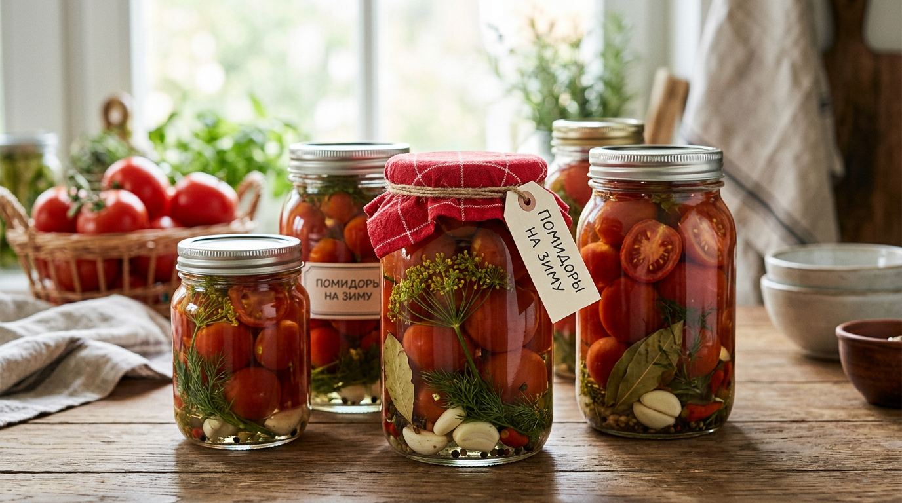
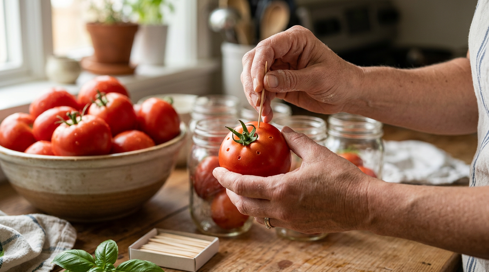
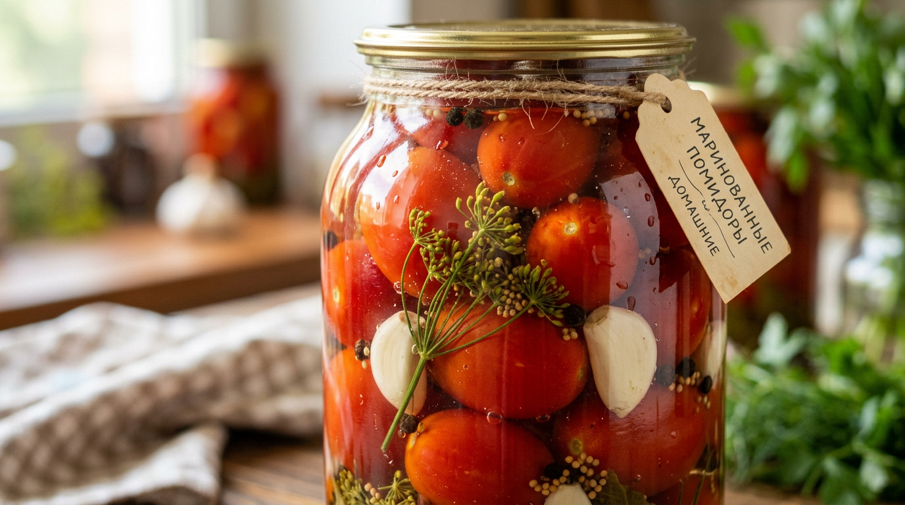
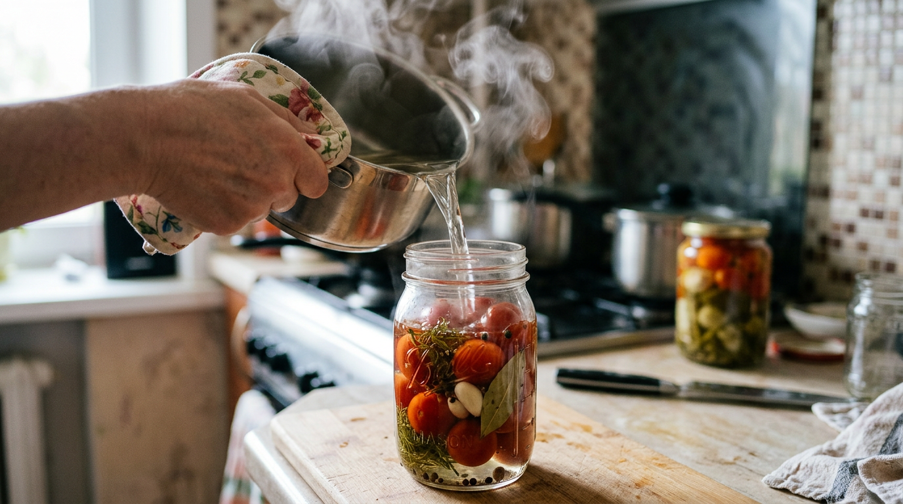
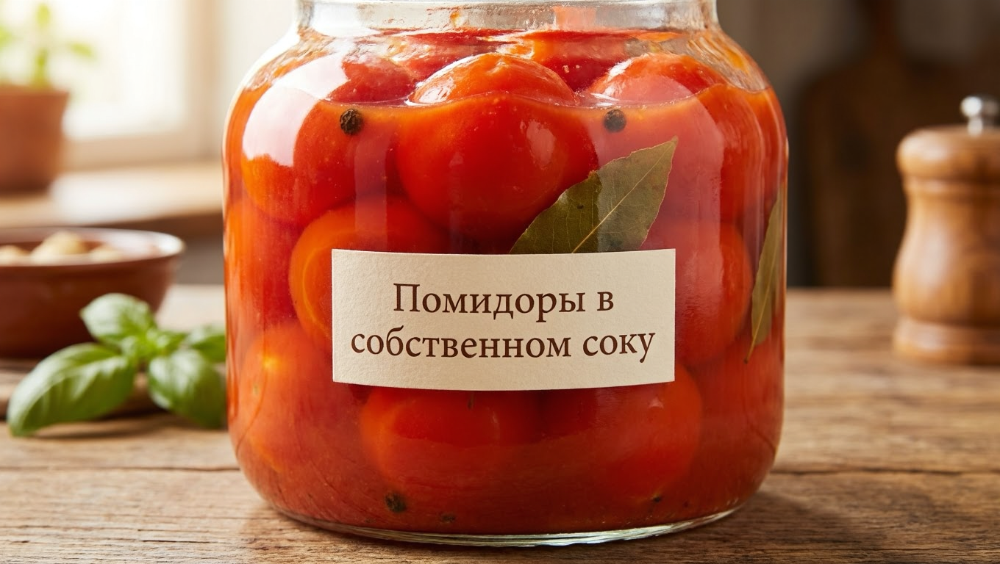
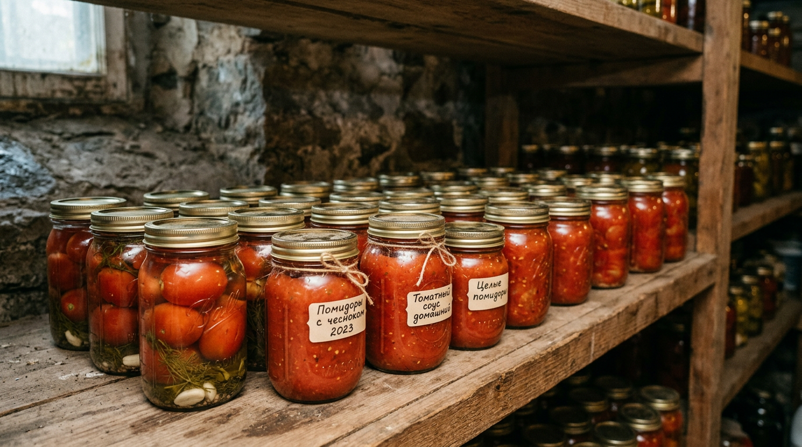

Помидоры на зиму — заготовка, без которой не обходится ни один дачный погреб. Сладко-кислые маринованные томаты, нежные помидоры в собственном соку, ароматное лечо — всё это превращает летний урожай в любимые закуски к зимнему столу. И приготовить их несложно, если знать несколько секретов: какие томаты выбрать, как сделать, чтобы они не трескались, и сколько класть соли и сахара. В этой статье собрали лучшие рецепты помидоров на зиму и все тонкости удачной заготовки. А если рядом уже стоят банки с [маринованными огурцами](https://mir-doma.pro/marinovannye-ogurtsy-na-zimu/), помидоры станут им отличной компанией на полке.

## 🍅 Какие помидоры выбрать для заготовок

От выбора томатов зависит, останутся ли они целыми и красивыми в банке.

- **Плотные и мясистые** сорта — они не развариваются и держат форму.
- **Мелкие и средние плоды** — их удобно укладывать в банку целиком, и они лучше просаливаются.
- **Сливовидные сорта** («сливки») и черри — идеальны для цельноплодного консервирования: плотные, с толстой кожицей, не лопаются.
- **Без повреждений**, спелые, но не перезрелые.
- **Примерно одного размера** в одной банке — так они равномерно просолятся и красиво смотрятся.

А вот крупные салатные сорта для цельного консервирования не годятся: они мягкие, трескаются и разваливаются. Зато они отлично подходят для томатного сока, соусов и заливки. Кстати, помидоры можно не только закрывать в банки, но и [замораживать](https://mir-doma.pro/chto-zamorozit-na-zimu/) — для зимних супов и рагу это очень удобно. Кстати, для заготовок можно использовать и бурые недозревшие помидоры — о том, почему они не краснеют и как их дозарить, мы рассказывали в [отдельной статье](https://mir-doma.pro/pomidory-ne-krasneyut/).

## 🫙 Подготовка помидоров и банок

Правильная подготовка — залог того, что заготовка удастся.

**Помидоры.** Вымойте и переберите их. Главный секрет, чтобы томаты не трескались при заливке кипятком, — наколоть каждый плод зубочисткой в месте крепления плодоножки в нескольких местах. Через эти проколы помидор равномерно прогревается и не лопается.

**Банки и крышки.** Тщательно вымойте с содой и простерилизуйте над паром, в духовке или микроволновке. Крышки прокипятите. Стерильность — главная защита от помутнения рассола и вздутия крышек.

## 🧂 Маринованные помидоры

Классическая и самая любимая заготовка — сладко-кислые маринованные помидоры.

**Ингредиенты на 1-литровую банку:** помидоры (сколько войдёт), зонтик укропа, 2–3 зубчика чеснока, листья хрена и смородины, 5–6 горошин перца, лавровый лист.

**Маринад (на 1 л воды):** 1 столовая ложка соли, 3–4 столовые ложки сахара, 60 мл 9%-го уксуса.

**Как приготовить:**

1. На дно стерильной банки уложите зелень и специи, затем наколотые помидоры.
2. Залейте крутым кипятком, накройте крышкой и оставьте на 15 минут.
3. Слейте воду, вскипятите её снова, добавьте соль и сахар, в конце влейте уксус.
4. Залейте помидоры кипящим маринадом до самого верха и сразу закатайте.

После закатки банки переверните вверх дном, укутайте и оставьте до остывания. Обратите внимание: сахара в маринад для помидоров кладут больше, чем для огурцов, — томаты любят сладость, и вкус получается насыщеннее. По желанию в банку добавляют кольца лука, болгарский перец или дольку острого перца — получается ассорти с более ярким вкусом.

## 🥫 Помидоры в собственном соку

Нежные помидоры в густой томатной заливке — универсальная заготовка: и закуска, и основа для соусов, борща, рагу.

**Ингредиенты:** мелкие плотные помидоры — в банку, крупные мясистые — на сок (примерно 1,5–2 кг на литр сока), соль (1 ст. л.) и сахар (2 ст. л.) на литр сока.

**Как приготовить:**

1. Мелкие помидоры наколите и плотно уложите в стерильные банки.
2. Крупные помидоры пропустите через мясорубку или измельчите блендером и проварите 10–15 минут, добавив соль и сахар; по желанию протрите от кожицы.
3. Залейте помидоры в банках кипящим томатным соком.
4. Стерилизуйте банки или закатайте с двойной заливкой и укутайте до остывания.

Такая заготовка хороша тем, что в дело идёт и сок, и сами помидоры, а вкус получается натуральным, без лишнего уксуса. Зимой такие помидоры можно есть как закуску, а сок использовать для борща, подливок и тушения — ничего не пропадает.

## 🍶 Другие популярные заготовки из помидоров

Помидоры на зиму можно заготовить десятком способов. Вот ещё популярные идеи:

- **Солёные (квашеные) помидоры** — заквашиваются без уксуса, с «бочковым» вкусом.
- **Лечо** — помидоры с болгарским перцем, сытная закуска и заправка.
- **Аджика** — острый томатный соус с перцем и чесноком.
- **Томатный сок** — натуральный напиток и основа для блюд.
- **Кетчуп и томатная паста** — домашние, без консервантов.
- **Зелёные помидоры** — маринованные, фаршированные или в салатах.
- **Вяленые помидоры** — деликатес с травами и маслом.

Так из одного урожая получается целая полка разных заготовок на любой вкус. Многие из них (лечо, аджика, сок) — отличный способ переработать крупные и не очень красивые помидоры, которые не годятся для цельного консервирования.

## 🌿 Секреты удачной заготовки

Несколько хитростей помогут получить красивые и вкусные помидоры:

- **Накалывайте плоды** у плодоножки — это главный секрет от растрескивания при заливке.
- **Берите плотные сорта** — мясистые сливки и черри держат форму лучше всего.
- **Не лейте кипяток резко** на холодные помидоры — прогревайте постепенно, заливкой.
- **Кладите больше сахара**, чем в огурцы, — томаты раскрываются с ним вкуснее.
- **Добавляйте листья хрена и смородины** — для аромата и крепости заготовки.
- **Заливайте до самого верха** банки, чтобы не оставалось воздуха.

## ❄️ Как и где хранить

Закатанные по правилам помидоры хранятся при комнатной температуре, но надёжнее и дольше — в прохладном тёмном месте: погребе, подвале или кладовке при 0–15 °C. Первые недели приглядывайте за банками: если рассол помутнел или крышка вздулась, такую заготовку в пищу не употребляют. Вскрытую банку держат в холодильнике и съедают в течение нескольких дней. Не ставьте заготовки рядом с батареями и под прямым солнцем — в тепле и на свету они быстрее портятся.

## 🛡️ Частые ошибки

Разберём, почему заготовка иногда не удаётся:

- **Лопнувшие помидоры.** Не накололи плоды или резко залили кипятком. Накалывайте и прогревайте постепенно.
- **Разварились.** Использованы мягкие салатные сорта. Берите плотные сливки и черри.
- **Помутнел рассол.** Нестерильная тара или плохо вымытые помидоры. Стерилизуйте банки.
- **Вздулись крышки.** Не хватило кислоты, соли или стерильности. Соблюдайте пропорции маринада.
- **Слишком кисло или пресно.** Нарушены пропорции — отмеряйте соль, сахар и уксус точно.

## ❓ Частые вопросы

### Какие помидоры лучше для консервации?

Плотные мясистые сорта среднего и мелкого размера, особенно сливовидные («сливки») и черри: они не трескаются и держат форму. Крупные салатные сорта для цельного консервирования не годятся, зато идут на сок, соус и заливку.

### Как сделать, чтобы помидоры не трескались?

Наколите каждый помидор зубочисткой в месте крепления плодоножки в нескольких местах и не заливайте холодные плоды крутым кипятком резко — прогревайте их постепенно методом заливки. Тогда томаты прогреваются равномерно и не лопаются.

### Сколько соли и сахара класть в маринад для помидоров?

На 1 литр воды берут примерно 1 столовую ложку соли, 3–4 ложки сахара и 60 мл 9%-го уксуса. Сахара для помидоров кладут больше, чем для огурцов, — так вкус получается насыщеннее и слаще.

### Можно ли консервировать помидоры без уксуса?

Да. Помидоры в собственном соку и квашеные (солёные) томаты готовят без уксуса или с минимальным его количеством. Кислоту в этом случае дают сами помидоры и естественное брожение. Но такие заготовки лучше хранить в прохладе.

### Что приготовить из помидоров на зиму?

Маринованные помидоры, помидоры в собственном соку, лечо, аджику, томатный сок, кетчуп, солёные и зелёные помидоры, вяленые томаты. Из одного урожая получается множество разных заготовок — от закусок до соусов и напитков.

### Чем накалывать помидоры перед консервированием?

Обычной зубочисткой или тонкой деревянной шпажкой. Каждый помидор прокалывают в нескольких местах у плодоножки на небольшую глубину. Через эти отверстия плод равномерно прогревается при заливке кипятком и не лопается.

### Можно ли закрывать помидоры вместе с огурцами?

Да, ассорти из помидоров и огурцов — популярная заготовка. Маринад используют общий. Учтите, что помидоры нежнее, поэтому их кладут сверху и прогревают аккуратнее, чтобы не лопнули, а огурцы — вниз.

### Где хранить заготовки из помидоров?

Лучше всего в прохладном тёмном месте — погребе, подвале или кладовке при 0–15 °C. Правильно закатанные банки могут стоять и при комнатной температуре, но в прохладе заготовки дольше сохраняют вкус. Вскрытую банку держат в холодильнике и съедают в течение нескольких дней. Не ставьте заготовки рядом с батареями и под прямым солнцем — в тепле и на свету они быстрее портятся.

## Заключение

Помидоры на зиму — это вкусно, разнообразно и совсем несложно. Выбирайте плотные сливовидные сорта, накалывайте плоды, чтобы не трескались, точно отмеряйте маринад с чуть большим количеством сахара — и маринованные томаты, помидоры в собственном соку и другие заготовки удадутся на славу. А разнообразие рецептов — от лечо до томатного сока — позволит сохранить урожай целиком и радовать семью домашними закусками всю зиму. Приготовьте по этим рецептам, и баночка ароматных помидоров станет украшением вашего стола. А начав с простых маринованных томатов, вы со временем легко освоите и лечо, и сок, и другие заготовки — и погреб наполнится домашними вкусностями.

А какие заготовки из помидоров любите вы? Делитесь рецептами в комментариях и подписывайтесь, чтобы не пропустить новые статьи о заготовках из урожая.
