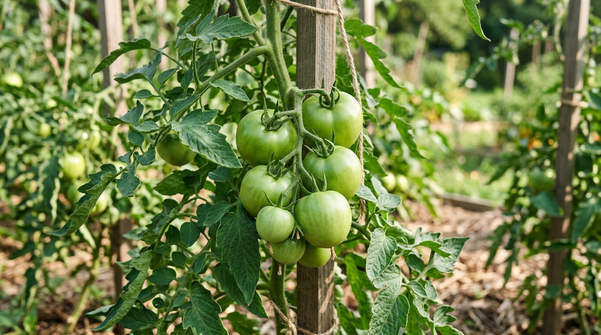
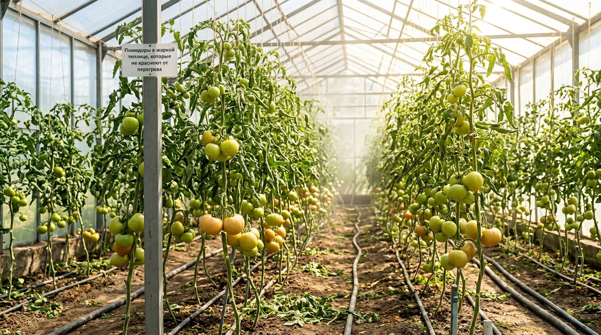
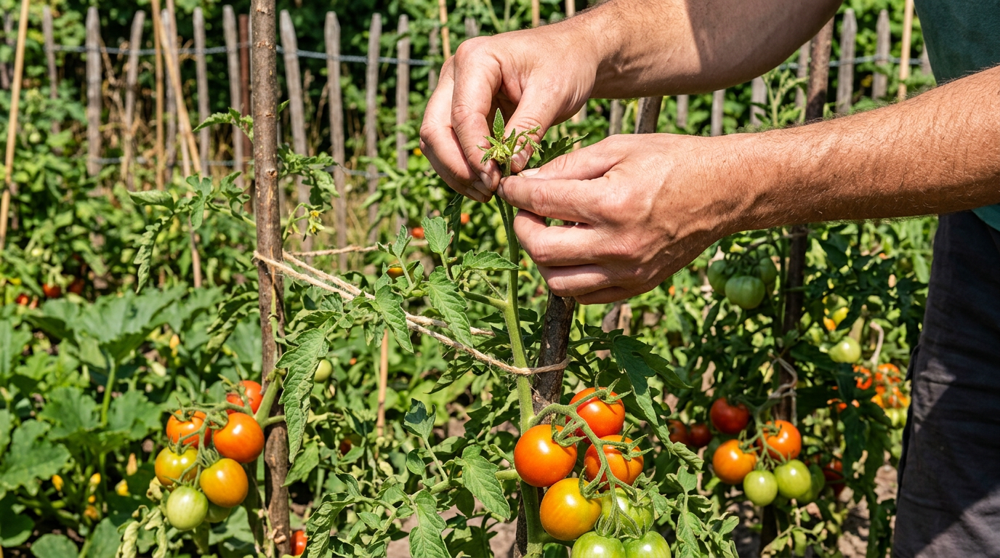
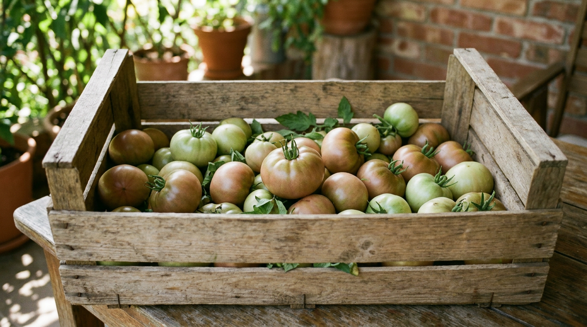
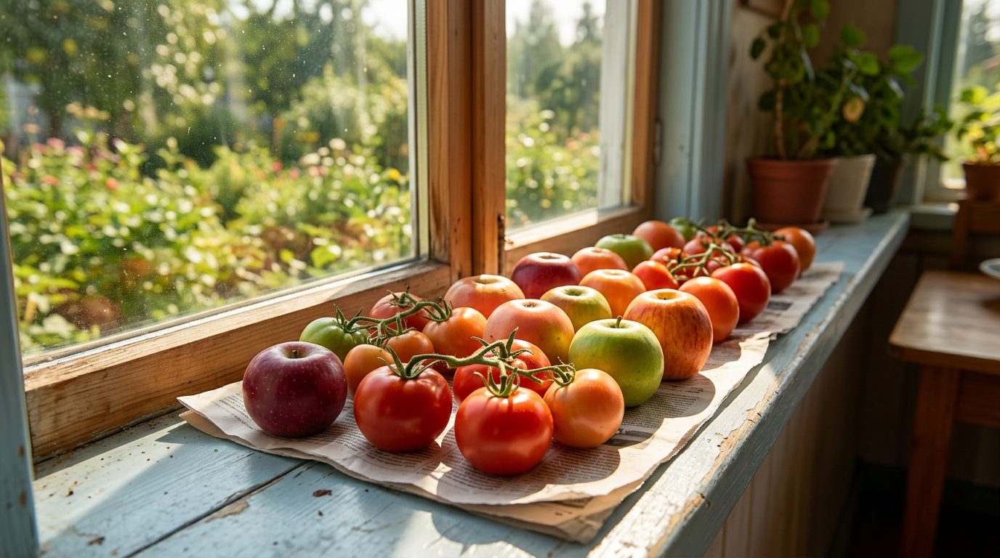
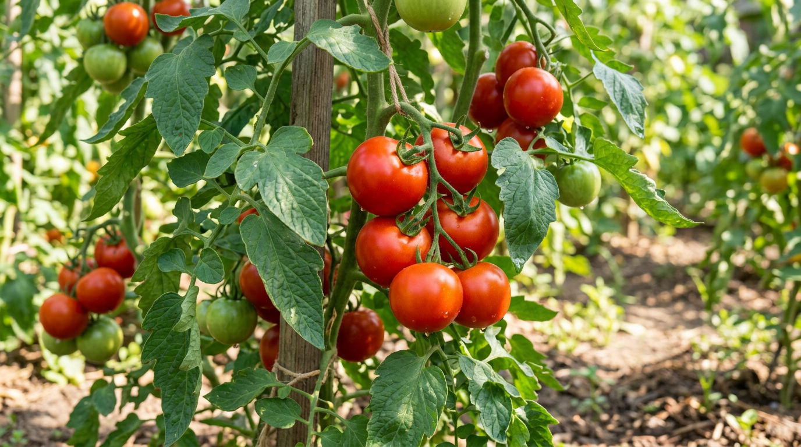

Кусты увешаны помидорами, а они всё стоят зелёными и упорно не краснеют — знакомая ситуация в разгар лета. Кажется, что плоды вот-вот созреют, но проходит неделя за неделей, а цвет не меняется. Причин у этого несколько, и, что важно, дело почти никогда не в нехватке солнца, как принято думать. В этой статье разберём, почему помидоры долго не краснеют и как ускорить их созревание: какие условия тормозят процесс, что можно сделать прямо на кусте и как правильно дозаривать снятые плоды.

## 🍅 Почему помидоры не краснеют: главные причины

Краснеют помидоры благодаря особому пигменту — ликопину, который накапливается в плодах при созревании. Если что-то мешает его выработке, плоды остаются зелёными или бледно-оранжевыми. Основные причины задержки такие:

- **Жара** — самая частая причина летом.
- **Перегрузка куста** большим числом плодов.
- **Избыток азота** и дисбаланс питания.
- **Особенности сорта** — поздние и крупноплодные зреют дольше.
- **Загущённость и плохое проветривание.**

Разберём главные по порядку — и сразу что с ними делать. Сразу скажем главное, чтобы развеять самый частый миф: дело почти никогда не в нехватке солнца. Понимание этого экономит силы и спасает листья от ненужного обрывания.

## 🌡️ Жара останавливает созревание

Это главный и самый неожиданный для многих факт: в сильную жару помидоры краснеют хуже, а не лучше. Пигмент ликопин, отвечающий за красный цвет, образуется при температуре примерно 20–25 °C. А когда столбик термометра поднимается **выше 30–35 °C**, синтез ликопина останавливается, и плоды замирают зелёными или оранжевыми, часто с жёлтыми «плечиками» у плодоножки.

Именно поэтому в самый зной, особенно в непроветриваемой теплице, помидоры не торопятся краснеть. И именно поэтому бесполезно (и даже вредно) обрывать листья, чтобы «открыть плоды солнцу»: на жаре они покраснеют только медленнее.

**Что делать:** в сильную жару притеняйте теплицу, обязательно её проветривайте, чтобы сбить температуру ниже 30 °C. В открытом грунте помогает лёгкое притенение в пик зноя. Как ни парадоксально, иногда снять помидоры бурыми и дозарить их в тени оказывается быстрее, чем ждать на палящем солнце. Кстати, при сильной жаре страдает не только цвет: нарушается и опыление, поэтому новые завязи в зной образуются хуже. Так что борьба с перегревом теплицы решает сразу несколько проблем.

## ☀️ Миф про солнце: созревание идёт изнутри

Многие уверены, что для покраснения помидору нужно прямое солнце, и обрывают вокруг плодов все листья. Это распространённое заблуждение. Созревание помидора регулируется изнутри — гормоном этиленом, который вырабатывается в самом плоде. Прямой солнечный свет на плод для этого не нужен; более того, под палящим солнцем плоды получают ожоги.

Листья же, наоборот, нужны растению: они кормят плоды через фотосинтез. Поэтому массовое удаление листвы ради «солнца» лишает плоды питания и замедляет налив. Удалять листья стоит умеренно — только нижние и затеняющие, для проветривания, а не ради попадания света на томаты. Проверить это легко: плоды прекрасно краснеют даже внутри куста, в тени листьев, и точно так же дозревают в тёмной коробке дома. Значит, дело не в свете, а в тепле и гормоне этилене.

## 🌿 Перегрузка куста

Если на кусте слишком много завязей и плодов, растению просто не хватает сил наливать и доводить до спелости их все сразу. В результате помидоры долго висят зелёными. Особенно это заметно на мощных индетерминантных кустах, которые продолжают цвести и завязывать новые плоды.

**Что делать:** разгрузите куст. Прищипните верхушку (это называют вершкованием), удалите новые цветочные кисти и мелкие завязи, которые всё равно не успеют вызреть, — тогда силы пойдут в уже налившиеся плоды. Это особенно важно во второй половине лета. Подробно о формировании — в статье о [пасынковании помидоров](https://mir-doma.pro/pasynkovanie-pomidorov/). Если же при этом у растения ещё и [желтеют листья](https://mir-doma.pro/zhelteyut-listya-u-pomidorov/), значит, куст ослаблен, и сначала стоит разобраться с его состоянием — на больном растении плоды зреют медленно.

## 🍽️ Избыток азота и питание

Если помидоры перекормлены азотом, куст «жирует» — гонит мощную ботву, наращивает зелень, а плоды зреть не спешит. Для созревания томатам нужны не азот, а калий и фосфор.

**Что делать:** во второй половине лета прекратите азотные подкормки и переходите на калийно-фосфорные. Хорошо работают зольный настой, сульфат калия, монофосфат калия. Подробно о питании — в статье о [летних подкормках овощей](https://mir-doma.pro/letnie-podkormki-ovoshchey/). Лёгкий дефицит влаги в этот период тоже подталкивает плоды к созреванию, поэтому полив слегка сокращают.

## 🧬 Сорт и сроки созревания

Многое заложено сортом. Поздние и крупноплодные сорта (особенно биф-томаты и сорта для длительного хранения) от природы зреют дольше — это нормально, и торопить их можно лишь до определённого предела. Ранние и мелкоплодные сорта, наоборот, краснеют быстро. Поэтому, планируя посадки, учитывайте сроки созревания, указанные на упаковке, и для короткого лета выбирайте ранние и средние сорта. Если же у вас растёт поздний крупноплодный сорт и лето подходит к концу, не стоит ждать покраснения на кусте — смело снимайте плоды бурыми на дозаривание.

## ✅ Как ускорить созревание на кусте

Соберём вместе рабочие приёмы, которые помогают помидорам быстрее покраснеть прямо на грядке:

1. **Прищипните верхушку (вершкование).** Удалите точку роста главного стебля над верхней сформировавшейся кистью — куст перестанет расти вверх и направит силы в плоды.
2. **Удалите лишние цветы и мелкие завязи.** Поздние кисти всё равно не вызреют, а силы оттягивают на себя.
3. **Сократите азот, подкормите калием и фосфором.** Это переключает растение с роста на созревание.
4. **Слегка уменьшите полив.** Лёгкий стресс от недостатка влаги подталкивает плоды к покраснению (но без пересушки, чтобы не было вершинной гнили).
5. **Уберите часть нижних листьев.** Умеренно, для проветривания — это снижает риск болезней и слегка ускоряет созревание.
6. **Сбейте жару.** Притеняйте и проветривайте теплицу, чтобы температура опустилась в комфортные для ликопина 20–25 °C.

Эти меры особенно эффективны во второй половине лета, когда важно успеть собрать урожай до похолодания и осенней волны болезней. Применяйте их в комплексе: одна только прищипка без смены подкормок или борьбы с жарой даст слабый эффект, а вместе они заметно ускоряют покраснение.

## 🌿 Народные способы ускорить покраснение

Опытные огородники используют несколько простых приёмов, которые подталкивают плоды к созреванию:

- **Йодная подкормка.** Опрыскивание слабым раствором йода (30–40 капель на 10 л воды) по листу ускоряет созревание и заодно служит профилактикой фитофторы.
- **Зольно-калийная подкормка.** Зольный настой даёт калий, который нужен именно для созревания плодов.
- **Скручивание стебля или надрыв корней.** Лёгкий стресс (аккуратно перекрутить стебель у основания или слегка подорвать корни, потянув куст) тормозит рост и переключает растение на созревание — приём на любителя, применять осторожно.
- **Прокол или продольный надрез стебля.** Старый дачный способ, тоже создающий лёгкий стресс; работает, но требует аккуратности.

Самые безопасные и эффективные из них — йодная и калийная подкормки в сочетании с прищипкой и разгрузкой куста. К стрессовым приёмам с корнями и стеблем прибегают, когда нужно срочно ускорить созревание в конце сезона.

## 📦 Дозаривание: снимаем бурыми и доводим в тепле

Один из самых надёжных способов — не ждать покраснения на кусте, а снять плоды бурыми (в так называемой бланжевой спелости) и дать им дозреть в тепле. Это совершенно нормально и никак не вредит вкусу.

Почему это выгодно: снимая побуревшие плоды, вы разгружаете куст, и оставшиеся помидоры краснеют быстрее. К тому же снятые плоды вы спасаете от фитофторы, которая в августе может погубить урожай прямо на кусте.

Как правильно дозаривать:

- снимайте плоды, которые уже начали буреть или хотя бы побелели, — совсем зелёные мелкие дозреют хуже;
- разложите их в один слой в коробке или ящике в тёплом месте (18–24 °C), можно и без света — солнце для дозаривания не нужно;
- положите к ним пару спелых яблок или банан: они выделяют этилен, который ускоряет созревание соседних плодов;
- периодически перебирайте плоды, убирая подпорченные, чтобы они не заразили остальные;
- держите подальше зелёные и спелые: спелые ускоряют дозаривание зелёных.

Так за несколько дней бурые помидоры дойдут до полной спелости, а на кусте быстрее покраснеют оставшиеся. Скорость дозаривания зависит от температуры: в тепле (около 22–24 °C) плоды краснеют за несколько дней, в прохладе (12–15 °C) — медленнее, но дольше хранятся. Поэтому, регулируя температуру, можно растянуть поступление спелых помидоров на стол.

## 🍂 К концу лета: успеть до холодов и фитофторы

Во второй половине лета созревание стоит ускорять осознанно: ночи холодают, а с ними приходит [фитофтора](https://mir-doma.pro/fitoftora-na-pomidorah/), которая способна за пару дней погубить весь урожай прямо на кусте. Поэтому ближе к августу действует правило: не ждать, пока все плоды покраснеют на грядке, а активно снимать побуревшие на дозаривание. Когда ночная температура опускается ниже 8–10 °C, лучше снять с кустов вообще все плоды, даже зелёные, — на холоде они уже не вызреют, а дома дойдут. Это спасает урожай и от холода, и от болезни.

## ⚠️ Что не работает: распространённые мифы

Вокруг созревания томатов много заблуждений. Вот чего делать не стоит:

- **Обрывать все листья ради солнца.** Солнце плодам для покраснения не нужно, а без листьев они лишаются питания.
- **Ждать покраснения в самую жару.** При жаре выше 30–35 °C созревание, наоборот, останавливается.
- **Заливать кусты водой.** Обильный полив в период созревания скорее задерживает покраснение и вызывает растрескивание.
- **Резко обрывать все завязи.** Разгружать куст нужно, но в меру, удаляя только поздние и мелкие.

## ❓ Частые вопросы

### Почему помидоры не краснеют, а остаются зелёными?

Чаще всего из-за жары: при температуре выше 30–35 °C пигмент ликопин не образуется, и плоды замирают зелёными. Другие причины — перегрузка куста плодами, избыток азота и поздний сорт. Солнце для покраснения, вопреки мифу, не требуется.

### Как быстро ускорить созревание помидоров?

Прищипните верхушку, удалите лишние завязи и часть нижних листьев, прекратите азотные подкормки в пользу калия, слегка сократите полив и сбейте жару в теплице проветриванием. А самый надёжный способ — снять побуревшие плоды и дозарить их в тепле.

### Нужно ли обрывать листья, чтобы помидоры краснели?

Нет, это миф. Солнечный свет на сам плод для покраснения не нужен — созревание идёт изнутри. Листья кормят растение, поэтому массово их обрывать вредно. Удаляют только нижние и затеняющие листья для проветривания.

### Можно ли снимать помидоры зелёными, чтобы они дозрели дома?

Лучше снимать не совсем зелёными, а побуревшими (в бланжевой спелости) — они дозреют полноценно и вкусно. Совсем зелёные мелкие плоды тоже могут дойти, но медленнее и менее вкусно. Дозаривают в тепле, можно без света.

### Можно ли ускорить созревание помидоров йодом?

Да, опрыскивание слабым раствором йода (30–40 капель на 10 л воды) по листьям помогает плодам созревать быстрее и заодно защищает от фитофторы. Это популярный и безопасный народный приём, который сочетают с разгрузкой куста и калийными подкормками.

### За сколько дней дозревают снятые помидоры?

В тепле (22–24 °C) побуревшие помидоры доходят до полной спелости за 3–7 дней, особенно если положить к ним спелое яблоко. В прохладе процесс идёт медленнее — до двух недель и дольше, зато плоды лучше хранятся.

### Почему помидоры не краснеют в теплице?

В теплице частая причина — перегрев: в солнечный день там легко становится жарче 35 °C, и созревание останавливается. Нужно притенять и активно проветривать теплицу, чтобы сбить температуру до комфортных 20–25 °C.

### Вредно ли обрывать листья у помидоров для ускорения созревания?

Да, массовое обрывание листьев вредит: листья кормят растение и наливающиеся плоды, а солнечный свет на сам плод для покраснения не нужен. Удаляйте только нижние и затеняющие листья для проветривания, а не ради «солнца на томаты».

### Помогает ли яблоко ускорить созревание помидоров?

Да. Спелые яблоки и бананы выделяют газ этилен, который запускает и ускоряет созревание. Положив их к снятым бурым помидорам в коробку, вы заметно ускорите дозаривание.

## Заключение

Если помидоры долго не краснеют — почти всегда дело в жаре, перегрузке куста или избытке азота, а вовсе не в нехватке солнца. Чтобы ускорить созревание, разгрузите куст прищипкой и удалением лишних завязей, переключите подкормки на калий и фосфор, сбейте жару проветриванием и слегка сократите полив. А самый надёжный приём — снимать побуревшие плоды и дозаривать их в тепле: так и куст разгружается, и урожай вы спасаете от фитофторы. Действуйте по этим правилам — и спелых красных помидоров на вашем столе будет вдоволь. И помните золотое правило конца сезона: лучше снять плоды чуть раньше и дозарить в тепле, чем потерять их на кусте из-за холода или фитофторы.

А как вы ускоряете созревание помидоров? Делитесь своими способами в комментариях и подписывайтесь, чтобы не пропустить новые статьи об уходе за огородом.
