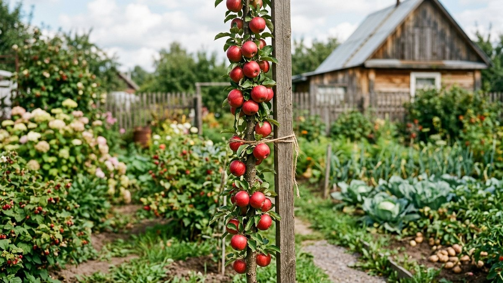
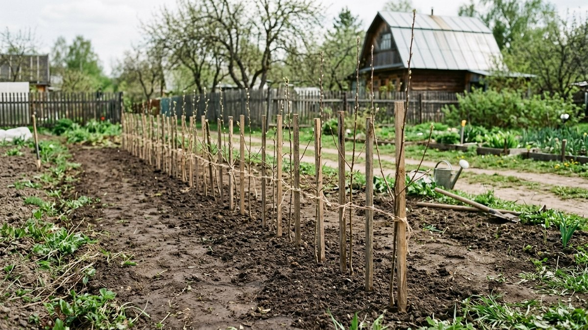
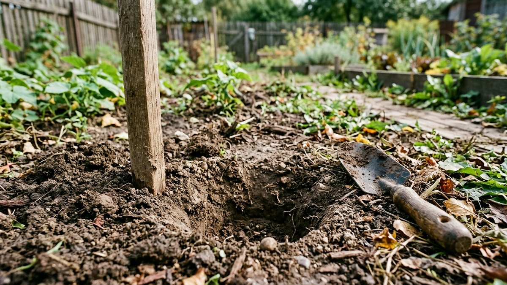
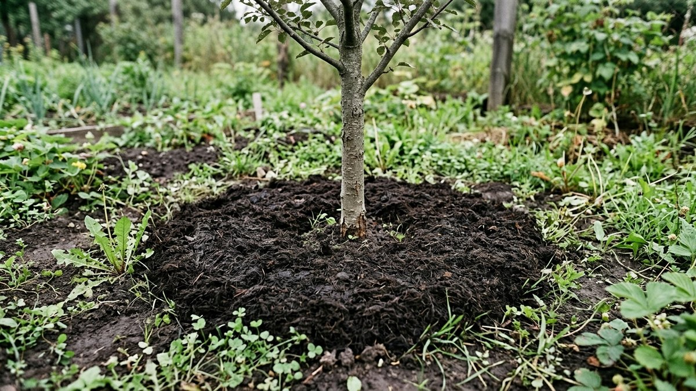
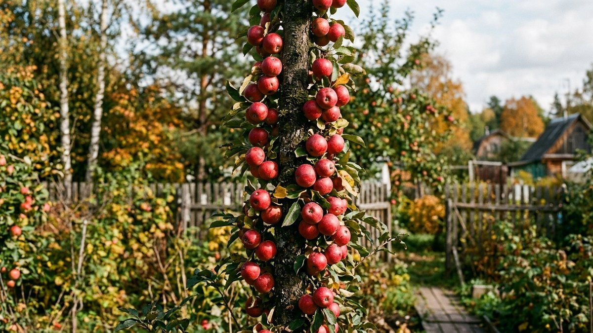
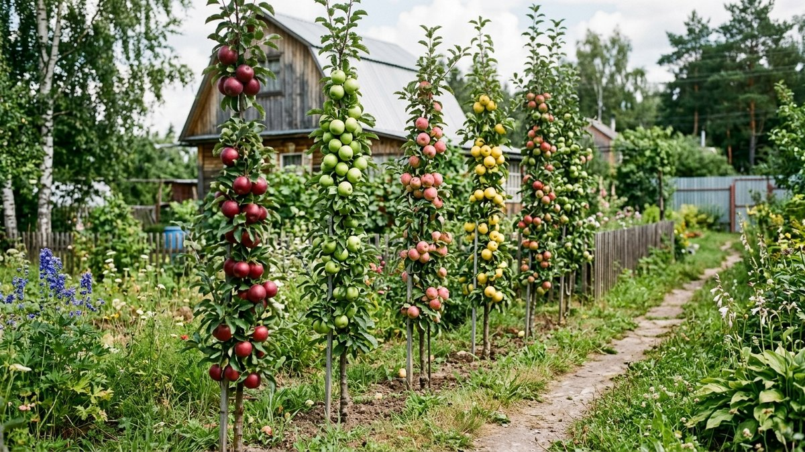

Колоновидная яблоня растёт и живёт по своим правилам — обычная схема посадки плодовых деревьев для неё не подходит совсем. Это не карликовый вариант обычной яблони, а отдельная форма кроны: без боковых ветвей, с плодами прямо на стволе, что позволяет сажать деревья вплотную друг к другу. Если участок маленький, а яблонь хочется несколько сортов — это как раз тот случай. Разберём, чем колоновидная яблоня отличается от обычной на практике и как её правильно посадить.

## Чем колоновидная яблоня отличается от обычной

- **Форма.** Растёт одним прямым стволом почти без боковых ветвей — плоды формируются на коротких плодовых веточках прямо вдоль ствола. Высота обычно 2–2,5 м, крона занимает буквально полметра в диаметре.
- **Скороплодность.** Первые яблоки часто появляются уже на второй-третий год после посадки, у обычной яблони на это уходит 4–6 лет.
- **Срок жизни.** 15–20 лет активного плодоношения против 40–50 лет у обычной яблони на сильнорослом подвое — это осознанный компромисс за компактность и раннее плодоношение.
- **Корневая система.** Поверхностная и слабая по сравнению с обычной яблоней — отсюда два практических следствия: нужна обязательная опора и более частый полив.
- **Обрезка.** Формирующая обрезка в привычном смысле не нужна — веточки, дающие урожай, не трогают. Обрезают только повреждённое и, если ствол вдруг начал ветвиться (случается на некоторых подвоях), лишние боковые побеги.

## Расстояние при посадке — главное отличие от обычной схемы

Здесь колоновидная яблоня даёт основное преимущество: между деревьями в ряду достаточно 40–100 см (чаще всего ориентируются на 60–90 см), а между рядами — 90–100 см. Для сравнения: обычной яблоне на сильнорослом подвое нужно 3–4 метра в каждую сторону. На месте одного стандартного дерева помещается 8–10 колоновидных — можно посадить несколько сортов на небольшом участке и растянуть сбор урожая по срокам созревания.

## Когда сажать: осенью или весной

Колоновидные яблони чаще продаются с закрытой корневой системой (в контейнере), что смягчает требования к сезону посадки — пересаживать такой саженец можно почти весь тёплый сезон. Но если ориентироваться на лучшее время, логика та же, что и для обычных плодовых деревьев: осенью — после листопада и минимум за две-три недели до устойчивых заморозков, весной — до начала активного сокодвижения. Общие принципы сроков и подготовки посадочной ямы для плодовых деревьев разобраны в статье [«Посадка деревьев осенью»](https://mir-doma.pro/posadka-plodovyh-derevev-osenyu/) — для колоновидной яблони они справедливы за вычетом расстояния и размера ямы.

## Посадочная яма и опора

Из-за компактной корневой системы яма нужна меньше, чем под обычную яблоню, — обычно достаточно 50×50×50 см с заправкой перегноем и небольшим количеством фосфорно-калийного удобрения. Свежий навоз и азотные удобрения при посадке не вносят по той же причине, что и для обычных саженцев: азот стимулирует рост побегов, которые не успевают вызреть до морозов.

Опора обязательна и не временная, как иногда советуют для обычных саженцев, а на весь срок жизни дерева. Тонкий ствол и слабая корневая система плохо держат яблоню против ветра, особенно когда крона нагружена яблоками, — деревянный или металлический кол вбивают рядом с саженцем сразу при посадке и подвязывают ствол мягким материалом, не передавливая кору.

## Уход в первый год

Полив у колоновидной яблони должен быть чаще, чем у обычной, — поверхностные корни быстрее пересыхают в жару. Мульчирование приствольного круга торфом или перегноем помогает удерживать влагу и заодно защищает корни зимой. Верхушечную почку — точку роста на конце ствола — трогать нельзя ни в коем случае: её повреждение останавливает рост яблони в высоту и портит саму суть колоновидной формы.

## Сколько живёт и когда менять

Активное плодоношение колоновидной яблони длится в среднем 15–20 лет, после чего урожайность заметно падает. Это стоит закладывать в план изначально — если хочется постоянного сада на десятилетия, часть посадок разумно комбинировать с обычными яблонями, а колоновидные использовать для быстрого результата и экономии места, пока обычные деревья набирают силу.

## Частые ошибки

- **Сажать по схеме обычной яблони.** Расстояние в 3–4 метра сводит на нет главное преимущество колоновидной формы — компактность.
- **Забыть про постоянную опору.** Без неё дерево часто заваливается или ломается под тяжестью урожая уже на второй-третий год.
- **Повредить верхушечную почку.** Это останавливает рост ствола в высоту — колоновидная яблоня начинает куститься вместо того, чтобы расти колонной.
- **Обрезать как обычную яблоню.** Формирующая обрезка здесь не нужна — общие принципы того, что можно резать у плодовых деревьев осенью, разобраны в статье [«Обрезка плодовых деревьев осенью»](https://mir-doma.pro/obrezka-plodovyh-derevev-osenyu/), но колоновидной формы они касаются только в части санитарной чистки.
- **Ожидать такого же долголетия, как у обычной яблони.** 15–20 лет плодоношения — это норма для колоновидной формы, а не признак плохого ухода.

## Частые вопросы

### На каком расстоянии сажать колоновидные яблони?

Между деревьями в ряду — 40–100 см, чаще всего 60–90 см, между рядами — 90–100 см. Это в разы плотнее, чем для обычной яблони, которой нужно 3–4 метра в каждую сторону.

### Нужна ли опора колоновидной яблоне?

Да, и постоянная, а не временная. Поверхностная корневая система и тонкий ствол плохо держат дерево под ветром и весом урожая — кол ставят на весь срок жизни дерева.

### Сколько лет плодоносит колоновидная яблоня?

В среднем 15–20 лет активного плодоношения, после чего урожайность заметно снижается — это нормальная особенность формы, а не следствие ошибок в уходе.

### Нужно ли обрезать колоновидную яблоню?

Формирующая обрезка не нужна — плодовые веточки вдоль ствола не трогают. Обрезают только повреждённые побеги и, если появляются лишние боковые ветви, их удаляют, стараясь не задеть верхушечную почку.

### Можно ли сажать колоновидную яблоню весной, а не осенью?

Можно — саженцы с закрытой корневой системой (в контейнере) переносят пересадку практически весь тёплый сезон. Общие принципы выбора сезона посадки те же, что и для обычных плодовых деревьев.
