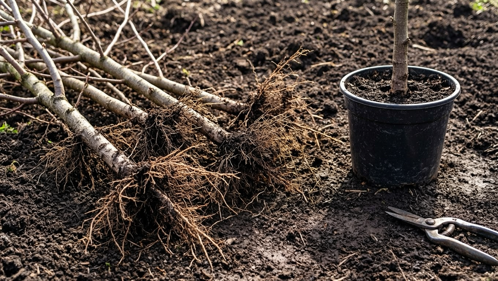
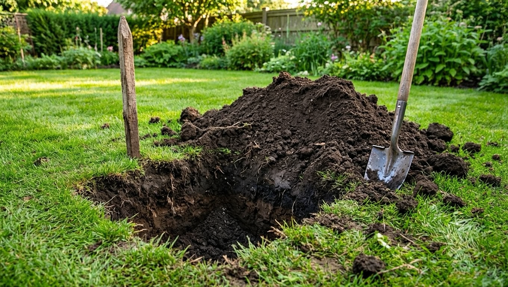
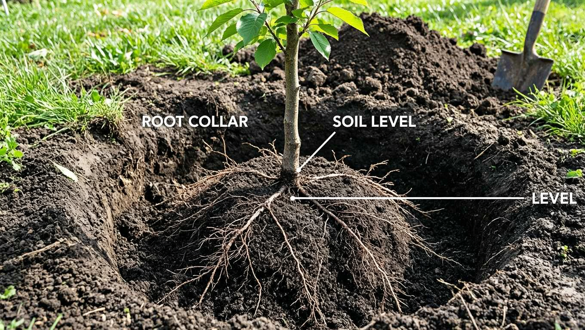
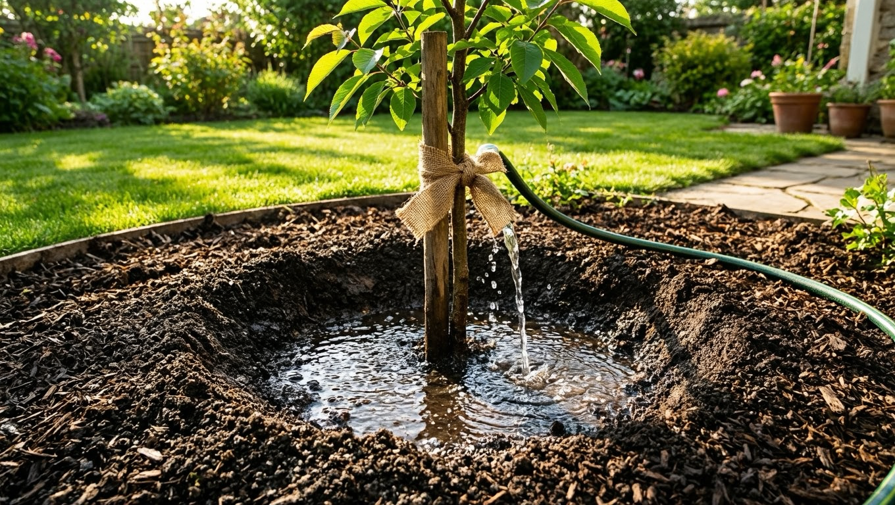
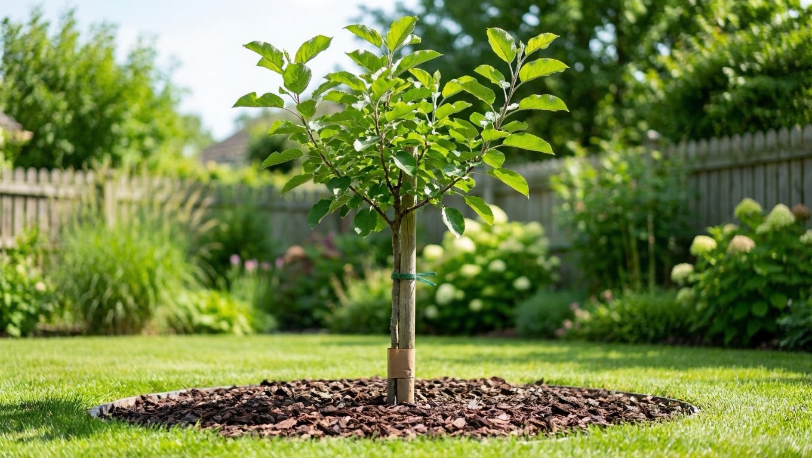

Осень — традиционное и очень удачное время для посадки плодовых деревьев и кустарников. Саженцы, высаженные под зиму, до холодов успевают нарастить корни, а весной трогаются в рост раньше и обгоняют посаженные весной. Но у осенней посадки есть свои правила и сроки, а некоторые культуры осенью сажать не стоит. Разберём, когда и как сажать плодовые деревья осенью, чтобы саженцы прижились и хорошо перезимовали.

## 🍂 Почему осень — хорошее время для посадки

У осенней посадки много плюсов:

- почва ещё тёплая, а воздух прохладный — корни растут, а надземная часть не испаряет влагу;
- осенью идут дожди, и саженцы почти не нужно поливать;
- осенью самый большой выбор саженцев в питомниках, часто со скидками;
- прижившееся с осени дерево весной стартует раньше и развивается активнее.

Главное — успеть посадить за **3–4 недели до устойчивых морозов**, чтобы саженец укоренился. В очень холодных регионах и для теплолюбивых культур предпочтительнее весенняя посадка — об этом ниже.

## 📅 Когда сажать плодовые деревья осенью

Оптимальный срок — с середины сентября до конца октября, когда дерево уже сбросило листья и вошло в период покоя, но земля ещё не промёрзла. Ориентир простой: сажать нужно так, чтобы до устойчивых холодов оставалось около месяца. Если опоздать, корни не успеют прижиться и саженец может вымерзнуть. Саженцы с закрытой корневой системой (в контейнере) в этом смысле надёжнее — их можно сажать и позже.

## 🌳 Какие деревья сажают осенью, а какие нет

Не все культуры одинаково зимостойки, и это определяет выбор:

- **Осенью сажают** морозостойкие и районированные культуры: яблоню, грушу, сливу, вишню, а также ягодные кустарники — смородину, малину, крыжовник.
- **Осенью лучше не сажать** теплолюбивые и чувствительные к морозу культуры: черешню, абрикос, персик, а также нежные и незимостойкие сорта. Их сажают весной, чтобы за лето они окрепли.

Ягодные кустарники осенью приживаются особенно хорошо. О том, как за ними потом ухаживать, — в статьях про [обрезку смородины](https://mir-doma.pro/obrezka-smorodiny/) и [обрезку малины](https://mir-doma.pro/obrezka-maliny/).

## 🛒 Как выбрать саженцы

Хороший саженец — половина успеха:

- **Корневая система** — развитая, живая, без пересушенных и подгнивших корней. У саженцев с закрытой корневой (в контейнере) приживаемость выше.
- **Возраст** — 1–2-летние саженцы приживаются лучше и быстрее взрослых.
- **Кора и побеги** — гладкие, без пятен, повреждений и морщин.
- **Место прививки** — чёткое, без повреждений.

Осенью выбор особенно велик, но берите районированные для вашего региона сорта — они надёжнее зимуют.

## 🕳️ Подготовка посадочной ямы

Яму лучше выкопать заранее, за 2–3 недели, чтобы почва осела:

- размер — примерно 60×60 см и такой же глубины (для кустарников меньше);
- на дно уложить дренаж (битый кирпич, щебень), если почва тяжёлая;
- верхний плодородный слой смешать с перегноем и золой, заправить этой смесью яму;
- свежий навоз и большие дозы минеральных удобрений в яму не кладут — они обжигают корни.

## 🌱 Посадка пошагово

Порядок посадки саженца:

1. В центр ямы вбить кол для подвязки (с северной стороны).
2. Насыпать холмик из плодородной смеси, поставить на него саженец, расправить корни по склонам.
3. **Проследить, чтобы корневая шейка (место перехода корней в ствол) осталась на 3–5 см выше уровня почвы** — при усадке она опустится до нужного уровня. Заглублять шейку нельзя, иначе дерево будет болеть и плохо расти.
4. Засыпать корни землёй, слегка потряхивая саженец, чтобы не было пустот, и уплотнить.
5. Сформировать поливочный круг, обильно полить (2–3 ведра).
6. Подвязать саженец к колу «восьмёркой» и замульчировать приствольный круг.

## 💧 Уход после посадки

После осенней посадки саженцу нужно помочь перезимовать:

- **Полив** — если осень сухая, полить дополнительно перед морозами (влагозарядковый полив).
- **Мульчирование** — приствольный круг укрыть торфом, перегноем или компостом для утепления корней.
- **Защита от грызунов** — обвязать штамб сеткой или лапником: зимой мыши и зайцы обгрызают кору молодых деревьев.
- **Побелка и укрытие** — стволик молодого деревца притеняют от солнечных ожогов, теплолюбивые прикапывают или укрывают.

Подробно о защите сада перед зимой — в статье про [подготовку сада к зиме](https://mir-doma.pro/podgotovka-sada-k-zime/).

## 🌰 Что делать, если не успели посадить осенью

Если саженцы куплены, а посадить вовремя не получилось или сроки уже поджимают, деревце не сажают в мёрзлую землю, а **прикапывают** до весны. Для этого в защищённом месте копают наклонную канавку, укладывают саженец под углом 45°, засыпают корни и часть ствола землёй и хорошо поливают. Сверху прикоп мульчируют и укрывают лапником от грызунов. В таком виде саженцы прекрасно зимуют, а весной их достают и высаживают на постоянное место. Прикоп надёжнее поздней рискованной посадки — весной у растения будет больше сил прижиться.

Ещё один вариант — саженцы с закрытой корневой системой прикопать прямо в контейнерах или прикопать в теплице/подвале при подходящей температуре.

## ❌ Частые ошибки

- **Заглубление корневой шейки** — главная ошибка: дерево угнетается и плохо растёт.
- **Поздняя посадка** — саженец не успевает укорениться и вымерзает.
- **Свежий навоз в яму** — обжигает корни.
- **Нет подвязки** — ветер расшатывает саженец, рвёт молодые корни.
- **Забыли про защиту от грызунов** — за зиму мыши могут окольцевать ствол.

## ❓ Частые вопросы

**Когда сажать плодовые деревья осенью?**
С середины сентября до конца октября — так, чтобы до устойчивых морозов оставалось 3–4 недели на укоренение. Саженцы в контейнерах можно сажать чуть позже.

**Можно ли сажать яблоню осенью?**
Да, яблоня зимостойка и осенью приживается хорошо. А вот теплолюбивые черешню, абрикос и персик лучше сажать весной.

**На какую глубину сажать саженец?**
Корневую шейку оставляют на 3–5 см выше уровня почвы — при усадке она опустится до нужного. Заглублять её нельзя.

**Нужно ли обрезать саженец после осенней посадки?**
Осенью саженец обычно не обрезают — формирующую обрезку переносят на весну. Осенью убирают только повреждённые ветви.

**Как защитить молодой саженец зимой?**
Замульчировать приствольный круг, обвязать штамб от грызунов сеткой или лапником и при необходимости укрыть. Теплолюбивые дополнительно прикапывают.

**Что лучше — осенняя или весенняя посадка?**
Для зимостойких культур осенняя посадка предпочтительнее: больше выбор саженцев и раньше старт весной. Теплолюбивые и незимостойкие сорта, а также сады в суровом климате лучше сажать весной.

---

Осенняя посадка даёт плодовым деревьям фору: они укореняются до зимы и весной идут в рост раньше. Соблюдайте сроки, не заглубляйте корневую шейку и защитите саженцы на зиму — и они успешно приживутся. А завершить осенние работы поможет статья про [подготовку сада к зиме](https://mir-doma.pro/podgotovka-sada-k-zime/).
