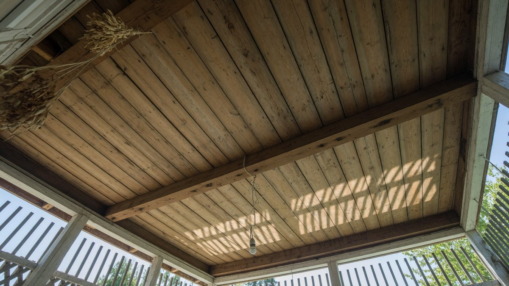
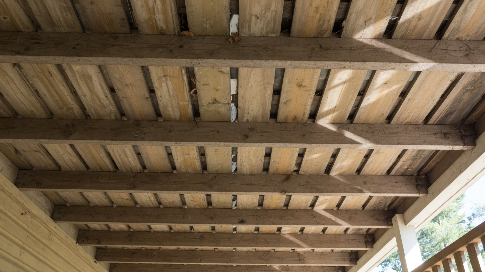
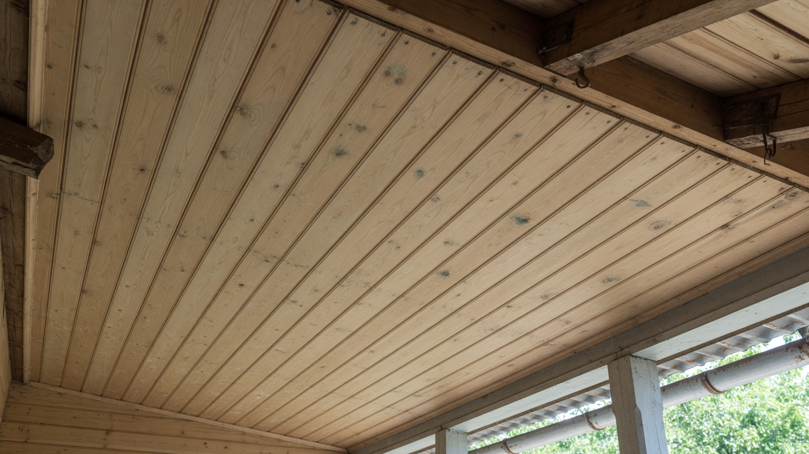
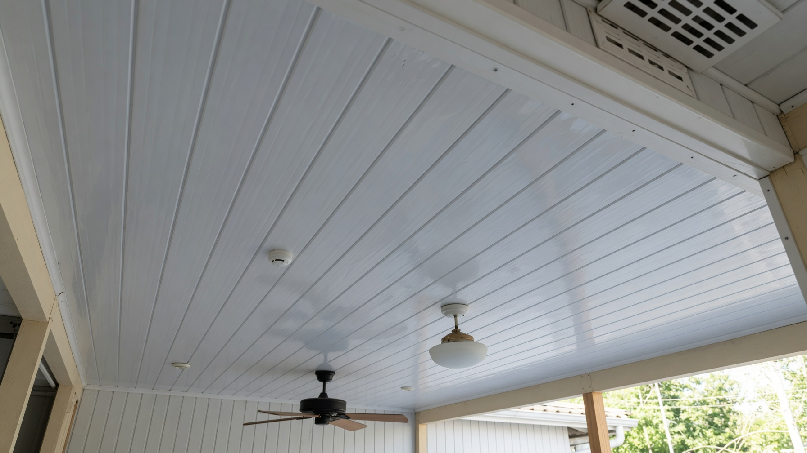
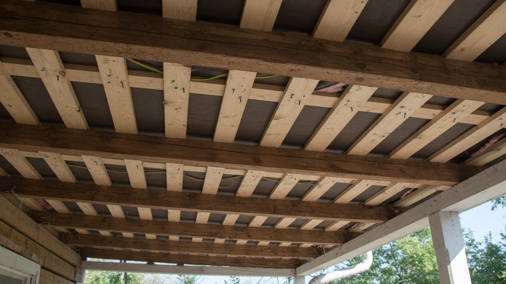
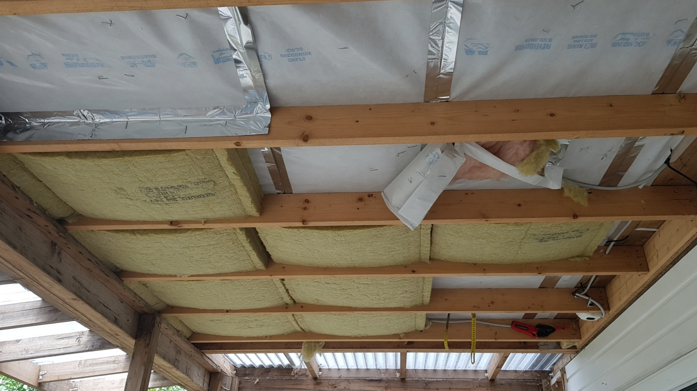

Потолок на веранде подшивают в последнюю очередь и думают о нём меньше всего — а зря. Именно под потолком собирается тёплый влажный воздух, именно там первым выступает конденсат, и именно потолок чаще всего приходится переделывать через пару лет из-за почерневшей вагонки. Разберём, чем подшить потолок на веранде, что подойдёт для неотапливаемого помещения, как смонтировать обрешётку и нужно ли его утеплять.

## 🌡️ Почему потолок веранды — особый случай

Три причины, по которым сюда нельзя ставить что попало:

- **Тёплый воздух поднимается вверх** и несёт с собой влагу — от дыхания, от мокрой обуви, от чайника. У потолка он остывает, и влага выпадает конденсатом.
- **Сверху обычно холод** — чердак, скат крыши или просто улица. Перепад между тёплым воздухом внутри и холодной поверхностью сверху создаёт точку росы прямо в конструкции потолка.
- **Доступ затруднён.** Переделать потолок сложнее, чем стены: нужны леса или стремянка, работа над головой, и всё это в готовом помещении.

Отсюда практическое следствие: **на потолке экономят в последнюю очередь**, а вентиляционный зазор здесь важнее, чем где-либо ещё.

## 🪵 Чем подшить потолок: обзор материалов

**Деревянная вагонка** — самый распространённый вариант. Визуально объединяет потолок со стенами, если те тоже обшиты деревом, выглядит тепло и уместно на даче. Подходит для любой веранды, но требует обработки антисептиком и финишного покрытия. Для потолка берите тонкую вагонку (12–14 мм) — она легче, и обрешётку можно делать реже.

**Блок-хаус и имитация бруса** на потолке используют реже: они тяжелее и «съедают» высоту. Оправданы, если хочется единой фактуры со стенами.

**ПВХ-панели** — практичный бюджетный выбор: не боятся влаги, моются, монтируются быстро и легко. На потолке их лёгкость особенно кстати — можно ставить редкую обрешётку. Минус: выглядят проще дерева, а дешёвый пластик на морозе становится хрупким. Для холодной веранды берите морозостойкие.

**Фанера и ОСП-3 под покраску** — ровная поверхность, современный вид, быстро закрывают площадь. Влагостойкая фанера ФСФ переносит и неотапливаемое помещение. Требуют обработки стыков и покраски.

**Открытые балки без подшивки** — недооценённое решение. Если высота позволяет, потолок можно не зашивать вовсе: обработать балки маслом или покрасить, а между ними подшить доску или оставить как есть. Экономия материала и работы, плюс визуально помещение становится выше.

**Реечный потолок (алюминиевый)** — влагостойкий и долговечный, но на дачной веранде смотрится «офисно», поэтому применяется редко.

**Чего избегать на холодной веранде:**

- **натяжной потолок из ПВХ-плёнки** — на морозе плёнка становится хрупкой и может треснуть (тканевые переносят холод лучше, но и они не для минусовых температур);
- **гипсокартон** — даже влагостойкий разбухает и крошится от сырости;
- **МДФ-панели** — разбухают от влаги;
- **потолочная плитка из пенопласта** — отклеивается при перепадах.

## ⚖️ Сравнение материалов для потолка

| Материал | Цена | Вес | Влагостойкость | Холодная веранда | Монтаж |
|---|---|---|---|---|---|
| Вагонка 12–14 мм | Средняя | Средний | Средняя (с покрытием — высокая) | ✅ | Своими руками |
| ПВХ-панели | Низкая | Лёгкий | Высокая | ✅ (морозостойкие) | Самый простой |
| Фанера ФСФ, ОСП-3 | Низкая | Тяжёлый | Высокая | ✅ | Нужен помощник |
| Блок-хаус | Выше средней | Тяжёлый | Средняя | ✅ | Своими руками |
| Открытые балки | Минимальная | — | — | ✅ | Только покраска |
| Гипсокартон | Низкая | Тяжёлый | Низкая | ❌ | Средней сложности |
| Натяжной ПВХ | Выше средней | Лёгкий | Высокая | ❌ | Нужны специалисты |

**Короткий вывод:** для холодной веранды — вагонка, морозостойкий пластик, влагостойкая фанера или открытые балки. Для тёплой — что угодно, включая гипсокартон и натяжной потолок.

## 💨 Вентиляционный зазор: главное правило

Если запомнить из статьи одну вещь, пусть это будет она. **Подшивка крепится на обрешётку, а не вплотную к перекрытию.**

Между потолочной подшивкой и конструкцией сверху должен оставаться воздушный зазор **не менее 2–3 см**. Он нужен, чтобы влага, попавшая в полость, могла уйти, а не копилась в замкнутом пространстве.

Что происходит без зазора: тёплый влажный воздух проникает в щели подшивки, упирается в холодную поверхность сверху, выпадает конденсатом — и остаётся там навсегда. Дерево чернеет, появляется грибок, а внешне потолок выглядит нормально, пока не начнёт пахнуть сыростью.

**Как обеспечить проветривание полости:**

- оставить **зазоры по периметру** подшивки (их потом закроет потолочный плинтус, не мешая движению воздуха);
- на холодной веранде — не закупоривать наглухо примыкание к стене;
- если сверху чердак — обеспечить его проветривание (продухи, слуховые окна);
- на полуоткрытой веранде вентиляция получается естественным образом.

## 🔨 Монтаж потолка на веранде: пошагово

1. **Оценить основание.** Проверить состояние балок и перекрытия — гниль, следы протечек, прочность. Ремонт делают до подшивки, потом не подобраться.
2. **Обработать антисептиком** балки и изнанку будущей подшивки, включая торцы. После монтажа доступа не будет.
3. **Развести электрику.** Провода под светильники прокладывают до обшивки, в гофре. Разметьте места светильников заранее — потом сверлить по готовому потолку неудобно.
4. **Смонтировать обрешётку** из бруска 20×40 или 30×40 мм по уровню. Шаг: 40–50 см для вагонки, 50–60 см для ПВХ-панелей, 40 см под фанеру (листовые материалы тяжелее и провисают).
5. **Уложить утеплитель**, если он нужен (см. ниже), и пароизоляцию со стороны помещения.
6. **Подшить материал**, начиная от стены, противоположной входу — так стыки будут меньше бросаться в глаза. Первый элемент выставить строго по уровню: от него зависит вся плоскость.
7. **Оставить зазор 5–10 мм** по периметру на температурное расширение.
8. **Закрыть примыкания** потолочным плинтусом или галтелью.
9. **Нанести финишное покрытие** — антисептик, масло, лак или краска для наружных и неотапливаемых помещений.

**Порядок работ в помещении:** потолок делают **до стен**. Тогда стеновая обшивка подойдёт снизу и закроет верхний стык — выглядит аккуратнее и не требует подрезки по месту. Общий порядок отделки разобран в статье про [внутреннюю отделку веранды](https://mir-doma.pro/vnutrennyaya-otdelka-verandy/).

## 🧊 Нужно ли утеплять потолок веранды

Ответ тот же, что и для стен: **зависит от того, отапливается ли веранда**.

**Веранда отапливается** — утеплять потолок нужно обязательно, и это самый выгодный узел для утепления: через верх уходит больше всего тепла. Пирог: пароизоляция со стороны помещения → утеплитель (минвата 100–150 мм) между балками → вентзазор → подшивка. Пароизоляцию обязательно клеят по стыкам, иначе пар пойдёт в утеплитель.

**Веранда не отапливается** — утеплять потолок смысла нет: удерживать нечего, температура всё равно сравняется с уличной. Хуже того, утеплитель в неотапливаемом помещении набирает влагу и превращается в источник сырости.

**Промежуточный случай:** если над верандой находится жилая мансарда или тёплый чердак, то утеплять нужно **перекрытие** — но это уже утепление пола помещения сверху, а не потолка веранды. Принципы разобраны в статье про [утепление крыши и мансарды](https://mir-doma.pro/uteplenie-kryshi-i-mansardy/).

## 💡 Свет на веранде: продумать заранее

Раз уж потолок открыт — сразу решите вопрос освещения, потом будет поздно:

- **точечные светильники** в подшивке — аккуратно, но требуют запаса по высоте (для встраиваемых нужно 5–7 см над подшивкой);
- **накладные светильники и плафоны** — проще, не требуют полости, подходят для тонкой подшивки;
- **подвесные светильники** между открытыми балками — красиво при достаточной высоте;
- **влагозащищённые светильники (IP44 и выше)** — обязательны для холодной и полуоткрытой веранды, где бывает конденсат;
- **проводку в гофре** и распаечные коробки — с доступом, а не замурованные наглухо.

Продумайте и выключатели: на веранде удобны проходные, чтобы включать свет и с улицы, и из дома.

## ❌ Частые ошибки

- **Подшивка вплотную, без вентзазора** — конденсат в полости, чернеющее дерево, грибок.
- **Гипсокартон или натяжной ПВХ на холодной веранде** — разбухнет или треснет.
- **Не обработали изнанку и торцы** антисептиком — гниль начнётся со скрытой стороны.
- **Электрику завели после подшивки** — провода снаружи или разбор готового потолка.
- **Нет зазора по периметру** — подшивку выгибает при расширении.
- **Слишком редкая обрешётка под листовые материалы** — фанера провисает волной.
- **Утеплили потолок неотапливаемой веранды** — утеплитель намокает и работает во вред.
- **Сырое дерево** — после высыхания появляются щели между ламелями.

## ❓ Частые вопросы

**Чем подшить потолок на веранде?**
Деревянной вагонкой, морозостойкими ПВХ-панелями, влагостойкой фанерой или ОСП-3 под покраску. Хороший бюджетный вариант — оставить открытые балки, обработав их маслом. Для тёплой веранды подойдут также гипсокартон и натяжной потолок.

**Чем подшить потолок на холодной веранде?**
Вагонкой с защитным покрытием, морозостойкими ПВХ-панелями или влагостойкой фанерой. Гипсокартон, МДФ, натяжной потолок из ПВХ-плёнки и потолочная плитка из пенопласта для неотапливаемого помещения не годятся.

**Нужен ли зазор между потолком и подшивкой?**
Обязательно — не менее 2–3 см. Без вентиляционного зазора влага скапливается в замкнутой полости, дерево чернеет и появляется грибок, а внешне потолок долго выглядит нормально.

**Какой шаг обрешётки делать под потолок?**
Для вагонки — 40–50 см, для ПВХ-панелей — 50–60 см, под фанеру и ОСП — около 40 см, так как листовые материалы тяжелее и провисают. Обрешётку обязательно выставляют по уровню.

**Нужно ли утеплять потолок на веранде?**
Только если веранда отапливается — тогда это самый выгодный узел, через верх уходит больше всего тепла. В неотапливаемом помещении утеплять потолок бессмысленно: утеплитель наберёт влагу и станет источником сырости.

**Что делать сначала — потолок или стены?**
Потолок. Тогда стеновая обшивка подойдёт снизу и закроет верхний стык, а подрезать по месту не придётся. Пол делают последним, чтобы не повредить готовое покрытие.

---

Потолок веранды прощает многое, кроме одного — отсутствия вентиляционного зазора. Соблюдите его, обработайте дерево до монтажа, разведите электрику заранее — и подшивка простоит десятилетия, чем бы вы её ни сделали.

**Куда идти дальше:**

- Потолок — только один из трёх узлов: чем обшить стены и чем застелить пол, с таблицами сравнения материалов, собрано в статье про [внутреннюю отделку веранды](https://mir-doma.pro/vnutrennyaya-otdelka-verandy/).
- Если веранда неотапливаемая, у неё своя специфика — конденсат, пароизоляция, какие обои выдержат мороз: [отделка холодной веранды внутри](https://mir-doma.pro/otdelka-holodnoy-verandy/).
- Определяетесь с материалом для стен — сравнение по цене, монтажу и расчёт количества: [чем обшить стены веранды изнутри](https://mir-doma.pro/chem-obshit-verandu-vnutri/).
- Отделка закончена, осталось наполнить пространство: [дизайн веранды на даче](https://mir-doma.pro/dizayn-verandy-na-dache/).
