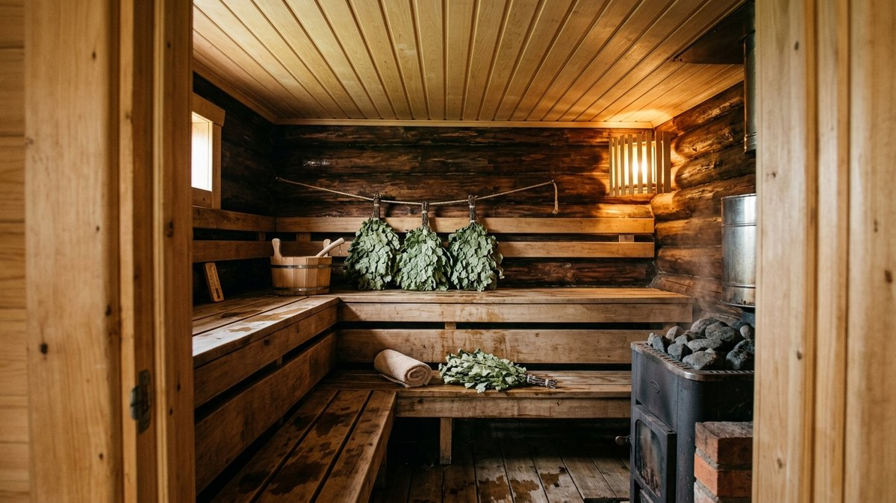
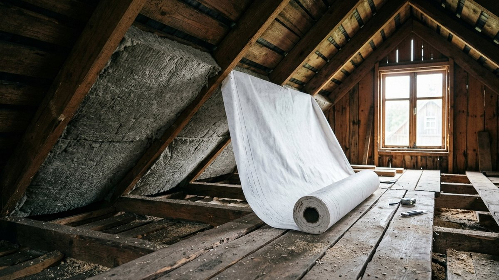
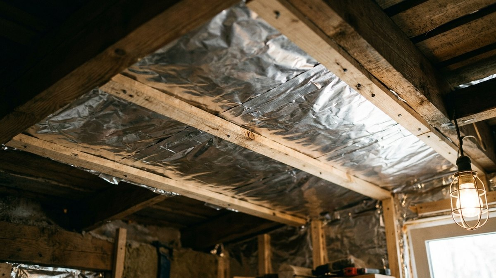
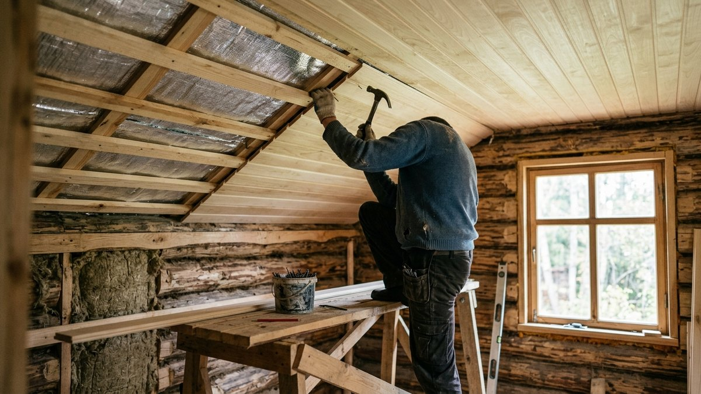
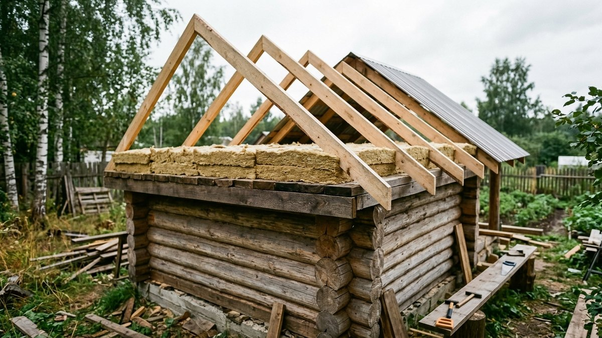
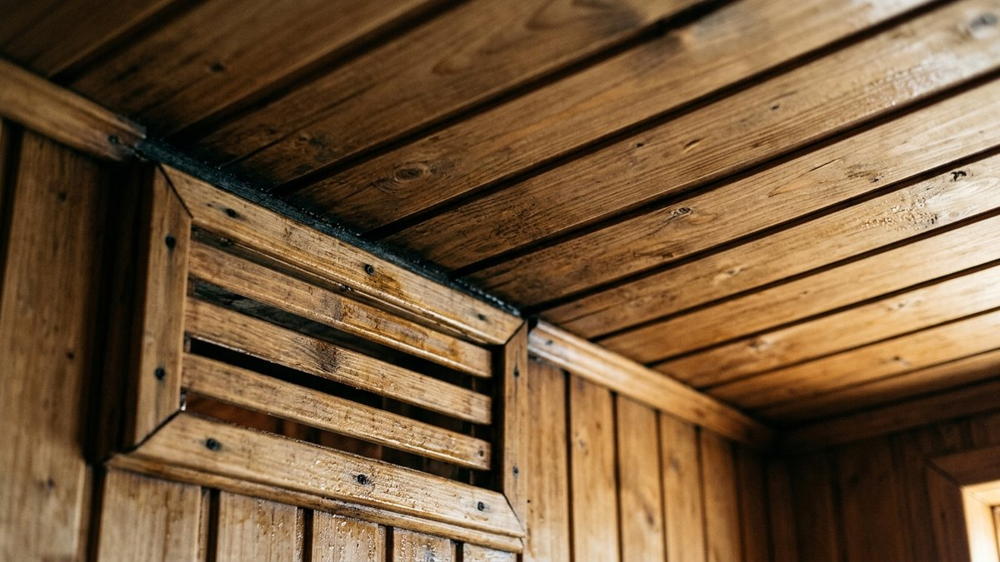

Потолок в бане — самое горячее и самое мокрое место одновременно.
Под ним собирается пар после каждого ковша на камни, температура
у потолка парилки доходит до 100–120 °C, а с другой стороны —
холодный чердак. Если сделать потолок «как в доме», через год вагонка
темнеет пятнами, с потолка капает, а баня остывает за час. Ниже разберём,
как правильно сделать потолок в бане: какую конструкцию выбрать под
размер парилки, какой пирог собрать снизу вверх, где нужна фольга
и где она не нужна, чем утеплить и какой толщины. Материалы на свою
парилку посчитаете калькулятором.

## Почему потолок бани — особый случай

Тёплый воздух поднимается вверх, поэтому через потолок баня теряет
больше тепла, чем через стены и пол. В доме с этим справляется толстый
слой утеплителя. В бане к теплопотерям добавляются ещё две проблемы.

- **Пар.** При температуре под потолком 100 °C и выше влажный воздух
  с силой давит в любую щель. Если пароизоляция с прорехами, пар
  проходит в утеплитель, там остывает и превращается в воду.
  Мокрая вата перестаёт греть, а доски перекрытия начинают гнить
  изнутри.
- **Перепады температуры.** Баню топят пару раз в неделю, в остальное
  время она стоит холодной. Каждый цикл «жар — мороз» отрабатывает
  и дерево, и стыки плёнки. То, что в доме держится десятилетиями,
  в бане может расползтись за несколько сезонов.

Отсюда три правила, на которых держится всё остальное: герметичная
пароизоляция, вентзазор под обшивкой и утеплитель, которому не страшна
температура.

## Подшивной, настильный или панельный

| Конструкция | Как устроена | Плюсы | Минусы | Когда подходит |
|---|---|---|---|---|
| Подшивной | доски подшивают снизу к балкам перекрытия, утеплитель кладут между балками | можно ходить по чердаку, выдерживает толстый слой утеплителя, любой пролёт | больше работы и материала | основной вариант для бани с чердаком |
| Настильный | доски кладут прямо на верхний венец стен, утеплитель — сверху | быстро и дёшево, не нужны балки | пролёт до 2,5 м, по чердаку не походишь, тяжёлую засыпку не выдержит | маленькая баня, парилка 2×2 м |
| Панельный (щитовой) | щиты собирают внизу и поднимают на балки | удобно собирать на земле | щиты тяжёлые, стыки между ними сложно загерметизировать | редко, если нет помощника для подшивки снизу |

Для большинства бань из бруса и каркасных бань ответ — подшивной
потолок. Он позволяет уложить 150–200 мм утеплителя и при этом
использовать чердак как кладовую для веников и дров. Настильный
хорош только для маленькой бани без чердака: доски 40–50 мм лежат
на стенах, сверху — пароизоляция и утеплитель, а над всем этим —
двускатная крыша.

В срубе из бруса или бревна балки перекрытия врезают в верхние
венцы при сборке. Если сруб ещё садится, подшивку делают на
плавающих креплениях или откладывают отделку до окончания основной
усадки — подробно о сроках в статье про [баню из бруса своими
руками](https://mir-doma.pro/banya-iz-brusa-svoimi-rukami/).

## Высота потолка в парилке

Высоту потолка в парилке не стоит делать «по-домашнему» 2,5 м и выше:
каждый лишний сантиметр — это объём, который печь должна прогреть,
а под высоким потолком скапливается жар, до которого не дотянуться
с полка. Обычная высота потолка в парилке — 2,1–2,2 м.

Проверять высоту нужно не от пола, а от верхнего полка: между ним
и потолком должно оставаться 1–1,2 м, чтобы сидеть, не упираясь
головой, и чтобы веником было где размахнуться. Размеры ярусов
полков и их расстановка — в статье про [полки в бане своими
руками](https://mir-doma.pro/lavki-v-bane-svoimi-rukami/), их удобно
спланировать до подшивки потолка.

В моечной и предбаннике потолок может быть выше, но обычно его
делают в одном уровне с парилкой: так проще перекрытие и меньше
стыков пароизоляции. Пол моечной, в отличие от потолка, делают
протекающим — как устроить его основание и слив, разобрано в статье
про [проливной пол в бане](https://mir-doma.pro/prolivnoy-pol-v-bane-svoimi-rukami/).

## Пирог потолка парилки снизу вверх

Вот как выглядит правильный пирог подшивного потолка парилки, если
смотреть из парилки вверх:

1. **Вагонка** — липа, осина, ольха или абаш. Хвойную вагонку
   в потолок парилки не ставят: при 100 °C из сосны выступает
   смола и капает горячими каплями.
2. **Вентзазор 20–30 мм** — рейки контробрешётки поверх фольги.
   Без него конденсат собирается на тыльной стороне вагонки, и она
   темнеет.
3. **Отражающая пароизоляция** — алюминиевая фольга или
   фольгированная крафт-бумага. Полотна кладут внахлёст 10–15 см
   и проклеивают стыки алюминиевым скотчем. Блестящая сторона —
   вниз, в парилку.
4. **Балки перекрытия**, между ними — **утеплитель**: базальтовая
   вата 150–200 мм.
5. **Ветрозащитная паропроницаемая мембрана** сверху утеплителя —
   со стороны чердака. Она не даёт ветру выдувать тепло из ваты
   и пропускает остатки влаги наружу.
6. **Черновой пол чердака** по балкам, если чердак используется.

Ошибка, которая встречается чаще остальных, — пароизоляция и сверху,
и снизу утеплителя. Если закрыть вату плёнкой с двух сторон, попавшая
в неё влага не выйдет никогда. Сверху — только паропроницаемая
мембрана.

## Нужна ли фольга на потолке бани

В парилке — да. Здесь потолок нагревается до 100 °C и выше, раскалённая
каменка и печь отдают много тепла излучением, и фольга отражает его
обратно в парилку. Помещение прогревается быстрее, а утеплитель
работает в более мягком режиме.

Важно, какой именно фольгированный материал брать:

- **Алюминиевая фольга** (банная, 50–100 мкм) — выдерживает любую
  температуру парилки. Минус — легко рвётся при монтаже.
- **Фольгированная крафт-бумага** — прочнее чистой фольги, тоже
  рассчитана на высокую температуру. Самый удобный вариант для
  потолка.
- **Вспененный полиэтилен с фольгой (пенофол и аналоги)** — удобен,
  но рабочая температура у большинства таких материалов ниже, чем
  бывает у потолка парилки. Если брать, то только с указанной
  в паспорте термостойкостью для саун; в моечной и предбаннике —
  без ограничений.

В предбаннике и комнате отдыха фольга не нужна: при 20–25 °C
излучения почти нет, и обычная пароизоляционная плёнка справляется
так же. Почему так и какой пирог там собирать, разобрано в статье
про [предбанник своими руками](https://mir-doma.pro/predbannik-svoimi-rukami/).

## Чем утеплить потолок в бане

| Утеплитель | Толщина для бани в средней полосе | Плюсы | Минусы |
|---|---|---|---|
| Базальтовая вата (плиты) | 150–200 мм | негорючая, держит высокую температуру, лёгкая | нужна защита от влаги снизу и ветра сверху |
| Стекловата | 150–200 мм | дешевле базальтовой | выдерживает меньшую температуру, колется при монтаже |
| Керамзит | 250–300 мм | негорючий, не гниёт, не боится мышей | тяжёлый, нужен прочный потолок и сплошной настил |
| Глина с опилками | 150–200 мм | традиционный, натуральный, дёшево | долго сохнет, тяжёлый, трудоёмкий |
| Пенопласт и пенополистирол | не брать | дёшево | плавится и выделяет вредные вещества при нагреве |

Из всех вариантов для потолка парилки удобнее всего базальтовая вата:
она не горит, лёгкая и при правильном пироге служит десятилетиями.
Керамзит хорош там, где боятся грызунов, но засыпать его нужно
слоем почти вдвое толще ваты, и балки перекрытия должны выдерживать
вес — примерно 100 кг на квадратный метр при слое 250–300 мм.

Если баней пользуются и зимой, не экономьте на толщине: 200 мм ваты
на потолке заметно сокращают время протопки в мороз. Как топить баню
зимой и почему в первые минуты с потолка может капать — в статье
о том, [как топить баню зимой](https://mir-doma.pro/kak-topit-banyu-zimoy/).

## Калькулятор материалов для потолка бани

Калькулятор считает вагонку, фольгу со скотчем, рейки контробрешётки
и утеплитель по размерам помещения. Для потолка без чердака
(настильного) рейки и вагонка считаются так же, а утеплитель — по
выбранной толщине.

<!-- wp:html -->

<h3 class="md-pt__title">Калькулятор материалов для потолка бани</h3>

Считает вагонку, фольгу, алюминиевый скотч, рейки вентзазора и утеплитель по размерам потолка. Фольга — с нахлёстом 15 см, рейки — с шагом 50 см.

<label class="md-pt__f">Длина помещения, м<input type="number" id="ptL" value="2.4" min="1" max="10" step="0.1"></label>
<label class="md-pt__f">Ширина помещения, м<input type="number" id="ptW" value="2" min="1" max="10" step="0.1"></label>
<label class="md-pt__f">Вагонка (рабочая ширина)
<select id="ptBoard">
<option value="88" selected>Евровагонка 96 мм (рабочая 88)</option>
<option value="80">Вагонка 90 мм (рабочая 80)</option>
<option value="130">Вагонка 146 мм (рабочая 130)</option>
</select></label>
<label class="md-pt__f">Длина доски, м<input type="number" id="ptLen" value="2.5" min="1" max="6" step="0.5"></label>
<label class="md-pt__f">Утеплитель
<select id="ptIns">
<option value="wool" selected>Базальтовая вата</option>
<option value="clay">Керамзит</option>
</select></label>
<label class="md-pt__f">Толщина утеплителя, мм<input type="number" id="ptT" value="150" min="50" max="400" step="10"></label>
<label class="md-pt__f">Запас на подрезку, %<input type="number" id="ptRes" value="10" min="0" max="30" step="1"></label>

Площадь потолка<b id="ptArea">—</b>

Вагонка с запасом<b id="ptBoards">—</b>

Фольга<b id="ptFoil">—</b>

Алюминиевый скотч<b id="ptTape">—</b>

Рейки 20–30 мм<b id="ptLath">—</b>

Утеплитель<b id="ptInsV">—</b>

Фольга рассчитана на рулон шириной 1,2 м. Скотч — по всем нахлёстам и по периметру примыкания к стенам. Объём утеплителя дан без учёта балок: для подшивного потолка реальный объём на 10–15% меньше.

<button type="button" id="ptCopy" class="md-pt__btn md-pt__btn--main">Скопировать результат</button>
<a id="ptVk" class="md-pt__btn md-pt__btn--vk" href="#" target="_blank" rel="noopener noreferrer">Поделиться ВКонтакте</a>
<a id="ptTg" class="md-pt__btn md-pt__btn--tg" href="#" target="_blank" rel="noopener noreferrer">Поделиться в Telegram</a>
<button type="button" id="ptShareNative" class="md-pt__btn" hidden>Поделиться…</button>
<button type="button" id="ptPrint" class="md-pt__btn">Печать</button>

<!-- /wp:html -->

## Как сделать подшивной потолок пошагово

Порядок для бани с готовыми балками перекрытия и холодным чердаком.
Работы идут снизу, из помещения, поэтому понадобятся устойчивые
козлы или леса и помощник.

1. **Обработать балки.** Антисептик для бань без запаха, на торцы —
   вдвое больше. После обшивки до балок уже не добраться.
2. **Закрепить фольгу.** Полотна раскатывают поперёк балок, крепят
   строительным степлером с нахлёстом 10–15 см, блестящей стороной
   вниз. На стены фольгу заводят на 10–15 см, чтобы соединить
   с пароизоляцией стен.
3. **Проклеить стыки.** Все нахлёсты и проколы от скоб закрывают
   алюминиевым скотчем. Именно здесь решается, будет ли потолок
   сухим: обычный скотч от жара отклеится через пару протопок.
4. **Набить рейки вентзазора.** Рейки 20–30 мм по балкам поверх
   фольги, шагом около 50 см, перпендикулярно будущей вагонке.
5. **Подшить вагонку.** Доски крепят кляммерами или скрытыми
   гвоздями в шип, с зазором 10–15 мм у стен — дерево в бане
   постоянно меняет размер. Первую доску выставляют строго по
   шнуру: от неё зависит ровность всего потолка.
6. **Сделать проход дымохода и вытяжки.** Отверстие под дымоход
   оставляют с запасом под потолочно-проходной узел и закрывают
   дерево вокруг негорючей плитой. Как собрать этот узел, разобрано
   в статье [«Какой дымоход лучше для бани»](https://mir-doma.pro/kakoy-dymokhod-luchshe-dlya-bani/).
7. **Уложить утеплитель с чердака.** Плиты ваты ставят между балками
   враспор, без щелей, в два слоя со смещением швов. Вокруг
   дымохода — только негорючая засыпка внутри короба ППУ.
8. **Закрыть мембраной и настилом.** Ветрозащитную мембрану кладут
   поверх ваты внахлёст, сверху по балкам — черновой пол чердака
   с зазором для проветривания.

Вытяжное отверстие в бане обычно делают в стене под потолком,
а не в самом потолке, чтобы не пробивать пароизоляцию лишний раз.
Где его располагать относительно печи и полков — в статье про
[вентиляцию в бане своими руками](https://mir-doma.pro/ventilyaciya-v-bane-svoimi-rukami/).

## Настильный потолок для маленькой бани

Если баня небольшая и без чердака, настильный потолок экономит
и время, и балки.

1. На верхний венец стен кладут доски 40–50 мм вплотную, шпунтованные
   или со сплачиванием, — они и будут потолком.
2. Снизу доски шлифуют и пропитывают, или подшивают фольгу и вагонку
   по той же схеме, что и в подшивном потолке, если хочется
   отражающего слоя.
3. Сверху на доски — пароизоляция, если фольга не стоит снизу,
   затем утеплитель и мембрана.
4. Ходить по такому потолку нельзя, а засыпать тяжёлым керамзитом
   слоем 300 мм — рискованно: доски прогибаются. Для настильного
   потолка выбирают лёгкую вату.

## Чем покрыть потолок в парилке

Потолок парилки лучше вообще не покрывать лаком и краской: при
100 °C плёнка размягчается, пахнет и мешает дереву дышать. Допустимы
только пропитки и масла, на которых производитель пишет «для полков
и парилки». В моечной и предбаннике можно использовать воск или
специальные составы для влажных помещений.

Если потолок темнеет пятнами уже в первый сезон, это не пропитка
виновата, а влага под вагонкой: нет вентзазора, порвана фольга или
баню не просушивают после парения. Открытая дверь и окно на час
после бани продлевают жизнь потолка больше, чем любое покрытие.

## Частые ошибки

- **Хвойная вагонка на потолке парилки.** Смола выступает и капает,
  а сосна под потолком темнеет быстрее всего.
- **Пароизоляция с двух сторон утеплителя.** Влага остаётся в вате
  навсегда, перекрытие гниёт изнутри.
- **Стыки фольги на обычном скотче.** Отклеиваются от жара, пар
  уходит в утеплитель.
- **Вагонка прямо по фольге без зазора.** Конденсат скапливается
  на тыльной стороне досок.
- **Пенопласт в потолке.** Плавится от нагрева и выделяет вредные
  вещества в парилку.
- **Высокий потолок «как в доме».** Печь греет лишний объём, а жар
  уходит выше полка.
- **Утеплитель вплотную к дымоходу.** Даже базальтовую вату
  у трубы заменяют негорючей засыпкой в коробе.

## Частые вопросы

### Как правильно сделать потолок в бане

Для бани с чердаком — подшивной: снизу вагонка из лиственных пород,
под ней вентзазор 20–30 мм, затем фольга с проклеенными стыками,
между балками 150–200 мм базальтовой ваты, сверху ветрозащитная
мембрана. Для маленькой бани без чердака — настильный потолок
из досок 40–50 мм с утеплителем сверху.

### Чем утеплить потолок в бане

Удобнее всего базальтовой ватой толщиной 150–200 мм — она негорючая
и лёгкая. Керамзит тоже подходит, но слой нужен 250–300 мм, и балки
должны выдерживать вес. Пенопласт и пенополистирол в потолке бани
не используют.

### Нужна ли фольга на потолке в бане

В парилке нужна: она отражает тепло от печи и камней и служит
пароизоляцией. Стыки проклеивают алюминиевым скотчем, сверху
оставляют вентзазор. В предбаннике и комнате отдыха фольга не нужна.

### Какая высота потолка должна быть в парилке

Обычно 2,1–2,2 м от пола, но главное — 1–1,2 м от верхнего полка
до потолка. Выше делать не стоит: печь будет греть лишний объём.

### Из какого дерева делать потолок в парилке

Из липы, осины, ольхи или абаша: они не выделяют смолу и мало
нагреваются на ощупь. Сосну и ель оставляют для предбанника
и моечной.
