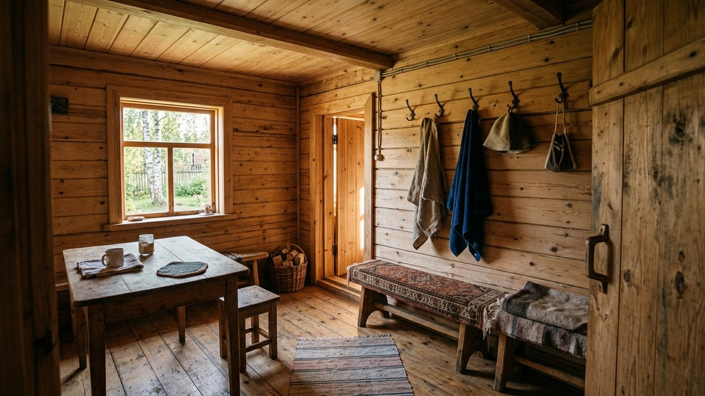
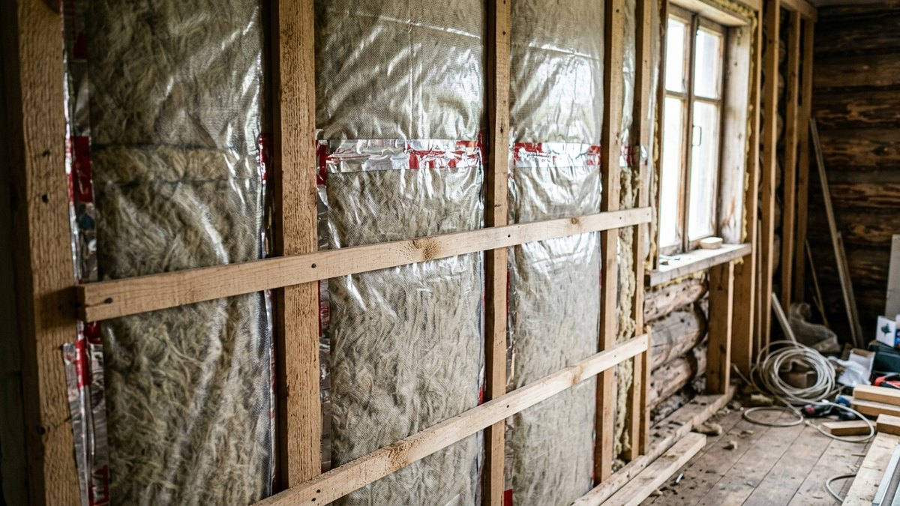
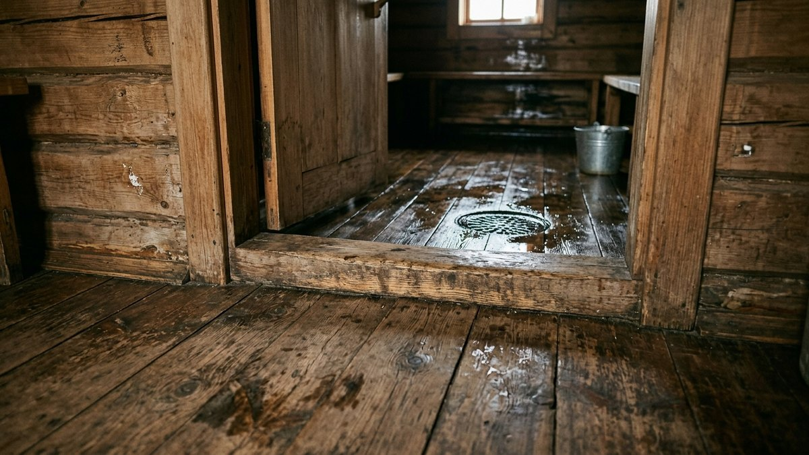
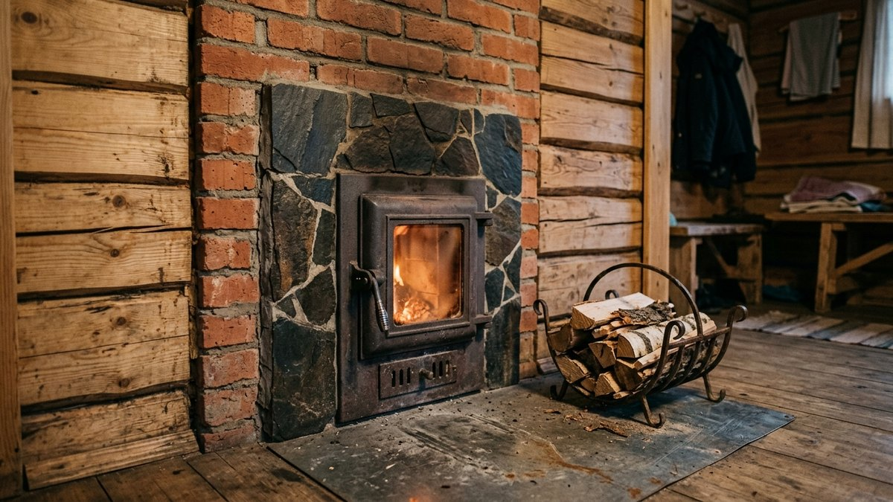
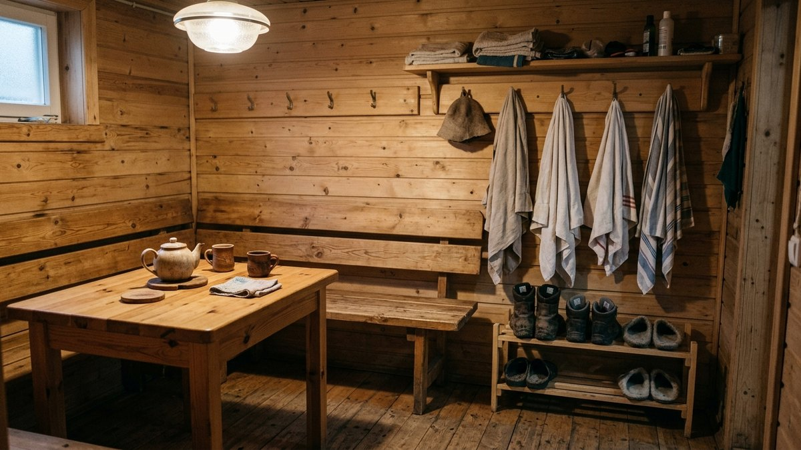
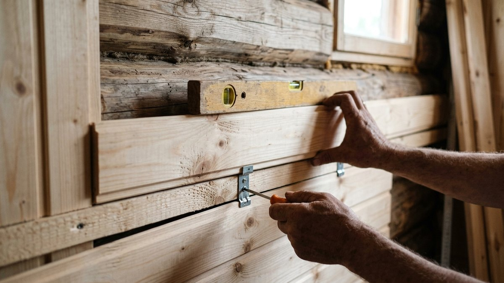

Предбанник своими руками обычно доделывают по остаточному принципу: все
силы уходят на парилку, а в раздевалку идут обрезки вагонки и старый
линолеум. Через пару сезонов всё это темнеет, пахнет сыростью, а зимой
на стене у двери появляется иней. Беда в том, что с предбанником обращаются
как с уменьшенной парилкой или как с обычной комнатой, а он не то и не другое.
Ниже разберём, чем его режим отличается от парилки, как утеплить стены
без лишней фольги, чем обшить и покрыть дерево, какой сделать пол и что
поставить внутри. Для обшивки есть калькулятор вагонки и утеплителя.

## Чем предбанник отличается от парилки и от жилой комнаты

В парилке 70–100 °C и пар, в моечной вода на полу. В предбаннике
температура держится около 18–25 °C, но каждые 15–20 минут в него
открывается дверь из моечной и заходит влажный тёплый воздух. Потом
баню бросают остывать на неделю, и зимой помещение промерзает до
уличной температуры. Отсюда три правила, которые определяют всё остальное:

- **Утепление нужно, но не как в парилке.** Фольгированный барьер
  здесь бесполезен: отражать почти нечего. Зато нужна нормальная
  пароизоляция, иначе влага из моечной уходит в утеплитель.
- **Покрытия должны выдерживать перепады.** Цикл «тепло и влажно →
  мороз» губит лаки с плёнкой, МДФ-панели и дешёвый ламинат.
- **Всё должно высыхать.** Проветривание после бани важнее, чем
  толщина утеплителя. Сырой предбанник с дорогой отделкой гниёт
  быстрее, чем простой, но сухой.

Размеры предбанника и его место в общей планировке мы разбирали в
статье [как построить баню на даче](https://mir-doma.pro/kak-postroit-banyu-na-dache/):
там про три зоны бани и минимальную площадь каждой. Здесь речь о том,
что делать с уже построенной коробкой.

## Утепление стен и потолка: пирог без фольги

Для каркасной бани и бани из бруса, которую обшивают изнутри, рабочий
пирог предбанника изнутри наружу выглядит так:

1. **Вагонка или другая обшивка.**
2. **Вентзазор 20–25 мм**: обрешётка из рейки поверх пароизоляции.
3. **Пароизоляционная плёнка** с проклейкой нахлёстов скотчем.
   Обычная, не фольгированная.
4. **Утеплитель**: минеральная вата 50 мм для бруса и бревна,
   100–150 мм для каркаса (толщина та же, что у стен дома в вашем
   регионе).
5. **Стена.**

Потолок утепляют толще стен: тёплый воздух собирается наверху, и именно
через потолок уходит основная часть тепла. Для потолка берут минвату
100–150 мм даже в бане из бруса. На лаги потолка сначала кладут
пароизоляцию, потом утеплитель, сверху (со стороны чердака) —
ветрозащитную мембрану. В парилке пирог другой — с фольгой и вентзазором
под вагонкой из лиственных пород; он разобран в статье о том, [как
правильно сделать потолок в бане](https://mir-doma.pro/potolok-v-bane-svoimi-rukami/).

Если баня из толстого бруса или бревна (150 мм и больше) и ею
пользуются круглый год, стены предбанника можно не утеплять вовсе, а
обшить вагонку по обрешётке с зазором. Дерево само держит тепло, а
зазор даёт стене дышать. Утеплять в таком случае стоит потолок и пол.

Почему не фольга. Фольгированный материал отражает инфракрасное
излучение, а оно заметно только там, где есть горячие поверхности
(стены парилки, камни). В предбаннике при 20 °C он работает как
обычная пароизоляция, только дороже. Опасно другое: фольгу в
предбаннике часто кладут без вентзазора, и влага конденсируется на
внутренней стороне обшивки. Сама по себе фольга не вредна, но
переплачивать за неё не нужно.

## Чем обшить предбанник: сравнение материалов

| Материал | Цена | Плюсы | Минусы | Итог |
|---|---|---|---|---|
| Вагонка из сосны или ели, класс AB | низкая | доступна, легко пилится, красивая текстура | смолится на солнце, темнеет без покрытия | основной вариант |
| Вагонка из липы или осины | средняя | не смолится, светлая | мягкая, продавливается мебелью | если хочется светлый интерьер |
| Имитация бруса | средняя | выглядит как сруб, ширина 140–190 мм | шире шаг — больше заметна геометрия стен | для каркасной бани под «сруб» |
| Блок-хаус | выше средней | имитирует бревно | съедает 30–40 мм площади с каждой стены | если предбанник просторный |
| Термообработанная вагонка | высокая | не боится влаги, не темнеет | дорогая, ломкая при монтаже | для стены, смежной с моечной |
| МДФ и ПВХ-панели | низкая | дёшево, быстро | МДФ разбухает, ПВХ не дышит и пахнет при нагреве у печи | не брать |

Хвойная вагонка в предбаннике не опасна, в отличие от парилки: при
20–25 °C смола не выступает. Единственное горячее место — стена вокруг
топки, если печь топится из предбанника, но её всё равно закрывают
негорючим экраном, о нём ниже.

Вагонку крепят кляммерами на обрешётку, а не гвоздями насквозь:
доска должна свободно ходить при усадке и разбухании. Вертикальная
обшивка визуально поднимает потолок, горизонтальная лучше скрывает
кривизну стен и проще в стыковке с мебелью.

<!-- wp:html -->

<h3 class="md-pb__title">Калькулятор вагонки и утеплителя для предбанника</h3>

Считает стены и потолок за вычетом двери и окна. Кляммеры — из расчёта около 20 шт на 1 м², точное число зависит от шага обрешётки.

<label class="md-pb__f">Длина помещения, м<input type="number" id="pbL" value="2.5" min="1" max="10" step="0.1"></label>
<label class="md-pb__f">Ширина помещения, м<input type="number" id="pbW" value="2" min="1" max="10" step="0.1"></label>
<label class="md-pb__f">Высота стен, м<input type="number" id="pbH" value="2.2" min="1.8" max="3.5" step="0.05"></label>
<label class="md-pb__f">Двери и окна, м² (всего)<input type="number" id="pbOpen" value="3" min="0" max="30" step="0.1"></label>
<label class="md-pb__f">Обшивать потолок
<select id="pbCeil">
<option value="1" selected>Да</option>
<option value="0">Нет</option>
</select></label>
<label class="md-pb__f">Вагонка (рабочая ширина)
<select id="pbBoard">
<option value="88" selected>Евровагонка 96 мм (рабочая 88)</option>
<option value="80">Вагонка 90 мм (рабочая 80)</option>
<option value="130">Имитация бруса 146 мм (рабочая 130)</option>
<option value="175">Имитация бруса 190 мм (рабочая 175)</option>
</select></label>
<label class="md-pb__f">Длина доски, м<input type="number" id="pbLen" value="3" min="1" max="6" step="0.5"></label>
<label class="md-pb__f">Толщина утеплителя стен, мм<input type="number" id="pbIns" value="50" min="0" max="200" step="10"></label>
<label class="md-pb__f">Запас на подрезку, %<input type="number" id="pbRes" value="10" min="0" max="30" step="1"></label>

Площадь обшивки<b id="pbArea">—</b>

С запасом<b id="pbAreaRes">—</b>

Досок<b id="pbBoards">—</b>

Кляммеров<b id="pbKl">—</b>

Утеплитель стен<b id="pbInsV">—</b>

Пароизоляция<b id="pbVap">—</b>

Утеплитель считается только на стены; для потолка возьмите 100–150 мм отдельно (площадь потолка = длина × ширина). Пароизоляция — стены и потолок с нахлёстом 15%.

<button type="button" id="pbCopy" class="md-pb__btn md-pb__btn--main">Скопировать результат</button>
<a id="pbVk" class="md-pb__btn md-pb__btn--vk" href="#" target="_blank" rel="noopener noreferrer">Поделиться ВКонтакте</a>
<a id="pbTg" class="md-pb__btn md-pb__btn--tg" href="#" target="_blank" rel="noopener noreferrer">Поделиться в Telegram</a>
<button type="button" id="pbShareNative" class="md-pb__btn" hidden>Поделиться…</button>
<button type="button" id="pbPrint" class="md-pb__btn">Печать</button>

<!-- /wp:html -->

## Чем покрыть вагонку в предбаннике

Некрашеная сосна в предбаннике за 2–3 года становится серо-жёлтой, а в
углах у двери моечной появляются тёмные пятна. Поэтому дерево здесь,
в отличие от парилки, покрывают. Подходят три типа составов:

- **Масло или масло-воск.** Впитывается, не образует плёнки, дерево
  продолжает дышать. Обновлять раз в 2–3 года. Лучший вариант для
  стен, которые трогают руками.
- **Водная лазурь или пропитка для бань и саун.** Даёт лёгкий тон,
  защищает от посинения. Удобна для потолка, где маслом работать
  неудобно.
- **Антисептик** для нижних 30–40 см стены и обрешётки перед обшивкой:
  сюда стекает вода с обуви и полотенец.

Не подходят алкидные и полиуретановые лаки с плотной плёнкой. На
перепадах температуры и влажности плёнка трескается, под неё заходит
влага, и через пару сезонов дерево темнеет пятнами под лаком. Для
предбанника выбирайте составы с пометкой «для бань и саун», у них
допущена эксплуатация во влажных помещениях.

## Пол в предбаннике: тёплый и без уклона

Пол предбанника — самое холодное место бани: по нему тянет от двери и
из подполья. Делают его так же, как утеплённый пол в дачном доме,
подробно этот пирог разобран в статье [про утепление пола на даче](https://mir-doma.pro/uteplenie-pola-na-dache/):
черновой пол на черепных брусках, ветрозащита, утеплитель 100–150 мм
между лагами, пароизоляция, чистовой пол.

Отличия от моечной принципиальные:

- **Уклон не нужен.** Пол предбанника сухой, трап и слив в нём не
  делают. В моечной всё наоборот: там обычно делают [проливной пол
  с поддоном и трапом](https://mir-doma.pro/prolivnoy-pol-v-bane-svoimi-rukami/), через который вода уходит под настил. Если в предбанник со временем начинает затекать вода из
  моечной — дело в пороге, а не в полу.
- **Порог 5–10 см** между моечной и предбанником удерживает воду и
  холодный воздух у пола моечной.
- **Чистовой пол** — шпунтованная доска 28–36 мм или тёплая
  керамическая плитка с деревянной решёткой-трапиком сверху.
  Ламинат не подходит: разбухает по стыкам от мокрых ног.

Утеплённый пол в предбаннике тёплый, но не горячий. Если хочется
выходить из парилки на подогретую плитку, под неё кладут
электрический мат или водяной контур от печи. Как выбрать между ними и
где ставить терморегулятор, чтобы его не залило, разобрано в статье
[тёплый пол в бане](https://mir-doma.pro/teplyy-pol-v-bane/).

## Если топка печи выходит в предбанник

Самая частая схема в небольшой бане: печь стоит в парилке, а топочный
канал проходит через стену в предбанник. Дрова носят и подкладывают, не
заходя в жар, и мусор от дров не попадает в парилку. Какие печи так
устроены и чем они отличаются от электрокаменок, мы сравнивали в
статье [дровяная или электрическая печь для бани](https://mir-doma.pro/drovyanaya-ili-elektricheskaya-pech-dlya-bani/).

У этой схемы есть обязательные требования пожарной безопасности:

- **Разделка в стене** вокруг топочного канала из негорючего материала
  (кирпич, минеральная плита с металлическим листом). Её размеры
  указаны в паспорте печи: они зависят от конструкции топки, и
  брать цифры «как у соседа» нельзя.
- **Металлический лист на полу перед топкой** размером не меньше
  0,5 × 0,7 м, длинной стороной вдоль печи. Это требование
  свода правил СП 7.13130 к полу из горючих материалов перед топочной
  дверцей.
- **Экран на стене вокруг дверцы.** Кладут кирпич, керамогранит или
  кварцит на негорючем основании; вагонку рядом с топкой не ставят.
  Если кирпичом обкладывают и саму печь в парилке, кладку ведут с
  зазором и продухами: порядок работ — в статье [как обложить печь в
  бане кирпичом](https://mir-doma.pro/kak-oblozhit-pech-v-bane-kirpichom/).
- **Место для дров** у топки — дровница из металла или кирпичный
  короб, не ближе 0,5 м к дверце.

Раз в предбаннике открытая топка, в нём же должен быть приток воздуха
на горение. Если баню топят зимой с закрытыми дверями, печь начнёт
«задыхаться» и дымить. Решение — приточный клапан в стене у пола
рядом с топкой, подробнее о схемах притока в статье про [вентиляцию в бане](https://mir-doma.pro/ventilyaciya-v-bane-svoimi-rukami/).

## Что поставить в предбаннике

Мебель в предбаннике должна переживать сырость и мороз так же, как
отделка. Поэтому пластик и мягкая обивка здесь служат недолго, а
массив хвойных пород с масляным покрытием — десятилетиями.

Минимальный набор для предбанника на 2–4 человека:

- **Стол** 60 × 100–120 см, у окна. Для узкого помещения — откидной
  на стене.
- **Лавки** вдоль стены высотой 40–45 см и шириной 35–45 см: на них
  сидят, а не лежат, поэтому они уже, чем полок. Как собрать лавку
  без видимого крепежа, мы разбирали в статье [про лавки и полки в бане](https://mir-doma.pro/lavki-v-bane-svoimi-rukami/),
  конструкция та же.
- **Вешалка** на 6–8 крючков у входа и полка для полотенец над ней.
- **Ящик или ниша для обуви** на полу, чтобы тапки не стояли в
  проходе.
- **Место для веников:** крючок и ведро или таз, где их запаривают,
  если в моечной для этого тесно.

Освещение — светильники со степенью защиты не ниже IP44: в предбанник
заходит пар из моечной. Розетки ставят на высоте от 90 см от пола,
выключатель лучше вынести на улицу или в тамбур, если он есть.

## Порядок работ

1. **Проверить сухость коробки.** Брус и бревно отделывают после
   основной усадки, не раньше 6–12 месяцев; каркасную баню —
   сразу после монтажа кровли.
2. **Сделать разделку и экраны у топки,** если топочный канал выходит
   в предбанник. Потом к ним уже не подобраться.
3. **Утеплить пол** и уложить чистовой настил. Пол делают до стен,
   чтобы вагонка стояла на готовом полу с зазором 10–15 мм.
4. **Утеплить потолок,** затем стены. Пароизоляцию стен заводят
   на потолочную с нахлёстом и проклеивают.
5. **Набить обрешётку** 20–25 мм поперёк направления обшивки.
6. **Обшить потолок, потом стены.** Первую доску выставить по
   уровню, дальше крепить кляммерами.
7. **Поставить плинтус, наличники, уголки.** Вентзазор снизу и сверху
   не закрывать наглухо.
8. **Покрыть дерево** маслом или пропиткой, дать высохнуть 2–3 дня
   до первой топки.
9. **Смонтировать свет** и занести мебель.

## Частые ошибки

- **Обшивка вплотную к пароизоляции.** Без вентзазора обратная сторона
  вагонки не высыхает и чернеет, хотя снаружи дерево выглядит чистым.
- **Лак вместо масла.** Лаковая плёнка трескается через 1–2 зимы,
  переделывать приходится со шлифовкой.
- **МДФ, ПВХ, ламинат.** Материалы для жилых комнат не держат цикл
  «пар — мороз».
- **Нет притока у топки.** Печь, топящаяся из предбанника, забирает
  воздух оттуда же; без приточного клапана тяга слабеет, а в
  помещение выбивает дым.
- **Баню закрывают сразу после мытья.** Двери в моечную и парилку
  нужно оставлять открытыми хотя бы на пару часов, иначе влага
  оседает в предбаннике. Про то, как правильно остужать и
  просушивать баню в мороз, есть отдельный раздел в статье [как
  топить баню зимой](https://mir-doma.pro/kak-topit-banyu-zimoy/).

## Частые вопросы

### Как утеплить предбанник изнутри

Минеральной ватой 50 мм на стены (для каркаса — 100–150 мм) и 100–150 мм
на потолок, поверх неё обычная пароизоляционная плёнка с проклейкой
стыков, затем обрешётка для вентзазора и обшивка. Фольгированный
материал в предбаннике не обязателен, он нужен в парилке.

### Чем обшить предбанник внутри недорого

Хвойной вагонкой класса AB или имитацией бруса. Это самый дешёвый из
долговечных вариантов: при температуре предбанника смола не выступает,
а покрытие маслом защищает дерево от потемнения. МДФ и ПВХ дешевле, но
во влажном и промерзающем помещении служат 2–3 сезона.

### Нужна ли пароизоляция в предбаннике

Нужна, если стены утеплены. Из моечной в предбанник постоянно заходит
влажный воздух, и без плёнки он конденсируется внутри утеплителя.
Если стены из толстого бруса без утеплителя, пароизоляцию не кладут:
дерево должно просыхать через обшивку.

### Какой пол сделать в предбаннике

Утеплённый деревянный пол на лагах без уклона и без слива, из
шпунтованной доски 28–36 мм. Между предбанником и моечной ставят порог
5–10 см. Перед топкой печи, если она выходит в предбанник, на пол
кладут металлический лист не меньше 0,5 × 0,7 м.

### Можно ли покрасить вагонку в предбаннике

Можно, но лучше маслом, масло-воском или водной лазурью для бань, а не
лаком с плотной плёнкой. Плёночные покрытия трескаются от перепадов
температуры, а масло впитывается и позволяет дереву дышать.
