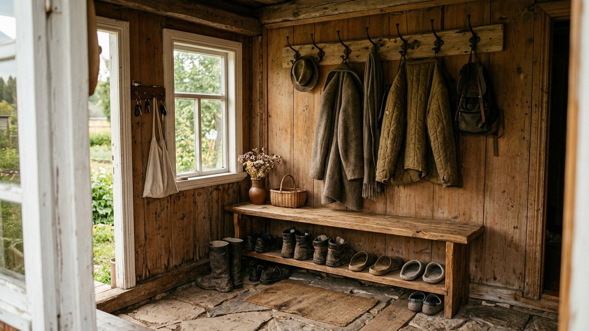
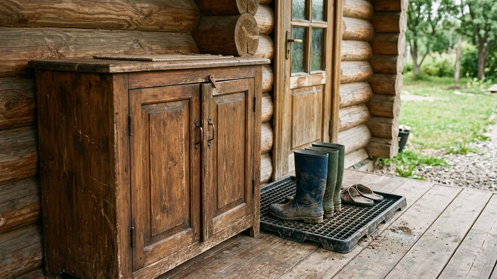
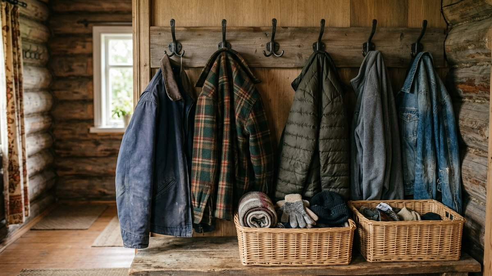
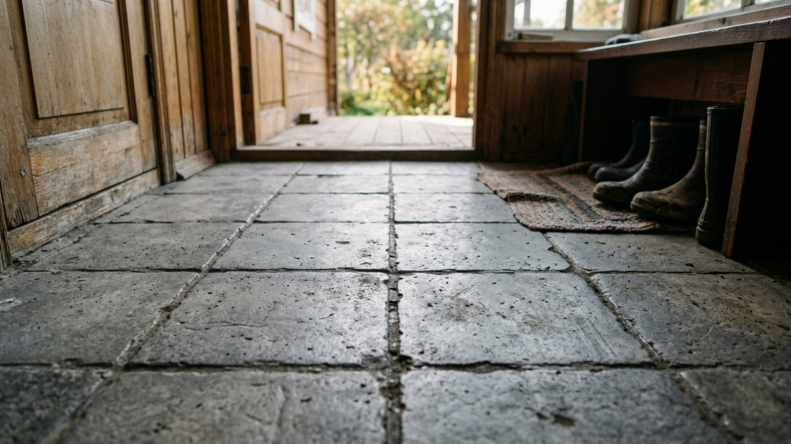
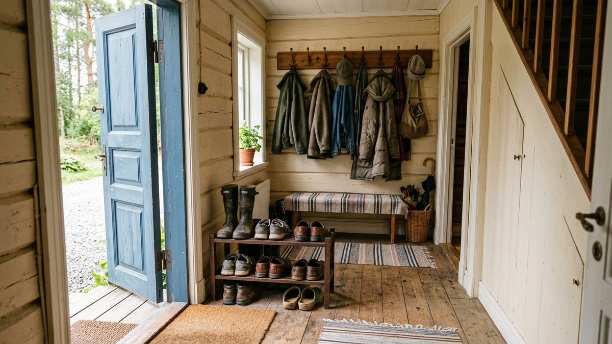
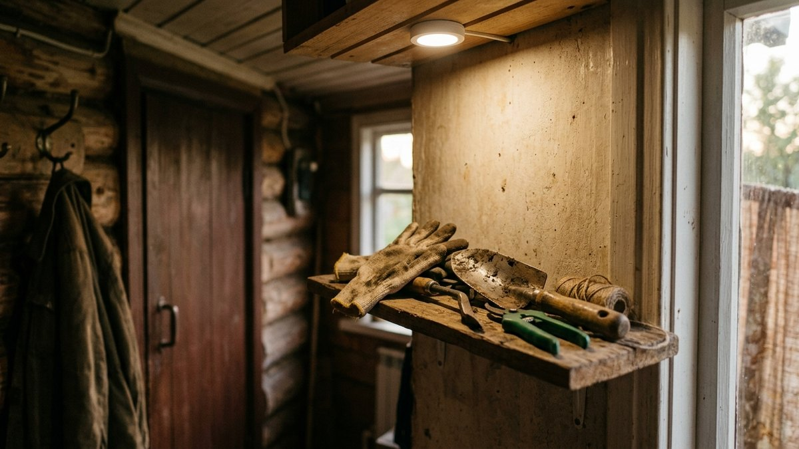

Дачная прихожая работает жёстче городской: сюда заходят прямо с огорода в
грязных сапогах, здесь же снимают рабочую одежду, сохнут зонты и лежит
рассадный инвентарь. Свалка обуви и курток на 2–3 квадратных метрах —
типичная картина, если не продумать зонирование заранее. Разбираем, как
организовать хранение в тесном дачном тамбуре, какая мебель выдерживает
уличную грязь и как разделить «грязную» и «чистую» зоны, даже если места
всего на пару шкафов.

## Чем дачная прихожая отличается от городской

В квартире прихожая — это в основном верхняя одежда и обувь по сезону. На
даче в тот же тамбур ежедневно заходят в грязной уличной обуви, здесь же
часто хранят: рабочие перчатки, шляпы от солнца, дождевики, резиновые
сапоги, иногда — инвентарь для рассады и мелкий садовый инструмент. Из-за
этого дачная прихожая требует более грубой, влагостойкой мебели и чёткого
разделения на зону для грязной обуви и всё остальное.

## Зонирование даже на маленькой площади

Принцип работает даже в тамбуре 1,5×1,5 м:

- **Грязная зона у входа** — коврик с ячейками или решётчатый поддон для
  обуви прямо у двери, чтобы уличная грязь не расползалась дальше по дому.
- **Обувница закрытого типа** — важно именно закрытого, а не открытая
  этажерка: запах и грязь от уличной обуви не должны проветриваться в
  жилую часть дома.
- **Крючки вместо шкафа для верхней одежды** — на даче куртки и
  дождевики чаще вешают, а не убирают: их надевают и снимают по несколько
  раз за день, и открытый доступ важнее аккуратности.
- **Отдельная полка или ящик для «огородного» инвентаря** — перчатки,
  секатор, шляпа от солнца — то, что берут с собой каждый раз перед
  выходом на участок, должно лежать у самого выхода, а не в глубине дома.

## Какая мебель подходит для дачной прихожей

| Тип мебели | Плюсы | На что обратить внимание |
|---|---|---|
| Обувница с перфорированными полками | Обувь проветривается, грязь не скапливается | Требует регулярной протирки полок |
| Закрытый шкаф-купе | Полностью скрывает беспорядок | Занимает больше места, нужен зазор для вентиляции |
| Открытые крючки и вешала | Дёшево, быстрый доступ | Не подходит для сезонного хранения — только для активно используемых вещей |
| Скамья с ящиком под сиденьем | Удобно переобуваться сидя, ящик прячет обувь | Требует минимум 40–50 см глубины |
| Решётчатый поддон для грязной обуви | Грязь и вода не пачкают пол | Нужно периодически мыть отдельно |

Для тесного тамбура практичнее всего сочетание: решётчатый поддон у
двери, узкая обувница высотой в человеческий рост (она занимает меньше
площади пола, чем низкая широкая) и несколько крючков на свободной стене.

## Материалы, устойчивые к дачной специфике

Мебель для дачной прихожей стоит выбирать с поправкой на то, что сюда
регулярно попадает влага и уличная грязь:

- **ЛДСП с влагостойким покрытием кромок** — бюджетный вариант, но
  обычная ЛДСП без обработки кромок разбухает от постоянной влажности за
  один-два сезона.
- **Массив хвои с защитной пропиткой** — прочнее и устойчивее к влаге при
  условии регулярного обновления покрытия.
- **Пластиковые и ротанговые корзины** для мелочей — не боятся влаги и
  легко моются в отличие от тканевых органайзеров.

Если прихожая совмещена с верандой или является частью летней кухни,
стоит одновременно продумать общую логику пространства — разбор
планировки таких совмещённых зон есть в статье
[дизайн веранды на даче](https://mir-doma.pro/dizayn-verandy-na-dache/).

## Освещение и вентиляция тамбура

Маленькая прихожая без окна нуждается в дополнительном освещении сильнее,
чем комнаты с естественным светом — тусклая лампочка над дверью не
позволяет нормально разглядеть, куда наступаешь, снимая грязную обувь в
темноте. Достаточно светодиодного светильника на 400–500 люмен на
квадратный метр площади тамбура. Отдельная задача — вентиляция: закрытая
обувница без вентиляционных отверстий превращается в источник запаха уже
через неделю активного дачного сезона, особенно летом.

## Пошагово: как обустроить прихожую на даче с нуля

1. **Замерить площадь и выделить зону у двери** под грязную обувь —
   минимум 40×60 см на решётчатый коврик или поддон.
2. **Выбрать тип обувницы** под доступную глубину: закрытая от 30 см
   глубиной, открытые полки — от 25 см.
3. **Повесить крючки на уровне плеч** для верхней одежды, отдельный ряд
   ниже — для детской одежды, если дача семейная.
4. **Организовать полку или корзину для мелочей**, которые берут с собой
   каждый выход на участок.
5. **Продумать освещение** — светильник у зеркала или обувницы, а не
   только общий свет по центру потолка.
6. **Постелить влагостойкое покрытие пола** — плитку или линолеум вместо
   ковролина, который быстро впитывает уличную грязь и запах.

## Частые ошибки

- **Ковролин или ковёр на полу тамбура.** Впитывает грязь и влагу, быстро
  начинает пахнуть и требует более частой чистки, чем плитка или линолеум.
- **Открытая этажерка для обуви вместо закрытой.** Запах и пыль от
  уличной обуви расходятся по дому свободнее, чем при закрытом хранении.
- **Один общий крючок на всех вместо системы по числу пользователей.**
  На семейной даче куртки и полотенца сваливаются в одну кучу — отдельные
  крючки на человека решают проблему без затрат.
- **Отсутствие отдельного места для огородного инвентаря.** Перчатки и
  секатор в итоге хранятся где придётся, и их каждый раз приходится искать
  перед выходом на участок.
- **Экономия на освещении маленького тамбура без окна.** Тусклый свет
  делает и без того тесное пространство неудобным для ежедневного
  использования.

## Частые вопросы

### Как обустроить маленькую прихожую на даче

Разделить пространство на зону для грязной обуви у самого входа (коврик
или решётчатый поддон) и зону хранения (закрытая обувница, крючки для
верхней одежды). Даже 1,5–2 м² площади хватает при вертикальном
размещении мебели.

### Какую мебель выбрать для прихожей на даче с высокой влажностью

Мебель из массива с влагостойкой пропиткой или ЛДСП с обработанными
кромками, а для мелочей — пластиковые или ротанговые корзины вместо
тканевых органайзеров, которые впитывают влагу и запах.

### Нужна ли вентиляция в закрытой обувнице на даче

Да, без вентиляционных отверстий закрытая обувница с уличной обувью
начинает пахнуть уже через неделю активного использования, особенно в
тёплый сезон.

### Что постелить на пол в прихожей на даче

Плитку или линолеум — они не впитывают грязь и легко моются, в отличие от
ковролина, ламината без влагостойкой обработки стыков или паркета.

### Как хранить огородный инвентарь в дачной прихожей

Отдельную полку или ящик у самого выхода стоит выделить под то, что берут
с собой на участок каждый день: перчатки, секатор, шляпу от солнца — так
не приходится искать эти вещи по всему дому перед выходом.

Если прихожая примыкает не к жилой части, а к хозблоку или бытовке, где
хранится основной садовый инвентарь, логику хранения удобнее выстраивать
на два уровня сразу — общий разбор организации пространства бытовки есть
в статье [интерьер в бытовке на даче](https://mir-doma.pro/interer-v-bytovke-na-dache/).
Похожий принцип зонирования «грязное у входа — чистое дальше» работает и
для летней веранды, если она используется как проходное помещение —
подробнее в статье [летняя веранда на даче](https://mir-doma.pro/letnyaya-veranda-na-dache/).
