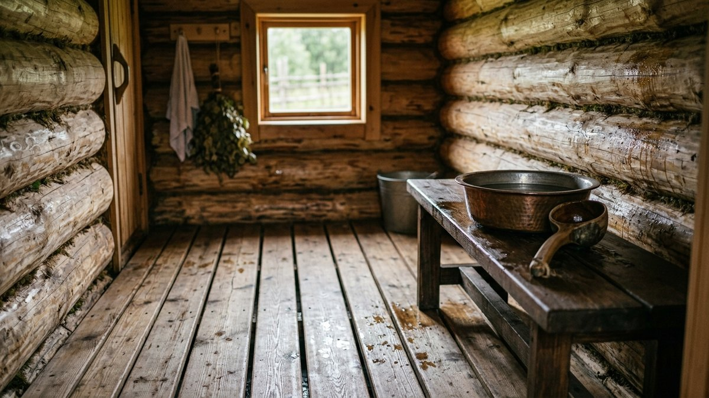
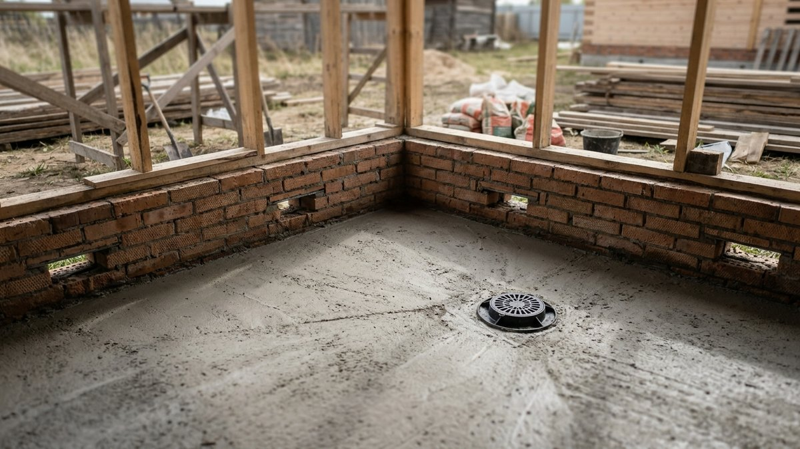
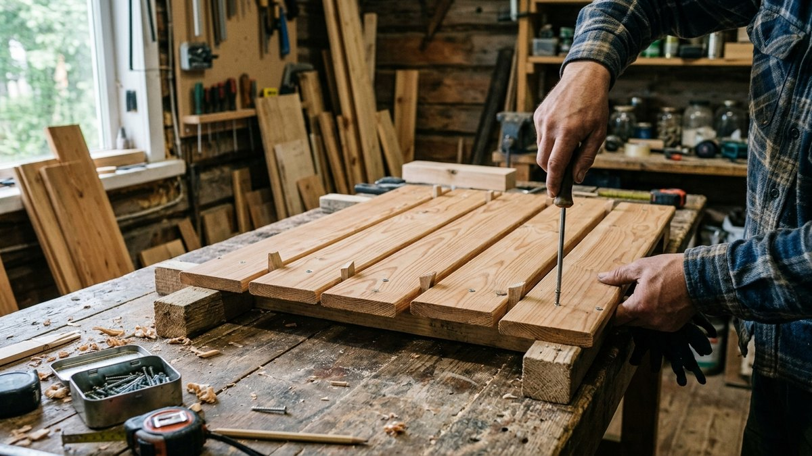
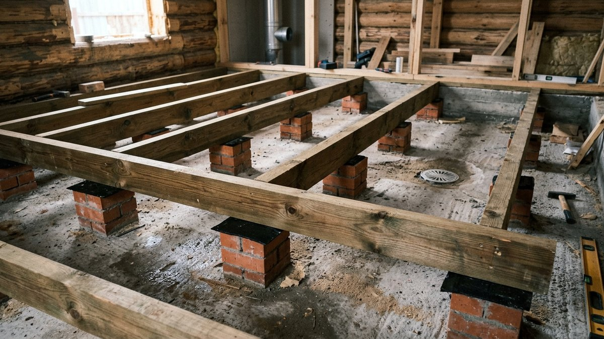
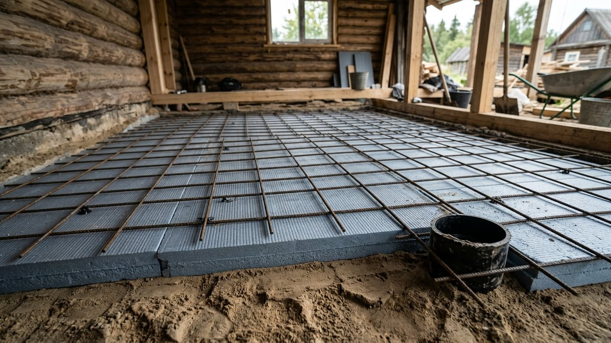
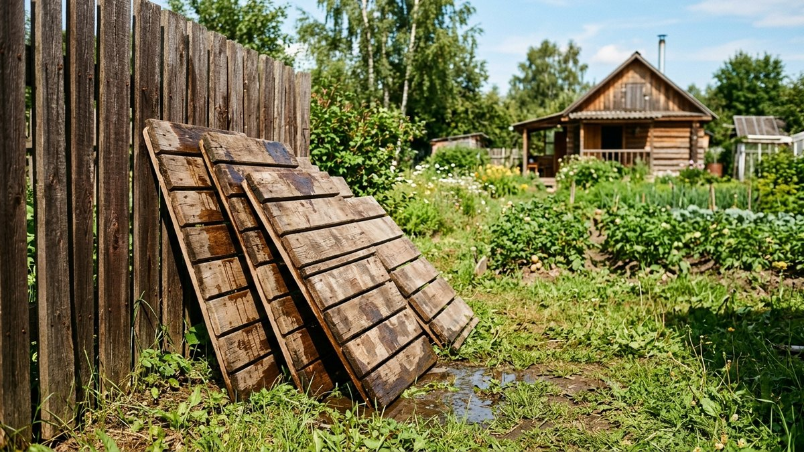

Проливной пол в бане своими руками — самый простой способ избавиться
от воды в моечной: доски лежат с зазорами, вода уходит сквозь них
вниз и дальше в слив. Но простота обманчива. Если под досками нет
поддона с уклоном, под баней стоит болото, и через пару лет пахнет
сыростью. Без продухов лаги гниют снизу, а зимой от такого пола
тянет холодом так, что в моечной не постоять. Ниже разберём, в каких
банях проливной пол уместен, как устроить основание и слив, на каком
дереве и с какими зазорами собрать настил, и как сделать вариант,
в котором можно мыться и в мороз. Доски, лаги и бетон на поддон
посчитает калькулятор.

## Как устроен проливной пол и где он уместен

Проливной (протекающий) пол — это настил из досок на лагах с зазорами
между досками. Вода проходит сквозь зазоры и попадает на основание
под полом, а оттуда уходит в слив или в грунт. Доски не лежат в луже,
после бани быстро сохнут, а пол можно поднять и просушить целиком.

Его противоположность — непротекающий пол: сплошной настил или
плитка с уклоном к трапу. Он тёплый и герметичный, но сложнее
в устройстве и требует идеальной гидроизоляции.

| Критерий | Проливной пол | Непротекающий пол |
|---|---|---|
| Сложность | простая, дерево и лаги | высокая: стяжка, гидроизоляция, трап, плитка или сплошной настил |
| Стоимость | ниже | выше |
| Тепло зимой | холодный без утеплённого поддона | тёплый, можно утеплить как пол дома |
| Сушка | быстрая, доски поднимаются | только проветриванием |
| Срок службы досок | 7–15 лет в зависимости от дерева и сушки | дерево не нужно или защищено |
| Где уместен | моечная летней и сезонной бани, моечная круглогодичной бани с утеплённым поддоном | моечная круглогодичной бани, санузел, душевая |

Проливной пол делают в моечной. В парилке воды мало, и пол там
обычно сплошной, чтобы не тянуло холодом к ногам. В предбаннике
он не нужен вовсе: там пол сухой, без уклона — как его сделать,
разобрано в статье про [предбанник своими руками](https://mir-doma.pro/predbannik-svoimi-rukami/).

## Куда уходит вода: три варианта основания

Главное в проливном полу — не доски, а то, что под ними.

**1. В грунт через дренажную подушку.** Под полом — слой щебня
30–40 см поверх песка, вода впитывается в землю. Годится только для
летней бани, которой пользуются редко, на песчаном грунте и
с низкими грунтовыми водами. На глине вода не уходит, под баней
скапливается сырость, и фундамент годами стоит во влажном грунте.

**2. Бетонный поддон с уклоном к приямку.** Под досками заливают
бетонную стяжку с уклоном к одной точке. Там стоит приямок или трап,
откуда вода по трубе уходит за пределы бани. Это основной вариант:
сухо под полом, нет запаха, лаги не гниют.

**3. Утеплённый поддон.** То же, что вариант 2, но под стяжкой
уложен утеплитель — экструдированный пенополистирол 50–100 мм
по песчаной подушке. Пол становится заметно теплее, и такой
баней удобно пользоваться зимой.

Особенности гидроизоляции фундамента и отвода воды от цоколя именно
в бане разобраны в статье про [фундамент под баню своими руками](https://mir-doma.pro/fundament-pod-banyu-svoimi-rukami/) —
поддон пола и защиту фундамента планируют вместе.

## Уклон, приямок и слив

Поддон делают с уклоном 2–3 см на каждый метр к точке слива.
Меньше — вода застаивается в неровностях стяжки, больше — бетон
неудобно выравнивать, а лаги приходится ставить на подкладки
разной высоты.

- **Точку слива** ставят у стены или в углу, дальнем от двери,
  чтобы струя под полом не шла к порогу.
- **Приямок** — углубление в поддоне или пластиковый трап
  с решёткой. Из него вода уходит в канализационную трубу.
- **Труба** — диаметром 50 мм для небольшой моечной, 100–110 мм,
  если в бане есть душ и через трап сливается много воды. Уклон
  трубы — около 2 см на метр.
- **Гидрозатвор** в трапе не даёт запаху из канализации подниматься
  в баню. Если баня зимой не отапливается, вода в обычном затворе
  замерзает и рвёт корпус — берите трап с сухим (механическим)
  затвором.

Куда уходит слив, зависит от участка: в дренажный колодец, в
поглощающую траншею или в общий септик. Если в доме уже есть
септик, проверьте его объём с учётом бани, иначе он переполняется
в выходные. Как выбрать септик и рассчитать его объём, описано
в статье [«Септик для дачи»](https://mir-doma.pro/septik-dlya-dachi/).

Трубу снаружи бани прокладывают ниже глубины промерзания или
утепляют. Иначе в первый же морозный день после бани слив
замерзает пробкой, и вода стоит в поддоне до весны.

## Лаги и доски: какое дерево и какие зазоры

Лаги проливного пола работают в постоянной влаге, поэтому их
нельзя класть прямо на бетон.

- **Лаги** — брус 100×150 или 150×150 мм для пролёта до 2 м,
  с шагом 50–60 см. Под лаги — столбики из кирпича или подкладки
  с гидроизоляцией (рубероид в два слоя), чтобы между бетоном
  и деревом был воздух.
- **Высота над поддоном** — не меньше 10–15 см от стяжки до низа
  лаги в самой высокой точке поддона. Под полом должен проходить
  воздух, иначе он не будет сохнуть.
- **Доски** — лиственница, сосна или ель 40–50 мм толщиной
  и 100–150 мм шириной. Лиственница служит дольше всего, сосну
  и ель пропитывают антисептиком для бань. Липа и осина для пола
  слишком мягкие и быстро продавливаются.
- **Зазор между досками** — 5–6 мм. Меньше — набухшая доска
  смыкает щель и вода стоит сверху; больше — проваливаются
  мыльницы и неудобно ходить.
- **Отступ от стен** — 20 мм. Доски не должны упираться в стены
  при набухании.

Удобнее всего собирать настил не досками, а щитами: доски сбивают
на поперечных брусках в секции шириной 50–60 см. Щиты укладывают
на лаги и снимают для сушки. Так пол служит заметно дольше.

## Калькулятор проливного пола

Калькулятор считает доски по ширине помещения с учётом зазора,
лаги по шагу, бетон на поддон с уклоном и перепад высоты, который
нужно дать стяжке до точки слива.

<!-- wp:html -->

<h3 class="md-pp__title">Калькулятор проливного пола для бани</h3>

Доски кладутся поперёк лаг, вдоль длины помещения. Лаги идут поперёк, с выбранным шагом. Поддон — бетонная стяжка с уклоном к точке слива.

<label class="md-pp__f">Длина помещения (вдоль досок), м<input type="number" id="ppL" value="2.4" min="1" max="8" step="0.1"></label>
<label class="md-pp__f">Ширина помещения, м<input type="number" id="ppW" value="2" min="1" max="8" step="0.1"></label>
<label class="md-pp__f">Ширина доски, мм
<select id="ppB">
<option value="100">100</option>
<option value="120">120</option>
<option value="150" selected>150</option>
</select></label>
<label class="md-pp__f">Зазор между досками, мм<input type="number" id="ppG" value="5" min="3" max="10" step="1"></label>
<label class="md-pp__f">Шаг лаг, см<input type="number" id="ppS" value="55" min="40" max="80" step="5"></label>
<label class="md-pp__f">Расстояние до точки слива (самое дальнее), м<input type="number" id="ppD" value="2.4" min="0.5" max="8" step="0.1"></label>
<label class="md-pp__f">Уклон поддона, см на метр<input type="number" id="ppK" value="2" min="1" max="5" step="0.5"></label>
<label class="md-pp__f">Минимальная толщина стяжки, см<input type="number" id="ppT" value="5" min="3" max="10" step="1"></label>

Досок по длине помещения<b id="ppBoards">—</b>

Фактический край у стены<b id="ppEdge">—</b>

Лаг<b id="ppLags">—</b>

Перепад поддона<b id="ppDrop">—</b>

Бетон на поддон<b id="ppConc">—</b>

От ширины помещения отнимается по 20 мм у каждой стены. Бетон считается как средняя толщина стяжки (минимум плюс половина перепада) на всю площадь, с запасом 5%. Запас на подрезку лаг не учтён.

<button type="button" id="ppCopy" class="md-pp__btn md-pp__btn--main">Скопировать результат</button>
<a id="ppVk" class="md-pp__btn md-pp__btn--vk" href="#" target="_blank" rel="noopener noreferrer">Поделиться ВКонтакте</a>
<a id="ppTg" class="md-pp__btn md-pp__btn--tg" href="#" target="_blank" rel="noopener noreferrer">Поделиться в Telegram</a>
<button type="button" id="ppShareNative" class="md-pp__btn" hidden>Поделиться…</button>
<button type="button" id="ppPrint" class="md-pp__btn">Печать</button>

<!-- /wp:html -->

## Монтаж проливного пола пошагово

Порядок для варианта с бетонным поддоном — самого надёжного.

1. **Подготовить основание.** Снять растительный слой, утрамбовать
   грунт, насыпать и пролить водой песчаную подушку 10–15 см.
   Для утеплённого поддона сверху — плиты экструдированного
   пенополистирола 50–100 мм.
2. **Проложить слив.** До заливки поставить трап или приямок и вывести
   от него трубу через фундамент наружу. Трубу закрепить, чтобы её
   не сдвинуло бетоном, а трап заклеить скотчем от раствора.
3. **Залить поддон с уклоном.** Выставить маяки с перепадом
   по калькулятору, армировать стяжку сеткой и залить бетон.
   Уклон проверить водой: вылитое ведро должно уйти в трап
   без луж.
4. **Обмазать гидроизоляцией.** Битумная или цементная обмазочная
   гидроизоляция по поддону и с заходом на стены и цоколь на 15–20 см.
   Особенно тщательно — вокруг трапа.
5. **Установить опоры лаг.** Кирпичные столбики или подкладки
   на рубероиде, выставленные в горизонт: поддон под уклоном,
   а пол сверху — ровный.
6. **Уложить лаги.** Пропитать антисептиком, особенно торцы,
   уложить на опоры и закрепить уголками к столбикам или к
   обвязке. Между торцом лаги и стеной — зазор 2–3 см.
7. **Собрать и уложить щиты.** Доски с зазором 5–6 мм на поперечных
   брусках, шляпки саморезов утопить. Щиты разложить по лагам
   с отступом 20 мм от стен.
8. **Обработать дерево.** Масло или пропитка для полов бани, без
   лака: лак на мокром полу скользит и шелушится.

Перед заливкой поддона проверьте, где в цоколе продухи: под проливным
полом они нужны обязательно, иначе влага не уходит. Как рассчитать
приток и вытяжку, чтобы подпол проветривался вместе с баней,
разобрано в статье про [вентиляцию в бане своими руками](https://mir-doma.pro/ventilyaciya-v-bane-svoimi-rukami/).

## Как сделать проливной пол тёплым для зимы

Холодный проливной пол — главная жалоба на него. Холод идёт снизу:
по поддону, сквозь зазоры, из-под фундамента. Решения по нарастанию
сложности:

- **Утеплённый поддон.** Экструдированный пенополистирол под стяжкой
  отсекает холод от грунта. Это самое эффективное и дешёвое решение,
  если делать его сразу.
- **Закрытые на зиму продухи.** Продухи под моечной на морозы
  прикрывают заслонками наполовину, оставляя щель для проветривания.
  Наглухо закрывать нельзя.
- **Порог.** Порог 10–15 см между моечной и предбанником
  не пускает холодный воздух от пола моечной дальше.
- **Деревянные решётки на полу.** Съёмная решётка-трапик поверх
  настила делает пол теплее для ног, особенно у лавки.

Перед зимней протопкой проверьте, не замёрз ли трап и выпуск слива:
вылейте на пол ковш горячей воды и посмотрите, уходит ли она. Если
вода стоит, сначала прогрейте баню и отогрейте трап, а потом
наливайте воду. Остальные особенности зимней топки — в статье
о том, [как топить баню зимой](https://mir-doma.pro/kak-topit-banyu-zimoy/).

## Уход за проливным полом

Проливной пол живёт долго, если после каждой бани его сушат.

- **После мытья** — открыть дверь моечной и продухи на час-два,
  пока печь ещё тёплая.
- **Раз в месяц** — поднять один-два щита и посмотреть на поддон:
  нет ли застоявшейся воды, слизи и запаха.
- **Раз в сезон** — снять все щиты, промыть поддон, просушить щиты
  на солнце, обновить пропитку.
- **Слив** — раз в год промыть трап и проверить гидрозатвор.

Если доски начали темнеть и проминаться, меняют не весь пол, а
отдельные доски в щитах: это главное преимущество щитовой сборки.

## Частые ошибки

- **Проливной пол на глине без поддона.** Вода не уходит в грунт,
  под баней сырость, фундамент мокнет.
- **Поддон без уклона.** Лужи под полом, запах и гниение лаг.
- **Лаги прямо на бетоне.** Нижняя грань постоянно мокрая и гниёт
  за несколько лет.
- **Зазор меньше 3 мм.** Набухшие доски смыкаются, и вода стоит
  сверху.
- **Лак на полу моечной.** Скользко и через сезон шелушится.
- **Обычный гидрозатвор в неотапливаемой бане.** Замерзает и
  трескается в первую морозную ночь.
- **Нет продухов в цоколе.** Под полом не сохнет, и никакая пропитка
  дерево не спасёт.

## Частые вопросы

### Как сделать проливной пол в бане своими руками

Залить бетонный поддон с уклоном 2–3 см на метр к трапу, вывести
слив наружу, поставить лаги на столбики над поддоном и уложить
щиты из досок 40–50 мм с зазором 5–6 мм. Под полом обязательно
нужны продухи для проветривания.

### Какой зазор оставлять между досками проливного пола

5–6 мм. Меньше — доски при набухании смыкаются и вода не уходит,
больше — неудобно ходить и проваливаются мелкие предметы.

### Можно ли сделать проливной пол без слива в грунт

Да, если под полом бетонный поддон с уклоном и трапом, а вода уходит
по трубе в дренажный колодец или септик. Слив прямо в грунт подходит
только для летней бани на песчаном участке.

### Какое дерево лучше для проливного пола в бане

Лиственница — она дольше всех выдерживает постоянную влагу. Сосна
и ель тоже подходят, если пропитать их антисептиком для бань
и сушить пол после каждого использования.

### Холодно ли зимой на проливном полу

Без утеплённого поддона — да. Если под стяжку уложить пенополистирол
50–100 мм, на зиму прикрывать продухи и сделать порог, в моечной
можно мыться и в мороз.
