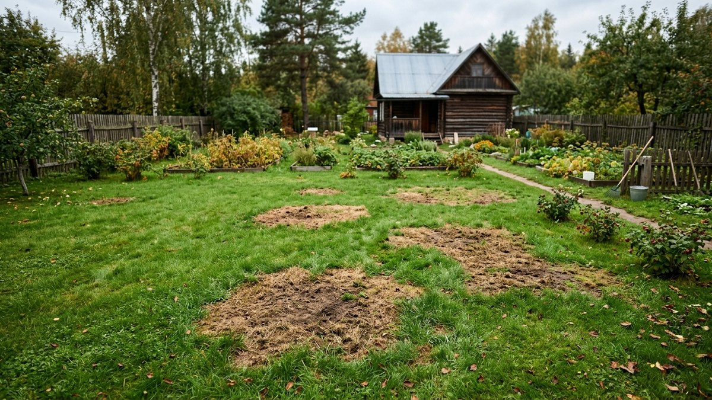
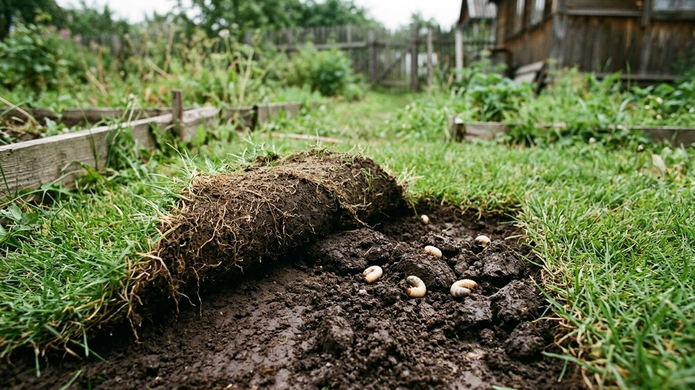
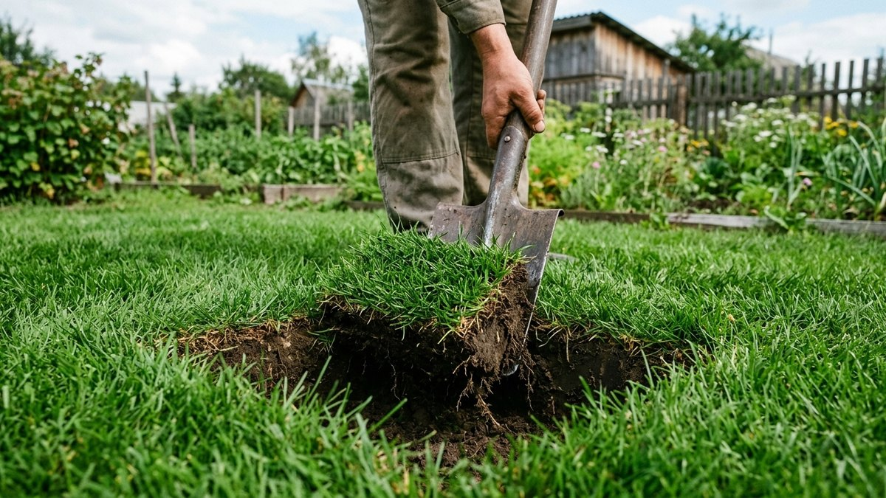
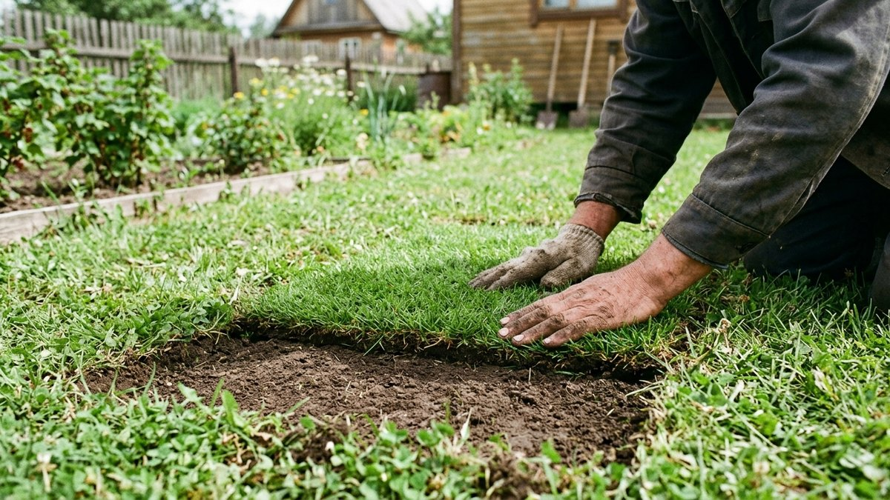
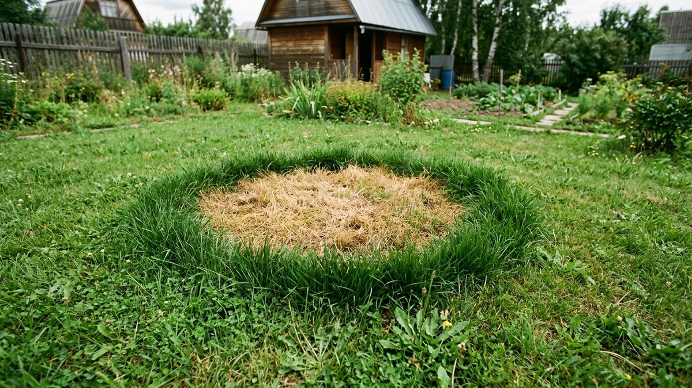
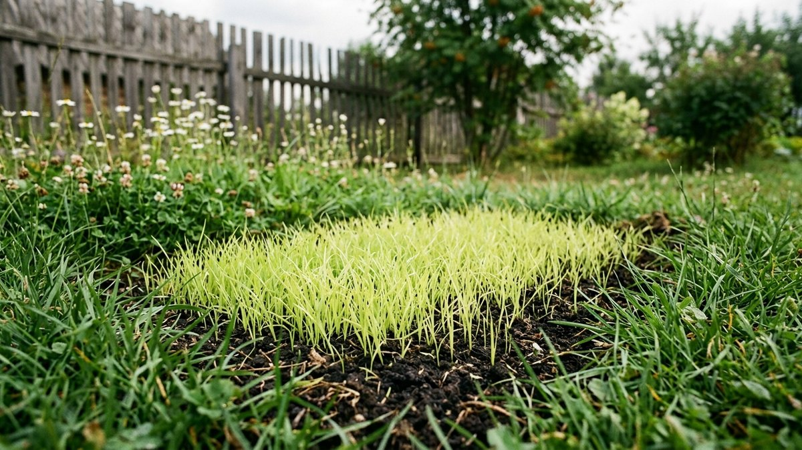

Даже ухоженный газон время от времени покрывается проплешинами: трава редеет пятнами, земля просвечивает, а зелёный ковёр выглядит рваным. Причина почти всегда в чём-то конкретном — вытоптали, залило, съели личинки хруща — и пока эту причину не устранить, подсев травы на голое место даст временный эффект. Разберём, как определить причину проплешины и заделать её так, чтобы трава не полезла снова через месяц.

## Почему на газоне появляются проплешины

- **Вытаптывание** — постоянный маршрут к калитке, качели, место для стоянки машины. Трава не успевает восстанавливаться между нагрузками.
- **Застой воды** — низина, куда стекает вода после дождя или таяния снега; корни травы задыхаются и гниют.
- **Тень** — газонная трава светолюбива, под густой кроной дерева или у забора она редеет сама по себе.
- **Вредители** — личинки майского жука и хруща подъедают корни снизу, дёрн буквально отслаивается и скатывается, как ковёр.
- **Грибковые заболевания** — бурые или ржавые пятна с чёткой границей, часто после тёплой влажной погоды.
- **Собачья моча** — характерные округлые жёлтые пятна с более тёмным зелёным кольцом по краю.

Определить причину важно до ремонта: если просто подсеять траву на вытоптанный участок у калитки, её вытопчут снова через неделю. Если по одному и тому же месту ходят регулярно — проще проложить там [садовую дорожку](https://mir-doma.pro/sadovye-dorozhki-svoimi-rukami/), чем бесконечно подсевать траву на маршрут.

## Как проверить, есть ли вредители

Возьмите лопату и подрежьте дёрн на границе проплешины с трёх сторон, отогните пласт как крышку. Если дёрн легко отделяется от земли, а под ним видны белые изогнутые личинки размером с ноготь — это личинки хруща или майского жука. В этом случае перед посевом почву проливают инсектицидом по инструкции, иначе новая трава сгниёт по той же причине.

## Пошаговый ремонт проплешины

1. **Устраните причину.** Пролейте почву от вредителей, засыпьте низину грунтом вровень с газоном, переставьте маршрут или ограничьте зону вытаптывания бордюром.
2. **Расчистите участок.** Уберите остатки мёртвой травы граблями до чистой земли, слегка взрыхлите верхний слой на 1–2 см.
3. **Выровняйте и подсыпьте грунт.** Если проплешина продавлена, подсыпьте плодородную землю или смесь земли с песком вровень с окружающим газоном.
4. **Посейте семена той же травосмеси**, что и на остальном газоне — иначе заплатка будет отличаться по цвету и структуре листа. Расход — по норме на упаковке, обычно 30–40 г/м². Если исходную смесь уже не найти, посмотрите принципы подбора травосмеси в статье [как посеять газон](https://mir-doma.pro/kak-poseyat-gazon/) — там же расписана технология посева, которая пригодится и для заплатки.
5. **Слегка заделайте семена** граблями на глубину 0,5 см и прикатайте или притопчите доской.
6. **Поливайте ежедневно** мелким распылением, не давая земле пересыхать, пока не появятся дружные всходы — обычно 10–14 дней.

## Дернование: быстрый способ для небольших пятен

Если проплешина небольшая, а рядом есть донор — часть газона у забора, где трава гуще и не жалко вырезать кусок, — можно закрыть проплешину куском дёрна вместо посева. Вырежьте дёрн лопатой по размеру проплешины плюс запас 2–3 см, уложите на выровненную землю, плотно прижмите и полейте. Дернование даёт результат за неделю против трёх недель на подсев, но подходит только для точечных повреждений размером до 30–40 см.

## Если проплешина от собачьей мочи

Пятна с тёмно-зелёным кольцом по краю — избыток азота в моче обжигает траву в центре и стимулирует рост по краям. Перед подсевом обильно пролейте пятно чистой водой несколько дней подряд, чтобы вымыть избыток соли и азота из верхнего слоя почвы, и только потом подсевайте семена по общей схеме.

Лучшее время для ремонта проплешин — весна и ранняя осень, когда почва тёплая, а конкуренции с сорняками меньше. Если проплешина появилась летом в жару, разумнее дождаться сентября: подробнее о том, как готовить газон к холодам, — в статье [уход за газоном осенью](https://mir-doma.pro/ukhod-za-gazonom-osenyu/).

## Частые ошибки

- **Сеять поверх старой отмершей травы**, не расчистив участок — семена не касаются земли и не прорастают.
- **Не устранять причину.** Подсев на низину без подсыпки грунта или на вытоптанный маршрут без ограничителя даёт временный результат.
- **Использовать другую травосмесь** — заплатка прорастает, но выглядит чужеродным пятном другого оттенка.
- **Поливать слишком редко в первые недели.** Молодые всходы на голой земле пересыхают за один жаркий день без полива.

## Частые вопросы

### Сколько времени нужно, чтобы проплешина на газоне заросла

При подсеве — 2–3 недели до заметного результата и 1–2 месяца до полного слияния с общим газоном. При дерновании эффект виден сразу, приживание занимает 7–10 дней.

### Чем лучше присыпать проплешину на газоне: землёй или песком

Лучше использовать плодородную землю или смесь земли с небольшим количеством песка для дренажа. Чистый песок обедняет верхний слой и замедляет прорастание семян.

### Можно ли исправить проплешину на газоне без пересева

Только если проплешина от временного фактора (например, лежал шланг или строительный материал) и корни травы не погибли — тогда достаточно убрать причину, разрыхлить дёрн граблями и полить, трава отрастёт сама.

### Почему подсеянная трава на проплешине не приживается

Чаще всего причина не устранена (продолжают ходить по этому месту), либо семена не заделаны в почву и высохли на поверхности, либо не хватает регулярного полива в первые две недели после посева.

### Как отличить проплешину от вредителей и от вытаптывания

Проверьте дёрн лопатой: если он легко отделяется от земли и под ним видны личинки — вредители. Если проплешина точно совпадает с маршрутом ходьбы или местом стоянки — вытаптывание.

## Заключение

Заделать проплешину на газоне несложно, но результат держится только тогда, когда сначала устранена причина — вредители, застой воды, вытаптывание или тень. После этого подсев той же травосмесью с регулярным поливом или дернование куском газона возвращают участку однородный вид за одну-три недели.
