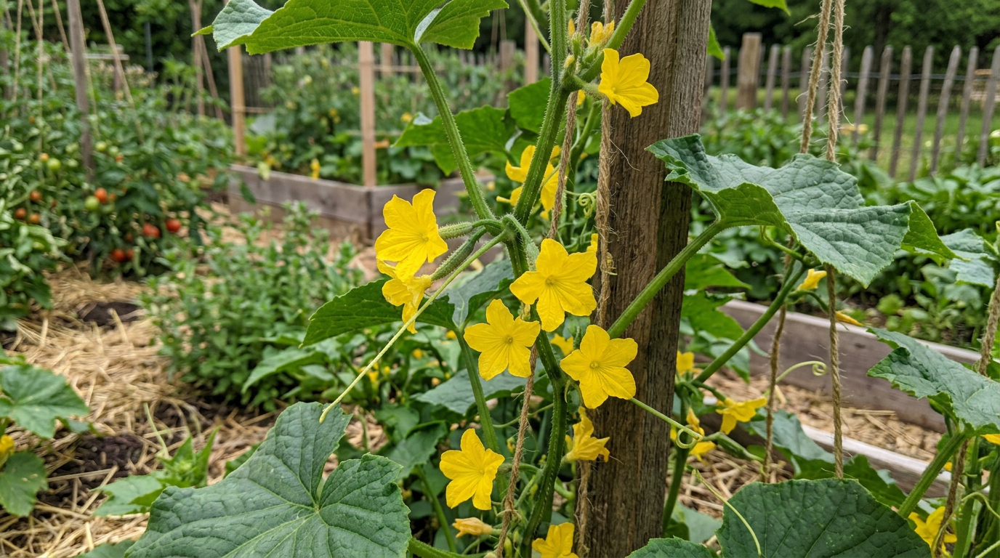
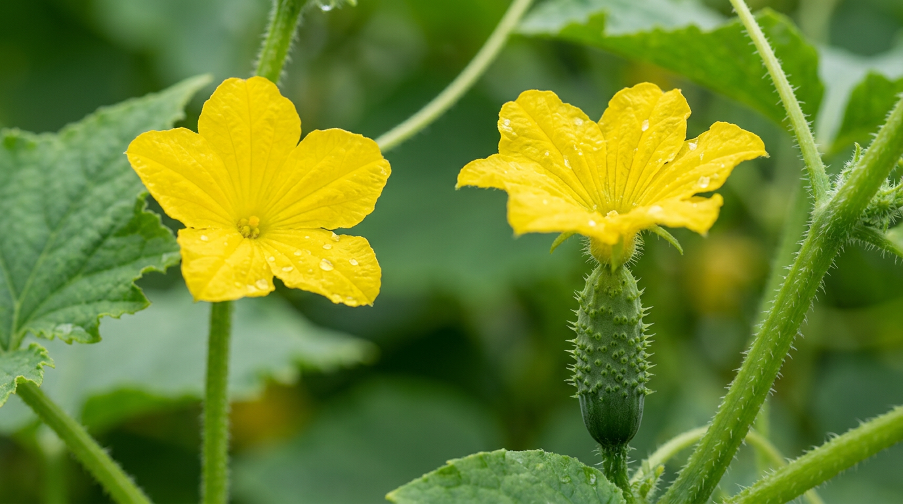
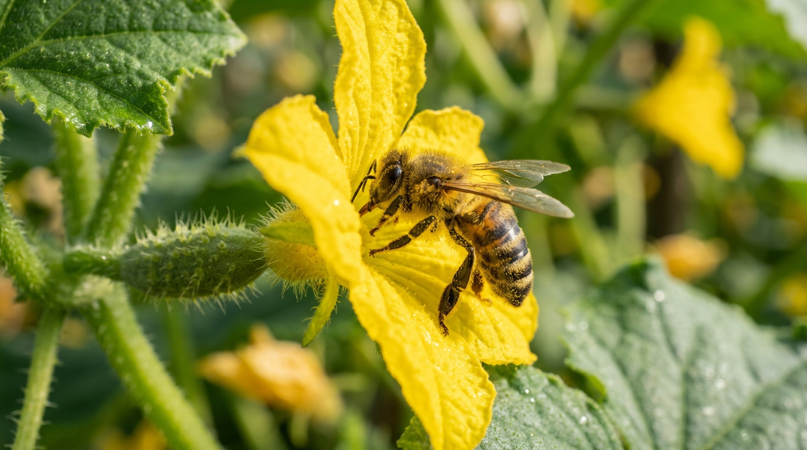
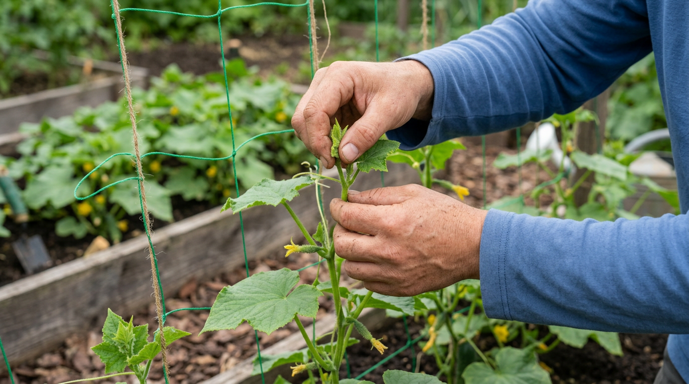
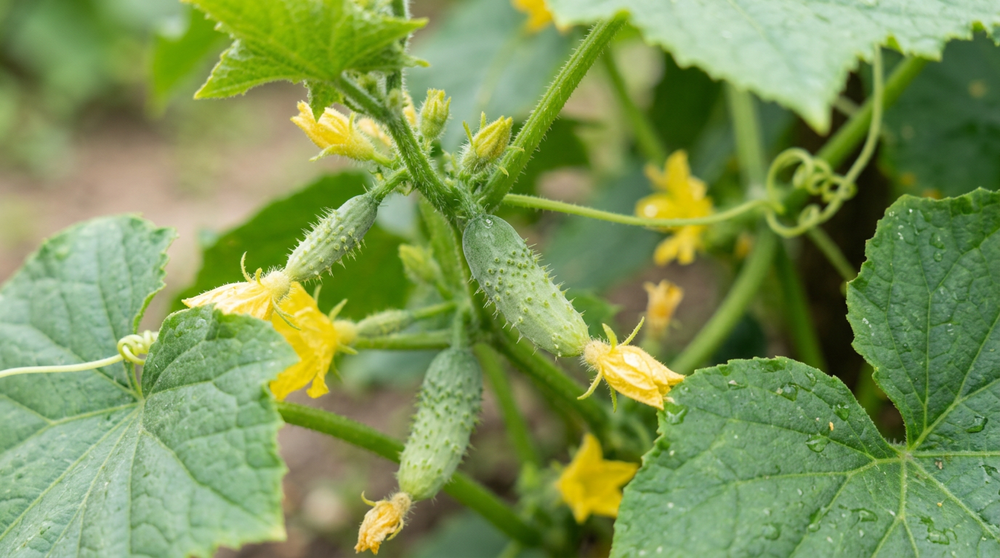
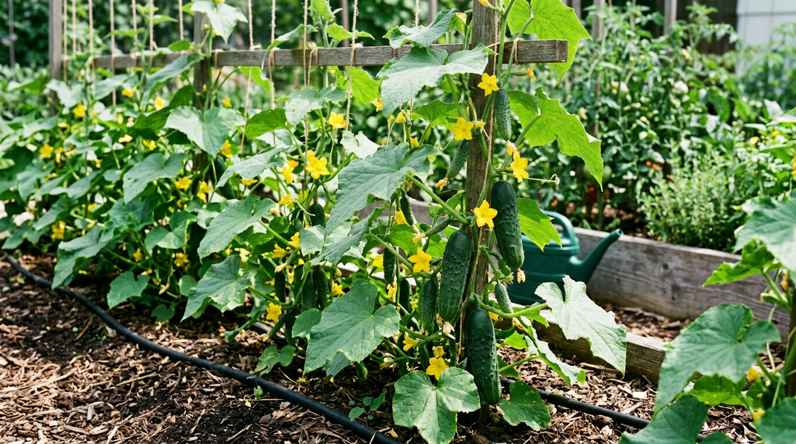

Куст огурцов весь в цвету, а огурчиков всё нет — знакомая и тревожная картина. Цветков много, но завязи не образуются, и кажется, что урожай под угрозой. Это явление называют пустоцветом, и пугаться его не стоит: чаще всего причина понятна и легко устранима. В этой статье разберём, что такое пустоцвет на огурцах, почему бывает много цветов и мало завязей, и что делать, чтобы на кустах наконец появились женские цветки и долгожданные огурцы.

## 🌼 Что такое пустоцвет

Пустоцвет — это мужские цветки огурца, которые не образуют завязи и опадают, выполнив свою задачу. И вот что важно понять сразу: **пустоцвет — это норма, а не болезнь**. Мужские цветки нужны для опыления женских, без них не было бы и огурцов. Поэтому само по себе наличие пустоцвета на кусте — естественно и правильно.

Проблема возникает только тогда, когда мужских цветков **слишком много**, а женских (тех, что дают завязи) почти нет. Вот тогда куст цветёт пышно, но огурцов не образует. Важно не паниковать и не обрывать всё подряд: сначала нужно понять, действительно ли пустоцвета слишком много, или это просто начало цветения, когда мужские цветки распускаются первыми. Разберёмся, как отличить мужские цветки от женских и почему баланс иногда нарушается.

## 🔍 Мужские и женские цветки: в чём разница

Различить их совсем несложно, и это ключ к пониманию проблемы.

- **Мужские цветки (пустоцвет)** растут пучками по несколько штук на тонкой ножке, и под цветком нет утолщения. Именно они дают пыльцу.
- **Женские цветки** сидят обычно по одному, и под цветком уже видна крошечная завязь — миниатюрный огурчик. Именно из них вырастают плоды.

Если присмотреться, отличить их легко: нет маленького огурчика под цветком — значит, это пустоцвет. Когда на кусте много пучков мужских цветков и почти нет одиночных с завязью, пора принимать меры.

## ⚠️ Когда пустоцвет — это проблема

Несколько ситуаций, когда пустоцвет нормален и волноваться не нужно:

- **В начале цветения.** Первыми на главном стебле часто распускаются именно мужские цветки — женские пойдут чуть позже и на боковых побегах. Это естественный порядок.
- **Когда женские цветки тоже есть.** Если наряду с пустоцветом образуются завязи, всё в порядке — мужские цветки просто опыляют женские.

Бить тревогу стоит, если куст уже взрослый, цветёт обильно, но **завязей почти нет, а почти все цветки — мужские**. Вот тогда ищем причину.

## 🌡️ Почему на огурцах много пустоцвета

Причин избытка мужских цветков несколько, и часто они действуют вместе.

### Особенности сорта

Это первое, на что смотрят. Пчёлоопыляемые сорта образуют и мужские, и женские цветки, и для завязей им нужны насекомые-опылители. А современные партенокарпические (самоопыляемые) гибриды F1 формируют преимущественно женские цветки и завязывают плоды без опыления — пустоцвета у них почти нет. Старые сорта и семена, собранные самостоятельно, дают больше пустоцвета. Поэтому, если проблема пустоцвета повторяется из года в год, имеет смысл просто сменить сорт — для теплицы выбрать партенокарпический самоопыляемый гибрид, и вопрос во многом снимется сам собой.

### Свежие семена

Замечено, что семена текущего года дают больше мужских цветков, а вот 2–3-летние — больше женских. Поэтому опытные огородники сеют не самые свежие семена, а полежавшие, либо предварительно прогревают свежие перед посевом.

### Жара или холод

Огурцы любят тепло, но в сильную жару (выше 30 °C) пыльца становится стерильной, а образование женских цветков нарушается. Холод (ниже 15 °C) тоже сбивает цветение и мешает опылению. Резкие перепады температур усугубляют проблему.

### Избыток азота

Перекормленный азотом куст «жирует» — гонит мощную ботву и плети, образует много мужских цветков, а женские закладывает плохо. Это очень частая причина пустоцвета, особенно когда огурцы обильно поливают настоем коровяка или травы без баланса других элементов. Куст выглядит мощным и зелёным, но плодов не даёт.

### Загущение и нехватка света

В густых, непрореженных посадках растениям не хватает света, и они образуют меньше женских цветков. Загущение — типичная ошибка, ведущая к пустоцвету.

### Нет опыления

Для пчёлоопыляемых сортов нужны насекомые. Если огурцы растут в теплице, куда не залетают пчёлы, или стоит дождливая погода, когда насекомые не летают, женские цветки не опыляются, завязи желтеют и опадают, а мужские так и осыпаются пустоцветом. Именно поэтому в теплицах так выручают партенокарпические гибриды — им опылители вообще не нужны.

### Ошибки полива

Полив холодной водой и нерегулярное увлажнение — стресс для огурцов, который тоже нарушает образование завязей. Подробнее о других проблемах с поливом — в статье о том, [почему желтеют листья у огурцов](https://mir-doma.pro/zhelteyut-listya-u-ogurtsov/).

## ✅ Что делать, чтобы пошли завязи

Если пустоцвета много, а огурцов нет, действуйте по нескольким направлениям.

1. **Прищипните главный стебель.** У пчёлоопыляемых сортов больше всего женских цветков образуется на боковых побегах. Прищипните верхушку главного стебля над 4–6-м листом — это стимулирует рост боковых плетей с женскими цветками.
2. **Сократите азот, подкормите калием и фосфором.** Прекратите азотные подкормки, дайте зольный настой или калийно-фосфорное удобрение, добавьте бор для лучшей завязи. О питании — в статье о [летних подкормках овощей](https://mir-doma.pro/letnie-podkormki-ovoshchey/).
3. **Привлеките опылителей или опылите вручную.** Опрыскайте кусты слабым сладким раствором (ложка мёда или сахара на воду), чтобы привлечь пчёл, посадите рядом цветы-медоносы. В теплице открывайте форточки и двери.
4. **Подсушите почву на пару дней.** Лёгкий «стресс» от кратковременного недостатка влаги подталкивает огурцы образовывать женские цветки — старый и рабочий приём.
5. **Наладьте температуру и полив.** Притеняйте в жару, проветривайте теплицу, поливайте только тёплой водой.
6. **Не загущайте посадки** и формируйте кусты, чтобы хватало света.

Уже через несколько дней после этих мер на кустах начинают появляться женские цветки и завязи. Действуйте в комплексе: одна только прищипка без коррекции питания и полива даст слабый результат, а вместе эти меры быстро меняют ситуацию.

## 🐝 Как опылить огурцы вручную

Если пчёл нет, а сорт пчёлоопыляемый, помогите растению сами. Делается это просто:

- сорвите распустившийся мужской цветок (пустоцвет на тонкой ножке без завязи);
- оборвите у него лепестки, оголив тычинки с пыльцой;
- аккуратно коснитесь им серединки женского цветка (с завязью-огурчиком), как бы припудривая пыльцой.

Опыляют утром, когда цветки только раскрылись и пыльца свежая. Одним мужским цветком можно опылить 2–3 женских. Через несколько дней завязь тронется в рост. Лучше всего опыление удаётся в сухую тёплую погоду; в дождь и сильную жару пыльца хуже, поэтому выбирают комфортное утро. Повторяя процедуру каждые пару дней, можно полностью заменить пчёл.

## 🛡️ Профилактика пустоцвета

Предупредить избыток пустоцвета помогут несколько правил:

- выбирайте партенокарпические гибриды F1 для теплицы, где нет пчёл, и пчёлоопыляемые — для открытого грунта;
- сейте не самые свежие семена (2–3-летние) или прогревайте свежие перед посевом;
- не перекармливайте азотом, поддерживайте баланс с калием и фосфором;
- не загущайте посадки и формируйте кусты;
- проветривайте теплицу и обеспечьте доступ опылителей;
- поливайте тёплой водой регулярно, без резких перепадов;
- притеняйте теплицу в сильную жару, чтобы пыльца не теряла всхожесть.

Соблюдая эти простые правила, вы избежите засилья пустоцвета и получите дружные завязи. А если у огурцов есть и другие проблемы — например, плоды [горчат](https://mir-doma.pro/pochemu-ogurtsy-gorchat/) или на листьях появилась [мучнистая роса](https://mir-doma.pro/muchnistaya-rosa-na-ogurtsah/), — загляните в наши статьи о них.

## ❓ Частые вопросы

### Почему на огурцах одни пустоцветы и нет завязей?

Чаще всего из-за избытка азота, жары или холода, загущения, отсутствия опылителей в теплице или особенностей сорта. Перекормленный азотом куст гонит мужские цветки, а в жару и без пчёл женские не опыляются. Нужно сократить азот, наладить условия и при необходимости опылить вручную.

### Пустоцвет на огурцах — это плохо?

Нет, сам по себе пустоцвет — это нормальные мужские цветки, нужные для опыления. Проблема только в том, если их слишком много, а женских цветков с завязью почти нет. Тогда ищут причину и помогают кусту образовать женские цветки.

### Как отличить мужской цветок от женского у огурца?

У женского цветка под лепестками есть маленькая завязь — крошечный огурчик, и растут они обычно по одному. Мужские цветки (пустоцвет) сидят пучками на тонкой ножке, и завязи под ними нет. Нет огурчика под цветком — значит, это пустоцвет.

### Нужно ли обрывать пустоцвет на огурцах?

Специально обрывать все мужские цветки не нужно — они нужны для опыления женских и сами опадают. Удаляют их только частично у сильно «жирующих» кустов. А вот прищипка верхушки главного стебля помогает стимулировать женские цветки гораздо эффективнее.

### Как заставить огурцы образовать женские цветки?

Прищипните верхушку главного стебля, сократите азот и подкормите калием и фосфором, подсушите почву на пару дней, наладьте температуру и тёплый полив, проветривайте теплицу. Эти меры стимулируют образование женских цветков и завязей.

### Помогает ли прищипка от пустоцвета?

Да, для пчёлоопыляемых сортов это один из самых действенных приёмов. Женские цветки у них образуются в основном на боковых побегах, поэтому прищипка верхушки главного стебля над 4–6-м листом стимулирует рост боковых плетей с завязями. Для партенокарпических гибридов прищипка делается иначе, по схеме формирования.

### Завязи желтеют и опадают — это тоже из-за пустоцвета?

Не совсем. Опадение уже образовавшихся завязей чаще связано с отсутствием опыления (у пчёлоопыляемых сортов), перегрузкой куста, нехваткой питания или резкими перепадами условий. Помогают опыление, нормирование завязей, подкормка и стабильный уход.

### Почему пустоцвет в теплице?

В теплице частые причины — перегрев, духота, избыток азота и, главное, отсутствие пчёл для опыления пчёлоопыляемых сортов. Решение — проветривать теплицу, не перекармливать азотом, опылять вручную или выбирать партенокарпические самоопыляемые гибриды.

## Заключение

Пустоцвет на огурцах — это не болезнь, а естественные мужские цветки, и пугаться его не стоит. Бить тревогу нужно, лишь когда их слишком много, а завязей нет. Чаще всего виноваты избыток азота, жара, загущение или отсутствие опыления. Прищипните главный стебель, сократите азот в пользу калия и фосфора, наладьте полив и температуру, обеспечьте опыление — и на кустах пойдут женские цветки, а за ними и долгожданные огурцы. А правильный выбор сорта и грамотный уход и вовсе избавят от проблемы пустоцвета. Запомните главное: пустоцвет — спутник огурца, а не враг; задача не избавиться от мужских цветков, а помочь кусту образовать побольше женских.

А вы сталкивались с пустоцветом на огурцах и что помогло? Делитесь опытом в комментариях и подписывайтесь, чтобы не пропустить новые статьи об уходе за огородом.
