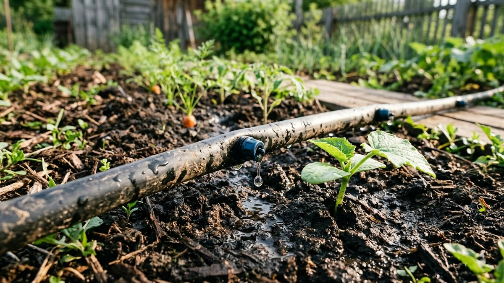
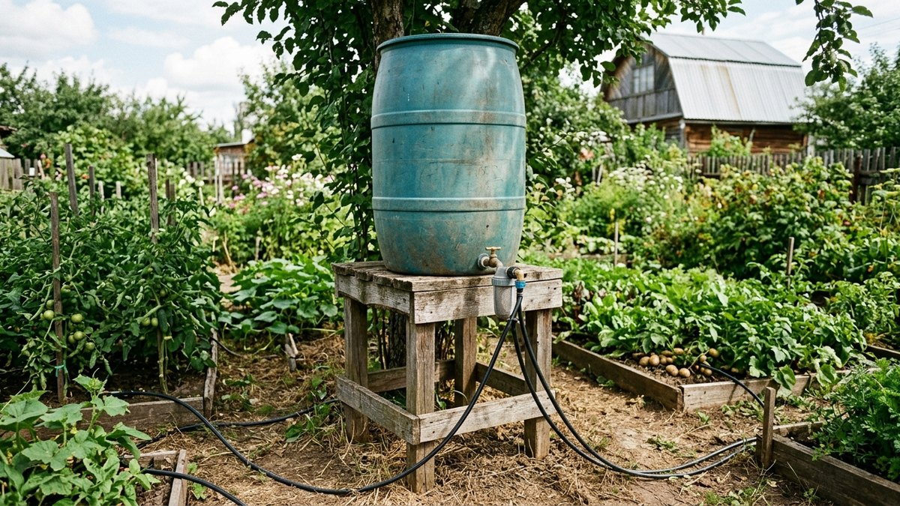
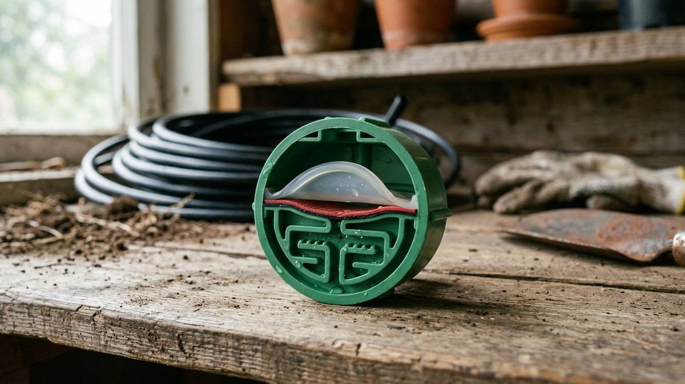
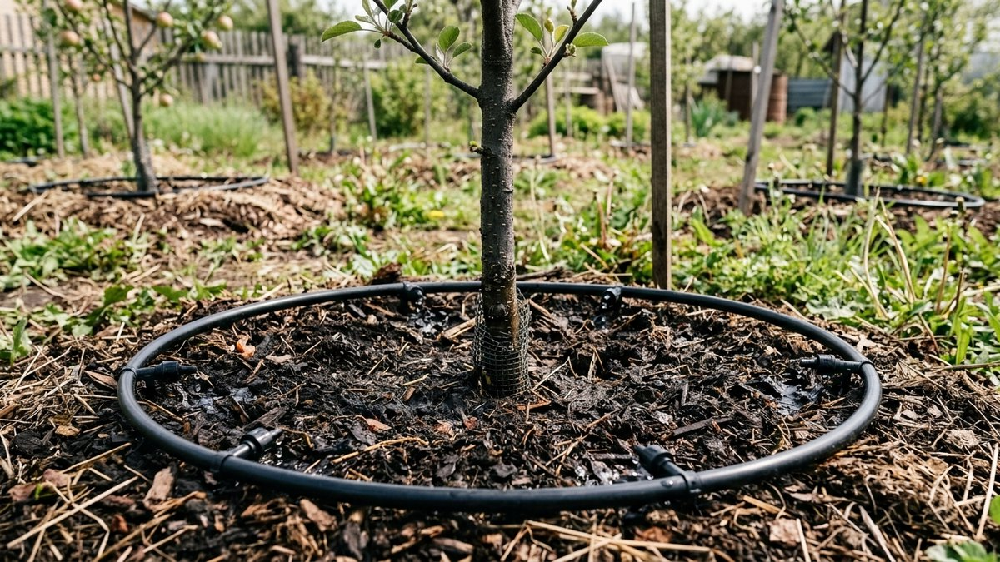
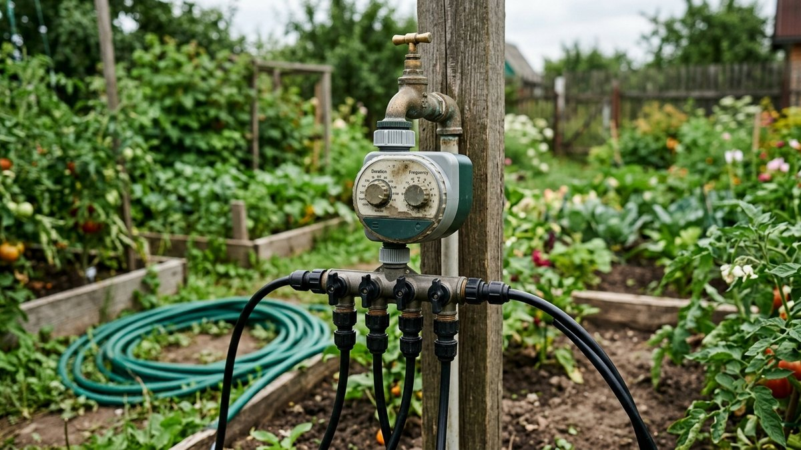
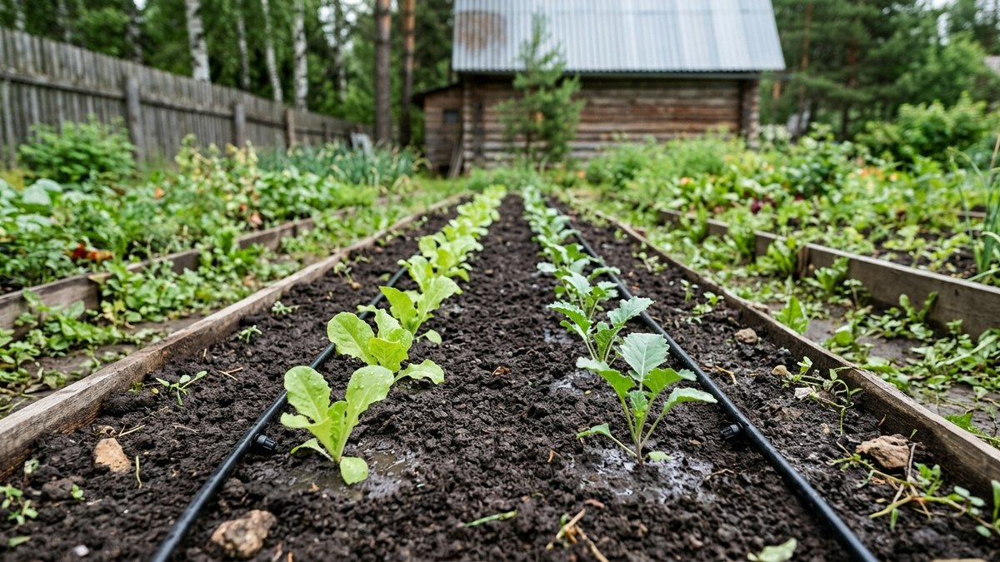

Систему [капельного полива](https://mir-doma.pro/kapelnyy-poliv-svoimi-rukami/) чаще всего собирают на глаз: берут ленту, втыкают эмиттеры «на вид» и потом удивляются, почему часть грядки сохнет, а у входа в линию капает через край. Число капельниц и их расход — не мелочь для украшения схемы, а параметр, от которого зависит давление в системе и то, доживёт ли вода до последнего куста. Разберём, как посчитать количество капельниц по шагу посадки и подобрать их расход под конкретный источник воды.

## Сколько капельниц нужно на грядку

Отправная точка расчёта — не площадь, а шаг между растениями. Капельница ставится к каждому растению или к паре растений в ряду, если посадка загущённая.

- Томаты, перцы, баклажаны в открытом грунте: шаг 30–40 см — капельница на каждый куст.
- Огурцы, кабачки на шпалере: шаг 40–50 см.
- Клубника: шаг 25–30 см, капельница на куст.
- Плодовые кустарники (смородина, крыжовник): 1–2 капельницы на куст по проекции кроны.
- Деревья: 2–4 капельницы по кругу приствольного круга, на расстоянии 40–60 см от ствола.

Формула простая: число капельниц = длина ряда ÷ шаг посадки, плюс одна капельница на конец линии. Для грядки 10 м с томатами при шаге 35 см это 10 / 0,35 ≈ 29 капельниц на один ряд.

## Расход и давление: почему нельзя брать капельницы наугад

Каждая капельница отдаёт фиксированный объём воды в час — обычно 1, 2, 4 или 8 л/ч, это указано на корпусе или в маркировке ленты. Суммарный расход всех капельниц в линии не должен превышать то, что способен дать источник — кран, насос или редуктор на водопроводе.

Расчёт: расход линии = число капельниц × расход одной капельницы. Если у крана на даче реальная производительность 600 л/ч, а линия из 40 капельниц по 4 л/ч потребует 160 л/ч — это укладывается с запасом. Но если таких линий пять параллельно, суммарный расход (800 л/ч) уже превысит возможности крана, и дальние капельницы начнут капать слабее ближних.

Если полив идёт от бочки самотёком, важно давление: на 1 м высоты бочки над грядкой приходится примерно 0,1 бар. Для капельниц без компенсации давления (см. ниже) этого может не хватить на линии длиннее 15–20 м — вода будет литься активнее у начала и еле капать в конце.

## Компенсированные и некомпенсированные капельницы

| Тип | Как работает | Когда ставить |
|---|---|---|
| Некомпенсированные | Расход зависит от давления в точке — чем дальше от источника, тем слабее струя | Короткие линии до 15 м, ровный рельеф, полив от водопровода со стабильным давлением |
| Компенсированные | Внутри мембрана выравнивает расход независимо от давления в разумных пределах | Длинные линии, полив самотёком от бочки, участок с уклоном |

Компенсированные капельницы дороже на 30–50%, но на грядке длиннее 15–20 м или при поливе от бочки это не роскошь, а единственный способ получить равномерный полив по всей длине линии.

## Пример расчёта на конкретных площадях

**Теплица 3×6 м, два ряда томатов по 6 м.** Шаг 35 см → 6 / 0,35 ≈ 17 капельниц на ряд, итого 34 капельницы. При расходе 2 л/ч это 68 л/ч на весь [полив в теплице](https://mir-doma.pro/avtopoliv-dlya-teplitsy-svoimi-rukami/) — умещается в производительность любого стандартного крана.

**Грядка клубники 1×10 м.** Шаг 25 см в два ряда → 10 / 0,25 × 2 ≈ 80 капельниц. При расходе 1 л/ч (клубника не любит переувлажнения) — 80 л/ч.

**Плодовый сад, 6 яблонь по кругу приствольного круга.** 3 капельницы по 4 л/ч на дерево = 18 капельниц, 72 л/ч на весь ряд деревьев.

Если суммарный расход по всем линиям участка выходит за производительность источника — водопровода, [скважины](https://mir-doma.pro/domik-dlya-skvazhiny-na-dache/) или бочки, — линии разбивают на группы и поливают их не одновременно, а по очереди через таймер или вручную.

## Частые ошибки

- **Считать капельницы по площади, а не по шагу посадки.** «Одна капельница на квадратный метр» не работает — корневая система у растений разная, и часть грядки останется сухой.
- **Смешивать в одной линии капельницы с разным расходом.** Давление в линии одно, а капельницы с расходом 8 л/ч рядом с капельницами на 2 л/ч разбалансируют весь полив.
- **Не закладывать запас по производительности источника.** Если считать впритык, любое падение давления в водопроводе оставит дальние капельницы без воды.
- **Игнорировать компенсацию давления на длинных линиях.** На грядке длиннее 15–20 м без компенсированных капельниц разница в поливе между началом и концом линии будет заметна визуально уже через 2–3 недели.

## Частые вопросы

### Сколько капельниц нужно на один куст томата

Обычно одна капельница на куст при шаге посадки 30–40 см. Для крупных кустов в теплице с обильным поливом иногда ставят две капельницы по краям приствольного круга.

### Какой расход капельниц выбрать для огорода

Для овощных грядок в открытом грунте чаще берут капельницы на 2–4 л/ч — этого достаточно для большинства культур без переувлажнения. Для клубники и рассады — 1–2 л/ч, для деревьев и кустарников — 4–8 л/ч.

### Можно ли ставить капельницы с разным расходом в одну линию

Не рекомендуется: расход в линии рассчитывается на однородные капельницы. Если нужен разный полив для разных культур, для них разводят отдельные линии от одного распределителя.

### Как понять, что капельниц слишком много для источника воды

Если давление в линии заметно падает к концу — дальние капельницы капают слабее или не капают вовсе — суммарный расход превышает производительность источника. Нужно либо сократить число капельниц в линии, либо разбить полив на группы с поочерёдным включением.

### Нужен ли расчёт капельниц, если участок небольшой

Даже на 2–3 грядках расчёт экономит время: без него легко купить капельниц больше или меньше, чем нужно, и потом докупать или переделывать линию.

## Заключение

Расчёт количества капельниц строится на двух цифрах: сколько капельниц нужно по шагу посадки и какой суммарный расход выдержит источник воды. Если обе цифры сходятся с запасом 20–30%, система будет поливать ровно от первого куста до последнего — без досыпки капельниц на глаз и без сухих пятен на грядке.
