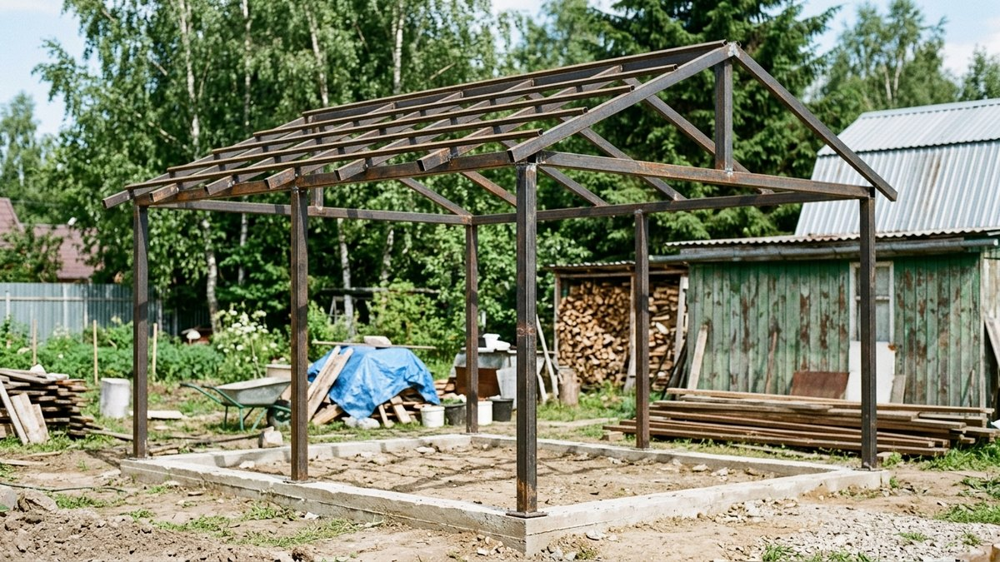
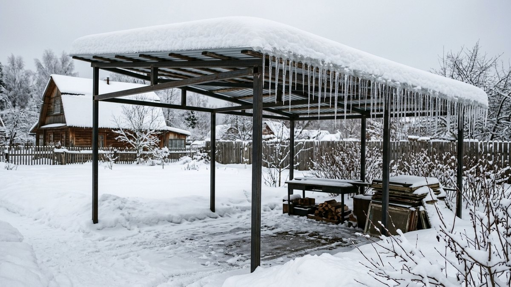
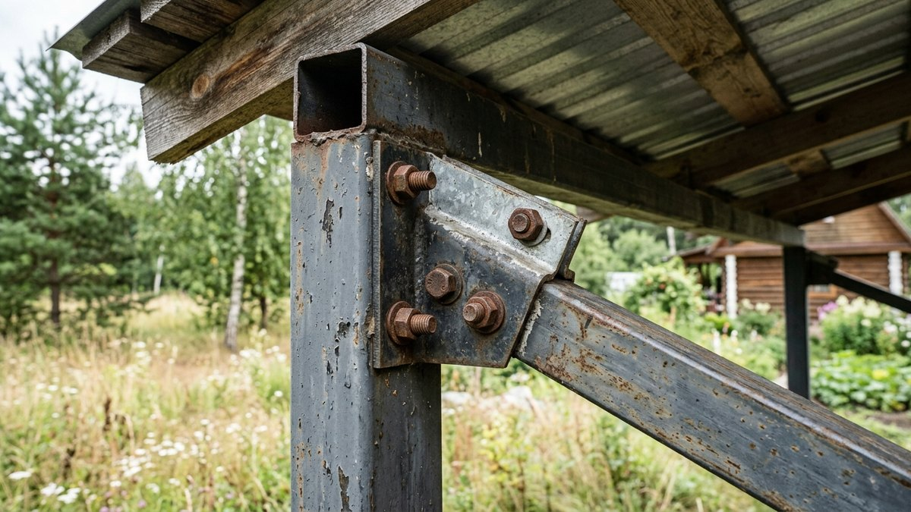
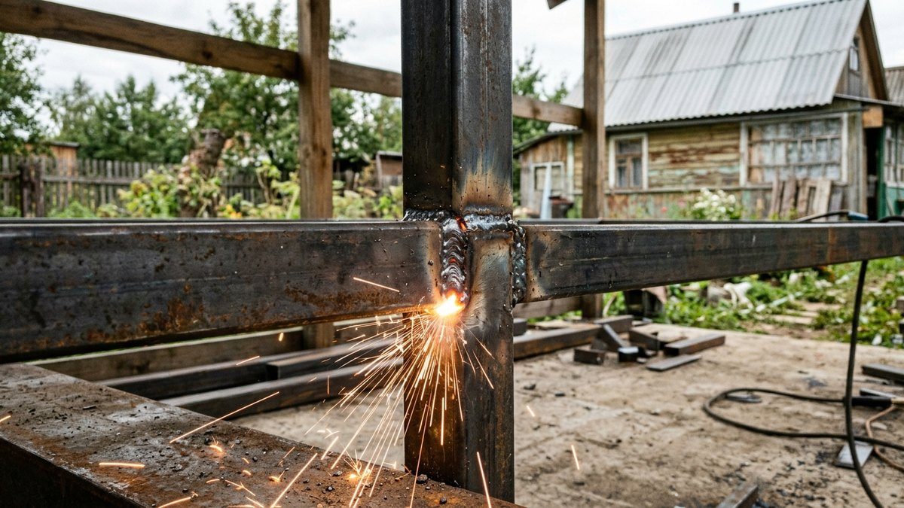
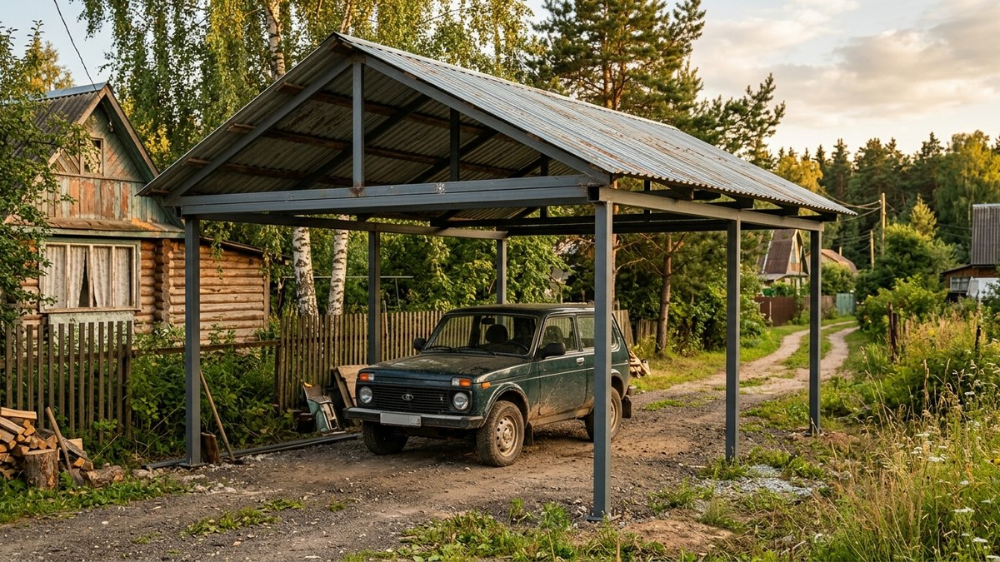
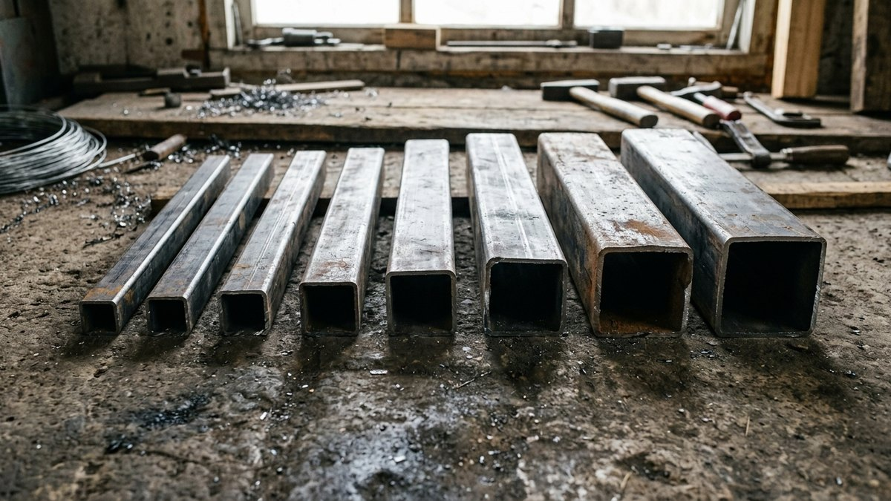

# Расчёт навеса из профильной трубы: сечение, шаг стоек и снеговая нагрузка

Онлайн-калькуляторы для расчёта навеса выдают сечение трубы по паре
введённых цифр, но не показывают, откуда взялось число — а без этого
невозможно проверить результат под свой регион и свою кровлю. Разберём
расчёт по шагам: какая снеговая нагрузка у вашего района, какое сечение
трубы нужно для стоек и стропил, какой шаг ставить между опорами. В конце —
пример расчёта конкретного навеса 4×6 м, который можно повторить со своими
цифрами.

## Что вообще входит в расчёт навеса

Три величины определяют сечение трубы и шаг опор:

- **Пролёт** — расстояние между рядами стоек поперёк навеса. Чем больше
  пролёт, тем толще должна быть труба стропильной фермы — она работает как
  балка, и прогиб растёт нелинейно с увеличением пролёта.
- **Снеговая нагрузка** — вес снегового покрова на кровлю, зависит от
  снегового района и угла ската. Для навеса это обычно главная нагрузка:
  ветровая парусность у открытой конструкции без стен намного меньше, чем у
  дома, а вот снег на крыше давит одинаково что на дом, что на навес.
- **Материал кровли** — профнастил и поликарбонат лёгкие (до 5–6 кг/м²),
  металлочерепица и тем более мягкая кровля с обрешёткой добавляют
  ощутимый вес к нагрузке на стропила ещё до снега.

Форма крыши — одно- или двускатная — тоже влияет на расчёт, но по-своему:
она меняет схему распределения снега по кровле и парусность конструкции.
Это отдельная тема, разобрана в статье [какую крышу навеса выбрать:
одно- или двускатную](https://mir-doma.pro/odnoskatnyy-ili-dvuskatnyy-naves/) —
здесь считаем сечение трубы, форму крыши для расчёта ниже берём как
исходный параметр.

## Снеговая нагрузка: как узнать свой район

Территория России по СНиП/СП 20.13330 «Нагрузки и воздействия» разделена
на снеговые районы с нормативным весом снегового покрова на 1 м²
горизонтальной проекции кровли:

| Снеговой район | Вес снегового покрова |
|---|---|
| I | 80 кг/м² |
| II | 120 кг/м² |
| III | 180 кг/м² |
| IV | 240 кг/м² |
| V | 320 кг/м² |
| VI | 400 кг/м² |

Средняя полоса России (Подмосковье, большая часть Центрального округа) —
чаще всего III район, юг — I–II, Урал и Сибирь — IV и выше. Точный номер
района для своего населённого пункта проще всего уточнить в местной
проектной организации или по карте района в приложении к СП 20.13330 —
цифры в таблице справочные, для реальной стройки в снежном регионе сверьте
район по официальному источнику, а не только по этой таблице.

Расчётная нагрузка на кровлю меньше табличного веса снегового покрова,
если скат достаточно крутой — снег с него частично сходит сам. Но у
навесов уклон обычно небольшой (10–25°), и на таких углах нормативный
коэффициент близок к 1 — то есть скидку на уклон закладывать не стоит,
разница в пределах погрешности расчёта.

## Сечение трубы для стоек

Стойки — вертикальные опоры навеса — работают на сжатие и на изгиб от
ветровой нагрузки сбоку. Ниже — ориентировочные сечения профильной трубы
(квадратной, толщина стенки 2 мм) для бытовых навесов высотой до 2,5–3 м:

| Тип навеса | Снеговой район | Сечение стойки |
|---|---|---|
| Лёгкий (крыльцо, велосипед, до 2 м ширины) | I–III | 40×40 мм |
| Средний (одна машина, пролёт до 3,5–4 м) | I–III | 60×60 мм |
| Средний (одна машина, пролёт до 3,5–4 м) | IV–V | 60×60 мм, стенка 3 мм |
| Большой (две машины, пролёт 5–6 м) | I–III | 80×80 мм |
| Большой (две машины, пролёт 5–6 м) | IV–V | 80×80 мм, стенка 3–4 мм, шаг стоек сократить |

Для навесов с пролётом больше 6 м, снеговым районом V и выше или тяжёлой
кровлей (металлочерепица, мягкая кровля по сплошной обрешётке) таблица уже
не даёт достаточного запаса — нужен расчёт инженера-конструктора, а не
ориентир по общей таблице.

## Сечение стропил и шаг опор

Стропила (или ферма) навеса — то, что несёт кровлю между стойками, —
обычно делают из трубы меньшего сечения, чем стойки: 40×20 или 40×40 мм
для лёгкой и средней нагрузки, 60×30–60×40 мм для больших пролётов и
высоких снеговых районов.

- **Шаг стоек** (расстояние между рядами опор вдоль навеса) — 2,5–3 м для
  профнастила и металлочерепицы. Больший шаг требует увеличения сечения
  стропильной фермы, а не наоборот — экономить на трубе за счёт
  увеличения шага не получится.
- **Шаг стропил** (расстояние между отдельными стропильными трубами
  поперёк ската) — 0,6–1 м под профнастил, 0,3–0,5 м под мягкую кровлю,
  которой нужна сплошная или почти сплошная обрешётка. Чем чаще стропила,
  тем меньше сечение можно допустить у самих стропил — это тот же принцип,
  что и в расчёте [водостока по площади ската](https://mir-doma.pro/vodostok-svoimi-rukami/):
  нагрузка распределяется на большее число опорных точек.

Материал кровли для навеса и правила монтажа — в статье [крыша из
профнастила своими руками](https://mir-doma.pro/krysha-iz-profnastila-svoimi-rukami/),
там же — про нахлёст и крепёж, которые тоже входят в приёмку конструкции.

## Пример расчёта: навес 4×6 м

Исходные данные: навес для одной машины, пролёт 4 м, длина ската 6 м,
снеговой район III (180 кг/м²), кровля — профнастил, односкатная крыша с
уклоном 15°.

1. **Снеговая нагрузка**: район III, уклон 15° меньше порога, с которого
   даётся скидка на сход снега — берём полную нормативную нагрузку 180 кг/м².
2. **Стойки**: пролёт 4 м попадает в диапазон «средний навес», район III —
   сечение 60×60 мм, стенка 2 мм.
3. **Количество стоек**: по 2 ряда вдоль длинной стороны (6 м), в каждом
   ряду — стойки по краям и одна посередине, чтобы шаг между ними не
   превышал 3 м (6 м ÷ 2 пролёта по 3 м) — итого 6 стоек.
4. **Стропильные фермы**: сечение 40×40 мм, устанавливаются по стойкам
   поперёк ската с шагом, равным шагу стоек, — 3 м.
5. **Обрешётка под профнастил**: шаг 0,6–0,8 м вдоль стропил, доска или
   труба меньшего сечения (20×20–25×25 мм) — держит только вес кровельного
   листа и снега между стропилами, отдельно от несущего каркаса.

Итог: 6 стоек 60×60×2 мм, стропильные фермы из трубы 40×40 мм по 4 м
(с запасом на крепление к стойкам), обрешётка под профнастил с шагом
0,6–0,8 м. Это ориентир для согласования с продавцом металлопроката —
финальную спецификацию сваривает или проверяет тот, кто монтирует каркас.

## Частые ошибки

- **Считать только пролёт, забыв про снеговой район.** Одинаковый по
  размеру навес в Краснодаре и в Кирове требует разного сечения трубы —
  разница в нормативной снеговой нагрузке между районами достигает
  трёх-четырёх раз.
- **Экономить на толщине стенки трубы, а не на её сечении.** Труба
  60×60×1,5 мм заметно слабее, чем 60×60×2 мм, при почти той же цене —
  экономия на стенке съедает запас прочности быстрее, чем кажется по
  разнице в цене металла.
- **Увеличивать шаг стоек без пересчёта сечения фермы.** Каждый лишний
  метр шага заметно увеличивает изгибающий момент на стропильной трубе —
  сечение, которое держало навес с шагом 2,5 м, может не выдержать шаг 4 м.
- **Не закладывать снегозадержатели или уклон для схода снега.** На
  навесах с почти плоской кровлей (уклон меньше 10°) снег не сходит сам и
  копится всю зиму — расчётная нагрузка в таком случае должна быть полной,
  без всяких скидок на уклон.

## Частые вопросы

### Какая труба нужна для навеса 3×6 м

Для одностоечного ряда с пролётом 3 м и стандартной снеговой нагрузкой
(район I–III) обычно достаточно стоек 60×60 мм и стропильных ферм
40×40 мм — тот же порядок, что и в примере с навесом 4×6 м, но с чуть
меньшим запасом по сечению стоек за счёт меньшего пролёта.

### Сколько стоек нужно на навес 4×6 м

При шаге стоек 2,5–3 м на навес 4×6 м нужно 6 стоек: по 3 в каждом из
двух рядов вдоль длинной стороны. Если пролёт по ширине больше 4,5 м,
добавляется промежуточный ряд стоек посередине.

### Какой шаг между стойками навеса из профильной трубы

2,5–3 м для обычного навеса под профнастил или металлочерепицу. Больший
шаг возможен только при увеличении сечения стропильной фермы —
самостоятельно увеличивать шаг без пересчёта сечения не стоит.

### Нужен ли расчёт для небольшого навеса над крыльцом

Для лёгкого навеса шириной до 2 м, без снеговых мешков и без выхода на
край крыши дома, обычно достаточно ориентировочного сечения из таблицы
выше (40×40 мм). Полноценный инженерный расчёт нужен для навесов с
пролётом больше 6 м или в районах со снеговой нагрузкой от IV и выше.

### Чем отличается расчёт навеса от расчёта беседки

Беседка обычно имеет более сложную кровлю (вальмовую, шатровую) и часто
стены, которые меняют ветровую нагрузку на конструкцию. У навеса кровля
проще, а стен нет — поэтому в расчёте навеса снеговая нагрузка играет
большую роль, а ветровая парусность меньшую, чем у закрытой постройки.

## Заключение

Расчёт навеса из профильной трубы держится на трёх цифрах: пролёте,
снеговом районе и весе кровельного материала. Таблицы сечений выше
закрывают типовые бытовые навесы — для машины, крыльца, зоны отдыха.
За пределами типовых размеров (пролёт больше 6 м, снеговой район V и
выше, тяжёлая кровля) экономнее один раз заплатить за расчёт инженеру,
чем переваривать погнутый каркас после первой снежной зимы.
