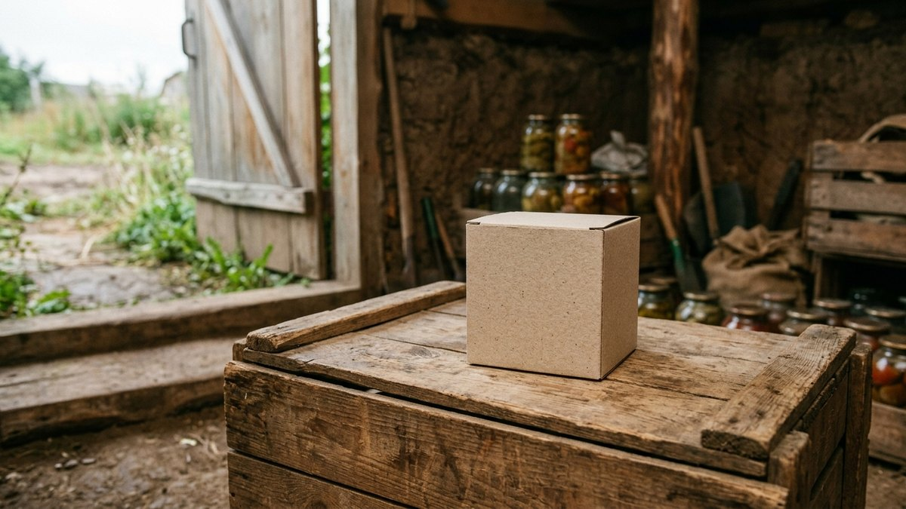
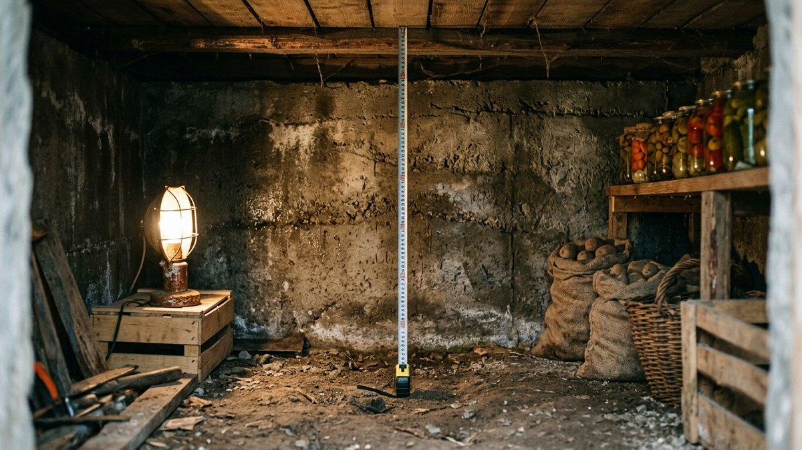
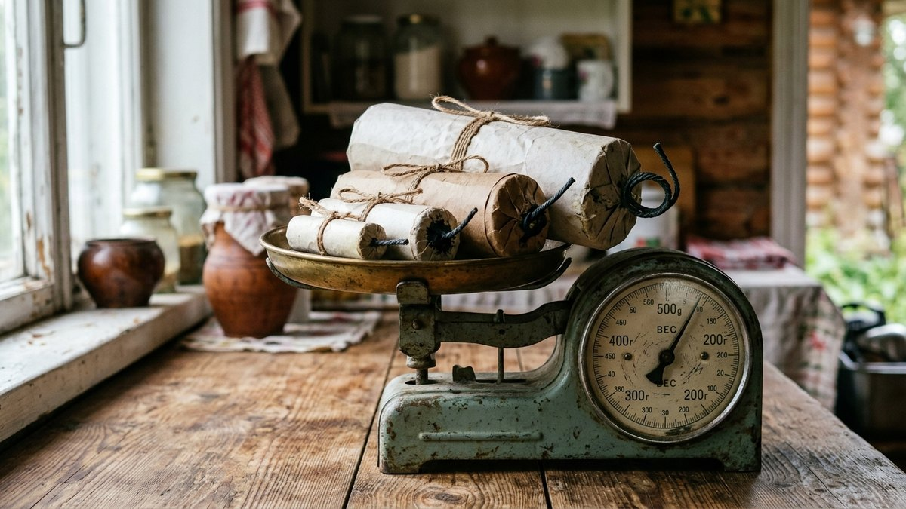
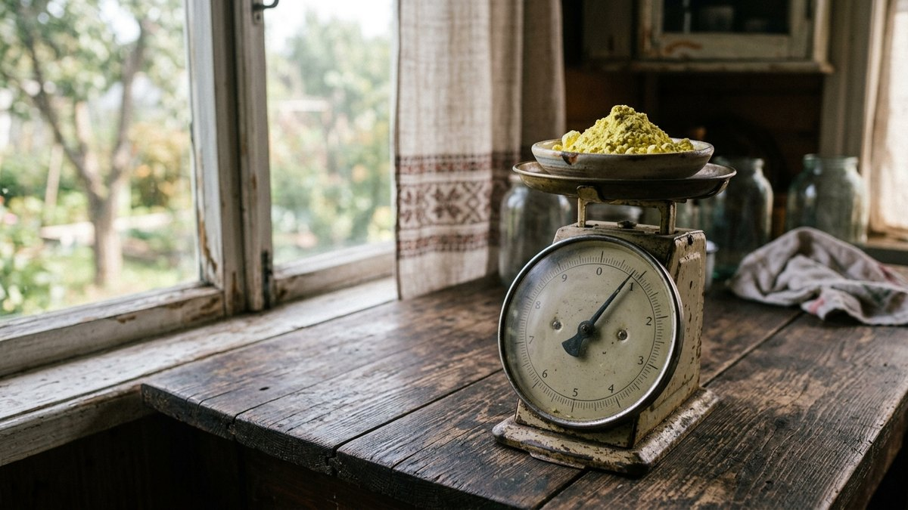
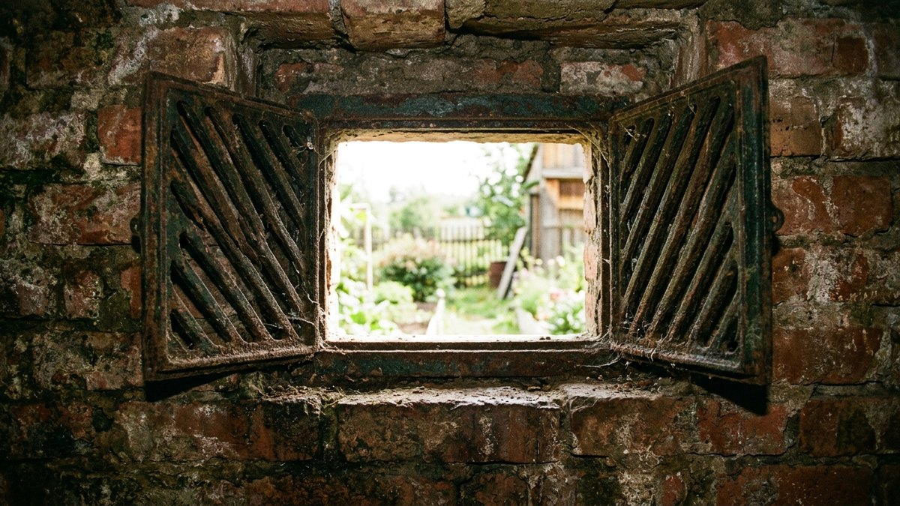
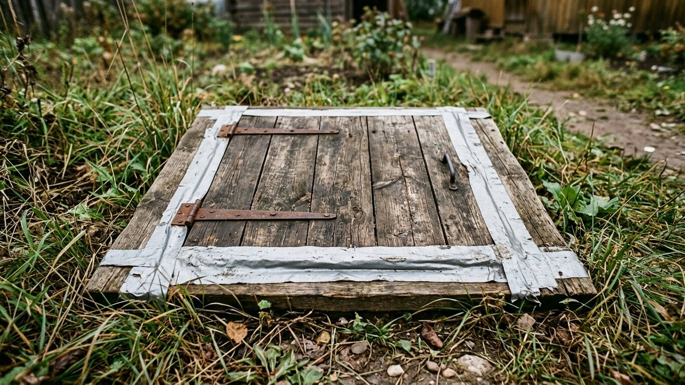

# Серная шашка для погреба: сколько нужно на объём

Купить одну серную шашку «на глаз» — частая ошибка: расход серы считается
на кубометр помещения, а не на площадь пола, и погреб с высоким потолком или
приямком легко «съедает» шашку, рассчитанную на вдвое меньший объём. Полный
протокол безопасности при окуривании — отдельная большая тема, она подробно
разобрана в статье [как обработать погреб осенью](https://mir-doma.pro/obrabotka-pogreba-osenyu/).
Здесь — только то, что нужно решить до похода в магазин: как посчитать объём
погреба, сколько серы взять на этот объём и какой формат шашки выбрать.

## Как посчитать объём погреба

Формула простая: длина × ширина × высота в метрах. Погреб редко бывает
идеальным параллелепипедом — если есть приямок, ниша под лестницей или
скошенный потолок, считайте по самой высокой точке: газ должен заполнить
весь объём, включая верхнюю часть, куда серный ангидрид поднимается хуже
всего.

Пример: погреб 2×2 м с высотой потолка 2 м — это 8 м³. Погреб под всем домом
5×4 м с той же высотой — уже 40 м³, и здесь одной стандартной шашки точно не
хватит.

Если погреба ещё нет, тот же объём определяет и смету на строительство —
калькулятор по материалу стен есть в статье [погреб своими руками: сколько
стоит построить](https://mir-doma.pro/stroitelstvo-pogreba-smeta/).

## Норма расхода: сколько серы на м³

Расход считается в граммах серы на кубометр помещения, а не в штуках
шашек — у разных производителей вес одной шашки отличается:

- **Профилактическая обработка** (регулярная, без явных признаков грибка и
  плесени) — 50–60 г серы на м³.
- **Усиленная обработка** (явный грибок, плесень, затхлый запах, погреб
  давно не обрабатывался) — 100–150 г серы на м³.

Всегда ориентируйтесь на дозировку, указанную производителем на упаковке
конкретной шашки — нормы отличаются в зависимости от состава добавок.

## Сравнение форматов серных шашек

| Формат | Вес | Объём по норме 50 г/м³ | Особенности |
|---|---|---|---|
| Малая шашка | 100 г | около 2 м³ | Для кладовой, небольшой ямы или в комплекте из нескольких штук |
| Средняя шашка | 300 г | около 6 м³ | Самый ходовой формат для дачного погреба |
| Крупная шашка или брикет | 500 г и больше | от 10 м³ | Для погребов под домом и больших гаражных ям |
| Комплект из нескольких малых | 100 г × N | складывается по числу | Удобно, когда объём не кратен одному формату |

Производители часто пишут на упаковке больший объём, чем даёт общая
норма: состав шашек разный, и в одних серы больше, чем в других. Если
на упаковке указан объём для вашей задачи (профилактика или борьба с
плесенью), ориентируйтесь на него. Если не указан — считайте по норме.

## Калькулятор серных шашек

Введите размеры погреба и вес шашки, которую нашли в магазине. Калькулятор
посчитает объём, нужное количество серы по норме и число шашек. Если на
упаковке указан объём, на который рассчитана одна шашка, впишите его:
калькулятор покажет и расчёт производителя. Если два расчёта расходятся,
ориентируйтесь на упаковку. Состав шашек разный, и производитель знает
свою дозировку лучше общей нормы.

<!-- wp:html -->

  
Сколько серных шашек нужно на погреб

  <label class="md-calc__label" for="mdSsL">Длина погреба, м</label>
  <input type="number" id="mdSsL" class="md-calc__input" min="0.5" step="0.1" value="2">
  <label class="md-calc__label" for="mdSsW">Ширина погреба, м</label>
  <input type="number" id="mdSsW" class="md-calc__input" min="0.5" step="0.1" value="2">
  <label class="md-calc__label" for="mdSsH">Высота до самой высокой точки потолка, м</label>
  <input type="number" id="mdSsH" class="md-calc__input" min="0.5" step="0.1" value="2">
  <label class="md-calc__label" for="mdSsX">Приямок, ниша, лаз — дополнительный объём, м³</label>
  <input type="number" id="mdSsX" class="md-calc__input" min="0" step="0.1" value="0">
  <label class="md-calc__label" for="mdSsM">Обработка</label>
  <select id="mdSsM" class="md-calc__input">
    <option value="p" selected>Профилактическая (50–60 г/м³)</option>
    <option value="u">Усиленная: плесень, грибок (100–150 г/м³)</option>
  </select>
  <label class="md-calc__label" for="mdSsG">Вес одной шашки, г</label>
  <input type="number" id="mdSsG" class="md-calc__input" min="10" step="10" value="300">
  <label class="md-calc__label" for="mdSsV">На упаковке: одна шашка на сколько м³ (0 — не указано)</label>
  <input type="number" id="mdSsV" class="md-calc__input" min="0" step="0.5" value="0">
  
Заполните поля

<!-- /wp:html -->

## Пример расчёта на типовой погреб

Погреб 2×2×2 м = 8 м³, профилактическая обработка, норма 50 г/м³:

8 м³ × 50 г = **400 г серы**. Это либо одна крупная шашка на 400–500 г,
либо четыре малые по 100 г. При усиленной обработке (например, после того
как в погребе была замечена плесень) норму 100–150 г/м³ на тот же объём —
получится 800–1200 г, то есть придётся брать несколько шашек одновременно.

Для более крупного погреба под домом (например, 30 м³) при той же
профилактической норме уйдёт около 1,5 кг серы — это уже комплект из
нескольких средних или одна-две крупные шашки.

## На что смотреть при выборе, кроме объёма

- **Герметичность помещения.** Погреб с щелями в стенах или неплотным
  люком «теряет» газ быстрее, чем герметичный — для такого берут дозу с
  запасом, ближе к усиленной норме, а не к минимальной профилактической.
- **Металл внутри погреба.** Сернистый газ вызывает коррозию оцинковки,
  стеллажей и труб — если металла много и убрать его нельзя, серная
  шашка может быть не лучшим выбором вообще. Разбор альтернативных
  средств обработки — в статье [обустройство погреба](https://mir-doma.pro/obustroystvo-pogreba/).
  Если стеллажи всё равно пора менять, сделайте их деревянными: дерево
  сернистый газ не разъедает. Как собрать такие
  [полки в погреб своими руками](https://mir-doma.pro/polki-v-pogreb-svoimi-rukami/)
  и сколько банок выдержит полка, можно посчитать калькулятором в той
  статье.
- **Состояние вентиляции.** От вентиляции зависит, сколько времени займёт
  проветривание после обработки — устройство продухов и вытяжки разобрано
  в статье [вентиляция в погребе](https://mir-doma.pro/ventilyaciya-v-pogrebe/).

## Коротко о безопасности

Полный протокол — в статье [как обработать погреб осенью](https://mir-doma.pro/obrabotka-pogreba-osenyu/),
здесь только то, что нельзя пропустить при расчёте и покупке:

- Перед поджигом помещение **герметично закрывают** — продухи, вентиляцию,
  щели в люке.
- После обработки погреб стоит закрытым **2–3 суток**, затем проветривается
  ещё несколько дней — газ уходит медленно, спешить нельзя.
  Урожай закладывают только после полного проветривания. При какой
  температуре и влажности хранить картофель, морковь и свёклу и что
  нельзя ставить рядом, разобрано в статье
  [как хранить овощи зимой](https://mir-doma.pro/kak-hranit-ovoshchi-zimoy/).
- **В погребе с непереносимым металлом** (много оцинковки, металлические
  стеллажи, которые нельзя вынести или защитить) серную шашку не применяют —
  коррозия необратима.
- **Находиться в помещении во время и сразу после поджига нельзя** — фитиль
  поджигают и немедленно покидают погреб, закрыв люк.

## Частые ошибки

- **Берут одну шашку «на глаз», не считая объём.** Погреб с приямком или
  высоким потолком требует больше серы, чем кажется по площади пола.
- **Ориентируются на количество шашек, а не на граммы серы.** У разных
  производителей вес и состав отличаются — норма всегда в граммах на м³.
- **Не учитывают неплотность помещения.** Погреб с щелями теряет газ
  быстрее — доза для него должна быть ближе к усиленной, а не к минимальной.
- **Используют шашку в погребе с большим количеством металла.** Экономия
  на альтернативном средстве обходится дороже, чем замена проржавевших
  стеллажей и труб.

## Частые вопросы

**Сколько серных шашек нужно на погреб 6 м²?**
Зависит от высоты потолка, а не от площади: при высоте 2 м это 12 м³, при
профилактической норме 50 г/м³ — около 600 г серы, то есть одна крупная
шашка или комплект из нескольких малых.

**Можно ли использовать серную шашку в погребе с металлическими
стеллажами?**
Не рекомендуется без защиты металла — сернистый газ вызывает коррозию.
Если стеллажи нельзя вынести на время обработки, стоит выбрать другое
средство или тщательно накрыть металл плёнкой.

**Чем отличаются серные шашки разных производителей?**
В основном весом, заявленным объёмом обработки и составом добавок,
снижающих запах. Норму расхода в граммах на м³ всегда смотрят на упаковке
конкретного производителя, а не берут по памяти с другого бренда.

**Как часто нужно обрабатывать погреб серной шашкой?**
Для профилактики — раз в год, обычно осенью перед закладкой урожая.
Усиленную обработку проводят внепланово при явных признаках грибка или
плесени.

**Что делать, если одной шашки не хватило на весь объём?**
Докупить вторую того же формата и обработать погреб заново, выдержав
полный цикл (герметизация, экспозиция, проветривание) — досыпать серу в
уже закрытое помещение нельзя.

**Опасен ли запах серы после обработки для хранящихся продуктов?**
Продукты и заготовки на время обработки из погреба выносят полностью —
запах и остаточный газ въедаются в них так же, как в стеллажи и стены.
