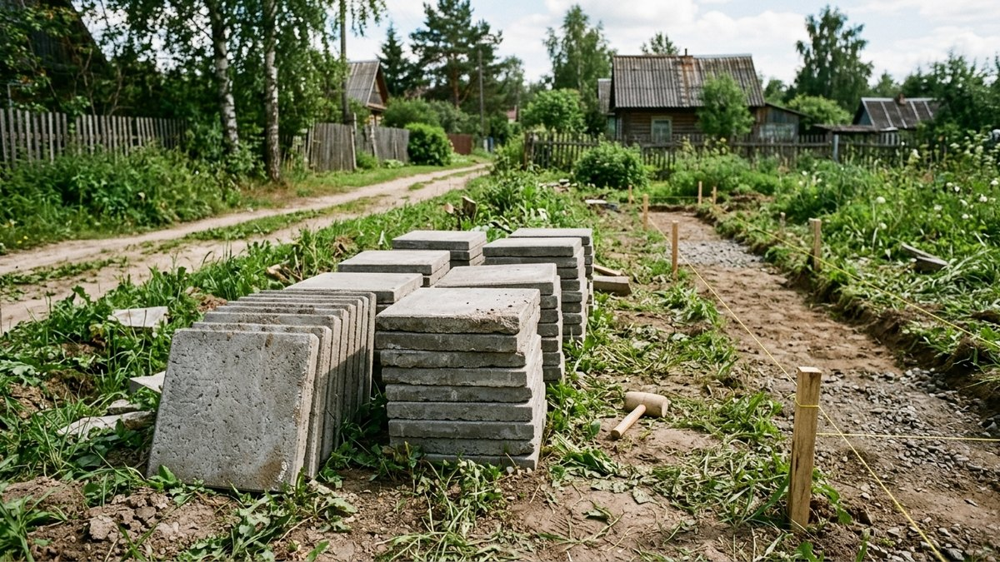
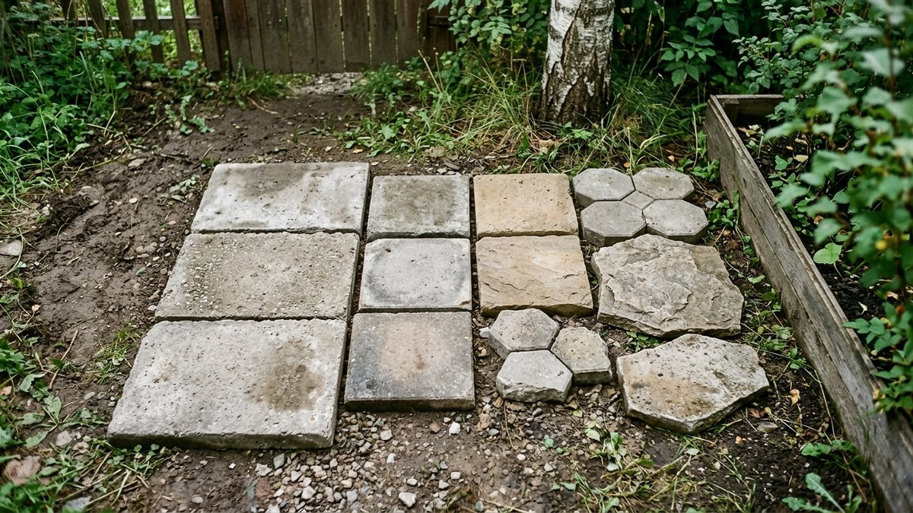
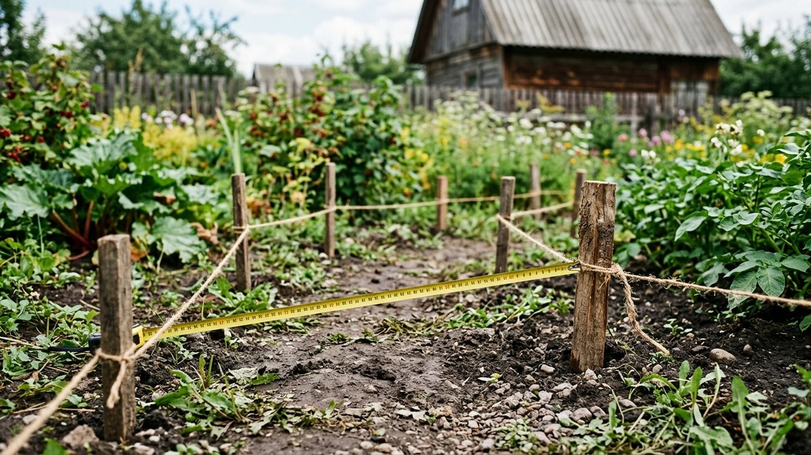
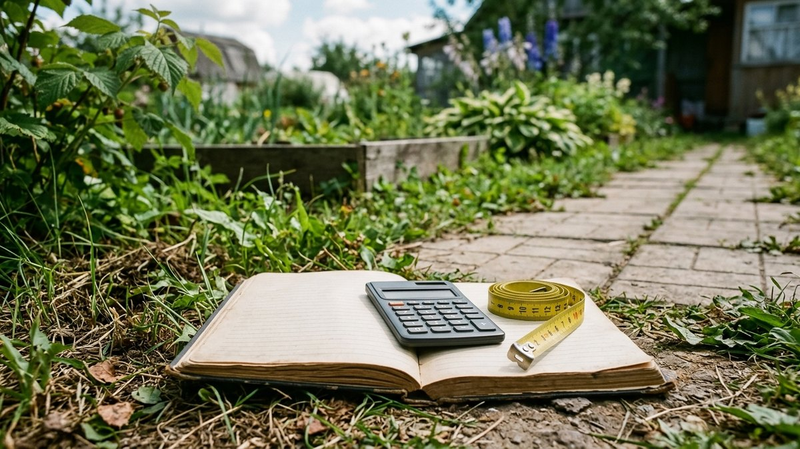
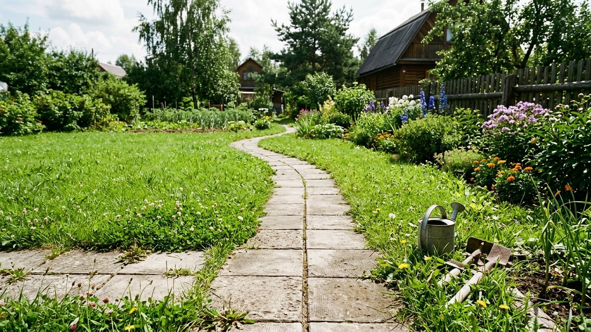
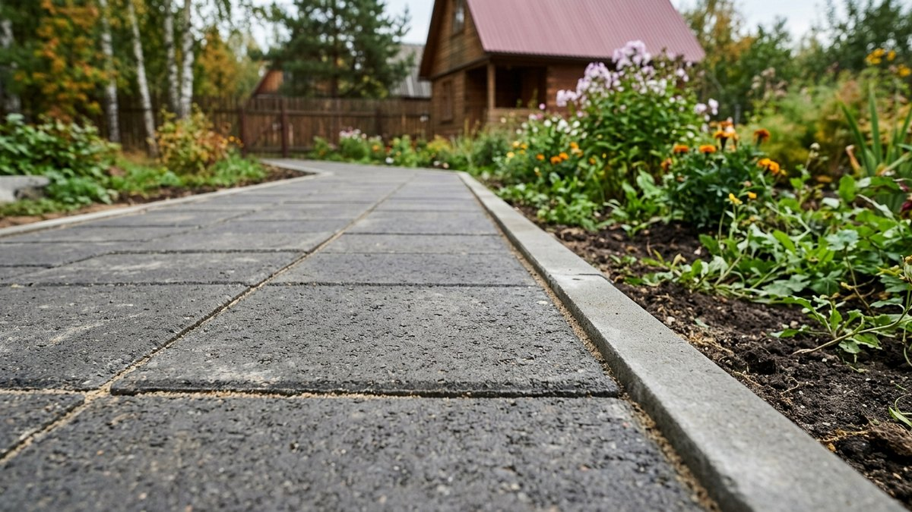

# Как рассчитать количество тротуарной плитки для дорожки

Купить плитку впритык по площади дорожки — почти гарантированно поехать в
магазин второй раз: часть плитки уйдёт на подрезку по краям и вокруг
поворотов, а партия того же цвета и той же даты выпуска может закончиться.
С другой стороны, взять «с большим запасом на глаз» — переплата, которая на
дорожке в 20–30 м² легко достигает нескольких тысяч рублей. Разберём, как
посчитать нужное количество плитки по своим размерам дорожки, а не прикидывать
на глаз.

## Формула расчёта

**Количество плитки = (площадь дорожки ÷ площадь одной плитки) × коэффициент
запаса.**

Площадь дорожки — длина умноженная на ширину в метрах. Площадь одной плитки
берётся из размеров на упаковке. Коэффициент запаса зависит от формы дорожки
и рисунка укладки — подробнее ниже.

## Сколько плитки в одном м²: таблица по размерам

| Размер плитки, мм | Плиток на 1 м² |
|---|---|
| 200×100 («кирпичик») | 50 шт |
| 200×200 | 25 шт |
| 300×300 | 11,1 шт |
| 400×400 | 6,25 шт |
| 500×500 | 4 шт |
| 330×330×330 (шестигранник) | 10,5 шт |

Для нестандартного размера плитки делите 1 м² (10 000 см²) на площадь одной
плитки в см² — формула та же для любых габаритов.

## Коэффициент запаса: сколько добавить на подрезку

- **Прямая дорожка без поворотов, простая укладка** — запас 5%.
- **Дорожка с одним-двумя поворотами** — запас 8–10%.
- **Извилистая дорожка, много подрезки по краю** — запас 12–15%.
- **Диагональная укладка («ёлочкой» под 45°)** — запас 15%, даже на прямом
  участке: диагональные резы у краёв съедают больше плитки, чем прямые.

Заниженный запас на сложной форме — самая частая причина повторной поездки
в магазин, причём партии плитки того же оттенка может уже не быть в наличии.

## Пример расчёта

Дорожка 12 м в длину, 1 метр шириной, с двумя плавными поворотами, плитка
300×300 мм:

1. Площадь дорожки: 12 × 1 = 12 м².
2. Плиток на 1 м² для размера 300×300: 11,1 шт.
3. Плиток без запаса: 12 × 11,1 = 133,2 шт.
4. Запас на повороты — 10%: 133,2 × 1,1 ≈ 147 шт.
5. Округление до полных упаковок (обычно по 12–16 шт в упаковке в
   зависимости от производителя) — уточняется у продавца перед покупкой.

## Считаем стоимость

Когда количество плиток известно, стоимость материала — это количество плиток
умноженное на цену за штуку (или на цену за м², умноженную на площадь с
запасом). К стоимости самой плитки стоит сразу прибавить бордюры по краям
дорожки (погонный метр периметра) и материалы для основания — песок и
щебень, — которые считаются отдельно по объёму, а не по площади плитки.
Порядок подготовки основания и саму укладку плитки шаг за шагом разбирает
статья [садовые дорожки своими руками](https://mir-doma.pro/sadovye-dorozhki-svoimi-rukami/) —
здесь мы считаем только материал, монтаж уже описан там. Если дорожка
прокладывается через участок, где заодно предстоит [посеять
газон](https://mir-doma.pro/kak-poseyat-gazon/), сначала размечайте и
укладывайте плитку — черновая земля вдоль бордюров после укладки почти
неизбежно потревожит края будущего газона.

## 🧮 Калькулятор тротуарной плитки

Введите размеры дорожки и параметры плитки — калькулятор посчитает количество
с запасом на подрезку, упаковки и стоимость, а результатом можно поделиться
в ВКонтакте или Telegram.

<!-- wp:html -->

<h3 class="md-tp__title">Калькулятор тротуарной плитки</h3>

Формула и коэффициенты — те же, что разобраны в статье выше.

<label class="md-tp__f">Длина дорожки, м<input type="number" id="tpLen" value="12" min="0.5" max="500" step="0.1"></label>
<label class="md-tp__f">Ширина дорожки, м<input type="number" id="tpWid" value="1" min="0.3" max="20" step="0.1"></label>
<label class="md-tp__f">Размер плитки
<select id="tpSize">
<option value="50">200×100 мм («кирпичик»)</option>
<option value="25">200×200 мм</option>
<option value="11.11" selected>300×300 мм</option>
<option value="6.25">400×400 мм</option>
<option value="4">500×500 мм</option>
<option value="10.5">330×330 мм (шестигранник)</option>
<option value="custom">Свой размер</option>
</select></label>
<label class="md-tp__f" id="tpCustomWrap" hidden>Свой размер плитки, мм (Ш × Д)
<input type="number" id="tpCw" value="300" min="50" max="1000" step="1"><input type="number" id="tpCh" value="300" min="50" max="1000" step="1"></label>
<label class="md-tp__f">Форма дорожки
<select id="tpRes">
<option value="5">Прямая, без поворотов — запас 5%</option>
<option value="10" selected>1–2 плавных поворота — запас 8–10%</option>
<option value="15">Извилистая, много подрезки — запас 12–15%</option>
<option value="15">Диагональная укладка «ёлочкой» — запас 15%</option>
</select></label>
<label class="md-tp__f">Плиток в упаковке (необязательно)<input type="number" id="tpPack" value="" min="1" max="200" step="1" placeholder="уточните у продавца"></label>
<label class="md-tp__f">Цена за 1 плитку, ₽ (необязательно)<input type="number" id="tpPrice" value="" min="0" max="100000" step="1" placeholder="0"></label>

Площадь дорожки<b id="tpArea">12,0 м²</b>

Плиток без запаса<b id="tpRaw">134 шт</b>

Плиток с запасом<b id="tpFin">147 шт</b>

Упаковок<b id="tpPacks">—</b>

Стоимость плитки<b id="tpCost">—</b>

Число плиток округлено вверх. Если указаны плитки в упаковке, к покупке —
целое число упаковок, стоимость считается по нему.

<button type="button" id="tpCopy" class="md-tp__btn md-tp__btn--main">Скопировать результат</button>
<a id="tpVk" class="md-tp__btn md-tp__btn--vk" href="#" target="_blank" rel="noopener noreferrer">Поделиться ВКонтакте</a>
<a id="tpTg" class="md-tp__btn md-tp__btn--tg" href="#" target="_blank" rel="noopener noreferrer">Поделиться в Telegram</a>
<button type="button" id="tpShareNative" class="md-tp__btn" hidden>Поделиться…</button>
<button type="button" id="tpPrint" class="md-tp__btn">Печать</button>

<!-- /wp:html -->

## Частые ошибки

- **Считать площадь без запаса на подрезку** — на извилистой дорожке
  недостача выявляется уже после укладки половины пути, когда докупить
  плитку из той же партии сложно.
- **Не учитывать разные оттенки в разных партиях.** Тротуарная плитка красится
  партиями, и даже одна и та же артикул-позиция может отличаться по тону
  между заводскими партиями — при докупке через месяц разница будет заметна.
- **Забыть про бордюры** при расчёте бюджета — без них плитка со временем
  расползается по краям, особенно на песчаном основании.
- **Заказывать плитку по площади дорожки без ширины швов** — если укладка
  предполагает заметные швы с песком, реальная площадь одной плитки с учётом
  шва чуть больше, чем указано на упаковке.

## Частые вопросы

### Сколько плитки 300х300 нужно на 10 квадратных метров дорожки

Без запаса — 111 штук (10 × 11,1 шт/м²). С запасом на подрезку 10% —
округляя, около 122 штук.

### Какой запас брать, если дорожка прямая и без поворотов

Для прямой дорожки без поворотов и без диагональной укладки хватает запаса
5% — на подрезку у бордюров и на случай пары треснувших плиток при
транспортировке.

### Как рассчитать плитку на дорожку неправильной формы

Разбейте дорожку на несколько простых участков (прямоугольники, треугольники
на поворотах), посчитайте площадь каждого отдельно и сложите. Запас на
подрезку в этом случае лучше брать по верхней границе — 12–15%, так как
неправильная форма даёт больше отходов на стыках.

### Нужно ли считать плитку для основания отдельно

Нет, плитка считается только по видимой площади дорожки. Песок и щебень для
основания рассчитываются отдельно по объёму (толщина слоя × площадь), это не
связано с количеством самой плитки.

## Заключение

Расчёт плитки — это площадь дорожки, делённая на площадь одной плитки, плюс
обоснованный запас под конкретную форму дорожки: 5% для прямого участка,
12–15% для извилистого или диагональной укладки. Если считаете плитку для
дорожки, которая идёт мимо газона, заодно проверьте, не пора ли обновить сам
газон — осенний [уход за газоном](https://mir-doma.pro/ukhod-za-gazonom-osenyu/)
как раз готовит его к зиме, пока идут работы по дорожке.
