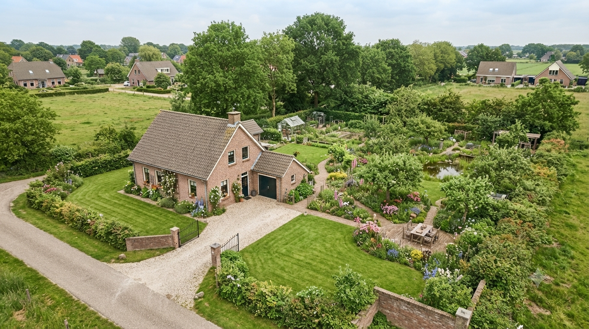
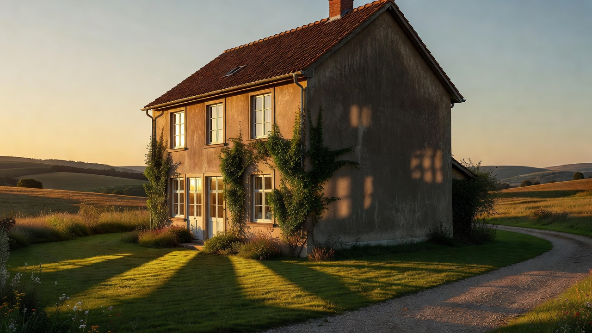
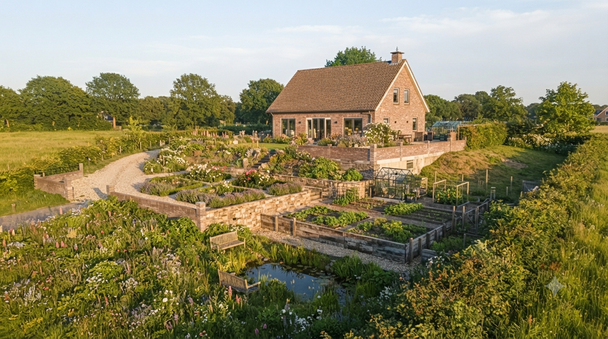
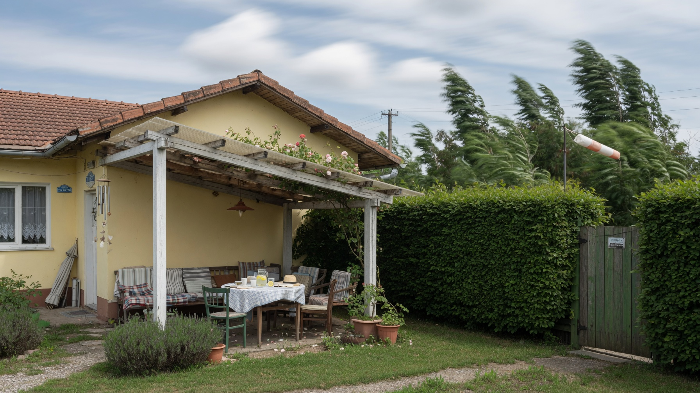
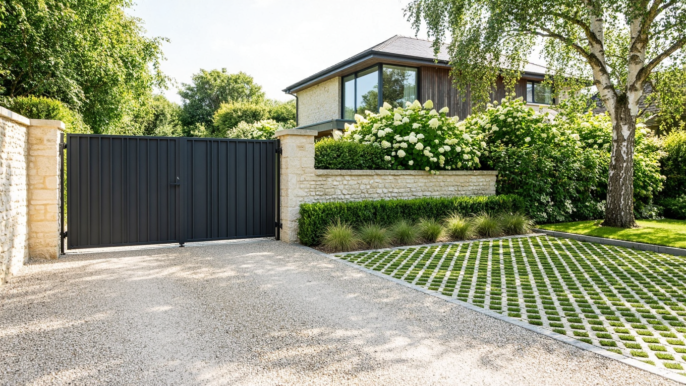
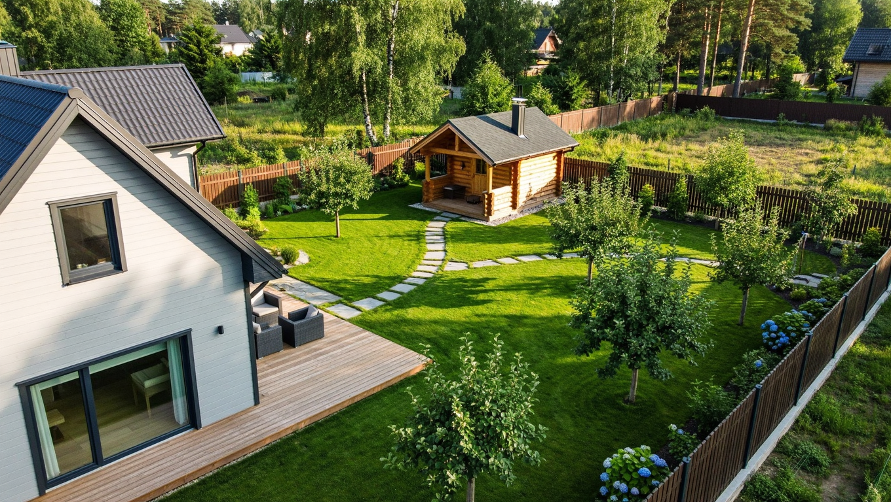

Место для дома выбирают один раз — переставить его потом невозможно, а вот жалеть о неудачном решении придётся годами. От того, где именно встанет дом, зависит, будет ли в комнатах солнце, не затопит ли подвал, останется ли место под сад и не окажется ли зона отдыха под окнами соседей. Разберём, как правильно расположить дом на участке 10 соток: что учесть по сторонам света, уклону и ветру, какие отступы соблюсти и куда при этом вписать баню.

## 🧭 С чего начать выбор места

Прежде чем ставить колышки, соберите исходные данные об участке — именно они и определят место дома:

- **форма и размеры** участка, где проходит въезд и красная линия улицы;
- **стороны света** — куда смотрит фасад, где будет тень;
- **рельеф** — есть ли уклон и куда стекает вода;
- **грунт и уровень грунтовых вод** — от них зависит фундамент;
- **что вокруг** — соседские дома и постройки, дорога, лес, водоём;
- **где будут коммуникации** — скважина или колодец, септик, электрический ввод.

Общая логика зонирования участка разобрана в основной статье про [планировку участка 10 соток](https://mir-doma.pro/planirovka-uchastka-10-sotok/) — здесь же сосредоточимся именно на доме.

## ☀️ Стороны света: как сориентировать дом

Ориентация определяет, сколько солнца получат комнаты и участок. Общие принципы:

- **Север** — сюда выносят помещения, которым солнце не нужно: кладовую, санузел, котельную, гараж, лестницу. Жилых комнат с окнами строго на север лучше избегать.
- **Юг** — самая солнечная сторона: гостиная, детская, веранда. Летом от перегрева спасают навесы и деревья.
- **Восток** — утреннее мягкое солнце: спальня, кухня.
- **Запад** — вечернее солнце: гостиная, столовая, зона отдыха.

Важно и то, **куда падает тень от самого дома**. Дом отбрасывает длинную тень на север, поэтому огород и теплицу размещают с южной стороны от него, а не за домом — иначе грядки будут в тени полдня. По этой же причине дом обычно ставят **ближе к северной границе** участка: так он затеняет минимум полезной площади.

## 📏 Отступы: где ставить нельзя

Свобода выбора ограничена нормами. Ключевые ориентиры:

- от **красной линии улицы** — обычно от 5 м;
- от **границы с соседями (забора)** — от 3 м для жилого дома;
- **противопожарные расстояния до соседских домов** — от 6 до 15 м в зависимости от материала стен.

Нормы различаются по регионам и уставам СНТ и периодически меняются, поэтому перед стройкой их обязательно уточняют. Подробный разбор всех расстояний — в отдельной статье про [расстояние от дома до бани, забора и построек](https://mir-doma.pro/rasstoyanie-ot-doma-do-bani-zabora/).

Практический вывод: **сначала отметьте на плане запретные зоны** (отступы от границ), и станет видно, где дом ставить в принципе можно. Часто после этого выбор сокращается до двух-трёх вариантов.

## ⛰️ Рельеф и уклон участка

Если участок с уклоном, место для дома определяет вода:

- **дом ставят в самой высокой точке** — так к нему не будет стекать дождевая и талая вода, а подвал останется сухим;
- в **низине** дом строить не стоит: там скапливается вода и холодный воздух;
- на **склоне** дом обычно располагают в верхней трети, а зону отдыха и сад — ниже;
- при заметном уклоне сразу продумывают **дренаж и планировку террас**.

Даже небольшой уклон полезно использовать: он естественным образом отводит воду от фундамента, если дом стоит выше по склону.

## 💨 Роза ветров и защита от продувания

Господствующие ветра в каждой местности имеют своё направление — это и есть роза ветров. Учитывать её стоит по двум причинам:

- **дом сам работает щитом** — с наветренной стороны он прикрывает зону отдыха и посадки;
- **входную группу и террасу** располагают с подветренной стороны, чтобы не выдувало тепло и не мело снег к двери;
- дополнительно от ветра защищают **живая изгородь** или плотные посадки со стороны продувания — как её сделать, разбирали в статье про [живую изгородь](https://mir-doma.pro/zhivaya-izgorod/).

## 🚗 Въезд, подъезд и парковка

О подъезде думают одновременно с местом дома:

- **дом ставят ближе к въезду** — короче дорожки, меньше грязи вглубь участка, проще подвозить материалы и дрова;
- сразу закладывают **место под парковку или гараж** у въезда, чтобы машина не ехала через весь участок;
- продумывают **проезд строительной техники**: миксеру и манипулятору нужно подобраться к пятну застройки;
- вход в дом логично обращать к калитке, а хозяйственную зону убирать вглубь, подальше от посторонних глаз.

## 🏗️ Грунт и грунтовые воды

Место под домом проверяют до проекта: тип грунта и уровень грунтовых вод определяют фундамент и его стоимость. Если вода стоит высоко, подвал и цокольный этаж лучше не планировать, а фундамент выбирать с учётом пучения. Иногда выгоднее сместить дом на несколько метров, чем переплачивать за сложный фундамент. Подробнее о подготовке к стройке — в статье про [планировку участка под строительство дома](https://mir-doma.pro/planirovka-uchastka-10-sotok-pod-stroitelstvo/).

## 🧖 Как разместить дом и баню вместе

Баня — вторая по значимости постройка, и её место продумывают вместе с домом:

- **баню отодвигают от дома** (обычно от 8 м) — она пожароопасна и даёт много влаги;
- ставят её **в глубине участка**, в стороне от улицы и соседских окон, рядом с зоной отдыха;
- **от колодца или скважины** баню держат подальше (от 8 м), а стоки обязательно организуют в дренаж или септик;
- удобно, когда между домом и баней есть дорожка и зона отдыха — получается единый «вечерний» сценарий;
- на **узком участке** дом и баню размещают по одной оси, разнося по концам — как это делается, разобрано в статье про [планировку узкого участка с домом и баней](https://mir-doma.pro/planirovka-uzkogo-uchastka-10-sotok/).

Если помимо бани планируются гараж и бассейн, готовые схемы размещения есть в статье про [планировку участка с домом, баней и гаражом](https://mir-doma.pro/planirovka-uchastka-10-sotok-s-baney-garazhom/).

## 📐 Порядок действий: как определить место за 6 шагов

1. **Нанесите участок на план** с размерами, въездом и сторонами света.
2. **Отметьте запретные зоны** — отступы от улицы, забора и соседских построек.
3. **Учтите рельеф** — исключите низины, выберите точку повыше.
4. **Сориентируйте дом** по солнцу: жилые комнаты на юг и восток, подсобные на север.
5. **Проверьте тень** — дом должен затенять как можно меньше огорода и зоны отдыха.
6. **Впишите въезд, парковку и баню**, проверьте расстояния между ними.

Только после этого имеет смысл заказывать проект: место уже определено, и проект подгоняют под него, а не наоборот.

## ❌ Частые ошибки

- **Поставили дом в центре участка** — он делит землю на неудобные обрезки и затеняет всё вокруг.
- **Забыли про тень** — огород и теплица оказались за домом с северной стороны.
- **Выбрали низину** — вода у фундамента, сырость, холодный воздух.
- **Не учли отступы** — конфликт с соседями и риск признания постройки самовольной.
- **Дом далеко от въезда** — длинные коммуникации, дорожки и вечная грязь на участке.
- **Баню прижали к дому или к колодцу** — пожароопасно и грозит загрязнением воды.
- **Не проверили грунт** — фундамент оказался дороже, чем планировали.

Другие промахи планировки разобраны в статье про [ошибки планировки участка](https://mir-doma.pro/oshibki-planirovki-uchastka/).

## ❓ Частые вопросы

**Как правильно расположить дом на участке 10 соток?**
Ближе к въезду и к северной границе, в самой высокой точке участка, с отступом от улицы (обычно от 5 м) и от забора (от 3 м). Жилые комнаты ориентируют на юг и восток, подсобные — на север.

**В какой части участка лучше ставить дом?**
Обычно в передней части, ближе к въезду и северной границе: так дом меньше затеняет сад и огород, а дорожки и коммуникации получаются короче.

**Как сориентировать дом по сторонам света?**
Гостиную и детскую — на юг, спальню и кухню — на восток, зону отдыха и столовую — на запад, а санузел, кладовую и котельную — на север.

**На каком расстоянии от забора можно поставить дом?**
Обычно не ближе 3 метров от границы участка и 5 метров от красной линии улицы, плюс противопожарные расстояния до соседских домов. Точные значения уточняйте в местных правилах и уставе СНТ.

**Где расположить дом на участке с уклоном?**
В верхней части склона — тогда вода будет стекать от дома, а не к нему. Низину под дом не используют: там сыро и скапливается холодный воздух.

**Где поставить баню относительно дома?**
В глубине участка, на расстоянии около 8 метров от дома и не ближе 8 метров от колодца, со стоком в дренаж или септик. Удобно, когда баня соседствует с зоной отдыха.

**Что сначала — проект дома или выбор места?**
Сначала место: оно зависит от границ, рельефа, солнца и въезда. Проект потом подгоняют под выбранное пятно застройки, а не наоборот.

---

Место для дома выбирают на пересечении четырёх условий: нормы отступов, солнце, рельеф и въезд. Сложите их на плане — и подходящих вариантов останется немного, а неудачные отпадут сами. Дом ближе к въезду и северной границе, на возвышении, с жилыми комнатами на юг — универсальная схема, которая работает на большинстве участков. Дальше остаётся распределить остальные зоны: как это сделать, читайте в статьях про [планировку участка 10 соток](https://mir-doma.pro/planirovka-uchastka-10-sotok/) и [зонирование участка](https://mir-doma.pro/zonirovanie-uchastka-10-sotok/).
