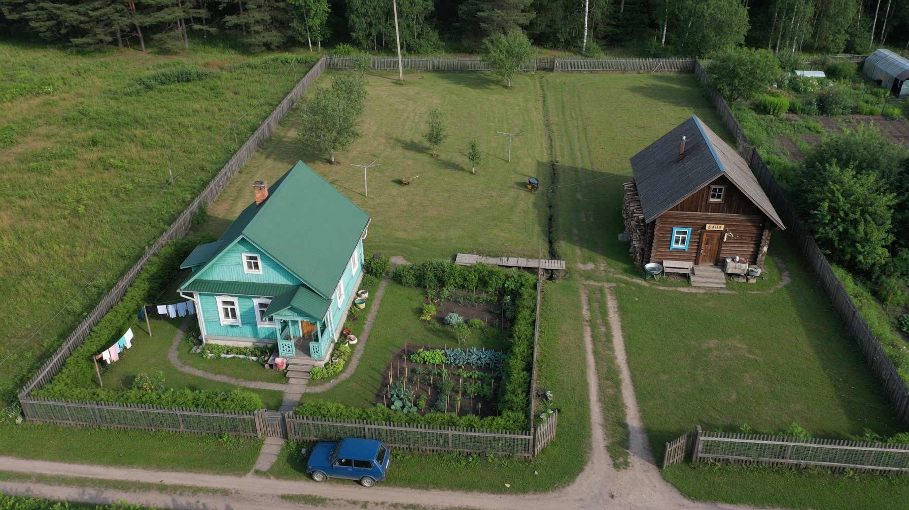
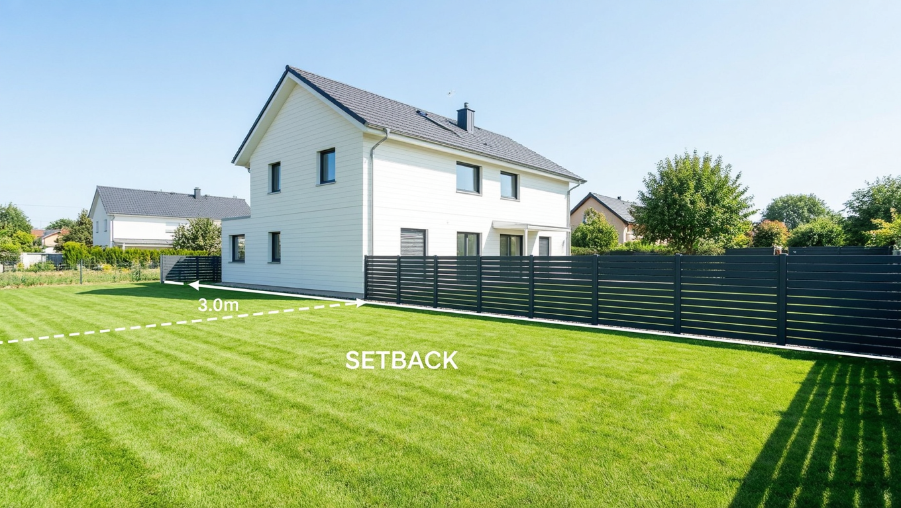
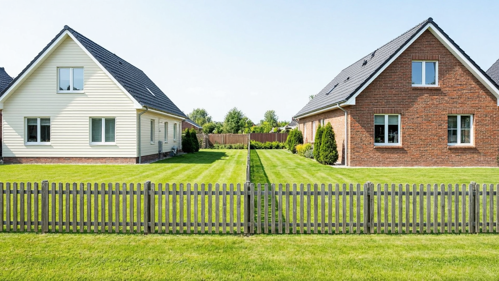
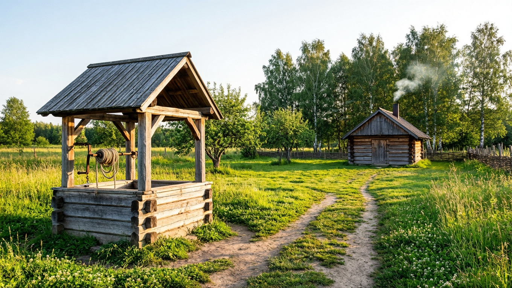
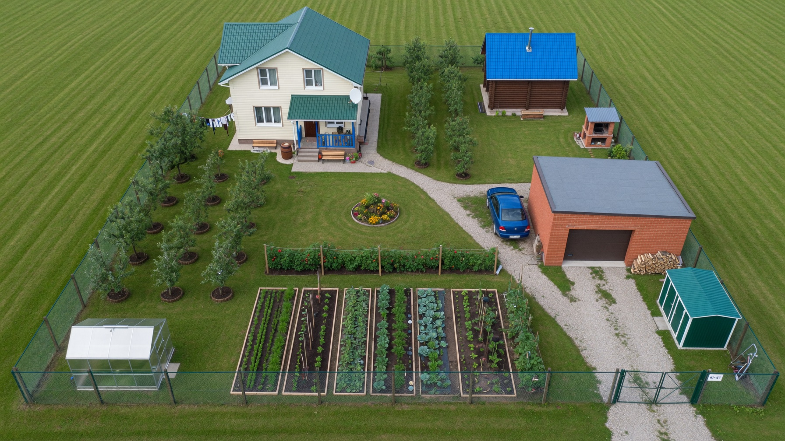
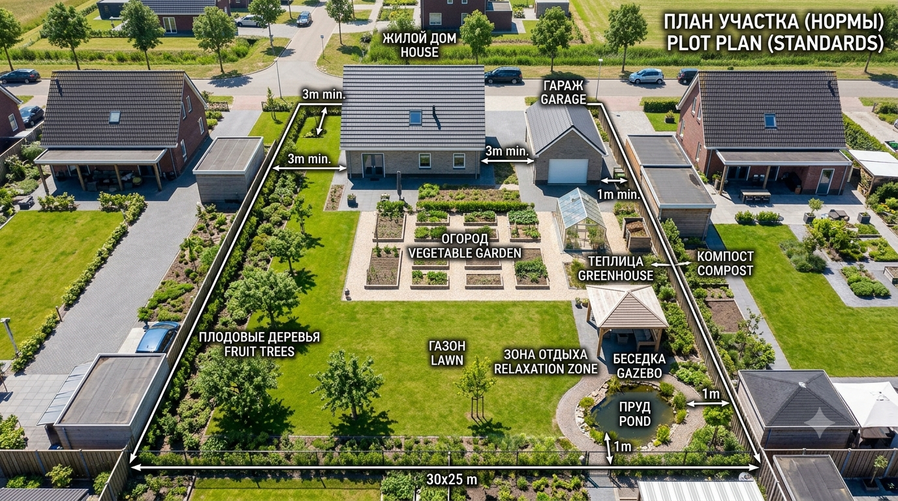

Прежде чем ставить на участке дом, баню или гараж, важно знать нормы расстояний — сколько метров отступать от забора, соседских построек и собственных объектов. Эти правила защищают от пожара, затенения и споров с соседями, а их нарушение грозит штрафом и даже требованием снести постройку. Разберём основные противопожарные, санитарные и строительные расстояния при размещении дома, бани и других построек на участке.

## ⚠️ Важно: нормы меняются

Сразу главное: конкретные цифры расстояний **регулируются нормами (СНиП/СП), местными правилами застройки и уставом СНТ**, и они периодически меняются и различаются по регионам. Приведённые ниже значения — общепринятые ориентиры, но перед строительством **обязательно уточните действующие нормы** в местной администрации, правилах вашего СНТ и актуальной редакции сводов правил. Эта статья поможет понять логику и не упустить важное, но не заменяет официальные документы.

## 📏 Отступы от забора

Это самые частые и спорные расстояния. Общепринятые минимальные отступы от границы участка (забора):

- **жилой дом** — от 3 м;
- **баня, гараж, хозпостройки** — от 1 м;
- **постройки для скота и птицы** — от 4 м;
- **высокие деревья** — от 4 м, средние — от 2 м, кусты — от 1 м.

Важный нюанс: отступ считают **до границы участка**, а скат крыши должен быть направлен на свой участок (или предусмотрен водоотвод), чтобы дождь и снег не сходили к соседу. Если постройка ближе к границе — обычно требуется письменное согласие соседа.

## 🔥 Противопожарные расстояния между домами

Это **самые важные** нормы — они про безопасность и касаются расстояния между жилыми домами (своим и соседскими), а не до забора. Зависят от материала стен:

| Материал соседних домов | Минимальное расстояние |
|---|---|
| Оба каменные/бетонные (негорючие) | 6 м |
| Каменный и деревянный | 8 м |
| Оба деревянные (горючие) | от 10–15 м |

Логика простая: чем более горючие материалы, тем дальше дома друг от друга. Расстояние считают между ближайшими выступающими частями домов. Эти нормы действуют **между участками**, поэтому итоговое положение вашего дома зависит и от того, где стоит дом соседа.

## 🚿 Санитарные расстояния внутри участка

Эти нормы защищают от загрязнения воды и антисанитарии — расстояния между объектами на вашем участке:

- **от дома (погреба) до туалета, компоста, построек для животных** — от 12 м;
- **от колодца/скважины до туалета, септика, компоста, навозохранилища** — от 20 м (защита питьевой воды от загрязнения);
- **от бани, душа до колодца** — от 8 м;
- **от дома до бани** — обычно от 8 м (баня — источник влаги и повышенной пожароопасности).

Ключевой принцип: **источник чистой воды (колодец, скважина) размещают выше и дальше от всех источников загрязнения** — туалета, септика, компоста, скотного двора. Как выбрать сам источник, разбирали в статье [скважина или колодец](https://mir-doma.pro/skvazhina-ili-kolodec/), а про отвод стоков — в материале про [септик для дачи](https://mir-doma.pro/septik-dlya-dachi/).

## 🏠 Расстояние от дома до бани

Отдельно про баню, потому что это самый частый вопрос. Баня совмещает два риска — **огонь и влагу**, поэтому её отодвигают и от своего дома, и от границы:

- **от бани до жилого дома** — обычно от 8 м (особенно если баня с печью на дровах);
- **от бани до забора** — от 1 м;
- **от бани до колодца** — от 8 м (стоки не должны загрязнять воду);
- слив из бани обязательно организуют (дренаж или в септик), а не сбрасывают на грунт у границы.

Если баня встроена в дом или пристроена, к ней предъявляют повышенные требования по пожарной безопасности (разделка дымохода, негорючие материалы).

## 🗺️ Как учесть нормы при планировке

Чтобы не переделывать, нормы закладывают **на этапе плана**, а не при стройке:

1. **Начните с дома** — от него отсчитываются многие расстояния; учтите отступ от улицы (обычно 5 м) и от забора (3 м).
2. **Разместите источник воды** — колодец/скважину подальше от будущих туалета, септика и компоста.
3. **Определите место туалета, септика, компоста** — с соблюдением санитарных расстояний до дома и воды.
4. **Впишите баню** — с отступом от дома и забора, продумав слив.
5. **Проверьте противопожарные расстояния** до соседских домов.
6. **Расставьте хозпостройки, гараж** — с отступом от забора от 1 м.

А как выбрать само место для дома — по сторонам света, рельефу и въезду — разобрано в статье про [расположение дома на участке](https://mir-doma.pro/raspolozhenie-doma-na-uchastke/). Общие принципы зонирования и распределения площади разобраны в основной статье про [планировку участка 10 соток](https://mir-doma.pro/planirovka-uchastka-10-sotok/), а конкретные схемы с домом, баней и гаражом — в статье про [планировку участка с баней и гаражом](https://mir-doma.pro/planirovka-uchastka-10-sotok-s-baney-garazhom/).

## ❌ Частые ошибки

- **Поставили баню или дом впритык к забору** — нарушение норм, конфликт с соседями и риск сноса.
- **Не учли противопожарное расстояние до соседского дома** — самое серьёзное нарушение.
- **Колодец рядом с туалетом или септиком** — загрязнение питьевой воды.
- **Скат крыши направлен на участок соседа** — вода и снег сходят к нему, это повод для претензий.
- **Строили без согласования и уточнения местных правил** — задним числом узаконить сложнее.
- **Не оформили согласие соседа** при отступе меньше нормы — постройку могут признать самовольной.

## ❓ Частые вопросы

**Какое расстояние должно быть от дома до бани?**
Обычно не менее 8 метров, особенно для бани с дровяной печью, — из-за пожароопасности и влажности. Точную норму уточняйте в местных правилах и уставе СНТ.

**Сколько метров от бани до забора?**
Как правило, не менее 1 метра от границы участка, при этом скат крыши направляют на свой участок и организуют слив, чтобы не беспокоить соседей.

**Какое расстояние между домами по пожарным нормам?**
Зависит от материала: между двумя каменными домами — от 6 м, между каменным и деревянным — от 8 м, между двумя деревянными — от 10–15 м. Считают между ближайшими частями домов.

**На каком расстоянии от забора можно строить дом?**
Жилой дом — обычно не ближе 3 метров от границы участка, хозпостройки и гараж — от 1 метра. Меньший отступ требует согласия соседа.

**Сколько метров от колодца до септика и туалета?**
Не менее 20 метров — это санитарная норма для защиты питьевой воды от загрязнения. Источник воды размещают выше и дальше от всех источников загрязнения.

**Что будет, если нарушить нормы расстояний?**
Возможны штраф, предписание устранить нарушение и в тяжёлых случаях требование снести постройку через суд, а также конфликты с соседями. Поэтому нормы соблюдают ещё на этапе планировки.

---

Нормы расстояний — это не бюрократия, а защита от пожара, загрязнения воды и споров с соседями. Ключевых ориентиров немного: дом — от 3 м до забора, баня — от 8 м до дома и от 1 м до забора, колодец — от 20 м до септика и туалета, а между домами — противопожарные 6–15 м по материалу. Но обязательно сверьтесь с актуальными местными правилами и уставом СНТ. А как грамотно расставить все объекты на участке — в цикле статей про [планировку участка 10 соток](https://mir-doma.pro/planirovka-uchastka-10-sotok/) и [планировку с баней и гаражом](https://mir-doma.pro/planirovka-uchastka-10-sotok-s-baney-garazhom/).
