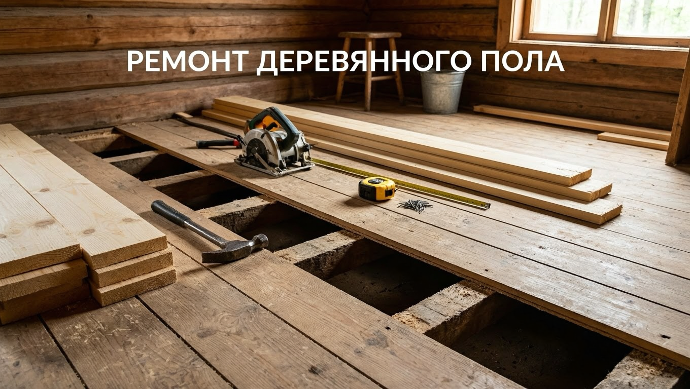
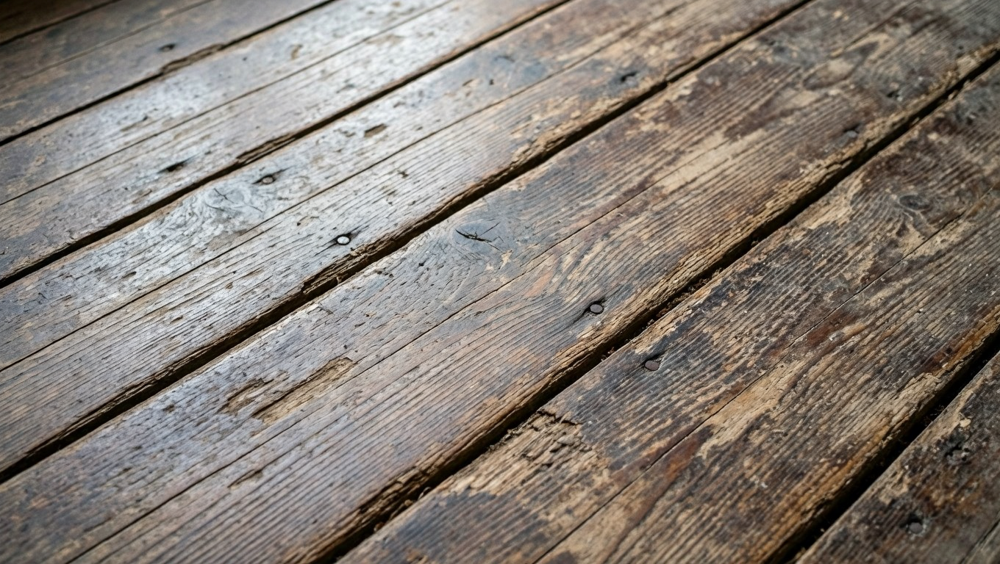
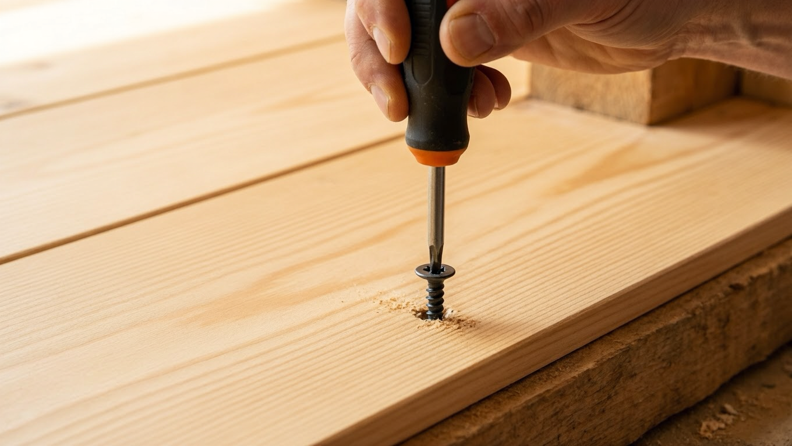
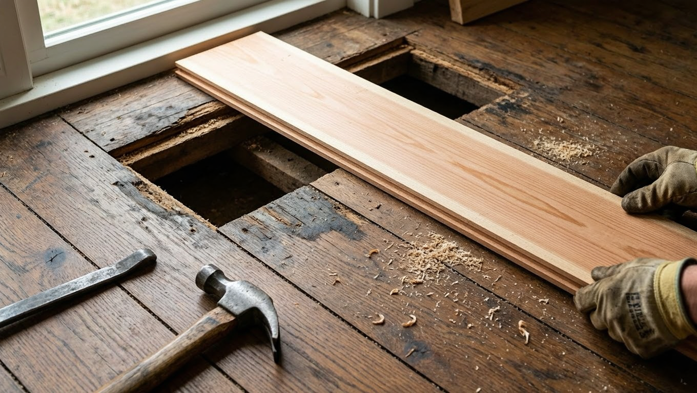
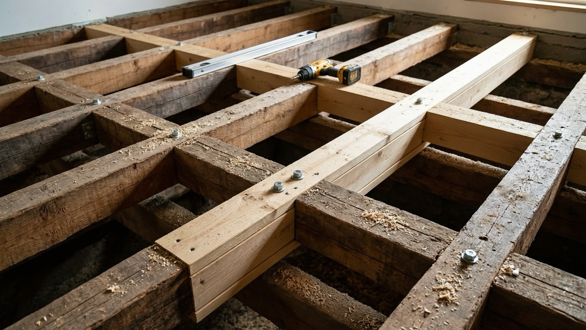
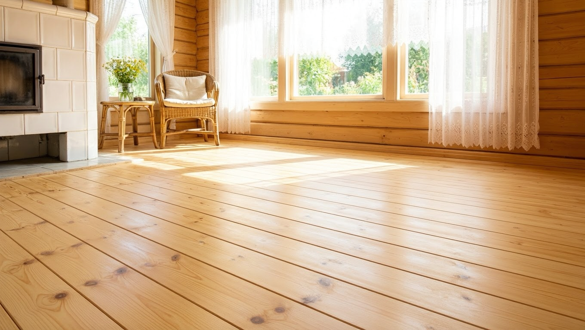

Деревянный пол на даче служит долго, но со временем начинает скрипеть, прогибаться, между досками появляются щели, а кое-где древесину поражает гниль. Всё это чинится своими руками — от быстрого устранения скрипа до полной переборки пола. Разберём, как отремонтировать деревянный пол на даче: убрать скрип, заменить испорченные доски, усилить лаги и обновить старое покрытие.

## 🔍 Почему деревянный пол требует ремонта

Понимание причины подсказывает способ ремонта. Типичные проблемы:

- **Скрип** — доски трутся друг о друга или о лаги из-за ослабших креплений.
- **Прогиб и «батут»** — пол пружинит под ногами: слабые или редко уложенные лаги, тонкие доски.
- **Щели** — древесина рассохлась и уменьшилась в объёме.
- **Гниль и грибок** — следствие сырости и плохой вентиляции подпола.
- **Шаткие, проваливающиеся доски** — износ или повреждение отдельных досок и лаг.

Дальше — как справиться с каждой проблемой.

## 🧰 Что понадобится для ремонта

Набор инструментов и материалов зависит от объёма работ, но чаще всего нужны:

- **шуруповёрт и саморезы** — для притягивания досок к лагам;
- **ножовка или электролобзик** — чтобы аккуратно выпилить испорченные доски;
- **монтировка (гвоздодёр)** — для демонтажа;
- **уровень** — выставить лаги и доски в плоскость;
- **антисептик** — обработать новую и старую древесину от гнили;
- **шпатлёвка по дереву** — заделать щели и шляпки саморезов;
- **шлифмашина** — для циклёвки и обновления покрытия.

Полный список полезного на участке инвентаря — в статье про [инструменты для дачи](https://mir-doma.pro/instrumenty-dlya-dachi/). Для мелкого ремонта хватит шуруповёрта, пилы и антисептика.

## 🔊 Как убрать скрип пола

Скрип — самая частая жалоба. Способы, от простого к основательному:

- **Притянуть доски саморезами** к лагам — самый надёжный способ. Саморезы вкручивают в местах скрипа, попадая точно в лагу; шляпки утапливают.
- **Забить клинья** между лагой и доской снизу (если есть доступ из подполья) — убирает люфт.
- **Засыпать в щели** тальк, графит или сухую смазку — уменьшает трение как временная мера.
- **Стянуть рассохшиеся доски** — при переборке пола доски сплачивают плотнее друг к другу.

Если скрипит весь пол и доски сильно разошлись, надёжнее перебрать покрытие целиком.

## 🪵 Замена рассохшихся и сгнивших досок

Отдельные испорченные доски меняют, не разбирая весь пол:

1. Найти повреждённую доску — гнилая темнеет, крошится, проминается, может пахнуть сыростью.
2. Аккуратно вскрыть её (выпилить), не задев соседние.
3. Осмотреть лагу под ней — если и она поражена гнилью, ремонтируют и лагу.
4. Подобрать новую доску той же толщины, обработать антисептиком, уложить и закрепить.

Важно найти и устранить **причину гнили** (сырость, отсутствие вентиляции), иначе новая доска сгниёт так же.

## 🏗️ Усиление и замена лаг

Если пол прогибается и пружинит, дело в лагах:

- **Добавить лаги** — между существующими укладывают дополнительные, уменьшая пролёт и прогиб.
- **Заменить повреждённые лаги** — сгнившие или треснувшие меняют на новые, обязательно обработанные антисептиком.
- **Выровнять по уровню** — новые лаги выставляют строго в плоскость на подкладках, чтобы пол был ровным.

Работа с лагами требует вскрытия пола, поэтому её удобно совмещать с утеплением — раз пол вскрыт, стоит сразу уложить утеплитель. Как это сделать, подробно в статье про [утепление пола на даче](https://mir-doma.pro/uteplenie-pola-na-dache/).

## 🧩 Как заделать щели в полу

Щели между досками убирают по-разному в зависимости от размера:

- **Мелкие** — шпатлёвкой по дереву или самодельной пастой из клея ПВА и опилок.
- **Средние** — вбивают в щель тонкие рейки или шнур на клею, затем шлифуют.
- **Большие и множественные** — проще перебрать пол, плотно сплотив доски заново.

После заделки пол шлифуют и красят — заплатки становятся незаметными.

## ✨ Обновление старого пола

Когда пол крепкий, но потерял вид, его обновляют:

- **Циклёвка или шлифовка** снимает старую краску и выравнивает поверхность до чистого дерева.
- **Покраска или лак** — свежий слой защищает древесину и освежает вид; для дачи подходят износостойкие краски для пола.
- **Настил поверх** — на старый ровный пол можно уложить фанеру и новое покрытие (линолеум, ламинат), если не хочется возиться с досками.

О том, как обновить не только пол, но и всю дачу с минимальным бюджетом, — в статье про [обновление старой дачи](https://mir-doma.pro/kak-obnovit-staruyu-dachu/).

## 🛡️ Профилактика гниения и скрипа

Чтобы отремонтированный пол долго не доставлял хлопот:

- обеспечьте **вентиляцию подпола** — открытые продухи в цоколе выводят сырость;
- обрабатывайте деревянные элементы **антисептиком** от гнили и грибка;
- устраняйте протечки и источники сырости;
- при укладке нового пола оставляйте зазоры на температурные подвижки древесины.

## ❌ Частые ошибки

- **Замаскировали гниль, не устранив причину** — сырость продолжает разрушать пол.
- **Прибили доски гвоздями вместо саморезов** — гвозди со временем расшатываются, и скрип возвращается.
- **Не обработали новые доски и лаги антисептиком** — они сгниют так же, как старые.
- **Заложили продухи наглухо** — подпол не проветривается, дерево гниёт.

## ❓ Частые вопросы

**Как убрать скрип деревянного пола, не вскрывая его?**
Притянуть скрипящие доски саморезами к лагам сверху (шляпки утопить и зашпаклевать) или засыпать в щели тальк либо графит. Саморезы — самый надёжный способ без разборки пола.

**Чем заделать щели в деревянном полу?**
Мелкие — шпатлёвкой по дереву или пастой из ПВА с опилками, средние — тонкими рейками на клею. При больших щелях пол лучше перебрать, сплотив доски.

**Как заменить одну сгнившую доску в полу?**
Выпилить повреждённую доску, осмотреть лагу под ней, подобрать новую доску той же толщины, обработать антисептиком и закрепить. Главное — устранить причину сырости.

**Почему деревянный пол прогибается и пружинит?**
Из-за слабых, редко уложенных или повреждённых лаг, а также слишком тонких досок. Решение — добавить или заменить лаги, уменьшив пролёт.

**Чем обработать деревянный пол от гниения?**
Антисептическими пропитками для дерева. Их наносят на лаги и доски (особенно новые) и обязательно налаживают вентиляцию подпола, иначе обработка не спасёт.

**Отремонтировать пол или менять полностью?**
Если лаги и большая часть досок целы, выгоднее локальный ремонт и обновление. Полную замену делают, когда гнилью поражены лаги и значительная часть покрытия.

---

Ремонт деревянного пола по силам сделать самому: устраните скрип саморезами, замените испорченные доски, при необходимости усильте лаги и обновите покрытие. И обязательно уберите причину проблем — сырость. А раз пол вскрыт, самое время его [утеплить](https://mir-doma.pro/uteplenie-pola-na-dache/), чтобы на даче стало по-настоящему тепло.
